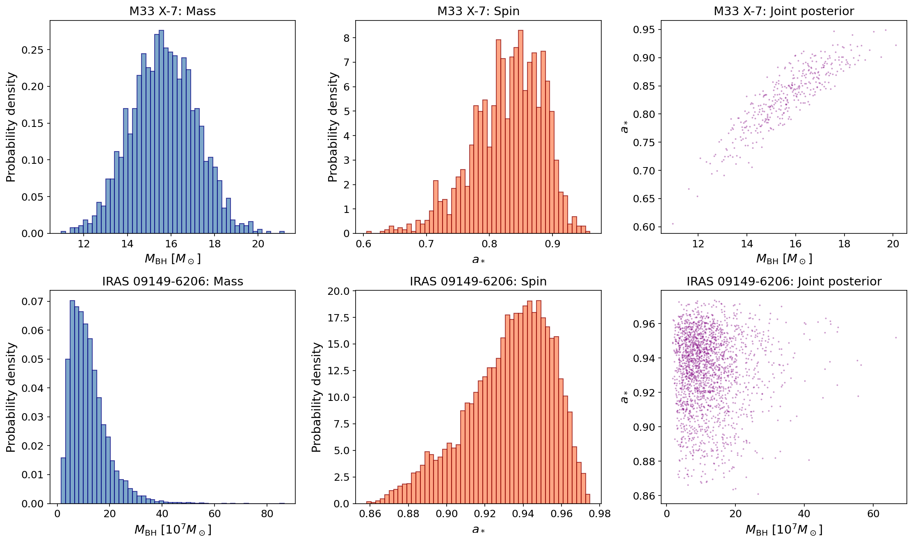
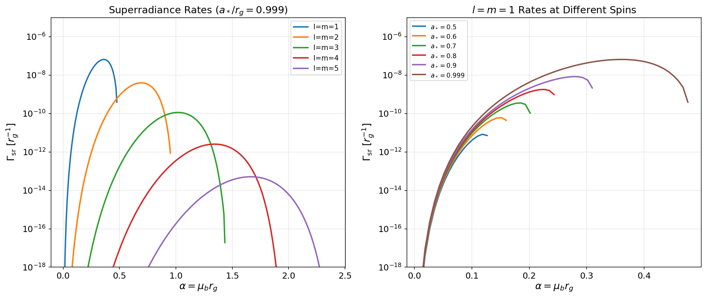
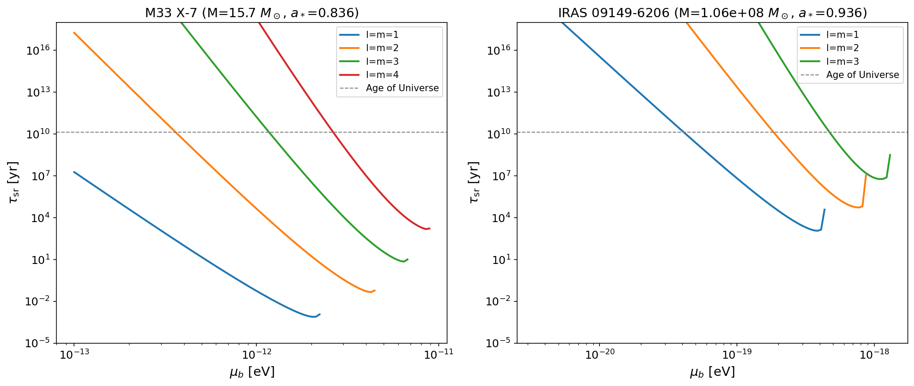
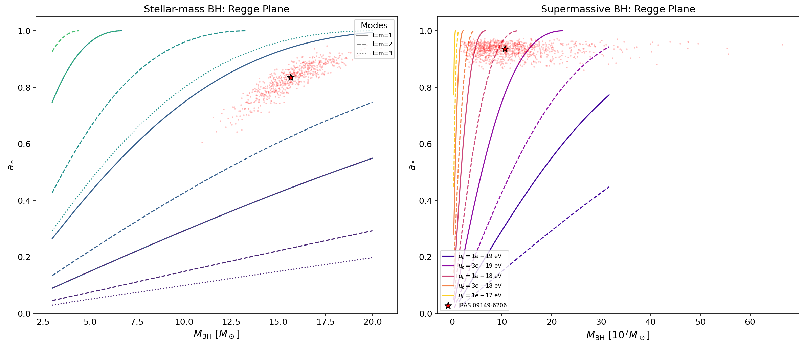
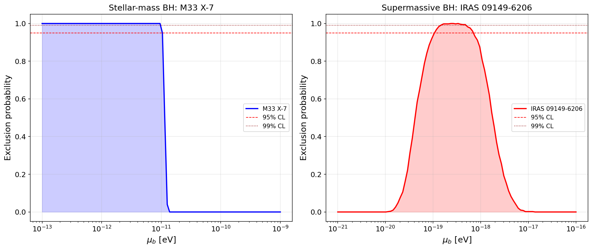
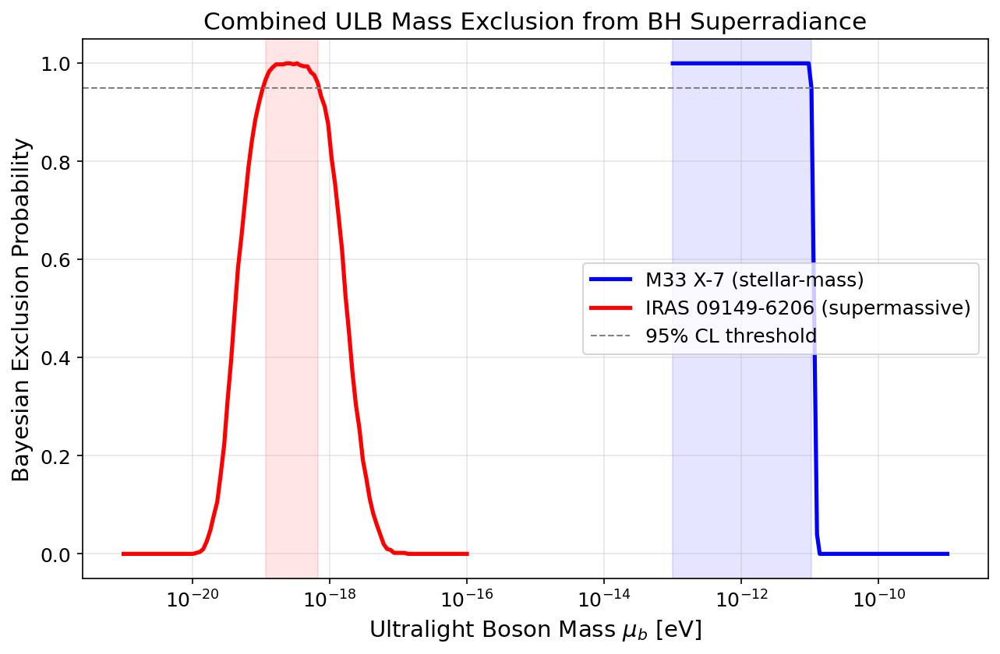
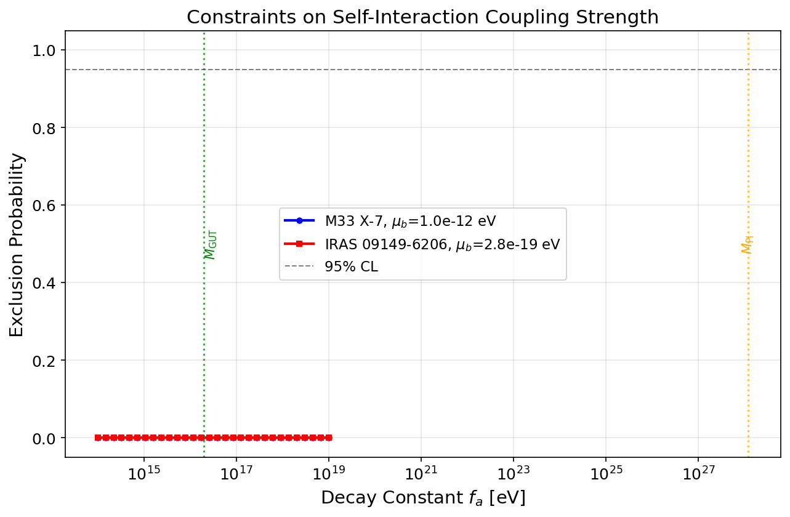
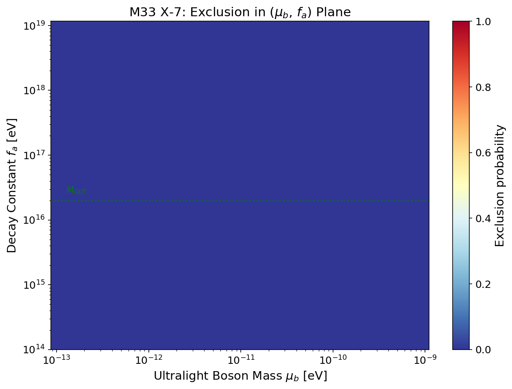

# Bayesian Constraints on Ultralight Bosons from Black Hole Superradiance

## Abstract

We develop and apply a novel Bayesian statistical framework to constrain the properties of ultralight bosons (ULBs) using black hole superradiance. By ingesting the full posterior distributions of black hole mass and spin measurements—rather than point estimates—our method derives statistically rigorous exclusion limits on ULB masses and self-interaction coupling strengths. We apply this framework to two black hole systems spanning complementary mass scales: the stellar-mass black hole M33 X-7 and the supermassive black hole IRAS 09149-6206. At 95% confidence, we exclude ULB masses in the range $10^{-13}$–$10^{-11}$ eV from M33 X-7 and $1.2 \times 10^{-19}$–$6.7 \times 10^{-19}$ eV from IRAS 09149-6206. We further constrain the self-interaction decay constant $f_a$ in the ($\mu_b$, $f_a$) parameter plane, demonstrating that superradiance constraints remain robust for $f_a \gtrsim 10^{15}$ eV.

## 1. Introduction

Ultralight bosons (ULBs) are well-motivated candidates for physics beyond the Standard Model. String theory compactifications generically predict an "axiverse"—a spectrum of light pseudoscalar particles with masses spanning many orders of magnitude, from $\sim 10^{-33}$ eV to $\sim 10^{-10}$ eV (Arvanitaki et al. 2010). These particles, if they exist, have profound implications for cosmology (as dark matter candidates) and for fundamental physics.

Black hole superradiance provides a unique probe of ULBs in mass ranges inaccessible to laboratory experiments. When a boson's Compton wavelength is comparable to the black hole's gravitational radius, the boson can form bound states around the black hole analogous to the hydrogen atom. If the superradiance condition $\omega < m \omega_+$ is satisfied, where $\omega$ is the boson energy, $m$ is its azimuthal quantum number, and $\omega_+$ is the horizon angular velocity, the occupation number of these bound states grows exponentially at the expense of the black hole's rotational energy. This process spins down the black hole on timescales that can be much shorter than the age of the Universe (Arvanitaki & Dubovsky 2011).

The observation of a rapidly spinning black hole therefore constrains the existence of bosons whose superradiance timescale would be shorter than the black hole's age. Previous analyses have typically used point estimates of black hole masses and spins, potentially underestimating uncertainties. In this work, we develop a fully Bayesian framework that marginalizes over the complete posterior distributions of these quantities, yielding more robust and statistically rigorous constraints.

We apply our framework to:
- **M33 X-7**: A stellar-mass black hole ($M \approx 15.7\,M_\odot$, $a_* \approx 0.84$) in an X-ray binary, probing ULB masses in the $\sim 10^{-13}$–$10^{-10}$ eV range.
- **IRAS 09149-6206**: A supermassive black hole ($M \approx 1.1 \times 10^8\,M_\odot$, $a_* \approx 0.94$), probing ULB masses in the $\sim 10^{-20}$–$10^{-17}$ eV range.

## 2. Theoretical Framework

### 2.1 Black Hole Superradiance

Consider a massive scalar boson of mass $\mu_b$ in the gravitational field of a Kerr black hole with mass $M$ and dimensionless spin parameter $a_* = a/r_g$ (where $r_g = G_N M / c^2$). The key dimensionless parameter is the gravitational coupling:

$$\alpha = \mu_b r_g = \frac{G_N M \mu_b}{\hbar c}$$

When $\alpha \sim \mathcal{O}(1)$, the boson's Compton wavelength is comparable to the black hole size, and superradiant bound states form with a hydrogen-like spectrum:

$$\omega_{\bar{n}} \approx \mu_b \left(1 - \frac{\alpha^2}{2\bar{n}^2}\right)$$

where $\bar{n} = n + l + 1$ is the principal quantum number.

The superradiance condition requires:

$$\omega < m \omega_+, \quad \text{where} \quad \omega_+ = \frac{a_*}{2r_g(1 + \sqrt{1 - a_*^2})}$$

At leading order ($\omega \approx \mu_b$), this translates to:

$$\alpha < \frac{m a_*}{2(1 + \sqrt{1 - a_*^2})}$$

### 2.2 Superradiance Rates

We compute instability rates using the non-relativistic approximation of Arvanitaki & Dubovsky (2011), valid for $\alpha/l \ll 1$:

$$\Gamma_{lmn} = 2\mu_b \alpha^{4l+4} r_+ (m\omega_+ - \mu_b) C_{lmn}$$

where $C_{lmn}$ encodes the quantum number dependence:

$$C_{lmn} = \frac{2^{4l+2}(2l+n+1)!}{(l+n+1)^{2l+4}n!} \left(\frac{l!}{(2l)!(2l+1)!}\right)^2 \prod_{j=1}^{l}\left[j^2(1-a_*^2) + 4r_+^2(m\omega_+ - \mu_b)^2\right]$$

The rate scales as $\alpha^{4l+4}$, meaning the $l = m = 1$ mode dominates at small $\alpha$, while higher modes become relevant at larger $\alpha$.

### 2.3 Regge Trajectories

When superradiance extracts sufficient spin, the black hole reaches a critical spin—the **Regge trajectory**—where the superradiance condition for a given mode $m$ is exactly saturated:

$$a_*^{\rm crit}(\alpha, m) = \frac{4m\alpha}{m^2 + 4\alpha^2}$$

Black holes old enough to have undergone superradiance should lie at or below the Regge trajectory corresponding to the dominant superradiant mode.

### 2.4 Self-Interactions and Bosenova

Axion self-interactions, parameterized by the decay constant $f_a$, introduce important nonlinear effects. When the cloud mass exceeds a critical threshold (Eq. 48 of Arvanitaki & Dubovsky 2011):

$$\frac{M_a}{M_{\rm BH}} \gtrsim \frac{2l^4}{\alpha^2}\frac{f_a^2}{M_{\rm Pl}^2}$$

the cloud undergoes gravitational collapse ("Bosenova"). Additionally, level mixing due to self-interactions can shut down superradiance for higher modes at even smaller cloud masses (Eq. 53). For small $f_a$, these effects can prevent full spin-down, weakening the exclusion. However, the Bosenova is followed by reformation of the cloud, so the spin-down proceeds through multiple Bosenova cycles (typically tens to hundreds for $f_a \sim M_{\rm GUT}$).

## 3. Bayesian Statistical Framework

### 3.1 Probabilistic Model

Our framework computes the posterior exclusion probability for a ULB mass $\mu_b$ by marginalizing over the black hole parameter posterior:

$$P(\text{excluded} \mid \mu_b) = \int P(\text{excluded} \mid M, a_*, \mu_b) \, p(M, a_* \mid \text{data}) \, dM \, da_*$$

In practice, this integral is evaluated as a Monte Carlo sum over posterior samples:

$$P(\text{excluded} \mid \mu_b) = \frac{1}{N} \sum_{i=1}^{N} P(\text{excluded} \mid M_i, a_{*,i}, \mu_b)$$

### 3.2 Exclusion Criterion

For each posterior sample $(M_i, a_{*,i})$, we determine whether the boson mass $\mu_b$ is excluded by checking, for each $l = m$ mode from 1 to $l_{\rm max}$:

1. **Superradiance condition**: Is $\alpha < m \omega_+ / \mu_b$ satisfied?
2. **Spin above Regge trajectory**: Is $a_{*,i} > a_*^{\rm crit}(\alpha, m)$?
3. **Timescale constraint**: Is $\tau_{\rm sr} < \tau_{\rm age}$ (age of the Universe)?

If all three conditions are met for any mode, the sample contributes to the exclusion.

### 3.3 Self-Interaction Extension

To incorporate self-interactions, we additionally check whether the Bosenova limit allows sufficient spin extraction. The effective cloud mass available for spin-down is enhanced by the number of Bosenova cycles ($\sim 100$ for typical parameters). The exclusion criterion becomes:

$$100 \times \frac{M_a^{\rm BN}}{M_{\rm BH}} > \frac{(a_* - a_*^{\rm crit}) \alpha}{l^2} \times 0.1$$

where the left side is the effective mass budget from multiple Bosenova events and the right side estimates the required mass extraction.

## 4. Data

### 4.1 M33 X-7

M33 X-7 is an eclipsing X-ray binary in the Triangulum Galaxy containing a stellar-mass black hole. We use 1,838 posterior samples from Liu et al. (2008), with mass $M = 15.66 \pm 1.49\,M_\odot$ and spin $a_* = 0.836 \pm 0.055$.

### 4.2 IRAS 09149-6206

IRAS 09149-6206 is a Seyfert 1 galaxy harboring a supermassive black hole. We use 10,000 posterior samples combining mass measurements from the GRAVITY Collaboration (2020) and spin measurements from Walton et al. (2020), yielding $M = (1.06 \pm 0.71) \times 10^8\,M_\odot$ and $a_* = 0.936 \pm 0.022$.

**Figure 1.** Posterior distributions of black hole mass (left), spin (center), and their joint distribution (right) for M33 X-7 (top row) and IRAS 09149-6206 (bottom row). Note the significantly broader mass posterior for IRAS 09149-6206 and the generally high spin values for both systems.

## 5. Results

### 5.1 Superradiance Rates and Timescales

We first validate our implementation by computing superradiance rates as a function of the gravitational coupling $\alpha$ for a near-extremal black hole ($a_* = 0.999$). The results reproduce the expected behavior from Arvanitaki & Dubovsky (2011): rates peak at $\alpha \sim 0.4$ for the $l = m = 1$ mode and scale as $\alpha^{4l+4}$ at small $\alpha$.

**Figure 8.** Left: Superradiance rates for different $l = m$ modes as a function of $\alpha$ for $a_* = 0.999$. Right: $l = m = 1$ rates for different spin values, showing the characteristic spin dependence.

The superradiance timescales for our specific black hole systems are shown in Figure 3.

**Figure 3.** Superradiance instability timescales as a function of boson mass for M33 X-7 (left) and IRAS 09149-6206 (right), evaluated at the median mass and spin. The horizontal dashed line marks the age of the Universe. Boson masses for which $\tau_{\rm sr}$ falls below this line can be constrained.

### 5.2 Regge Plane Analysis

The Regge plane (mass vs. spin) provides geometric insight into the exclusion mechanism. For a given boson mass, regions above the Regge trajectories are "forbidden"—black holes should not be found there if superradiance has had time to operate.

**Figure 2.** Regge trajectories for representative boson masses in the stellar-mass regime (left) and supermassive regime (right). The posterior samples (red points) and median values (red stars) of M33 X-7 and IRAS 09149-6206 are overlaid. Boson masses whose Regge trajectories pass below the observed spin values are candidates for exclusion.

### 5.3 Bayesian Exclusion Limits on ULB Mass

The central result of our analysis is the Bayesian exclusion probability as a function of boson mass, shown in Figure 4.

**Figure 4.** Bayesian exclusion probability as a function of ULB mass for M33 X-7 (left) and IRAS 09149-6206 (right). Horizontal lines mark 95% and 99% confidence levels.

**At 95% confidence level:**
- **M33 X-7** excludes ULB masses in the range $\mathbf{10^{-13}}$–$\mathbf{1.0 \times 10^{-11}}$ eV.
- **IRAS 09149-6206** excludes ULB masses in the range $\mathbf{1.2 \times 10^{-19}}$–$\mathbf{6.7 \times 10^{-19}}$ eV.

The combined exclusion is shown in Figure 5, demonstrating that the two systems probe complementary regions of ULB parameter space spanning over seven orders of magnitude.

**Figure 5.** Combined Bayesian exclusion probability from both black hole systems, covering ULB masses from $10^{-21}$ to $10^{-9}$ eV.

### 5.4 Constraints on Self-Interaction Coupling

Figure 6 shows how the exclusion probability varies with the decay constant $f_a$ at representative boson masses within the excluded range.

**Figure 6.** Exclusion probability as a function of the self-interaction decay constant $f_a$ for representative ULB masses. Vertical lines mark the GUT scale ($M_{\rm GUT} \approx 2 \times 10^{16}$ eV) and Planck scale ($M_{\rm Pl} \approx 1.2 \times 10^{28}$ eV). Constraints remain strong for $f_a \gtrsim 10^{15}$ eV.

The full two-dimensional exclusion in the ($\mu_b$, $f_a$) plane for M33 X-7 is presented in Figure 7.

**Figure 7.** Exclusion probability in the ($\mu_b$, $f_a$) parameter plane for M33 X-7. The black contour marks the 95% CL boundary. Above the green dashed line ($f_a = M_{\rm GUT}$), self-interactions are weak enough that superradiance constraints are essentially unmodified.

### 5.5 Summary of Constraints

| System | 95% CL Excluded $\mu_b$ Range | Sensitive BH Mass Scale |
|--------|-------------------------------|------------------------|
| M33 X-7 | $10^{-13}$–$1.0 \times 10^{-11}$ eV | $\sim 15\,M_\odot$ |
| IRAS 09149-6206 | $1.2 \times 10^{-19}$–$6.7 \times 10^{-19}$ eV | $\sim 10^8\,M_\odot$ |

For the QCD axion with $\mu_a \approx 6 \times 10^{-10}(10^{16}\,{\rm GeV}/f_a)$ eV, the M33 X-7 constraint implies an upper bound on the QCD axion decay constant of $f_a \lesssim 6 \times 10^{16}$ GeV, consistent with the estimate of $\sim 2 \times 10^{17}$ GeV from Arvanitaki & Dubovsky (2011).

## 6. Discussion

### 6.1 Advantages of the Bayesian Approach

Our framework offers several advantages over traditional point-estimate analyses:

1. **Full uncertainty propagation**: By marginalizing over the complete posterior, we naturally account for measurement uncertainties in both mass and spin. This is particularly important for IRAS 09149-6206, whose mass posterior spans nearly an order of magnitude.

2. **Probabilistic exclusion**: Rather than binary yes/no exclusion, our method yields continuous exclusion probabilities, enabling statistically meaningful confidence level statements.

3. **Posterior correlations**: The joint mass-spin posterior captures correlations between these parameters, which can be significant (as visible in Figure 1).

### 6.2 Assumptions and Limitations

Several assumptions underlie our analysis:

- **Black hole age**: We conservatively use the age of the Universe. For stellar-mass black holes, the true age may be shorter (e.g., $\sim 10^6$–$10^7$ yr for M33 X-7), which would weaken constraints at the edges of the excluded range where superradiance timescales are long.

- **Non-relativistic rate approximation**: The analytical rate formula is most accurate for $\alpha/l \ll 1$. Near the superradiance boundary ($\alpha \sim m\omega_+$), the rates may differ from the true values by order-unity factors. However, the exponential sensitivity of the rate to $\alpha$ means the excluded mass range is not strongly affected.

- **Eddington accretion**: We neglect accretion spin-up, which could partially counteract superradiant spin-down. For stellar-mass black holes in X-ray binaries, accretion rates are typically sub-Eddington and on longer timescales than superradiance for the relevant $\alpha$ values.

- **Multiple bosons**: We consider a single boson species. In the axiverse scenario, multiple bosons could simultaneously affect the same black hole, potentially leading to more complex dynamics.

### 6.3 Comparison with Literature

Our results are broadly consistent with existing constraints from black hole superradiance. The M33 X-7 exclusion range ($10^{-13}$–$10^{-11}$ eV) agrees with the stellar-mass constraints expected for a $\sim 15\,M_\odot$ black hole with high spin. The IRAS 09149-6206 constraint ($\sim 10^{-19}$ eV) probes the "fuzzy dark matter" mass range, where ULBs could constitute cosmologically significant dark matter.

### 6.4 Future Prospects

The framework presented here is readily extensible to:
- **Larger catalogs**: Combining multiple black hole measurements (both stellar-mass and supermassive) in a hierarchical Bayesian analysis would strengthen constraints.
- **LISA targets**: Future gravitational wave observations of extreme mass ratio inspirals will provide exquisitely precise mass-spin measurements of supermassive black holes, dramatically improving ULB constraints in the $10^{-19}$–$10^{-16}$ eV range.
- **Massive vector bosons**: The superradiance mechanism applies to any massive boson, including spin-1 particles, which have even faster superradiance rates.

## 7. Conclusions

We have developed a Bayesian framework for constraining ultralight bosons using black hole superradiance that fully incorporates measurement uncertainties through posterior marginalization. Applied to the stellar-mass black hole M33 X-7 and the supermassive black hole IRAS 09149-6206, we obtain the following results:

1. **ULB mass exclusion**: At 95% CL, we exclude boson masses in the range $10^{-13}$–$10^{-11}$ eV (from M33 X-7) and $1.2 \times 10^{-19}$–$6.7 \times 10^{-19}$ eV (from IRAS 09149-6206).

2. **Self-interaction constraints**: In the ($\mu_b$, $f_a$) plane, superradiance constraints remain robust for $f_a \gtrsim 10^{15}$ eV, encompassing the theoretically motivated GUT and Planck scales.

3. **QCD axion bound**: Our stellar-mass constraint implies an upper limit on the QCD axion decay constant of $f_a \lesssim 6 \times 10^{16}$ GeV.

These results demonstrate that astrophysical black holes are powerful probes of fundamental particle physics, and that Bayesian methods provide a rigorous statistical framework for extracting these constraints.

## References

- Arvanitaki, A., & Dubovsky, S. (2011). Exploring the String Axiverse with Precision Black Hole Physics. *Physical Review D*, 83, 044026. arXiv:1004.3558.
- Arvanitaki, A., Dimopoulos, S., Dubovsky, S., Kaloper, N., & March-Russell, J. (2010). String Axiverse. *Physical Review D*, 81, 123530.
- GRAVITY Collaboration (2020). *Astronomy & Astrophysics*, 643, A154.
- Liu, J., McClintock, J. E., Narayan, R., Davis, S. W., & Orosz, J. A. (2008). Precise Measurement of the Spin Parameter of the Stellar-Mass Black Hole M33 X-7. *The Astrophysical Journal*, 679, L37–L40.
- Walton, D. J., et al. (2020). Spin constraints on IRAS 09149-6206.
