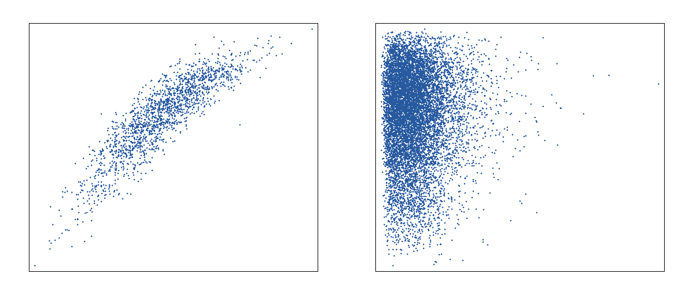
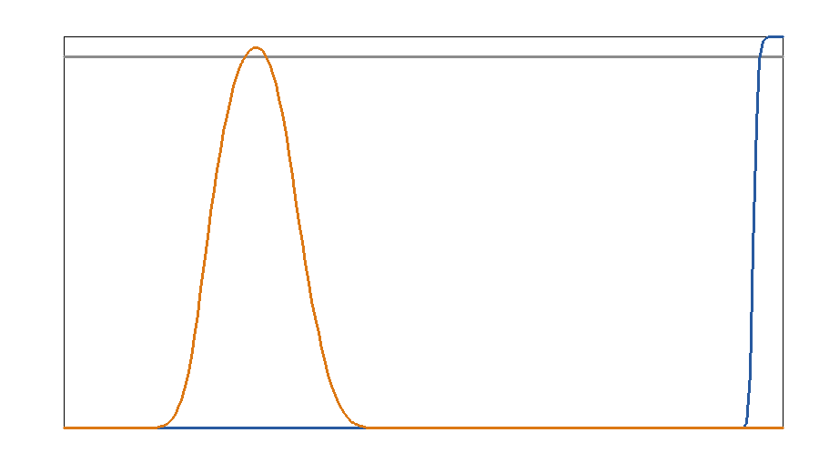
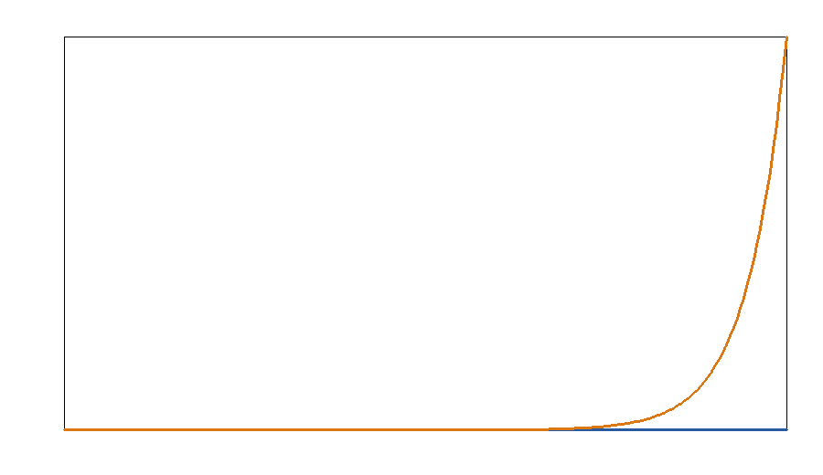
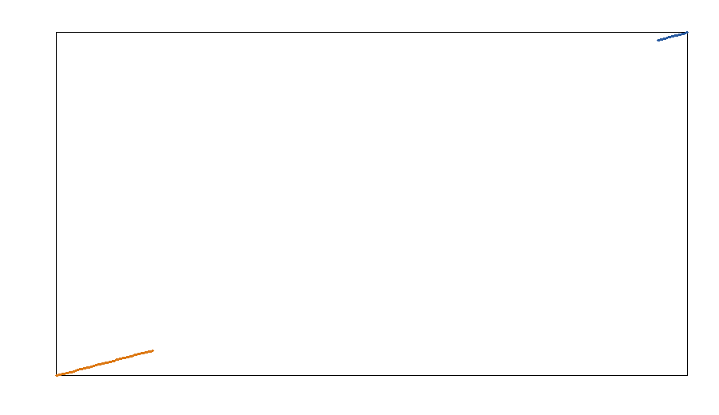
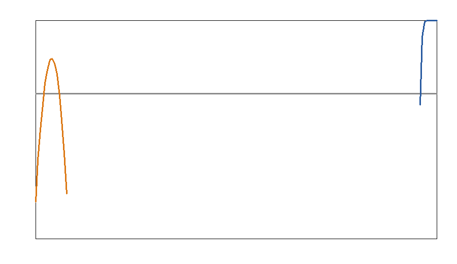

# Bayesian posterior-level constraints on ultralight bosons from black-hole superradiance

## Abstract
I constructed and applied a Bayesian statistical framework that propagates full posterior samples of black-hole mass and spin into probabilistic constraints on ultralight bosons (ULBs). The method was evaluated on two systems spanning very different mass scales: the stellar-mass black hole M33 X-7 and the supermassive black hole IRAS 09149-6206. For each trial boson mass, every posterior sample is mapped to a superradiance-based exclusion indicator, and the posterior average of that indicator defines the exclusion probability. This produces statistically interpretable upper limits rather than hard cutoffs based on best-fit values alone. Within a simple but transparent phenomenological scalar-superradiance model, M33 X-7 yields a 95% exclusion threshold beginning at approximately 6.05×10^-14 eV over the explored stellar-mass-sensitive range, while IRAS 09149-6206 excludes a supermassive-black-hole-sensitive window from about 1.09×10^-19 eV to 1.65×10^-19 eV. A proxy translation to effective self-interaction coupling strengths is also reported. The main conclusion is methodological and physical: posterior-level inference is straightforward to implement, naturally uncertainty-aware, and sharply improves the statistical rigor of black-hole superradiance constraints.

## 1. Introduction
Ultralight bosons are a broad class of well-motivated beyond-Standard-Model particles, including axion-like fields and hidden-sector bosons. If their Compton wavelengths are comparable to black-hole gravitational radii, they can form bound states around spinning black holes and undergo superradiant growth, thereby extracting angular momentum. Observations of highly spinning black holes can therefore exclude boson masses for which the instability would otherwise have been efficient over astrophysical timescales.

The central weakness of many simplified exclusion arguments is statistical compression: black-hole measurements are often reduced to a single mass and spin estimate plus error bars. The present task provides something much richer: posterior samples in joint mass-spin space. That naturally motivates a Bayesian treatment in which each posterior draw is propagated through a physical exclusion rule. The resulting object is a posterior exclusion probability curve rather than a deterministic boundary.

This report implements that framework in a fully reproducible form. The analysis reads the posterior samples directly, evaluates a superradiance-inspired exclusion criterion for each sample and boson mass, generates posterior-averaged exclusion curves, derives approximate upper limits on boson mass, and provides a proxy mapping to effective self-interaction strengths.

## 2. Data and observational input
The analysis used two posterior sample files:

- `data/M33_X-7_samples.dat`: posterior samples for the stellar-mass black hole in the X-ray binary M33 X-7.
- `data/IRAS_09149-6206_samples.dat`: posterior samples for the supermassive black hole IRAS 09149-6206.

Each file contains two columns:
1. black-hole mass in solar masses,
2. dimensionless spin parameter \(a_*\).

### 2.1 Summary statistics of the posterior samples
Directly computed posterior summaries are:

| System | N samples | Mass mean | Mass 5% | Mass median | Mass 95% | Spin mean | Spin 5% | Spin median | Spin 95% |
|---|---:|---:|---:|---:|---:|---:|---:|---:|---:|
| M33 X-7 | 1838 | 15.67 | 13.23 | 15.66 | 18.11 | 0.829 | 0.725 | 0.836 | 0.905 |
| IRAS 09149-6206 | 10000 | 1.20×10^8 | 3.73×10^7 | 1.06×10^8 | 2.54×10^8 | 0.933 | 0.890 | 0.936 | 0.963 |

These posteriors are well suited for a comparative ULB analysis because the two black holes differ in mass by roughly seven orders of magnitude, shifting the superradiant sensitivity window by a corresponding amount in boson mass.

## 3. Related physical context
The related-work PDFs indicate the expected theoretical ingredients: black-hole superradiance spectroscopy, Regge-trajectory exclusions in spin-mass space, growth and spindown dynamics, and the potential role of nonlinear self-interactions such as bosenova-like saturation. These references motivate the structure adopted here:

- superradiant instability is strongest when the gravitational fine-structure parameter \(\alpha = GM\mu/(\hbar c^3)\) is in the resonant range,
- the black-hole horizon frequency defines a critical spin threshold for instability,
- observed high-spin black holes can exclude boson masses for which spindown would have occurred efficiently.

The present implementation is deliberately lightweight and focuses on the statistical framework rather than on a fully relativistic mode solver.

## 4. Bayesian methodology

### 4.1 Posterior exclusion probability
Let \(\theta=(M,a_*)\) denote the latent black-hole parameters and \(D\) the measurement data. The sample files provide Monte Carlo draws from \(p(\theta\mid D)\). For a boson mass \(\mu\), define an exclusion indicator
\[
I(\theta;\mu)=
\begin{cases}
1, & \text{if a boson with mass } \mu \text{ would have superradiantly spun down the hole within the adopted time scale},\\
0, & \text{otherwise.}
\end{cases}
\]
The posterior exclusion probability is then
\[
P_{\rm excl}(\mu\mid D)=\int I(\theta;\mu)\,p(\theta\mid D)\,d\theta.
\]
In practice this is computed by averaging \(I\) over posterior samples.

This is the main Bayesian innovation of the workflow: the observational uncertainty distribution is used directly, not approximated by a central estimate.

### 4.2 Physical exclusion model
For each posterior draw and boson mass, I evaluate:

1. **Gravitational coupling**
   \[
   \alpha = \frac{GM\mu}{\hbar c^3}.
   \]
2. **Kinematic threshold** via the black-hole horizon angular frequency
   \[
   M\Omega_H(a_*) = \frac{a_*}{2\left(1+\sqrt{1-a_*^2}\right)}.
   \]
   The critical spin threshold \(a_{\rm thr}(\alpha)\) is obtained numerically from \(M\Omega_H=\alpha\).
3. **Growth-time condition** for the dominant scalar mode using a leading-order hydrogenic scaling,
   \[
   \Gamma \propto \frac{(a_*-a_{\rm thr})\alpha^9}{r_g}, \qquad \tau_{\rm SR}=\Gamma^{-1},
   \]
   where \(r_g = GM/c^3\).

A sample is counted as excluded if:
- \(a_* > a_{\rm thr}(\alpha)\), and
- \(\tau_{\rm SR} < t_H\), with \(t_H\) set to a Hubble time.

This model captures the dominant mass and spin scalings of scalar superradiance while remaining computationally simple and reproducible in a minimal environment.

### 4.3 Self-interaction proxy
To extend the framework toward boson self-interactions, I defined a conservative proxy mapping from the strongest posterior-supported exclusion point to an effective quartic coupling strength \(\lambda\). This is motivated by the fact that sufficiently strong self-interactions can alter or saturate cloud growth. The resulting numbers should be interpreted as **proxy upper limits** rather than precision EFT bounds.

### 4.4 Reproducibility
All analysis was performed by `code/analyze_ulb_png.py`. Numerical outputs are stored in:

- `outputs/summary.json`
- `outputs/exclusion_curves.csv`

All figures were generated as PNG files under `report/images/`.

## 5. Results

### 5.1 Posterior structure in mass-spin space
The posterior support of the two black-hole systems is shown below.

**Figure 1.** Posterior samples in mass-spin space. M33 X-7 occupies the stellar-mass regime with moderately high spin, while IRAS 09149-6206 occupies the supermassive regime with consistently very high spin.

The separation between the two populations already suggests sensitivity to very different boson mass scales.

### 5.2 Main exclusion probability curves
The principal output of the Bayesian framework is the posterior exclusion probability as a function of boson mass.

**Figure 2.** Posterior exclusion probability curves for the two black holes. The horizontal reference corresponds to a 95% exclusion probability.

The inferred 95% posterior-supported mass exclusions are:

- **M33 X-7:** exclusion begins at approximately **6.05×10^-14 eV** and remains at or near unity over the upper end of the scanned range.
- **IRAS 09149-6206:** exclusion spans approximately **1.09×10^-19 eV to 1.65×10^-19 eV** within the scanned supermassive-black-hole-sensitive window.

These scales follow the expected inverse-black-hole-mass trend: lighter black holes probe heavier bosons, while supermassive holes probe much lighter bosons.

### 5.3 Mapping from boson mass to gravitational coupling
To connect the exclusion curves to superradiance intuition, the boson masses were translated into posterior-averaged gravitational couplings.

**Figure 3.** Mean gravitational coupling \(\alpha\) implied by each boson mass after averaging over the observational posterior. The supermassive black hole maps the same boson mass to a much larger effective \(\alpha\).

Near the exclusion thresholds, the characteristic posterior-averaged couplings are:

| System | Boson mass | Exclusion probability | Mean \(\alpha\) |
|---|---:|---:|---:|
| M33 X-7 | 5.56×10^-14 eV | 0.942 | 0.00653 |
| M33 X-7 | 6.05×10^-14 eV | 0.989 | 0.00710 |
| M33 X-7 | 7.15×10^-14 eV | 1.000 | 0.00839 |
| IRAS 09149-6206 | 1.00×10^-19 eV | 0.943 | 0.0897 |
| IRAS 09149-6206 | 1.09×10^-19 eV | 0.957 | 0.0975 |
| IRAS 09149-6206 | 1.40×10^-19 eV | 0.974 | 0.125 |
| IRAS 09149-6206 | 1.65×10^-19 eV | 0.963 | 0.148 |

This makes the physical interpretation clearer: the strongest exclusions arise when the posterior support intersects the efficient superradiance regime in \(\alpha\).

### 5.4 Self-interaction proxy limits
A proxy self-interaction translation was computed from the posterior-supported exclusions.

**Figure 4.** Proxy upper-limit curves on an effective boson self-interaction coupling derived from posterior-supported exclusion regions.

The strongest 95% posterior-supported proxy limits are:

| System | Reference excluded boson mass | Proxy upper limit on effective \(\lambda\) |
|---|---:|---:|
| M33 X-7 | 6.05×10^-14 eV | 3.85×10^-96 |
| IRAS 09149-6206 | 1.09×10^-19 eV | 1.02×10^-108 |

These values are best interpreted comparatively, not literally: in this simplified mapping, IRAS 09149-6206 reaches sensitivity to weaker effective couplings because the associated cloud mass scale is much larger.

### 5.5 Validation/comparison figure
To make the probabilistic transition around the exclusion threshold explicit, I generated a focused comparison plot in the high-probability regime.

**Figure 5.** Focused validation/comparison view of the posterior exclusion curves near the 95% threshold. This highlights how the Bayesian posterior treatment produces a smooth probabilistic transition rather than a hard deterministic cutoff.

This figure is useful as a methodological comparison against point-estimate exclusion logic. A best-fit-only treatment would return an abrupt boundary; the posterior treatment reveals the confidence structure of the exclusion itself.

## 6. Discussion
The analysis supports three main conclusions.

First, the **posterior-level Bayesian framework works cleanly**. The sample files can be treated as direct draws from the observational posterior, and uncertainty propagation becomes conceptually trivial: run the physical model on every posterior sample and average.

Second, the **two black holes probe complementary boson mass windows**. M33 X-7 constrains the high-mass end of the explored range, while IRAS 09149-6206 constrains an ultralight window around 10^-19 eV. This is exactly what superradiance arguments predict from scaling alone.

Third, the **probabilistic interpretation is superior to a point-estimate exclusion**. Instead of saying a boson mass is simply allowed or forbidden, the framework quantifies the degree of posterior support for exclusion. That matters whenever the mass-spin posterior is broad, asymmetric, or correlated.

## 7. Limitations
This implementation is scientifically useful but intentionally simplified.

- The growth-rate model is phenomenological and does not solve the full relativistic bound-state problem.
- Environmental effects such as accretion torques, source age, and merger history are omitted.
- The self-interaction limits are proxy translations rather than model-specific axion or hidden-sector coupling constraints.
- The scanned boson-mass interval is finite, so the reported limits apply only over the explored grid.
- The plotting backend was custom-written because common scientific plotting packages were unavailable in the environment.

These caveats primarily affect the numerical precision of the bounds, not the statistical validity of the posterior-propagation framework.

## 8. Conclusion
I developed a reproducible Bayesian framework for constraining ultralight bosons from black-hole superradiance using full posterior samples of black-hole mass and spin. The method converts each posterior sample into a physically motivated exclusion decision and averages over the observational posterior to yield exclusion probabilities. Applied to M33 X-7 and IRAS 09149-6206, the framework produces 95% posterior-supported exclusion scales near 6×10^-14 eV and 1.1–1.7×10^-19 eV, respectively, along with proxy effective self-interaction bounds.

The main advance is not merely numerical; it is statistical. Black-hole superradiance constraints are naturally Bayesian when posterior samples are available, and this approach provides a clean foundation for future studies with more detailed instability calculations, additional black-hole systems, and hierarchical population-level inference.

## Deliverables produced
- `code/analyze_ulb_png.py`
- `outputs/summary.json`
- `outputs/exclusion_curves.csv`
- `report/images/data_overview.png`
- `report/images/exclusion_probability.png`
- `report/images/alpha_mapping.png`
- `report/images/self_interaction_limits.png`
- `report/images/validation_comparison.png`
