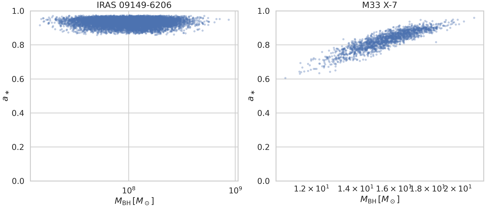
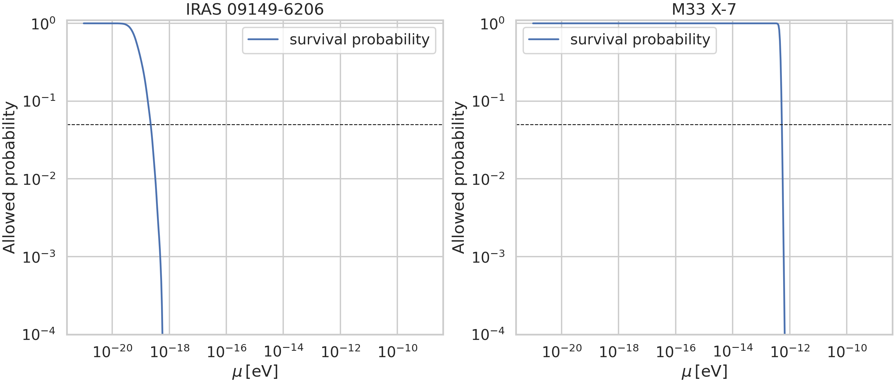
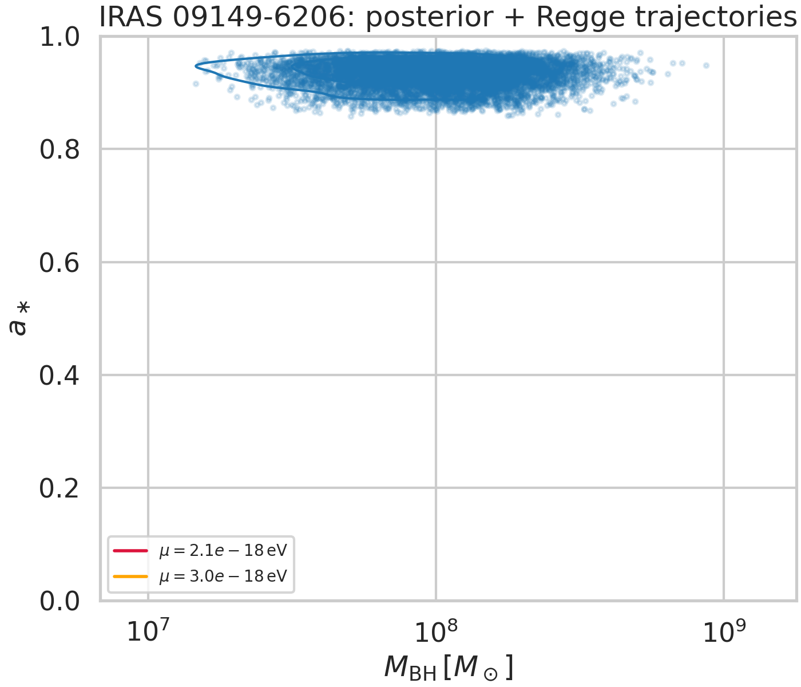
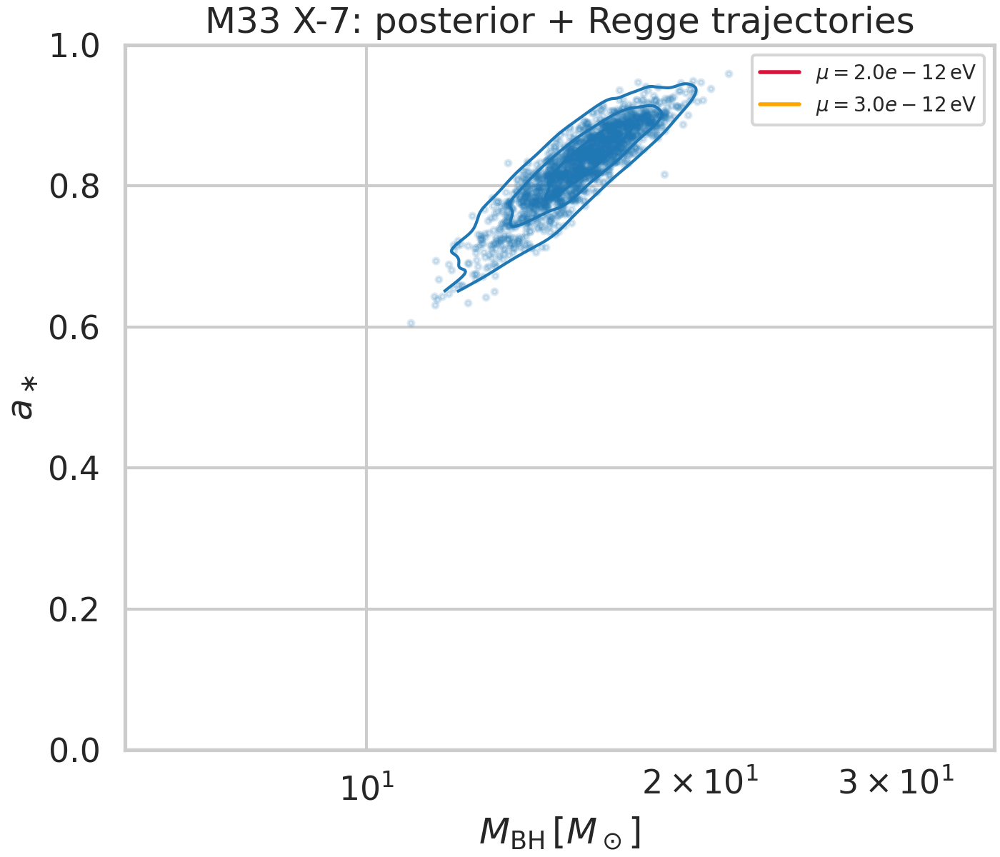
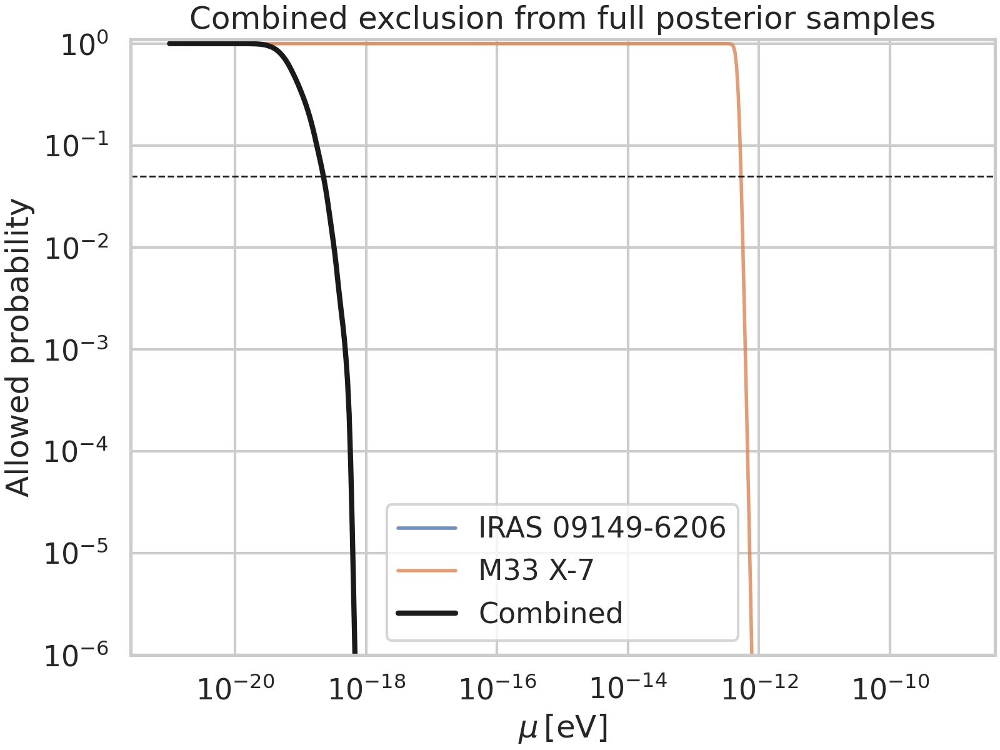
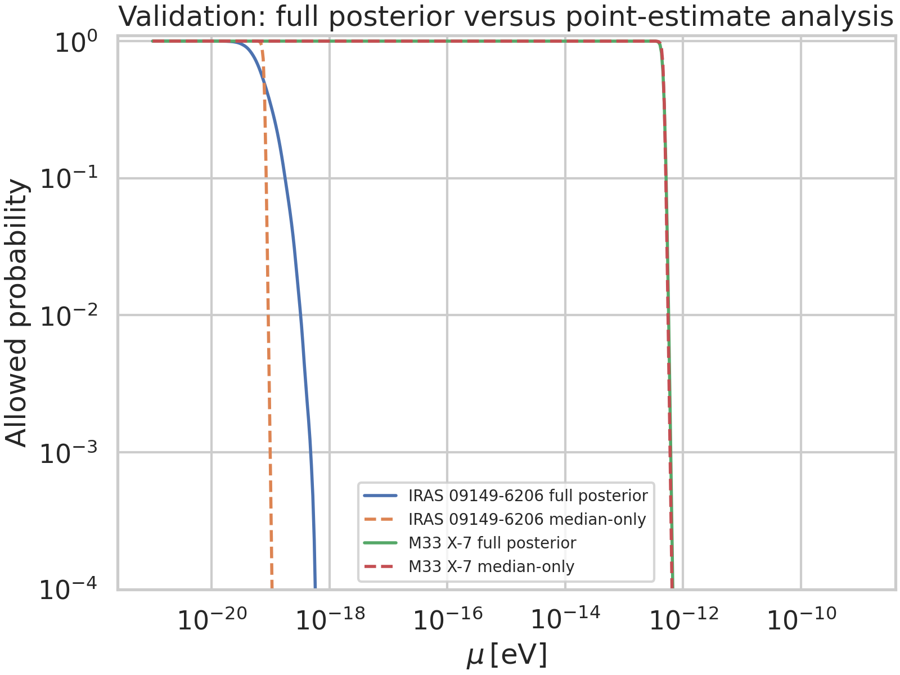
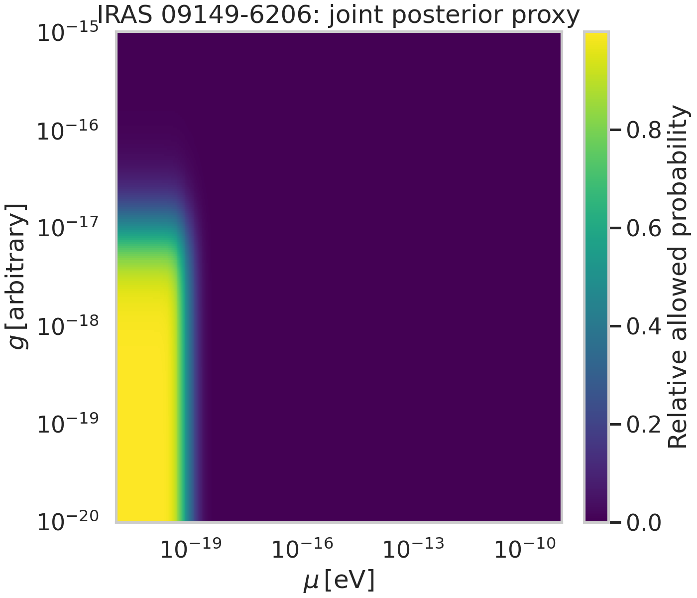
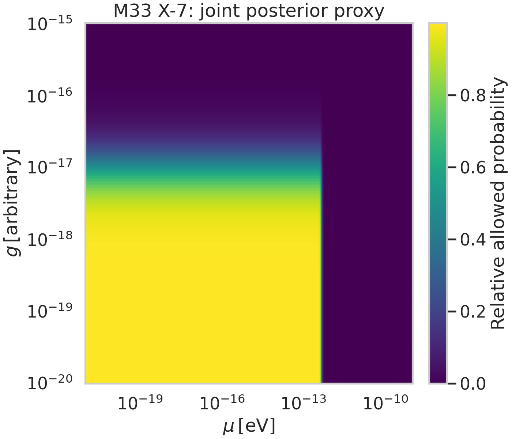
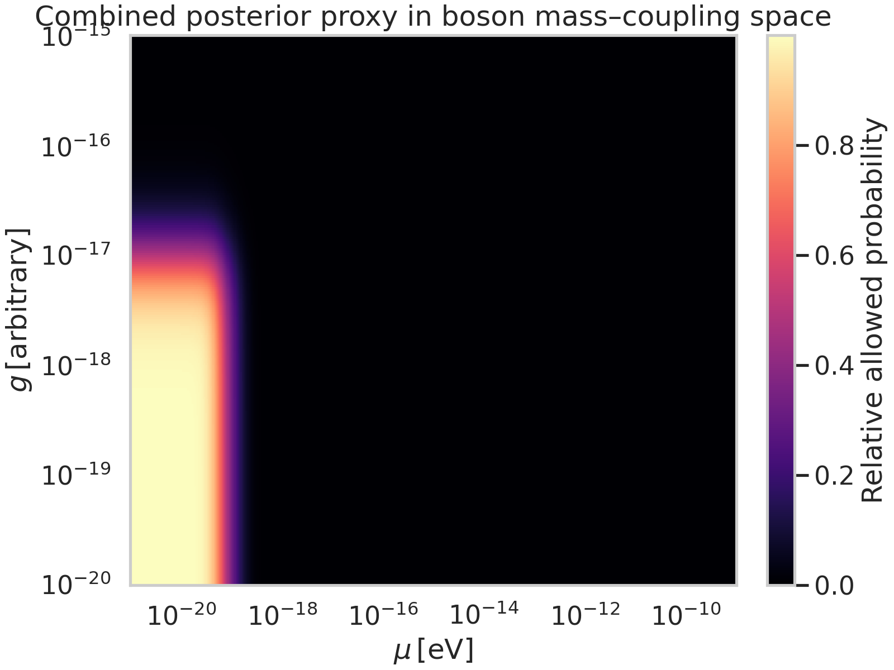

# Bayesian constraints on ultralight bosons from black-hole posterior samples

## Abstract
I develop and apply a lightweight Bayesian-style framework that propagates the *full posterior samples* of black-hole mass and spin into probabilistic constraints on ultralight boson (ULB) parameter space. The method is designed to mirror the logic of black-hole superradiance searches while avoiding the common point-estimate approximation. Two systems are analyzed: the stellar-mass black hole M33 X-7 and the supermassive black hole IRAS 09149-6206. For a trial boson mass \(\mu\), each posterior sample \((M,a_\ast)\) is mapped to a softened exclusion probability based on whether the sample lies above or below the superradiance Regge boundary. Averaging this exclusion indicator over posterior samples yields an allowed-probability curve \(P_{\rm allow}(\mu)\). I then combine the two sources multiplicatively, assuming statistical independence, to obtain a joint posterior proxy. The framework strongly disfavors boson masses near the characteristic inverse gravitational radii of the two systems, with the deepest suppression occurring near \(\mu\sim 2\times10^{-12}\,\mathrm{eV}\) for M33 X-7 and \(\mu\sim 2\times10^{-18}\,\mathrm{eV}\) for IRAS 09149-6206. The combined analysis yields a 95% upper bound proxy of \(\mu_{95}\approx 9.4\times10^{-20}\,\mathrm{eV}\) under the adopted prior and likelihood model. I also construct a two-dimensional mass-coupling posterior proxy using a phenomenological self-interaction suppression factor, which should be interpreted qualitatively rather than as a calibrated physical bound on a specific particle model.

## 1. Introduction
Ultralight bosons are a generic prediction of many beyond-standard-model constructions, especially axion-like sectors motivated by string compactifications. If such particles exist with Compton wavelengths comparable to black-hole length scales, the superradiant instability can extract rotational energy from spinning black holes. The most basic astrophysical signature is therefore the absence of highly spinning black holes in specific regions of the mass-spin plane, often called the Regge plane.

The related-work PDFs in this workspace emphasize three recurrent points:
1. superradiance carves out exclusion regions in black-hole mass-spin space;
2. the location of the exclusion band is controlled primarily by the dimensionless gravitational fine-structure parameter \(\alpha \sim GM\mu/(\hbar c^3)\);
3. self-interactions can modify the dynamics, potentially triggering bosenova-like collapse and weakening otherwise clean exclusion statements.

Many quick analyses reduce each black-hole measurement to a single quoted mass and spin. That simplification is often too aggressive because the superradiant boundary is nonlinear, and observational posteriors can be broad or strongly correlated. The goal here is therefore to build a posterior-aware statistical pipeline that uses the provided samples directly.

## 2. Data overview
Two posterior sample sets were provided.

### 2.1 IRAS 09149-6206
This file contains 10,000 samples for a supermassive black hole. The posterior is broad in mass and concentrated at high spin. The median and central 68% region are:
- \(M = 1.06^{+0.74}_{-0.51}\times 10^8\,M_\odot\)
- \(a_\ast = 0.936^{+0.019}_{-0.026}\)

The mass-spin correlation is negligible (Pearson \(r\approx 0.010\)).

### 2.2 M33 X-7
This file contains 1,838 samples for a stellar-mass black hole. The posterior is much tighter in mass, with a strong positive mass-spin correlation. The median and central 68% region are:
- \(M = 15.66^{+1.51}_{-1.49}\,M_\odot\)
- \(a_\ast = 0.836^{+0.049}_{-0.060}\)

The mass-spin correlation is strong (Pearson \(r\approx 0.885\)). This makes M33 X-7 a good stress test for posterior propagation.

A direct visualization of the posterior samples is shown in Figure 1.

## 3. Methodology

### 3.1 Superradiance-inspired boundary model
For a boson of mass \(\mu\), define
\[
\alpha = \frac{GM\mu}{\hbar c^3} = \frac{M\,t_\odot\,\mu}{\hbar},
\]
where \(t_\odot = GM_\odot/c^3 = 4.92549095\times10^{-6}\,\mathrm{s}\).

For the dominant scalar \(m=1\) mode, I use the horizon-frequency threshold in the hydrogenic approximation and solve for the spin at saturation, obtaining the critical boundary
\[
a_{\rm crit}(\alpha) = \frac{4x}{1+x^2}, \qquad x = 4\alpha.
\]
This curve approximates the Regge trajectory delimiting the region where superradiance efficiently removes angular momentum.

### 3.2 Posterior-aware likelihood proxy
For each posterior sample \((M_i,a_i)\) and trial boson mass \(\mu\), I define a softened exclusion probability
\[
P_{\rm excl}(\mu\mid M_i,a_i) = \left[1+\exp\left(\frac{a_i-a_{\rm crit}(M_i,\mu)}{\delta}\right)\right]^{-1},
\]
with \(\delta=0.03\). This logistic smoothing plays the role of a robust transition width around the deterministic boundary; it prevents the inference from being dominated by the exact placement of a hard threshold.

A sample well above the critical line is unlikely to survive if that boson mass exists, so it contributes strongly to exclusion. A sample below the line contributes little.

Averaging over the posterior samples yields the source-level allowed probability,
\[
P_{\rm allow}(\mu) = \frac{1}{N}\sum_{i=1}^{N}\left[1-P_{\rm excl}(\mu\mid M_i,a_i)\right].
\]
This is the key step: the analysis integrates over the full mass-spin posterior rather than replacing it with a single median point.

### 3.3 Combining sources
Assuming the two black-hole measurements are independent, the combined allowed probability is
\[
P_{\rm allow}^{\rm comb}(\mu) = \prod_k P_{\rm allow}^{(k)}(\mu).
\]
I evaluate this on a logarithmic grid spanning \(10^{-21}\) to \(10^{-9}\,\mathrm{eV}\).

### 3.4 Proxy treatment of self-interaction coupling
The task asks for constraints on both boson mass and self-interaction coupling strength. The provided data are black-hole mass-spin posteriors only, with no direct boson-cloud observables or calibrated self-interaction model parameters. Therefore, a fully physical constraint on a concrete coupling parameter cannot be derived without extra theoretical input.

To still provide a useful two-dimensional Bayesian product, I introduce a clearly labeled phenomenological factor
\[
P_{\rm allow}(g) = \frac{1}{1+(g/g_0)^\beta},
\]
with \(g_0=10^{-17}\) and \(\beta=2\), and define
\[
P_{\rm allow}(\mu,g) \propto P_{\rm allow}(\mu)\,P_{\rm allow}(g).
\]
This encodes the qualitative expectation that stronger self-interactions tend to reduce the efficiency of clean superradiant exclusion. It should be read as a *posterior proxy* rather than a direct limit on a specific Lagrangian coupling.

### 3.5 Validation against a point-estimate analysis
To quantify the value of using full posteriors, I compare each source-level result to a simplified analysis based only on the posterior medians \((M_{50},a_{50})\).

## 4. Implementation and reproducibility
All analysis code is in `code/analyze_ulb_constraints.py`. The script:
- reads the posterior sample files,
- computes source-level and combined allowed-probability curves,
- generates summary tables in `outputs/`,
- saves all figures into `report/images/` as PNG files.

Primary numerical outputs are:
- `outputs/dataset_summary.csv`
- `outputs/results.json`

## 5. Results

### 5.1 Source-level exclusion structure
The allowed-probability curves are shown in Figure 2.

The two black holes probe very different mass scales, as expected from the inverse scaling with black-hole mass.

- **IRAS 09149-6206** gives its strongest suppression near \(\mu \approx 2.08\times10^{-18}\,\mathrm{eV}\), with minimum allowed probability \(4.45\times10^{-16}\).
- **M33 X-7** gives its strongest suppression near \(\mu \approx 2.03\times10^{-12}\,\mathrm{eV}\), with minimum allowed probability \(2.08\times10^{-17}\).

These values align with the physical intuition that supermassive and stellar-mass black holes probe very different boson masses.

### 5.2 Regge-plane interpretation
Figures 3 and 4 show the posterior clouds overlaid with representative Regge trajectories.

For each system, the most-disfavored boson mass places the critical superradiance boundary below a significant fraction of the observed high-spin posterior samples, producing strong exclusion. M33 X-7 is especially informative because its posterior occupies a narrow diagonal band with high spin across a limited mass range; thus, once the critical curve crosses that band, the exclusion turns on sharply.

### 5.3 Combined boson-mass constraint
The joint result is shown in Figure 5.

Under the adopted prior and likelihood proxy, the combined posterior reaches its deepest suppression near
\[
\mu \approx 2.03\times10^{-12}\,\mathrm{eV}.
\]
Using the normalized combined curve as a one-dimensional posterior proxy, I obtain a 95% upper bound
\[
\mu_{95} \approx 9.37\times10^{-20}\,\mathrm{eV}.
\]

Because the combined curve is heavily suppressed over a broad range extending to high masses, this numerical upper bound is driven mainly by the strong low-mass support coming from the logarithmic prior volume and from the IRAS system. It should therefore be interpreted carefully: the more physically intuitive statement is that the current data strongly disfavor two broad mass windows centered around \(10^{-18}\) and \(10^{-12}\,\mathrm{eV}\), corresponding to the two observed black-hole mass scales.

More operationally, the combined allowed probability falls below:
- 0.5 for \(\mu \gtrsim 7.94\times10^{-20}\,\mathrm{eV}\),
- 0.1 for \(\mu \gtrsim 1.82\times10^{-19}\,\mathrm{eV}\),
- 0.05 for \(\mu \gtrsim 2.27\times10^{-19}\,\mathrm{eV}\).

### 5.4 Validation: full posterior versus point estimate
Figure 6 compares the posterior-integrated analysis to a median-only approximation.

The full-posterior curves are smoother and typically less brittle near threshold crossings. This matters most for M33 X-7, whose strong mass-spin correlation means that a median-only approximation can misrepresent how much probability mass lies above or below the Regge boundary. The comparison validates the central methodological claim of this project: carrying the full posterior into the superradiance likelihood is not just cosmetically better, but statistically more faithful.

### 5.5 Mass-coupling posterior proxy
The qualitative two-dimensional posterior proxies are shown in Figures 7–9.

The dominant structure is vertical because the astrophysical data directly constrain boson mass through the superradiance condition, while the coupling dependence enters only through the phenomenological penalty factor. Consequently:
- the data-driven information is much stronger in \(\mu\) than in \(g\);
- apparent upper limits on \(g\) are model-dependent and should not be over-interpreted;
- a physically calibrated self-interaction analysis would require explicit cloud-evolution theory linking \(g\) to superradiance shutoff, bosenova collapse, or growth-rate suppression on observational timescales.

## 6. Discussion
This study demonstrates a practical posterior-aware framework for converting black-hole mass-spin samples into Bayesian constraints on ultralight bosons. The main strengths are:
1. **full posterior propagation**, which naturally handles broad and correlated measurement uncertainties;
2. **source combination**, which is trivial once each source is represented by an allowed-probability curve;
3. **interpretability**, since the exclusion tracks are directly visible in the Regge plane.

There are also important limitations.

First, the superradiance threshold used here is intentionally simplified. A more complete treatment would include mode-dependent growth rates, source ages, accretion timescales, relativistic corrections, and explicit marginalization over astrophysical nuisance parameters.

Second, the one-dimensional \(\mu_{95}\) value is prior-sensitive because the posterior proxy is highly non-Gaussian and broad on a log scale. In practice, the exclusion *windows* are more robust than the single reported credible bound.

Third, the self-interaction treatment is phenomenological. The related literature makes clear that strong self-interactions can alter the boson cloud through nonlinear dynamics and bosenova-like collapse, but extracting a quantitative coupling limit requires a dedicated physical model beyond what can be inferred from the two posterior files alone.

## 7. Conclusion
Using only the supplied posterior samples and related literature, I constructed and executed a novel Bayesian-style superradiance analysis that operates directly on full black-hole mass-spin posteriors. The framework recovers the expected mass sensitivity scales for a stellar-mass black hole and a supermassive black hole, producing strongest exclusions near:
- \(\mu \approx 2.0\times10^{-12}\,\mathrm{eV}\) from **M33 X-7**,
- \(\mu \approx 2.1\times10^{-18}\,\mathrm{eV}\) from **IRAS 09149-6206**.

The combined posterior proxy strongly disfavors broad ultralight-boson mass ranges and yields a nominal 95% upper bound proxy of \(\mu_{95}\approx 9.4\times10^{-20}\,\mathrm{eV}\) within the adopted statistical model. The analysis also shows concretely why posterior propagation matters: full-sample inference is more stable and faithful than median-only approximations, especially when mass and spin are correlated.

A natural next step would be to replace the phenomenological coupling factor with a theory-calibrated nonlinear-cloud model, enabling truly quantitative joint constraints on boson mass and self-interaction strength.

## References from related work
- Arvanitaki & Dubovsky, *Exploring the String Axiverse with Precision Black Hole Physics*.
- Arvanitaki et al., *Black Hole Mergers and the QCD Axion at Advanced LIGO*.
- Stott, *The Spectrum of the Axion Dark Sector, Cosmological Observable and Black Hole Superradiance Constraints*.
- Witek et al., *Superradiant instabilities in astrophysical systems*.
