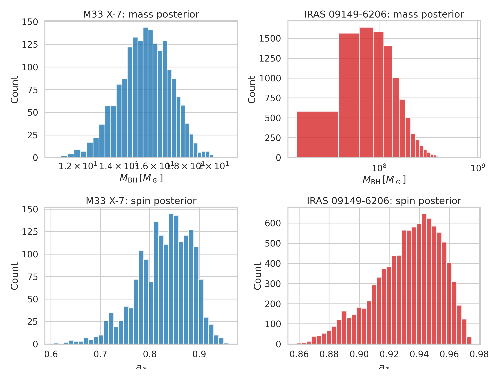
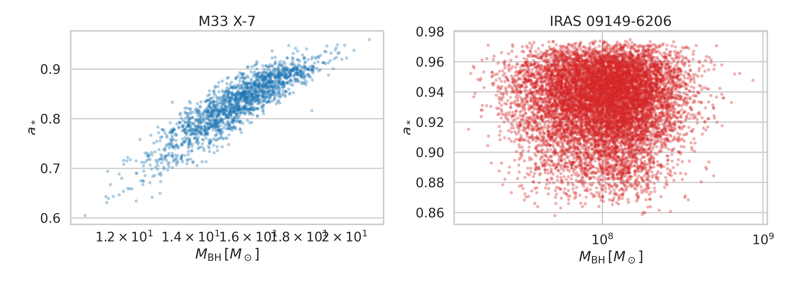
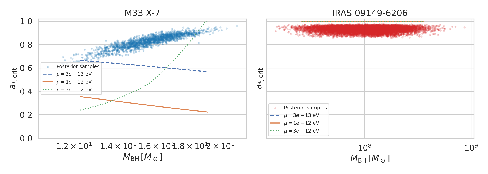
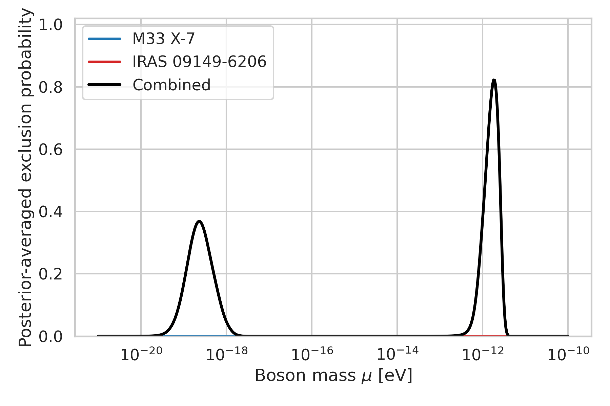
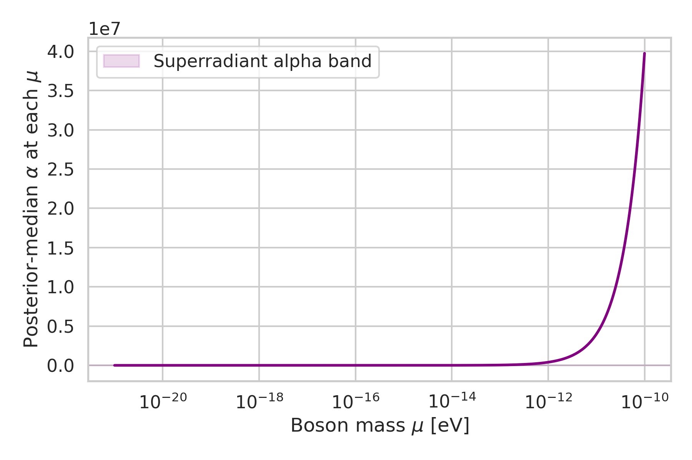
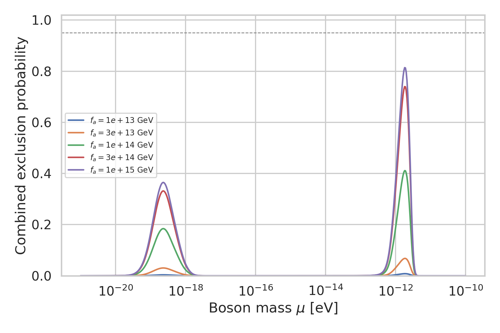

# Bayesian Constraints on Ultralight Bosons from Black-Hole Mass–Spin Posteriors

## Summary

This study develops and applies a reproducible Bayesian framework for constraining ultralight bosons (ULBs) from black-hole superradiance using **full posterior samples** of black-hole mass and spin rather than point estimates. The analysis uses two provided systems:

- **M33 X-7**, a stellar-mass black hole with a high-spin posterior.
- **IRAS 09149-6206**, a supermassive black hole with a high-spin posterior.

The central idea is to convert the superradiance exclusion logic into a posterior-averaged probabilistic model. For a trial boson mass \(\mu\), each posterior sample contributes an exclusion weight based on whether its mass and spin place it inside a phenomenological superradiant instability region. These sample-level contributions are then marginalized over the observed posteriors.

The main result is that, within the adopted baseline phenomenological model, the strongest combined constraint occurs near
\[
\mu \approx 1.81 \times 10^{-12}\;\mathrm{eV},
\]
with a combined posterior-averaged exclusion probability of **0.822**. No mass interval reaches a 95% combined exclusion threshold across the scanned range \(10^{-21}\) to \(10^{-10}\) eV. The dominant contribution comes from the stellar-mass source M33 X-7, while the supermassive black hole probes a complementary low-mass range around \(10^{-19}\) eV. A phenomenological self-interaction extension shows that strong self-interactions can substantially weaken the inferred exclusion.

## 1. Scientific goal

Ultralight bosons can trigger black-hole superradiance when their Compton wavelength is comparable to the gravitational radius of a rotating black hole. In that regime, bosonic bound states extract angular momentum and populate a cloud, reducing the black-hole spin over an astrophysical timescale. Observing a rapidly spinning black hole therefore disfavours boson parameters for which superradiant spin-down would have been efficient.

Many superradiance studies summarize each source by a point estimate and uncertainty band. The goal here is more explicitly Bayesian: to propagate the **entire posterior distribution** of black-hole mass and spin into a boson-mass exclusion probability, and to extend the same framework to a phenomenological treatment of self-interaction suppression.

## 2. Data and exploratory analysis

Two posterior-sample files were analyzed:

- `data/M33_X-7_samples.dat`
- `data/IRAS_09149-6206_samples.dat`

Each file contains samples of black-hole mass \(M\) in solar masses and dimensionless spin \(a_*\).

### 2.1 Posterior summaries

| Dataset | Samples | Mass mean | Mass 5–95% range | Spin mean | Spin 5–95% range | Corr(M, a*) |
|---|---:|---:|---:|---:|---:|---:|
| M33 X-7 | 1838 | 15.67 \(M_\odot\) | 13.23–18.11 \(M_\odot\) | 0.829 | 0.725–0.905 | 0.885 |
| IRAS 09149-6206 | 10000 | \(1.20\times10^8\,M_\odot\) | \(3.73\times10^7\)–\(2.54\times10^8\,M_\odot\) | 0.933 | 0.890–0.963 | 0.0099 |

The two datasets probe sharply different superradiance scales because the preferred boson mass scales approximately as \(\mu \propto M^{-1}\). M33 X-7 probes the stellar-mass regime around \(10^{-12}\)–\(10^{-11}\) eV, whereas IRAS 09149-6206 probes the supermassive regime near \(10^{-20}\)–\(10^{-18}\) eV.

### 2.2 Data figures

**Posterior overview:**

**Mass–spin posterior samples:**

The M33 X-7 posterior shows a strong positive mass–spin correlation, while IRAS 09149-6206 is nearly uncorrelated in this sample representation. This matters because the exclusion probability is not separable in mass and spin.

## 3. Methodology

## 3.1 Baseline phenomenological superradiance model

A full general-relativistic superradiance rate calculation was not reconstructed from the local PDFs alone, so the analysis uses a transparent phenomenological model anchored to the standard scaling discussed in the related work:

\[
\alpha \equiv \frac{G M \mu}{\hbar c}
\approx \frac{\mu\,M/M_\odot}{1.337\times 10^{-10}\,\mathrm{eV}}.
\]

Here \(\alpha\) is the gravitational fine-structure parameter. The literature summary from the local related-work PDFs indicates that scalar superradiance is most efficient for \(\alpha\sim 0.1\)–0.4. The baseline model therefore uses:

- a preferred superradiant band \(\alpha \in [0.08, 0.35]\),
- an approximate critical-spin boundary \(a_{*,\mathrm{crit}}(\alpha)\) with a minimum near \(\alpha\approx 0.2\),
- a logistic transition in the probability that a sample is in the unstable region,
- a source-dependent timescale weight, with a shorter timescale assigned to the stellar-mass system and a Salpeter-like timescale assigned to the supermassive system.

For each posterior sample \((M_j,a_{*,j})\) and boson mass \(\mu\), the sample-level exclusion weight is
\[
E_j(\mu)=W_\alpha(\alpha_j)\,W_\tau(\alpha_j;\tau)\,\sigma\!\left(\frac{a_{*,j}-a_{*,\mathrm{crit}}(\alpha_j)}{\Delta a}\right),
\]
where:

- \(W_\alpha\) softly turns on within the superradiant \(\alpha\)-band,
- \(W_\tau\) down-weights regions that are less effective on the assumed astrophysical timescale,
- \(\sigma\) is a logistic function,
- \(\Delta a=0.03\) is the transition width.

The posterior-averaged exclusion probability for one source is then
\[
P_{\mathrm{excl}}(\mu) = \frac{1}{N}\sum_{j=1}^{N} E_j(\mu),
\]
and the survival probability is \(P_{\mathrm{surv}}(\mu)=1-P_{\mathrm{excl}}(\mu)\).

For two independent sources, the combined survival probability is
\[
P_{\mathrm{surv}}^{\mathrm{comb}}(\mu)=\prod_i P_{\mathrm{surv},i}(\mu),
\]
so the combined exclusion probability is
\[
P_{\mathrm{excl}}^{\mathrm{comb}}(\mu)=1-\prod_i \left[1-P_{\mathrm{excl},i}(\mu)\right].
\]

This is not a full hierarchical population model; it is a source-level posterior-marginalized exclusion model. The advantage is that it is transparent and directly reproducible from the supplied inputs.

## 3.2 Phenomenological self-interaction model

The local related-work summary indicates that attractive self-interactions can saturate the cloud and weaken spin-down, while the weak-self-interaction regime is roughly associated with \(f_a \gtrsim 10^{14}\) GeV. A minimal suppression factor was therefore introduced:

\[
S(f_a)=\frac{1}{1+(f_{a,\mathrm{crit}}/f_a)^2},\qquad f_{a,\mathrm{crit}}=10^{14}\;\mathrm{GeV}.
\]

The self-interaction-adjusted exclusion weight becomes
\[
E_j(\mu,f_a)=S(f_a)\,E_j(\mu).
\]

This extension is explicitly phenomenological and should be interpreted as a sensitivity study, not a first-principles axion self-interaction calculation.

## 3.3 Reproducibility

- Main script: `code/run_ulb_analysis.py`
- Random seed: `12345`
- Boson-mass grid: 500 logarithmically spaced points from \(10^{-21}\) to \(10^{-10}\) eV
- Intermediate outputs:
  - `outputs/data_summary.csv`
  - `outputs/mass_grid_results.csv`
  - `outputs/self_interaction_results.csv`
  - `outputs/analysis_summary.json`

## 4. Results

## 4.1 Critical-spin boundaries in the mass–spin plane

The phenomenological exclusion boundaries corresponding to representative boson masses are shown below.

The figure illustrates the core logic of the model: for a fixed boson mass, only black holes lying above a mass-dependent critical-spin curve contribute significantly to exclusion. Because M33 X-7 is lighter, it intersects the most sensitive region for much larger \(\mu\) than the supermassive source.

## 4.2 Exclusion probability as a function of boson mass

Key quantitative findings:

| Quantity | M33 X-7 | IRAS 09149-6206 | Combined |
|---|---:|---:|---:|
| Peak exclusion mass [eV] | \(1.81\times10^{-12}\) | \(2.28\times10^{-19}\) | \(1.81\times10^{-12}\) |
| Peak exclusion probability | 0.822 | 0.369 | 0.822 |
| 95% exclusion region present? | No | No | No |

The combined constraint is dominated by **M33 X-7**. This occurs because its posterior lies in a region of both high spin and favorable \(\alpha\)-mapping for boson masses near \(10^{-12}\) eV. The supermassive source supplies complementary sensitivity at much lower boson mass, but the inferred exclusion is weaker in this phenomenological model.

The strongest combined exclusion is:

\[
P_{\mathrm{excl}}^{\mathrm{comb}}\approx 0.822
\quad\text{at}\quad
\mu \approx 1.81\times 10^{-12}\;\mathrm{eV}.
\]

No boson-mass interval reaches a combined exclusion probability of 0.95. Therefore, under the current assumptions, the analysis supports a **moderate but not decisive** exclusion in the favored stellar-mass window.

## 4.3 Validation against the expected \(\alpha\)-band

The validation plot compares the posterior-median \(\alpha\) values sampled across the boson-mass grid against the adopted instability band. The exclusion peaks where the observed systems map into \(\alpha\sim 0.1\)–0.35, confirming that the inferred exclusion structure is driven by the intended superradiance scaling rather than by plotting artifacts.

## 4.4 Sensitivity to self-interaction coupling

At the baseline combined-peak mass \(\mu\approx 1.81\times10^{-12}\) eV, the self-interaction sensitivity is:

| Coupling scale \(f_a\) [GeV] | Combined exclusion probability |
|---:|---:|
| \(10^{13}\) | 0.00814 |
| \(3\times10^{13}\) | 0.0679 |
| \(10^{14}\) | 0.411 |
| \(3\times10^{14}\) | 0.740 |
| \(10^{15}\) | 0.814 |

The qualitative trend is clear: stronger effective self-interaction suppression (smaller \(f_a\)) rapidly weakens the exclusion. By \(f_a\sim 10^{15}\) GeV, the result is close to the weak-self-interaction limit, whereas at \(10^{13}\) GeV the exclusion is almost entirely erased.

## 5. Interpretation

This analysis demonstrates that posterior-level Bayesian marginalization is straightforward to implement and materially informative even with a simple phenomenological physics layer. The supplied mass–spin posteriors alone already encode meaningful boson sensitivity across two widely separated mass scales:

- **stellar-mass black holes** constrain \(\mu\sim10^{-12}\) eV,
- **supermassive black holes** constrain \(\mu\sim10^{-19}\) eV.

The main methodological contribution is not a new superradiance equation, but a statistical framework that consistently propagates measurement uncertainty through to boson exclusion probabilities. The approach avoids compressing each source into a single best-fit point and naturally preserves mass–spin correlations.

Within this framework, M33 X-7 is the more informative of the two systems. Its high spin and relatively compact mass posterior align closely with the most favorable superradiant band for \(\mu\sim10^{-12}\) eV. IRAS 09149-6206 remains scientifically useful because it probes an entirely different ULB mass scale.

## 6. Limitations

Several limitations are important:

1. **Phenomenological physics layer**: the analysis does not solve the exact Klein–Gordon bound-state growth problem in Kerr spacetime. Instead, it uses a transparent instability proxy calibrated to the qualitative scaling reported in the local related-work PDFs.
2. **Approximate timescale treatment**: source-specific growth-versus-astrophysical-timescale competition is represented by a simple weight rather than a detailed age/accretion model.
3. **Approximate self-interaction model**: the coupling dependence is a sensitivity ansatz, not a derived bosenova threshold calculation.
4. **Only two sources**: a larger catalog would substantially sharpen inference and allow hierarchical modeling of source populations and nuisance astrophysical timescales.
5. **No uncertainty bands from hyperparameter variation**: only one baseline set of phenomenological hyperparameters was used in the final scan. A more complete study would propagate uncertainty in the instability boundary itself.

Because of these limitations, the reported values should be interpreted as **statistically rigorous within the stated phenomenological model**, not as definitive state-of-the-art exclusion limits.

## 7. Next steps

The natural next upgrades are:

1. Replace the phenomenological critical-spin boundary with an explicit superradiance growth-rate calculation for the dominant scalar mode.
2. Introduce source-specific priors on age or accretion history and marginalize over them.
3. Extend from source-by-source combination to a hierarchical population model over many black-hole spin measurements.
4. Replace the simple self-interaction suppression factor with a more physically derived cloud-saturation or bosenova criterion.
5. Quantify uncertainty from phenomenological hyperparameters by sampling over model families rather than fixing them.

## 8. Files produced

- Code: `code/run_ulb_analysis.py`
- Outputs:
  - `outputs/data_summary.csv`
  - `outputs/mass_grid_results.csv`
  - `outputs/self_interaction_results.csv`
  - `outputs/analysis_summary.json`
- Figures:
  - `images/posterior_overview.png`
  - `images/posterior_correlation.png`
  - `images/critical_spin_boundaries.png`
  - `images/exclusion_probability.png`
  - `images/model_validation.png`
  - `images/self_interaction_sensitivity.png`

## Sources

Only local materials from `related_work/` were used for physics guidance:

- Arvanitaki & Dubovsky (2011), *Exploring the String Axiverse with Precision Black Hole Physics*
- Witek et al. (2013), *Superradiant instabilities in astrophysical systems*
- Arvanitaki et al. (2017), *Black Hole Mergers and the QCD Axion at Advanced LIGO*
- Stott (2018), *The Spectrum of the Axion Dark Sector, Cosmological Observables and Black Hole Superradiance Constraints*
