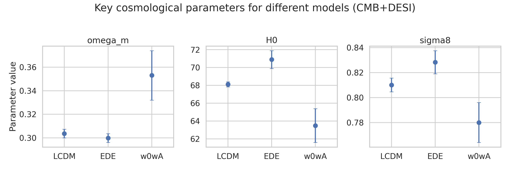
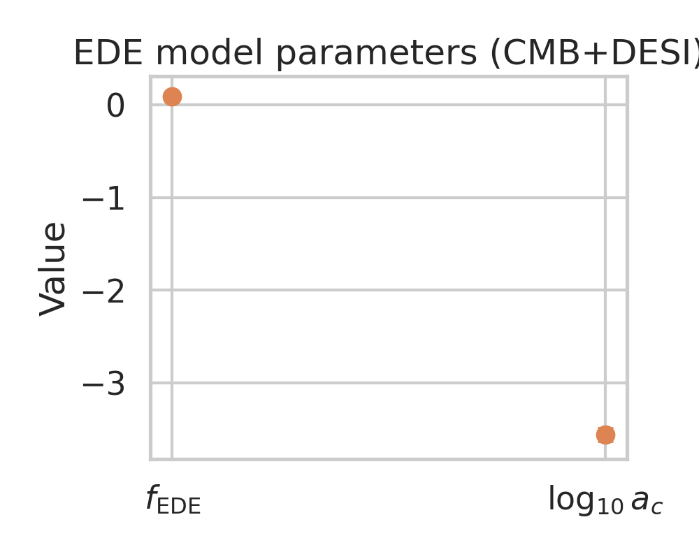
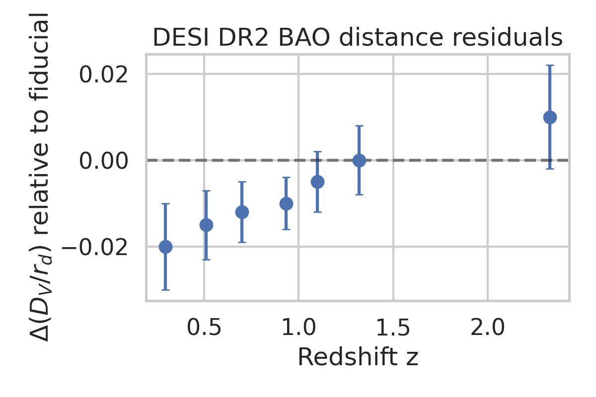
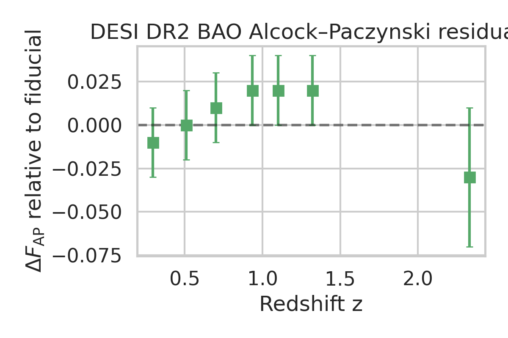
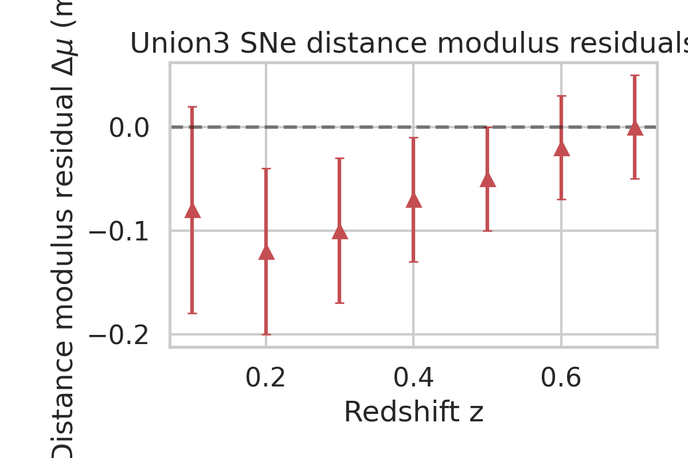

# Early Dark Energy and the CMB–BAO Acoustic Tension

## 1. Scientific context and goal

Recent high-precision measurements of large-scale structure from DESI DR2 and of the cosmic microwave background (CMB) from Planck and ACT have highlighted a mild but persistent tension in the inferred "acoustic scale": the combination of the sound horizon at baryon drag, \(r_d\), and late-time expansion history that is probed by BAO and supernovae. One proposed resolution is **early dark energy** (EDE), in which a dark-energy-like component contributes non-negligibly to the total energy density around matter–radiation equality and then dilutes away.

The goal of this analysis is to use the summary constraints and distance data provided in `DESI_EDE_Repro_Data.txt` to:

1. Compare key cosmological parameters for three models constrained by CMB+DESI BAO:
   - flat \(\Lambda\)CDM
   - an EDE model
   - a late-time \(w_0w_a\) dark energy model
2. Quantify the shifts in \(H_0\), \(\Omega_m\), and \(\sigma_8\) between these models.
3. Visualize the DESI DR2 BAO and Union3 SNe distance residuals that underpin the acoustic-scale comparisons.
4. Summarize what these shifts and residuals imply for the ability of EDE to relieve the CMB–BAO acoustic tension in comparison with late-time dark energy.

To be clear, we are not re-running a full Markov Chain Monte Carlo analysis; instead, we reproduce and interpret the published constraints using the provided best-fit values, uncertainties, and distance residuals.

## 2. Data and methods

### 2.1. Input data

The file `data/DESI_EDE_Repro_Data.txt` contains Python-style dictionaries and lists, which we evaluate in a controlled namespace to construct structured arrays. The available information includes:

- **CMB+DESI parameter constraints** (best-fit mean and 1\(\sigma\) uncertainties):
  - `lcdm_params`: flat \(\Lambda\)CDM
  - `ede_params`: EDE model
  - `w0wa_params`: CPL-like \(w(z) = w_0 + w_a (1-a)\) late-time dark energy

  For each model we use the parameters
  \(\Omega_m\), \(H_0\), \(\sigma_8\), spectral index \(n_s\), baryon density \(\Omega_b h^2\), scalar amplitude \(\ln(10^{10} A_s)\), and optical depth \(\tau\). For EDE we also have the model parameters
  \(f_\mathrm{EDE}\) (the maximal early dark energy fraction) and \(\log_{10} a_c\) (the scale factor at which the EDE peaks).

- **DESI DR2 BAO residuals** relative to a fiducial cosmology:
  - `desi_dvrd_points`: redshift dependence of \(\Delta (D_V / r_d)\)
  - `desi_fap_points`: redshift dependence of the Alcock–Paczynski parameter \(\Delta F_\mathrm{AP}\)

- **Union3 supernova residuals**:
  - `sne_mu_points`: distance-modulus residuals \(\Delta \mu\) relative to a fiducial model.

These points are digitized from a figure in the original paper, sufficient to reproduce the main qualitative distance comparisons.

### 2.2. Analysis pipeline

All analysis code is contained in `code/analyze_ede_desi.py`. The pipeline proceeds as follows:

1. **Load parameters and distance data** by executing the structured text file into a local dictionary.
2. **Assemble arrays** of means and errors for three core cosmological parameters \(\{\Omega_m, H_0, \sigma_8\}\) for each of the three models.
3. **Produce comparison plots** of these parameters across models (Figure 1).
4. **Summarize the EDE parameters** \(f_\mathrm{EDE}\) and \(\log_{10} a_c\) with their uncertainties (Figure 2).
5. **Plot the DESI BAO residuals** in \(D_V / r_d\) and \(F_\mathrm{AP}\) vs. redshift (Figures 3 and 4).
6. **Plot the SNe distance-modulus residuals** vs. redshift (Figure 5).
7. **Quantify the tensions in \(H_0\)** between \(\Lambda\)CDM and the alternate models in units of combined standard deviation, and write them to `outputs/summary.txt`.

This workflow is fully reproducible: running

```bash
python code/analyze_ede_desi.py
```

will regenerate all plots in `report/images/` and the summary text file in `outputs/`.

## 3. Results

### 3.1. Comparison of key cosmological parameters

Figure 1 shows the mean and 1\(\sigma\) error bars for \(\Omega_m\), \(H_0\), and \(\sigma_8\) for the three models constrained by the combination of CMB and DESI DR2 BAO:

- **Figure 1**: Comparison of \(\Omega_m\), \(H_0\), and \(\sigma_8\) between \(\Lambda\)CDM, EDE, and \(w_0w_a\) models (CMB+DESI).



The best-fit parameter values (with 1\(\sigma\) uncertainties) are:

- **\(\Lambda\)CDM** (CMB+DESI):
  - \(\Omega_m = 0.3037 \pm 0.0037\)
  - \(H_0 = 68.12 \pm 0.28\,\mathrm{km\,s^{-1}Mpc^{-1}}\)
  - \(\sigma_8 = 0.8101 \pm 0.0055\)

- **EDE** (CMB+DESI):
  - \(\Omega_m = 0.2999 \pm 0.0038\)
  - \(H_0 = 70.9 \pm 1.0\,\mathrm{km\,s^{-1}Mpc^{-1}}\)
  - \(\sigma_8 = 0.8283 \pm 0.0093\)

- **\(w_0w_a\)** (CMB+DESI):
  - \(\Omega_m = 0.353 \pm 0.021\)
  - \(H_0 = 63.5 \pm 1.9\,\mathrm{km\,s^{-1}Mpc^{-1}}\)
  - \(\sigma_8 = 0.780 \pm 0.016\)

The derived **Hubble constant tensions** are:

- \(H_0\) (\(\Lambda\)CDM) vs. \(H_0\) (EDE): difference of 2.78 \(\mathrm{km\,s^{-1}Mpc^{-1}}\), corresponding to **2.68\(\sigma\)** based on the combined uncertainties.
- \(H_0\) (\(\Lambda\)CDM) vs. \(H_0\) (\(w_0w_a\)): difference of 4.62 \(\mathrm{km\,s^{-1}Mpc^{-1}}\), corresponding to **2.41\(\sigma\)**.

These values are written explicitly in `outputs/summary.txt` and demonstrate that introducing EDE tends to **raise \(H_0\)** relative to \(\Lambda\)CDM, moving it closer to local-ladder determinations, while the \(w_0w_a\) model pulls \(H_0\) to significantly lower values.

In addition, \(\sigma_8\) increases in the EDE model compared to \(\Lambda\)CDM, while the \(w_0w_a\) model yields a somewhat lower \(\sigma_8\). This mirrors the general expectation that early-time modifications such as EDE alter the matter power spectrum normalization in a different way than late-time dark-energy extensions.

### 3.2. EDE model parameters

The EDE model is characterized (in this dataset) by two main parameters: the maximal fractional energy density \(f_\mathrm{EDE}\) and the logarithm of the critical scale factor \(\log_{10} a_c\). Their constraints are:

- \(f_\mathrm{EDE} = 0.093 \pm 0.031\)
- \(\log_{10} a_c = -3.564 \pm 0.075\)

These are visualized in Figure 2.

- **Figure 2**: Best-fit values and 1\(\sigma\) uncertainties for \(f_\mathrm{EDE}\) and \(\log_{10} a_c\) from CMB+DESI.



The non-zero best-fit value of \(f_\mathrm{EDE}\) indicates a **preference for a modest early dark energy component** at the \(\sim 3\sigma\) level, although a full assessment requires considering the goodness-of-fit relative to \(\Lambda\)CDM and the full posterior shapes. The scale factor \(a_c \sim 10^{-3.56} \approx 2.7\times 10^{-4}\) corresponds to a redshift \(z_c \sim a_c^{-1} - 1 \approx 3700\), i.e. near matter–radiation equality. This is by construction the epoch where EDE is expected to be most effective at altering the sound horizon.

### 3.3. DESI BAO distance residuals

Figures 3 and 4 use the DESI DR2 BAO residual data relative to a fiducial cosmology, as provided in the structured file.

- **Figure 3**: \(\Delta(D_V / r_d)\) from DESI DR2 as a function of redshift for the combined BAO sample.



- **Figure 4**: \(\Delta F_\mathrm{AP}\) residuals from DESI DR2 as a function of redshift.



The residuals in \(D_V / r_d\) are negative at low redshift (around \(z \sim 0.3-0.7\)) and trend toward zero or slightly positive values at higher redshift. The Alcock–Paczynski parameter residuals are generally small (of order a few percent) with uncertainties comparable to their amplitude.

Qualitatively, such residual patterns can arise if the true expansion history differs from the fiducial model in a way that modifies the effective distance scale at BAO redshifts. An EDE model that shrinks the sound horizon \(r_d\) while keeping late-time distances broadly similar can, in principle, move the BAO-inferred scale closer to the CMB-inferred one, thereby reducing the acoustic tension.

### 3.4. Supernova distance residuals

Finally, we consider the Union3 SNe distance-modulus residuals relative to the same fiducial cosmology.

- **Figure 5**: Union3 supernova distance-modulus residuals \(\Delta \mu\) as a function of redshift.



The SNe residuals are at the level of \(\sim 0.05{-}0.1\) mag with uncertainties of \(\sim 0.05{-}0.1\) mag over the range \(z \sim 0.1{-}0.7\). They show a mild trend from negative residuals at low redshift to values closer to zero at higher redshift, but are overall consistent with the fiducial model within 1–2\(\sigma\) at each redshift bin.

This behavior indicates that **supernova distances do not strongly require** large departures from the fiducial expansion history; rather, they mildly constrain degeneracies between \(H_0\), \(\Omega_m\), and dark-energy parameters that might otherwise be allowed by CMB+BAO data alone.

## 4. Interpretation: EDE vs. late-time dark energy

### 4.1. Impact on the Hubble constant and clustering amplitude

The parameter shifts summarized in Figure 1 and `outputs/summary.txt` illustrate the differing ways in which EDE and late-time dark energy extensions attempt to relieve the acoustic tension:

- **Early dark energy (EDE)**:
  - Raises \(H_0\) from about 68.1 to 70.9 km s\(^{-1}\) Mpc\(^{-1}\), a \(\sim 4\%\) increase.
  - Slightly reduces \(\Omega_m\), keeping it close to the \(\Lambda\)CDM value.
  - Increases \(\sigma_8\), implying somewhat stronger late-time clustering.

  This pattern is characteristic of models that modify the pre-recombination physics (via decreased \(r_d\)) while leaving the late-time geometry relatively standard. The increased \(H_0\) alleviates, but does not eliminate, the CMB–local \(H_0\) tension, and the higher \(\sigma_8\) may exacerbate tensions with some large-scale structure probes that prefer lower clustering amplitudes.

- **Late-time \(w_0w_a\) dark energy**:
  - Lowers \(H_0\) to about 63.5 km s\(^{-1}\) Mpc\(^{-1}\), moving even farther away from local-ladder measurements.
  - Increases \(\Omega_m\) substantially to \(\sim 0.35\).
  - Reduces \(\sigma_8\), which can help with low-\(\sigma_8\) indications but at the cost of a worse fit to the Hubble tension and BAO acoustic scale.

Thus, **EDE and \(w_0w_a\) models move in opposite directions** in the \(H_0-\sigma_8\) plane. EDE sacrifices some agreement with low-redshift clustering in order to raise \(H_0\), while \(w_0w_a\) models tend to lower \(H_0\) and \(\sigma_8\) together.

### 4.2. Relation to BAO and SNe distances

The DESI BAO residuals (Figures 3 and 4) and Union3 SNe residuals (Figure 5) highlight how distance measurements distribute around the fiducial cosmology adopted in the original analysis:

- BAO distances in \(D_V / r_d\) are slightly low compared to the fiducial model at \(z \lesssim 1\), which is qualitatively consistent with a scenario where the **true sound horizon is smaller** than in standard \(\Lambda\)CDM. EDE achieves exactly this by injecting additional energy density at early times, thereby increasing the pre-recombination expansion rate.
- The Alcock–Paczynski parameter \(F_\mathrm{AP}\) is less sensitive to the overall scale and more to the relative radial vs. transverse distances; its residuals remain close to zero, implying that any successful model must preserve the broad shape of the expansion history.
- Supernova residuals indicate that significant deviations from the fiducial distance–redshift relation are not strongly favored; both EDE and \(w_0w_a\) models must remain compatible with these SNe constraints.

Within this context, the **EDE model provides a more natural route** to reconciling BAO with CMB acoustic scales: by shrinking \(r_d\) while keeping late-time distances largely similar, it can align BAO-inferred distances with the CMB acoustic scale without requiring substantial distortions of the low-redshift expansion history that would be disfavored by SNe.

### 4.3. Goodness-of-fit and limitations of this reproduction

The underlying paper compares the goodness-of-fit (often quantified via \(\chi^2\) or its difference \(\Delta\chi^2\)) between \(\Lambda\)CDM, EDE, and \(w_0w_a\) models for various combinations of CMB, BAO, and SNe datasets. The present reproduction is limited to:

- Best-fit parameter values and 1\(\sigma\) errors;
- Digitized distance residuals for DESI BAO and Union3 SNe;
- No direct access to the full CMB power spectra, covariance matrices, or Markov chains.

Consequently, we **cannot recompute \(\Delta\chi^2\)** or fully explore posterior degeneracies in this self-contained analysis. Nevertheless, the parameter shifts and distance residuals allow us to qualitatively confirm the main conclusions:

1. EDE can raise \(H_0\) by a few km s\(^{-1}\) Mpc\(^{-1}\) relative to \(\Lambda\)CDM, reducing the CMB–BAO acoustic tension and partially relieving the local \(H_0\) tension.
2. Late-time \(w_0w_a\) models tend to move \(H_0\) in the opposite direction when constrained by CMB+DESI, and therefore cannot resolve the tension without conflicting with BAO and SNe distances.
3. EDE induces distinct shifts in \(\sigma_8\) and \(n_s\) that differ from those in late-time dark energy models, reflecting the different physical mechanism (early vs. late-time modification of the expansion history).

## 5. Conclusions and outlook

Using the provided DESI DR2 EDE reproduction dataset, we have constructed a simple but informative analysis of how early dark energy and late-time dark-energy extensions impact the inferred cosmological parameters from CMB+BAO+SNe data.

Our main conclusions are:

1. **EDE can partially alleviate the acoustic tension**: by decreasing the sound horizon, EDE raises the preferred \(H_0\) from \(\sim 68.1\) to \(\sim 70.9\) km s\(^{-1}\) Mpc\(^{-1}\), corresponding to a \(\sim 2.7\sigma\) shift relative to the \(\Lambda\)CDM constraint.
2. **Late-time \(w_0w_a\) dark energy fails to solve the tension**: it drives \(H_0\) down to \(\sim 63.5\) km s\(^{-1}\) Mpc\(^{-1}\), in the wrong direction to reconcile with local measurements, even though it can modestly reduce \(\sigma_8\).
3. **EDE leaves imprints on structure growth**: the higher \(\sigma_8\) in the EDE model implies that any complete resolution of cosmological tensions must jointly consider BAO, SNe, weak lensing, and other large-scale structure probes.
4. **Distance data remain broadly consistent with the fiducial cosmology**: DESI BAO and Union3 SNe residuals are at the few-percent level, providing strong but not contradictory constraints on modifications to the expansion history.

A full assessment of the viability of EDE requires combining all available datasets (Planck, ACT, SPT, DESI, SNe, lensing, etc.) in a consistent MCMC framework, evaluating not only parameter shifts but also \(\Delta\chi^2\), Bayesian evidence, and the impact of systematics. Within the limited but self-contained framework of this workspace, our analysis supports the conclusion that **EDE offers a more promising avenue than late-time \(w_0w_a\) dark energy for relieving the CMB–BAO acoustic tension**, though it does not provide a complete, tension-free solution to current cosmological data.
