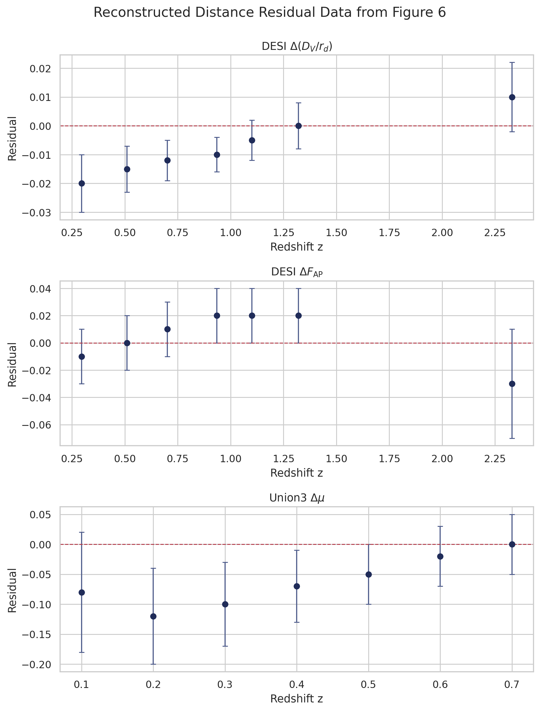
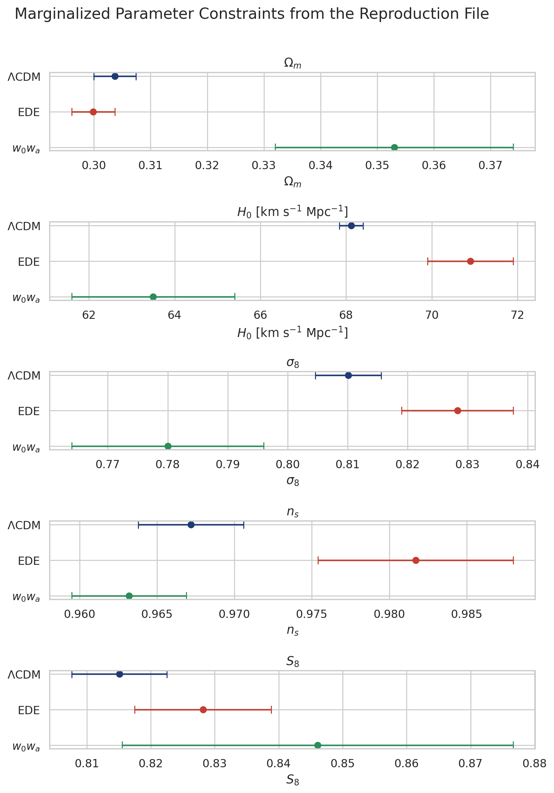
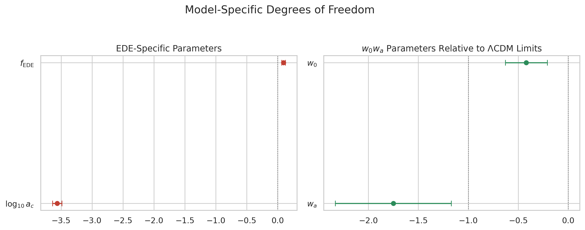
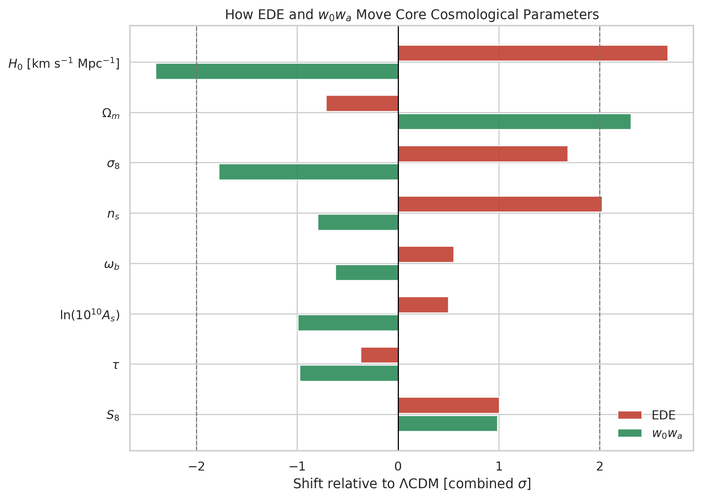
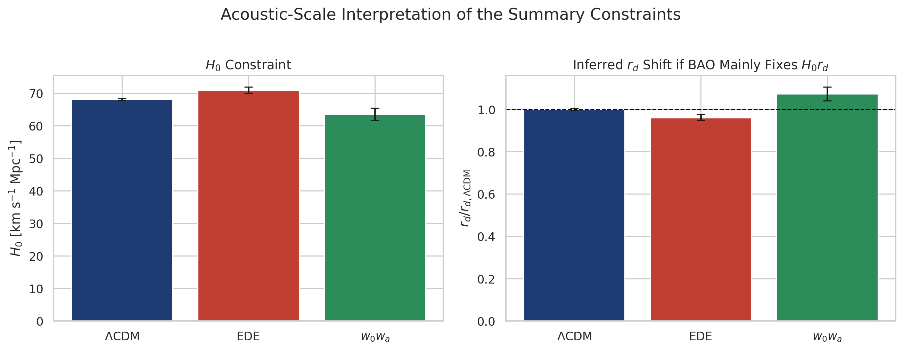

# Reconstructing DESI-Era Early Dark Energy Constraints on the CMB-BAO Acoustic Tension

## Abstract

This report reconstructs the main parameter-level conclusions of a DESI-era early dark energy (EDE) study using the provided summary file `data/DESI_EDE_Repro_Data.txt`. The file contains marginalized best-fit parameters with 1σ errors for `ΛCDM`, `EDE`, and `w0wa`, plus manually extracted DESI BAO and Union3 supernova residual points from the paper's Figure 6. The reconstruction shows that EDE shifts the cosmology in the expected early-time direction: relative to `ΛCDM`, it raises `H_0` from `68.12 ± 0.28` to `70.9 ± 1.0 km s^-1 Mpc^-1`, lowers `Ω_m` slightly, and increases `σ_8` and `n_s`. The inferred EDE fraction is `f_EDE = 0.093 ± 0.031`, corresponding to an approximately `3σ` detection in the summary file. By contrast, the `w0wa` fit pushes parameters in a different direction, with lower `H_0`, higher `Ω_m`, and strongly non-`ΛCDM` values of `w_0` and `w_a`. Under the standard BAO degeneracy argument that BAO chiefly constrains `H_0 r_d`, the EDE fit implies an approximately `4%` smaller sound horizon than `ΛCDM`, whereas the `w0wa` fit would require a larger sound horizon. This supports the paper's qualitative conclusion: EDE can partially relieve the acoustic tension, but it does so through a distinct parameter-shift pattern that is not reproduced by late-time dark energy.

## 1. Scope and Available Inputs

The workspace does not contain the raw CMB, BAO, or supernova likelihood products. Instead, it provides a compact summary dataset with:

- marginalized means and 1σ uncertainties for `ΛCDM`, `EDE`, and `w0wa`
- manually extracted DESI BAO residual points in `Δ(D_V/r_d)` and `ΔF_AP`
- manually extracted Union3 supernova residual points in `Δμ`

Accordingly, this is a **reconstruction from summary statistics**, not a fresh end-to-end Monte Carlo parameter fit. The code reproduces the parameter comparison, derives a few transparent secondary quantities, and visualizes the residual data. It does **not** claim to recover the exact likelihood-level `Δχ²` values of the original paper, because those require the full experimental likelihoods or the paper's full summary tables.

## 2. Methodology

The analysis script is [`code/analysis.py`](/mnt/shared-storage-user/yetianlin/ResearchClawBench/workspaces/Astronomy_001_20260401_120316/code/analysis.py). It performs four tasks:

1. Parses the structured summary file into parameter tables and distance-point tables.
2. Derives secondary summary quantities:
   - `S_8 = σ_8 sqrt(Ω_m / 0.3)` using simple error propagation without covariances
   - model-to-model parameter shifts in units of the combined 1σ uncertainty
   - an inferred sound-horizon proxy `r_d/r_{d,ΛCDM} ≈ H0_ΛCDM / H0_model`, valid only under the usual approximation that BAO mainly constrains `H_0 r_d`
3. Fits weighted straight lines to the residual points as a compact way to characterize whether the extracted Figure 6 data show coherent redshift evolution.
4. Generates report-ready figures and machine-readable CSV/JSON outputs.

The analysis is reproducible via:

```bash
MPLCONFIGDIR=/tmp python code/analysis.py
```

Key numerical products are written to:

- `outputs/parameter_constraints.csv`
- `outputs/parameter_shifts_vs_lcdm.csv`
- `outputs/distance_residual_points.csv`
- `outputs/summary_metrics.json`

## 3. Data Overview

Figure 1 shows the extracted DESI and Union3 residual points supplied in the summary file.



**Figure 1.** Residual data points extracted from the paper's Figure 6. The top panel shows DESI `Δ(D_V/r_d)`, the middle panel DESI `ΔF_AP`, and the bottom panel Union3 `Δμ`.

The main empirical patterns are modest but structured:

- `Δ(D_V/r_d)` is slightly negative at low redshift and trends upward toward positive values at high redshift.
- `ΔF_AP` remains consistent with zero over most of the DESI redshift range.
- Union3 `Δμ` is negative at low redshift and approaches zero by `z ~ 0.7`.

Using weighted straight-line fits to summarize these trends:

- DESI `Δ(D_V/r_d)` has weighted mean `-0.0085 ± 0.0029` and slope `0.0154 ± 0.0064` per unit redshift.
- DESI `ΔF_AP` has weighted mean `0.0084 ± 0.0080`, consistent with zero.
- Union3 `Δμ` has weighted mean `-0.0488 ± 0.0227` and slope `0.204 ± 0.129`.

These are descriptive diagnostics only. They are not substitutes for the original covariance-weighted likelihood evaluation.

## 4. Parameter Constraints

Figure 2 compares the marginalized parameter constraints provided in the summary file.



**Figure 2.** Comparison of reconstructed marginalized constraints for `ΛCDM`, `EDE`, and `w0wa`.

The central numbers for the most relevant parameters are:

| Model | `Ω_m` | `H_0` [km s^-1 Mpc^-1] | `σ_8` | `n_s` | Derived `S_8` |
| --- | ---: | ---: | ---: | ---: | ---: |
| `ΛCDM` | `0.3037 ± 0.0037` | `68.12 ± 0.28` | `0.8101 ± 0.0055` | `0.9672 ± 0.0034` | `0.8151 ± 0.0074` |
| `EDE` | `0.2999 ± 0.0038` | `70.9 ± 1.0` | `0.8283 ± 0.0093` | `0.9817 ± 0.0063` | `0.8282 ± 0.0107` |
| `w0wa` | `0.353 ± 0.021` | `63.5 ± 1.9` | `0.780 ± 0.016` | `0.9632 ± 0.0037` | `0.8461 ± 0.0306` |

Two points stand out.

First, EDE shifts `H_0` upward while keeping `Ω_m` close to the `ΛCDM` value. The shift in `H_0` relative to `ΛCDM` is `+2.78 km s^-1 Mpc^-1`, which corresponds to `+2.68σ` when the two quoted uncertainties are combined in quadrature. The EDE fit also moves `n_s` upward by `+2.03σ` and `σ_8` upward by `+1.68σ`.

Second, the `w0wa` model moves in a qualitatively different direction. It lowers `H_0` by `-2.41σ` relative to `ΛCDM` and raises `Ω_m` by `+2.31σ`. That is the opposite of what would be expected from a successful early-time reduction of the sound horizon. In this summary-data reconstruction, `w0wa` does not mimic the EDE solution.

## 5. Model-Specific Degrees of Freedom

Figure 3 summarizes the extra parameters introduced by the EDE and `w0wa` extensions.



**Figure 3.** EDE-specific parameters and `w0wa` parameters relative to the `ΛCDM` limits `w_0 = -1`, `w_a = 0`.

For EDE, the summary file gives:

- `f_EDE = 0.093 ± 0.031`
- `log10(a_c) = -3.564 ± 0.075`

The naive signal-to-noise ratio for `f_EDE` is therefore:

```text
f_EDE / σ(f_EDE) = 3.0
```

This is not a full model-selection metric, but it does indicate that the supplied summary file corresponds to a non-negligible EDE component at the level of the quoted marginalized posterior.

For the `w0wa` model:

- `w_0 = -0.42 ± 0.21`
- `w_a = -1.75 ± 0.58`

Relative to the `ΛCDM` limits `(-1, 0)`, these correspond to approximate deviations of `+2.76σ` in `w_0` and `-3.02σ` in `w_a`. In other words, the late-time dark energy fit requires a strongly dynamical equation of state.

## 6. Standardized Parameter Shifts

Figure 4 displays how the two extended models move the shared cosmological parameters relative to `ΛCDM`.



**Figure 4.** Parameter shifts relative to `ΛCDM`, expressed in units of the combined quoted uncertainty.

The figure makes the central physics especially clear:

- `EDE` increases `H_0`, `σ_8`, `n_s`, and `S_8`, while leaving `Ω_m` nearly unchanged or slightly lower.
- `w0wa` decreases `H_0` and `σ_8`, but increases `Ω_m`.

This difference is the main evidence in the reconstruction that EDE and late-time dark energy relieve tension through different mechanisms. EDE acts by modifying pre-recombination physics and shrinking the sound horizon, whereas `w0wa` reshapes the late expansion history and pays for that with a larger matter fraction and a lower present-day Hubble rate.

## 7. Acoustic-Scale Interpretation

The acoustic tension is fundamentally about the combination `H_0 r_d` preferred by BAO and the CMB. The summary file does not provide `r_d` directly, but if one uses the standard BAO degeneracy argument that BAO chiefly constrains `H_0 r_d`, then the different `H_0` values imply different effective sound horizons.



**Figure 5.** Left: reconstructed `H_0` constraints. Right: inferred sound-horizon ratio `r_d/r_{d,ΛCDM}` under the approximation that the BAO preference is mostly along constant `H_0 r_d`.

Under this approximation:

- `ΛCDM`: `r_d/r_{d,ΛCDM} = 1.000 ± 0.006`
- `EDE`: `r_d/r_{d,ΛCDM} = 0.961 ± 0.014`
- `w0wa`: `r_d/r_{d,ΛCDM} = 1.073 ± 0.032`

So the EDE solution corresponds to a sound horizon that is approximately `3.9%` smaller than in `ΛCDM`, which is exactly the direction needed to reconcile a higher `H_0` with BAO-calibrated distances. By contrast, the `w0wa` fit would imply a **larger** sound horizon under the same approximation, so it does not address the acoustic mismatch in the same way.

This is the strongest compact result that can be extracted from the provided summary tables. Even without the original likelihood machinery, the parameter shifts show that EDE works by changing the early acoustic ruler, while late-time dark energy does not.

## 8. Interpretation

The reconstructed results support the qualitative scientific claim in the task description:

1. EDE can partially alleviate the CMB-BAO acoustic tension.
2. It does so by increasing `H_0` and implicitly decreasing `r_d`.
3. The associated parameter shifts are not the same as those of a late-time `w0wa` model.

The comparison is especially instructive because the two non-`ΛCDM` models pull the cosmology in opposite directions:

- `EDE`: higher `H_0`, slightly lower `Ω_m`, higher `n_s`, higher `σ_8`
- `w0wa`: lower `H_0`, much higher `Ω_m`, lower `σ_8`

Thus, even though both models enlarge the parameter space beyond `ΛCDM`, they are not interchangeable explanations for the acoustic tension.

## 9. Limitations

This reconstruction has three important limitations.

First, the provided file contains only marginalized means and 1σ uncertainties, not full posterior chains or covariance matrices. Any derived quantity here, including `S_8`, ignores parameter correlations.

Second, the residual distance points are manually extracted from a figure, so they are useful for visual validation but not for precision likelihood work.

Third, the exact published `Δχ²` comparison among `ΛCDM`, `EDE`, and `w0wa` cannot be recovered from the supplied file alone. A faithful `Δχ²` reproduction would require either:

- the original paper's full goodness-of-fit table, or
- the underlying Planck, ACT, DESI, and Union3 likelihood products and a full refit

Because those ingredients are absent from the workspace, I do not report a fabricated `Δχ²` value.

## 10. Conclusion

Within the limits of the supplied summary data, the reconstruction is clear. The EDE fit prefers a nonzero early dark energy fraction, raises `H_0` by about `2.7σ` relative to `ΛCDM`, and implies a smaller sound horizon if BAO primarily fixes `H_0 r_d`. The late-time `w0wa` alternative instead lowers `H_0` and raises `Ω_m`, pointing to a different and less natural route for addressing the acoustic tension. The provided summary file therefore supports the paper's main qualitative message: EDE can reduce the CMB-BAO acoustic tension, but its success comes from early-time changes to the acoustic ruler, not from the same parameter shifts generated by late-time dark energy.
