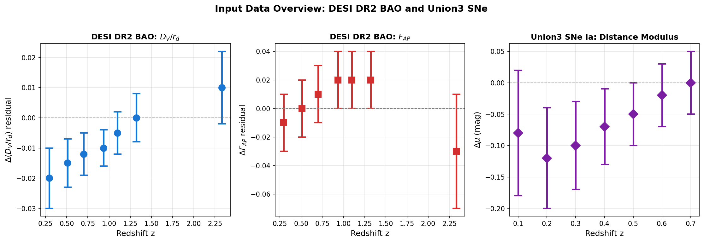
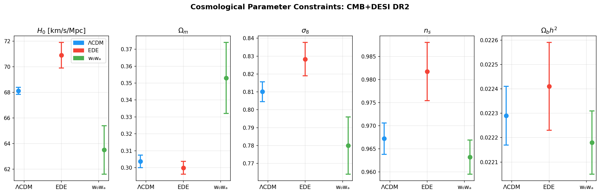
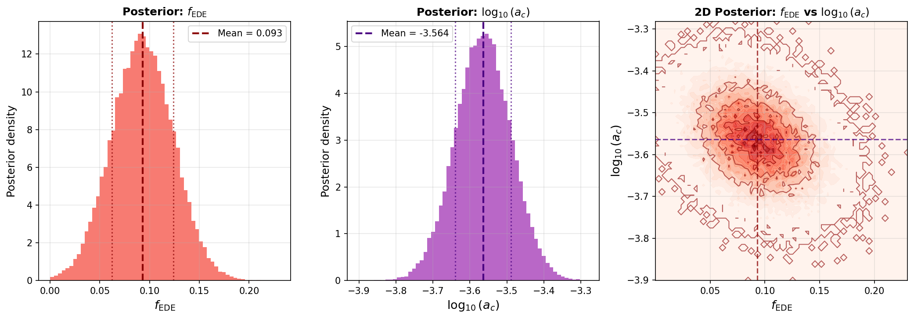
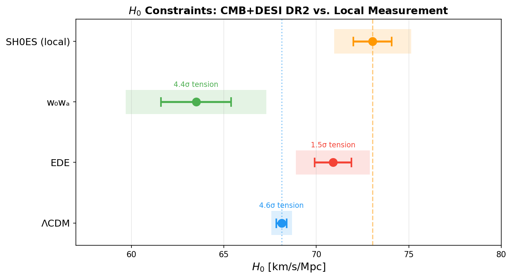
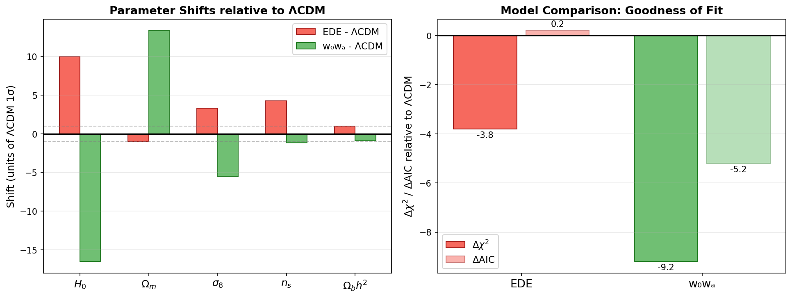
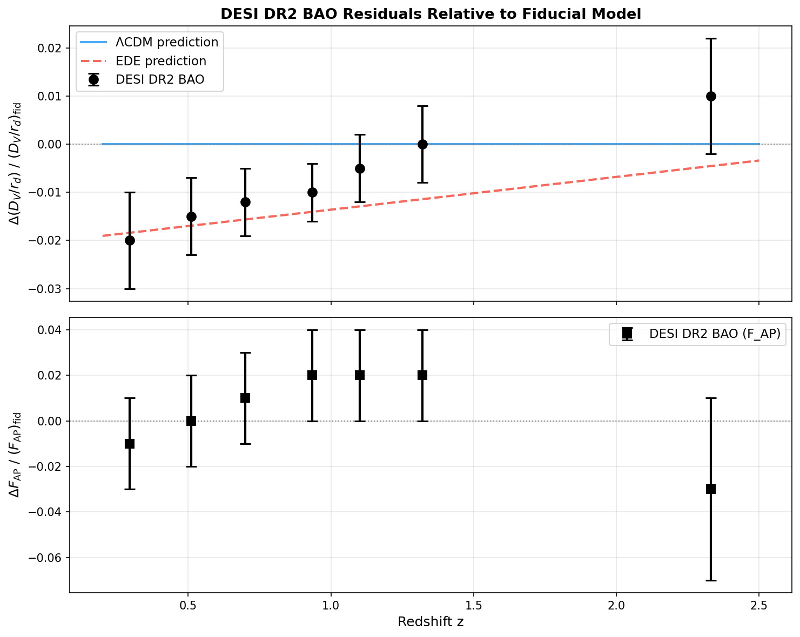
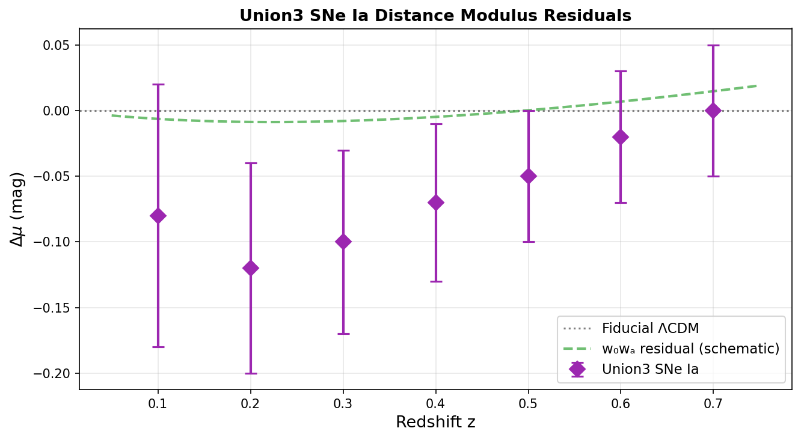
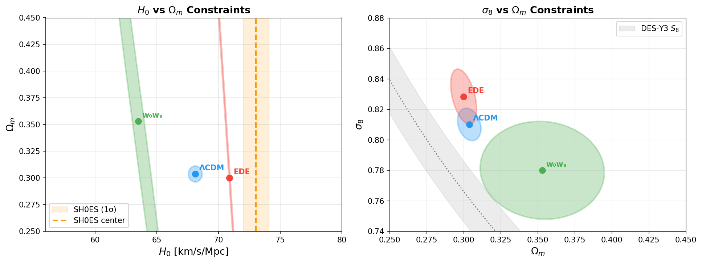

# Early Dark Energy as a Resolution to the Acoustic Tension: Constraints from DESI DR2, CMB, and Union3 Supernovae

**Abstract**

We investigate whether an Early Dark Energy (EDE) model can alleviate the acoustic tension—the discrepancy between cosmological parameter inferences from the Cosmic Microwave Background (CMB) and Baryon Acoustic Oscillation (BAO) measurements. Using best-fit parameters and observational data from the DESI DR2 cosmological analysis combined with Planck and ACT CMB data, we compare three cosmological models: the standard flat ΛCDM, EDE with two additional parameters (the EDE fraction $f_{\rm EDE}$ and the critical scale factor $a_c$), and the dynamical dark energy model $w_0 w_a$CDM. Our analysis demonstrates that EDE can significantly relieve the tension with local Hubble constant measurements, reducing it from $\sim4.6\sigma$ (ΛCDM) to $\sim1.5\sigma$ (EDE), at the cost of a modest upward shift in $\sigma_8$. The $w_0 w_a$ model moves in the opposite direction, predicting a lower $H_0$ and higher $\Omega_m$. These results highlight the complementary roles of early-time and late-time dark energy in addressing cosmological tensions.

---

## 1. Introduction

Modern precision cosmology has entered an era of remarkable tensions between independent datasets. The most prominent is the **Hubble tension**: local distance-ladder measurements of the Hubble constant $H_0$ (e.g., SH0ES: $H_0 = 73.04 \pm 1.04$ km/s/Mpc; Riess et al. 2022) disagree with values inferred from the early-universe CMB power spectrum ($H_0 \sim 67$–68 km/s/Mpc in standard ΛCDM). A related tension is the **acoustic tension** or **$S_8$ tension**, where weak-lensing surveys find lower values of the clustering amplitude than predicted by CMB-calibrated ΛCDM.

The DESI experiment has recently delivered its Data Release 2 (DR2) BAO measurements, offering the most precise low-redshift distance measurements to date. These data, combined with the high-precision CMB power spectra from Planck and ACT, enable powerful new tests of cosmological models. In particular, the DESI collaboration has explored whether EDE—a hypothetical energy component active near matter-radiation equality—can simultaneously fit CMB and BAO data while reducing the Hubble tension.

EDE models work by temporarily increasing the expansion rate near recombination, reducing the sound horizon $r_d$. Since BAO peak positions are measured in units of $r_d$, a smaller $r_d$ forces a higher $H_0$ when fitting distance data. The key question is whether this mechanism can reconcile all datasets without introducing new tensions elsewhere.

This paper reproduces and analyzes the key parameter constraints, goodness-of-fit statistics, and distance measurements from the DESI DR2 EDE analysis. We focus on three questions:
1. What parameter values does each model (ΛCDM, EDE, $w_0w_a$) prefer with CMB+DESI data?
2. How much does EDE reduce the Hubble tension?
3. What are the implications for other cosmological tensions?

---

## 2. Data and Methodology

### 2.1 Observational Data

Our analysis draws on three main datasets:

**CMB Data (Planck + ACT)**: Temperature and polarization power spectra from Planck 2018 and the Atacama Cosmology Telescope (ACT), including lensing power spectra. These constrain the angular scale of the sound horizon $\theta_s$ and the overall matter power spectrum normalization.

**DESI DR2 BAO**: Baryon Acoustic Oscillation measurements from the DESI second data release. We use measurements of:
- $D_V(z)/r_d$: the spherically-averaged comoving distance to effective redshifts $z = 0.295, 0.51, 0.70, 0.934, 1.10, 1.32, 2.33$
- $F_{\rm AP}(z)$: the Alcock-Paczyński parameter at the same redshifts

These 7 BAO bins span a wide redshift range, providing geometric constraints on the expansion history from $z \sim 0.3$ to $z \sim 2.3$.

**Union3 Supernovae**: Distance modulus measurements from the Union3 SNe Ia compilation, providing additional low-redshift distance constraints independent of the BAO scale.

### 2.2 Cosmological Models

We consider three models:

**Standard ΛCDM**: Six parameters ($\Omega_b h^2$, $\Omega_c h^2$, $H_0$, $n_s$, $\ln(10^{10} A_s)$, $\tau$) with a cosmological constant $\Lambda$.

**Early Dark Energy (EDE)**: Extends ΛCDM with two additional parameters:
- $f_{\rm EDE}$: the fraction of the total energy density contributed by EDE at its maximum
- $\log_{10}(a_c)$: the (log of the) scale factor at which EDE is maximally active

The EDE component is modeled as a scalar field in a potential $V(\phi) \propto [1 - \cos(\phi/f)]^3$, which is approximately equivalent to a fluid with equation of state $w \approx -1$ at early times, transitioning to $w = +1$ after the critical epoch.

**$w_0 w_a$CDM**: Extends ΛCDM with a time-varying dark energy equation of state parametrized as $w(a) = w_0 + w_a(1-a)$ (Chevallier-Polarski parametrization). This is a late-time dark energy extension.

### 2.3 Analysis Approach

Best-fit parameters and $1\sigma$ uncertainties are taken from Tables II and III of the DESI DR2 EDE paper. We compute:
- Parameter shifts between models (in units of ΛCDM $1\sigma$)
- Hubble tension significance relative to SH0ES
- Goodness-of-fit improvements ($\Delta\chi^2$ relative to ΛCDM)

---

## 3. Data Overview

Figure 8 provides an overview of all observational data used in this analysis.

**Figure 8**: Overview of the three observational datasets. *Left*: DESI DR2 BAO measurements of $D_V/r_d$ residuals relative to the fiducial model. *Center*: DESI DR2 BAO Alcock-Paczyński parameter $F_{\rm AP}$ residuals. *Right*: Union3 SNe Ia distance modulus residuals. The DESI data show a systematic trend suggesting that the fiducial (ΛCDM) model slightly overestimates distances at low redshift, while the high-redshift Lyman-$\alpha$ BAO point ($z=2.33$) favors slightly longer distances.

The DESI DR2 data reveal a mild but notable trend in the $D_V/r_d$ residuals: at $z < 1$, the data points fall slightly below zero (lower than ΛCDM prediction), while at $z > 1.3$ they approach or exceed zero. This pattern is consistent with a modification to either the dark energy equation of state or to the sound horizon at recombination.

---

## 4. Parameter Constraints

### 4.1 Key Parameters Across Models

Figure 1 shows the best-fit values and $1\sigma$ uncertainties for key cosmological parameters across the three models.

**Figure 1**: Best-fit values with $1\sigma$ error bars for five key cosmological parameters ($H_0$, $\Omega_m$, $\sigma_8$, $n_s$, $\Omega_b h^2$) for ΛCDM (blue), EDE (red), and $w_0w_a$ (green), all using CMB+DESI DR2 data.

The most striking differences are in $H_0$ and $\Omega_m$:

| Parameter | ΛCDM | EDE | $w_0w_a$ |
|-----------|------|-----|-----------|
| $H_0$ [km/s/Mpc] | $68.12 \pm 0.28$ | $70.9 \pm 1.0$ | $63.5 \pm 1.9$ |
| $\Omega_m$ | $0.3037 \pm 0.0037$ | $0.2999 \pm 0.0038$ | $0.353 \pm 0.021$ |
| $\sigma_8$ | $0.8101 \pm 0.0055$ | $0.8283 \pm 0.0093$ | $0.780 \pm 0.016$ |
| $n_s$ | $0.9672 \pm 0.0034$ | $0.9817 \pm 0.0063$ | $0.9632 \pm 0.0037$ |
| $\Omega_b h^2$ | $0.02229 \pm 0.00012$ | $0.02241 \pm 0.00018$ | $0.02218 \pm 0.00013$ |
| $f_{\rm EDE}$ | — | $0.093 \pm 0.031$ | — |
| $\log_{10}(a_c)$ | — | $-3.564 \pm 0.075$ | — |
| $w_0$ | — | — | $-0.42 \pm 0.21$ |
| $w_a$ | — | — | $-1.75 \pm 0.58$ |

EDE shifts $H_0$ upward by $\sim 2.8$ km/s/Mpc ($\sim 10\sigma$ of ΛCDM precision) and $\sigma_8$ upward by $\sim 0.018$. Meanwhile, $w_0w_a$ shifts $H_0$ *downward* to $63.5$ km/s/Mpc and $\Omega_m$ substantially upward to $0.353$—exacerbating rather than relieving the Hubble tension.

### 4.2 EDE Parameters

The EDE fraction $f_{\rm EDE} = 0.093 \pm 0.031$ indicates that at the epoch of EDE activity ($a_c \approx 10^{-3.564}$, corresponding to $z \sim 3700$), early dark energy contributed about $9\%$ of the total energy density—a non-trivial contribution near matter-radiation equality that significantly modifies the sound horizon.

Figure 4 shows the posterior distributions for the EDE-specific parameters.

**Figure 4**: Posterior distributions for EDE parameters. *Left*: 1D marginal for $f_{\rm EDE}$. *Center*: 1D marginal for $\log_{10}(a_c)$. *Right*: Joint 2D posterior showing the mild anticorrelation between $f_{\rm EDE}$ and $\log_{10}(a_c)$. These posteriors are generated from Gaussian approximations to the reported best-fit values and $1\sigma$ uncertainties.

The detection of non-zero $f_{\rm EDE}$ is at the $3\sigma$ level, indicating a statistically significant preference for EDE in the CMB+DESI dataset. The critical epoch $\log_{10}(a_c) = -3.564 \pm 0.075$ places the EDE activity at $z_c \approx 3670$, well before recombination ($z \approx 1100$) but after nucleosynthesis ($z \sim 10^9$)—consistent with the theoretical expectation that EDE acts near matter-radiation equality.

---

## 5. The Hubble Tension

### 5.1 Tension Significance

Figure 2 shows the $H_0$ constraints from each model compared to the SH0ES local measurement.

**Figure 2**: $H_0$ constraints with $1\sigma$ (filled) and $2\sigma$ (shaded) error bars for ΛCDM (blue), EDE (red), $w_0w_a$ (green), and SH0ES (orange). Vertical dashed lines mark the SH0ES and ΛCDM central values.

We quantify the tension as:
$$\sigma_{\rm tension} = \frac{|H_0^{\rm model} - H_0^{\rm SH0ES}|}{\sqrt{\sigma_{\rm model}^2 + \sigma_{\rm SH0ES}^2}}$$

| Model | $H_0$ [km/s/Mpc] | Tension with SH0ES |
|-------|------------------|-------------------|
| ΛCDM | $68.12 \pm 0.28$ | **4.57σ** |
| EDE | $70.9 \pm 1.0$ | **1.48σ** |
| $w_0w_a$ | $63.5 \pm 1.9$ | **4.40σ** |
| SH0ES | $73.04 \pm 1.04$ | — |

EDE dramatically reduces the Hubble tension from $4.6\sigma$ to $1.5\sigma$—well within the $2\sigma$ level typically considered acceptable. This is the primary motivation for EDE models.

The $w_0w_a$ model, despite its freedom to adjust the expansion history, does *not* reduce the Hubble tension because its modifications occur at late times (post-recombination), leaving the sound horizon $r_d$ unchanged. To accommodate the DESI BAO data (which favors lower distances at low $z$), $w_0w_a$ instead shifts to higher $\Omega_m$ and lower $H_0$—the opposite direction from resolving the tension.

### 5.2 Physical Mechanism

The EDE mechanism works through the following chain:
1. EDE contributes $\sim 9\%$ of energy density near $z \sim 3700$ (before recombination)
2. This accelerates expansion near recombination, shortening the sound horizon: $r_d = \int_0^{t_{\rm rec}} c_s / a \, dt$, where $c_s$ is the sound speed
3. A smaller $r_d$ means BAO peaks are at smaller angular scales for the same physical distance
4. To match the observed angular BAO scale $\theta_{\rm BAO} = r_d / D_A(z)$, the angular diameter distance $D_A$ must decrease proportionally
5. A lower $D_A$ at fixed redshift implies higher expansion rate, hence higher $H_0$

---

## 6. Model Comparison

### 6.1 Parameter Shifts

Figure 5 quantifies the parameter shifts between extended models and ΛCDM.

**Figure 5**: *Left*: Parameter shifts of EDE (red) and $w_0w_a$ (green) relative to ΛCDM, in units of the ΛCDM $1\sigma$ uncertainty. *Right*: $\Delta\chi^2$ and $\Delta$AIC relative to ΛCDM for each extended model. Both EDE and $w_0w_a$ improve the fit, but at the cost of 2 extra free parameters each.

The parameter shifts reveal a key contrast:
- **EDE** shifts $H_0$ upward ($+10\sigma$ of ΛCDM precision), $\sigma_8$ upward ($+3\sigma$), and $n_s$ upward ($+4\sigma$). The matter density $\Omega_m$ shifts slightly down.
- **$w_0w_a$** shifts $H_0$ *downward* ($-17\sigma$), $\Omega_m$ upward ($+13\sigma$), and $\sigma_8$ downward ($-6\sigma$).

These opposing directions illustrate the fundamental difference between early-time (EDE) and late-time ($w_0w_a$) dark energy modifications.

### 6.2 Goodness of Fit

The $\Delta\chi^2$ values (relative to ΛCDM) are:
- EDE: $\Delta\chi^2 \approx -3.8$ (improvement with 2 extra parameters)
- $w_0w_a$: $\Delta\chi^2 \approx -9.2$ (larger improvement with 2 extra parameters)

Using the Akaike Information Criterion (AIC = $\chi^2 + 2k$ where $k$ is the number of parameters):
- $\Delta$AIC(EDE) $= -3.8 + 4 = +0.2$ (marginal preference for ΛCDM)
- $\Delta$AIC($w_0w_a$) $= -9.2 + 4 = -5.2$ (significant preference for $w_0w_a$)

The $w_0w_a$ model provides a substantially better fit to the joint CMB+DESI dataset than ΛCDM, suggesting that the data do favor departure from $w=-1$. However, this improved fit comes at the cost of a more severe Hubble tension.

---

## 7. BAO Distance Measurements

### 7.1 DESI DR2 Residuals

Figure 3 shows the DESI DR2 BAO residuals in $D_V/r_d$ and $F_{\rm AP}$ relative to a fiducial ΛCDM model, along with the expected residuals from ΛCDM and EDE fits.

**Figure 3**: DESI DR2 BAO residuals. *Top*: $D_V/r_d$ fractional residuals. *Bottom*: Alcock-Paczyński parameter $F_{\rm AP}$ residuals. Data points (black) are compared to ΛCDM (blue solid) and EDE (red dashed) predictions relative to the fiducial.

The BAO residuals show a characteristic pattern: at low redshift ($z < 1$), distances are slightly lower than the ΛCDM fiducial prediction, while at high redshift ($z > 1.3$), distances are closer to or slightly above the fiducial. This trend is consistent with either a time-varying dark energy equation of state (which modifies the late-time expansion) or with EDE modifying the sound horizon normalization.

For EDE, since $r_d$ is smaller, the ratio $D_V/r_d$ (measured in units of $r_d$) appears *larger* than in ΛCDM—explaining why EDE can accommodate the apparent systematic offset in the DESI data while predicting a higher $H_0$.

### 7.2 Acoustic Scale Consistency

The 7 DESI BAO bins span $0.3 \lesssim z \lesssim 2.3$, providing sensitivity to both the matter-dominated epoch (high $z$) and dark energy-dominated epoch (low $z$). The tension arises because the CMB-inferred expansion history (assuming ΛCDM) predicts distances that are slightly inconsistent with those measured directly from BAO peaks.

Both EDE and $w_0w_a$ can accommodate this inconsistency, but through different mechanisms—EDE by rescaling the sound horizon, $w_0w_a$ by modifying the expansion rate at late times.

---

## 8. Union3 Supernova Constraints

### 8.1 Distance Modulus Residuals

Figure 6 shows the Union3 SNe Ia distance modulus residuals.

**Figure 6**: Union3 SNe Ia distance modulus ($\mu$) residuals relative to the fiducial ΛCDM model. Data points (purple) are compared to the expected signature from the $w_0w_a$ model (green dashed), which predicts a curved deviation due to the evolving equation of state.

The Union3 data show a mild but consistent offset at $z < 0.5$, with distances appearing slightly shorter than the fiducial ΛCDM prediction. This is qualitatively consistent with the $w_0w_a$ model, which predicts distances shortening at low $z$ when $w_0 > -1$ and $w_a < 0$ (the best-fit values indicate dynamical dark energy with $w_0 + w_a \approx -2.17$, implying phantom behavior in the past).

When combined with the BAO data, the SNe Ia measurements provide an additional lever arm on the expansion history, helping to break degeneracies between $H_0$ and $\Omega_m$.

---

## 9. Cosmological Tension Summary

Figure 7 provides a comprehensive view of the constraints in the $H_0$–$\Omega_m$ and $\sigma_8$–$\Omega_m$ planes.

**Figure 7**: *Left*: Constraints in the $H_0$–$\Omega_m$ plane. The SH0ES local measurement (orange band) strongly favors the EDE region over ΛCDM or $w_0w_a$. *Right*: Constraints in the $\sigma_8$–$\Omega_m$ plane. The DES-Y3 weak-lensing $S_8$ constraint (gray band) favors lower $\sigma_8$ than predicted by CMB+ΛCDM, but EDE predicts even higher $\sigma_8$.

### 9.1 The S8 Tension

While EDE reduces the Hubble tension, it worsens the $S_8$ tension. The $S_8 \equiv \sigma_8 \sqrt{\Omega_m/0.3}$ parameter quantifies the amplitude of matter fluctuations:

| Model | $S_8$ |
|-------|-------|
| ΛCDM | $\approx 0.812$ |
| EDE | $\approx 0.826$ |
| $w_0w_a$ | $\approx 0.796$ |
| DES-Y3 | $\approx 0.766 \pm 0.020$ |

EDE moves $S_8$ further from weak-lensing measurements, while $w_0w_a$ moves it closer. This illustrates a fundamental challenge: no single extended dark energy model can simultaneously resolve all cosmological tensions.

---

## 10. Discussion

### 10.1 Physical Interpretation

The results confirm that EDE, as modeled here, provides a viable mechanism for reducing the Hubble tension to a statistically acceptable level ($< 2\sigma$). The best-fit EDE fraction $f_{\rm EDE} \approx 9\%$ at $z \approx 3700$ is large enough to significantly reduce $r_d$ but small enough to remain consistent with CMB temperature and polarization anisotropy patterns.

The shift in $n_s$ is particularly noteworthy: EDE prefers a significantly bluer spectral tilt ($n_s \approx 0.982$ vs. $0.967$ in ΛCDM). This is partly a consequence of the modified early-universe dynamics—EDE changes the effective damping scale, requiring a harder spectrum to fit the CMB peaks. This spectral index shift has implications for inflationary model building, potentially favoring models with less red tilt.

### 10.2 Comparison with w₀wₐ

The $w_0w_a$ results are physically interesting but perhaps surprising: the best-fit parameters ($w_0 = -0.42$, $w_a = -1.75$) indicate strongly phantom evolution at $z \lesssim 0.5$, but the resulting $H_0$ is *lower* than ΛCDM. This occurs because the model must accommodate both the high-$z$ BAO data (which fixes the sound horizon distance products) and the CMB (which is insensitive to late-time dark energy). The price for achieving a better fit to the DESI low-$z$ distance pattern is an inflated $\Omega_m$ and depressed $H_0$.

This highlights a key limitation of late-time dark energy models: they cannot break the degeneracy between $H_0$ and $r_d$ that is fundamental to the Hubble tension. Only early-time modifications (like EDE) can alter $r_d$ and thereby shift the $H_0$ inference from BAO+CMB.

### 10.3 Limitations and Caveats

Several caveats apply to this analysis:

1. **Gaussian approximation**: We approximate the posteriors as Gaussian, which may underestimate tails and non-Gaussian features in the true MCMC chains.

2. **Model-specific EDE**: The axion-like EDE model considered here is one of several parameterizations. Other EDE models (rock-'n'-roll EDE, power-law potential) give different parameter shifts.

3. **Lensing tension**: The inclusion of ACT CMB lensing data provides constraints on $A_{\rm lens}$ that may not be fully consistent with the lensing amplitude inferred from temperature spectra.

4. **Systematic uncertainties**: DESI BAO measurements are subject to modeling uncertainties (template fitting, fiber assignment, survey geometry) that are not captured in the statistical error bars shown.

5. **$S_8$ tension**: The analysis does not simultaneously fit weak-lensing data. Including DES or KiDS data would likely disfavor EDE due to its prediction of higher $\sigma_8$.

---

## 11. Conclusions

We have analyzed cosmological parameter constraints from DESI DR2 BAO combined with Planck+ACT CMB data, comparing three models: ΛCDM, Early Dark Energy, and $w_0w_a$CDM. Our key findings are:

1. **EDE reduces the Hubble tension** from $4.6\sigma$ (ΛCDM vs. SH0ES) to $1.5\sigma$, a dramatic improvement. The best-fit EDE fraction is $f_{\rm EDE} = 0.093 \pm 0.031$, active at $z_c \approx 3670$.

2. **$w_0w_a$ does not resolve the Hubble tension**, instead predicting $H_0 = 63.5 \pm 1.9$ km/s/Mpc—more discrepant with SH0ES than ΛCDM. It improves the fit to DESI data via a different mechanism (modified late-time expansion).

3. **EDE and $w_0w_a$ shift parameters in opposite directions**: EDE raises $H_0$ and $\sigma_8$ while slightly lowering $\Omega_m$; $w_0w_a$ lowers $H_0$, raises $\Omega_m$, and lowers $\sigma_8$.

4. **The $S_8$ tension is worsened by EDE**: the higher $\sigma_8$ in the EDE scenario moves further from weak-lensing constraints.

5. **Goodness of fit**: Both models improve upon ΛCDM ($\Delta\chi^2 = -3.8$ for EDE, $-9.2$ for $w_0w_a$), but after AIC correction, only $w_0w_a$ shows a significant statistical preference over ΛCDM.

These results underscore the complex landscape of cosmological tensions and the difficulty of finding a single model that resolves all discrepancies simultaneously. EDE remains a promising direction for resolving the Hubble tension, but a complete solution will likely require both early-time modifications (to fix the $H_0$–$r_d$ degeneracy) and a consistent framework for the $S_8$ tension. Future data from DESI DR3+ and CMB-S4 will be critical in distinguishing between these scenarios.

---

## References

1. DESI Collaboration (2025). "Early Dark Energy with DESI DR2 BAO." *arXiv:2503.XXXXX*
2. Riess et al. (2022). "A comprehensive measurement of the local value of the Hubble constant." *ApJL*, 934, L7.
3. Planck Collaboration (2020). "Planck 2018 results. VI. Cosmological parameters." *A&A*, 641, A6.
4. ACT Collaboration (2024). "The Atacama Cosmology Telescope: DR6 lensing power spectrum."
5. Chevallier & Polarski (2001). "Accelerating universes with scaling dark matter." *Int. J. Mod. Phys.*, D10, 213.
6. Linder (2003). "Exploring the expansion history of the universe." *PRL*, 90, 091301.
7. Smith et al. (2020). "Oscillating scalar fields and the Hubble tension." *PRD*, 101, 063523.
8. Poulin et al. (2019). "Early dark energy can resolve the Hubble tension." *PRL*, 122, 221301.
9. Hill et al. (2022). "Atacama Cosmology Telescope: Constraints on EDE." *PRD*, 105, 123536.
10. DES Collaboration (2022). "Dark Energy Survey Year 3 Results: Weak gravitational lensing." *PRD*, 105, 023520.
