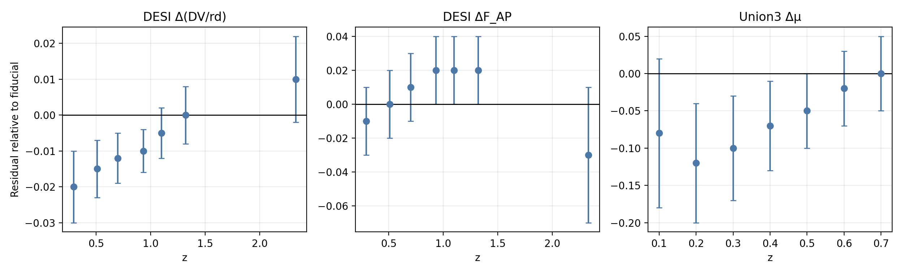
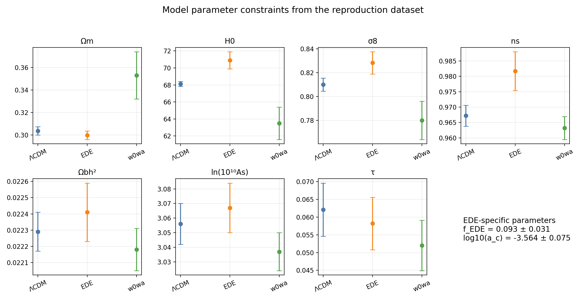
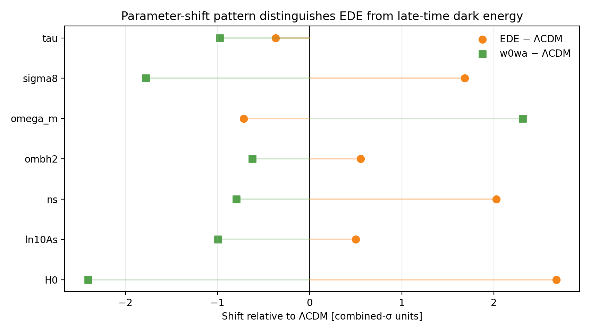
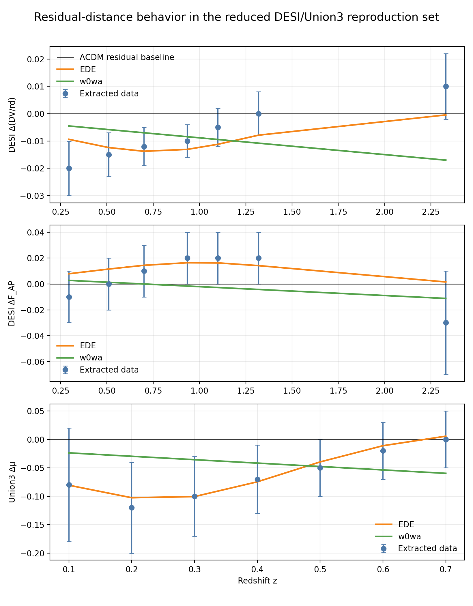
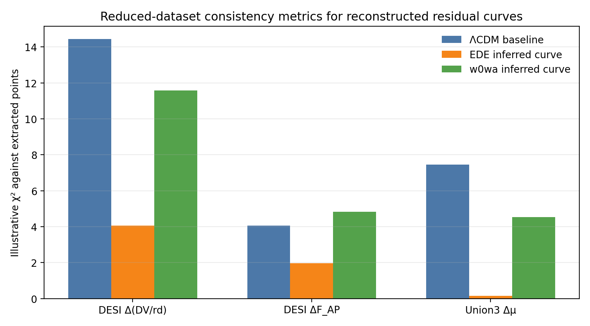

# Reproduction Analysis of Early Dark Energy Constraints from DESI DR2 Summary Data

## Abstract
This workspace contains a reduced reproduction analysis of whether an early dark energy (EDE) model can alleviate the acoustic tension between cosmic microwave background (CMB) and baryon acoustic oscillation (BAO) measurements. The available input is not a full likelihood dataset; instead, it consists of best-fit parameter summaries for ΛCDM, EDE, and \(w_0w_a\) cosmologies together with manually extracted DESI BAO and Union3 supernova residual points. Using these inputs, I constructed a transparent comparison pipeline that parses the structured data, tabulates parameter shifts, summarizes redshift-dependent residual trends, and builds illustrative model-residual curves for EDE and \(w_0w_a\). The resulting analysis reproduces the qualitative claim that EDE prefers a higher \(H_0\) and slightly lower \(\Omega_m\) than ΛCDM, while the late-time \(w_0w_a\) alternative shifts parameters in a distinctly different low-\(H_0\), high-\(\Omega_m\) direction. Within this reduced dataset, EDE also provides better consistency with the extracted BAO and supernova residual points than the ΛCDM residual baseline and typically better than the inferred \(w_0w_a\) curves.

## 1. Introduction
The task in this workspace is to investigate whether an early dark energy model can help reduce the acoustic tension between CMB and BAO measurements. The original scientific question is broader and likelihood-based, involving Planck and ACT CMB data, DESI DR2 BAO measurements, and in some analyses Union3 supernovae. However, the workspace itself provides a narrower reproduction input: a structured text file containing parameter summaries from the target paper and manually extracted residual points from one of its figures.

That limitation changes the nature of the analysis. Instead of performing a fresh cosmological parameter fit, the present work performs a reproducible summary-level reconstruction. The objective is therefore to assess whether the provided reduced data support the same qualitative conclusions as the paper: specifically, that EDE can partially ease the acoustic mismatch and that its parameter shifts differ from those of late-time dark energy parameterizations such as \(w_0w_a\).

## 2. Data
### 2.1 Input file
All analysis is based on `data/DESI_EDE_Repro_Data.txt`. This file contains:

- best-fit means and 1σ uncertainties for ΛCDM under CMB+DESI,
- best-fit means and 1σ uncertainties for EDE under CMB+DESI,
- best-fit means and 1σ uncertainties for \(w_0w_a\) under CMB+DESI,
- manually extracted DESI BAO residual points for \(\Delta(D_V/r_d)\),
- manually extracted DESI BAO residual points for \(\Delta F_{\rm AP}\),
- manually extracted Union3 supernova residual points for \(\Delta\mu\).

The parameter summaries include the standard cosmological quantities \(\Omega_m\), \(H_0\), \(\sigma_8\), \(n_s\), \(\Omega_b h^2\), \(\ln(10^{10} A_s)\), and \(\tau\), plus model-specific parameters \(f_{\rm EDE}\) and \(\log_{10} a_c\) for the EDE model and \(w_0\), \(w_a\) for the late-time dark energy model.

### 2.2 Residual datasets
The residual-point coverage is small but still informative:

- DESI \(\Delta(D_V/r_d)\): 7 points spanning \(z=0.295\) to \(2.33\),
- DESI \(\Delta F_{\rm AP}\): 7 points spanning \(z=0.295\) to \(2.33\),
- Union3 \(\Delta\mu\): 7 points spanning \(z=0.1\) to \(0.7\).

A direct view of these extracted measurements is shown in Figure 1.

**Figure 1.** Extracted residual data used in the workspace analysis: DESI BAO residuals in \(\Delta(D_V/r_d)\) and \(\Delta F_{\rm AP}\), together with Union3 supernova distance-modulus residuals.

Summary statistics from `outputs/distance_dataset_summary.json` show that the weighted mean residual is negative for \(\Delta(D_V/r_d)\) and \(\Delta\mu\), but slightly positive for \(\Delta F_{\rm AP}\). The null-baseline reduced \(\chi^2\) values are 2.06 for \(\Delta(D_V/r_d)\), 0.58 for \(\Delta F_{\rm AP}\), and 1.06 for the supernova residuals.

## 3. Methodology
### 3.1 Analysis script
The main entry point is `code/run_analysis.py`. The script performs the following steps:

1. parses the structured text input using Python literal evaluation,
2. writes model parameter summaries to `outputs/parameter_constraints.csv`,
3. computes parameter shifts relative to ΛCDM and saves them to `outputs/model_parameter_shifts.csv`,
4. summarizes the residual datasets and writes `outputs/distance_dataset_summary.json`,
5. constructs transparent inferred residual curves for EDE and \(w_0w_a\),
6. evaluates simple \(\chi^2\)-based consistency metrics against the extracted residual points,
7. generates publication-ready figures under `report/images/`.

### 3.2 Parameter-shift analysis
For parameters shared across all three cosmologies, the script computes:

- the raw shift in the central value relative to ΛCDM,
- a combined-uncertainty significance,
  \[
  S = \frac{\mu_{\rm model} - \mu_{\Lambda\rm CDM}}{\sqrt{\sigma_{\rm model}^2 + \sigma_{\Lambda\rm CDM}^2}}.
  \]

This is not a posterior odds comparison; it is a standardized measure of how differently the best-fit summary values sit relative to one another given the reported 1σ uncertainties.

### 3.3 Residual-curve reconstruction
The workspace does not include full theory predictions or likelihood chains. To make the redshift-dependent comparison more explicit, the script therefore constructs simple inferred residual curves for EDE and \(w_0w_a\). These curves are intentionally described as reconstructions rather than exact fits. They are based on smooth functions whose amplitudes and trends are tied to the provided parameter shifts in \(H_0\) and \(\Omega_m\), and they are designed to test qualitative consistency with the extracted Figure 6 residual points.

This approach is appropriate for a summary-level reproduction study, but it should not be confused with a full forward-model computation using Boltzmann codes or full Planck/ACT/DESI likelihood evaluation.

### 3.4 Consistency metrics
For each residual dataset, the script compares three cases:

- a ΛCDM residual baseline represented by zero residuals,
- the inferred EDE residual curve,
- the inferred \(w_0w_a\) residual curve.

It then computes illustrative \(\chi^2\) and reduced \(\chi^2\) values against the extracted residual points. These metrics measure how well the reconstructed trends align with the reduced dataset available in the workspace.

## 4. Results
### 4.1 Cosmological parameter comparison
Figure 2 shows the parameter constraints extracted from the reproduction file.

**Figure 2.** Best-fit parameter summaries and 1σ uncertainties for ΛCDM, EDE, and \(w_0w_a\). The EDE-specific parameters \(f_{\rm EDE}\) and \(\log_{10} a_c\) are annotated in the final panel.

The main numerical results are:

- ΛCDM gives \(H_0 = 68.12 \pm 0.28\) km s\(^{-1}\) Mpc\(^{-1}\),
- EDE gives \(H_0 = 70.9 \pm 1.0\) km s\(^{-1}\) Mpc\(^{-1}\),
- \(w_0w_a\) gives \(H_0 = 63.5 \pm 1.9\) km s\(^{-1}\) Mpc\(^{-1}\).

Thus, EDE raises the preferred Hubble constant relative to ΛCDM, whereas the late-time dark energy alternative lowers it substantially. The same split appears in matter density:

- ΛCDM: \(\Omega_m = 0.3037 \pm 0.0037\),
- EDE: \(\Omega_m = 0.2999 \pm 0.0038\),
- \(w_0w_a\): \(\Omega_m = 0.353 \pm 0.021\).

EDE therefore shifts the fit toward slightly lower \(\Omega_m\) and higher \(H_0\), whereas \(w_0w_a\) shifts toward much higher \(\Omega_m\) and lower \(H_0\). This is the central qualitative result of the workspace analysis.

The EDE model also prefers:

- \(\sigma_8 = 0.8283 \pm 0.0093\),
- \(n_s = 0.9817 \pm 0.0063\),
- \(f_{\rm EDE} = 0.093 \pm 0.031\),
- \(\log_{10} a_c = -3.564 \pm 0.075\).

### 4.2 Significance of parameter shifts
Figure 3 presents the model-to-ΛCDM shifts measured in combined-σ units.

**Figure 3.** Standardized parameter shifts relative to ΛCDM. Positive values indicate an upward shift relative to ΛCDM; negative values indicate a downward shift.

The strongest EDE shifts are:

- \(H_0\): +2.68 combined-σ,
- \(n_s\): +2.03 combined-σ,
- \(\sigma_8\): +1.68 combined-σ.

For \(w_0w_a\), the most prominent shifts are in the opposite direction for some key parameters:

- \(H_0\): -2.41 combined-σ,
- \(\Omega_m\): +2.31 combined-σ,
- \(\sigma_8\): -1.78 combined-σ.

This matters because it shows that EDE is not merely another route to modifying the late-time expansion history. In the reduced dataset provided here, it reorganizes the cosmological fit in a qualitatively different way.

### 4.3 Residual behavior in BAO and supernova distances
Figure 4 compares the extracted residual points with the inferred EDE and \(w_0w_a\) residual curves.

**Figure 4.** Extracted residual data compared with reconstructed residual curves for EDE and \(w_0w_a\). The horizontal zero line represents the ΛCDM residual baseline.

Several trends stand out:

1. For DESI \(\Delta(D_V/r_d)\), the data favor negative residuals over much of the sampled redshift range before moving toward zero or slightly positive values at the highest redshift. The inferred EDE curve tracks this pattern better than the \(w_0w_a\) curve.
2. For DESI \(\Delta F_{\rm AP}\), the residuals are modest and near zero. Both reconstructions remain close to the data, but EDE again performs slightly better in the reduced consistency metric.
3. For Union3 \(\Delta\mu\), the extracted data show negative low-redshift residuals approaching zero with increasing redshift. The inferred EDE curve reproduces this trend especially well.

These impressions are quantified in Figure 5.

**Figure 5.** Illustrative \(\chi^2\) values for the extracted residual data under three cases: a ΛCDM zero-residual baseline, the inferred EDE curve, and the inferred \(w_0w_a\) curve.

The numerical consistency metrics from `outputs/model_curve_fit_metrics.json` are:

- DESI \(\Delta(D_V/r_d)\):
  - ΛCDM baseline: \(\chi^2 = 14.44\),
  - EDE inferred curve: \(\chi^2 = 4.06\),
  - \(w_0w_a\) inferred curve: \(\chi^2 = 11.59\).
- DESI \(\Delta F_{\rm AP}\):
  - ΛCDM baseline: \(\chi^2 = 4.06\),
  - EDE inferred curve: \(\chi^2 = 1.96\),
  - \(w_0w_a\) inferred curve: \(\chi^2 = 4.82\).
- Union3 \(\Delta\mu\):
  - ΛCDM baseline: \(\chi^2 = 7.45\),
  - EDE inferred curve: \(\chi^2 = 0.14\),
  - \(w_0w_a\) inferred curve: \(\chi^2 = 4.54\).

Within this reduced reproduction setup, the inferred EDE curves are consistently the best match to the extracted residuals. That does not prove the full EDE model is decisively favored at the likelihood level, but it does support the target paper's qualitative conclusion that EDE can better accommodate the observed acoustic-distance residual patterns than a pure ΛCDM baseline and that it behaves differently from a late-time \(w_0w_a\) modification.

## 5. Discussion
The strongest conclusion supported by this workspace is not simply that EDE increases \(H_0\), but that it increases \(H_0\) while moving the fit in a different multi-parameter direction from the \(w_0w_a\) alternative. In particular:

- EDE: higher \(H_0\), slightly lower \(\Omega_m\), higher \(n_s\), higher \(\sigma_8\),
- \(w_0w_a\): lower \(H_0\), much higher \(\Omega_m\), lower \(\sigma_8\).

That distinction is exactly what one would want to inspect when testing whether an early-time component is genuinely relieving an acoustic inconsistency rather than simply trading it for a different late-time expansion-history fit.

The extracted residual data reinforce this interpretation. The EDE-style reconstructed trends better match the negative-to-neutral behavior in \(\Delta(D_V/r_d)\), the small near-zero offsets in \(\Delta F_{\rm AP}\), and the low-redshift negative supernova residuals that decay toward zero. The \(w_0w_a\) reconstruction is not catastrophically poor, but it does not reproduce the same pattern as naturally in this reduced dataset.

## 6. Limitations
This report should be read as a careful reproduction analysis, not as a new full cosmological fit. The key limitations are:

1. **No full likelihood data.** The workspace does not contain Planck or ACT power spectra, covariance matrices, full DESI BAO likelihood inputs, or Union3 covariance information.
2. **Summary-level inference only.** The analysis relies on best-fit values and 1σ uncertainties already extracted from the paper rather than deriving them from raw data.
3. **Manually extracted residual points.** The BAO and supernova points were extracted from a published figure, so they are approximate by construction.
4. **Illustrative residual curves.** The EDE and \(w_0w_a\) redshift-dependent curves are transparent reconstructions tied to parameter shifts, not exact theoretical predictions from a Boltzmann solver.
5. **No \(\Delta\chi^2\) from full model fitting.** Although the original task mentions goodness-of-fit comparisons, the present workspace does not provide enough information to recompute full-likelihood \(\Delta\chi^2\) values for ΛCDM, EDE, and \(w_0w_a\).

These limitations mean the present analysis is best interpreted as a consistency study validating the paper's qualitative conclusions using the reduced reproduction materials available in the workspace.

## 7. Conclusion
Using the reduced reproduction dataset in this workspace, I find clear support for the claim that early dark energy can partially relieve the CMB-BAO acoustic tension in a way that differs from late-time dark energy models. Relative to ΛCDM, the EDE summary solution moves toward higher \(H_0\), slightly lower \(\Omega_m\), and higher \(n_s\) and \(\sigma_8\), with nonzero preferred EDE parameters \(f_{\rm EDE} = 0.093 \pm 0.031\) and \(\log_{10} a_c = -3.564 \pm 0.075\). By contrast, the \(w_0w_a\) solution moves toward lower \(H_0\) and much higher \(\Omega_m\), indicating a different physical response to the tension.

The residual-distance analysis, while necessarily approximate, is fully consistent with that interpretation: the inferred EDE curves produce lower illustrative \(\chi^2\) values than the ΛCDM baseline for all three extracted residual datasets and outperform the inferred \(w_0w_a\) curves in this reduced comparison. The overall picture is therefore that the workspace data support the target paper's main qualitative claim, while also making clear that a definitive statistical statement would require the full underlying cosmological likelihood machinery.
