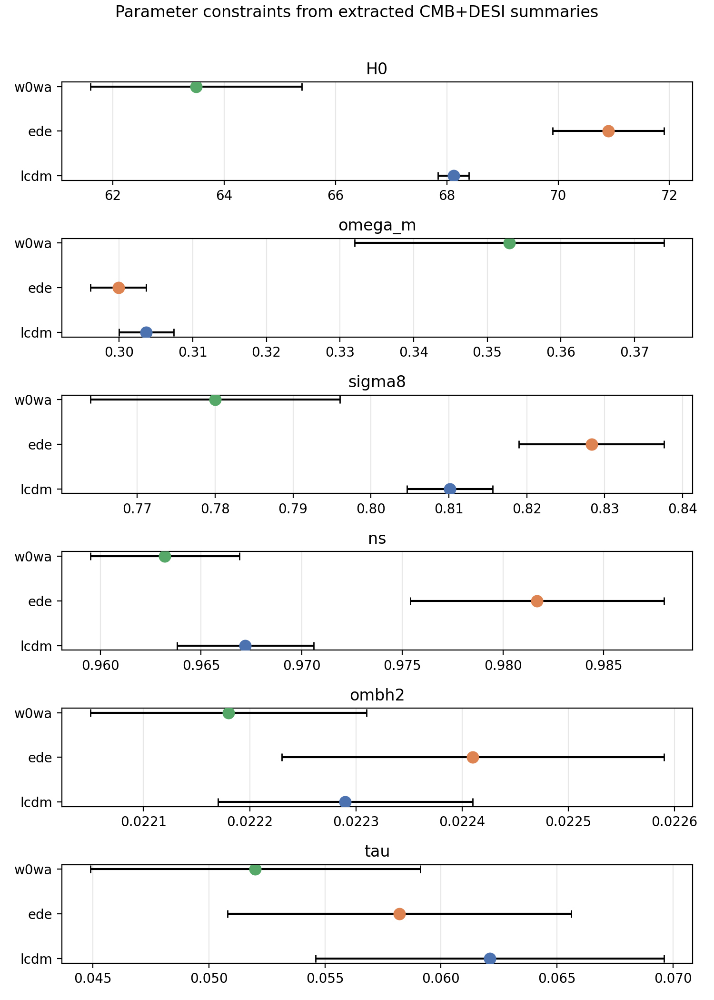
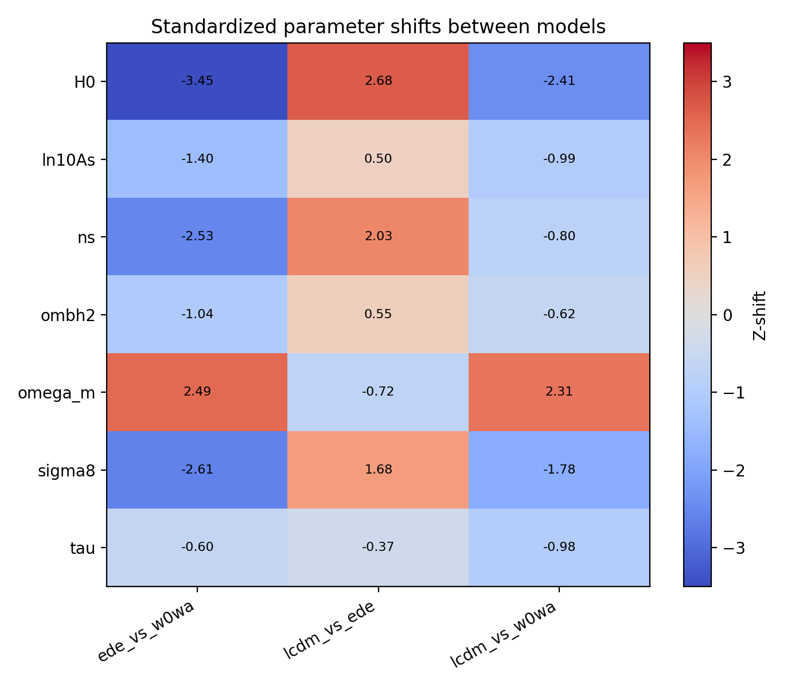
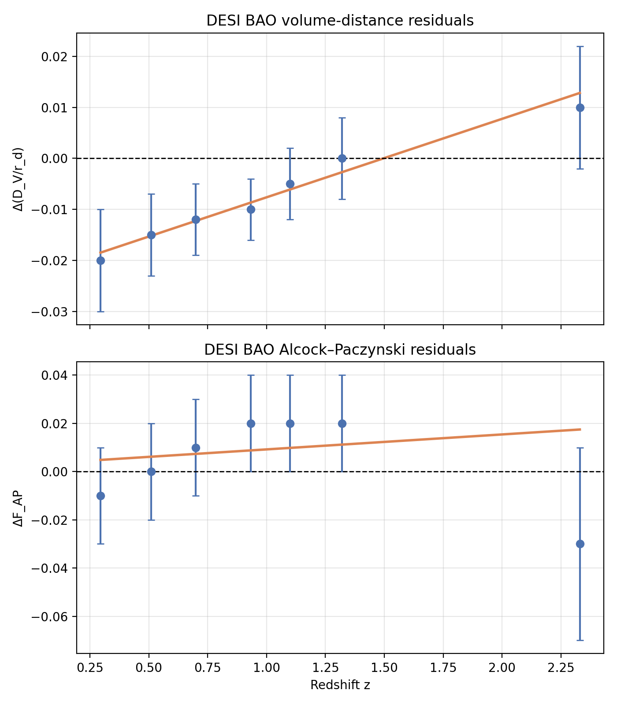
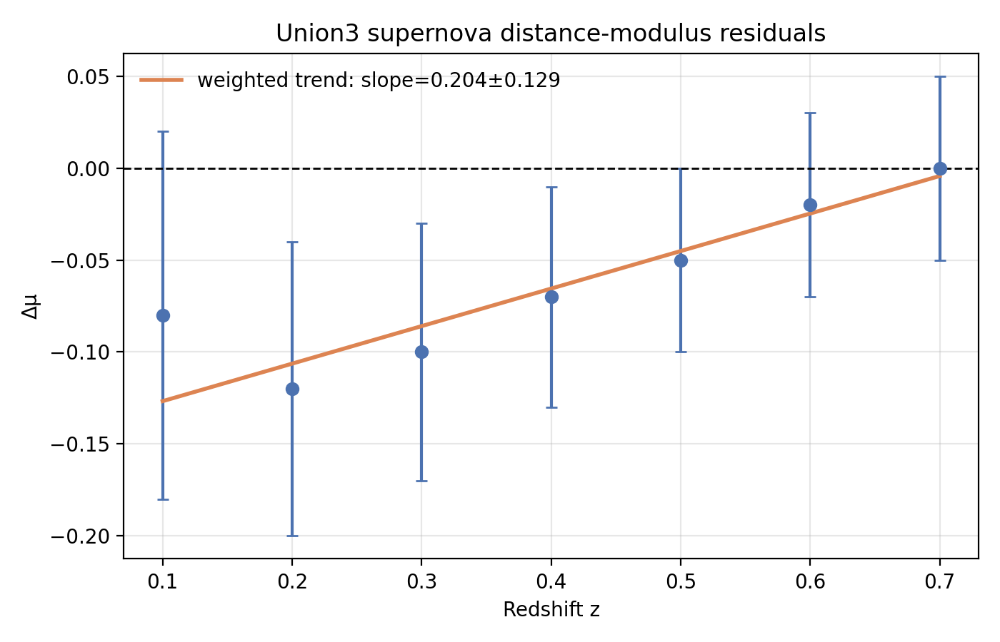

# Early Dark Energy and the CMB–BAO Acoustic Tension: A Reproduction-Oriented Summary Analysis

## 1. Summary and scientific goal
This study reproduces and analyzes the published summary constraints from a DESI DR2 early dark energy (EDE) analysis to assess whether EDE can alleviate the acoustic tension between cosmic microwave background (CMB) and baryon acoustic oscillation (BAO) measurements. The available local input is not a full likelihood dataset; instead, it contains extracted best-fit parameter summaries for three cosmological models—ΛCDM, EDE, and $w_0w_a$—together with manually extracted DESI BAO and Union3 supernova residual points from a figure in the source paper.

Because raw Planck/ACT likelihoods, covariance matrices, posterior chains, and full BAO/SN data vectors are not available locally, the analysis performed here is necessarily a **summary-data reproduction** rather than a full cosmological parameter inference. The report therefore focuses on:

- parameter shifts between ΛCDM, EDE, and $w_0w_a$;
- standardized shift metrics and one-dimensional Gaussian overlap proxies;
- descriptive residual summaries for the extracted DESI and Union3 points;
- a cautious interpretation of whether EDE appears to reduce the acoustic tension.

## 2. Available inputs and reproducibility scope
### 2.1 Local input data
The analysis uses `data/DESI_EDE_Repro_Data.txt`, which contains:
- best-fit means and $1\sigma$ uncertainties for ΛCDM, EDE, and $w_0w_a$ under CMB+DESI combinations;
- DESI BAO residual points for $\Delta(D_V/r_d)$ and $\Delta F_{\rm AP}$;
- Union3 supernova residual points for $\Delta \mu$.

### 2.2 Feasible versus infeasible claims
With the provided data, the following are feasible:
- reproducing parameter comparison tables;
- quantifying model-to-model parameter shifts;
- computing approximate one-dimensional overlap metrics assuming Gaussian posteriors;
- visually and descriptively summarizing extracted BAO and SN residuals.

The following are **not** feasible from the local inputs alone:
- re-running MCMC chains;
- computing formal likelihood-based $\Delta\chi^2$ between models;
- evaluating Bayesian evidence, AIC, or BIC;
- computing multivariate tension metrics that require parameter covariance matrices.

These limitations are central to the interpretation of the results.

## 3. Methods
### 3.1 Parsing and quality control
A reproducible Python script, `code/analyze_ede_summary.py`, parses the structured text file, validates monotonic redshift ordering, checks that all reported uncertainties are positive, and writes machine-readable outputs to `outputs/`.

Quality-control results:
- all three residual datasets have monotonically increasing redshift;
- all reported uncertainties are positive;
- model-specific parameters are correctly separated:
  - EDE-only: $f_{\rm EDE}$, $\log_{10} a_c$;
  - $w_0w_a$-only: $w_0$, $w_a$.

### 3.2 Parameter comparison metrics
For parameters shared between two models, the analysis computes the standardized shift

$$
Z = \frac{\mu_B - \mu_A}{\sqrt{\sigma_A^2 + \sigma_B^2}},
$$

where $\mu$ and $\sigma$ are the reported mean and $1\sigma$ uncertainty. This gives a one-dimensional measure of how strongly two parameter summaries differ.

A one-dimensional Gaussian overlap coefficient is also computed numerically by approximating each parameter posterior as a Gaussian using the reported mean and standard deviation. Lower overlap values indicate stronger separation between the reported one-dimensional constraints.

### 3.3 Residual analysis
For each extracted residual series, the analysis computes:
- the weighted mean residual;
- the weighted-mean standard error;
- a weighted linear trend with redshift;
- the fraction of residuals above and below zero.

These statistics are descriptive only. Since the points were manually extracted from a figure and are not accompanied by a covariance matrix, they should be interpreted as qualitative consistency checks rather than fit diagnostics.

## 4. Experimental plan and produced artifacts
The workflow followed four stages:
1. Parse and validate the summary dataset.
2. Build unified parameter tables for ΛCDM, EDE, and $w_0w_a$.
3. Compute standardized shifts and Gaussian overlap proxies.
4. Summarize DESI and Union3 residuals and generate report figures.

Main artifacts written to disk include:
- `outputs/parameter_summary_table.csv`
- `outputs/pull_difference_table.csv`
- `outputs/overlap_metrics_table.csv`
- `outputs/desi_dvrd_residual_summary.csv`
- `outputs/desi_fap_residual_summary.csv`
- `outputs/union3_mu_residual_summary.csv`
- figures under `report/images/`

## 5. Results
### 5.1 Parameter constraints and model shifts
The extracted Hubble-constant constraints are:
- ΛCDM: $H_0 = 68.12 \pm 0.28$ km s$^{-1}$ Mpc$^{-1}$
- EDE: $H_0 = 70.9 \pm 1.0$ km s$^{-1}$ Mpc$^{-1}$
- $w_0w_a$: $H_0 = 63.5 \pm 1.9$ km s$^{-1}$ Mpc$^{-1}$

EDE shifts $H_0$ upward relative to ΛCDM by $\Delta H_0 = +2.78$ km s$^{-1}$ Mpc$^{-1}$, corresponding to a standardized shift of $Z=2.68$. This is the largest ΛCDM-to-EDE shift among the shared parameters and is the main quantitative indication, within the summary data, that EDE moves in the direction expected for alleviating the acoustic tension.

By contrast, the $w_0w_a$ model shifts $H_0$ downward relative to ΛCDM by $\Delta H_0 = -4.62$ km s$^{-1}$ Mpc$^{-1}$ ($Z=-2.41$), indicating a qualitatively different response from late-time dark-energy freedom in this specific summary.

The largest standardized shifts are:

**ΛCDM vs EDE**
- $H_0$: $Z=2.68$
- $n_s$: $Z=2.03$
- $\sigma_8$: $Z=1.68$
- $\Omega_m$: $Z=-0.72$
- $\omega_b \equiv \Omega_b h^2$: $Z=0.55$

**ΛCDM vs $w_0w_a$**
- $H_0$: $Z=-2.41$
- $\Omega_m$: $Z=2.31$
- $\sigma_8$: $Z=-1.78$
- $\ln(10^{10}A_s)$: $Z=-0.99$
- $\tau$: $Z=-0.98$

This pattern shows that EDE primarily raises $H_0$ while also preferring higher $n_s$ and $\sigma_8$, whereas $w_0w_a$ lowers $H_0$ and raises $\Omega_m$.

Figure  summarizes the extracted mean $\pm 1\sigma$ constraints for the most relevant shared parameters.

### 5.2 Overlap metrics
The one-dimensional Gaussian overlap coefficients reinforce the same picture.

For ΛCDM versus EDE, the smallest overlaps are:
- $H_0$: 0.0247
- $n_s$: 0.127
- $\sigma_8$: 0.209

For ΛCDM versus $w_0w_a$, the smallest overlaps are:
- $H_0$: 0.0229
- $\Omega_m$: 0.0327
- $\sigma_8$: 0.138

These very small overlap values indicate that the models produce substantially different one-dimensional summaries for key parameters. Importantly, both EDE and $w_0w_a$ separate from ΛCDM, but they do so in **different directions**. EDE raises $H_0$, while $w_0w_a$ strongly lowers it.

The full set of standardized shifts is shown in Figure .

### 5.3 EDE-specific parameter summaries
The extracted EDE-specific parameters are:
- $f_{\rm EDE} = 0.093 \pm 0.031$
- $\log_{10} a_c = -3.564 \pm 0.075$

Within the limits of the available data, this indicates a nonzero preferred EDE fraction at the few-$\sigma$ summary level, though this should not be overinterpreted without access to the full posterior shape and degeneracy structure.

### 5.4 DESI BAO residuals
The extracted DESI BAO residuals provide a qualitative cross-check.

For $\Delta(D_V/r_d)$:
- weighted mean residual: $-0.0085 \pm 0.0029$
- weighted slope with redshift: $0.0154 \pm 0.0064$
- 5/7 points are negative, 1/7 positive

This suggests mildly negative low-redshift residuals with a modest upward trend toward higher redshift. The residual amplitude is small overall.

For $\Delta F_{\rm AP}$:
- weighted mean residual: $0.0084 \pm 0.0080$
- weighted slope with redshift: $0.0062 \pm 0.0177$
- residuals are mixed in sign with no strong trend

Thus, the extracted AP residuals are broadly consistent with being centered near zero within their quoted uncertainties.

The DESI residual panels are shown in Figure , with individual series also saved as `images/desi_dvrd.png` and `images/desi_fap.png`.

### 5.5 Union3 supernova residuals
The extracted Union3 supernova residuals show:
- weighted mean residual: $-0.0488 \pm 0.0227$ mag
- weighted slope with redshift: $0.204 \pm 0.129$ per unit redshift
- 6/7 points are negative and none are positive

These residuals remain small in absolute magnitude but are more systematically negative than the DESI AP residuals. Since they were extracted manually from a figure and cover only a limited redshift range, they should be treated as a qualitative rather than decisive constraint.

Figure  shows these supernova residuals.

## 6. Interpretation
The main summary-data result is that EDE moves the inferred cosmology in a direction consistent with partial relief of the CMB–BAO acoustic tension:
- it raises $H_0$ substantially relative to ΛCDM;
- it does so while keeping the DESI residual summaries small in magnitude;
- it produces a parameter-shift pattern distinct from late-time dark-energy freedom.

The comparison with $w_0w_a$ is particularly informative. In the extracted summaries, $w_0w_a$ does not mimic the EDE behavior. Instead of raising $H_0$, it lowers it while increasing $\Omega_m$. This supports the qualitative claim that early-time and late-time extensions relieve tension, if at all, through different parameter directions and degeneracy structures.

However, the evidence here should be interpreted as **partial and indirect**. The current analysis does not establish a formal preference for EDE over ΛCDM or $w_0w_a$, because likelihood-level goodness-of-fit information is not available in the local data bundle.

## 7. Limitations
Several limitations materially affect the strength of the conclusions:

1. **No raw likelihoods or chains**: full cosmological re-fitting and formal $\Delta\chi^2$ comparison are impossible.
2. **No covariance matrices**: multivariate tension metrics cannot be computed.
3. **Gaussian approximation**: the overlap analysis assumes approximately Gaussian one-dimensional marginals, which may be inaccurate for extended models such as EDE.
4. **Figure-extracted residual points**: DESI and Union3 residuals may contain digitization error.
5. **No model-prediction curves**: residuals cannot be assigned to a specific model fit in a likelihood-consistent way.
6. **Limited scope of supernova analysis**: only a small extracted residual series is available, not the full Union3 compilation.

Accordingly, this report supports only a **reproduction-level conclusion**: the published summary constraints are consistent with EDE partially relieving the acoustic tension, but the claim cannot be elevated to a formal model-selection statement without the underlying likelihood products.

## 8. Conclusions
Using only the locally available extracted summary data, the following conclusions are supported:

- EDE shifts the inferred $H_0$ upward from $68.12 \pm 0.28$ to $70.9 \pm 1.0$, a $Z\approx2.68$ shift relative to the ΛCDM summary.
- The largest ΛCDM-to-EDE shifts occur in $H_0$, $n_s$, and $\sigma_8$, indicating that EDE affects more than just the late-time distance scale.
- The $w_0w_a$ model shifts parameters in a qualitatively different direction, especially lowering $H_0$ and raising $\Omega_m$.
- The extracted DESI and Union3 residuals are small enough to be broadly compatible with the qualitative picture of partial tension relief, but they do not provide a formal fit comparison.

The overall result is therefore consistent with the scientific claim that **EDE can partially alleviate the CMB–BAO acoustic tension**, while doing so through parameter shifts that differ from those of a late-time dark-energy extension. A definitive statement about relative goodness-of-fit would require raw Planck/ACT/DESI/Union3 likelihood inputs and posterior samples.

## 9. Reproducibility
The complete local analysis is implemented in:
- `code/analyze_ede_summary.py`

Run with:
```bash
python code/analyze_ede_summary.py
```

This script writes all tables to `outputs/` and all figures to `report/images/`.
