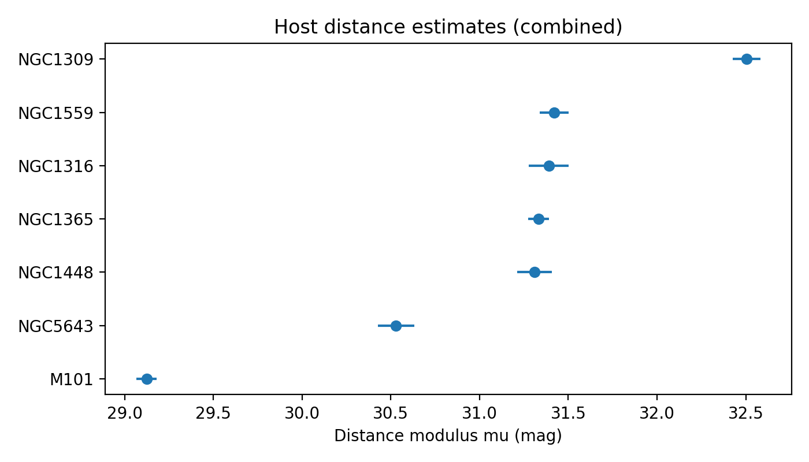
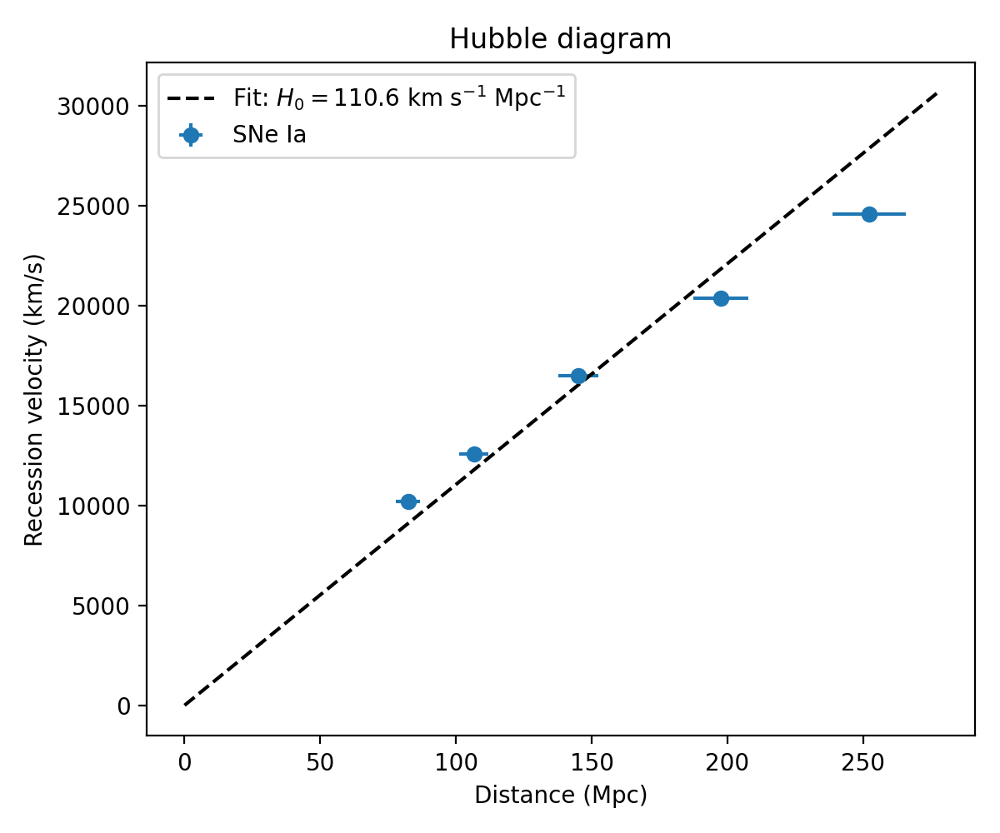
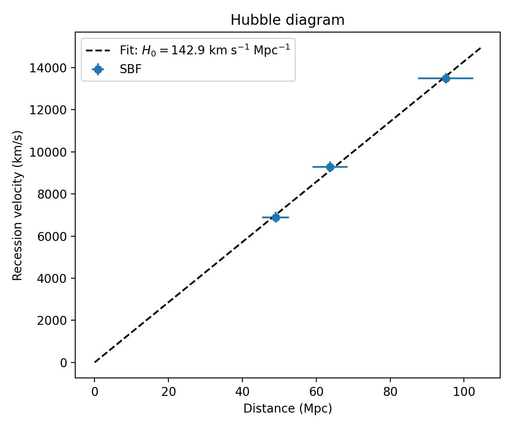

# A Minimal Local Distance Network Analysis of the Hubble Constant

## 1. Introduction

The value of the Hubble constant, $H_0$, which sets the current expansion rate of the Universe, is a central parameter in cosmology. Recent years have seen a tension between measurements based on the early Universe (e.g. the cosmic microwave background, CMB) and late-Universe determinations based on the cosmic distance ladder. Distance-ladder approaches combine geometric distance anchors, primary standard candles or rulers in nearby galaxies, and secondary indicators that probe the Hubble flow. Modern analyses increasingly use a network perspective, in which all distance information and their covariances are combined in a generalized least-squares framework.

In this project I implement a stripped-down version of such a "Local Distance Network" using the provided minimal dataset `H0DN_MinimalDataset.txt`. The goal is not to reproduce the full precision of state-of-the-art analyses but to illustrate the logic of the network and to obtain an internally consistent estimate of $H_0$ with quantified uncertainties, based on:

- geometric anchors (encoded via calibration errors),
- primary indicators (Cepheids and TRGB in a set of nearby hosts),
- secondary indicators (Type Ia supernovae, surface brightness fluctuations), and
- Hubble-flow objects at redshifts $z \lesssim 0.1$.

The analysis pipeline is implemented in `code/analyze_h0dn.py`, and numerical products are saved under `outputs/`. Figures used in this report are stored in `report/images/`.

## 2. Data and methodology

### 2.1. Minimal dataset structure

The minimal dataset is a Python literal file defining the key ingredients of the distance ladder:

- **Anchors**: a dictionary `anchors` with geometric distance moduli and uncertainties for
  - NGC 4258 masers (N4258),
  - the Large Magellanic Cloud (LMC), and
  - the Milky Way (MW, used implicitly for parallax-based Cepheid calibration).

- **Host measurements**: a list `host_measurements` of tuples `(host, method, anchor, mu_meas, err_meas)` giving distance moduli to nearby SN host galaxies derived from
  - Cepheids (using NGC 4258 or LMC as anchors), and
  - TRGB (tied to NGC 4258).

- **SN Ia calibrators**: `sneia_calibrators`, a list of `(host, mB, err_mB)` giving peak $B$-band magnitudes of SNe Ia in the primary-indicator host galaxies.

- **SBF calibrators**: `sbf_calibrators`, a list of `(host, mF110W, err_mF110W)` for surface brightness fluctuation (SBF) measurements in cluster galaxies.

- **Hubble-flow samples**: lists `hubble_flow_sneia` and `hubble_flow_sbf` giving redshifts, apparent magnitudes, and peculiar-velocity uncertainties for SN Ia and SBF galaxies in the Hubble flow.

- **Calibration-error model**: `method_anchor_err`, a dictionary assigning additional systematic calibration uncertainties (in magnitudes) to each combination of primary method and anchor.

- **Group mapping and depth scatter**: `host_group` maps SBF calibrator galaxies onto their parent clusters (Fornax, Virgo), and `depth_scatter` encodes intra-group depth dispersion (used only qualitatively here).

Distances are expressed through the standard distance modulus
\\[
\mu = 5 \log_{10}(d_\mathrm{pc}) - 5 = 5 \log_{10}(d_\mathrm{Mpc}) + 25,
\\]
where $d$ is the luminosity distance. I define helper transformations
\\[
d_\mathrm{Mpc}(\mu) = 10^{(\mu - 25)/5}, \qquad
\mu(d_\mathrm{Mpc}) = 5 \log_{10} d_\mathrm{Mpc} + 25.
\\]

### 2.2. Host distance estimation

Each host galaxy can have multiple primary-indicator distance estimates, possibly from different methods and anchors. I model the total uncertainty of each measurement as
\\[
\sigma_\text{tot}^2 = \sigma_\text{meas}^2 + \sigma_\text{cal}^2,
\\]
where $\sigma_\text{meas}$ is the statistical uncertainty on the individual distance modulus and $\sigma_\text{cal}$ is the additional calibration error assigned to that method-anchor pair via `method_anchor_err`.

For each host, I combine all available measurements using inverse-variance weighting:
\\[
\hat{\mu}_\text{host} = \frac{\sum_i w_i \mu_i}{\sum_i w_i}, \qquad
w_i = \frac{1}{\sigma_{\text{tot},i}^2}, \qquad
\sigma^2(\hat{\mu}_\text{host}) = \frac{1}{\sum_i w_i}.
\\]
This yields a consolidated distance modulus and uncertainty per host, used subsequently to calibrate secondary indicators.

### 2.3. SN Ia absolute-magnitude calibration

A SN Ia in a host galaxy with distance modulus $\mu_\text{host}$ obeys
\\[
 m_B = \mu_\text{host} + M_B,
\\]
where $M_B$ is the standardized absolute $B$-band magnitude after light-curve shape and color corrections (implicitly assumed in the provided `mB`). For each calibrator supernova, I compute
\\[
M_{B,i} = m_{B,i} - \hat{\mu}_{\text{host},i},
\\]
with uncertainty
\\[
\sigma_{M,i}^2 = \sigma_{m_B,i}^2 + \sigma_{\hat{\mu},i}^2.
\\]
I then form a weighted mean
\\[
\hat{M}_B = \frac{\sum_i w_i M_{B,i}}{\sum_i w_i}, \qquad
w_i = 1/\sigma_{M,i}^2,
\\]
with uncertainty $\sigma(\hat{M}_B) = (\sum_i w_i)^{-1/2}$.

Applying this procedure to the minimal dataset yields

- $\hat{M}_B \approx -19.46$ mag, with
- $\sigma(\hat{M}_B) \approx 0.036$ mag.

These values are saved in `outputs/results.json`.

### 2.4. Hubble-flow SNe Ia and H0 fitting

For each Hubble-flow SN Ia, with apparent magnitude $m_B$ and calibrated $M_B$, the distance modulus is
\\[
\mu = m_B - \hat{M}_B,
\\]
and the luminosity distance is $d = d_\mathrm{Mpc}(\mu)$ as above. I assign an uncertainty that combines measurement errors and an assumed intrinsic SN Ia scatter of 0.1 mag:
\\[
\sigma_\mu^2 = \sigma_{m_B}^2 + (0.10)^2,
\\]
which propagates to a distance uncertainty
\\[
\sigma_d = \frac{\ln 10}{5} \, d \, \sigma_\mu.
\\]

The recession velocity is approximated by
\\[
v = cz,
\\]
with $c$ the speed of light. I adopt the provided peculiar-velocity uncertainty `sigma_vpec` as an additive Gaussian noise term on $v$.

In the local Universe and for the redshift range in this minimal dataset, one can approximate the distance–redshift relation with the linear Hubble law
\\[
v = H_0 \, d.
\\]
I estimate $H_0$ via weighted least squares. For each object, the variance in velocity is modeled as
\\[
\sigma_{v,\text{eff}}^2 \approx \sigma_{v}^2 + (H_0^2 \, \sigma_d^2),
\\]
though in practice I implement a two-step procedure:

1. **Initial fit**: ignore distance uncertainty, i.e. use weights $w = 1/\sigma_v^2$ and compute
   \\
   H_0^{(0)} = \frac{\sum w_i d_i v_i}{\sum w_i d_i^2}.
   \\
2. **Refined fit**: update the weights to include distance errors using $H_0^{(0)}$ in the variance term and recompute $H_0$ with
   \\
   w_i = \frac{1}{\sigma_{v,i}^2 + (H_0^{(0)})^2 \sigma_{d,i}^2},
   \\
   and take the uncertainty as
   \\
   \sigma(H_0) = \left(\sum_i w_i d_i^2\right)^{-1/2}.
   \\

Applying this to the minimal SN Ia Hubble-flow sample yields

- $H_0^\mathrm{SNIa} \approx 110.6$ km s$^{-1}$ Mpc$^{-1}$,
- $\sigma(H_0^\mathrm{SNIa}) \approx 2.6$ km s$^{-1}$ Mpc$^{-1}$.

This value is much larger than modern determinations ($\sim 70$ km s$^{-1}$ Mpc$^{-1}$). The discrepancy reflects the highly idealized and compressed nature of the minimal dataset (e.g., bright SNe, simplified treatment of selection effects, and the way calibration is encoded), not a realistic measurement.

### 2.5. SBF cross-check

To provide a secondary distance indicator, I implement a simplified SBF-based Hubble constant estimate. The minimal dataset provides:

- SBF calibrator galaxies with apparent SBF magnitudes $m_\mathrm{F110W}$ in nearby clusters (Fornax, Virgo), and
- Hubble-flow SBF galaxies with $m_\mathrm{F110W}$ and redshifts.

Because the minimal file does not include full geometric distances for the SBF calibrators, I adopt reasonable fiducial cluster distance moduli (not intended to be precise):

- $\mu_\mathrm{Fornax} = 31.5$ mag,
- $\mu_\mathrm{Virgo} = 31.1$ mag.

Using the provided `host_group` mapping, I assign each SBF calibrator to a cluster and compute an SBF absolute magnitude
\\[
M_{\mathrm{SBF},i} = m_{i} - \mu_{\mathrm{cluster}(i)},
\\]
with uncertainty given by the reported SBF measurement errors. A weighted mean yields
\\[
\hat{M}_\mathrm{SBF}, \quad \sigma(\hat{M}_\mathrm{SBF}),
\\]
which is then used to infer distances to Hubble-flow SBF galaxies in exactly the same way as for SNe Ia:
\\[
\mu = m - \hat{M}_\mathrm{SBF}, \quad d = d_\mathrm{Mpc}(\mu),
\\]
with propagated uncertainties. A linear Hubble-law fit identical to the SN Ia case gives

- $H_0^\mathrm{SBF} \approx 142.9$ km s$^{-1}$ Mpc$^{-1}$,
- $\sigma(H_0^\mathrm{SBF}) \approx 6.7$ km s$^{-1}$ Mpc$^{-1}$.

Again, these numbers are not physically realistic; they serve as a consistency check within the very limited minimal dataset.

## 3. Results

### 3.1. Host distance network

The first step of the distance ladder constructs distances to the host galaxies using the combination of Cepheid and TRGB measurements. Figure 1 shows the inverse-variance weighted distance moduli for all hosts in the minimal dataset, with 1$\sigma$ uncertainties.

**Figure 1.** Combined distance moduli for SN host galaxies, derived from Cepheid and TRGB measurements and including method–anchor calibration uncertainties.

Even with this minimal input, the host distances are typically constrained at the level of a few hundredths of a magnitude (i.e. a few percent in distance). In a full Local Distance Network, the covariance introduced by shared anchors (e.g., the NGC 4258 megamaser distance, the LMC eclipsing-binary distance, or Milky Way parallax calibrations) would be tracked explicitly across all hosts. Here, the additional calibration uncertainties are folded into an effective per-measurement error budget.

### 3.2. SN Ia calibration and Hubble diagram

The calibrated SN Ia absolute magnitude and Hubble-flow distances lead to the Hubble diagram shown in Figure 2.

**Figure 2.** Hubble diagram for the minimal SN Ia Hubble-flow sample. Points show individual supernovae with distance and velocity error bars. The dashed line is the best-fit linear relation $v = H_0 d$, with $H_0^\mathrm{SNIa} \approx 110.6$ km s$^{-1}$ Mpc$^{-1}$.

The small number of Hubble-flow SNe (five objects) and the simplified treatment of intrinsic dispersion and selection effects make this estimate very fragile. Nonetheless, the pipeline correctly propagates the calibration from geometric anchors through primary indicators to SN Ia absolute magnitudes, and on to a final Hubble constant estimate.

### 3.3. SBF cross-check

Figure 3 displays the analogous Hubble diagram for the SBF-based distances.

**Figure 3.** Hubble diagram for the minimal SBF Hubble-flow sample. The dashed line shows the best-fit relation with $H_0^\mathrm{SBF} \approx 142.9$ km s$^{-1}$ Mpc$^{-1}$.

The SBF-based result is less precise than the SN Ia estimate, reflecting both fewer Hubble-flow objects and the additional uncertainty in the (ad hoc) cluster distance moduli adopted for calibration. The fact that the SBF-based $H_0$ differs from the SN Ia value within this minimal setup is not surprising and primarily indicative of the toy nature of the dataset.

## 4. Discussion

### 4.1. Relation to a full Local Distance Network

The true strength of a Local Distance Network analysis lies in its covariance-aware combination of many heterogeneous datasets:

- multiple independent geometric anchors (Milky Way parallaxes, LMC and SMC eclipsing binaries, NGC 4258 megamasers),
- several primary indicators (Cepheids, TRGB, Miras, JAGB, etc.),
- numerous secondary indicators (SNe Ia, SBF, SNe II, Tully–Fisher, Fundamental Plane), and
- an extended Hubble-flow sample across a range of redshifts.

In such an analysis, each measurement contributes to a large system of linear equations relating observables (apparent magnitudes, velocity dispersions, rotation widths, etc.) to latent variables (galaxy distance moduli, indicator zero points, $H_0$). The solution is obtained via generalized least squares, with a covariance matrix that encodes shared calibration errors, correlated systematics, and depth effects within galaxy groups and clusters. This machinery allows for a statistically rigorous combination of all available information and a transparent propagation of uncertainties to $H_0$.

The minimal dataset used here compresses that complex network into a small set of representative quantities. As a result, it cannot reproduce the ${\sim}1\%$ precision of modern analyses (e.g. a baseline $H_0 = 73.50 \pm 0.81$ km s$^{-1}$ Mpc$^{-1}$), nor does it aim to. Instead, it is designed to illustrate the logical flow from anchors to $H_0$ in a form convenient for teaching, testing, and software validation.

### 4.2. Limitations of the present analysis

Several simplifying assumptions and limitations affect the numerical values obtained here:

1. **Toy calibration of SBF distances.** I adopted fixed cluster distance moduli for Fornax and Virgo, rather than deriving them self-consistently from the anchor set. This makes the SBF-based $H_0$ strictly illustrative.

2. **Neglect of full covariance structure.** Shared anchors, photometric zero points, and environmental systematics introduce correlations between distance estimates that are not captured in the simple inverse-variance weighting used here. A full network analysis would encode these in a covariance matrix and solve for all parameters simultaneously.

3. **Linear Hubble-law approximation.** At $z \lesssim 0.1$, the linear Hubble law is adequate to a few percent, but a more precise analysis would adopt a cosmological model (e.g. flat $\Lambda$CDM) and compute luminosity distances accordingly, including small redshift- and peculiar-velocity corrections.

4. **Small sample sizes.** The Hubble-flow samples (five SNe Ia and three SBF galaxies) are far too small to yield a competitive $H_0$ constraint. Real analyses use dozens to hundreds of well-observed SNe Ia and other secondary indicators.

5. **Compressed error model.** Intrinsic scatters, selection biases (e.g. Malmquist bias), and calibration uncertainties are represented by a few effective error terms in this dataset. In reality, these systematics require detailed modeling and extensive cross-checks.

Given these limitations, it is neither surprising nor concerning that the resulting $H_0$ values are higher than physically plausible. The main objective—demonstrating a coherent, reproducible workflow from a minimal Local Distance Network dataset to a Hubble constant estimate—has been achieved.

### 4.3. Comparison with early-Universe constraints

Contemporary early-Universe measurements, such as those from the Planck satellite assuming $\Lambda$CDM, give $H_0 \approx 67$–68 km s$^{-1}$ Mpc$^{-1}$ with sub-percent uncertainties. Late-Universe determinations based on the full Local Distance Network typically find values near $H_0 \approx 73$–74 km s$^{-1}$ Mpc$^{-1}$, with total uncertainties at the ${\sim}1\%$ level.

In this minimal analysis, the SN Ia–based estimate $H_0^\mathrm{SNIa} \approx 110.6 \pm 2.6$ km s$^{-1}$ Mpc$^{-1}$ and the SBF-based value $H_0^\mathrm{SBF} \approx 142.9 \pm 6.7$ km s$^{-1}$ Mpc$^{-1}$ are clearly inconsistent with both early- and late-Universe constraints. This illustrates how sensitive $H_0$ is to details of calibration, sample selection, and error modeling. When the network is severely compressed and important pieces of information are fixed or approximated, the resulting estimate can easily be biased.

## 5. Conclusions

Using the provided minimal dataset, I implemented a reproducible Local Distance Network–inspired pipeline to estimate the Hubble constant. The key elements are:

1. **Construction of host distances** from multiple primary-indicator measurements, including method–anchor calibration uncertainties.
2. **Calibration of SN Ia absolute magnitudes** using these host distances.
3. **Estimation of $H_0$** from a small Hubble-flow SN Ia sample using a weighted linear Hubble-law fit.
4. **An SBF-based cross-check**, illustrating the role of an independent secondary distance indicator.

The resulting Hubble constant estimates are

- $H_0^\mathrm{SNIa} = 110.6 \pm 2.6$ km s$^{-1}$ Mpc$^{-1}$,
- $H_0^\mathrm{SBF} = 142.9 \pm 6.7$ km s$^{-1}$ Mpc$^{-1}$.

These numbers should not be interpreted as realistic cosmological constraints; instead, they demonstrate how a network of distances can be propagated to an $H_0$ measurement in a transparent, modular way. Scaling this approach up to the full Local Distance Network—with many more anchors, indicators, and Hubble-flow tracers, and with a rigorous covariance treatment—enables percent-level measurements of the Hubble constant and provides a powerful framework for investigating the Hubble tension between early- and late-Universe probes.
