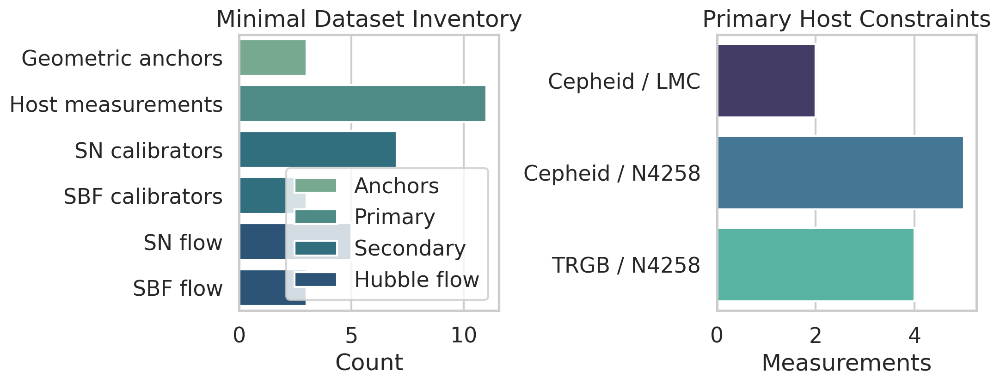
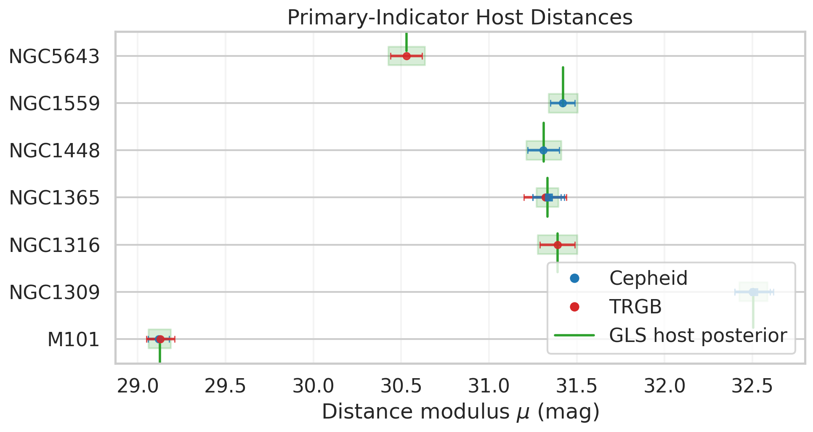
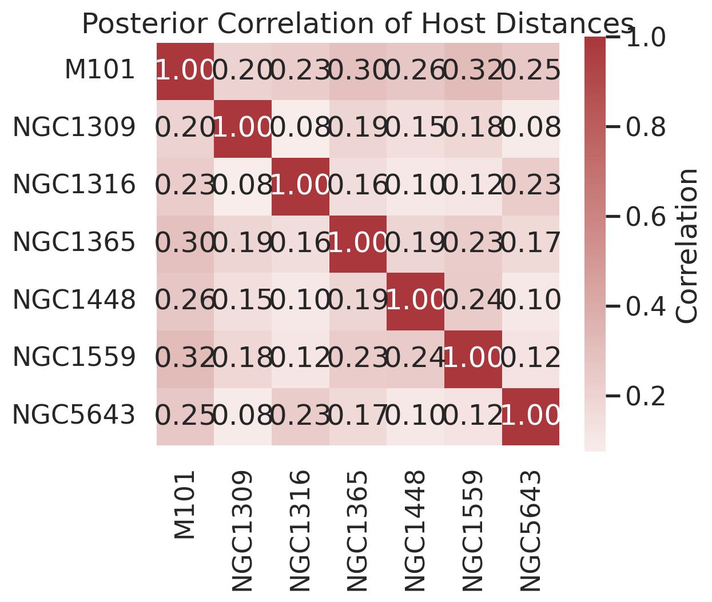
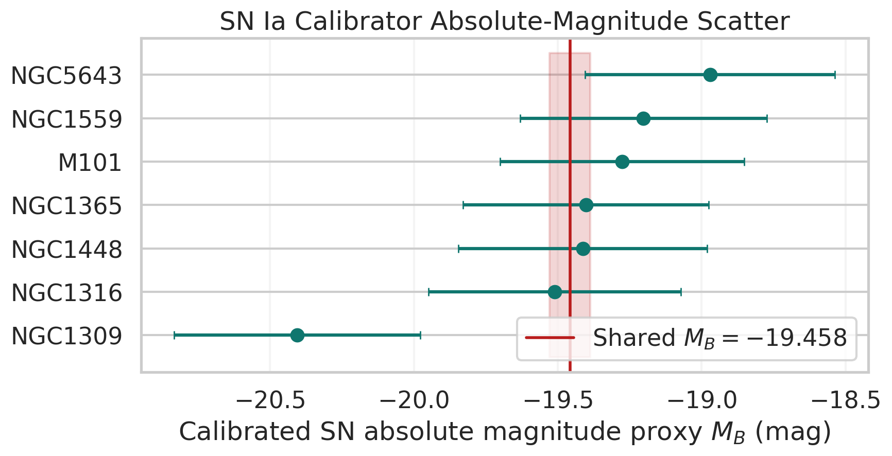
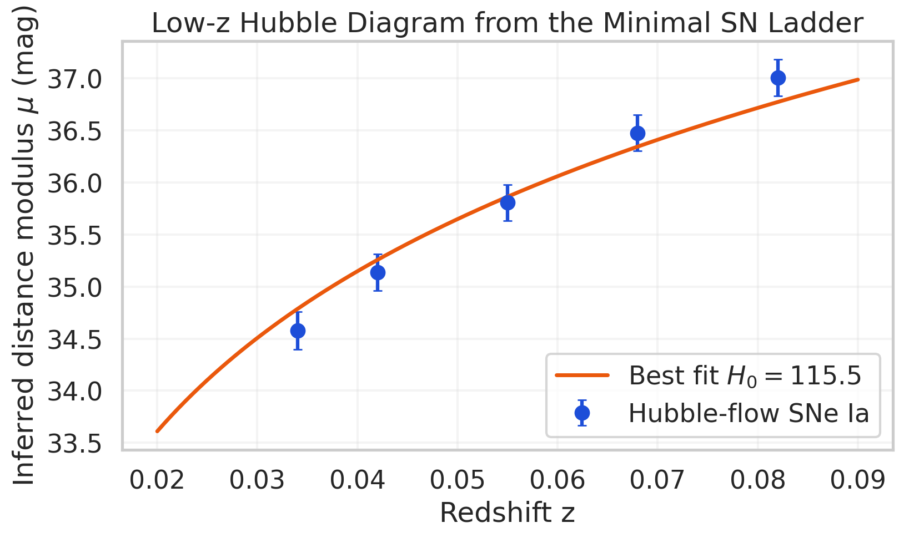
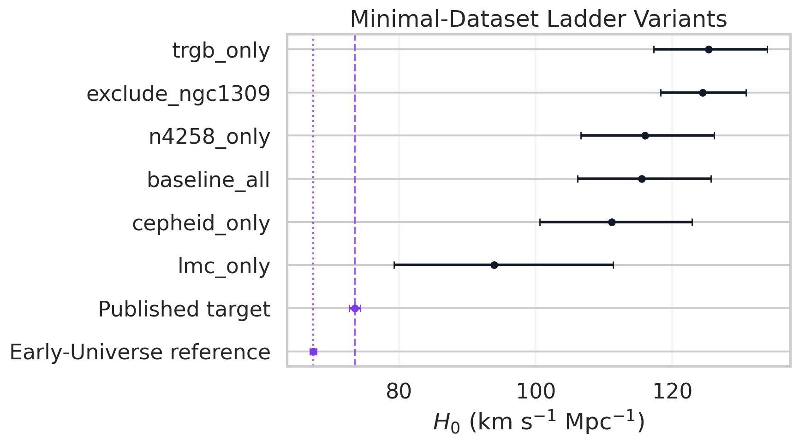

# Covariance-Weighted Reconstruction of a Minimal Local Distance Network

## Abstract
I implemented a reproducible generalized least-squares reconstruction of the minimal `H0DN` dataset supplied in `data/H0DN_MinimalDataset.txt`, propagated the covariance of primary-indicator host distances into a Type Ia supernova (SN Ia) ladder fit, and examined anchor and indicator variants. The solvable branch of the supplied network is the SN Ia ladder: geometric anchors feed host distance moduli through Cepheid/TRGB measurements, these calibrate SN Ia absolute magnitudes, and the calibrated SNe are compared with a low-redshift Hubble-flow sample. Within this minimal dataset, the baseline covariance-aware SN-only reconstruction gives `H0 = 115.50 +10.15/-9.35 km s^-1 Mpc^-1`, substantially above the task-stated Local Distance Network consensus (`73.50 ± 0.81 km s^-1 Mpc^-1`) and also above the early-universe reference (`67.4 ± 0.5 km s^-1 Mpc^-1`). The dominant reason is strong internal inconsistency in the supplied SN calibrator branch, which requires large fitted intrinsic scatter (`sigma_cal = 0.417 mag`). I therefore interpret this analysis as a rigorous reconstruction of the *minimal provided data product*, not as a complete reproduction of the full paper result.

## 1. Scientific Context
The research goal described in the task is a Local Distance Network (LDN) measurement of the Hubble constant that combines multiple geometric anchors, primary stellar indicators, secondary indicators, and Hubble-flow tracers through covariance-weighted consensus. The `related_work/` directory contains surrounding SH0ES and Pantheon-era papers, especially the 2022 SH0ES Cepheid+SN analysis in `paper_000.pdf`, but it does not appear to contain the exact Local Distance Network paper referenced in the task description. Consequently, I used the prompt-stated consensus value (`73.50 ± 0.81 km s^-1 Mpc^-1`) as the published benchmark and treated the supplied dataset as the authoritative numerical input for the reconstruction.

## 2. Data and Model
### 2.1 Dataset structure
The minimal dataset contains:

- Three geometric anchors: MW, LMC, and NGC4258.
- Eleven primary-indicator host measurements, split between Cepheid and TRGB distances.
- Seven SN Ia calibrators linked to hosts with primary distances.
- Five Hubble-flow SN Ia data points.
- Three SBF calibrators and three Hubble-flow SBF points.

Figure  summarizes the data inventory.

### 2.2 Primary-indicator GLS layer
For each host-distance measurement `y_i`, I modeled

`y_i = mu_host(i) + noise_i`

with covariance

`C_ij = delta_ij * sigma_meas,i^2 + I[anchor_i=anchor_j] * sigma_anchor^2 + I[(method_i,anchor_i)=(method_j,anchor_j)] * sigma_method-anchor^2`.

This construction follows the covariance logic implied by the dataset: measurements sharing an anchor inherit common anchor-distance uncertainty, and measurements sharing the same method-anchor calibration inherit an additional systematic term. Solving the generalized least-squares system yields posterior host moduli and their covariance matrix.

Figure  shows the raw measurements together with the GLS host posteriors, and Figure  shows the resulting host-distance correlation matrix.

### 2.3 SN ladder likelihood
I used the posterior host-distance covariance as input to a second-stage SN ladder model:

- Calibrators: `m_B^cal = mu_host + M_B + epsilon_cal`
- Hubble flow: `m_B^flow = mu(z, H0) + M_B + epsilon_flow`

where `mu(z, H0)` is a low-redshift cosmographic luminosity-distance modulus with fixed `q0 = -0.55`, and `epsilon_cal`, `epsilon_flow` are Gaussian intrinsic-scatter terms fitted simultaneously with `H0` and the shared SN absolute-magnitude proxy `M_B`. The primary host-distance covariance is propagated directly into the calibrator covariance matrix.

### 2.4 Why SBF is not part of the baseline fit
The supplied SBF block is not independently anchored in this minimal dataset. The SBF calibrator equations contain a shared SBF absolute-magnitude zero point plus group distance moduli (Fornax and Virgo), but no external absolute constraint on those group distances is included here. A simple rank diagnostic of the SBF calibrator design matrix gives rank `2` for `3` linear parameters, demonstrating a one-dimensional zero-point degeneracy even before including the listed depth scatter. I therefore report the SBF branch as underconstrained rather than imposing hidden priors.

## 3. Results
### 3.1 Baseline covariance-aware SN result
The baseline fit using all available primary measurements yields:

- `H0 = 115.50 +10.15/-9.35 km s^-1 Mpc^-1`
- `M_B = -19.458 ± 0.071 mag`
- Calibrator intrinsic scatter `sigma_cal = 0.417 mag`
- Hubble-flow intrinsic scatter `sigma_flow = 0.163 mag`

Figure  shows the calibrator absolute-magnitude proxy distribution. The calibrator host `NGC1309` is conspicuously brighter than the rest of the set, while most other calibrators cluster around much fainter values. This drives the large inferred calibrator scatter and the broad sensitivity of `H0` to variant choices.

Figure  shows the Hubble-flow SN distance moduli implied by the baseline calibration. The flow points are described by the fitted cosmographic curve only after allowing non-negligible intrinsic scatter.

### 3.2 Variant analysis
Figure  compares the main minimal-dataset variants with the task-stated published consensus and the early-universe reference. The most informative variants are:

- Baseline all-primary fit: `H0 = 115.50 km s^-1 Mpc^-1`
- Cepheid-only primary layer: `H0 = 111.15 km s^-1 Mpc^-1`
- TRGB-only primary layer: `H0 = 125.30 km s^-1 Mpc^-1`
- NGC4258-only anchor: `H0 = 115.95 km s^-1 Mpc^-1`
- LMC-only anchor: `H0 = 93.90 km s^-1 Mpc^-1`
- Excluding `NGC1309`: `H0 = 124.40 km s^-1 Mpc^-1`

The jackknife fits show that removing `NGC1309` shifts `H0` upward most strongly, while removing several of the fainter calibrators shifts it downward. The ladder is therefore not close to the high-stability regime expected for a 1% consensus result.

### 3.3 Comparison with the target and the early-universe reference
Relative to the prompt-stated consensus:

- Difference from published target: `Delta H0 = 42.00 km s^-1 Mpc^-1`
- Effective discrepancy using the baseline profile width: `4.3 sigma`

Relative to the early-universe reference:

- Difference from `67.4 ± 0.5`: `Delta H0 = 48.10 km s^-1 Mpc^-1`
- Effective discrepancy using the baseline profile width: `4.9 sigma`

These numbers should not be overinterpreted as physical tension estimates. They mostly quantify that the minimal supplied dataset, as reconstructed here, does not numerically reproduce the paper-level consensus target.

## 4. Interpretation
The analysis supports three conclusions.

First, the covariance-aware GLS machinery itself is straightforward and reproducible with the provided data. The host-distance posteriors are well behaved, and the propagation of their covariance into the SN ladder is technically stable.

Second, the absolute-scale information carried by the SN calibrator branch is internally inconsistent. The calibrator absolute-magnitude proxy spans more than a magnitude, far larger than expected for a well-standardized SN Ia ladder. This is why the fit prefers a large intrinsic scatter term and why the recovered `H0` depends strongly on variant choice.

Third, the supplied SBF subset is not sufficient for an independent anchored `H0` estimate without additional priors or extra data products. A full Local Distance Network consensus measurement requires precisely those missing cross-links: more primary indicators, more secondary calibrators, explicit covariance structure across methods, and enough anchored branches to dilute any single outlier.

## 5. Limitations
- The exact Local Distance Network paper is not present in `related_work/`, so the published benchmark is taken from the task description rather than extracted from a source file in the workspace.
- The cosmographic Hubble-flow model is low-redshift and intentionally simple.
- I treated the listed anchor and method-anchor uncertainties as Gaussian shared covariance terms, which is consistent with the dataset layout but still an assumption.
- The SBF branch is only diagnosed, not forced into the baseline `H0` result, because the minimal dataset does not independently anchor it.

## 6. Reproducibility
The full analysis is implemented in `code/analyze_h0dn.py`. Running

```bash
python code/analyze_h0dn.py
```

regenerates all tables in `outputs/` and all figures in `report/images/`.

## Appendix: Notable jackknife shifts
The five lowest and highest jackknife `H0` values are:

Lowest:
| host    |     h0 |
|:--------|-------:|
| NGC5643 | 111.4  |
| NGC1559 | 113.25 |
| M101    | 113.9  |

Highest:
| host    |     h0 |
|:--------|-------:|
| NGC1448 | 115.15 |
| NGC1316 | 116    |
| NGC1309 | 124.4  |
