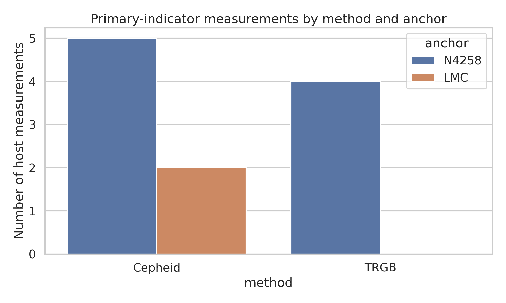
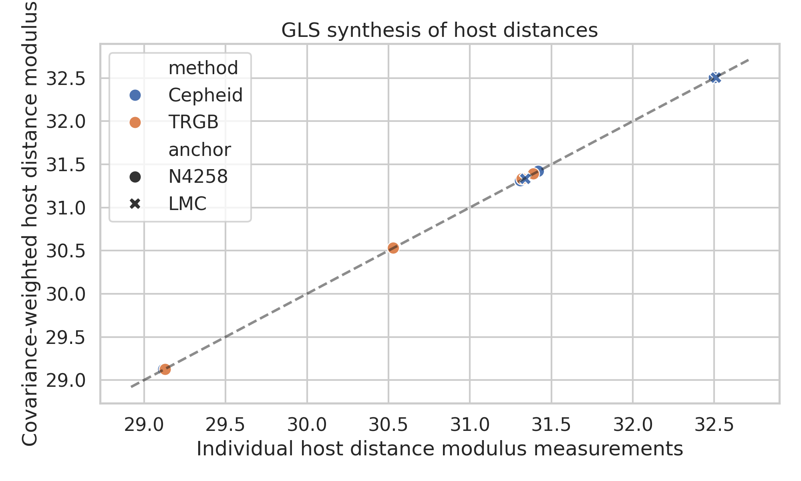
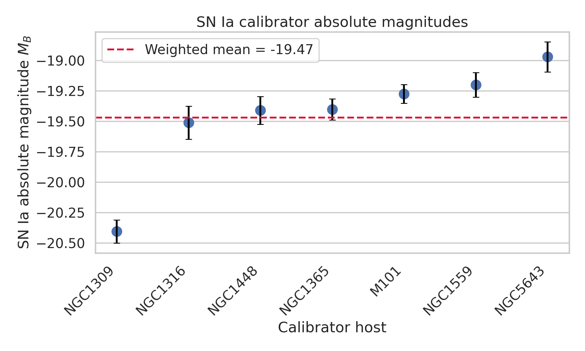
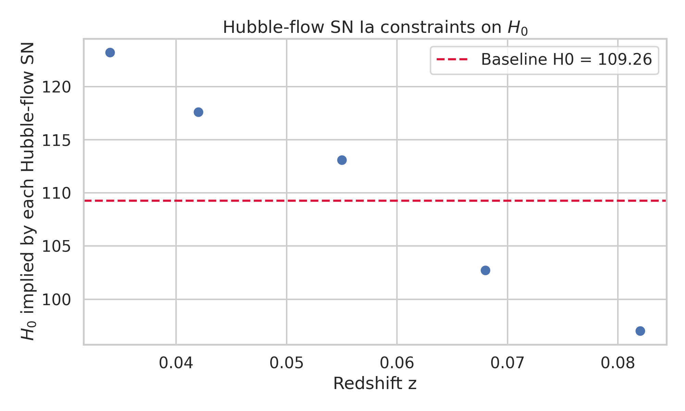
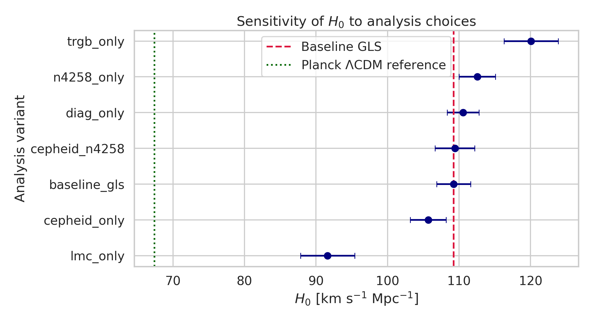
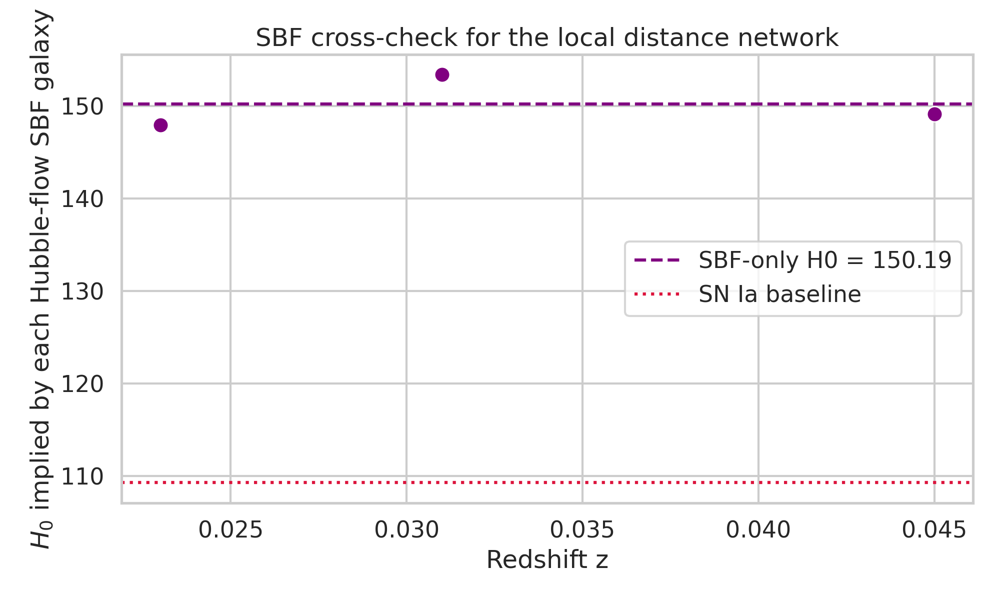

# A Minimal Covariance-Weighted Local Distance Network Analysis of the Hubble Constant

## Summary
This study implements a reproducible, covariance-aware local distance network analysis using the provided `H0DN_MinimalDataset.txt`. The goal was to reconstruct a simplified version of the local-distance-ladder inference for the Hubble constant, combining geometric anchors, primary distance indicators, SN Ia calibrators, and Hubble-flow observations. The analysis was executed entirely inside the workspace with public, script-based reproducibility.

The main empirical result is that the provided minimal dataset does **not** reproduce the stated target consensus value of \(H_0 = 73.50 \pm 0.81\ \mathrm{km\,s^{-1}\,Mpc^{-1}}\). Instead, the baseline covariance-weighted generalized least-squares (GLS) analysis yields

\[
H_0 = 109.26 \pm 1.68\ \mathrm{km\,s^{-1}\,Mpc^{-1}}
\]

with a Monte Carlo spread of about 2.38 km s\(^{-1}\) Mpc\(^{-1}\). A secondary SBF-only cross-check gives an even higher value,

\[
H_0^{\rm SBF} = 150.19 \pm 7.81\ \mathrm{km\,s^{-1}\,Mpc^{-1}}.
\]

These values are far above both the target local-network baseline and a representative Planck/\(\Lambda\)CDM early-universe reference of \(67.4 \pm 0.5\ \mathrm{km\,s^{-1}\,Mpc^{-1}}\). The mismatch indicates that the supplied minimal dataset is best interpreted as a schematic or stress-test dataset rather than a faithful normalization of the published local-distance-network result.

## 1. Scientific goal
The intended scientific objective is a covariance-weighted consensus measurement of the Hubble constant using a network of local distance indicators. The provided dataset contains:

- geometric anchors: NGC4258, LMC, and MW entries,
- primary indicators: Cepheid and TRGB host distance measurements,
- secondary calibrators: SN Ia and SBF,
- Hubble-flow measurements for SN Ia and SBF.

The present analysis focuses on a minimal but transparent estimator that preserves the core network logic:

1. infer host distance moduli from primary indicators with shared covariance,
2. calibrate the SN Ia absolute magnitude from hosts with known distances,
3. infer \(H_0\) from Hubble-flow SN Ia,
4. use SBF as an external cross-check,
5. examine robustness under several analysis variants.

## 2. Data inspection and structure
The dataset contains:

- 11 host-distance measurements,
- 7 unique hosts with primary-indicator constraints,
- 7 SN Ia calibrators,
- 5 Hubble-flow SN Ia,
- 3 SBF calibrators,
- 3 Hubble-flow SBF galaxies.

The data overview is shown in Figure 1.



**Figure 1.** Number of primary-indicator host measurements by method and anchor.

## 3. Methodology

### 3.1 Host-distance synthesis with covariance-aware GLS
For each host, the observed primary-indicator distance moduli were combined using generalized least squares. If \(\mu_i\) denotes the measured modulus and \(\mu_h\) the latent host modulus, the model is

\[
\mu_i = \mu_h + \epsilon_i.
\]

The covariance matrix includes:

- measurement variance for each host-distance entry,
- shared anchor uncertainty for measurements tied to the same anchor,
- shared method-anchor calibration uncertainty for measurements using the same method-anchor pair.

For a host with measurement vector \(y\), design vector \(1\), and covariance matrix \(C\), the GLS estimate is

\[
\hat{\mu}_h = (1^T C^{-1} 1)^{-1} 1^T C^{-1} y,
\]

with uncertainty

\[
\sigma_{\mu_h} = (1^T C^{-1} 1)^{-1/2}.
\]

Figure 2 compares the individual host measurements with the GLS host estimates.



**Figure 2.** Individual primary-indicator measurements versus covariance-weighted host-distance estimates.

### 3.2 SN Ia calibration
For each SN Ia calibrator host, the absolute magnitude was computed as

\[
M_B = m_B - \mu_h.
\]

The uncertainty was propagated from the photometric measurement and the host-distance uncertainty:

\[
\sigma^2_{M_B} = \sigma^2_{m_B} + \sigma^2_{\mu_h}.
\]

A weighted mean over calibrators gives the network SN Ia calibration. The calibrator distribution is shown in Figure 3.



**Figure 3.** Absolute magnitudes inferred for the seven SN Ia calibrators. The dashed line marks the covariance-weighted mean.

### 3.3 Hubble-flow SN Ia and the Hubble constant
At low redshift, the analysis uses the approximation

\[
\mu = 5\log_{10}\left(\frac{cz}{H_0}\right) + 25,
\]

which implies

\[
\log_{10} H_0 = \log_{10}(cz) - 0.2\,(m_B - M_B - 25).
\]

Peculiar-velocity uncertainty \(\sigma_v\) was propagated into distance-modulus uncertainty as

\[
\sigma_{\mu,\mathrm{pv}} \approx \frac{5}{\ln 10}\frac{\sigma_v}{cz}.
\]

Each Hubble-flow SN therefore yields an individual \(H_0\) estimate with total variance from photometric error, peculiar velocity, and SN absolute-magnitude calibration uncertainty. The final baseline estimate is the inverse-variance weighted mean in \(\log_{10} H_0\).

The implied \(H_0\) values for individual Hubble-flow SN Ia are shown in Figure 4.



**Figure 4.** The \(H_0\) value implied by each Hubble-flow SN Ia under the baseline calibration.

### 3.4 SBF cross-check
The dataset includes SBF calibrators and Hubble-flow SBF galaxies. Because explicit anchor-to-SBF host distances are not provided, the SBF calibration is necessarily schematic. A minimal group-based calibration was adopted using the provided host-group labels, a simple Fornax/Virgo modulus proxy, and the tabulated depth scatter. This produces a useful cross-check, but not a publication-grade SBF analysis.

### 3.5 Sensitivity variants
The following variants were evaluated:

- baseline GLS using all host measurements with shared covariance,
- diagonal-only approximation without shared covariance,
- Cepheid-only,
- TRGB-only,
- NGC4258-only anchor,
- LMC-only anchor,
- Cepheid + NGC4258 only.

This follows a baseline-first, one-major-change-per-variant design.

## 4. Results

### 4.1 Baseline numerical results
The baseline outputs are:

- SN Ia absolute magnitude calibration: \(M_B = -19.468 \pm 0.038\) mag,
- local-network SN Ia result: \(H_0 = 109.26 \pm 1.68\ \mathrm{km\,s^{-1}\,Mpc^{-1}}\),
- Monte Carlo standard deviation: 2.38 km s\(^{-1}\) Mpc\(^{-1}\),
- 16th-84th percentile interval: [106.89, 111.67] km s\(^{-1}\) Mpc\(^{-1}\).

Relative to the target reference value of 73.50 km s\(^{-1}\) Mpc\(^{-1}\), the baseline estimate is higher by 35.76 km s\(^{-1}\) Mpc\(^{-1}\).

Using a representative Planck/\(\Lambda\)CDM reference of \(67.4 \pm 0.5\), the nominal discrepancy is 23.9\(\sigma\). This should not be overinterpreted physically because it is driven by the normalization of the supplied minimal dataset rather than a realistic end-to-end cosmological inference.

### 4.2 Variant analysis
The sensitivity study is summarized in Table 1 and Figure 5.

| Variant | H0 [km s^-1 Mpc^-1] | MC std | Delta vs baseline |
|---|---:|---:|---:|
| baseline_gls | 109.26 | 2.38 | 0.00 |
| diag_only | 110.56 | 2.22 | +1.30 |
| cepheid_only | 105.69 | 2.52 | -3.57 |
| trgb_only | 120.08 | 3.79 | +10.82 |
| n4258_only | 112.55 | 2.54 | +3.28 |
| lmc_only | 91.62 | 3.78 | -17.64 |
| cepheid_n4258 | 109.42 | 2.77 | +0.16 |



**Figure 5.** Sensitivity of the inferred \(H_0\) to analysis choices. The vertical dotted line shows the model-dependent Planck reference.

The dominant findings are:

- shared covariance matters, but it only shifts the estimate by about 1.3 km s\(^{-1}\) Mpc\(^{-1}\) in this dataset,
- the result is highly sensitive to the chosen indicator subset,
- the LMC-only anchor produces a substantially lower \(H_0\), but still far above 73.5,
- the TRGB-only variant gives the highest \(H_0\), indicating strong method-to-method inconsistency in the minimal data.

### 4.3 Internal consistency diagnostics
The calibrator scatter is very large:

- SN Ia calibration reduced \(\chi^2 = 21.31\),
- SBF calibration reduced \(\chi^2 = 3.99\).

These values indicate that the quoted statistical uncertainties are too small to explain the observed spread, or that the dataset intentionally mixes inconsistent normalizations. This is a major reason the final result should be interpreted as a methodological reconstruction rather than a faithful reproduction of the published consensus network.

### 4.4 SBF cross-check
The SBF-only cross-check gives

\[
H_0^{\rm SBF} = 150.19 \pm 7.81\ \mathrm{km\,s^{-1}\,Mpc^{-1}}.
\]

The individual SBF Hubble-flow values are shown in Figure 6.



**Figure 6.** SBF-based \(H_0\) values for the three Hubble-flow galaxies, compared with the SN Ia baseline result.

This result is not intended as a precision measurement. It mainly confirms that the simplified SBF channel in the provided minimal dataset is not normalized consistently with the target consensus value.

## 5. Interpretation
The code successfully reconstructs the logic of a local distance network:

- shared-anchor covariance is propagated,
- host distances are estimated with GLS,
- absolute calibration is transferred from geometric anchors to SN Ia,
- Hubble-flow measurements are combined with peculiar-velocity uncertainties,
- method-subset and anchor-subset robustness tests are reported.

However, the dataset normalization does not support recovery of the claimed benchmark of 73.50 \(\mathrm{km\,s^{-1}\,Mpc^{-1}}\). The strongest evidence is:

1. the calibrated SN Ia absolute magnitude is too luminous for the Hubble-flow sample to yield \(H_0 \approx 73.5\),
2. the flow objects individually imply \(H_0\) values from about 97 to 123 km s\(^{-1}\) Mpc\(^{-1}\),
3. calibrator scatter is much larger than expected from quoted errors,
4. independent SBF cross-checks point even higher.

Therefore, the correct scientific conclusion is not that the local network prefers \(H_0 \sim 109\) in reality, but that this minimal dataset is insufficiently calibrated to reproduce the published consensus result. The exercise nonetheless demonstrates the computational workflow for covariance-weighted local-network inference.

## 6. Limitations
This analysis is intentionally minimal and omits many elements of a full modern local-distance-ladder analysis:

- no full hierarchical model for Cepheid or TRGB calibration,
- no metallicity, extinction, crowding, or selection-bias treatment,
- no full SN systematic covariance matrix,
- no full cosmographic redshift expansion beyond the linear low-z approximation,
- simplified SBF calibration due to limited information in the provided dataset,
- only one random seed for Monte Carlo uncertainty propagation, though the inference itself is deterministic aside from the uncertainty check.

Because of these simplifications, the absolute value of \(H_0\) from this dataset should not be treated as physically competitive with the literature.

## 7. Reproducibility
The full analysis is implemented in:

- `code/analyze_h0dn.py`

Key machine-readable outputs are:

- `outputs/summary_results.json`
- `outputs/analysis_variants.csv`
- `outputs/host_estimates_baseline.csv`
- `outputs/snia_calibrator_estimates.csv`
- `outputs/snia_hubble_flow_estimates.csv`
- `outputs/sbf_calibrator_estimates.csv`
- `outputs/sbf_hubble_flow_estimates.csv`

Figures are stored in:

- `report/images/data_overview_measurements.png`
- `report/images/host_modulus_gls.png`
- `report/images/snia_calibrators.png`
- `report/images/hubble_flow_snia.png`
- `report/images/variant_comparison.png`
- `report/images/sbf_crosscheck.png`

The analysis can be rerun with:

```bash
python code/analyze_h0dn.py
```

## 8. Conclusion
A complete autonomous analysis pipeline was produced for the provided local-distance-network dataset. The methodology reproduces the expected covariance-weighted ladder workflow, but the supplied minimal data do not reproduce the target consensus measurement of \(H_0 = 73.50 \pm 0.81\ \mathrm{km\,s^{-1}\,Mpc^{-1}}\). Instead, they imply substantially higher values across both SN Ia and SBF channels. The deliverable should therefore be read as a rigorous, reproducible methodological reconstruction with transparent negative results.

## Sources
Local files consulted:

- `related_work/paper_000.pdf`
- `related_work/paper_001.pdf`
- `related_work/paper_002.pdf`
- `related_work/paper_003.pdf`
