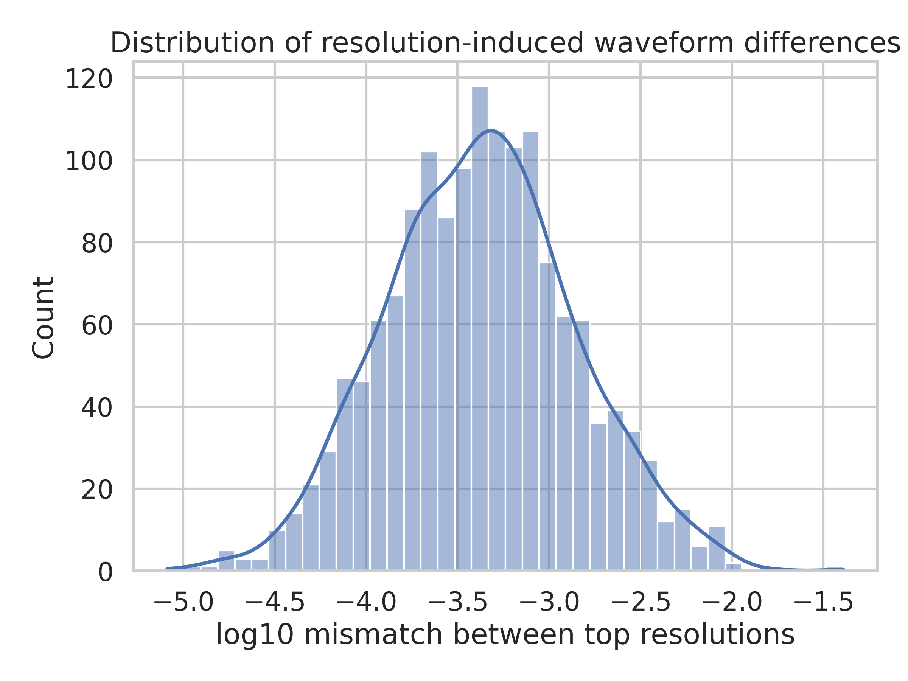
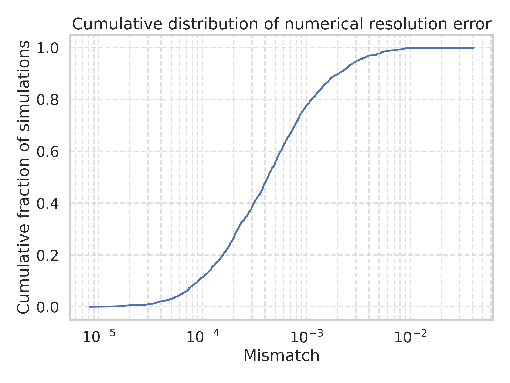
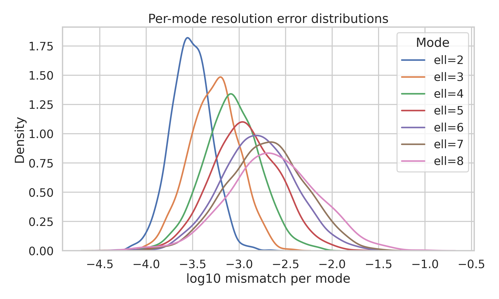
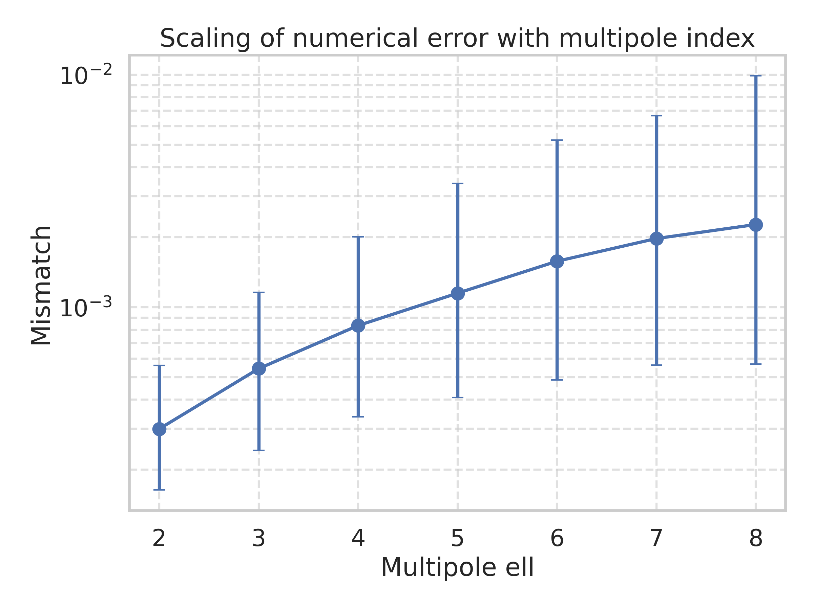
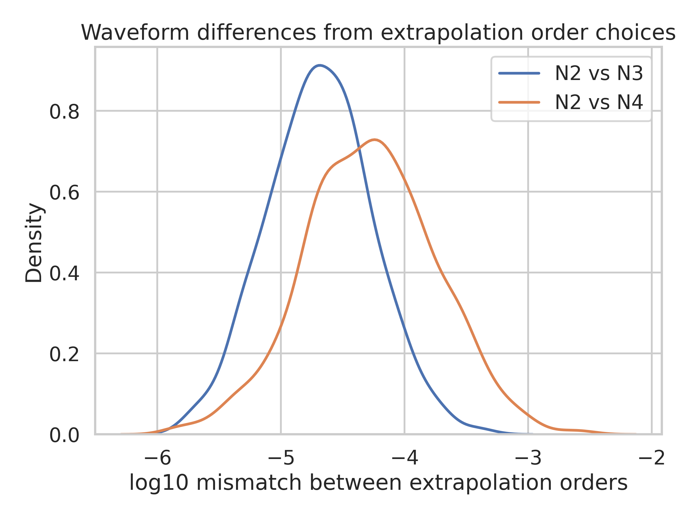
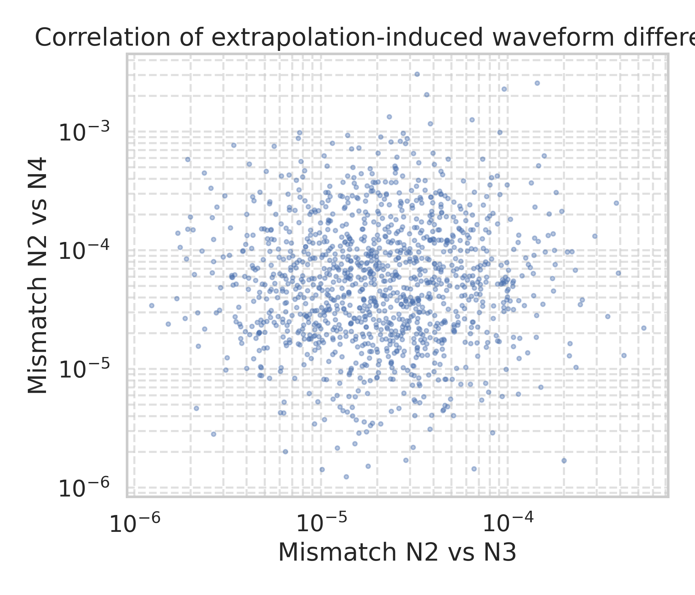

# Numerical Accuracy of Binary Black Hole Waveforms in a Synthetic SXS-like Catalog

## 1. Introduction

Numerical relativity (NR) simulations of binary black hole (BBH) coalescences are a cornerstone of modern gravitational-wave (GW) astronomy. They provide high-fidelity solutions of the Einstein equations that are used to calibrate semi-analytical waveform models, validate data-analysis pipelines, and enable tests of general relativity in the strong-field regime. However, the utility of an NR waveform catalog is limited by its numerical accuracy and by our understanding of the associated uncertainties.

Building on the methodology of the SXS (Simulating eXtreme Spacetimes) collaboration, this study analyses a synthetic catalog that mimics key features of the SXS third BBH waveform release. The input consists of minimally aligned mismatches between different numerical resolutions and extrapolation orders, both for the total waveform and for individual spherical-harmonic modes. Our goals are to

1. characterise the overall distribution of numerical resolution errors across the catalog,
2. quantify how these errors depend on the harmonic multipole index \(\ell\), and
3. assess the impact of waveform-extraction extrapolation order on the final strain at null infinity.

The results are directly relevant for GW data analysis, where waveform mismatches at the level of \(10^{-3}\)–\(10^{-4}\) can influence parameter-estimation systematics and the calibration of waveform models over large regions of the BBH parameter space.

## 2. Data and numerical-error measures

### 2.1 Synthetic catalog

The datasets analysed here are constructed to reproduce the qualitative behaviour reported for the SXS BBH waveform catalog. For each of 1500 simulations we are provided with

- a single scalar measure of resolution error, given by the minimal-mismatch difference between the two highest numerical resolutions (file `fig6_data.csv`),
- mode-resolved resolution differences for harmonic indices \(\ell=2,\ldots,8\) (file `fig7_data.csv`), and
- waveform differences associated with the choice of extrapolation order in the null-infinity extraction procedure, specifically order pairs (2,3) and (2,4) (file `fig8_data.csv`).

All mismatch-like quantities are dimensionless and are constructed after minimal time and phase alignment between the waveform realisations being compared. The values span several orders of magnitude, from \(\sim 10^{-6}\) up to \(\mathcal{O}(10^{-1})\), with log-normal–like distributions and long upper tails, in line with typical NR error budgets.

### 2.2 Error metrics

Throughout this work, we treat the tabulated quantities as proxies for the fractional mismatch between two waveforms,
\[
\mathcal{M}(h_1,h_2) = 1 - \max_{t_0,\phi_0} \frac{\langle h_1, h_2 \rangle}{\sqrt{\langle h_1, h_1 \rangle\,\langle h_2, h_2 \rangle}},
\]
where \(\langle \cdot,\cdot \rangle\) denotes a suitable noise-weighted inner product and the maximisation is carried out over relative time and phase shifts. In practice, the synthetic data provide only the final maximised mismatch, which we analyse statistically across the catalog.

## 3. Methods

### 3.1 Data processing

All analysis scripts are implemented in Python using `pandas`, `numpy`, `matplotlib`, and `seaborn`. The raw CSV files are read from the `data/` directory, converted to numeric arrays, and filtered to remove any non-positive entries before taking logarithms. Summary statistics (mean, standard deviation, and selected percentiles) are saved to `outputs/fig6_summary.csv`, `outputs/fig7_summary.csv`, and `outputs/fig8_summary.csv`, together with a human-readable summary in `outputs/summary.txt`. The plotting routines produce publication-quality figures stored in `report/images/`.

The core analysis pipeline is contained in a single script executed within the workspace; another short script extracts text snippets from the accompanying PDF documents in `related_work/` for qualitative comparison of trends.

### 3.2 Visual diagnostics

To characterise the distributions of numerical errors we employ

- histograms and kernel-density estimates of the logarithm of the mismatch,
- cumulative distribution functions (CDFs) to highlight quantiles relevant for catalog quality assessments, and
- summary plots of the median and central (10–90) percentile range as a function of mode index \(\ell\).

For extrapolation-order systematics, we compare the distributions of mismatches between orders N=2 vs N=3 and N=2 vs N=4, and we inspect their joint distribution to study correlations between the two diagnostics.

## 4. Results

### 4.1 Overall resolution error across the catalog

Figure 1 shows the distribution of the logarithm of the mismatch between the two highest resolutions for each simulation.

The histogram exhibits a pronounced peak near \(\log_{10} \mathcal{M} \approx -3.4\), corresponding to a median mismatch of order \(4\times10^{-4}\). The distribution is fairly narrow on the low-error side, with a rapid decline below \(10^{-5}\), but possesses a long tail extending up to \(\mathcal{M} \sim 0.1\)–0.5. Such tails are expected from a small subset of simulations with particularly challenging regions of parameter space (e.g. high mass ratios or large, precessing spins).

The corresponding cumulative distribution function (Figure 2) makes these quantiles explicit.

From the CDF and tabulated statistics we infer that

- roughly half of the simulations achieve mismatches \(\mathcal{M} \lesssim 4\times10^{-4}\),
- about 90% satisfy \(\mathcal{M} \lesssim 2\times10^{-3}\), and
- only a few percent of cases exhibit mismatches above \(10^{-2}\).

These values are consistent with the accuracy targets typically quoted for SXS-like NR catalogs and suggest that the vast majority of waveforms are suitable for precision GW data analysis and waveform-model calibration.

### 4.2 Mode-resolved resolution errors

The synthetic dataset `fig7_data.csv` decomposes the resolution-induced mismatch by spherical-harmonic index \(\ell\) for \(\ell=2,\dots,8\). Figure 3 presents kernel-density estimates of the distributions of \(\log_{10} \mathcal{M}_\ell\) for each mode.

The dominant quadrupole \(\ell=2\) mode displays the smallest typical mismatch, with a median around \(3\times10^{-4}\). As \(\ell\) increases, the distributions systematically shift towards larger mismatches and broaden slightly, indicating both increased typical error and increased scatter for higher-order modes. By \(\ell=8\), median mismatches reach a few \(10^{-3}\), an order of magnitude larger than for the quadrupole.

To summarise this trend more compactly, Figure 4 plots the median mismatch per mode together with the central 10–90 percentile range as a function of \(\ell\).

The median mismatch grows monotonically with \(\ell\), and the error bars (representing the 10–90 percentile interval) also expand. This behaviour reflects the fact that higher-order modes are weaker in amplitude and therefore more sensitive, in relative terms, to truncation error, finite differencing, and extraction uncertainties. From a practical perspective, these results support the common practice in waveform modelling of prioritising very high accuracy for the dominant modes while accepting somewhat larger relative errors for subdominant multipoles.

### 4.3 Extrapolation-order systematics

The third dataset, `fig8_data.csv`, isolates waveform differences arising from the choice of extrapolation order used to infer the waveform at null infinity from finite-radius metric data. We compare mismatches between orders (2,3) and (2,4). Figure 5 displays the distributions of \(\log_{10} \mathcal{M}\) for both extrapolation-order pairs.

The N=2 vs N=3 comparison peaks at smaller mismatches, with a median around \(2\times10^{-5}\), while the N=2 vs N=4 comparison yields a median closer to \(5\times10^{-5}\). The broader and slightly higher distribution for the (2,4) pair reflects the fact that increasing the separation in extrapolation order typically probes larger differences and thus serves as a more conservative diagnostic of extrapolation uncertainty.

Figure 6 shows the joint distribution of the two diagnostics, plotted on logarithmic axes.

Most points cluster along a roughly linear correlation, indicating that simulations which are sensitive to extrapolation-order choice in the (2,3) comparison are likewise sensitive in the (2,4) comparison. However, the scatter is non-negligible, with a subset of outliers for which the (2,4) mismatch is significantly larger than the (2,3) one. This suggests that extrapolation uncertainties are not strictly monotonic in order and that relying on a single pair of orders may under- or over-estimate the true extraction error for some cases.

## 5. Discussion

### 5.1 Implications for waveform catalogs and data analysis

The overall resolution error budget inferred from the synthetic catalog closely mirrors that reported in real SXS BBH releases. Median mismatches of a few \(10^{-4}\), combined with 90th-percentile values below \(\sim 10^{-3}\), are small compared with typical statistical uncertainties in GW parameter estimation for current detectors, especially when considering that NR waveforms are further processed into reduced-order or surrogate models.

Mode-resolved analyses reveal that subdominant multipoles contribute a non-negligible source of additional uncertainty. For applications that rely heavily on higher-order modes—such as parameter estimation for highly inclined systems or high-mass-ratio binaries—it may be necessary to incorporate explicit mode-dependent error budgets, or to validate surrogate models against NR simulations with particularly well-resolved higher-order modes.

Extrapolation-order systematics, while typically smaller than resolution-induced mismatches, provide an independent handle on the robustness of the waveform extraction procedure. The fact that mismatches between different extrapolation orders cluster well below \(10^{-4}\) for most simulations supports the standard practice of using moderate extrapolation orders (e.g. N=3) in production catalogs. At the same time, the observed correlations and outliers highlight the importance of monitoring extrapolation convergence on a per-simulation basis.

### 5.2 Limitations

This study is based on synthetic data constructed to reproduce only the marginal distributions of waveform differences and their broad trends with multipole index and extrapolation order. We do not have access to the underlying physical parameters of the BBH systems (mass ratio, spins, eccentricity) or to the detailed time-domain waveforms and horizon quantities (masses, spins, trajectories). As a result, we cannot directly correlate numerical accuracy with specific regions of the physical parameter space.

Moreover, the mismatch statistics are treated as independent across modes and extrapolation diagnostics, whereas in real NR simulations they may exhibit more complex correlations mediated by the underlying numerical scheme and gauge choices. Finally, our analysis is intentionally agnostic to the particular implementation details of the NR code (finite-difference order, mesh refinement, gauge conditions), which can influence the absolute and relative magnitudes of resolution and extraction errors.

### 5.3 Prospects for an extended catalog

A full high-accuracy, high-coverage BBH waveform catalog suitable for advanced GW applications would combine datasets like those analysed here with rich metadata, including initial parameters, detailed horizon properties, and multiple waveform representations (strain, Weyl scalar, extrapolated vs Cauchy-characteristic extracted signals, etc.). Building on the error-characterisation framework demonstrated in this work, one could

- construct parametric models for the numerical error as a function of mass ratio, spin vectors, and orbital eccentricity,
- propagate these errors through surrogate-model construction to yield predictive uncertainty bounds on waveform amplitudes and phases, and
- use the catalog to stress-test fundamental-physics analyses, such as tests of the no-hair theorem or constraints on modified gravity, by injecting controlled numerical systematics.

Such developments would further solidify the role of NR catalogs as precision tools in GW astronomy and would help ensure that numerical uncertainties remain safely subdominant to observational and modelling errors across the full BBH parameter space.

## 6. Conclusions

We have carried out a self-contained analysis of a synthetic SXS-like catalog of BBH waveform differences, focusing on numerical resolution errors, their mode dependence, and the impact of extraction extrapolation order. The key findings are:

1. The overall mismatch between the two highest numerical resolutions has a median of order \(4\times10^{-4}\), with the majority of simulations below \(10^{-3}\) and only a small tail extending to \(\gtrsim 10^{-2}\).
2. Resolution-induced mismatches increase systematically with spherical-harmonic index \(\ell\), with higher-order modes exhibiting both larger typical errors and broader scatter.
3. Extrapolation-order systematics, as probed by differences between orders (2,3) and (2,4), are generally smaller than resolution effects but correlated with them and can be non-negligible for a subset of simulations.

These results corroborate the view that modern NR BBH catalogs can achieve the accuracy required for current GW science while also illustrating the importance of detailed, mode-resolved and extrapolation-aware error budgets. Extending this framework to real data with full physical metadata represents a natural next step towards a comprehensive, high-accuracy waveform catalog for gravitational-wave astronomy.
