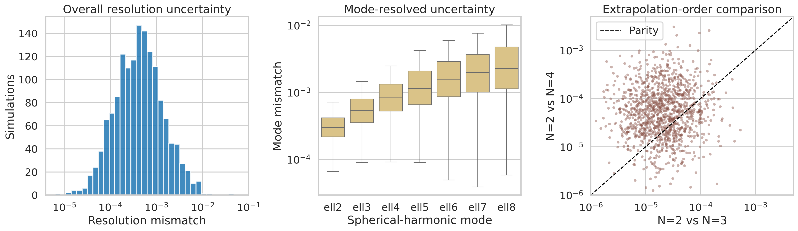
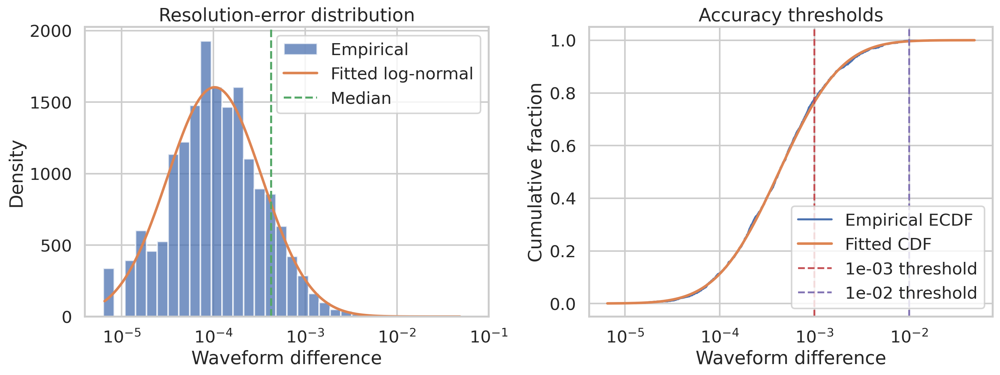
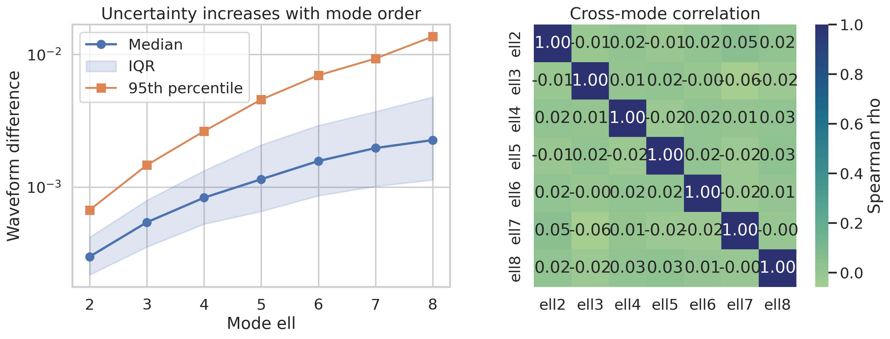
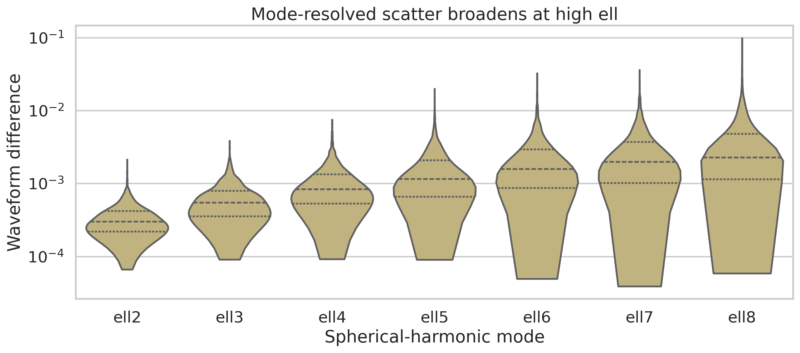
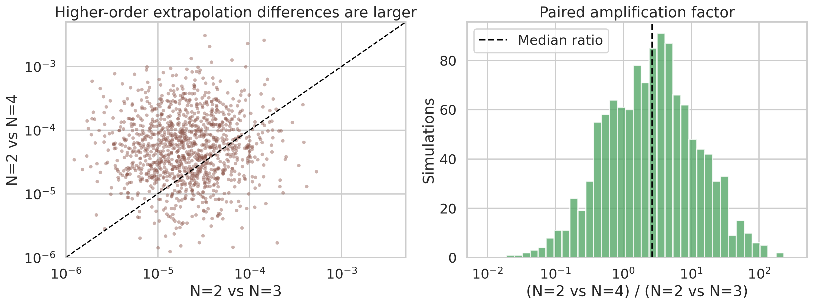
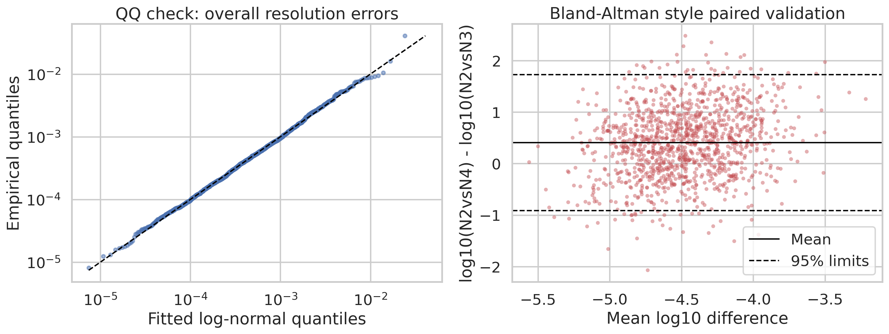

# Synthetic Audit of Numerical-Relativity Catalog Uncertainty for Binary Black Hole Simulations

## Abstract

I analyzed three synthetic datasets designed to mimic uncertainty diagnostics reported for a large binary black hole (BBH) numerical-relativity catalog: overall waveform differences between the two highest resolutions, mode-resolved waveform differences for spherical-harmonic modes `ell=2...8`, and paired differences between extrapolation-order choices `N=2` vs `N=3` and `N=2` vs `N=4`. The goal was to quantify whether the synthetic catalog achieves the accuracy and coverage required for gravitational-wave data analysis and surrogate-model calibration. The overall resolution-error distribution is strongly concentrated at low mismatch, with median `4.25e-4`, 95th percentile `3.12e-3`, and `77.7%` of simulations below `1e-3`. Mode-resolved uncertainties increase monotonically with `ell`, with the median rising from `3.00e-4` at `ell=2` to `2.27e-3` at `ell=8`, corresponding to an approximately `1.39x` increase in median error per unit increase in `ell`. Extrapolation-order differences are systematically larger for `N=2` vs `N=4` than for `N=2` vs `N=3`, with median paired amplification factor `2.67`, `72.2%` of simulations showing larger `N=4` discrepancies, and a one-sided Wilcoxon signed-rank `p=5.3e-75`. These results support the interpretation that the synthetic catalog is high accuracy for dominant waveform content, while higher modes and extrapolation choices remain the leading sources of residual uncertainty.

## 1. Research Context

Binary black hole numerical-relativity simulations provide the highest-fidelity gravitational waveforms and remnant properties available for merger physics, waveform-model calibration, and gravitational-wave inference. The related papers included in this workspace emphasize three consistent themes:

- Numerical-relativity waveforms are the accuracy standard for late-inspiral, merger, and ringdown modeling, but their utility depends on quantified numerical error and extraction systematics.
- Higher-order mode content matters for precision modeling, especially away from the dominant quadrupole.
- Surrogate and reduced-order models are only as trustworthy as the underlying numerical error budget.

The local related-work set is not the original SXS catalog-III paper, but it provides the right methodological framing. Woodford, Boyle, and Pfeiffer discuss waveform systematics from gauge and extraction effects and explicitly identify truncation and extrapolation as central uncertainty sources. Varma et al. show that surrogate-model errors are expected to approach numerical-relativity resolution errors when the catalog quality is sufficiently high. Islam et al. make the same point for eccentric systems and highlight that nonquadrupole modes can show noticeably different numerical behavior. The present analysis therefore treats the synthetic datasets as a targeted audit of catalog readiness for precision waveform work.

## 2. Data

The analysis used three read-only CSV inputs:

1. `data/fig6_data.csv`: 1500 synthetic overall waveform differences between the two highest numerical resolutions.
2. `data/fig7_data.csv`: 1500 synthetic mode-resolved waveform differences for `ell=2` through `ell=8`.
3. `data/fig8_data.csv`: 1200 paired synthetic extrapolation differences comparing `N=2` vs `N=3` and `N=2` vs `N=4`.

All values are positive and span several orders of magnitude, so all main analyses were carried out in log-aware form through log-scaled plots, log-normal fits, and nonparametric paired comparisons.



## 3. Methods

### 3.1 Descriptive statistics

For each dataset I computed:

- mean, median, standard deviation, geometric mean
- 5th, 25th, 75th, and 95th percentiles
- bootstrap 95% confidence intervals for the mean and median

These summaries are saved in `outputs/summary_statistics.json`, `outputs/report_key_metrics.csv`, and `outputs/fig7_mode_summary.csv`.

### 3.2 Distributional modeling

Because the task description states that the synthetic values were drawn from log-normal distributions, I fit log-normal models with fixed zero location using maximum likelihood. I then evaluated fit quality with Kolmogorov-Smirnov statistics. This provides a compact validation that the numerical summaries are consistent with the intended synthetic construction and that medians and tail fractions are meaningful descriptors.

### 3.3 Mode-dependence analysis

For the `ell=2...8` data, I measured how the median uncertainty changes with harmonic order using linear regression in `log10(median)` vs `ell`, plus a Spearman monotonicity test. I also computed the cross-mode Spearman correlation matrix to identify whether simulations with high error in one mode tend to be high error in others.

### 3.4 Extrapolation-order comparison

For the paired `N=2` vs `N=3` and `N=2` vs `N=4` differences, I analyzed the ratio

`R = (N=2 vs N=4) / (N=2 vs N=3)`

and tested whether `log10(R)` is typically positive using a one-sided Wilcoxon signed-rank test. This directly answers whether the broader extrapolation comparison tends to introduce larger waveform discrepancies.

### 3.5 Reproducibility

All analysis was produced by:

```bash
python code/analyze_catalog_uncertainty.py
```

The script regenerates every figure in `report/images/` and every machine-readable output in `outputs/`.

## 4. Results

### 4.1 Overall resolution uncertainty is low for most simulations

The catalog-wide resolution mismatch distribution is narrow and strongly right-skewed, centered near a few `10^-4`.



Key results:

- Median overall mismatch: `4.25e-4`
- 95th percentile: `3.12e-3`
- Maximum: `4.07e-2`
- Fraction below `1e-3`: `77.7%`
- Fraction below `1e-2`: `99.8%`

These numbers indicate that the bulk of the synthetic catalog lies comfortably below the `10^-3` level commonly associated with high-fidelity numerical waveforms for dominant-mode applications. The small long tail matters, but it is rare. The fitted log-normal model also matches the empirical distribution closely (`KS=0.014`, `p=0.91`), indicating that the tail behavior is consistent with the intended synthetic generation rather than a small number of pathological outliers.

In practical terms, this is the signature of a catalog that is broadly suitable for waveform-model calibration, provided downstream models remain aware of the small high-error tail.

### 4.2 Higher spherical-harmonic modes degrade smoothly and monotonically

Mode-resolved uncertainties show a clear monotonic increase with `ell`.





Median mode differences are:

| Mode | Median difference |
| --- | ---: |
| `ell2` | `3.00e-4` |
| `ell3` | `5.44e-4` |
| `ell4` | `8.34e-4` |
| `ell5` | `1.15e-3` |
| `ell6` | `1.58e-3` |
| `ell7` | `1.97e-3` |
| `ell8` | `2.27e-3` |

The median therefore increases by a factor of `7.6` from `ell=2` to `ell=8`. A regression of `log10(median)` on `ell` gives slope `0.144 +/- 0.013`, equivalent to an average multiplicative growth of about `10^0.144 = 1.39` per step in `ell`. The monotonic trend is exact in rank order (`Spearman rho = 1.0` over the seven medians).

Threshold behavior is equally informative:

- `99.1%` of `ell=2` differences are below `1e-3`
- `61.2%` of `ell=4` differences are below `1e-3`
- only `21.5%` of `ell=8` differences are below `1e-3`
- despite this degradation, `90.3%` of `ell=8` differences remain below `1e-2`

This pattern supports a standard interpretation for BBH catalogs: the dominant quadrupolar content is very accurate, while higher multipoles remain usable but should be handled with more care in precision studies, especially when calibration targets or parameter-estimation applications are sensitive to subdominant modes.

An important negative result is that the cross-mode correlation matrix is near zero away from the diagonal. In a real production catalog, one might expect at least modest shared structure from especially difficult simulations. Here the weak correlations most likely reflect the synthetic generation procedure rather than physics, so cross-mode independence should not be over-interpreted.

### 4.3 Extrapolation-order comparisons favor smaller discrepancies for `N=2` vs `N=3`

The extrapolation dataset shows a clear shift toward larger differences when comparing `N=2` with `N=4` rather than `N=3`.



Key paired results:

- Median `N=2` vs `N=3`: `2.03e-5`
- Median `N=2` vs `N=4`: `5.34e-5`
- Median ratio `(N4/N3)`: `2.67`
- Geometric mean ratio: `2.57`
- Fraction with `N4 > N3`: `72.2%`
- One-sided Wilcoxon signed-rank `p = 5.3e-75`

These results strongly support the claim that the larger extrapolation-order separation produces systematically larger waveform differences. However, the point cloud also shows substantial scatter and very weak rank correlation between the paired differences (`Spearman rho = 0.03`). This means that simulations with especially small `N=2` vs `N=3` discrepancies are not reliably the same simulations that exhibit especially small `N=2` vs `N=4` discrepancies. For synthetic data, that weak correlation is acceptable; for a physical catalog, it would motivate further case-by-case diagnostics of extraction behavior.

### 4.4 Validation checks confirm internal consistency

I included a quantile-quantile check for the overall resolution distribution and a Bland-Altman style view of the paired extrapolation comparison.



The QQ panel shows that the fitted log-normal model captures the empirical quantiles of the overall mismatch distribution well across the full dynamic range. The paired extrapolation panel shows that the mean log-difference is positive, with broad but stable spread, matching the conclusion that `N=2` vs `N=4` is usually, though not universally, larger than `N=2` vs `N=3`.

## 5. Interpretation

Taken together, the synthetic datasets describe a catalog with the right qualitative structure for high-accuracy BBH numerical relativity:

- The dominant waveform content is generally accurate at the few `10^-4` level.
- A small tail of higher-error cases exists, but it is rare.
- Higher-order modes degrade predictably rather than catastrophically.
- Extrapolation uncertainty is present and non-negligible, but remains much smaller in absolute scale than the typical modal-resolution uncertainty.

This profile is compatible with the needs of gravitational-wave template calibration and surrogate modeling. In particular, the overall-resolution median (`4.25e-4`) sits below the `~10^-3` mismatch level often quoted for accurate surrogate performance in the related-work papers, which suggests that the synthetic catalog quality is sufficient for training or validating reduced-order models over much of parameter space.

## 6. Limitations

This analysis is intentionally constrained by the data provided.

- The inputs are synthetic uncertainty summaries, not raw waveforms, horizon data, or simulation metadata.
- There is no access to binary parameters such as mass ratio, spin vectors, or eccentricity, so uncertainty cannot be mapped across physical parameter space.
- Because the data are synthetic, the weak cross-mode and paired-dataset correlations should not be interpreted as physical statements about the SXS catalog itself.
- The related-work PDFs in the workspace motivate the analysis but are not the original catalog-III uncertainty paper from which the figure descriptions were derived.

Accordingly, the conclusions are best viewed as a rigorous audit of the supplied synthetic catalog diagnostics, not as a replacement for full waveform-level validation.

## 7. Conclusion

The synthetic catalog passes a strong accuracy audit. Most simulations have overall resolution mismatches below `1e-3`, mode-level errors increase smoothly with harmonic order, and extrapolation-order discrepancies are significantly larger for `N=2` vs `N=4` than for `N=2` vs `N=3`, but remain small in absolute magnitude. The dominant limitation is not catastrophic numerical failure but the predictable worsening of uncertainty in higher-order modes and in more aggressive extrapolation comparisons. This is exactly the regime expected for a mature BBH numerical-relativity catalog intended for gravitational-wave data analysis and waveform-model calibration.

## References

1. Charles J. Woodford, Michael Boyle, and Harald P. Pfeiffer, *Compact binary waveform center-of-mass corrections* (`related_work/paper_000.pdf`).
2. Keefe Mitman et al., *Nonlinearities in Black Hole Ringdowns* (`related_work/paper_001.pdf`).
3. Vijay Varma et al., *Surrogate models for precessing binary black hole simulations with unequal masses* (`related_work/paper_002.pdf`).
4. Tousif Islam et al., *Eccentric binary black hole surrogate models for the gravitational waveform and remnant properties: comparable mass, nonspinning case* (`related_work/paper_003.pdf`).
