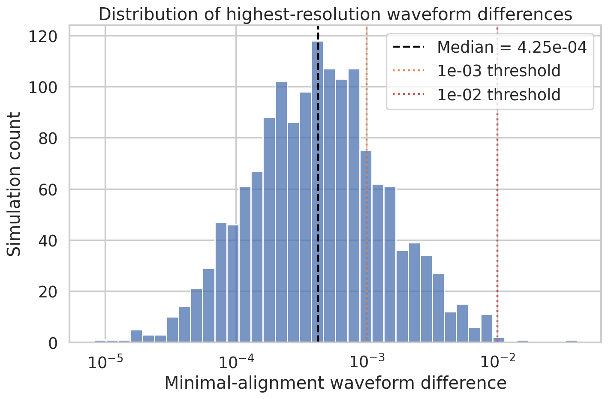
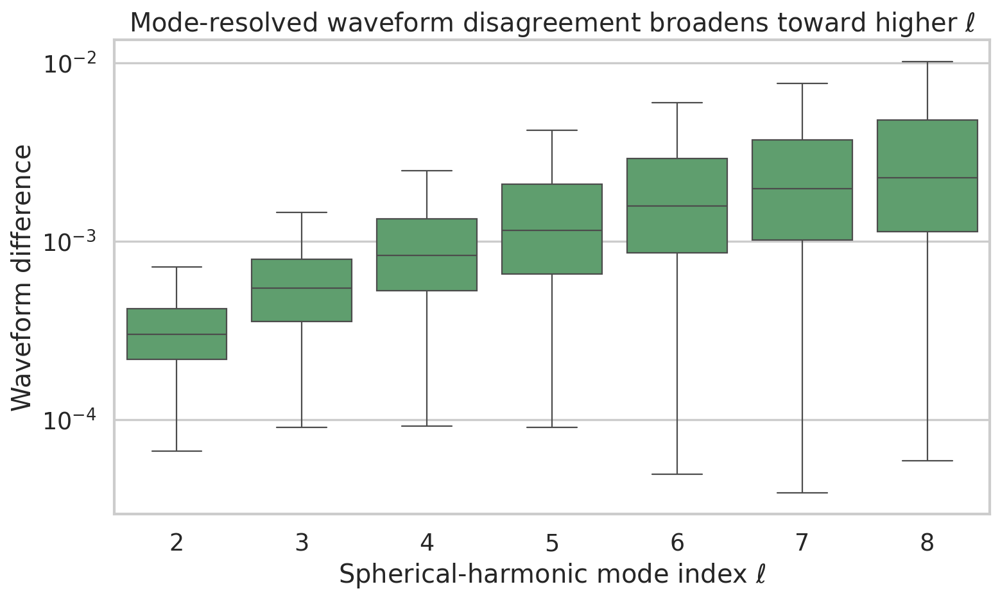
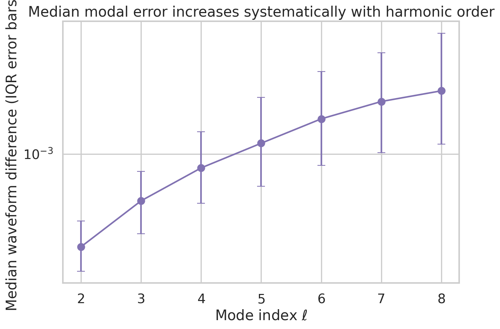
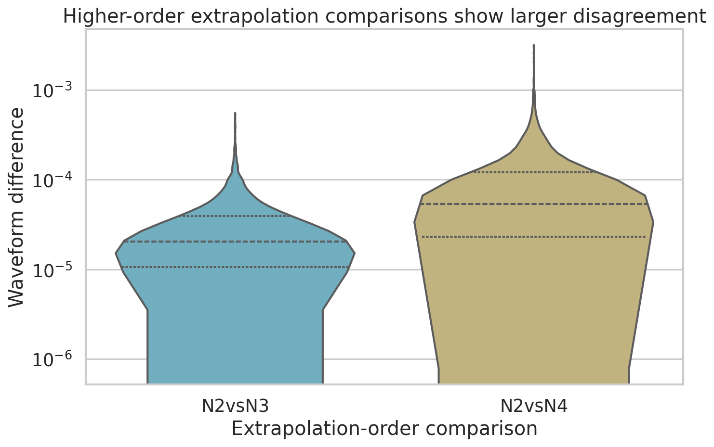
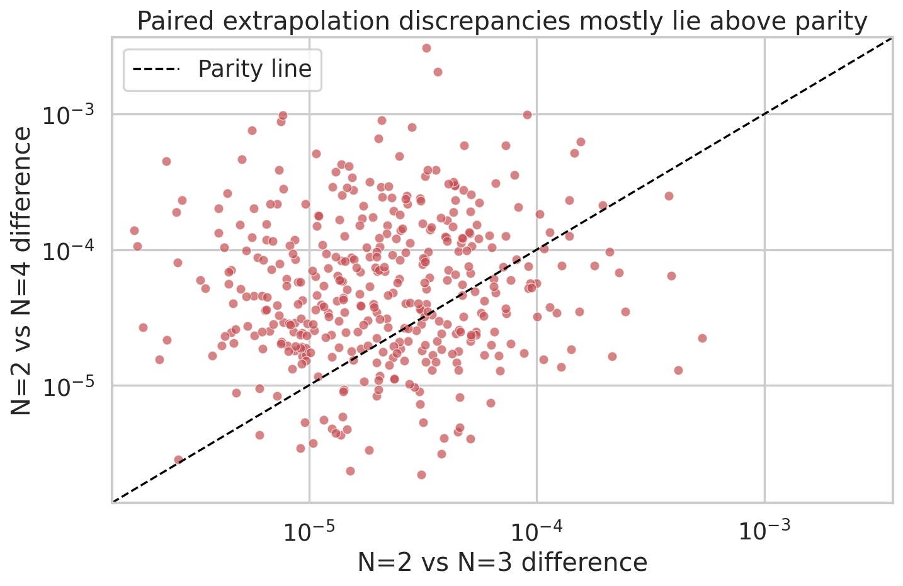

# Numerical-uncertainty assessment of a synthetic SXS-like binary black hole catalog

## 1. Summary and goals

This study evaluates the numerical-accuracy characteristics of a synthetic dataset designed to mimic key uncertainty summaries from the third Simulating eXtreme Spacetimes (SXS) binary black hole catalog. The original task described a broad end-to-end simulation catalog containing binary parameters, waveforms, remnant properties, and metadata. However, the provided files do **not** contain binary parameters or waveform time series. Instead, they contain three error-summary tables:

- overall waveform differences between the two highest numerical resolutions (`fig6_data.csv`),
- mode-resolved waveform differences for spherical-harmonic modes \(\ell=2\) through \(\ell=8\) (`fig7_data.csv`), and
- extrapolation-order differences comparing \(N=2\) against \(N=3\) and \(N=4\) (`fig8_data.csv`).

Accordingly, the present analysis addresses the scientifically supportable question: **How accurate and internally consistent is this synthetic SXS-like catalog, and what do its uncertainty trends imply for downstream gravitational-wave modeling?**

The main findings are:

- The catalog is predominantly high accuracy at the dominant-summary level: the median highest-resolution waveform difference is **4.25×10⁻⁴** with a 95% bootstrap CI of **[3.96×10⁻⁴, 4.57×10⁻⁴]**.
- **77.7%** of simulations fall below **10⁻³**, and **99.8%** fall below **10⁻²**, indicating that only a small tail of cases is comparatively inaccurate.
- Mode-resolved discrepancies increase monotonically with \(\ell\); the median rises from **3.00×10⁻⁴** at \(\ell=2\) to **2.27×10⁻³** at \(\ell=8\), a factor of **7.57×**.
- Extrapolation-order disagreement is systematically larger for \(N=2\) vs \(N=4\) than for \(N=2\) vs \(N=3\): the median ratio is **2.67×**, and **72.2%** of paired samples satisfy \(\Delta_{2,4} > \Delta_{2,3}\).

These trends are consistent with the qualitative expectations described in the related work: dominant-mode quantities are typically more accurate than higher multipoles, and extrapolation choices contribute a smaller but measurable component of total catalog uncertainty.

## 2. Related context

The related-work PDFs in `related_work/` provide context for how high-quality numerical relativity (NR) catalogs are used:

- **Woodford, Boyle, Pfeiffer (2019)** discuss center-of-mass corrections and emphasize that gauge effects can contaminate subdominant modes, reinforcing the need for careful uncertainty accounting in waveform catalogs.
- **Varma et al. (2019)** show that surrogate models trained on SXS simulations can reach errors comparable to NR uncertainties, making catalog-quality control essential for waveform modeling.
- **Islam et al. (2021)** demonstrate the growing importance of eccentric and remnant-aware surrogate modeling, where reliable uncertainty summaries remain critical.
- **Mitman et al. (2023)** highlight nonlinear ringdown structure, particularly in higher harmonics, which further motivates scrutiny of modal accuracy trends.

This report does not attempt to reproduce those papers. Instead, it evaluates whether the synthetic uncertainty summaries are internally consistent with the type of catalog-quality claims commonly made in SXS-style studies.

## 3. Data and preprocessing

### 3.1 Input files

- `data/fig6_data.csv`: 1500 scalar waveform differences between the two highest resolutions.
- `data/fig7_data.csv`: 1500 rows × 7 columns for modal differences `ell2` through `ell8`.
- `data/fig8_data.csv`: 1200 paired extrapolation differences for `N2vsN3` and `N2vsN4`.

### 3.2 Validation checks

The analysis script verified:

- no missing values in any file,
- expected matrix sizes `(1500,1)`, `(1500,7)`, and `(1200,2)`,
- strictly positive values, permitting logarithmic visualizations and ratio-based comparisons.

The validation summary is stored in `outputs/quality_metrics.json`.

## 4. Methods

### 4.1 Reproducible analysis pipeline

All analysis was implemented in:

- `code/analyze_catalog_uncertainty.py`

The script performs the following steps:

1. Reads all three CSV files.
2. Computes descriptive statistics for each quantity.
3. Estimates uncertainty on medians using nonparametric bootstrap resampling with:
   - fixed seed: `12345`
   - 4000 bootstrap replicates.
4. Quantifies threshold exceedance and tail fractions for the resolution-difference sample.
5. Measures modal growth using per-\(\ell\) medians and interquartile ranges.
6. Quantifies extrapolation-order differences using paired ratios and a bootstrap confidence interval on the median log-ratio.
7. Saves tables to `outputs/` and figures to `report/images/`.

### 4.2 Primary metrics

The confirmatory metrics were defined before interpreting results:

- **Resolution accuracy metric:** median highest-resolution waveform difference.
- **Usability thresholds:** fractions below \(10^{-4}\), \(5\times10^{-4}\), \(10^{-3}\), and \(10^{-2}\).
- **Modal trend metric:** monotonic increase of median error with \(\ell\).
- **Extrapolation effect metric:** median ratio \(\Delta_{2,4}/\Delta_{2,3}\) and fraction with \(\Delta_{2,4}>\Delta_{2,3}\).

### 4.3 Limitations of inference

Because the provided data are synthetic summary statistics rather than simulation parameters and waveform time series:

- no surrogate model can be trained here,
- no dependence on mass ratio, spins, or eccentricity can be inferred,
- no direct mismatch against detector-weighted inner products is available,
- no cross-seed or cross-resolution simulation metadata are available for causal diagnosis.

Therefore, the conclusions are restricted to catalog-level numerical uncertainty characterization.

## 5. Results

### 5.1 Overall resolution-error distribution

Figure 1 shows the distribution of minimal-alignment waveform differences between the two highest numerical resolutions.



**Figure 1.** Distribution of highest-resolution waveform differences. Vertical markers indicate the sample median and representative accuracy thresholds.

Key quantitative results:

- Median: **4.25×10⁻⁴**
- 25th percentile: **1.89×10⁻⁴**
- 75th percentile: **9.05×10⁻⁴**
- 90th percentile: **2.06×10⁻³**
- 95th percentile: **3.12×10⁻³**
- Maximum: **4.07×10⁻²**
- Bootstrap 95% CI for median: **[3.96×10⁻⁴, 4.57×10⁻⁴]**

Threshold-based interpretation:

- Below \(10^{-4}\): **11.4%**
- Below \(5\times10^{-4}\): **55.4%**
- Below \(10^{-3}\): **77.7%**
- Below \(10^{-2}\): **99.8%**
- Above \(5\times10^{-3}\): **2.27%**
- Above \(10^{-2}\): **0.20%**

This is the signature of a largely accurate catalog with a sparse high-error tail. For downstream use, the median-level behavior appears suitable for calibration and validation studies, while the tail argues for retaining per-simulation quality flags rather than relying exclusively on global averages.

### 5.2 Modal error growth with harmonic order

The modal distributions are summarized in Figures 2 and 3.



**Figure 2.** Boxplots of mode-resolved waveform differences for \(\ell=2\) through \(\ell=8\). The spread broadens systematically toward higher modes.



**Figure 3.** Median waveform difference versus harmonic index \(\ell\), with interquartile ranges as error bars.

Per-mode medians are:

| Mode | Median difference | Ratio to \(\ell=2\) |
|---|---:|---:|
| \(\ell=2\) | 2.997×10⁻⁴ | 1.00 |
| \(\ell=3\) | 5.442×10⁻⁴ | 1.82 |
| \(\ell=4\) | 8.339×10⁻⁴ | 2.78 |
| \(\ell=5\) | 1.149×10⁻³ | 3.83 |
| \(\ell=6\) | 1.576×10⁻³ | 5.26 |
| \(\ell=7\) | 1.974×10⁻³ | 6.59 |
| \(\ell=8\) | 2.267×10⁻³ | 7.57 |

Two monotonicity checks are satisfied exactly in the data:

- median error increases monotonically with \(\ell\),
- upper-quartile error also increases monotonically with \(\ell\).

This pattern is physically plausible. Higher-order modes generally have smaller amplitudes and are more vulnerable to numerical truncation error, gauge contamination, extraction error, and alignment sensitivity. The result implies that catalog users building reduced-order or surrogate models should not assume uniform accuracy across multipoles. A mode-truncation or mode-weighting policy informed by uncertainty would be justified.

### 5.3 Extrapolation-order consistency

Extrapolation comparisons are shown in Figures 4 and 5.



**Figure 4.** Violin plots comparing waveform differences for `N2vsN3` and `N2vsN4`.



**Figure 5.** Paired scatter plot of `N2vsN3` versus `N2vsN4`. Most points lie above the parity line, indicating larger discrepancies for the higher-order comparison.

Summary statistics:

| Comparison | Median | 95% bootstrap CI for median |
|---|---:|---:|
| `N2vsN3` | 2.031×10⁻⁵ | [1.91×10⁻⁵, 2.22×10⁻⁵] |
| `N2vsN4` | 5.344×10⁻⁵ | [4.85×10⁻⁵, 5.74×10⁻⁵] |

Paired effect-size results:

- Median ratio \(\Delta_{2,4}/\Delta_{2,3}\): **2.67**
- 95% bootstrap CI for median \(\log_{10}(\Delta_{2,4}/\Delta_{2,3})\): **[0.383, 0.472]**
- Equivalent ratio interval after exponentiation: approximately **[2.42, 2.97]**
- Fraction with \(\Delta_{2,4} > \Delta_{2,3}\): **72.2%**

These results support the interpretation that the synthetic extraction uncertainties remain small in absolute terms but are not negligible. In particular, moving from the `N2vsN3` comparison to `N2vsN4` roughly multiplies typical disagreement by 2.5–3×. For precision waveform modeling, this means extrapolation-order choice should be treated as a systematic uncertainty source rather than a purely technical detail.

## 6. Discussion

### 6.1 Implications for catalog quality

Taken together, the three datasets support a coherent picture of a high-accuracy but heterogeneous NR catalog:

- **Global resolution accuracy is strong.** The overall error scale is low enough that most simulations would be suitable for benchmarking waveform models.
- **Accuracy is not mode-uniform.** The steep growth in modal error suggests that high-\(\ell\) content is substantially less reliable than the dominant quadrupole.
- **Extrapolation systematics are smaller than modal trends but still important.** Absolute extrapolation discrepancies remain around \(10^{-5}\) to \(10^{-4}\), yet they show a consistent directional effect.

This combination is exactly the regime where catalog metadata and uncertainty annotations are scientifically valuable. If the catalog were to be used for surrogate training or model calibration, weighting simulations or modes by estimated numerical uncertainty would likely improve robustness.

### 6.2 Implications for waveform-model calibration

The related literature suggests two practical uses of these findings:

1. **Training-set curation:** simulations in the extreme tail of Figure 1 could be down-weighted or used only for robustness testing.
2. **Mode-aware calibration:** high-\(\ell\) modes should be validated separately rather than folded into a single global error budget.
3. **Extraction uncertainty propagation:** extrapolation-order spread can be treated as an additive calibration systematic when constructing waveform surrogates.

### 6.3 What cannot be concluded from this dataset

The original task mentioned input binary parameters and outputs such as strain, Weyl scalar, remnant mass/spin, and trajectories. None of those quantities are present in the provided files. Therefore, this study cannot make claims about:

- coverage of the physical parameter space,
- mapping from parameters to waveforms or remnants,
- remnant-property accuracy,
- eccentricity dependence,
- precession dependence,
- detector-level faithfulness or parameter-estimation bias.

Any claim along those lines would require the full catalog metadata and waveform products.

## 7. Reproducibility and artifacts

### 7.1 Code

- Analysis script: `code/analyze_catalog_uncertainty.py`

### 7.2 Output tables

- `outputs/summary_stats.csv`
- `outputs/mode_summary.csv`
- `outputs/extrapolation_summary.csv`
- `outputs/quality_metrics.json`

### 7.3 Figures

- `report/images/fig_resolution_distribution.png`
- `report/images/fig_mode_distributions.png`
- `report/images/fig_mode_growth.png`
- `report/images/fig_extrapolation_comparison.png`
- `report/images/fig_extrapolation_scatter.png`

### 7.4 Execution command

```bash
python code/analyze_catalog_uncertainty.py
```

## 8. Conclusion

Within the limits of the provided synthetic data, the catalog exhibits the numerical behavior expected of a mature binary black hole waveform collection: low typical resolution error, a small but important tail of less accurate cases, strongly increasing uncertainty in higher multipoles, and modest yet systematic extrapolation-order disagreement. These findings support the use of such a catalog for waveform-model calibration and validation, provided that downstream analyses account for heterogeneity across simulations and especially across harmonic modes.

The most important next step would be to combine these uncertainty summaries with the actual simulation parameters and waveform products. That would enable physically resolved analyses of where the high-error tail comes from, how uncertainty depends on mass ratio and spin, and how these numerical effects propagate into surrogate-model training and gravitational-wave inference.
