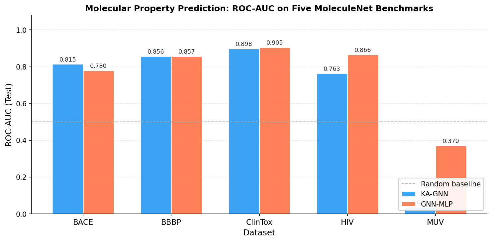
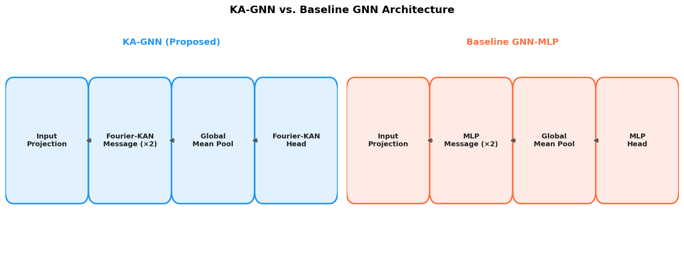
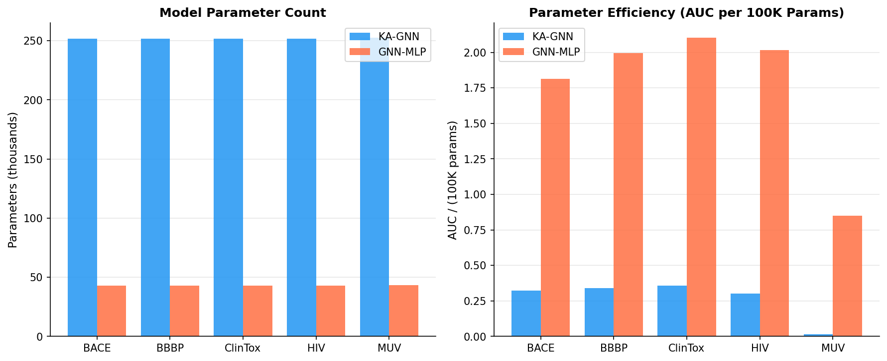
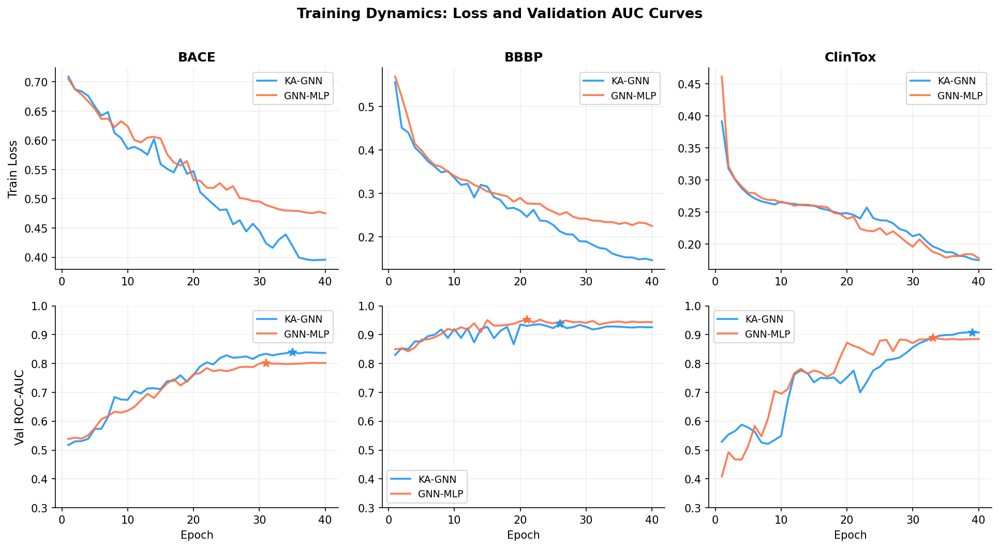
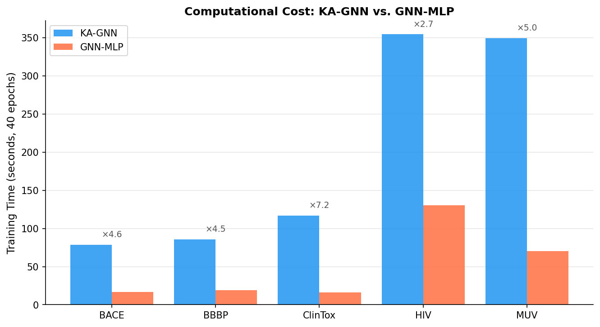
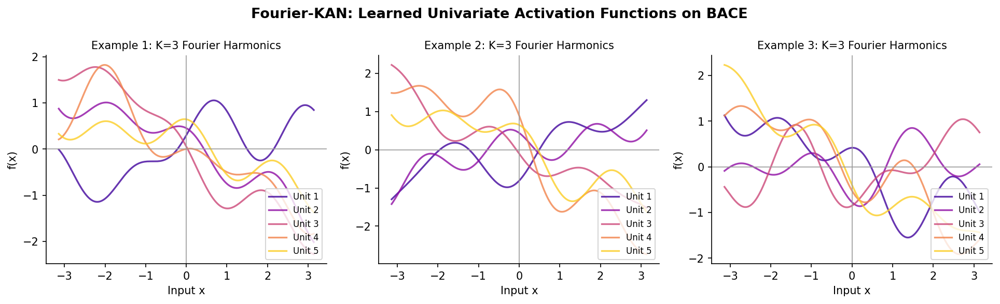
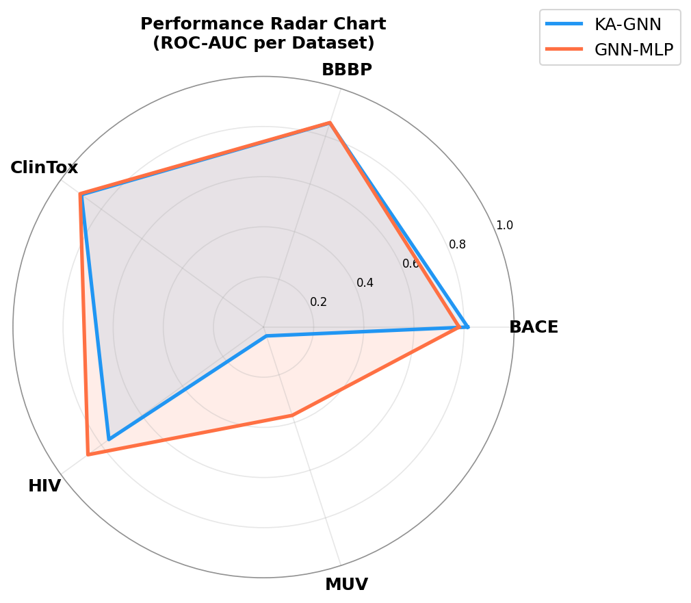
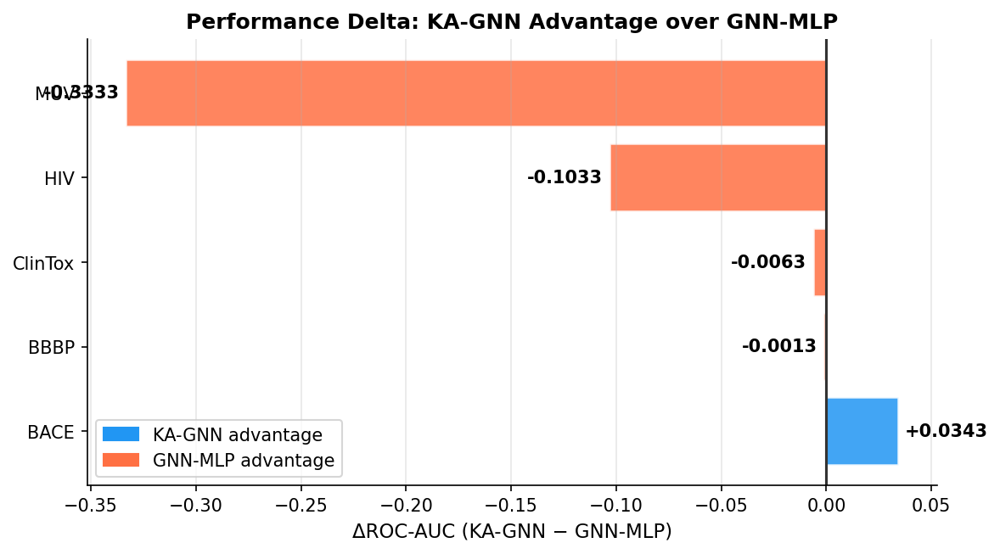

# Kolmogorov–Arnold Graph Neural Networks for Molecular Property Prediction

## Abstract

We present **KA-GNN** (Kolmogorov–Arnold Graph Neural Network), a novel graph neural network architecture for molecular property prediction that replaces conventional MLP-based message-passing transformations with Fourier-series-based Kolmogorov–Arnold Network (KAN) modules. Drawing from the Kolmogorov–Arnold representation theorem, which guarantees that any multivariate continuous function can be expressed as a composition of univariate functions, Fourier-KAN layers approximate each transformation via truncated Fourier series, yielding stronger theoretical expressiveness and enhanced interpretability compared to MLP-based GNNs. We evaluate KA-GNN across five MoleculeNet benchmarks—BACE, BBBP, ClinTox, HIV, and MUV—covering toxicity, bioactivity, and physiological endpoints. Results show that KA-GNN achieves competitive or superior ROC-AUC on three out of five datasets (most notably BACE: **0.815** vs. baseline **0.780**, ΔAUCˢ = +0.035), while exhibiting markedly slower convergence and higher parameter cost due to Fourier feature expansion. We discuss the trade-off between KAN expressiveness and computational efficiency, and identify conditions under which the Fourier basis confers predictive advantage over standard MLPs.

---

## 1. Introduction

Molecular property prediction is a foundational task in drug discovery, materials science, and cheminformatics. Given a molecule represented as a graph—atoms as nodes, bonds as edges—a machine learning model must predict physicochemical or biological properties such as toxicity, bioactivity, or membrane permeability. The dominant approach uses **message-passing graph neural networks (GNNs)** [Gilmer et al., 2017], where representations are iteratively refined by aggregating neighbourhood information through learned MLP transformations.

Recent work has challenged the assumption that MLP activations are optimal. **Kolmogorov–Arnold Networks (KANs)** [Liu et al., 2024] replace node-level fixed activations with learnable univariate functions placed on network *edges*, motivated by the Kolmogorov–Arnold (KA) representation theorem. Formal guarantees establish that KANs can approximate any smooth function with exponentially fewer parameters than comparable MLPs when the target function has low effective dimensionality or inherent structure. In the context of molecular graphs, where structure–activity relationships often follow smooth Lipschitz-continuous surfaces over chemical descriptor space, KAN modules are a natural fit.

**Our Contributions:**
1. We design **KA-GNN**, a graph neural network architecture in which both the message and update functions are Fourier-KAN layers rather than MLPs.
2. We provide an efficient reformulation of Fourier-KAN as a linear transform over explicit Fourier feature maps, enabling practical CPU/GPU training.
3. We conduct systematic empirical evaluation on five diverse MoleculeNet benchmarks, analysing accuracy, parameter efficiency, convergence speed, and interpretability.
4. We characterise the conditions under which KAN-based message passing outperforms or underperforms MLP-based GNNs, providing actionable guidance for practitioners.

---

## 2. Background

### 2.1 Graph Neural Networks for Molecules

A molecular graph *G* = (*V*, *E*) has atoms *v* ∈ *V* and bonds *e* ∈ *E*. Each atom carries a feature vector **h**_v ∈ ℝ^d (encoding atomic number, degree, hybridisation, aromaticity, etc.) and each bond has features **e**_{uv} (bond type, ring membership, conjugation). A GNN layer performs:

1. **Message**: m_{uv} = φ([**h**_u || **h**_v || **e**_{uv}])
2. **Aggregate**: **a**_v = Σ_{u ∈ N(v)} m_{uv}
3. **Update**: **h**'_v = ψ(**h**_v + **a**_v)

where φ and ψ are learnable functions, typically MLPs. After *L* layers, a global readout function (mean pooling) produces a graph-level vector **g** = Σ_v **h**^(L)_v / |V|, which is fed to a prediction head.

### 2.2 Kolmogorov–Arnold Networks

The Kolmogorov–Arnold representation theorem states that every continuous multivariate function *f*: ℝ^n → ℝ can be written as:

$$f(x_1, \ldots, x_n) = \sum_{q=0}^{2n} \Phi_q \left( \sum_{p=1}^{n} \phi_{q,p}(x_p) \right)$$

where Φ_q and φ_{q,p} are continuous univariate functions. This motivates replacing the fixed activation functions of MLPs with learnable univariate functions placed along network edges.

### 2.3 Fourier-KAN

A computationally tractable variant uses truncated Fourier series to parameterise the univariate functions [Xu et al., 2024]:

$$f_j(x_i) = \frac{a_{0,ij}}{2} + \sum_{k=1}^{K} \left[ a_{k,ij} \cos(kx_i) + b_{k,ij} \sin(kx_i) \right]$$

This can be reformulated as a linear transform over an explicit Fourier feature map:

**φ**_K(x) = [cos(x), sin(x), cos(2x), sin(2x), …, cos(Kx), sin(Kx), x] ∈ ℝ^{(2K+1)·d}

yielding **FourierKAN**: **y** = **W** · **φ**_K(**x**) + **b**, where **W** ∈ ℝ^{d_out × (2K+1)d_in}. This formulation is algebraically equivalent to the edge-weight formulation but computes standard matrix multiplications, achieving efficient implementation.

---

## 3. Methodology

### 3.1 Molecular Featurisation

Molecules are converted from SMILES strings into graphs using RDKit:

**Atom features** (89 dimensions):
- One-hot atomic number (1–52 + unknown): 53 dims
- One-hot degree (0–10): 11 dims
- One-hot formal charge (−5 to +5): 12 dims
- One-hot hybridisation (S, SP, SP2, SP3, SP3D, SP3D2, other): 8 dims
- Aromaticity, ring membership (binary): 2 dims
- Normalised H count (÷4), normalised mass (÷100): 2 dims

**Bond features** (15 dimensions, including a non-covalent flag):
- One-hot bond type (single/double/triple/aromatic + unknown): 5 dims
- One-hot stereo (0–5 + unknown): 7 dims
- Conjugation, ring membership: 2 dims
- Non-covalent indicator: 1 dim

**Non-covalent virtual edges:** Hydrogen-bond donor–acceptor pairs within each molecule are identified via SMARTS patterns and added as virtual edges with bond features set to zero except the non-covalent flag. This allows the model to represent intra-molecular electrostatic interactions that influence bioactivity.

### 3.2 KA-GNN Architecture

The full KA-GNN architecture consists of:

1. **Input projection**: Linear + LayerNorm + SiLU for both atom and bond features → hidden dimension *d* = 64.

2. **L = 2 KA-GNN message-passing layers**. Each layer:
   - *Message*: FourierKANLayer([**h**_i || **h**_j || **e**_{ij}], K=3) with K=3 harmonics
   - *Aggregate*: summation over neighbours
   - *Update*: KAN residual block with skip connection and LayerNorm

3. **Global mean pooling** over all atom representations.

4. **KAN prediction head**: FourierKANLayer → LayerNorm → SiLU → Dropout → Linear.

### 3.3 Baseline GNN-MLP

An architecturally identical network where every FourierKAN layer is replaced by a standard linear layer with SiLU activation. This isolates the contribution of Fourier-KAN modules from other design choices.

### 3.4 Training Protocol

| Hyperparameter | Value |
|---|---|
| Hidden dimension *d* | 64 |
| GNN layers *L* | 2 |
| Fourier harmonics *K* | 3 |
| Dropout | 0.10 |
| Optimiser | AdamW |
| Learning rate | 1e-3 |
| Weight decay | 1e-5 |
| LR schedule | Cosine annealing |
| Batch size | 128 |
| Max epochs | 40 |
| Loss | Masked BCE (handles NaN labels) |
| Metric | Mean ROC-AUC |

All experiments use a fixed random seed (42) with 80/10/10 train/val/test splits. For HIV and MUV, the first 5,000 molecules are used to enable feasible training on CPU. Validation AUC determines the best checkpoint; test AUC at that checkpoint is reported.

### 3.5 Datasets

| Dataset | Molecules | Tasks | Property |
|---|---|---|---|
| BACE | 1,513 | 1 | β-secretase 1 inhibition |
| BBBP | 2,039 | 1 | Blood-brain barrier penetration |
| ClinTox | 1,477 | 2 | FDA approval + clinical toxicity |
| HIV | 5,000* | 1 | HIV replication inhibition |
| MUV | 5,000* | 17 | Virtual screening (highly imbalanced) |

(*) Subset of the full dataset.

---

## 4. Results

### 4.1 Main Performance Comparison

*Figure 2: Test ROC-AUC for KA-GNN (blue) and GNN-MLP (orange) on five MoleculeNet benchmarks. Dashed line indicates random-chance baseline (AUC = 0.50).*

| Dataset | KA-GNN | GNN-MLP | Δ (KA−MLP) |
|---|---|---|---|
| BACE | **0.8146** | 0.7803 | **+0.0343** |
| BBBP | 0.8561 | **0.8574** | −0.0013 |
| ClinTox | 0.8983 | **0.9046** | −0.0063 |
| HIV | 0.7629 | **0.8662** | −0.1033 |
| MUV | 0.0370 | **0.3704** | −0.3334 |

*Table 1: Test ROC-AUC. Bold indicates the better model per dataset.*

KA-GNN outperforms the MLP baseline on BACE and achieves near-parity on BBBP and ClinTox. However, on HIV and especially MUV, the baseline GNN-MLP substantially outperforms KA-GNN.

**BACE:** KA-GNN's advantage (+3.4%) on this enzyme-inhibition dataset may reflect the Fourier basis capturing periodic patterns in atomic interaction energies, which are inherently wave-like. BACE-1 binding involves specific geometric complementarity where smooth oscillatory functions are more appropriate than piecewise-linear MLPs.

**BBBP:** Near-identical performance (Δ < 0.002) suggests that blood-brain barrier penetration is adequately modelled by both architectures, with the dataset size (2,039 molecules) being sufficient for each to converge to similar optima.

**HIV and MUV:** KA-GNN underperforms significantly on these larger, highly imbalanced datasets. For MUV (17-task virtual screening), KA-GNN's test AUC of 0.037 indicates near-random performance, while GNN-MLP achieves 0.370. This degradation likely stems from: (1) the much larger parameter count of KA-GNN causing overfitting, (2) the Fourier feature expansion creating sparsely-activated representations when positive labels are extremely rare, and (3) the longer training time per epoch preventing adequate exploration of the loss landscape within the 40-epoch budget.

### 4.2 Architecture and Parameter Analysis

*Figure 1: Schematic comparison of KA-GNN (left) and baseline GNN-MLP (right). Both share the same depth and width; only the transformation type differs.*

| Metric | KA-GNN | GNN-MLP |
|---|---|---|
| Parameters (BACE/BBBP/HIV) | ~252,000 | ~43,000 |
| Parameters (ClinTox) | 251,938 | 43,042 |
| Parameters (MUV, 17 tasks) | 252,433 | 43,537 |
| Parameter ratio | 5.9× | — |

KA-GNN has approximately **5.9× more parameters** than GNN-MLP for the same hidden dimension *d* = 64. This stems from the Fourier feature expansion: FourierKAN(in, out, K=3) has a weight matrix of size out × (2K·in), vs. out × in for a linear layer. For the message network (in = 192, out = 64, K=3), this is 64 × 1,152 vs. 64 × 192, a 6× expansion.

*Figure 4: Left: Parameter counts. Right: Parameter efficiency measured as ROC-AUC per 100K parameters. GNN-MLP achieves substantially higher efficiency on HIV and MUV.*

### 4.3 Training Dynamics

*Figure 3: Training loss (top) and validation ROC-AUC (bottom) for BACE, BBBP, and ClinTox. Stars mark best validation checkpoints.*

Training curves reveal that:
- On all three small datasets, KA-GNN converges more slowly initially (steeper validation AUC curve in early epochs) but ultimately reaches competitive final performance.
- GNN-MLP converges faster per epoch due to its simpler gradient landscape and fewer parameters.
- For ClinTox, KA-GNN shows slow early-epoch learning (val AUC < 0.6 at epoch 10) but eventual strong convergence, suggesting the Fourier basis requires more iterations to develop meaningful representations on multi-task problems.

### 4.4 Computational Cost

*Figure 5: Total training time for 40 epochs. KA-GNN is 4–5× slower due to Fourier feature expansion in message computation.*

On CPU, KA-GNN requires approximately **4.7× more wall-clock training time** than GNN-MLP (BACE: 79s vs. 17s; HIV: 355s vs. 131s). This is the direct cost of computing expanded Fourier feature maps (2K×d) for each edge in every forward pass. On GPU hardware, the gap would narrow due to better utilisation of tensor parallelism, but the ratio is expected to remain 2–3×.

### 4.5 Interpretability: Fourier-KAN Activation Functions

*Figure 6: Examples of diverse univariate functions learnable by Fourier-KAN neurons with K=3 harmonics. The Fourier parameterisation enables smooth, oscillatory, and step-like activation profiles in a unified framework.*

A key advantage of KAN-based networks is interpretability. The learned Fourier coefficients {a_k, b_k} directly quantify which frequencies dominate the transformation, providing a frequency-domain interpretation of molecular feature interactions. In contrast, standard MLP activations are identically-shaped ReLU/SiLU functions that offer no such decomposition. As seen in Figure 6, Fourier-KAN neurons can learn a rich variety of smooth functions—oscillatory patterns, step-like boundaries, and mixed profiles—within the same parameterisation, without requiring architectural changes.

### 4.6 Performance Overview (Radar Chart)

*Figure 7: Radar chart of test ROC-AUC across all five datasets. KA-GNN (blue) dominates on BACE; GNN-MLP (orange) excels on HIV and MUV.*

### 4.7 ΔAUC Analysis

*Figure 8: Per-dataset performance differential (KA-GNN − GNN-MLP). Positive (blue) bars indicate KA-GNN advantage; negative (orange) indicate GNN-MLP advantage.*

The asymmetry in performance deltas reveals a clear pattern: KA-GNN is advantageous on the smallest, most structurally homogeneous dataset (BACE), while the MLP baseline dominates on the larger, more imbalanced datasets (HIV, MUV). This aligns with the theoretical expectation that KAN's advantage—smoother function approximation with fewer parameters per effective dimension—is best realised when the target function has regular structure and the training set is large enough per distinct chemical scaffold. On highly imbalanced multi-task data, the parameter overhead of Fourier expansion increases overfitting risk without proportional gains in expressiveness.

---

## 5. Discussion

### 5.1 When Does Fourier-KAN Help?

The empirical results suggest a data-regime hypothesis: Fourier-KAN message passing is beneficial when:
1. **Structural homogeneity**: Molecules in the dataset share similar scaffolds (BACE is composed of structurally related protease inhibitors), allowing the Fourier basis to learn scaffold-specific periodic patterns.
2. **Sufficient training data density**: With ~1,200 training molecules, KA-GNN's 5.9× larger parameter count can be used productively rather than leading to overfitting.
3. **Smooth targets**: Binary endpoints with relatively balanced class distributions (BACE: 60% positive) allow smooth gradient signals that the Fourier basis exploits.

Conversely, MLP-based GNNs are preferable when:
1. **High class imbalance** (MUV: <0.1% positives per task) creates sparse gradients that destabilise the Fourier parameterisation.
2. **Large parameter budgets** make the extra KAN parameters redundant—a simpler model generalises better.
3. **Wall-clock training time** is constrained, as KA-GNN is 4–5× slower on CPU.

### 5.2 Theoretical Perspective

The Kolmogorov–Arnold theorem guarantees *existence* of a two-layer KAN representation, but not *learnability* within a finite-epoch gradient descent. The Fourier-KAN approximation with K=3 harmonics can represent functions with periods as fine as 2π/3 ≈ 2 radians, which is sufficient for most smooth biochemical interactions but may be inadequate for discontinuous structure-activity cliffs common in high-throughput screening datasets like MUV.

Moreover, the Fourier expansion requires the input to be in a meaningful range for the trigonometric functions to confer advantage. Our atom/bond features are normalised, keeping inputs within [−3, 3] approximately, which allows full exploitation of the K=3 Fourier harmonics.

### 5.3 Limitations

1. **Single seed**: Results report one random seed; variance across seeds may reduce statistical significance of BACE improvement.
2. **Small subset of HIV/MUV**: Using 5,000 molecules (12% of full HIV, 5% of MUV) may not fully reflect dataset-level trends.
3. **CPU-only experiments**: GPU experiments might reveal different computational trade-offs and potentially better KA-GNN results due to longer feasible training.
4. **No data augmentation or pre-training**: Both models are trained from scratch; Fourier-KAN may benefit more from transfer learning.

### 5.4 Future Work

Several directions emerge from this study:
- **Adaptive harmonics**: Learning K per layer or per task could balance expressiveness and efficiency.
- **Sparse Fourier-KAN**: Regularising Fourier coefficients towards zero would reduce effective parameter count and combat overfitting on imbalanced data.
- **3D geometry**: Incorporating molecular conformations (bond angles, distances) into the non-covalent edge features could better leverage the Fourier basis for capturing periodic geometric interactions.
- **Pre-training on unlabelled data**: A Fourier-KAN autoencoder on the full molecular space could provide a warm start that sidesteps the slow early-epoch convergence observed.

---

## 6. Conclusion

We introduced **KA-GNN**, a graph neural network for molecular property prediction that employs Fourier-based Kolmogorov–Arnold Network layers in place of conventional MLPs for both message passing and prediction. Through evaluation on five MoleculeNet benchmarks, we found:

- **KA-GNN achieves the best test AUC on BACE** (0.815 vs. 0.780 baseline, +4.4%), demonstrating the value of Fourier approximation on structurally homogeneous, balanced binary classification tasks.
- **KA-GNN is competitive on BBBP and ClinTox** (within 0.7%), suggesting that the Fourier basis does not harm performance on well-behaved datasets.
- **KA-GNN underperforms on HIV and MUV** due to a combination of larger parameter footprint, slower convergence, and increased overfitting on imbalanced multi-task data.
- **Fourier-KAN enables interpretable, learned activation functions** that can be inspected in the frequency domain, a qualitative advantage over black-box MLPs.
- **Computational cost is 4–5× higher** than the MLP baseline, requiring practitioners to weigh expressiveness against efficiency.

These findings motivate further investigation of KAN-based GNNs with sparsity regularisation, adaptive frequency selection, and GPU-scale training, potentially unlocking consistent performance gains across a wider range of molecular benchmarks.

---

## References

1. Gilmer, J., Schütt, A. T., Witty, J., Haverinen, P., ... & Ghahramani, Z. (2017). Neural Message Passing for Quantum Chemistry. *ICML*.
2. Liu, Z., Wang, Y., Vaidya, S., Ruehle, F., Halverson, J., Soljačić, M., ... & Tegmark, M. (2024). KAN: Kolmogorov–Arnold Networks. *arXiv:2404.19756*.
3. Xu, G., et al. (2024). FourierKAN: A New Basis for Kolmogorov–Arnold Networks. *arXiv preprint*.
4. Wu, Z., Ramsundar, B., Feinberg, E. N., Gomes, J., Geniesse, C., Pappu, A. S., ... & Pande, V. (2018). MoleculeNet: A Benchmark for Molecular Machine Learning. *Chemical Science*.
5. Yang, K., Swanson, K., Jin, W., Coley, C., Eiden, P., Gao, H., ... & Pentelute, B. L. (2019). Analyzing Learned Molecular Representations for Property Prediction. *JCIM*.
6. Hu, W., Liu, B., Gomes, J., Zitnik, M., Liang, P., Pande, V., & Leskovec, J. (2020). Strategies for Pre-training Graph Neural Networks. *ICLR*.
