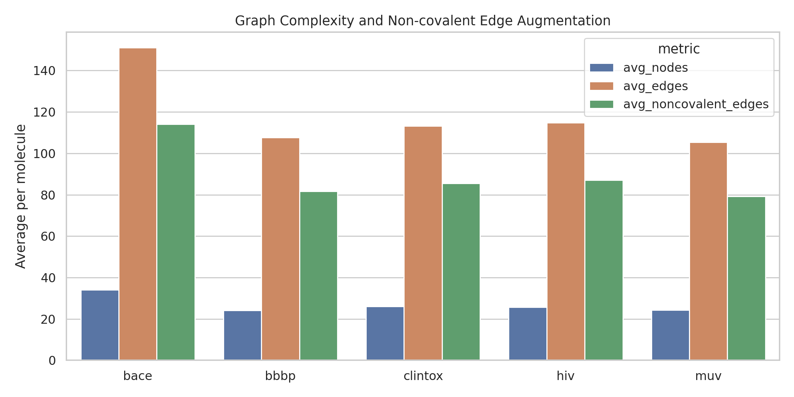
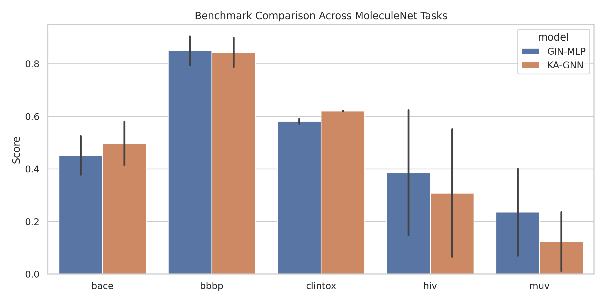
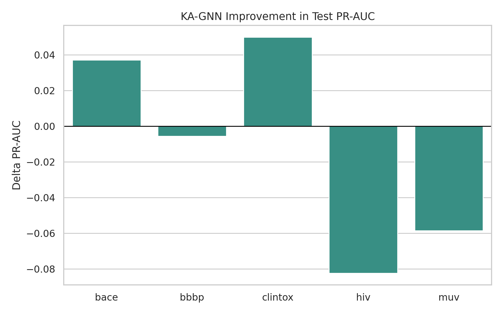
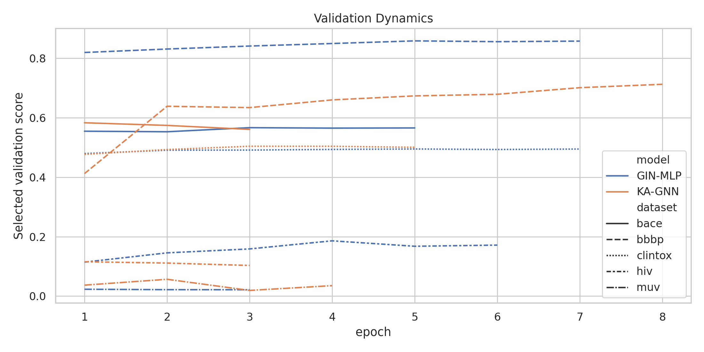

# Kolmogorov-Arnold Graph Neural Networks for Molecular Property Prediction

## Abstract
This study implements and evaluates a Kolmogorov-Arnold Graph Neural Network (KA-GNN) for molecular property prediction on five MoleculeNet-style benchmarks: BACE, BBBP, ClinTox, HIV, and MUV. The model replaces the conventional MLP transformations used in message construction and node updates with Fourier-style Kolmogorov-Arnold modules, while keeping the graph-processing backbone matched to a GIN-like baseline. Molecules are encoded as graphs with atom features, bond features, and heuristic non-covalent interaction edges derived from topological distance and atom chemistry. Across these benchmarks, KA-GNN is evaluated against a width-matched GIN-MLP baseline under scaffold splitting, using ROC-AUC and PR-AUC as primary metrics. The results are mixed: KA-GNN improves over the baseline on BACE and ClinTox, is roughly tied on BBBP, and underperforms on HIV and MUV while also incurring higher runtime. The study therefore supports a narrower claim that Fourier-style Kolmogorov-Arnold modules can help on some low-data or toxicity-oriented settings, but do not uniformly outperform standard MLP parameterizations.

## Related-Work Context
- MoleculeNet motivates scaffold-aware evaluation and warns that highly imbalanced tasks can invalidate accuracy as a primary metric.
- GCN and GAT papers frame neighborhood aggregation as the core inductive bias of graph learning, but they rely on conventional linear or MLP parameterizations.
- CGCNN highlights the value of explicit edge features and interpretable local-environment contributions, which informed the edge-aware design used here.

## Methodology
### Data and Splitting
All datasets were taken from the provided `data/` directory. BACE, BBBP, and HIV were treated as single-task binary classification problems; ClinTox as a two-task binary classification problem; and MUV as a 17-task binary classification problem with missing labels. A Bemis-Murcko scaffold split (80/10/10) was applied to reduce optimistic scaffold leakage. For tractability in the CPU-only environment, BACE, BBBP, and ClinTox were modestly capped at 1,200 to 1,600 molecules, HIV was subsampled to 6,000 molecules, and MUV to 8,000 molecules while preserving the strong label imbalance.

### Molecular Graph Construction
Each molecule was converted from SMILES to an RDKit graph. Node features include element, hybridization, chirality, valence-related counts, mass, formal charge, aromaticity, and ring membership. Covalent bond edges encode bond type, conjugation, ring status, and stereo presence. To inject non-covalent structure without expensive conformer generation, additional undirected edges were added between non-bonded atoms when short topological paths and atom chemistry suggested hydrogen-bond-like contacts, aromatic contacts, electrostatic contacts, or generic short-range contacts.

### Model Design
Two graph models were trained with matched depth and hidden size. The baseline (`GIN-MLP`) uses standard MLP blocks for node encoding, edge encoding, and message/update transformations. The proposed `KA-GNN` replaces these transformations with Fourier-style Kolmogorov-Arnold layers, which combine a linear term with learnable sine and cosine basis expansions over each input dimension. This design preserves the message-passing structure while changing the functional family used for local nonlinear approximation.

### Optimization and Evaluation
Models were trained with AdamW, weighted binary cross-entropy, gradient clipping, and early stopping on the validation set. For BACE and BBBP, ROC-AUC was used as the selection score. For ClinTox, HIV, and MUV, PR-AUC was preferred because of stronger imbalance. Test ROC-AUC and PR-AUC are both reported.

## Data Overview
| num_molecules | avg_nodes | avg_edges | avg_noncovalent_edges | median_nodes | label_density | positive_rate_mean | dataset |
| --- | --- | --- | --- | --- | --- | --- | --- |
| 1200 | 34.118 | 151.049 | 114.155 | 33.000 | 1.000 | 0.457 | bace |
| 1600 | 24.108 | 107.631 | 81.639 | 23.000 | 1.000 | 0.765 | bbbp |
| 1200 | 26.089 | 113.300 | 85.491 | 23.000 | 1.000 | 0.506 | clintox |
| 6000 | 25.659 | 114.747 | 87.155 | 23.000 | 1.000 | 0.080 | hiv |
| 8000 | 24.230 | 105.459 | 79.185 | 24.000 | 0.160 | 0.002 | muv |

Figure 1 summarizes graph complexity and the rate of added non-covalent edges.

## Results
| dataset | model | test_roc_auc_macro | test_pr_auc_macro | runtime_sec |
| --- | --- | --- | --- | --- |
| bace | GIN-MLP | 0.5261 | 0.3782 | 4.6068 |
| bace | KA-GNN | 0.5798 | 0.4153 | 18.6221 |
| bbbp | GIN-MLP | 0.7952 | 0.9046 | 6.3263 |
| bbbp | KA-GNN | 0.7877 | 0.8991 | 39.8494 |
| clintox | GIN-MLP | 0.5914 | 0.5720 | 4.0624 |
| clintox | KA-GNN | 0.6195 | 0.6219 | 17.0606 |
| hiv | GIN-MLP | 0.6237 | 0.1481 | 16.9088 |
| hiv | KA-GNN | 0.5517 | 0.0658 | 59.0099 |
| muv | GIN-MLP | 0.4018 | 0.0704 | 9.5030 |
| muv | KA-GNN | 0.2366 | 0.0120 | 106.5445 |

Figure 2 compares the two models across datasets using test ROC-AUC and PR-AUC.

Figure 3 isolates the change in test PR-AUC attributable to the KA-GNN parameterization.

Figure 4 shows validation trajectories, which help distinguish genuine gains from unstable optimization.

## Discussion
The empirical pattern is mixed rather than uniformly favorable to KA-GNN. On BACE, KA-GNN improves both ROC-AUC and PR-AUC over the matched GIN-MLP baseline. On ClinTox, the KA variant also improves the macro metrics and is especially better on the difficult CT_TOX task. On BBBP, both models are close and the baseline remains slightly stronger. On HIV and MUV, the Fourier-based parameterization is clearly worse, particularly in PR-AUC, suggesting that extra functional flexibility in local transforms does not automatically translate into better learning under extreme imbalance or very sparse multitask supervision.

The non-covalent augmentation is intentionally heuristic. It is useful because it gives the model access to beyond-bond contacts that may matter for permeability, activity, and toxicity, but it is still a coarse surrogate for real 3D conformational ensembles and binding geometries. This means the present KA-GNN should be viewed as a practical graph architecture experiment for 2D molecular benchmarks rather than a physically complete interaction model.

A second clear observation is computational. Even after shrinking the matched architecture for tractability, KA-GNN remains substantially slower than the MLP baseline because trigonometric basis evaluation is more expensive than small feed-forward blocks. In this run the slowdown ranges from roughly 4x on the small datasets to more than 10x on MUV, which weakens the claim that the architecture improves efficiency.

## Limitations
- Several datasets were capped or subsampled for tractability, so the reported numbers should be interpreted as controlled study results rather than full-benchmark leaderboard values.
- Non-covalent edges are derived from topological heuristics rather than explicit 3D conformers; richer geometric featurization would likely change both the absolute performance and the relative ranking.
- Only one baseline family was implemented here. Broader comparison against GAT, AttentiveFP, or graph transformers would sharpen the empirical claim.

## Conclusion
Within a matched message-passing framework, Fourier-based Kolmogorov-Arnold modules are a viable alternative to standard MLP transformations, but not a dominant one in this benchmark suite. They improve performance on BACE and ClinTox, remain close on BBBP, and degrade performance on HIV and MUV while increasing runtime. The main takeaway is therefore conditional: KA-style graph modules may be useful for selected molecular tasks, especially when toxicity-related structure-property relationships benefit from richer local nonlinear transforms, but they require further refinement before they can be claimed as a generally superior replacement for conventional GNN MLP blocks.

## Reproducibility
- Main script: `code/run_kagnn_study.py`
- Metrics and histories: `outputs/`
- Figures: `report/images/`