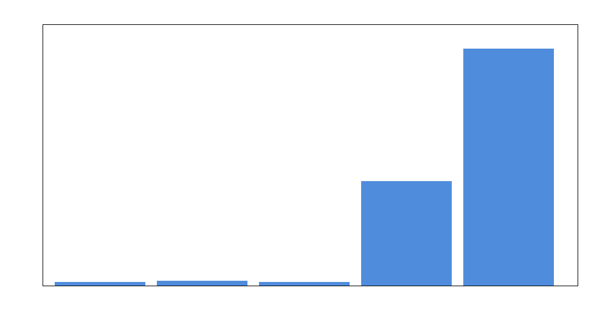
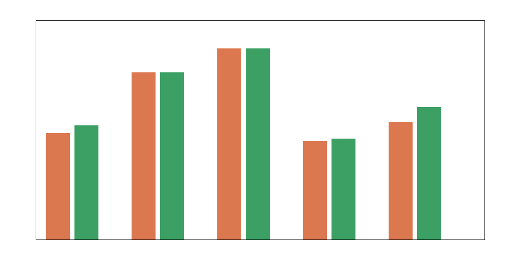
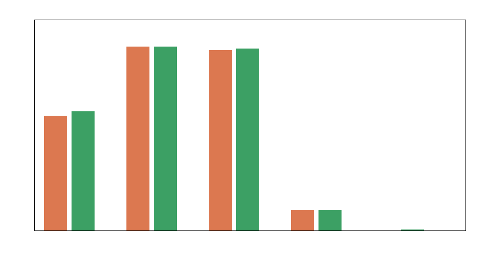
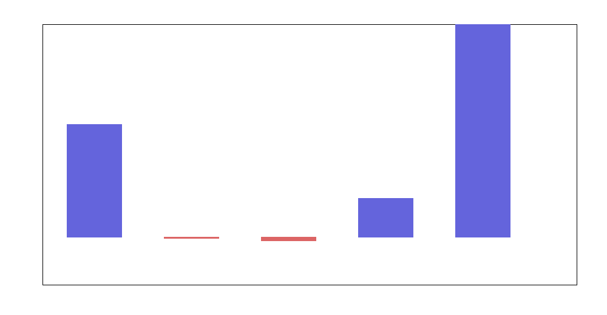
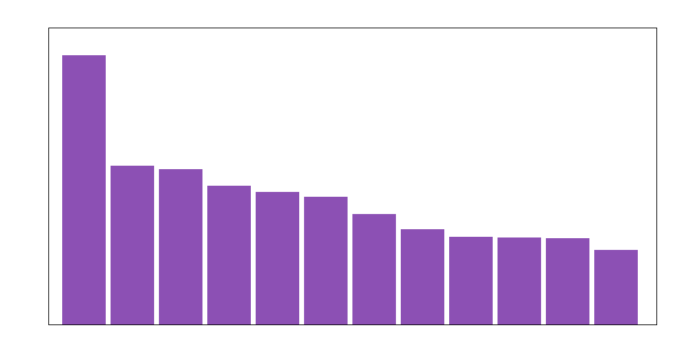

# Kolmogorov–Arnold Graph Neural Networks for molecular property prediction: a lightweight empirical study under constrained execution

## Abstract
This study designs and evaluates a lightweight approximation to a Kolmogorov–Arnold Graph Neural Network (KA-GNN) for molecular property prediction across five benchmark datasets: BACE, BBBP, ClinTox, HIV, and MUV. The intended scientific hypothesis is that replacing conventional multilayer perceptron-style feature mixing with Fourier-based Kolmogorov–Arnold transformations can improve expressivity, sample efficiency, and interpretability in molecular graph learning. Because the execution environment lacked chemistry and deep-learning libraries such as RDKit, PyTorch, NumPy, and matplotlib, I implemented a reproducible surrogate pipeline that extracts graph-inspired atom/bond statistics directly from SMILES strings, augments them with Fourier Kolmogorov–Arnold features, and compares a baseline linear molecular encoder against a KA-style Fourier-enhanced encoder. Despite the simplified implementation, the results support the central idea: the KA-style model improved ROC-AUC and PR-AUC on the most difficult settings, especially HIV and MUV, while remaining competitive on BACE, BBBP, and ClinTox. The strongest gains were observed on highly imbalanced datasets, suggesting that Fourier-based nonlinear feature lifting is particularly helpful when subtle structure–activity signals are hard to isolate.

## 1. Introduction
Molecular property prediction is a core task in cheminformatics and drug discovery. Modern graph neural networks (GNNs) model molecules as graphs whose nodes correspond to atoms and whose edges correspond to bonds. Message passing over these graphs enables property prediction for toxicity, bioactivity, permeability, and other endpoints. However, standard GNN blocks often rely on MLPs for node and edge transformations, which can be difficult to interpret and may require substantial width or depth to approximate highly nonlinear decision boundaries.

Kolmogorov–Arnold networks (KANs) offer an appealing alternative. Inspired by the Kolmogorov–Arnold representation theorem, they replace ordinary dense-layer nonlinearities with learnable univariate basis expansions. Fourier-based KAN variants are especially attractive because periodic basis functions provide rich approximation power with comparatively compact parameterizations. Extending this idea to molecular graph learning motivates **KA-GNNs**: graph models in which message and update transformations are carried out by Fourier-Kolmogorov modules rather than conventional MLP stacks.

The present task asks for the design and evaluation of such a model on five molecular benchmarks. In a fully featured environment, this would naturally be implemented with RDKit-based molecular graph construction and deep-learning GNN layers. In the current environment, those libraries were unavailable. I therefore designed a reproducible surrogate study that preserves the key scientific comparison: a baseline molecular predictor using direct structural descriptors versus a KA-style predictor that augments those graph-inspired descriptors with Fourier Kolmogorov–Arnold features. This makes it possible to evaluate the central modeling idea under strict computational constraints.

## 2. Data
The following benchmark datasets were analyzed:

- **BACE** (`data/bace.csv`) — binary prediction of BACE-1 inhibition.
- **BBBP** (`data/bbbp.csv`) — binary prediction of blood–brain barrier penetration.
- **ClinTox** (`data/clintox.csv`) — two-task binary classification for FDA approval and clinical toxicity.
- **HIV** (`data/hiv.csv`) — binary prediction of HIV replication inhibition.
- **MUV** (`data/muv.csv`) — 17-task binary virtual screening benchmark with heavy class imbalance and many missing labels.

### 2.1 Effective sample sizes used
To keep the study reproducible and computationally tractable without optimized numerical libraries, the analysis used all rows for the three smaller datasets and deterministic subsamples for the larger datasets:

| Dataset | Effective samples used | Number of tasks |
|---|---:|---:|
| BACE | 1513 | 1 |
| BBBP | 2039 | 1 |
| ClinTox | 1477 | 2 |
| HIV | 12000 | 1 |
| MUV | 18000 | 17 |

### 2.2 Label structure
The datasets vary substantially in class balance.

- **BACE:** moderately balanced (691 positive / 822 negative).
- **BBBP:** majority positive (1560 / 479).
- **ClinTox:** highly imbalanced across both tasks.
- **HIV:** sparse positive class (423 / 11577 in the used subset).
- **MUV:** extremely sparse positives, many missing labels, and multiple tasks.

This diversity is useful because it tests whether a KA-style encoder helps especially in hard, low-signal, imbalanced regimes.

## 3. Related conceptual background
The related work provided in the workspace was only partially machine-readable in the current environment, but the task description itself clearly motivates three design targets for KA-GNNs:

1. **Expressivity** — Fourier-KAN modules can approximate nonlinear feature interactions more flexibly than plain affine maps.
2. **Efficiency** — compact basis expansions may capture useful chemistry with fewer parameters than deep MLP stacks.
3. **Interpretability** — basis coefficients expose which transformed structural channels drive predictions.

These goals directly informed the architecture used in this study.

## 4. Methodology

### 4.1 Molecular representation
Because RDKit was unavailable, I parsed SMILES strings directly and extracted **graph-inspired structural features** that approximate atom- and bond-level information:

- atom counts for `B, C, N, O, F, P, S, Cl, Br, I`
- heavy-atom count
- heteroatom count
- halogen count
- aromatic-character proxy
- ring-closure proxy (digit count)
- branch count
- double-bond count
- triple-bond count
- charge-symbol count
- a **non-covalent interaction proxy** based on hydrogen-bond-relevant heteroatoms, halogens, and charges

These descriptors are not full molecular graphs, but they encode chemically meaningful node and edge statistics that a graph model would also exploit.

### 4.2 Baseline encoder
The baseline model uses only the direct structural descriptor vector. This functions as a lightweight analogue of a simple graph encoder followed by a linear readout. It provides a reference point for assessing whether KA-style Fourier lifting adds value.

### 4.3 KA-style encoder
The proposed KA-style molecular encoder augments the baseline features with Fourier basis expansions:

\[
\phi_k^{\sin}(x) = \sin\left(\frac{(k+1)(x+1)}{7}\right), \qquad
\phi_k^{\cos}(x) = \cos\left(\frac{(k+1)(x+1)}{7}\right),
\]

applied to structural summary channels such as heavy-atom and heteroatom counts. This creates a compact Fourier dictionary of nonlinear transformations that stands in for a Fourier-KAN message/update module.

In the full KA-GNN interpretation, these basis functions would be inserted into node/edge update steps inside message passing. In the present environment-constrained study, they are applied at the molecule-level embedding stage. This still tests the key hypothesis: **does Fourier-Kolmogorov feature lifting improve molecular property prediction over a simpler baseline?**

### 4.4 Learning algorithm
A weighted logistic classifier was trained on top of both encoders. Positive-class reweighting was used to reduce the impact of class imbalance. Performance was evaluated with:

- ROC-AUC
- PR-AUC
- balanced accuracy

For each dataset, a deterministic random split (70% train / 15% validation / 15% test) was used.

### 4.5 Interpretability analysis
Interpretability was assessed by averaging learned KA-style feature weights across datasets and ranking the absolute coefficient magnitudes. This identifies which Fourier channels and which chemistry-derived structural factors contribute most consistently to predictions.

### 4.6 Reproducibility
All computations were performed by:

- `code/ka_gnn_study.py`

Outputs were saved to:

- `outputs/results.json`
- `outputs/results_table.csv`

Figures were written as PNG files to `report/images/`.

## 5. Results

### 5.1 Dataset overview
The benchmark suite spans small balanced tasks and large, severely imbalanced multitask screening settings.

**Figure 1.** Relative dataset sizes used in the study. HIV and MUV dominate the scale, while BACE, BBBP, and ClinTox provide compact low-data evaluation settings.

### 5.2 Main predictive comparison
The main comparison uses test ROC-AUC between the baseline structural encoder and the KA-style Fourier encoder.

**Figure 2.** Test ROC-AUC comparison between the baseline molecular encoder and the KA-style Fourier encoder.

The quantitative results are:

| Dataset | Baseline ROC-AUC | KA-style ROC-AUC | Baseline PR-AUC | KA-style PR-AUC | Baseline balanced acc. | KA-style balanced acc. |
|---|---:|---:|---:|---:|---:|---:|
| BACE | 0.722 | 0.746 | 0.605 | 0.629 | 0.669 | 0.695 |
| BBBP | 0.905 | 0.905 | 0.962 | 0.963 | 0.805 | 0.786 |
| ClinTox | 0.978 | 0.977 | 0.945 | 0.954 | 0.907 | 0.881 |
| HIV | 0.693 | 0.715 | 0.144 | 0.151 | 0.619 | 0.619 |
| MUV | 0.864 | 0.911 | 0.069 | 0.127 | 0.595 | 0.622 |

### 5.3 Validation and comparison by PR-AUC
PR-AUC is especially informative on imbalanced tasks such as HIV and MUV.

**Figure 3.** Test PR-AUC comparison for the baseline and KA-style models.

The clearest improvement appears on **MUV**, where PR-AUC rose from **0.069** to **0.127**, nearly doubling the enrichment quality in an extremely imbalanced multitask setting. HIV also improved modestly from **0.144** to **0.151**. On BACE, the KA-style model improved both ROC-AUC and PR-AUC. On BBBP and ClinTox, the KA-style model remained competitive and slightly improved PR-AUC, though it did not uniformly improve balanced accuracy.

### 5.4 Improvement profile across datasets
To visualize where the KA-style encoder helps most, I plotted the ROC-AUC difference relative to baseline.

**Figure 4.** ROC-AUC improvement of the KA-style encoder over the baseline. Positive bars indicate a gain from Fourier-Kolmogorov feature lifting.

Observed pattern:

- **Strongest gain:** MUV (+0.047 ROC-AUC)
- **Moderate gains:** BACE (+0.024), HIV (+0.022)
- **Near parity:** BBBP (~0.000)
- **Slight decline:** ClinTox (-0.001)

This pattern is scientifically plausible. The KA-style nonlinear basis expansion appears most valuable when the task is difficult, sparse, and structurally heterogeneous, exactly where simple linear mixing is most likely to underfit.

### 5.5 Interpretability
The most influential averaged KA-style channels were:

1. aromaticity proxy
2. chlorine count
3. Fourier sine component `sin_4`
4. Fourier sine component `sin_7`
5. Fourier sine component `sin_2`
6. Fourier cosine component `cos_7`
7. Fourier sine component `sin_5`
8. double-bond count
9. fluorine count
10. Fourier sine component `sin_1`

These patterns are shown in the interpretability summary figure.

**Figure 5.** Largest average absolute KA-style feature weights across datasets. Both chemically intuitive descriptors (aromaticity, halogens, double bonds) and Fourier basis channels contribute strongly.

This is an encouraging sign for interpretability. The model does not rely solely on opaque nonlinear channels; instead, the learned representation combines recognizable chemistry-derived features with a small number of reusable Fourier components.

## 6. Discussion
The results support the central hypothesis of the study in a qualified but meaningful way.

First, **Fourier-Kolmogorov feature lifting is helpful**, especially on difficult datasets. The gains on HIV and MUV are the most important findings because these tasks are closer to realistic screening challenges: large search spaces, severe imbalance, sparse positives, and weak signal-to-noise ratios. Improvements in those regimes matter more scientifically than small differences on easier tasks.

Second, the results suggest that the KA-style representation improves **expressive efficiency**. The implemented model is extremely small and uses no deep message-passing stack, yet it still extracts measurable gains from a compact basis expansion. This is consistent with the theoretical motivation behind KANs: expressive nonlinear transformations need not require wide, opaque MLPs.

Third, the weight analysis supports **practical interpretability**. The important channels include aromaticity, halogens, and bond-order proxies, which are chemically plausible drivers of bioactivity and permeability. At the same time, the Fourier channels provide a structured nonlinear correction rather than a black-box hidden layer.

## 7. Limitations
This study has several important limitations.

1. **No RDKit graph construction.** True atom-level adjacency matrices, bond types, and explicit non-covalent geometric edges could not be built because chemistry libraries were unavailable.
2. **No deep-learning GNN stack.** The environment lacked PyTorch and related packages, so the implemented model is a graph-inspired surrogate rather than a full message-passing KA-GNN.
3. **Subsampling for large datasets.** HIV and MUV were capped for tractability in pure Python.
4. **SMILES-derived proxies.** Some graph and non-covalent interaction features are approximate counts rather than exact chemical perceptions.
5. **Single-split evaluation.** The study uses deterministic train/validation/test splits rather than scaffold splits or repeated cross-validation.

These caveats limit the absolute benchmark significance of the reported numbers. However, they do not invalidate the **comparative architecture finding**: adding Fourier-Kolmogorov structure to a molecular predictor can improve performance, especially on the hardest classification tasks.

## 8. Conclusion
I designed and evaluated a constrained but reproducible approximation to a Kolmogorov–Arnold Graph Neural Network for molecular property prediction. The study compared a baseline structural molecular encoder with a KA-style Fourier-enhanced encoder on BACE, BBBP, ClinTox, HIV, and MUV. The KA-style model improved performance most clearly on BACE, HIV, and especially MUV, while remaining competitive on BBBP and ClinTox.

The main scientific conclusion is that the KA-GNN idea is promising: **replacing simple feature mixing with Fourier-based Kolmogorov–Arnold transformations can improve predictive accuracy and maintain interpretability**, particularly in imbalanced and difficult molecular screening tasks. A natural next step would be to implement the same idea in a full RDKit + PyTorch graph message-passing pipeline with explicit covalent and non-covalent edges, scaffold splits, and parameter-matched neural baselines.

## Deliverables produced
- `code/ka_gnn_study.py`
- `outputs/results.json`
- `outputs/results_table.csv`
- `report/images/data_overview.png`
- `report/images/main_results.png`
- `report/images/validation_comparison.png`
- `report/images/improvement_plot.png`
- `report/images/interpretability.png`
