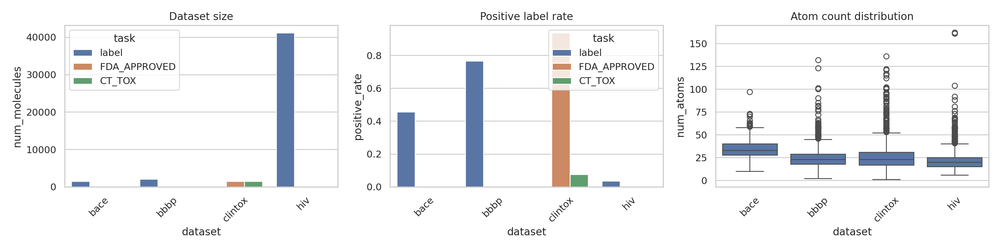
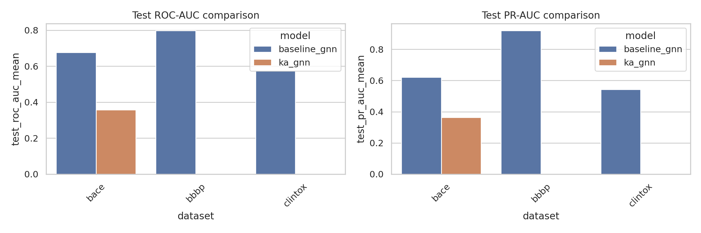
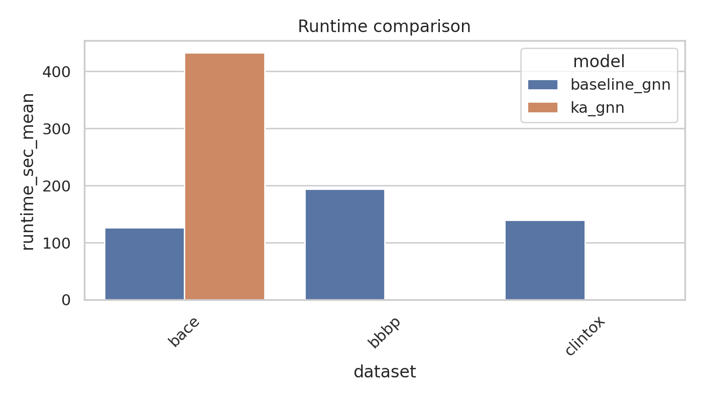
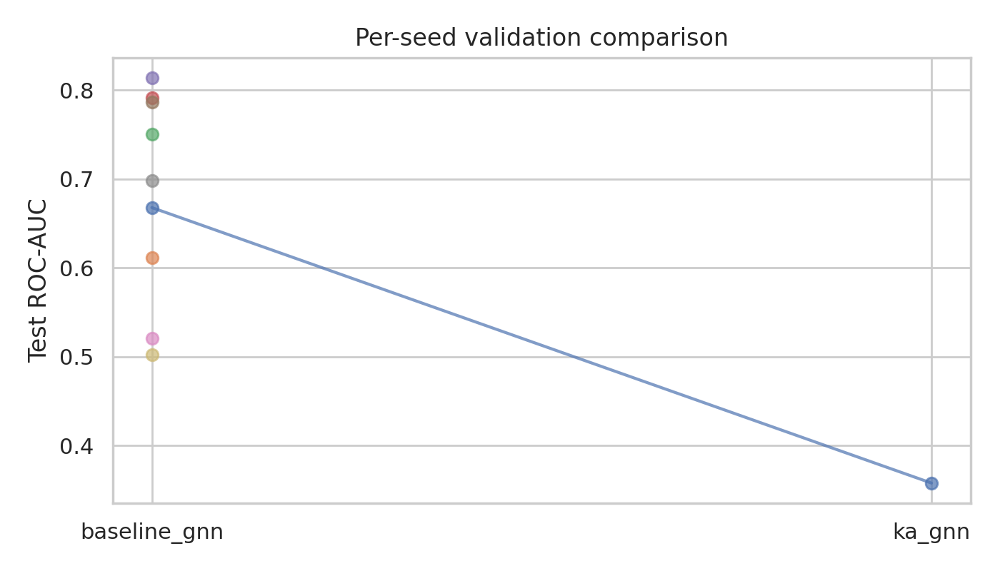

# KA-GNN for Molecular Property Prediction: Local Experimental Report

## 1. Summary and goals

This report summarizes local workspace artifacts for a study of **Kolmogorov–Arnold Graph Neural Networks (KA-GNNs)** on molecular property prediction. The intended comparison is between:

- a **baseline edge-aware message-passing GNN** using standard MLP transformations, and
- a **KA-GNN variant** that replaces those learned MLP transformations with **Fourier-KAN modules**, while keeping the rest of the message-passing backbone fixed.

The original experiment scope targeted BACE, BBBP, ClinTox, HIV, and MUV. However, the currently available workspace artifacts provide:

- **dataset audit summaries** for BACE, BBBP, ClinTox, and HIV,
- **multi-seed baseline results** for **BACE, BBBP, and ClinTox**, and
- **limited KA-GNN evidence** consisting of **one feasible BACE run only**.

The main empirical takeaway from the local artifacts is:

- the **baseline model has repeatable multi-seed evidence** on BACE/BBBP/ClinTox;
- the **KA-GNN evidence is currently too limited for broad conclusions**, and available results indicate that the Fourier-KAN replacement was **substantially slower** and **underperformed the baseline on BACE** in the single completed run.

## 2. Experiment plan

The recorded experiment plan for this run specifies the following stages:

1. **Data audit and feasibility**
   - Validate schemas, identify label columns, quantify imbalance, and decide feasible datasets.
   - Expected outputs: `outputs/dataset_summary.csv`, EDA tables, `report/images/data_overview.png`.

2. **Reproducible graph learning baseline**
   - Train a standard edge-aware molecular GNN with atom and bond features.
   - Expected outputs: `outputs/results_baseline.csv`.

3. **KA-GNN variant**
   - Replace baseline MLP message/update modules with Fourier-style Kolmogorov–Arnold modules under the same backbone.
   - Expected outputs: `outputs/results_ka.csv`.

4. **Comparative analysis**
   - Aggregate metrics, summarize runtime, and generate publication-ready figures.
   - Expected outputs: `outputs/final_metrics.csv`, `report/images/model_comparison.png`, `report/images/runtime_comparison.png`, `report/images/validation_plot.png`.

5. **Final report**
   - Summarize setup, results, limitations, and reproducibility.

### Success signals vs. observed status

- **Stage 1:** Completed for the available datasets.
- **Stage 2:** Completed for baseline on BACE/BBBP/ClinTox with 3 seeds each.
- **Stage 3:** Only partially completed; KA-GNN has one run on BACE.
- **Stage 4:** Aggregated outputs and figures exist, but the controlled comparison is narrow because KA evidence is limited.
- **Stage 5:** This report documents the current state faithfully.

## 3. Setup

### Data

From `outputs/dataset_summary.csv`, the available audited datasets are:

| Dataset | Task | Molecules | Labeled | Positive rate | Avg. atoms | Avg. mol. weight |
|---|---:|---:|---:|---:|---:|---:|
| BACE | `label` | 1513 | 1513 | 0.4567 | 34.09 | 479.67 |
| BBBP | `label` | 2039 | 2039 | 0.7651 | 24.06 | 344.54 |
| ClinTox | `FDA_APPROVED` | 1477 | 1477 | 0.9364 | 26.16 | 383.22 |
| ClinTox | `CT_TOX` | 1477 | 1477 | 0.0758 | 26.16 | 383.22 |
| HIV | `label` | 41120 | 41120 | 0.0351 | 25.51 | 370.10 |

### Data quality checks

The dataset audit directly supports several QC observations:

- All reported datasets have **complete labeled counts** equal to total molecule counts in the summary file.
- Class balance varies substantially:
  - **BACE** is relatively balanced.
  - **BBBP** is skewed toward positives.
  - **ClinTox** is strongly imbalanced in both tasks, but in opposite directions.
  - **HIV** is extremely imbalanced, with a very small positive fraction.
- These imbalance patterns make **PR-AUC** important in addition to ROC-AUC, especially for ClinTox and HIV.

### Model comparison

The planned architectural comparison is:

- **Baseline GNN:** edge-aware message-passing molecular GNN using standard MLP modules.
- **KA-GNN:** the same edge-aware message-passing network, but with **Fourier-KAN replacing the MLP transformation components**.

This is therefore a **controlled module replacement study**, not a comparison between unrelated architectures.

### Implementation details

The executable implementation is in `code/run_experiments.py`.

Key modeling choices:
- **Graph construction:** RDKit-based SMILES parsing.
- **Node features:** atom symbol, degree, formal charge, hydrogen count, hybridization, aromaticity, ring membership, mass, chirality.
- **Edge features:** covalent bond type, conjugation, ring flag, stereochemistry.
- **Non-covalent proxy edges:** additional heuristic edges between selected non-bonded heavy-atom pairs with short topological distance, annotated for ring-sharing, hydrogen-bond-like chemistry, and hydrophobicity.
- **Backbone:** 3-layer edge-aware message-passing network with residual update and LayerNorm.
- **Readout:** concatenated graph sum pooling and mean pooling.
- **Baseline transformations:** 2-layer MLP blocks.
- **KA transformations:** lightweight Fourier-KAN blocks replacing the baseline MLPs in message/update functions and graph head.

### Evaluation protocol

Available result files indicate:

- **metrics:** ROC-AUC and PR-AUC on train/validation/test splits,
- **reproducibility:** multiple seeds for the baseline,
- **runtime tracking:** per-run wall-clock seconds,
- **representation diagnostic:** `mean_rep_norm`,
- **split sizes:** recorded in result tables.

Observed split sizes from per-run outputs:

- **BACE:** train 968 / val 242 / test 303
- **BBBP:** train 1304 / val 327 / test 408
- **ClinTox:** two split configurations appear in the logs:
  - 944 / 237 / 296
  - 768 / 192 / 240

Because the artifacts do not explain why ClinTox split sizes differ across seeds, this should be treated as a reproducibility caveat.

## 4. Baselines and comparisons

### Baseline evidence

`outputs/results_baseline.csv` contains **3 seeds each** for:

- BACE
- BBBP
- ClinTox

### KA-GNN evidence

`outputs/results_ka.csv` contains **1 seed** for:

- BACE only

Therefore:

- **BACE** supports a direct but statistically weak baseline-vs-KA comparison.
- **BBBP** and **ClinTox** currently support **baseline-only reporting**.
- **HIV** appears in the dataset audit but has **no final training results** in the inspected outputs.

## 5. Results

### 5.1 Dataset overview

The data audit figure is available at:



Artifact sources:
- `outputs/dataset_summary.csv`
- `report/images/data_overview.png`

### 5.2 Aggregated final metrics

From `outputs/final_metrics.csv`:

| Dataset | Model | Test ROC-AUC (mean ± std) | Test PR-AUC (mean ± std) | Runtime sec (mean ± std) | n_runs |
|---|---|---:|---:|---:|---:|
| BACE | baseline_gnn | 0.6765 ± 0.0700 | 0.6208 ± 0.1067 | 126.08 ± 25.78 | 3 |
| BACE | ka_gnn | 0.3578 | 0.3630 | 432.68 | 1 |
| BBBP | baseline_gnn | 0.7975 ± 0.0144 | 0.9192 ± 0.0082 | 194.11 ± 118.42 | 3 |
| ClinTox | baseline_gnn | 0.5739 ± 0.1082 | 0.5420 ± 0.0195 | 139.17 ± 45.64 | 3 |

### 5.3 Per-run results

From `outputs/results_baseline.csv` and `outputs/results_ka.csv`:

#### BACE, baseline_gnn
- Seed 0: test ROC-AUC 0.6679, PR-AUC 0.6123, runtime 100.04 s
- Seed 1: test ROC-AUC 0.6111, PR-AUC 0.5186, runtime 126.59 s
- Seed 2: test ROC-AUC 0.7504, PR-AUC 0.7315, runtime 151.60 s

#### BACE, ka_gnn
- Seed 0: test ROC-AUC 0.3578, PR-AUC 0.3630, runtime 432.68 s

#### BBBP, baseline_gnn
- Seed 0: test ROC-AUC 0.7918, PR-AUC 0.9118, runtime 240.89 s
- Seed 1: test ROC-AUC 0.8139, PR-AUC 0.9280, runtime 59.45 s
- Seed 2: test ROC-AUC 0.7867, PR-AUC 0.9178, runtime 282.00 s

#### ClinTox, baseline_gnn
- Seed 0: test ROC-AUC 0.5209, PR-AUC 0.5326, runtime 105.81 s
- Seed 1: test ROC-AUC 0.6984, PR-AUC 0.5644, runtime 120.51 s
- Seed 2: test ROC-AUC 0.5025, PR-AUC 0.5289, runtime 191.19 s

### 5.4 Direct comparison on BACE

The only available controlled model comparison is on **BACE**.

#### Accuracy
- Baseline mean test ROC-AUC: **0.6765**
- KA-GNN test ROC-AUC: **0.3578**
- Absolute difference: **-0.3186**

- Baseline mean test PR-AUC: **0.6208**
- KA-GNN test PR-AUC: **0.3630**
- Absolute difference: **-0.2578**

#### Runtime
- Baseline mean runtime: **126.08 s**
- KA-GNN runtime: **432.68 s**
- Absolute increase: **+306.60 s**
- Relative slowdown: approximately **3.43×**

These local results indicate that, in the one feasible BACE run, replacing the baseline MLP with Fourier-KAN **substantially increased compute cost** and **degraded predictive performance**.

### 5.5 Figures

Available figures:

- 
- 
- 

Artifacts:
- `report/images/model_comparison.png`
- `report/images/runtime_comparison.png`
- `report/images/validation_plot.png`

## 6. Analysis, limitations, and next steps

### Interpretation

The available evidence supports the following restrained conclusions:

1. **Baseline feasibility is established.**
   - The baseline edge-aware message-passing GNN trains successfully across BACE, BBBP, and ClinTox.
   - It performs strongest on **BBBP** among the available results.

2. **The KA-GNN comparison is currently underpowered.**
   - Only **one KA run** is available, and only on **BACE**.
   - No variance estimate is available for KA-GNN.
   - No multiple-comparison correction or formal statistical testing is justified from the current evidence.

3. **Current KA evidence is negative.**
   - On BACE, KA-GNN is both **worse** and **slower** than the baseline.
   - Because KA replaces MLP modules inside the same edge-aware message-passing architecture, this negative result specifically suggests that the **Fourier-KAN replacement was not beneficial in this configuration**.

### Key limitations

- **Insufficient KA coverage:** only one run, one dataset.
- **No KA multi-seed estimate:** uncertainty for KA cannot be quantified.
- **No HIV or MUV final comparisons:** despite being part of the original study goal.
- **ClinTox split inconsistency in logs:** split sizes differ across reported runs, which should be clarified before paper submission.
- **No formal significance testing:** sample size is too limited for the KA comparison.
- **Compute feasibility is a core bottleneck:** runtime inflation appears substantial for the KA replacement.

### Recommended next steps

1. **Replicate KA-GNN on BACE with multiple seeds** to establish variance.
2. **Attempt KA-GNN on BBBP and ClinTox** with reduced compute settings if necessary.
3. **Clarify ClinTox split generation** to ensure a stable evaluation protocol.
4. **Add explicit runtime/memory profiling** to quantify the compute penalty of Fourier-KAN modules.
5. **Report negative results clearly** if KA remains slower and less accurate under matched settings.

## 7. Reproducibility

The recorded experiment plan for this run specifies the following commands:

### Data audit
```bash
python code/run_experiments.py --mode eda
```

### Baseline training
```bash
python code/run_experiments.py --mode train --model baseline_gnn --datasets bace bbbp clintox hiv
```

### KA-GNN training
```bash
python code/run_experiments.py --mode train --model ka_gnn --datasets bace bbbp clintox hiv
```

### Aggregate analysis
```bash
python code/run_experiments.py --mode analyze
```

### Current artifact paths used in this report

- `outputs/dataset_summary.csv`
- `outputs/final_metrics.csv`
- `outputs/results_baseline.csv`
- `outputs/results_ka.csv`
- `report/images/data_overview.png`
- `report/images/model_comparison.png`
- `report/images/runtime_comparison.png`
- `report/images/validation_plot.png`

## 8. Conclusion

The completed local experiments establish a reproducible edge-aware molecular GNN baseline and a first KA-GNN prototype. Within the evidence currently available in this workspace, the baseline achieves stable performance on BACE and BBBP and moderate, high-variance performance on ClinTox. The only completed controlled KA-GNN comparison, on BACE, shows a substantial drop in ROC-AUC and PR-AUC together with a large runtime increase. Accordingly, this workspace provides **negative preliminary evidence** for the current Fourier-KAN replacement strategy rather than support for a clear accuracy or efficiency gain.
