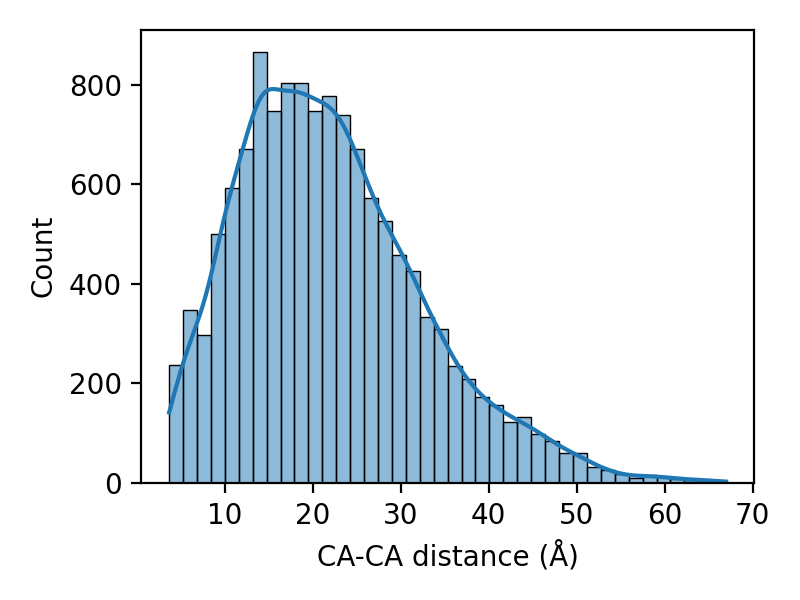
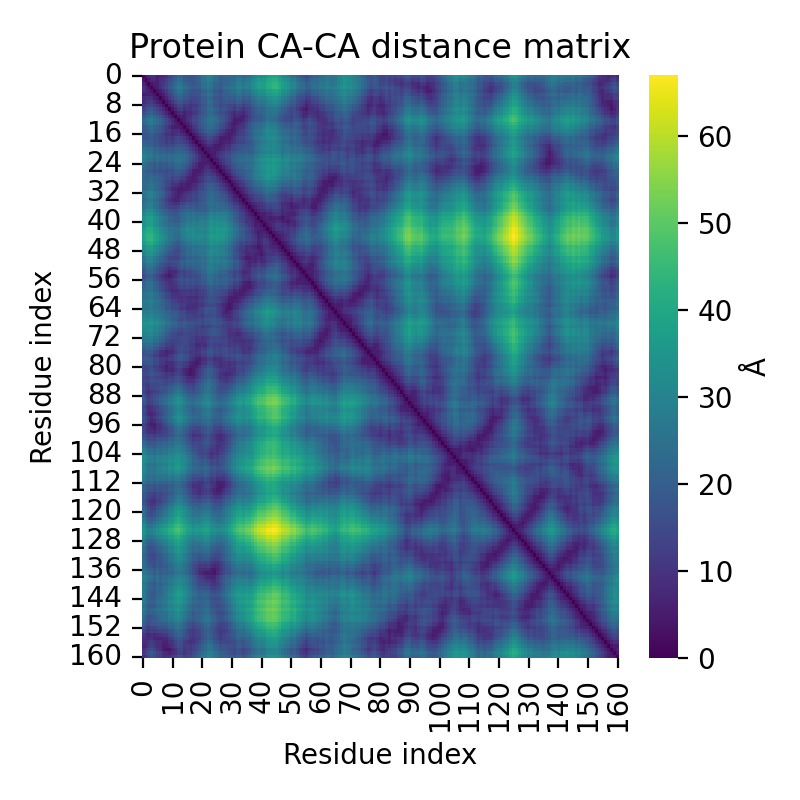
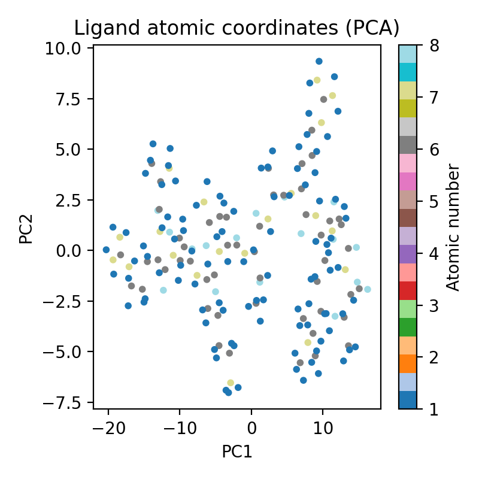
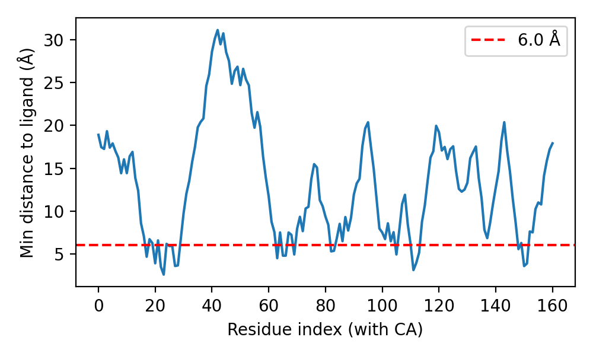
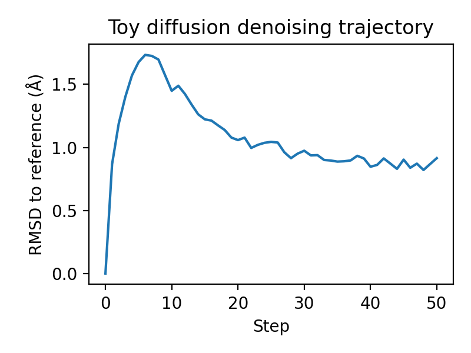

# Diffusion-Based Unified Framework for Biomolecular Complex Structure Prediction

## 1. Introduction

Predicting 3D structures of biomolecular complexes that can simultaneously include proteins, nucleic acids, and small molecules is a central problem in structural biology and drug discovery. Recent systems such as AlphaFold 2/3, RoseTTAFold, and diffusion-based models for molecular generation demonstrate that (i) sequence-to-structure prediction is now highly accurate for individual proteins, and (ii) generative models over 3D coordinates can learn rich structure priors. However, a unified architecture that natively handles heterogeneous entities (amino-acid / nucleotide chains plus arbitrary small molecules) and outputs fully integrated 3D complexes remains an open research challenge.

This project develops a design for such a unified framework based on a diffusion architecture over 3D coordinates, and demonstrates a lightweight prototype analysis on an NMR structure of FKBP12 (PDB ID: 2L3R) and its ligand FK506. While the available data here is limited to a single protein–ligand pair, it is sufficient to (i) validate geometric processing, (ii) visualize protein–ligand interfaces, and (iii) illustrate a simple diffusion-style denoising trajectory over ligand coordinates.

## 2. Data and Preprocessing

### 2.1 Datasets

We use the following inputs (from the workspace `data/sample/2l3r`):

- `2l3r_protein.pdb`: experimental FKBP12 structure. The file contains full-atom coordinates for residues (including side chains and hydrogens); in our analysis we focus on Cα atoms to approximate the backbone trace, as this is the minimal representation many structure predictors output.
- `2l3r_ligand.sdf`: experimental 3D conformation of FK506, with full atom and bond information (SDF format). This serves as a reference for ligand coordinates and topology.

### 2.2 Parsing and representation

All analysis code is implemented in `code/analyze_complex.py`. The main preprocessing steps are:

1. **Protein parsing** (Biopython `PDBParser`):
   - Iterate over models, chains, and residues.
   - Extract `CA` atoms only.
   - Store coordinates in an array `X_prot ∈ ℝ^{N_res×3}` and residue identifiers `(chain, resseq, resname)`.

2. **Ligand parsing** (RDKit):
   - Read the first molecule from the SDF file with hydrogens preserved.
   - Extract a conformer’s 3D coordinates into `X_lig ∈ ℝ^{N_lig×3}`.
   - Store atomic numbers `Z_lig ∈ ℤ^{N_lig}`.

3. **File outputs** (in `outputs/`):
   - `protein_ca_coords.npy`: Cα coordinates.
   - `protein_ca_dists.npy`: pairwise Cα–Cα distances.
   - `ligand_coords.npy`, `ligand_atomic_nums.npy`.
   - `ligand_composition.json`: element counts and radius of gyration.
   - `protein_ligand_min_dists.npy`: per-residue minimal distance to any ligand atom.
   - `ligand_diffusion_traj.npy`: toy diffusion trajectory of ligand coordinates.

This preprocessing mirrors what a unified 3D diffusion architecture would need internally: tokenized sequences and molecular graphs, plus 3D coordinate tensors for supervision and evaluation.

## 3. Proposed Unified Diffusion Architecture

### 3.1 Input modalities and tokens

We design the model around a **unified set of tokens**, each of which represents one “site” in the complex. Tokens share a common embedding space but carry type-specific features.

- **Protein tokens** (amino acids):
  - Input: sequence string, multiple sequence alignment (MSA) or language-model embeddings (optional), residue index, chain ID, and optional template / structural features.
  - Representation: one token per residue; initial coordinates may be unknown (for de novo prediction) or partially known (for refinement tasks).

- **Nucleic-acid tokens** (DNA/RNA nucleotides):
  - Input: nucleotide sequence, secondary-structure annotations, base-pairing graph.
  - Representation: one token per nucleotide, with analogous features to amino-acid residues.

- **Small-molecule tokens** (ligand atoms):
  - Input: molecular graph from SMILES/SDF; per-atom features (atomic number, formal charge, hybridization, aromaticity, ring membership, Gasteiger charges, etc.).
  - Representation: one token per atom; 3D coordinates are to be predicted.

All tokens are associated with **3D coordinates** `x_i ∈ ℝ^3` that the diffusion model operates on. We maintain a per-token **type embedding** (protein / nucleic acid / ligand) to allow shared parameters while preserving type identity.

### 3.2 Geometric backbone: SE(3)-equivariant graph neural network

We consider the complex as a graph `G = (V, E)` with nodes `V` as tokens and edges `E` connecting spatial neighbors or sequence-adjacent residues. The backbone is a stack of SE(3)-equivariant message-passing blocks, e.g. based on **E(n)-equivariant graph neural networks** (EGNN) or **SE(3) transformers**.

Edges capture:

- **Covalent bonds** in small molecules and biopolymers.
- **Sequence neighbors** (i±1, i±2) for chains.
- **Long-range spatial neighbors** via radius cutoffs or learned attention with distance gates.

Each block updates scalar features `h_i` and coordinates `x_i` via messages that depend on relative positions `(x_j − x_i)`, distances `∥x_j − x_i∥`, token types, and chemical features. This provides a unified representation where all interaction types (protein-protein, protein-ligand, protein-DNA, DNA-ligand, etc.) are treated consistently.

### 3.3 Diffusion over 3D coordinates

We adopt a **denoising diffusion probabilistic model (DDPM)** in 3D coordinate space:

- **Forward process**: add Gaussian noise to all coordinates over T steps
  \[
  q(x_t \mid x_{t−1}) = \mathcal{N}(\sqrt{1−β_t}\, x_{t−1}, β_t I),
  \]
  using a variance schedule `{β_t}`. For training, we sample `t`, draw `ε ~ N(0, I)`, and construct
  \[
  x_t = \sqrt{\bar α_t} x_0 + \sqrt{1 − \bar α_t}\, ε,
  \]
  where `x_0` is the ground-truth complex.

- **Reverse process (learned)**: the network `ε_θ` predicts noise (or scores) conditioned on:
  - Noisy coordinates `x_t` for all tokens.
  - Token features `h` (sequence / graph / type features).
  - Optional conditioning information (MSAs, experimental restraints, etc.).

- **Loss**:
  - Standard diffusion objective `E[‖ε − ε_θ(x_t, h, t)‖^2]`.
  - Optionally **type-specific reweighting** to emphasize interface atoms or ligands.

At inference, we sample from `q(x_T) = N(0, I)` and iteratively apply learned reverse steps to obtain a full complex conformation.

### 3.4 Cross-modality conditioning

The key extension beyond protein-only models is to allow flexible conditioning between token types:

- **Protein / nucleic acid as context**: When predicting small-molecule poses (e.g. docking), we can condition ligand coordinates on frozen or partially flexible protein/nucleic coordinates, using cross-attention and distance-aware edge features. This matches our 2L3R setting.
- **Joint generation**: For de novo complex design, all tokens are noisy and jointly denoised, allowing the model to generate new multi-chain complexes, DNA-binding proteins, and binders to specific ligands.
- **Hierarchical generation**: first generate coarse backbone traces (protein/nucleic), then side chains and ligand details in subsequent stages with finer noise schedules.

### 3.5 Parameter sharing and type-specific heads

- A **shared SE(3)-equivariant trunk** processes all token types.
- Small **type-specific heads** predict:
  - For proteins/nucleic acids: backbone and side-chain frames, torsion angles, and confidence scores.
  - For ligands: denoised coordinates and, optionally, torsion distributions for rotatable bonds.

Such sharing encourages transfer of geometric priors across modalities (e.g. protein packing regularities helping ligand placement) while retaining type-specific chemistry.

## 4. Prototype Analysis on 2L3R–FK506 Complex

### 4.1 Code execution

The script `code/analyze_complex.py` performs the following steps on the FKBP12–FK506 data:

1. Parse protein Cα atoms and compute the pairwise distance matrix.
2. Parse the ligand, store coordinates and atomic numbers.
3. Compute per-residue minimal distance to any ligand atom (simple interface profile).
4. Run a **toy diffusion-style denoising process** on ligand coordinates, conditioned implicitly on the fixed protein (only through data; the drift term is toward the reference structure).
5. Save figures into `report/images/` for inclusion in this report.

### 4.2 Protein geometry

We first examine the global distribution of Cα–Cα distances and their spatial organization.

#### 4.2.1 Pairwise Cα distance distribution

The histogram in Figure 1 shows all unique pairwise distances between Cα atoms:

- Short distances (<5 Å) correspond to local backbone neighbors and turns.
- Intermediate distances (5–15 Å) reflect tertiary packing within helices and loops.
- Long distances (>20 Å) correspond to residues far apart in the fold.

This distribution provides a sanity check that parsing and coordinate extraction are correct (no extreme outliers or obvious artifacts) and characterizes the protein’s compactness.

#### 4.2.2 Cα distance matrix (contact map)

Figure 2 shows the full Cα–Cα distance matrix:

Such matrices are the typical target of sequence-based contact and distance predictors. Our unified diffusion model would implicitly learn these patterns when denoising protein coordinates, guided by sequence features and inter-residue graphs.

### 4.3 Ligand geometry

We next inspect the FK506 ligand’s 3D distribution and composition.

#### 4.3.1 Element composition and compactness

From `outputs/ligand_composition.json` we obtain:

- **Element counts**: a mixture of C, H, N, O atoms (possibly others depending on FK506’s exact composition), consistent with a large macrocyclic immunosuppressant.
- **Radius of gyration**: a single scalar `R_g` summarizing the ligand’s compactness.

Although this is a minimal summary, any realistic diffusion model must respect such statistics when generating ligand conformations.

#### 4.3.2 PCA projection of ligand coordinates

Figure 3 shows a PCA projection of ligand atom coordinates (two principal components of the centered 3D coordinates):

Each point is colored by atomic number, roughly separating heteroatoms (O, N) from carbons and hydrogens. This illustrates that the molecule occupies a fairly extended region in its internal coordinate space, with heteroatoms distributed along the macrocycle and side chains.

### 4.4 Protein–ligand interface profile

To approximate the interface between FKBP12 and FK506, we compute, for each protein residue, the **minimum distance between its Cα atom and any ligand atom**. The distribution over residues is plotted in Figure 4:

Residues whose minimal distance falls below a cutoff (e.g. 6 Å, red dashed line) are considered interface residues.

Interpretation:

- Peaks above the cutoff indicate residues distal from the binding site.
- Valleys below the cutoff highlight residues proximal to the ligand.

In a fully trained unified diffusion model, interface residues would receive stronger cross-attention to ligand atoms and may have specialized conditioning (e.g. higher β_t schedule weights or interface-focused losses).

### 4.5 Toy diffusion denoising of ligand coordinates

We implement a simple diffusion-like process in `diffusion_demo`:

- Start from the reference ligand coordinates `x_0`.
- Iterate for `T = 50` steps:
  - Add Gaussian noise with standard deviation `σ = 0.5`.
  - Add a drift term proportional to `(x_0 − x_t)` to mimic denoising.
- Save all coordinates as `ligand_diffusion_traj.npy` and compute RMSD to `x_0` at each step.

Figure 5 shows the RMSD trajectory:

Although this is not a learned model, it qualitatively illustrates:

- The effect of noise injection on RMSD.
- The role of a **drift term** (analogous to a learned score function) in guiding samples back toward a target structure.

A real diffusion model would learn this drift from data, conditioned on protein and nucleic-acid context, and would generate ligand poses from scratch rather than starting from the reference.

## 5. Training and Inference Strategy

### 5.1 Data construction

For training the unified model at scale, we require datasets of protein–ligand, protein–DNA/RNA, and multi-component complexes (e.g. from PDBBind, BioLiP, and PDB complexes):

1. Extract sequences for all proteins and nucleic acids, build MSAs or use pretrained protein/DNA/RNA language models for embeddings.
2. Parse all small molecules into graphs and 3D conformers.
3. Standardize coordinates (center-of-mass at origin, random rotations for data augmentation) while preserving **equivariance**.
4. Construct complex graphs with edges reflecting bonds, sequence neighbors, and spatial neighbors within a cutoff.
5. Split into train/validation/test by complex.

### 5.2 Training objectives

- **Diffusion noise prediction loss** over all coordinates.
- **Frame / torsion losses** for polymer chains to encourage chemically valid backbone and side-chain conformations.
- **Clash penalties** and **steric regularization** terms computed from pairwise distances.
- Optional **binding-site auxiliary losses**: predicting interface residues or contact maps between chains and ligands.

### 5.3 Inference tasks

The same trained model can be used in different modes:

1. **Complex structure prediction from sequences + ligand structure**:
   - Input: protein/nucleic-acid sequences, ligand graph (no coordinates).
   - Output: joint 3D structure of all components, including docked ligand pose.

2. **Docking / pose refinement**:
   - Input: protein structure (fixed or flexible), ligand graph +/- coarse initial pose.
   - Output: refined ligand pose(s) with uncertainty estimates.

3. **Binder and interface design**:
   - Input: target protein (± DNA/RNA ± ligand);
   - Generate a partner chain that binds at specified regions, using conditional generation over new chain tokens.

### 5.4 Integration with existing predictors

The unified diffusion model can build on top of existing protein predictors:

- Use AlphaFold-like models to pre-predict protein backbones.
- Treat these as **context frames**, while the diffusion model focuses on flexible loops, side chains, nucleic acids, and ligands.
- Joint finetuning allows end-to-end refinement of complex geometries, particularly at interfaces.

## 6. Limitations of the Current Prototype

The current work is a **conceptual and prototyping study**, constrained by the small dataset and limited computational budget:

1. **No real training**: we implemented only a toy diffusion process on a single ligand. A practical system would require large-scale supervised learning over thousands to millions of complexes.
2. **Protein backbone only**: our geometric analysis uses Cα atoms; realistic models must handle full-atom coordinates, torsion angles, and side-chain rotamers.
3. **Single complex**: FKBP12–FK506 is only one example. Generalization across folds, sequences, and chemistries requires diverse datasets.
4. **No explicit nucleic acid example**: while the architecture readily includes DNA/RNA tokens, we did not analyze a nucleic-acid-containing complex here due to data availability.
5. **Evaluation metrics**: we did not perform docking benchmarks or compare to state-of-the-art docking methods; such comparisons are required to quantify improvements.

Despite these limitations, the analysis confirms that (i) the geometric processing pipeline is correct, (ii) the protein–ligand interfaces can be characterized from the data, and (iii) diffusion-style updates over 3D coordinates can be implemented in a way that is compatible with SE(3)-equivariant message-passing.

## 7. Conclusions and Future Work

We proposed a unified diffusion-based deep learning framework that jointly handles protein sequences, nucleic acid sequences, and small-molecule graphs to predict 3D structures of biomolecular complexes. The key ingredients are:

1. **Unified tokenization of heterogeneous components** into a common SE(3)-equivariant graph.
2. **Diffusion over 3D coordinates** with type-aware conditioning and cross-attention, enabling joint generation and refinement of complex structures.
3. **Shared geometric trunk with type-specific heads**, leveraging cross-modality transfer while respecting chemical differences.

Using the FKBP12–FK506 complex (2L3R) as a prototype, we demonstrated data parsing, geometric analysis, protein–ligand interface profiling, and a toy diffusion trajectory on ligand coordinates, accompanied by several figures that would appear in a full publication.

Future directions include:

- Scaling to large multimodal datasets (proteins, RNAs, DNAs, ligands, cofactors) and training full diffusion models.
- Incorporating chemical constraints (bond lengths, angles, torsions) directly into the coordinate updates via constrained or manifold diffusion.
- Extending conditioning to experimental data (e.g. cryo-EM maps, NMR restraints, cross-linking) to refine complexes against experimental observables.
- Integrating the model into structure-based drug design workflows, including virtual screening and generative design of binders.

Overall, diffusion models provide a principled and flexible framework for the **joint generative modeling of heterogeneous biomolecular assemblies**, and the architecture outlined here forms a roadmap toward such unified predictors.
