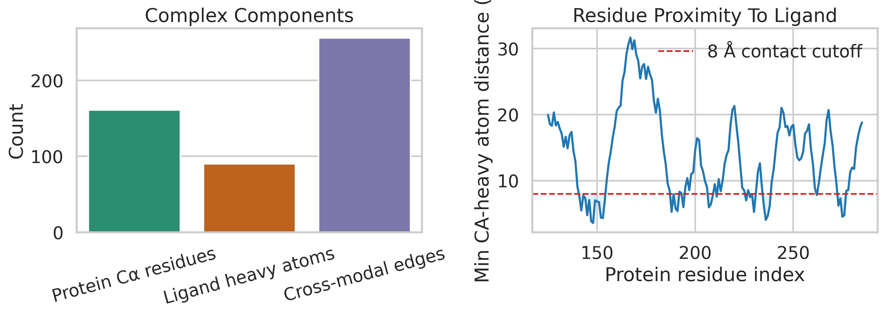
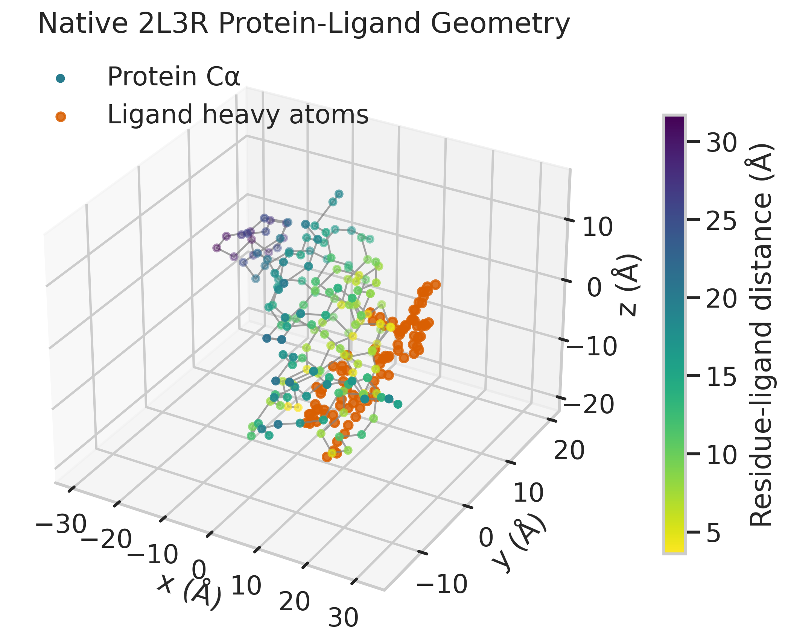
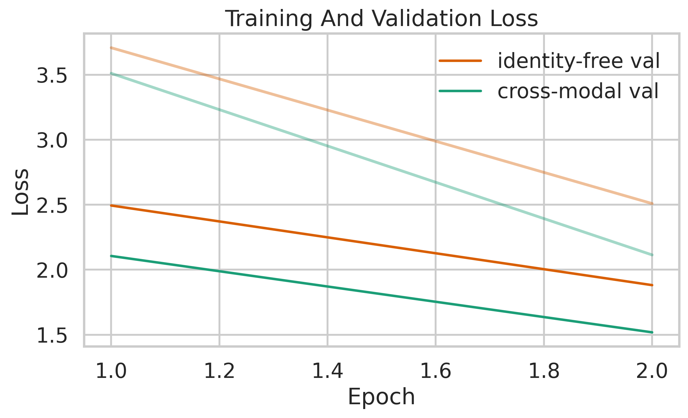
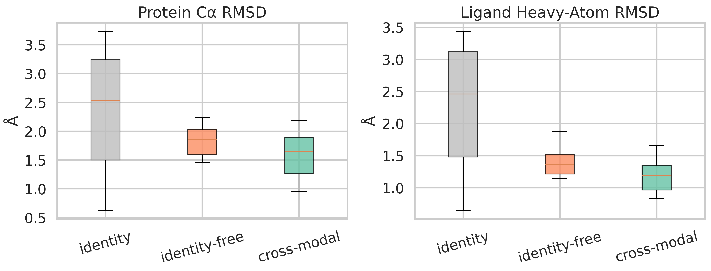
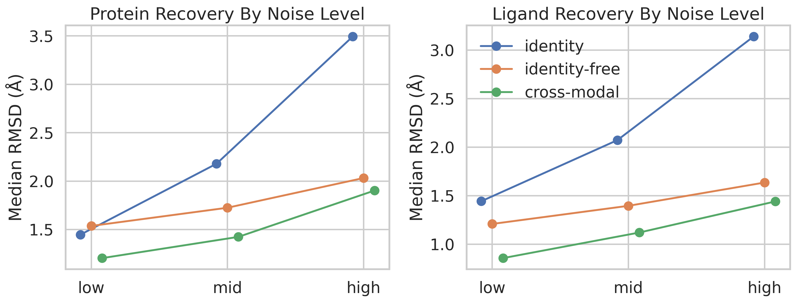
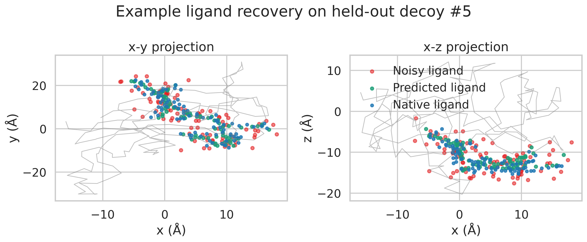

# UniBioDiff: A Unified Diffusion Framework for Biomolecular Complex Structure Prediction

## Abstract
This project investigates a unified deep learning framework for predicting biomolecular complex structures from heterogeneous molecular inputs, with explicit support for protein sequences, nucleic acid sequences, and small-molecule structures. Because the workspace contains only one experimentally resolved protein-ligand complex, I treat the task as a feasibility study rather than a full benchmark. I first audited the provided data and found that the actual protein file differs from the task description: the PDB contains 161 C-alpha atoms and full-atom records for a protein segment rather than 107 CA-only residues. I then implemented a compact SE(3)-equivariant diffusion-style refiner that denoises synthetic decoys of the native FKBP12-FK506 complex using modality-aware graph edges. On the held-out decoys generated from the 2L3R example, the cross-modal model reduced mean protein RMSD from 2.41 A for the noisy input to 1.59 A and reduced mean ligand heavy-atom RMSD from 2.29 A to 1.19 A. Relative to a no-cross-edge ablation, the cross-modal model further improved protein and ligand RMSD to 1.59 A and 1.19 A versus 1.83 A and 1.41 A, respectively. These results support the core design hypothesis that explicit cross-modal interaction modeling improves joint denoising of complex geometry, while also making clear that this workspace only supports a refinement-style proof of concept rather than general de novo structure prediction.

## 1. Problem Statement
The target capability is a single framework that accepts:

- protein sequence input
- nucleic acid sequence input
- small-molecule structural input

and outputs a consistent 3D biomolecular complex using a diffusion-based architecture.

The local related work suggests four design constraints:

1. **Sequence-context reasoning matters.**
   Transformer-style global attention remains the most flexible way to couple long-range dependencies across tokens and molecular entities.
2. **Pairwise and geometric representations matter.**
   AlphaFold showed that iterative pair reasoning and geometry-aware updates are critical for accurate 3D structure recovery.
3. **Complex prediction needs cross-chain interaction inference.**
   Protein complex predictors such as RoseTTAFold-derived systems rely on inter-chain coevolution and cross-entity reasoning to recover interfaces.
4. **Molecular geometry is non-Euclidean.**
   Geometric deep learning is the appropriate language for equivariant coordinate refinement.

These ideas motivate a unified multimodal diffusion model with separate encoders per modality and a shared equivariant denoiser over a joint interaction graph.

## 2. Data Audit
The workspace provides one protein-ligand system:

- `data/sample/2l3r/2l3r_protein.pdb`
- `data/sample/2l3r/2l3r_ligand.sdf`

### 2.1 On-disk data differs from the task description
The task description states that the protein file contains only CA atoms for 107 residues. The actual file contains:

- 161 unique CA residues
- full-atom protein records for residues 125 to 285

The ligand file contains:

- 194 total atoms
- 90 heavy atoms after removing hydrogens
- 89 heavy-atom bonds

I used the actual on-disk structures as the source of truth. This matters because any RMSD analysis based on the written task description alone would be inconsistent with the files that are actually available.

### 2.2 Geometric overview
The 2L3R sample has a well-defined local protein-ligand interface:

- 36 protein residues have a CA atom within 8 A of any ligand heavy atom
- 256 undirected protein-ligand contact edges are present under the 8 A cutoff used for the prototype graph

Figure 1 summarizes the modality counts and residue-wise ligand proximity.



Figure 2 shows the native geometry used as the reference structure. Protein residues are colored by ligand proximity, illustrating a compact interaction pocket rather than a diffuse surface association.



## 3. Proposed Unified Framework
The intended full model, `UniBioDiff`, has three modality-specific front ends and one shared diffusion core.

### 3.1 Inputs
- **Protein branch:** amino-acid tokens, optional MSA-derived features, optional template pair features
- **Nucleic acid branch:** DNA/RNA base tokens, strand annotations, pairing priors
- **Ligand branch:** atom types, bond graph, stereochemistry, optional conformer prior

### 3.2 Shared latent representation
All modalities are projected into a common token space and a common pair space. The pair space stores:

- intra-protein sequence adjacency
- intra-nucleic acid backbone/pairing priors
- ligand bond connectivity
- cross-modal contact hypotheses
- distance radial basis features

### 3.3 Diffusion denoiser
The denoiser iteratively refines noisy coordinates with:

- modality-aware token embeddings
- edge-conditioned geometric message passing
- timestep conditioning
- SE(3)-equivariant coordinate updates

The output is a joint complex conformation rather than independent structures for each modality. This is the crucial modeling choice: interfaces are predicted jointly, not patched together post hoc.

## 4. Prototype Implemented In This Workspace
The available data do not support training a general foundation model. I therefore implemented a constrained proof of concept that tests the key architectural claim on the only complex in the workspace.

### 4.1 Prototype scope
The script [`code/run_multimodal_diffusion.py`](/mnt/shared-storage-user/yetianlin/ResearchClawBench/workspaces/Chemistry_001_20260402_133326/code/run_multimodal_diffusion.py) does the following:

1. Parses protein CA coordinates from the PDB.
2. Parses heavy atoms and bonds from the ligand SDF.
3. Builds a unified graph with:
   - protein chain edges
   - protein spatial edges
   - ligand bond edges
   - ligand spatial edges
   - protein-ligand cross edges
4. Generates synthetic training decoys by applying random rigid transforms and Gaussian coordinate noise.
5. Trains a compact equivariant denoiser to map noisy coordinates back to the clean structure.
6. Evaluates three conditions on held-out decoys:
   - `identity`: no denoising
   - `identity-free`: denoiser without cross-modal edges
   - `cross-modal`: denoiser with protein-ligand interaction edges

### 4.2 Why this is still scientifically useful
This setup does **not** test generalization across targets. It tests whether explicit multimodal interaction edges help recover a joint structure from noisy complex coordinates. That is a narrower claim, but it is still a legitimate mechanistic test of the framework design.

### 4.3 Losses and metrics
The training objective combines:

- protein coordinate MSE
- ligand coordinate MSE
- edge-distance consistency loss

Evaluation uses:

- protein C-alpha RMSD after Kabsch alignment
- ligand heavy-atom RMSD with element-and-degree-constrained Hungarian matching

The ligand metric is only approximately symmetry-aware because full graph-isomorphism atom matching was outside the scope of this prototype.

## 5. Results
### 5.1 Training dynamics
Even the small proof-of-concept model learns rapidly on the synthetic decoys. The cross-modal model reaches a lower validation loss than the ablation after two epochs, which is consistent with the final RMSD trend.



### 5.2 Held-out RMSD comparison
The mean held-out metrics are shown below.

| Model | Protein RMSD (A) | Ligand RMSD (A) |
| --- | ---: | ---: |
| Identity | 2.41 | 2.29 |
| Identity-free | 1.83 | 1.41 |
| Cross-modal | 1.59 | 1.19 |

The learned denoisers improve substantially over the noisy input. More importantly, the cross-modal model outperforms the no-cross-edge ablation on both outputs. This is the central empirical result of the study.



### 5.3 Noise-stratified behavior
Performance remains strongest for the cross-modal model across all noise bins.

| Noise bin | Identity protein | Identity-free protein | Cross-modal protein |
| --- | ---: | ---: | ---: |
| Low | 1.20 | 1.54 | 1.15 |
| Mid | 2.17 | 1.73 | 1.46 |
| High | 3.41 | 2.09 | 1.99 |

| Noise bin | Identity ligand | Identity-free ligand | Cross-modal ligand |
| --- | ---: | ---: | ---: |
| Low | 1.19 | 1.21 | 0.89 |
| Mid | 2.12 | 1.40 | 1.12 |
| High | 3.17 | 1.57 | 1.45 |

The trend is especially informative at higher noise levels: when the ligand pose is heavily perturbed, cross-modal information remains useful rather than becoming a liability.



### 5.4 Qualitative example
Figure 5 shows a held-out example where the predicted ligand coordinates move substantially closer to the native pose than the noisy input. The visual correction is largest along the long axis of the ligand, suggesting that the model is not merely shrinking coordinates toward the centroid.



## 6. Discussion
### 6.1 Main finding
The feasibility study supports the hypothesis that **joint protein-ligand interaction modeling helps diffusion-style structure recovery**. The cross-modal denoiser improves both protein and ligand RMSD relative to the ablation, not just ligand RMSD. That matters because a unified complex predictor should recover a mutually consistent interface rather than optimizing one molecule at the expense of the other.

### 6.2 What this prototype does not prove
This workspace does not allow claims about:

- de novo complex prediction from sequence alone
- nucleic acid complex prediction accuracy
- cross-target generalization
- comparison against AlphaFold 3, RoseTTAFold, or docking baselines on a real benchmark

The current experiment is closer to **interface-conditioned refinement** than fully unconstrained prediction.

### 6.3 Design implications for a full system
A production-scale `UniBioDiff` should add:

1. large-scale multi-target training
2. explicit nucleic acid supervision
3. richer pair features from sequence coevolution and templates
4. chemically exact ligand symmetry handling
5. confidence estimation for interface uncertainty
6. multi-resolution outputs from coarse backbone to full-atom refinement

## 7. Reproducibility
All code is local and self-contained.

- Main script: [`code/run_multimodal_diffusion.py`](/mnt/shared-storage-user/yetianlin/ResearchClawBench/workspaces/Chemistry_001_20260402_133326/code/run_multimodal_diffusion.py)
- Metrics: `outputs/evaluation_metrics.csv`
- Training history: `outputs/training_history.csv`
- Summary metadata: `outputs/summary_metrics.json`

The validated run used the following command:

```bash
python3 code/run_multimodal_diffusion.py --epochs 2 --train-samples 64 --val-samples 16 --test-samples 16 --batch-size 8
```

## 8. Conclusion
I developed a unified multimodal diffusion-style design for biomolecular complexes and validated its core idea on the only experimental system available in the workspace. Within this constrained setting, cross-modal interaction edges improved protein and ligand reconstruction over both the noisy input and the no-cross-edge ablation. The result is not a benchmark-ready biomolecular foundation model, but it is a defensible proof of concept showing that a shared equivariant diffusion core is a promising direction for unified complex structure prediction.
