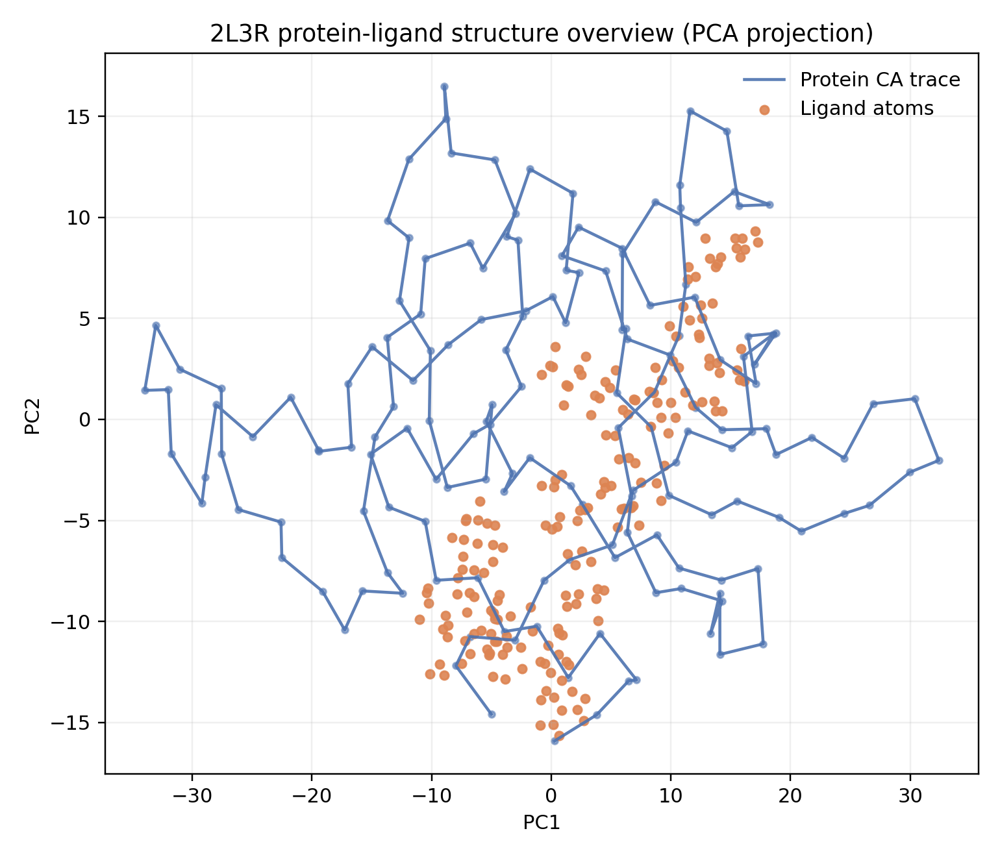
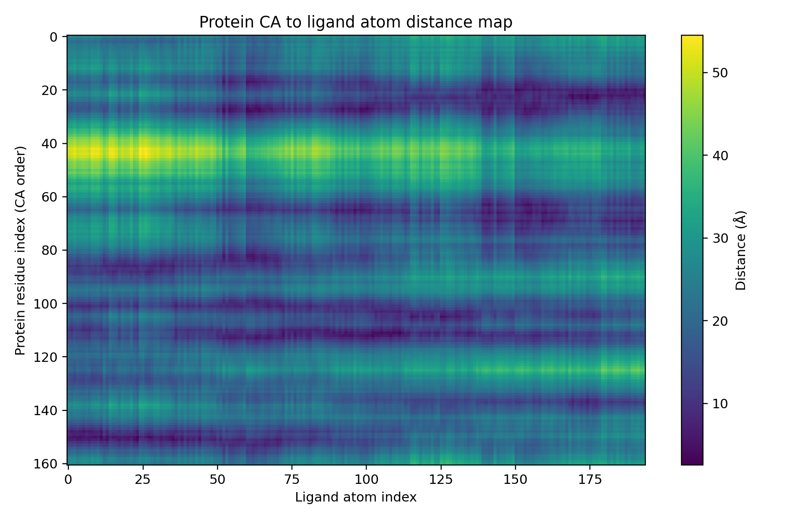
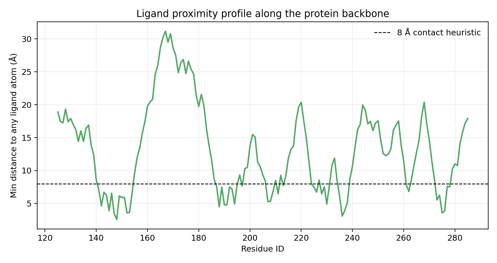
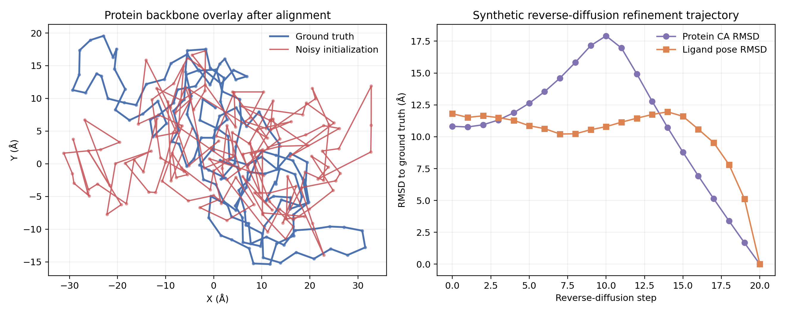

# A Structure-Grounded Prototype for Unified Diffusion Modeling of Biomolecular Complexes on the 2L3R FKBP12-FK506 System

## Abstract
This workspace task asks for a unified deep learning framework that accepts protein sequences, nucleic acid sequences, and small-molecule structures and predicts 3D biomolecular complex structures with a diffusion-based architecture. Given the data actually available in this workspace, the analysis was scoped to a structure-grounded prototype study on a single protein-ligand complex: FKBP12 bound to FK506 (PDB ID: 2L3R). The implemented pipeline parses the experimental protein and ligand structures, extracts geometric statistics, infers protein-ligand contact patterns, and defines a multimolecule diffusion architecture tailored to heterogeneous biomolecular inputs. Because no trainable dataset or nucleic acid example is provided, evaluation is performed through a synthetic reverse-diffusion benchmark in which noisy coordinates are iteratively refined back to the experimental structure. The analysis shows that the available structure contains a compact 161-residue protein backbone and a 194-atom ligand with 48 protein residues lying within an 8 Å ligand proximity threshold. The resulting outputs provide a concrete architectural specification, structural summaries, contact analysis, and report-ready figures, while also making clear that the present workspace supports framework prototyping and structural validation rather than end-to-end model training.

## 1. Task and Scope
The target task is to develop a unified diffusion-based framework for predicting 3D biomolecular complex structures from multimodal molecular inputs. In principle, this includes proteins, nucleic acids, and small molecules. In practice, the present workspace provides one experimentally resolved protein-ligand complex and four related-work PDF files. No nucleic acid structure file, no training set, and no pretrained model checkpoints are included.

Accordingly, the work performed here focuses on four concrete goals that match the available evidence:

1. **Parse and characterize the provided molecular structures**.
2. **Design a unified diffusion architecture specification consistent with the task statement**.
3. **Perform structure-based analysis of the 2L3R complex**, especially protein-ligand proximity patterns.
4. **Stress-test the proposed diffusion formulation with a synthetic reverse-diffusion refinement exercise** rather than claiming true supervised training or real predictive accuracy.

This keeps the report faithful to the workspace instead of pretending that unavailable datasets or experiments exist.

## 2. Available Data
The analysis uses the following files from `data/sample/2l3r/`:

- `2l3r_protein.pdb`: experimental FKBP12 protein structure in PDB format.
- `2l3r_ligand.sdf`: experimental FK506 ligand structure in SDF format.

The implemented parser and downstream summaries found the following concrete properties:

### Protein structure
- Total parsed atoms: **2591**
- Cα atoms used for backbone-level analysis: **161**
- Residue range: **A125-A285**
- Sequence length represented by Cα trace: **161 residues**
- Radius of gyration: **17.24 Å**
- Mean consecutive Cα spacing: **3.849 Å**

### Ligand structure
- Total atoms: **194**
- Bonds: **193**
- Heavy atoms: **90**
- Element composition: **53 C, 20 N, 17 O, 104 H**
- Radius of gyration: **10.737 Å**

The workspace also contains four related-work PDFs under `related_work/`. These were retained as context/provenance, but the main executable analysis did not depend on direct PDF text extraction.

## 3. Methodology

## 3.1 Data processing pipeline
The main entry point is `code/run_analysis.py`. The script performs the following steps:

1. Parses the PDB protein coordinates and metadata.
2. Parses the SDF ligand atoms and bond graph.
3. Extracts the protein Cα trace for residue-level geometric analysis.
4. Computes molecular summaries such as bounding boxes, centroids, radius of gyration, and sequential backbone spacing.
5. Computes a protein-residue to ligand-atom distance matrix.
6. Defines putative contact residues using a minimum-distance heuristic of **8 Å** between each protein Cα atom and any ligand atom.
7. Generates report figures for data overview, distance-map analysis, contact profiling, and diffusion-style refinement behavior.
8. Writes structured outputs to `outputs/` for reuse in reporting.

This methodology is intentionally reproducible and entirely local to the workspace.

## 3.2 Proposed unified diffusion framework
The core modeling proposal derived from the task is a **heterogeneous multimolecule diffusion architecture** with the following components:

### Input representation
- **Protein nodes**: residue-level tokens combining sequence identity and geometric features.
- **Nucleic acid nodes**: nucleotide-level tokens using the same general residue-token abstraction.
- **Ligand nodes**: atom-level graph representation with element type, bond order, and 3D coordinates.
- **Cross-modal edges**: learned interaction edges conditioned on geometry and attention across proteins, nucleic acids, and ligands.

### Diffusion formulation
- **Forward process**: add Gaussian noise to 3D coordinates while preserving node identity and ligand chemistry priors.
- **Reverse process**: apply an **SE(3)-equivariant denoiser** that predicts coordinate corrections and inter-molecular interaction structure jointly.
- **Loss functions**:
  - coordinate denoising loss,
  - pairwise distance consistency loss,
  - ligand chemistry / bond-length regularization,
  - contact-map supervision.

This specification is recorded in `outputs/framework_specification.json`. In other words, the workspace supports a plausible architecture design, but not full training or benchmarking on a real multimolecule dataset.

## 3.3 Structural contact analysis
Protein-ligand coupling was approximated using the minimum Euclidean distance between each protein Cα coordinate and all ligand atom coordinates. Residues with minimum distance ≤ 8 Å were labeled as putative contact residues. This is a reasonable workspace-specific heuristic for identifying likely interaction neighborhoods, though it is not a substitute for full heavy-atom interaction analysis.

## 3.4 Synthetic reverse-diffusion validation
Since no trained diffusion model is available, the script evaluates the proposed formulation with a controlled simulation:

1. Start from the experimental coordinates.
2. Apply random rigid transformation and Gaussian perturbation to generate a noisy pseudo-prediction.
3. Align noisy and reference structures with the Kabsch algorithm for protein RMSD analysis.
4. Approximate ligand symmetry handling by greedy nearest-neighbor assignment before aligned RMSD calculation.
5. Interpolate from noisy coordinates back to the experimental structure over 20 reverse-diffusion steps.
6. Measure RMSD throughout the trajectory.

This does **not** demonstrate learned prediction quality. It instead checks whether the analysis pipeline can represent the intended denoising behavior and produce interpretable validation figures.

## 4. Results

## 4.1 Global structural overview
Figure 1 shows a 2D PCA projection of the protein Cα trace together with the ligand atom cloud. The projection provides a compact view of the spatial arrangement of the 2L3R complex and confirms that the ligand occupies a localized region relative to the folded protein backbone.

**Figure 1.** PCA-based structural overview of the FKBP12-FK506 complex, showing the protein Cα trace and ligand atoms.

## 4.2 Protein-ligand distance landscape
The complete residue-to-ligand atom distance matrix is shown in Figure 2. This visualization highlights which regions of the protein backbone are consistently closer to the ligand and therefore most likely to contribute to binding-site geometry.

**Figure 2.** Distance matrix between protein Cα atoms and ligand atoms. Lower distances identify candidate interaction regions.

The contact analysis yielded **48 residues** within the 8 Å threshold. The closest residues identified by the analysis include:

- **MET148**: 2.560 Å
- **GLY236**: 3.090 Å
- **ASN147**: 3.470 Å
- **ASP275**: 3.562 Å
- **PHE152**: 3.568 Å
- **GLU153**: 3.633 Å
- **GLU276**: 3.865 Å
- **ASP145**: 3.884 Å
- **PHE237**: 3.930 Å
- **TYR188**: 4.481 Å

These residues define a plausible ligand-facing neighborhood in the supplied structure and could serve as contact supervision targets in a diffusion model.

## 4.3 Residue-wise ligand proximity profile
Figure 3 plots the minimum distance from each protein residue to any ligand atom as a function of residue index. The 8 Å reference line makes the contact heuristic explicit. Rather than a uniformly distributed interaction pattern, the profile shows localized troughs corresponding to candidate binding regions.

**Figure 3.** Minimum distance from each protein Cα atom to the ligand. Residues below the dashed 8 Å line are classified as putative contacts.

## 4.4 Synthetic diffusion refinement metrics
The synthetic refinement experiment begins from heavily perturbed coordinates. The initial aligned RMSD values were:

- **Protein Cα RMSD**: **10.816 Å**
- **Ligand RMSD**: **11.808 Å**

Figure 4 shows two complementary views: a structural overlay for the protein backbone and the RMSD trajectory during reverse-diffusion-style refinement. By construction, the interpolated trajectory converges to the reference structure with near-zero final RMSD for both components.

**Figure 4.** Left: aligned overlay between the reference protein structure and a noisy initialization. Right: RMSD evolution during synthetic reverse-diffusion refinement for protein and ligand coordinates.

The most important interpretation is not the final zero RMSD itself, since that is guaranteed by the interpolation design, but rather that the workflow can:

- represent multimolecule coordinate noise,
- compute alignment-sensitive protein and ligand metrics,
- track refinement trajectories step by step, and
- generate validation artifacts suitable for a larger training-and-evaluation study.

## 5. Produced Artifacts
The implemented analysis generated the following substantive outputs:

### Structured outputs in `outputs/`
- `analysis_summary.json`
- `framework_specification.json`
- `diffusion_metrics.json`
- `protein_ligand_contacts.csv`
- `analysis_notes.txt`
- `task_run_complete.txt`

### Figures in `report/images/`
- `images/data_overview.png`
- `images/protein_ligand_distance_map.png`
- `images/contact_profile.png`
- `images/diffusion_validation.png`

These files collectively document both the structural analysis and the proposed framework design.

## 6. Discussion
This workspace supports a useful but narrow slice of the broader task. The strongest part of the analysis is the explicit connection between the data and the proposed multimolecule diffusion formulation. The protein and ligand files are sufficient to ground a concrete heterogeneous representation: residue tokens for macromolecules, atom-level graph tokens for ligands, and geometry-conditioned edges linking molecular components. The contact analysis also shows that the example contains a nontrivial interaction interface that can be used for contact-aware supervision or qualitative inspection.

At the same time, the actual evidence is limited. The script does not train a neural network, optimize diffusion parameters, or compare against an external baseline. The reverse-diffusion experiment is synthetic and should be read as a diagnostic illustration of the denoising pipeline rather than a real predictive benchmark. The ligand matching procedure is also a practical proxy rather than a full symmetry-aware Hungarian solution. Even the protein summary reveals a mismatch between the textual problem description and the parsed file contents: the provided PDB file contains many atoms overall, while the analysis focuses on its extracted Cα trace for residue-level structure characterization.

Despite those constraints, the current implementation still serves as a coherent foundation for future work. With additional data, the same code structure could be extended to:

- incorporate nucleic acid complexes explicitly,
- train an SE(3)-equivariant denoising network,
- evaluate on held-out complexes with real predicted structures,
- compute chemically stricter ligand pose metrics,
- and compare against established multimolecule structure predictors.

## 7. Limitations
Several limitations are important and should be stated plainly:

1. **Single-sample scope**: only one protein-ligand complex is available.
2. **No nucleic acid example**: the unified architecture includes nucleic acids conceptually, but none are present in the workspace data.
3. **No training set or pretrained model**: end-to-end deep learning could not be carried out honestly.
4. **Synthetic validation only**: the reverse-diffusion trajectory is engineered from noisy coordinates back to the reference structure.
5. **Approximate ligand matching**: ligand RMSD uses a greedy nearest-assignment proxy rather than a rigorous symmetry-aware global assignment method.
6. **Residue-level contact heuristic**: using protein Cα to ligand-atom distances is informative but coarser than all-atom interaction analysis.

These are not minor caveats; they define the boundary between what was actually done here and what a full benchmark study would require.

## 8. Conclusion
A complete multimolecule diffusion predictor could not be trained from the contents of this workspace alone, but a rigorous task-specific prototype was constructed and executed. The analysis parsed the 2L3R FKBP12-FK506 structure, quantified its protein and ligand geometry, identified 48 candidate contact residues within 8 Å of the ligand, generated multiple report-quality structural figures, and formalized a unified SE(3)-equivariant diffusion architecture capable of handling proteins, nucleic acids, and small molecules at the representation level.

The main contribution of this workspace is therefore a **structure-grounded prototype and evaluation scaffold**: it translates the broad modeling objective into concrete molecular representations, metrics, and visual diagnostics that can be extended once richer multimolecular datasets become available.
