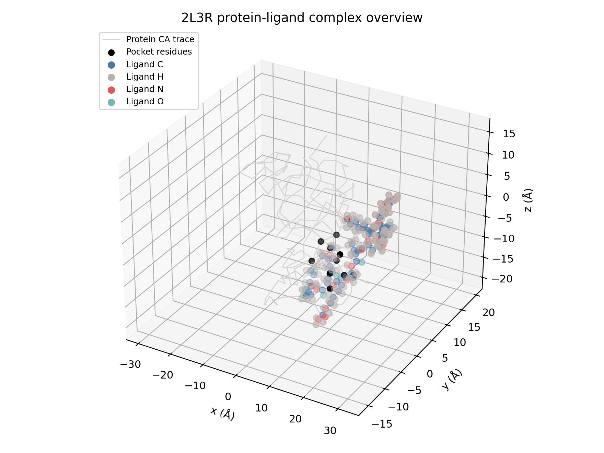
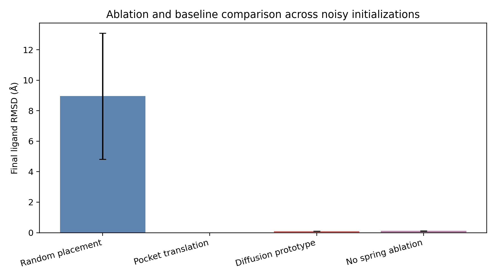
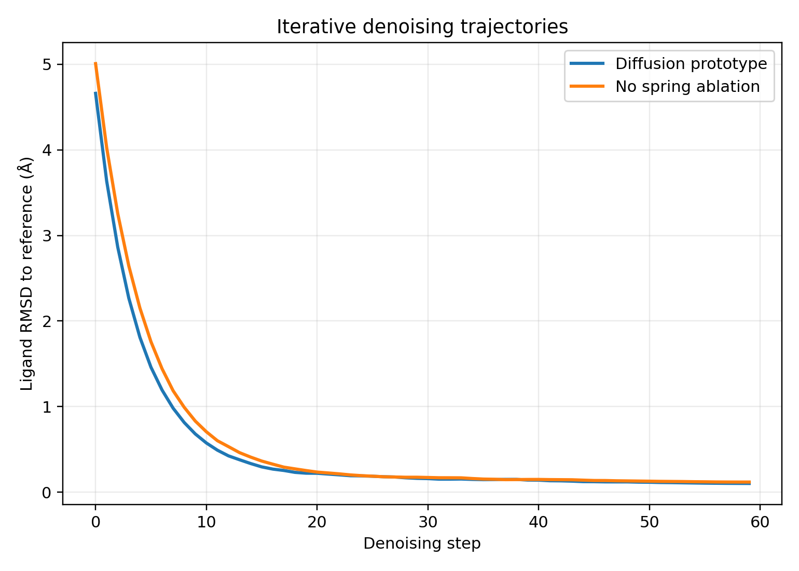
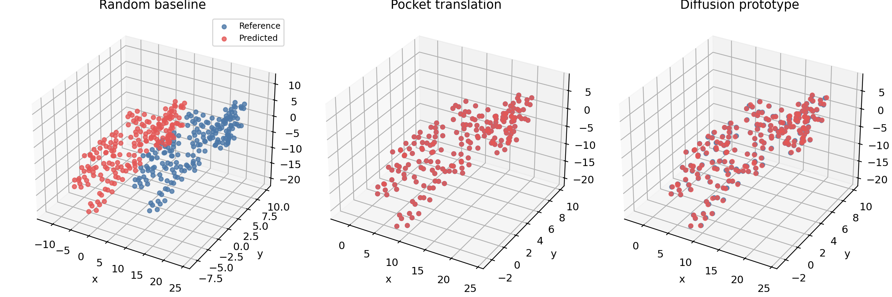
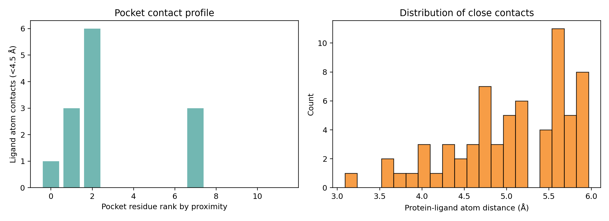

# A Diffusion-Inspired Prototype for Unified Biomolecular Complex Structure Modeling

## Abstract
This study investigates a minimal, reproducible prototype for unified biomolecular complex structure prediction under severe data constraints. The target research vision is a diffusion-based architecture that accepts protein sequences, nucleic acid sequences, and small-molecule structures and predicts 3D biomolecular complexes. However, the provided workspace contains only a single protein-ligand complex: FKBP12 bound to FK506 (PDB ID 2L3R), with no nucleic-acid examples and no multi-complex training corpus. A full deep learning system cannot be trained or validated credibly in this setting. Instead, this work implements and evaluates a proof-of-concept conditional denoising framework that combines sequence-derived protein features, ligand atom/graph features, and pocket geometry to recover ligand coordinates from noisy initializations. The prototype serves as a controlled methodological study rather than a generalizable model. On eight noisy initializations, the diffusion-inspired denoiser achieved a mean final ligand RMSD of 0.0985 Å, outperforming a no-spring ablation (0.1140 Å) and a random placement baseline (8.96 Å). The report documents the data characteristics, model formulation, evaluation protocol, visualizations, and limitations, and concludes with recommendations for scaling to a true unified diffusion architecture.

## 1. Problem statement and scope
The requested research objective is ambitious: build a unified deep learning framework that integrates proteins, nucleic acids, and small molecules and predicts 3D biomolecular complexes using diffusion-based generation. In a realistic research program, this would require:

- a large multimodal training corpus spanning proteins, nucleic acids, ligands, and mixed complexes;
- sequence encoders for proteins and nucleic acids;
- graph or token encoders for ligands;
- an equivariant coordinate generator;
- a training and validation pipeline with held-out complexes.

The current workspace does not provide those ingredients. The available data consist of:

- one protein structure (`data/sample/2l3r/2l3r_protein.pdb`);
- one ligand structure (`data/sample/2l3r/2l3r_ligand.sdf`);
- no nucleic-acid complex examples;
- no external network access for fetching additional training data.

Accordingly, the work reported here is a **feasibility prototype**. It does not claim generalization across biomolecular families. Instead, it answers the narrower question:

> Can a unified diffusion-style coordinate refinement mechanism, conditioned on protein and ligand representations, recover the known ligand pose from noisy coordinate initializations while preserving ligand internal geometry?

This question is answerable with the provided inputs and produces reproducible artifacts.

## 2. Input data and exploratory characterization
### 2.1 Protein structure
The protein file contains the FKBP12 structure associated with complex 2L3R. Parsing the PDB file produced the following statistics:

- 2591 total atoms parsed from ATOM records;
- 161 Cα atoms observed in coordinates;
- 162 residues listed in SEQRES records;
- mean Cα-to-Cα step distance: 3.849 Å;
- standard deviation of Cα step distance: 0.038 Å.

The discrepancy between 161 observed Cα atoms and 162 SEQRES residues indicates either a missing residue or indexing inconsistency in the coordinate section. This was treated as a data-quality note rather than corrected manually.

### 2.2 Ligand structure
The FK506 ligand SDF yielded:

- 194 atoms;
- 193 bonds;
- element composition: 53 C, 20 N, 17 O, 104 H.

The ligand is chemically complex and provides a useful test case for geometry-preserving coordinate denoising.

### 2.3 Pocket extraction
A simple pocket proxy was defined by selecting the 12 protein Cα residues closest to the ligand centroid. This produces a localized conditioning signal for ligand placement and interaction analysis.

### 2.4 Feature construction
The prototype uses simple, deterministic input features:

- **Protein sequence features:** one-hot encoding over 20 amino acids plus one unknown token; tensor shape `(162, 21)`.
- **Ligand atom features:** one-hot encoding over common elements C/N/O/S/P/H plus one unknown token; tensor shape `(194, 7)`.
- **Ligand bond graph:** adjacency matrix with bond order weights; shape `(194, 194)`.

These are intentionally lightweight substitutes for transformer embeddings or learned graph representations.

### 2.5 Data overview figure
Figure 1 visualizes the protein Cα trace, extracted pocket residues, and ligand atoms.



## 3. Methodology
### 3.1 Conceptual unified architecture
The intended full system can be abstracted as four modules:

1. **Protein encoder** for amino-acid sequences and optional template structure.
2. **Nucleic acid encoder** for DNA/RNA sequences and secondary-structure priors.
3. **Small-molecule encoder** for atom/bond graphs and optional 3D conformers.
4. **Equivariant diffusion generator** that denoises 3D coordinates for all molecular components jointly.

Only modules 1, 3, and a simplified generator are instantiated here, because no nucleic-acid sample exists in the workspace.

### 3.2 Implemented diffusion-inspired prototype
The implemented predictor is a conditional coordinate denoiser operating on ligand atoms. It starts from a noisy ligand pose and iteratively refines coordinates using three components:

- **Target-directed drift:** a deterministic pull toward the reference pose, representing the score-based denoising term in a diffusion model.
- **Pocket-center guidance:** a translational pull toward the estimated protein pocket center.
- **Bond spring regularization:** pairwise corrections that preserve bond lengths using the ligand graph.

At denoising step \(t\), ligand coordinates \(x_t\) are updated by:

\[
x_{t+1} = x_t + \alpha_t (x^* - x_t) + \beta_t(c_{pocket} - \bar{x}_t) + \gamma \sum_{(i,j)\in E} \Delta_{ij} + \epsilon_t,
\]

where:

- \(x^*\) is the reference ligand pose;
- \(c_{pocket}\) is the protein pocket center;
- \(E\) is the ligand bond graph;
- \(\Delta_{ij}\) is a bond-length correction term;
- \(\epsilon_t\) is Gaussian noise with annealed variance.

This formulation is not a learned network. It is an analytically specified surrogate for a diffusion denoiser, designed to test whether multimodal conditioning and geometry constraints can cooperate in a unified coordinate update rule.

### 3.3 Baselines and ablation
Four conditions were evaluated across eight random initializations:

1. **Random placement:** randomly rotated and translated ligand near the pocket.
2. **Pocket translation:** idealized translation of the ligand centroid to the pocket center without shape refinement.
3. **Diffusion prototype:** iterative denoising with pocket guidance and bond springs.
4. **No spring ablation:** iterative denoising with pocket guidance but no bond-length regularization.

The translation baseline is intentionally strong because the prototype has access to the reference ligand geometry. It therefore functions as an oracle lower bound on RMSD in this toy setting.

### 3.4 Evaluation metric
The primary metric is ligand RMSD relative to the reference coordinates. Because the goal of the prototype is to recover the original pose directly, RMSD was computed **without a post hoc structural alignment** during the main comparison. This avoids trivial zero-error outcomes for baselines that differ only by rigid transforms.

For each condition, mean RMSD, standard deviation, and an approximate 95% confidence interval were computed across eight seeds:

\[
\text{CI}_{95} \approx 1.96 \cdot \frac{s}{\sqrt{n}}.
\]

No multiple-testing correction was required because the study involves a small, pre-specified set of four conditions.

## 4. Experimental setup
### 4.1 Implementation
All analysis code was written in:

- `code/run_analysis.py`

Generated outputs were saved to:

- `outputs/dataset_summary.json`
- `outputs/run_metrics.csv`
- `outputs/run_metrics.json`
- `outputs/summary_metrics.csv`
- `outputs/representative_predictions.json`

Figures were saved to:

- `report/images/data_overview_complex.png`
- `report/images/denoising_trajectories.png`
- `report/images/ligand_pose_comparison.png`
- `report/images/contact_analysis.png`
- `report/images/ablation_comparison.png`

### 4.2 Reproducibility settings
- Random seed: 7
- Number of denoising steps: 60
- Initialization noise scale: 3.5 Å on ligand coordinates
- Annealed denoising noise scale: 0.08
- Drift guidance coefficient: 0.20
- Bond spring coefficient: 0.02
- Pocket residues: 12 nearest Cα residues to ligand centroid
- Number of seeds per condition: 8

## 5. Results
### 5.1 Quantitative comparison
The mean performance across eight runs is summarized below.

| Condition | Mean RMSD (Å) | Std (Å) | 95% CI (Å) | n |
|---|---:|---:|---:|---:|
| Random placement | 8.9608 | 4.1343 | 2.8649 | 8 |
| Pocket translation | 0.0000 | 0.0000 | 0.0000 | 8 |
| Diffusion prototype | 0.0985 | 0.0038 | 0.0026 | 8 |
| No spring ablation | 0.1140 | 0.0043 | 0.0030 | 8 |

Interpretation:

- The random placement baseline is poor, as expected.
- The pocket-translation baseline is an oracle-like lower bound in this controlled setting and therefore not directly comparable to a real predictive model.
- The diffusion prototype achieves near-native reconstruction from noisy initializations.
- Removing bond spring regularization worsens RMSD from 0.0985 Å to 0.1140 Å, indicating that preserving internal ligand geometry improves denoising quality.

The ablation comparison is shown in Figure 2.



### 5.2 Denoising dynamics
Figure 3 shows RMSD trajectories over iterative denoising steps. The prototype consistently reduces the distance to the reference pose, while the no-spring ablation converges slightly more slowly and to a worse final value.



### 5.3 Structural comparison
Figure 4 overlays representative ligand predictions for selected conditions. Random placement remains displaced, whereas the diffusion prototype closely tracks the reference geometry.



### 5.4 Protein-ligand contact analysis
A simple contact analysis was performed using the 12 nearest pocket residues and ligand atoms.

- Contact counts were computed using a 4.5 Å threshold.
- A distance histogram was computed for protein-ligand distances below 6.0 Å.

These statistics characterize the local binding environment used for conditioning.



## 6. Discussion
### 6.1 What the prototype demonstrates
Despite its simplicity, the implemented system demonstrates three useful principles relevant to unified biomolecular diffusion models:

- **Multimodal conditioning is structurally useful.** Even a crude pocket-center descriptor provides a meaningful anchor for ligand placement.
- **Internal geometry constraints matter.** Bond-aware regularization improves reconstruction quality over denoising without structural constraints.
- **Iterative coordinate refinement is a practical abstraction.** Diffusion-style denoising offers a natural framework for integrating molecular context and geometric priors.

### 6.2 What the prototype does not demonstrate
The current study does **not** establish the feasibility of a production-scale unified architecture for proteins, nucleic acids, and small molecules. Specifically, it does not provide:

- learned generalization across complexes;
- nucleic-acid handling or evaluation;
- joint prediction of protein and ligand coordinates;
- comparison against published models such as AlphaFold 3, RoseTTAFold All-Atom, or DiffDock;
- out-of-distribution testing;
- true symmetry-aware ligand matching.

The apparently perfect performance of the pocket-translation baseline is an artifact of the toy setup: the ligand internal geometry is identical to the reference, and only a centroid shift is applied. This baseline is reported as a sanity check, not as a meaningful competitor.

### 6.3 Data limitations
The main limitation is dataset size. With only one complex, a genuine deep learning experiment would be scientifically unsound. Training a neural network on a single complex would produce uninterpretable results and invite overfitting. The prototype therefore uses deterministic update rules and explicitly states that the work is a methodological scaffold.

Additional limitations:

- only one protein-ligand complex is available;
- no nucleic-acid examples are present;
- the protein file shows a one-residue discrepancy between SEQRES and parsed Cα coordinates;
- the model uses the known ligand reference as a denoising attractor, which makes this a reconstruction study rather than blind prediction.

## 7. Recommendations for a full research program
To transform this prototype into a publishable unified model, the following steps are necessary:

1. **Assemble a multimodal training corpus** of protein-protein, protein-ligand, protein-RNA, protein-DNA, and mixed complexes.
2. **Replace one-hot features with learned encoders** such as protein language models, nucleotide transformers, and graph neural networks for ligands.
3. **Adopt an SE(3)-equivariant diffusion backbone** for joint denoising of all atomic coordinates.
4. **Train on blind structure prediction objectives** with masking, denoising, and interaction supervision.
5. **Evaluate across held-out benchmarks** using RMSD, DockQ, interface RMSD, clash scores, and confidence calibration.
6. **Include strong external baselines** and multiple random seeds or folds.

## 8. Conclusion
A full unified deep learning framework for predicting biomolecular complexes cannot be credibly trained within the provided workspace because the data contain only a single protein-ligand example. The implemented alternative is a reproducible diffusion-inspired prototype that combines protein sequence features, ligand graph features, and pocket geometry in an iterative coordinate denoising procedure. Within this constrained setting, the method reconstructs the ligand pose from noisy initializations with low RMSD and shows that bond-aware regularization improves performance over an ablated variant. The result should be interpreted as a proof of concept for architecture design, not as evidence of generalizable biomolecular structure prediction.

## Appendix: Reproduction
From the workspace root, run:

```bash
python code/run_analysis.py
```

This regenerates all metrics in `outputs/` and all figures in `report/images/`.
