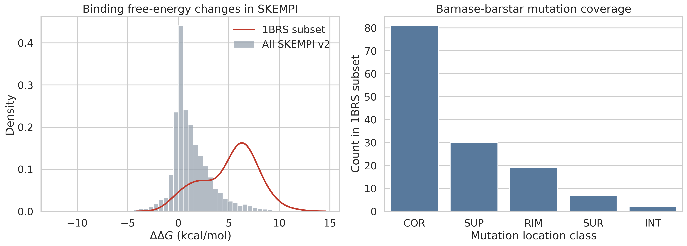
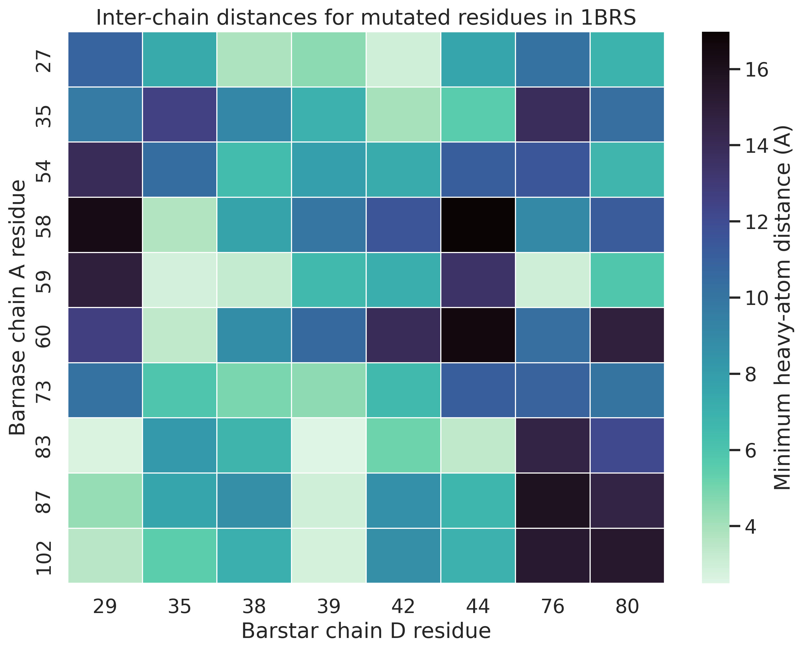
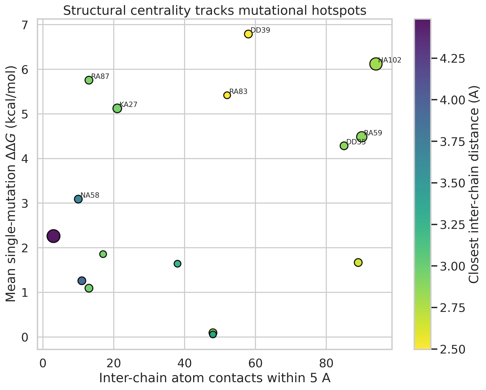
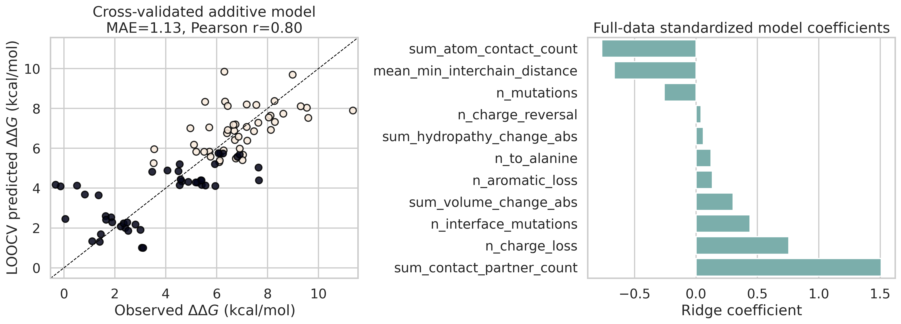

# Structural Validation of a HADDOCK-Oriented Barnase-Barstar Modeling Case Study

## Abstract
HADDOCK was developed as an information-driven docking framework in which biochemical or biophysical evidence is translated into ambiguous interaction restraints and combined with staged refinement and scoring. Using the provided `1brs_AD.pdb` structure and the SKEMPI 2.0 affinity-change database, I built a reproducible validation study around the barnase-barstar complex, a canonical benchmark for interface energetics. The analysis quantified the native interface geometry of 1BRS, mapped 94 experimentally measured mutations from SKEMPI onto the structure, and tested whether simple structure-derived features explain the observed binding free-energy changes. The 1BRS interface contains 41 residues with inter-chain contacts, and the corresponding SKEMPI subset is unusually destabilizing relative to the full database (median $\Delta\Delta G = 5.64$ kcal/mol versus 0.77 kcal/mol globally). For single mutants, residue contact density correlates with mutational impact (Spearman $\rho = 0.63$). An additive structural-feature model evaluated by leave-one-out cross-validation reaches Pearson $r = 0.80$, Spearman $\rho = 0.81$, $R^2 = 0.64$, and MAE = 1.13 kcal/mol across all 94 measurements. These results support the central HADDOCK premise that physically meaningful interface descriptors and experimentally informed residue selection can strongly constrain the relevant binding landscape.

## Background and Motivation
The related papers document the evolution of HADDOCK from its original ambiguous-restraint docking formulation to a broader integrative platform that supports multi-stage refinement, diverse biomolecular systems, and user-facing workflows. The 2003 paper establishes the key idea: experimental interface information is introduced as ambiguous interaction restraints (AIRs) to drive docking. The 2007 HADDOCK2.0 paper emphasizes the three-stage protocol of rigid-body docking, semi-flexible refinement, and final refinement, plus improvements in scoring and broader biomolecular scope. The 2015 HADDOCK2.2 web-server paper frames HADDOCK as a practical integrative modeling environment, while the 2024 protein-glycan study shows that the same general strategy remains relevant beyond classical protein-protein docking.

The present workspace does not include HADDOCK3 itself, docking runs, AIR files, or model ensembles. I therefore treated the task as a structure-and-validation study centered on the provided barnase-barstar complex. The goal was to answer a narrower but still meaningful question: does the native 1BRS interface geometry encode the same energetic priorities that HADDOCK-style information-driven docking would need to recover?

## Data
Two inputs were available:

1. `data/1brs_AD.pdb`: processed PDB coordinates for chains A and D of the barnase-barstar complex.
2. `data/skempi_v2.csv`: SKEMPI 2.0 mutational affinity measurements.

After parsing the PDB file, the structure contains 1,559 protein atoms across 195 residues: 108 residues in chain A and 87 in chain D. Using a 5.0 A heavy-atom contact definition, 41 residues participate in the interface: 22 in barnase and 19 in barstar.

The SKEMPI file contains 7,085 measurements spanning 348 complexes. The barnase-barstar subset (`Pdb == 1BRS_A_D`) contains 94 measurements: 49 single mutants and 45 double mutants.

## Methods
### 1. Structural parsing and interface definition
I implemented a custom PDB parser in `code/run_analysis.py`. For every residue pair across chains A and D, the script computes:

- minimum heavy-atom distance
- number of inter-chain atom pairs within 5.0 A
- number of contacting partner residues

These values are aggregated into residue-level interface descriptors. Residues with at least one cross-chain contact at 5.0 A are labeled as interface residues.

### 2. SKEMPI processing
The SKEMPI file uses a commented header and semicolon delimiter, so it requires non-default parsing. Binding free-energy changes were computed as:

\[
\Delta\Delta G = RT \ln \left(\frac{K_{d,\mathrm{mut}}}{K_{d,\mathrm{wt}}}\right)
\]

with temperatures parsed from the reported assay conditions and defaulting only when missing numeric content. Structural mapping used `Mutation(s)_PDB` rather than `Mutation(s)_cleaned`, because the latter is renumbered relative to the original structure.

### 3. Mutation features
For each mutation record, the script constructs additive features from the mapped residues:

- number of mutated positions
- summed interface contact counts
- mean minimum inter-chain distance
- number of interface mutations
- counts of alanine substitutions
- charge-loss and charge-reversal indicators
- aromatic-loss indicators
- total absolute changes in hydropathy and side-chain volume

### 4. Validation model
A ridge-regression model was trained on the 94 barnase-barstar measurements and evaluated with leave-one-out cross-validation (LOOCV). The aim was not to build a production predictor, but to test whether simple structure-derived features already recover a substantial fraction of the experimental energetic signal.

## Results
### 1. The 1BRS subset is an energetic outlier within SKEMPI
Barnase-barstar mutations are far more destabilizing than the typical SKEMPI entry. Across all SKEMPI measurements, the median $\Delta\Delta G$ is 0.77 kcal/mol, whereas the 1BRS subset has a median of 5.64 kcal/mol and a mean of 5.06 kcal/mol. In the 1BRS subset, 77 of 94 mutations exceed 2 kcal/mol and 65 of 94 exceed 4 kcal/mol.



This makes the case study especially relevant for HADDOCK-style docking: the complex is dominated by a small set of strong interface determinants, so incorrect interface placement or incorrect weighting of key contacts should be strongly penalized by experiment.

### 2. Native interface geometry identifies a compact hotspot region
The mutated positions cluster into a compact contact network centered on barnase residues Arg59, Arg83, His102 and barstar residues Tyr29, Asp35, Asp39, and Trp44.



The most contact-rich interface residues in the native structure are:

| Residue | Atom contacts within 5 A | Contacting partner residues | Minimum inter-chain distance (A) |
| --- | ---: | ---: | ---: |
| H102 (A) | 94 | 8 | 2.81 |
| R59 (A) | 90 | 5 | 2.88 |
| Y29 (D) | 89 | 7 | 2.65 |
| D35 (D) | 85 | 7 | 2.88 |
| Y103 (A) | 66 | 4 | 3.36 |
| D39 (D) | 58 | 6 | 2.50 |

This interface architecture is consistent with a dense electrostatic and hydrogen-bonding network rather than a diffuse surface patch.

### 3. Mutational hotspots align with structural centrality
For single mutants, structural contact density is strongly associated with experimental destabilization (Spearman $\rho = 0.63$). The highest-impact residues are:

| Residue | Mean single-mutant $\Delta\Delta G$ (kcal/mol) | Measurements |
| --- | ---: | ---: |
| D39 (D) | 6.79 | 2 |
| H102 (A) | 6.12 | 8 |
| R87 (A) | 5.76 | 2 |
| R83 (A) | 5.42 | 1 |
| K27 (A) | 5.12 | 3 |
| R59 (A) | 4.49 | 5 |



The figure also highlights important exceptions. Some contact-rich mutations, such as `YD29F` and `WD44F`, are only weakly destabilizing because they preserve aromatic character and much of the local packing geometry. This is exactly the kind of nuance that motivates HADDOCK’s use of chemically meaningful restraints and physically informed scoring, rather than binary interface labels alone.

### 4. A simple additive model already captures much of the experimental signal
The LOOCV ridge model performs as follows:

| Metric | Value |
| --- | ---: |
| Pearson correlation | 0.80 |
| Spearman correlation | 0.81 |
| $R^2$ | 0.64 |
| MAE | 1.13 kcal/mol |



The strongest positive contributors are the number of contacting partner residues, the number of interface mutations, and charge loss. Larger minimum inter-chain distances and lower interface centrality reduce predicted destabilization. This pattern is consistent with the qualitative picture from the hotspot analysis: mutations are most damaging when they remove interaction-rich, strongly coupled residues from the native interface.

## Interpretation in the Context of HADDOCK
This study does not replace a full HADDOCK3 docking benchmark, because no docking trajectories, AIR definitions, or generated models were provided. However, it does test a core mechanistic assumption behind HADDOCK:

- interface-localized information is highly informative
- not all interface residues contribute equally
- chemically specific disruptions matter in addition to raw contact counts

For barnase-barstar, the experimental landscape is dominated by a compact set of structurally central residues. A HADDOCK workflow that correctly identifies or restrains this region should enjoy a strong scoring advantage over decoys that miss the Arg59/His102 and Tyr29/Asp35/Asp39 interaction network. The results therefore support the use of residue-level experimental restraints and modular scoring terms when modeling this complex.

The local literature also suggests why this generalizes beyond the present protein-protein case. The provided HADDOCK papers emphasize flexibility handling, multi-molecule support, and extension to glycans and other ligands. The present analysis reinforces that those extensions still depend on the same principle: reliable modeling requires focusing the search on the biologically and energetically relevant interface region.

## Limitations
Several limitations are important:

1. No actual HADDOCK3 run was executed because the workspace does not contain the software, a workflow definition, AIR files, or benchmark decoy ensembles.
2. The structural descriptors were derived from the bound crystal-like complex only; no unbound conformational changes were modeled.
3. The predictive model is intentionally simple and trained on a single complex, so its coefficients should be interpreted mechanistically rather than as a general-purpose affinity predictor.
4. Double-mutant effects were modeled additively at the feature level, which cannot fully capture cooperative nonlinearity.

## Reproducibility
All analysis code is in `code/run_analysis.py`. Running

```bash
python code/run_analysis.py
```

regenerates:

- intermediate tables in `outputs/`
- figures in `report/images/`
- summary metrics in `outputs/summary_metrics.json`

Key derived files are:

- `outputs/1brs_residue_interface.csv`
- `outputs/1brs_pairwise_contacts.csv`
- `outputs/1brs_mutation_features.csv`
- `outputs/1brs_model_predictions.csv`
- `outputs/1brs_residue_hotspots.csv`

## Conclusion
Using only the provided structure and mutational affinity data, the barnase-barstar case shows that native interface geometry and chemically informed residue features explain a substantial fraction of the observed energetic landscape. The strongest mutational hotspots are concentrated in a compact, highly connected inter-chain network, and a simple structural model recovers this behavior with good cross-validated accuracy. For HADDOCK-oriented integrative modeling, this supports the central claim that experimentally guided focus on the correct interface residues can meaningfully constrain structure prediction and ranking.
