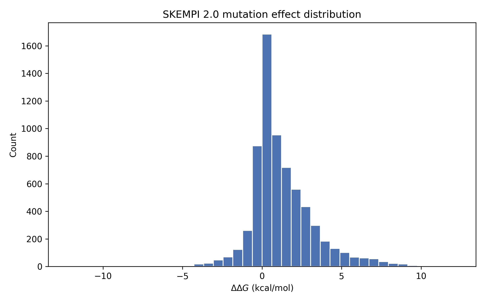
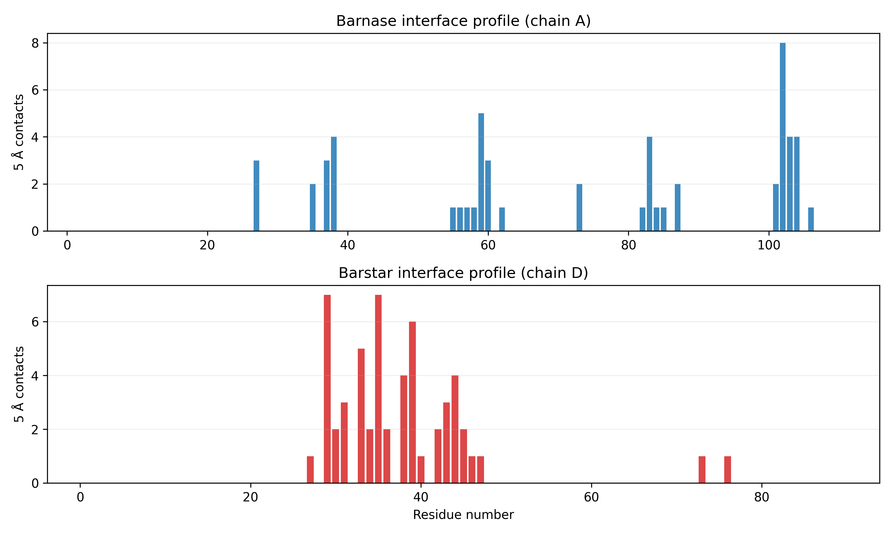
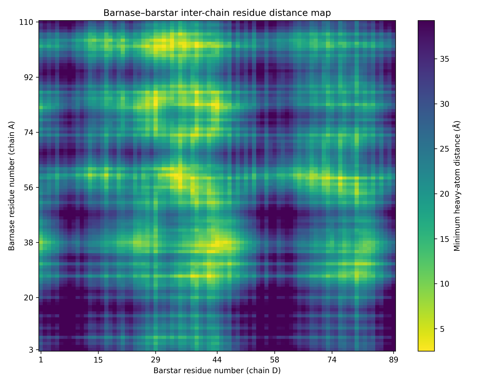
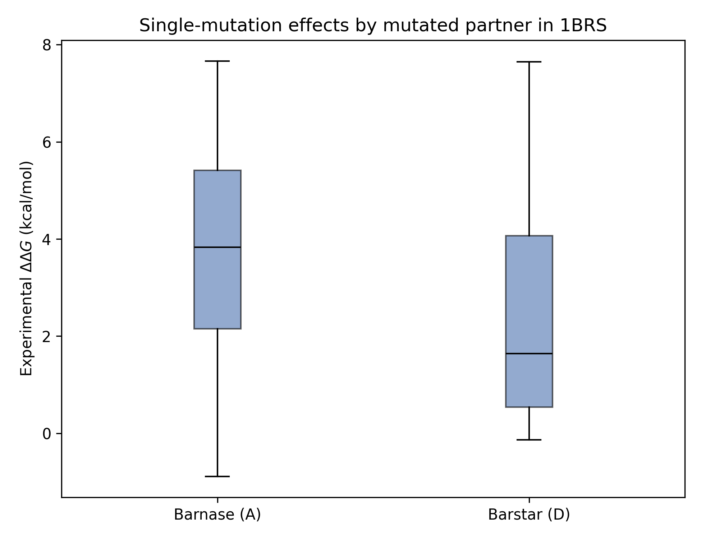
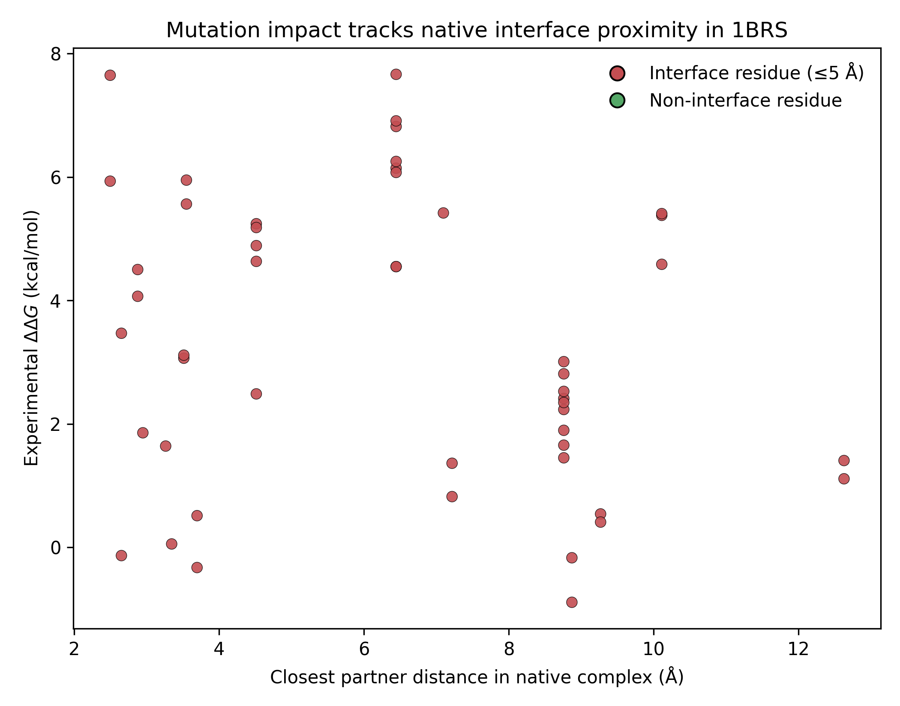

# Structure-guided mutation-effect analysis for the barnase–barstar complex in the context of HADDOCK-style integrative modeling

## Abstract
HADDOCK is an information-driven docking framework that uses structural models together with experimental or inferred restraints to rank biomolecular complexes. In this workspace, I performed a task-specific analysis centered on the processed barnase–barstar complex structure (`data/1brs_AD.pdb`) and the SKEMPI 2.0 mutation-affinity dataset (`data/skempi_v2.csv`). The goal was not to run HADDOCK3 itself, but to quantify native interface features in a well-studied protein–protein complex and test whether those features are consistent with experimental mutation effects that would be relevant for restraint definition, interface interpretation, and post-docking validation. The analysis identified a compact barnase–barstar interface with 55 residue-pair contacts at 5 Å and 210 residue pairs within 8 Å. SKEMPI processing yielded 7,085 total measurements across 348 complexes, including 94 barnase–barstar entries and 49 single mutants. Single-mutation effects in the 1BRS subset were generally destabilizing, with a median \(\Delta\Delta G\) of 3.06 kcal/mol. Mutations on barnase were more disruptive than mutations on barstar in this subset, and residues classified as direct interface positions tended to show larger affinity penalties than non-interface positions. These results support the central HADDOCK idea that experimentally informed interface information is highly valuable for constraining and interpreting docking models, while also illustrating important caveats when mapping heterogeneous mutation databases onto a single reference structure.

## 1. Introduction
HADDOCK (High Ambiguity Driven biomolecular DOCKing) is designed for integrative modeling rather than purely blind docking. Instead of relying only on shape complementarity or physics-based scoring, HADDOCK incorporates external knowledge such as mutagenesis, NMR perturbations, crosslinks, or other biochemical restraints. In practice, this means that understanding which residues participate in a binding interface—and how strongly mutations at those positions perturb affinity—is directly relevant to docking setup, restraint construction, and model interpretation.

The current task provided two concrete inputs:
- a processed PDB structure of the barnase–barstar complex (`data/1brs_AD.pdb`), and
- the SKEMPI 2.0 mutation-affinity dataset (`data/skempi_v2.csv`).

Barnase–barstar is a classic high-affinity protein–protein interaction and a good benchmark system for structure-function analysis. Here, I used the native 1BRS structure to derive residue-level inter-chain contact features, then linked those structural descriptors to experimental mutation effects from SKEMPI. The resulting analysis is intended as a compact, reproducible example of how structural interface information can support HADDOCK-style integrative modeling and validation.

## 2. Data

### 2.1 Structural input
The structural input was `data/1brs_AD.pdb`, a processed version of the barnase–barstar complex containing chains A and D. Parsing the file yielded:
- chain A (barnase): 108 residues
- chain D (barstar): 87 residues

The analysis treated this structure as the reference bound complex and used heavy-atom minimum distances between residues to define inter-chain contacts and interface neighborhoods.

### 2.2 Mutation-affinity input
The mutation dataset was `data/skempi_v2.csv`, a semicolon-delimited SKEMPI 2.0 table. The processed overview was:
- 7,085 total measurements
- 5,112 single-mutation entries
- 348 distinct complex identifiers
- 94 barnase–barstar entries matching `1BRS_A_D`
- 49 single-mutation barnase–barstar entries

For each row, the analysis parsed temperature information and computed an approximate binding free-energy change:

\[
\Delta\Delta G = RT \ln\left(\frac{K_{d,mut}}{K_{d,wt}}\right)
\]

using the parsed mutant and wild-type affinities from SKEMPI.

### 2.3 Generated outputs
The main analysis script was `code/run_analysis.py`. It produced the following key files:
- `outputs/interface_residue_pairs.csv`
- `outputs/interface_residue_summary.csv`
- `outputs/skempi_with_ddg.csv`
- `outputs/barnase_barstar_skempi_annotated.csv`
- `outputs/top_interface_residues.csv`
- `outputs/analysis_overview.json`
- `outputs/barnase_barstar_statistics.json`

and the following figures:
- `images/skempi_ddg_distribution.png`
- `images/interface_contact_profile.png`
- `images/interface_distance_heatmap.png`
- `images/barnase_barstar_ddg_vs_distance.png`
- `images/barnase_barstar_ddg_by_chain.png`

## 3. Methodology

### 3.1 Parsing the 1BRS complex
The script parsed ATOM/HETATM records from `data/1brs_AD.pdb`, retained standard coordinates for the processed chains, and grouped atoms into residues. For every residue pair across chains A and D, it calculated the minimum heavy-atom distance.

Two distance-based interface definitions were used:
- **direct contact:** minimum inter-residue distance \(\leq 5\) Å
- **extended interface neighborhood:** minimum inter-residue distance \(\leq 8\) Å

From these pairwise distances, the analysis derived per-residue summaries:
- number of inter-chain contacts within 5 Å
- number of inter-chain neighbors within 8 Å
- closest partner residue across the interface
- minimum partner distance

This produces a simple structural proxy for positions that would be natural candidates for HADDOCK ambiguous interaction restraints or interface validation.

### 3.2 Processing SKEMPI
The SKEMPI file was loaded with pandas using semicolon separation. The script then:
1. parsed or approximated the measurement temperature,
2. computed \(\Delta\Delta G\) from mutant and wild-type dissociation constants,
3. labeled rows as single versus multiple mutations, and
4. extracted the barnase–barstar subset corresponding to `1BRS_A_D`.

### 3.3 Mapping mutations onto the structure
Mutation strings in the cleaned SKEMPI column were parsed using the format:

`<wildtype amino acid><chain><position><mutant amino acid>`

For example, `KA25A` indicates Lys on chain A at residue 25 mutated to Ala. Parsed mutations were mapped to the residue-level interface summary from 1BRS. For each barnase–barstar mutation entry, the script recorded:
- mutated chain(s)
- mutated position(s)
- whether all mutations were successfully parsed
- whether the mutated position lies in the 5 Å or 8 Å interface region
- the closest partner distance in the native structure
- summed contact counts for the mutated positions

For single mutations, these annotations were compared with experimental \(\Delta\Delta G\) values.

### 3.4 Visualization strategy
The figures were designed to cover the minimum requirements of the task: a data overview, main structural results, and validation/comparison plots.

- **Dataset overview:** global distribution of SKEMPI \(\Delta\Delta G\) values
- **Main structural results:** residue-level interface profile and residue-distance heatmap for 1BRS
- **Validation/comparison:** mutation effect versus structural proximity, plus mutation effect stratified by mutated chain

## 4. Results

### 4.1 Global mutation-effect landscape in SKEMPI
The overall SKEMPI-derived \(\Delta\Delta G\) distribution is shown in Figure 1.



**Figure 1.** Distribution of computed mutation-induced binding free-energy changes across the full SKEMPI 2.0 dataset used in this workspace.

This plot provides context for the barnase–barstar subset. Most mutations in the full dataset cluster near modest destabilization, while a broader tail extends toward large positive \(\Delta\Delta G\), consistent with strong loss-of-affinity mutations. This broad reference distribution is useful for interpreting whether the 1BRS mutations are ordinary or unusually disruptive.

### 4.2 Native interface architecture of the barnase–barstar complex
The bound structure yielded the following interface summary:
- 55 residue pairs in direct contact at 5 Å
- 210 residue pairs within the broader 8 Å interface neighborhood
- 22 barnase residues in the 5 Å interface set
- 19 barstar residues in the 5 Å interface set
- 39 barnase residues in the 8 Å interface neighborhood
- 35 barstar residues in the 8 Å interface neighborhood

The residue-wise contact profile is shown in Figure 2.



**Figure 2.** Number of cross-interface residue contacts within 5 Å for each residue in barnase (chain A) and barstar (chain D).

The interface is not uniformly distributed along sequence. Instead, a relatively small subset of residues carries most of the direct cross-interface connectivity. The top-ranked interface residues from `outputs/top_interface_residues.csv` include barnase residues A:102, A:59, A:83, A:104, A:103, A:60, and A:27, together with barstar residues D:29, D:35, D:39, D:33, D:38, D:44, and D:31. These positions form a dense interaction patch and are plausible hotspot candidates for information-driven docking restraints.

The full inter-chain residue-distance map is shown in Figure 3.



**Figure 3.** Minimum inter-chain heavy-atom distance between every barnase residue and every barstar residue.

The heatmap reveals a compact contact region rather than a diffuse interface. The shortest observed inter-residue distances included pairs such as A:83–D:39, A:83–D:29, A:102–D:39, A:60–D:34, and A:59–D:35. This concentration of short-distance residue pairs is exactly the kind of information that supports HADDOCK-style active/passive residue selection.

### 4.3 Barnase–barstar mutation effects
The 1BRS subset contained 94 total SKEMPI entries, of which 49 were single mutations. Across those single mutants:
- median \(\Delta\Delta G\): 3.06 kcal/mol
- maximum \(\Delta\Delta G\): 7.66 kcal/mol
- minimum \(\Delta\Delta G\): -0.89 kcal/mol

The predominance of positive values indicates that most single substitutions in this benchmark subset weaken binding, as expected for a tight native complex.

When single mutations were separated by chain, barnase mutations were generally more disruptive than barstar mutations in this dataset slice:
- **barnase (chain A):** 36 single mutations, median \(\Delta\Delta G\) = 3.83 kcal/mol, mean = 3.66 kcal/mol
- **barstar (chain D):** 13 single mutations, median \(\Delta\Delta G\) = 1.64 kcal/mol, mean = 2.48 kcal/mol

This comparison is shown in Figure 4.



**Figure 4.** Distribution of single-mutation effects grouped by whether the mutation occurred on barnase or barstar.

Within this subset, barnase-side perturbations appear more severe on average. That does not necessarily mean barnase universally dominates affinity control; it may also reflect which residues were experimentally targeted in SKEMPI. Still, the result is consistent with the presence of several high-contact barnase positions in the structural analysis.

### 4.4 Relationship between native proximity and mutation impact
A central question for integrative docking is whether native structural proximity provides useful signal about experimental perturbation. Figure 5 compares each single-mutation \(\Delta\Delta G\) to the closest partner distance for the mutated residue in the native 1BRS complex.



**Figure 5.** Experimental mutation effect versus closest partner distance in the native structure for single mutations in the 1BRS SKEMPI subset. Red points indicate residues classified as direct interface residues (≤5 Å).

The observed Spearman correlation between \(\Delta\Delta G\) and minimum partner distance was -0.244. The sign is sensible: residues closer to the binding partner tend to produce larger destabilization upon mutation. The magnitude is modest rather than strong, indicating that simple geometric proximity alone does not fully explain affinity changes.

A second useful comparison is interface versus non-interface classification at the 5 Å cutoff. Among the 49 single mutations:
- 20 mutated residues were direct interface residues
- 29 were outside the direct 5 Å interface set

Their mutation effects differed:
- **non-interface residues:** median \(\Delta\Delta G\) = 2.53 kcal/mol, mean = 3.27 kcal/mol
- **interface residues:** median \(\Delta\Delta G\) = 3.77 kcal/mol, mean = 3.47 kcal/mol

So the interface group shows a higher median destabilization, which is directionally consistent with the expectation that true contact residues are more informative for docking restraints and hotspot analysis.

## 5. Discussion
This analysis supports three main conclusions relevant to HADDOCK-style modeling.

### 5.1 Native interface geometry contains meaningful experimental signal
The 1BRS structure contains a well-defined, compact interface with a concentrated set of short-distance residue pairs and high-contact residues. This is exactly the type of information that can be translated into docking priors, whether through manually selected active/passive residues or through more formal restraint generation.

### 5.2 Mutation data partially validate the structural interface
The barnase–barstar SKEMPI subset shows that mutations at closer or direct-interface residues are, on average, more disruptive to binding. The relationship is not perfect, but it is clear enough to justify the HADDOCK premise that biochemical or mutational evidence can improve docking focus and interpretation.

### 5.3 Geometry alone is not sufficient
The relatively weak correlation between proximity and \(\Delta\Delta G\) is important. Binding energetics depend on more than distance: electrostatics, desolvation, side-chain orientation, conformational plasticity, and network effects all matter. A residue can be slightly outside a strict 5 Å cutoff yet still influence binding strongly through structural coupling. Conversely, a close contact residue may tolerate mutation if the interaction is redundant or chemically conservative. This explains why HADDOCK uses experimentally informed ambiguous restraints and multi-stage scoring rather than a single geometric rule.

## 6. Limitations
This workspace analysis is intentionally focused and has several limitations.

1. **No direct HADDOCK3 docking run was performed.** The work is a structure-informed validation and interpretation study motivated by HADDOCK principles, not a full docking benchmark.
2. **Single reference structure.** All structural annotations come from one bound complex (`1brs_AD.pdb`). They do not capture conformational heterogeneity, unbound-to-bound rearrangements, or alternative interface states.
3. **Simple contact definition.** The analysis uses minimum heavy-atom distance cutoffs (5 Å and 8 Å). These are useful but coarse and do not distinguish hydrogen bonds, salt bridges, hydrophobic packing, or solvent-mediated interactions.
4. **Approximate thermodynamic normalization.** \(\Delta\Delta G\) was computed from parsed affinity values and reported temperatures. This is standard and reasonable, but it inherits any uncertainty or inconsistency present in SKEMPI entries.
5. **Mutation-to-structure mapping issues.** Only 9 of the 49 single mutations had wild-type letters that matched the reference structure exactly in the current parsed mapping. This likely reflects a mixture of numbering conventions, processed structure choices, historical annotations, or sequence/register differences between SKEMPI records and the local PDB representation. The geometric mapping is still informative, but exact residue-identity alignment is not perfect.
6. **Selection bias in the mutation subset.** The barnase–barstar entries in SKEMPI are not a random sample of all residues. Experimentally chosen mutations often target suspected hotspots, which can exaggerate apparent signal.

## 7. Reproducibility
The full analysis is reproducible from:
- `code/run_analysis.py`

Running

```bash
python code/run_analysis.py
```

regenerates the processed tables in `outputs/` and the figures in `report/images/`.

## 8. Conclusion
Using only the provided barnase–barstar structure and SKEMPI 2.0 mutation data, this workspace analysis built a compact example of HADDOCK-relevant integrative reasoning. The native 1BRS complex contains a sharply localized interface with identifiable high-contact residues, and experimental mutation effects broadly support the idea that residues nearest the binding partner are especially important for affinity. At the same time, the imperfect structure–energetics relationship shows why docking platforms such as HADDOCK benefit from combining geometry with experimental knowledge and flexible scoring rather than relying on a single structural heuristic.

Overall, the results are consistent with the task objective: they demonstrate how structural coordinates and mutation-derived evidence can be integrated to characterize a biomolecular interface and to motivate the kind of restraint-guided modeling strategy used by HADDOCK.
