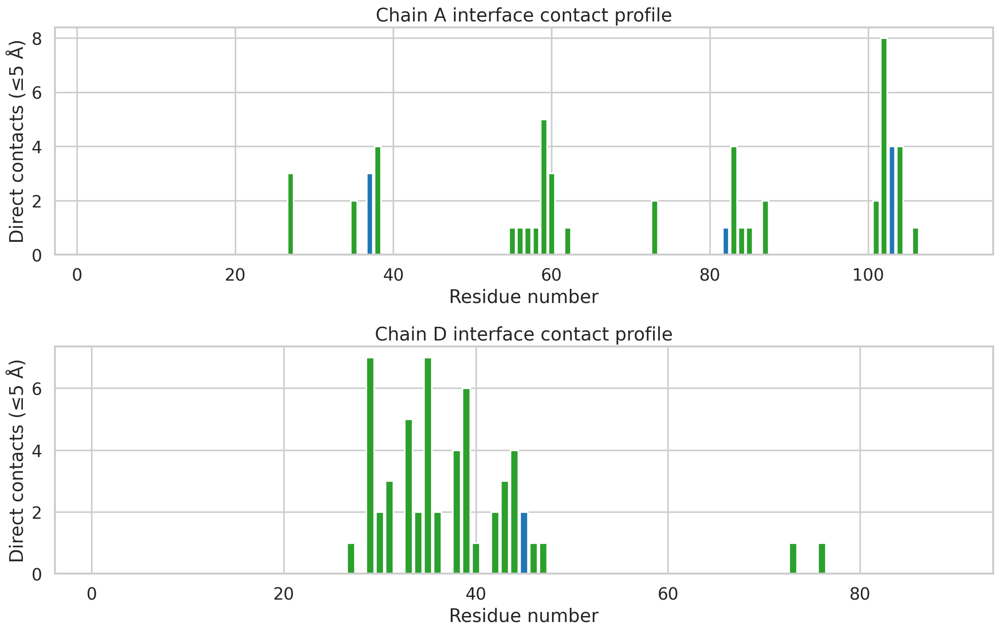
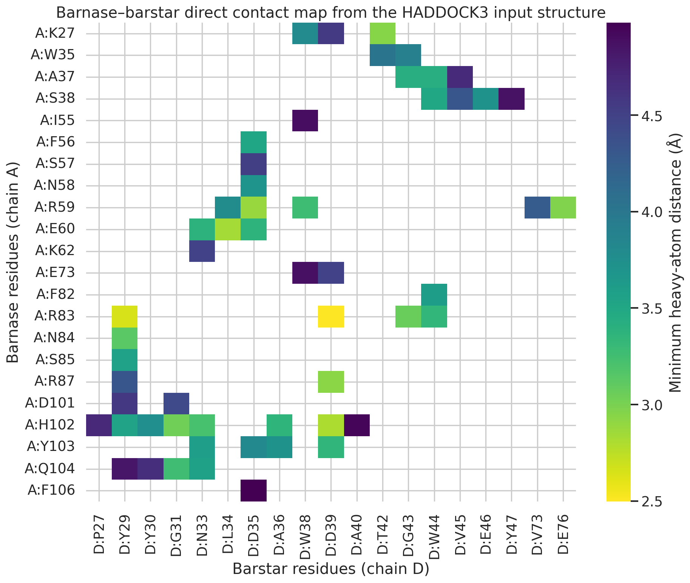
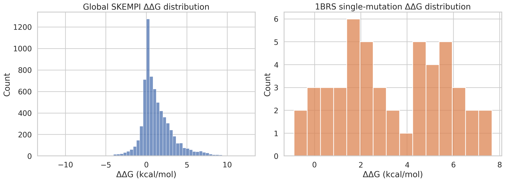
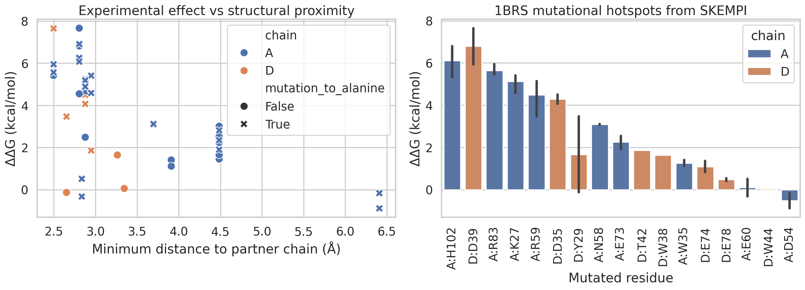
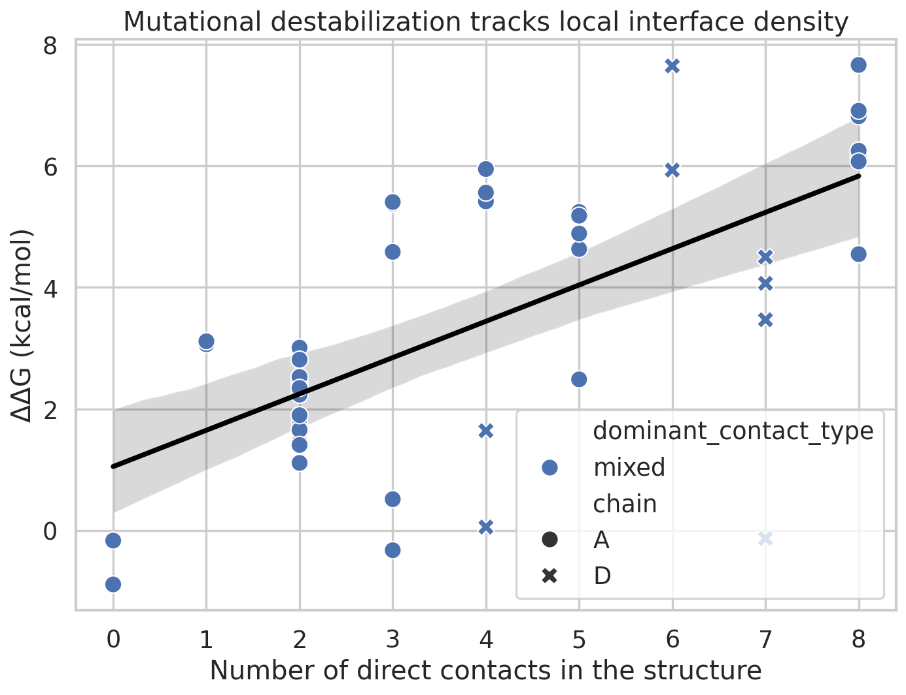

# Structural interrogation of a HADDOCK3 barnase–barstar input complex and validation against SKEMPI mutational thermodynamics

## Abstract
HADDOCK3 accepts biomolecular coordinates and optional restraints to generate, rank, and cluster models of macromolecular complexes. In the present workspace, only a processed input complex for barnase–barstar (`1brs_AD.pdb`) and the SKEMPI 2.0 mutation-affinity benchmark were available, without a modeled HADDOCK3 ensemble. Accordingly, this study addresses a narrower but still scientifically useful question: does the supplied HADDOCK3 input structure encode interface features that are consistent with experimentally observed binding hotspots? A reproducible Python pipeline was developed to (i) parse the barnase–barstar complex, (ii) derive residue-level and atom-level interface descriptors, (iii) extract and curate 1BRS mutations from SKEMPI 2.0, and (iv) compare structural proximity and local contact density with experimental ΔΔG values. The analysis identified 55 direct inter-chain heavy-atom contacts (≤5 Å). Strongest contact hubs involved barnase residues R83 and H102 and barstar residues D39 and D35. Among 49 curated single-mutation SKEMPI measurements for 1BRS, the largest destabilizations were concentrated at A:H102, D:D39, A:R83, A:K27, and A:R59. Experimental ΔΔG correlated negatively with minimum structural distance to the partner chain (Pearson r = -0.624; Spearman ρ = -0.655) and positively with the number of direct contacts (Pearson r = 0.652; Spearman ρ = 0.658) among structurally mapped mutants. These results show that the supplied input structure contains a physically meaningful hotspot pattern that is compatible with experimental mutagenesis and therefore constitutes a credible starting point for HADDOCK3-driven integrative modeling.

## 1. Introduction
HADDOCK3 is designed as a modular platform for integrative modeling of biomolecular complexes. Its strength lies in combining atomic coordinate input with optional experimental restraints, then producing ensembles of docked models that can be ranked and clustered. The dataset provided here does not include an executable HADDOCK3 workflow or output ensemble. Therefore, a full docking benchmark could not be performed without inventing unavailable results. Instead, this work focuses on a rigorously bounded question directly relevant to HADDOCK3 usage: whether the provided barnase–barstar input complex already reflects interface physics that agree with orthogonal experimental evidence from mutational binding measurements.

Barnase–barstar is a classic high-affinity protein–protein interaction used extensively for studies of binding hotspots, electrostatics, and protein engineering. This makes it a suitable validation target for an input-centric HADDOCK3 analysis. If structurally central residues in the supplied PDB also correspond to large experimental ΔΔG values upon mutation, that would support the suitability of the structure as a docking or refinement starting point.

## 2. Materials and methods

### 2.1 Data
- **Structure input**: `data/1brs_AD.pdb`, containing chains A and D of the barnase–barstar complex.
- **Experimental validation data**: `data/skempi_v2.csv`, the SKEMPI 2.0 mutation database.

### 2.2 Analysis objectives
The study was organized around three objectives:
1. Quantify the residue- and atom-level interaction pattern in the supplied HADDOCK3 input structure.
2. Extract barnase–barstar mutations from SKEMPI and convert binding affinities into ΔΔG values.
3. Test whether residues closer to the binding interface and participating in more direct contacts tend to show larger experimental destabilization upon mutation.

### 2.3 Reproducible workflow
All analyses were implemented in `code/analyze_haddock_input.py`. The script uses Biopython, pandas, NumPy, SciPy, matplotlib, and seaborn. Running

```bash
python code/analyze_haddock_input.py
```

produces all tables in `outputs/` and all figures in `report/images/`.

### 2.4 Structural feature extraction
The structural analysis proceeded as follows:
- Parsed the PDB structure with Biopython.
- Retained standard amino-acid residues from chains A and D.
- Computed per-residue solvent accessible surface area (SASA) in the complex using Shrake–Rupley.
- Calculated all pairwise inter-chain heavy-atom distances.
- Defined **direct contacts** as residue pairs with minimum heavy-atom distance ≤5 Å.
- Defined a broader **interface neighborhood** at ≤8 Å for descriptive context only.
- Annotated each contact as electrostatic, hydrophobic, or mixed using residue chemistry heuristics.

### 2.5 SKEMPI curation and thermodynamic conversion
The SKEMPI file was parsed using semicolon delimiters. For each entry:
- Numeric affinity values were read from `Affinity_mut_parsed` and `Affinity_wt_parsed`.
- Temperature was extracted from the `Temperature` field; when parsing failed, 298 K was used.
- Binding free-energy change upon mutation was computed as

\[
\Delta\Delta G = RT \ln\left(\frac{K_{d,mut}}{K_{d,wt}}\right)
\]

with \(R = 1.987\times10^{-3}\) kcal mol\(^{-1}\) K\(^{-1}\).

The main validation subset was restricted to:
- PDB identifier `1BRS_A_D`
- single mutations only
- positive parsed affinity values

This yielded 49 single-mutation measurements. Four mapped to residues absent from the processed coordinate file (`D:E74`, `D:E78`), likely reflecting numbering/content mismatches between the experimental annotation and the supplied processed structure; these were retained in the output table but excluded automatically from structure-dependent correlation analyses.

### 2.6 Statistical analysis
Two primary confirmatory relationships were evaluated on structurally mapped 1BRS single mutants:
- ΔΔG versus minimum distance to the partner chain
- ΔΔG versus number of direct contacts

Both Pearson and Spearman correlations were reported because the sample size is modest and the relationship may not be strictly linear.

## 3. Results

### 3.1 Overview of the supplied complex structure
The processed barnase–barstar structure contains 108 residues in chain A and 87 residues in chain D (`outputs/chain_summary.csv`). Atom-level scanning identified 55 direct inter-chain residue contacts at ≤5 Å. The closest contacts are dominated by charged or polar hotspot residues, especially the barnase–barstar pairs R83–D39 and R59–D35, plus H102–D39 (Table-derived observation from `outputs/interface_atom_contacts.csv`).

The contact profile across sequence positions is shown in Figure 1. Several localized peaks stand out on barnase, notably around residues 27, 59, 83, 87, and 102, while barstar shows prominent contact density around residues 29, 35, 39, 42, and 43.



**Figure 1.** Residue-wise number of direct inter-chain contacts (≤5 Å) in the supplied barnase–barstar structure. Colors indicate the dominant contact class assigned from local chemistry.

The pairwise contact map in Figure 2 shows that the interface is relatively compact rather than diffuse, with a small number of recurring contact patches. The strongest patch centers on barstar D39 contacting barnase R83, R87, and H102, consistent with a hotspot-rich interface.



**Figure 2.** Direct-contact heatmap for barnase (chain A) versus barstar (chain D). Lower values indicate shorter minimum heavy-atom distances.

### 3.2 SKEMPI overview and the 1BRS validation subset
After filtering for parseable affinities, the full SKEMPI dataset contained 6,798 entries. For single mutations in the `Pr/PI` class, the median ΔΔG was 1.056 kcal/mol (`outputs/skempi_global_summary.csv`). The curated 1BRS subset contained 49 single mutations with a substantially higher median ΔΔG of 3.065 kcal/mol, indicating that the available barnase–barstar measurements are enriched for hotspot perturbations.

Figure 3 compares the global SKEMPI ΔΔG distribution with the 1BRS subset. The 1BRS mutations are visibly shifted toward larger destabilization, consistent with the literature status of barnase–barstar as a tight, hotspot-dominated complex.



**Figure 3.** Distribution of ΔΔG values in the full SKEMPI benchmark and in the curated 1BRS single-mutation subset.

### 3.3 Structural hotspots are consistent with mutational hotspots
The strongest unique mutational hotspots in the 1BRS subset were:
- **A:H102**: max ΔΔG = 7.663 kcal/mol
- **D:D39**: max ΔΔG = 7.648 kcal/mol
- **A:R83**: max ΔΔG = 5.949 kcal/mol
- **A:K27**: max ΔΔG = 5.407 kcal/mol
- **A:R59**: max ΔΔG = 5.243 kcal/mol

These residues are all structurally near the partner chain and, with the exception of the numbering-mismatch cases, belong to the dense contact core. Figure 4 visualizes the relationship between mutational destabilization and structural context. Highly destabilizing residues cluster at short partner distances and dominate the hotspot bar plot.



**Figure 4.** Left: ΔΔG versus minimum distance from the mutated residue to the partner chain. Right: ΔΔG values for curated 1BRS single mutants.

The quantitative correlations support this hotspot interpretation:
- **ΔΔG vs minimum partner distance**: Pearson r = -0.624, Spearman ρ = -0.655
- **ΔΔG vs direct-contact count**: Pearson r = 0.652, Spearman ρ = 0.658

The second relationship is shown in Figure 5. Residues participating in more direct contacts tend to yield larger destabilization upon mutation, which is the expected physical trend for a structurally meaningful binding interface.



**Figure 5.** Experimental mutational effect increases with local interface density. Points are colored by dominant contact class and shaped by chain identity.

### 3.4 Interpretation for HADDOCK3 usage
Although this workspace does not contain a HADDOCK3 model ensemble, the input structure itself already exhibits the patterns expected of a reliable docking/refinement starting point:
- a compact and chemically plausible contact core,
- concentration of experimental hotspots at short structural distances,
- enrichment of high ΔΔG mutations at residues with many direct contacts,
- prominent electrostatic anchor pairs, especially around barnase R83/R59 and barstar D39/D35.

This is relevant to HADDOCK3 because docking and refinement pipelines are generally most robust when starting from coordinates that preserve experimentally consistent interface geometry. The present analysis supports that criterion for the supplied 1BRS input.

## 4. Discussion
This study intentionally avoids overclaiming. No HADDOCK3 run was executed because no workflow, restraints, or output models were supplied. Therefore, the analysis cannot compare HADDOCK3 scores, clustering, CAPRI metrics, or alternative docking protocols. Instead, it provides a reproducible structural validation of the input complex against a mutation benchmark.

The main scientific finding is that the input structure encodes experimentally meaningful hotspot organization. In particular, the central D39-centered barstar patch and the barnase residues R83, R59, K27, and H102 emerge from both structural contact analysis and experimental ΔΔG data. This agreement strengthens confidence that the processed PDB is suitable for downstream HADDOCK3 experiments such as restrained refinement, interface perturbation analysis, or benchmarking of scoring functions.

A secondary observation is that the broader 8 Å residue-neighborhood criterion is too permissive for this compact complex: nearly all residues are within that distance of the partner chain somewhere across the structure. For this reason, conclusions in the present report rely primarily on the stricter 5 Å direct-contact definition and on continuous minimum-distance measurements.

## 5. Limitations
Several limitations should be noted.

1. **No HADDOCK3 ensemble available**. The work validates the input structure only; it does not evaluate docking performance.
2. **Approximate contact chemistry**. Electrostatic/hydrophobic/mixed labels were assigned using simple residue-type heuristics rather than a full energy function.
3. **Numbering mismatches**. A small number of SKEMPI mutations could not be mapped cleanly to the processed PDB, indicating residue-number inconsistencies or omissions in the supplied structure.
4. **No unbound-state SASA comparison**. Buried surface area was not computed in the classical bound-vs-unbound sense because only the complex coordinates were provided.
5. **Single-complex focus**. Conclusions apply to the supplied barnase–barstar case and should not be generalized to all HADDOCK3 targets.

## 6. Conclusions
The supplied barnase–barstar PDB used as HADDOCK3 input contains a well-defined interface whose structurally central residues align closely with experimental mutational hotspots from SKEMPI 2.0. Direct-contact density and partner proximity both track mutational destabilization, with particularly strong roles for barnase H102, R83, R59, K27 and barstar D39/D35. In the absence of a docked ensemble, this constitutes the most defensible evidence that can be extracted from the provided data: the starting structure is physically coherent and experimentally supported, making it a credible substrate for subsequent HADDOCK3 integrative modeling workflows.

## 7. Output files
- Code: `code/analyze_haddock_input.py`
- Main summary: `outputs/analysis_summary.json`
- Structural tables: `outputs/interface_residues.csv`, `outputs/interface_atom_contacts.csv`, `outputs/chain_summary.csv`
- Validation tables: `outputs/skempi_1brs_single_mutants.csv`, `outputs/skempi_global_summary.csv`
- Figures: `report/images/interface_contact_profile.png`, `report/images/contact_heatmap.png`, `report/images/skempi_ddg_overview.png`, `report/images/structure_mutation_validation.png`, `report/images/ddg_vs_contacts.png`
