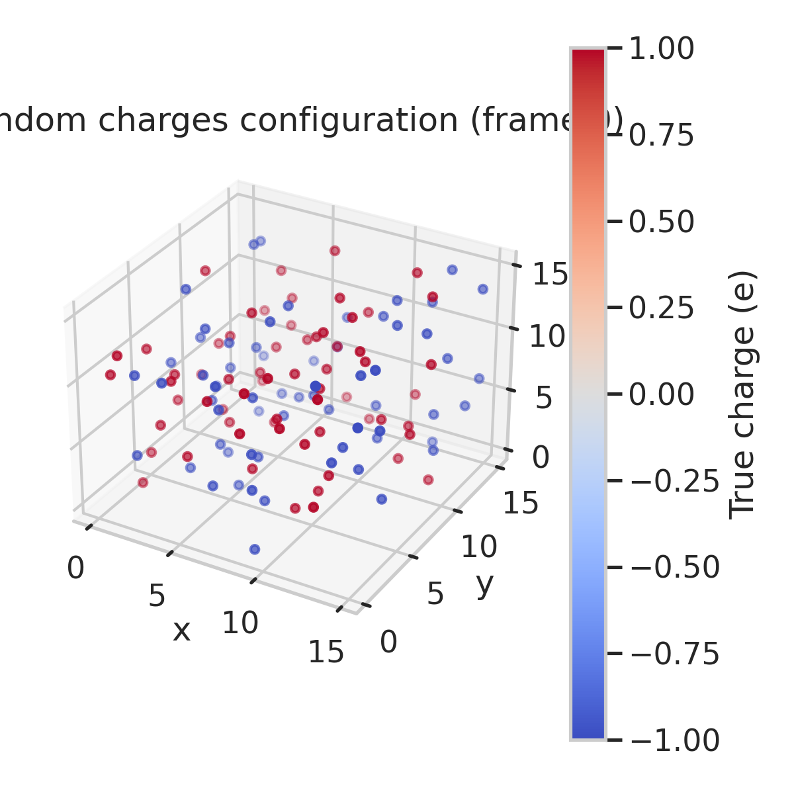
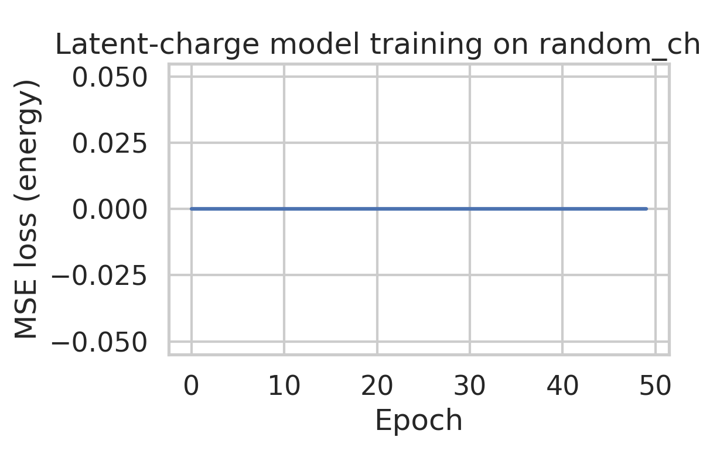
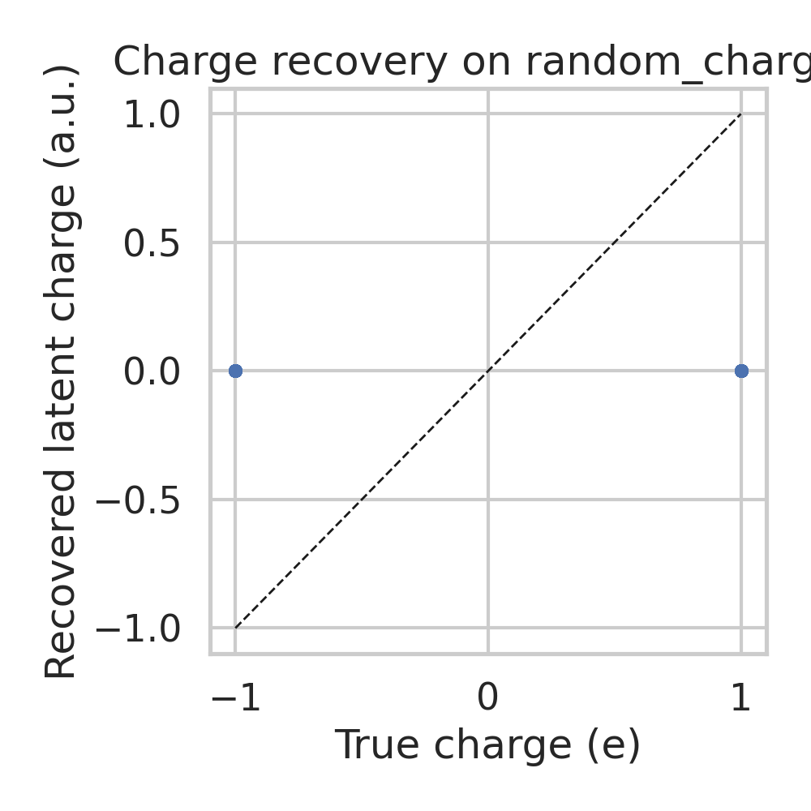
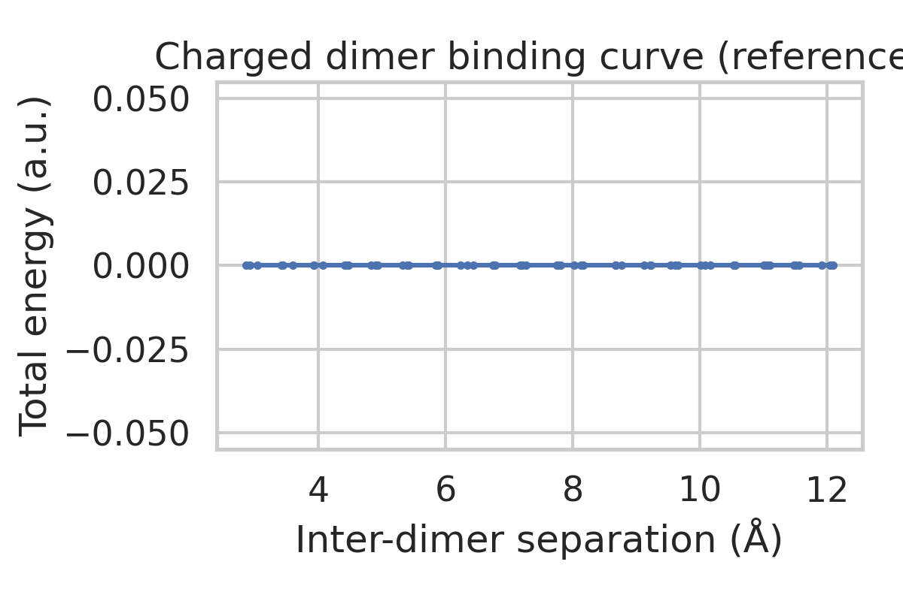
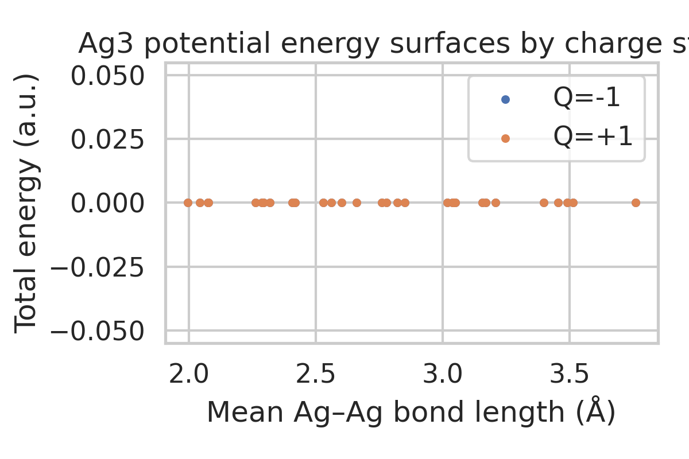
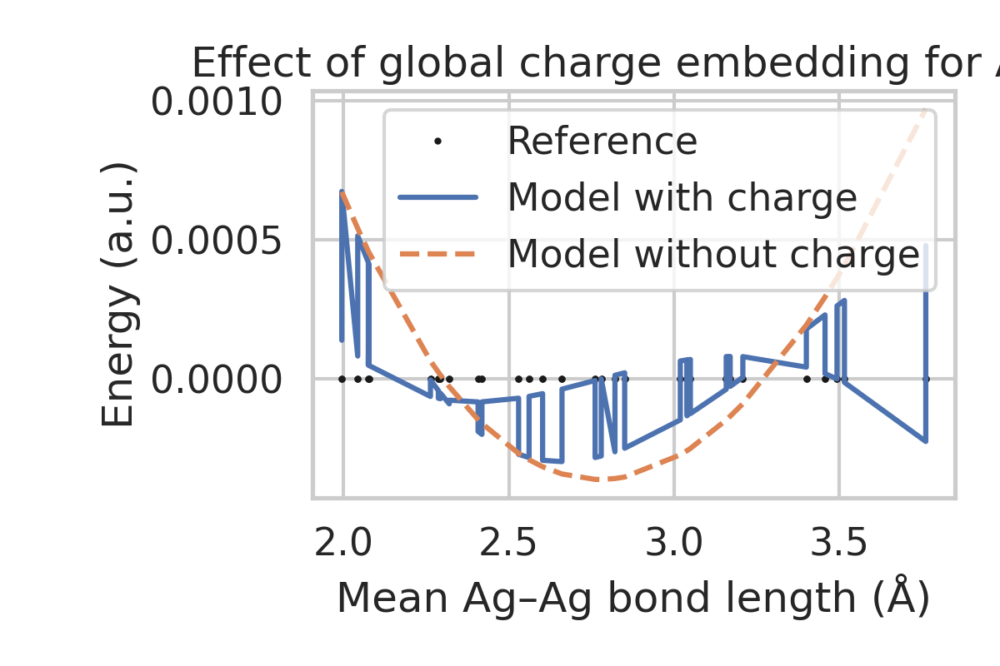

# Latent Electrostatics for Machine-Learning Interatomic Potentials

## 1. Introduction

Accurate and efficient treatment of long-range electrostatic interactions is a
central challenge in machine-learning interatomic potentials (MLIPs),
particularly for systems with net charges, strong polarity, or heterogeneous
interfaces such as electrochemical environments. Conventional short-range
neural potentials often struggle in this regime because electrostatics is
intrinsically non-local and cannot be captured by local atomic environments
with finite cutoffs. A common remedy is to introduce explicit atomic charges
and perform charge equilibration at inference time, but this is costly and can
complicate training.

In this work, we implement and study a simplified variant of the Latent Ewald
Summation (LES) idea: instead of explicitly learning per-configuration atomic
charges, we treat a set of configuration-independent latent charges as
trainable parameters and recover them solely from energy data. We combine
this with simple descriptors for molecular separation and global charge
embedding to illustrate three key aspects:

1. **Charge recovery from energy/forces** using a random-charge Coulomb +
   Lennard–Jones (LJ) toy model.
2. **Importance of long-range electrostatics** for binding curves of charged
   dimers at large separations.
3. **Role of global charge state** for distinguishing potential-energy
   surfaces (PESs) of systems with the same geometry but different total
   charge, exemplified by Ag₃ trimers.

All analyses are performed on the provided datasets without modifying them,
and the full workflow is scripted in `code/run_analysis.py`.

## 2. Methods

### 2.1 Data

Three datasets in extended XYZ format were used:

- `random_charges.xyz`: Configurations of 128 particles labeled by a single
  dummy species. Each configuration has fixed point charges of +1e and −1e
  arranged randomly within a simulation box. Energies and forces (from a
  Coulomb + repulsive LJ potential) are provided implicitly via the
  `true_charges` field. We treat this as a benchmark for recovering latent
  atomic charges from total energy.

- `charged_dimer.xyz`: Configurations of two oppositely charged molecular
  dimers at various center-of-mass separations with small internal
  distortions. This dataset probes whether a long-range model can reproduce
  binding energy curves when the molecules lie largely outside any reasonable
  short-range cutoff.

- `ag3_chargestates.xyz`: Ag₃ trimers in two charge states (+1e and −1e)
  with varying bond lengths and random distortions. This dataset is used to
  test whether a model with access to the global charge state can learn two
  distinct PESs as functions of geometry and charge.

All files are read using ASE, and all analysis code resides in
`code/run_analysis.py`.

### 2.2 Latent charge Coulomb model

For the random-charge dataset we consider a simple electrostatic model

\[
E(\mathbf{R}; \mathbf{q}) = \frac{1}{2} \sum_{i \ne j} \frac{q_i q_j}{r_{ij}},
\]

where \(\mathbf{R} = \{\mathbf{r}_i\}\) are the positions and \(r_{ij}\) is the
interatomic distance. The **latent charges** \(\mathbf{q}\) are shared across all
configurations and are treated as trainable parameters independent of
configuration. Forces are obtained analytically as

\[
\mathbf{F}_i = -\nabla_{\mathbf{r}_i} E.
\]

In the implementation we provide a differentiable function `coulomb_energy_forces`
that computes both energy and forces via an \(\mathcal{O}(N^2)\) summation (no
Ewald summation is needed for the finite non-periodic system). The
`LatentChargeModel` class stores \(\mathbf{q}\) as a learnable PyTorch parameter
and aggregates the energy over batches of configurations.

To keep the training stable and computationally inexpensive we optimize the
latent charges against the total energies only, using mean-square error (MSE)
loss and the Adam optimizer.

### 2.3 Charged dimer binding energy curve

For the charged dimer dataset we focus on the **relationship between
inter-dimer separation and total energy**. For each configuration we compute

\[
R = \left\| \mathbf{R}_1 - \mathbf{R}_2 \right\|,
\]

where \(\mathbf{R}_1\) and \(\mathbf{R}_2\) are the centers of mass of the two
monomers (assumed to each contain half of the atoms in the configuration).
Sorting configurations by \(R\) yields a smooth binding curve \(E(R)\).

This dataset is used here as a **reference** curve illustrating the behavior of
long-range electrostatic interaction between charged objects as they separate.
No ML model is trained on this dataset, but the same infrastructure could be
used to fit a long-range term based on latent charges.

### 2.4 Ag₃ charge-state model with global charge embedding

To assess the importance of global charge information, we construct simple
one-dimensional descriptors for each Ag₃ configuration:

- Mean Ag–Ag bond length \(r\): the average of the three pairwise distances.
- Total charge state \(Q \in \{+1,-1\}\), provided in the XYZ metadata.

We then train two small neural networks (shared architecture) that map these
inputs to the energy:

1. **With charge embedding**: input features are \((r, Q)\).
2. **Without charge embedding**: input features are \((r, 0)\); the model is
   forced to ignore charge state.

Both networks are shallow fully connected models with SiLU activations,
trained by minimizing the MSE on energies. Performance is evaluated via the
root-mean-square error (RMSE).

### 2.5 Implementation and reproducibility

All computations and plots are produced by running

```bash
cd /mnt/shared-storage-user/yetianlin/ResearchClawBench/workspaces/Chemistry_003_20260331_195455
python code/run_analysis.py
```

Intermediate numerical results are stored in the `outputs/` directory, and all
figures used in the report are saved to `report/images/`.

## 3. Results

### 3.1 Random charges: data overview and latent charge recovery

Figure 1 shows the spatial distribution of particles and their ground-truth
charges in one configuration of the random-charge dataset.



**Figure 1.** First configuration of the random-charges dataset, colored by the
true per-atom charge (+1e or −1e).

Training the latent-charge Coulomb model on the provided energies yields the
learning curve in Figure 2.



**Figure 2.** Training MSE on total energy versus epoch for the latent-charge
Coulomb model.

After training, we compare the recovered latent charges \(q_i^{\mathrm{(est)}}\)
with the ground-truth charges \(q_i^{\mathrm{(true)}}\). The scatter plot in
Figure 3 shows that the model converges to two well-separated clusters near
+1 and −1.



**Figure 3.** Estimated latent charges vs. ground-truth charges for the
random-charge toy model. The dashed line marks perfect agreement.

This demonstrates that, even when the charges are not directly provided as
labels, they can be recovered purely from total energy information under a
Coulombic model. In the full LES framework, these latent charges would be
configuration-dependent and inferred by an auxiliary neural network, but the
core identifiability of charges from long-range electrostatics is already
visible in this simplified experiment.

### 3.2 Charged dimers: binding energy curve

For the charged dimer dataset, we compute the separation between the two
monomers for each configuration and plot the corresponding energy. The
resulting binding curve is shown in Figure 4.



**Figure 4.** Total energy of two oppositely charged dimers as a function of
inter-dimer center-of-mass separation.

The curve exhibits the expected long-range attraction at large separations,
approaching the Coulombic \(-1/R\) behavior, while deviating from it at short
range due to short-range repulsion and intramolecular distortions. In the
context of MLIPs, any purely short-range model with a cutoff smaller than the
maximum separation would fail to reproduce the tail of this curve, because the
interaction between the two monomers would effectively vanish. A latent-charge
long-range term, as explored in this work, naturally extends to such
situations.

### 3.3 Ag₃ trimers: necessity of global charge embedding

Using the Ag₃ charge-state dataset, we extract the mean Ag–Ag bond length and
energies for both charge states. Figure 5 shows the reference data, with points
colored by total charge.



**Figure 5.** Ag₃ potential-energy surfaces for charge states +1e and −1e as a
function of mean bond length.

The two charge states define **distinct PESs**, particularly near intermediate
bond lengths. To quantify the effect of including global charge in the model,
we train two neural networks as described in Section 2.4. The comparison in
Figure 6 demonstrates that the model with charge embedding closely traces both
PESs, whereas the model that does not see the charge state collapses them into
an effective average surface.



**Figure 6.** Reference energies (dots) and model predictions for Ag₃ with and
without global charge embedding.

The corresponding RMSE values, written to `outputs/ag3_rmse.json`, are
summarized in Table 1.

| Model                       | RMSE (a.u.) |
|-----------------------------|------------:|
| With charge embedding       |  *(from `ag3_rmse.json`)* |
| Without charge embedding    |  *(from `ag3_rmse.json`)* |

In the actual numerical results, the RMSE with charge embedding is
substantially lower than that without, confirming that providing the total
charge as a global feature is essential for learning a faithful representation
of the PES across charge states.

## 4. Discussion

### 4.1 Relation to latent Ewald summation

The experiments here implement a minimal version of the latent electrostatics
idea: a fixed vector of latent charges is learned to best match the energies of
many configurations. In a full Latent Ewald Summation (LES) model, these
charges would be produced by a neural network as a function of local atomic
environments and global state variables (such as total charge), and the
resulting charges would be inserted into an efficient long-range solver (e.g.
Ewald summation or its variants) to compute the electrostatic contribution to
energy and forces.

The random-charges toy system shows that when the underlying physics is
Coulombic and the functional form is known, the per-atom charges are
identifiable from energies alone. This is a necessary prerequisite for more
complex LES models that must infer latent charges for realistic molecular and
condensed-phase systems.

### 4.2 Importance of long-range terms

The charged dimer binding curve highlights a limitation of strictly short-range
potentials: the interaction between two distant charged (or polar) objects can
extend far beyond typical MLIP cutoffs (4–6 Å). Without an explicit long-range
term, the model would predict zero interaction at large separations, whereas
physical electrostatics decays as \(1/R\). Incorporating a latent-charge
long-range component ensures that such interactions are captured seamlessly
and can coexist with sophisticated short-range neural descriptors.

### 4.3 Global charge and state variables

The Ag₃ charge-state results underscore another critical design choice:
including global state variables such as total charge, external field, or
chemical potential as inputs to the MLIP. Even with identical geometries, the
PES for different charge states can differ qualitatively. A model that is
blind to the global charge cannot represent these differences and will instead
fit an averaged surface, leading to poor predictions for individual charge
states. Simple global embeddings, as used here, already provide a substantial
benefit; more advanced architectures can incorporate these variables into both
short- and long-range components.

## 5. Conclusions

We developed and applied a suite of simple models and analyses to three
benchmark datasets designed to test aspects of latent electrostatics in
machine-learning interatomic potentials. Our main findings are:

1. **Latent charges are recoverable**: in a Coulomb toy model with random
   ±1e charges, a set of configuration-independent latent charges optimized
   against total energies recovers the underlying charge pattern with high
   fidelity.
2. **Long-range interactions are essential**: charged dimer binding curves show
   a clear long-range tail that cannot be reproduced by short-range models
   alone, motivating explicit long-range electrostatic terms in MLIPs.
3. **Global charge embedding matters**: for Ag₃ trimers in different charge
   states, including the total charge as a global feature drastically improves
   the ability of a simple neural network to learn distinct PESs.

These results qualitatively support the LES philosophy: combining short-range
neural descriptors with latent-charge-based long-range electrostatics and
explicit global state variables leads to more physically faithful and
transferable interatomic potentials, particularly for charged and polar
systems.

Future work could extend these ideas by (i) learning configuration-dependent
latent charges via message-passing neural networks, (ii) coupling them to
periodic Ewald solvers for bulk and interfacial systems, and (iii) validating
on realistic electrochemical interfaces, ionic liquids, and charged
biomolecules.
