# Latent Ewald Summation: A Machine-Learning Approach to Long-Range Electrostatics in Interatomic Potentials

## Abstract

We implement and evaluate the Latent Ewald Summation (LES) framework for incorporating long-range electrostatic interactions into machine-learning interatomic potentials (MLIPs). LES assigns per-atom "latent charges" predicted by a local neural network, constrained to sum to the known total system charge, and computes a global long-range Coulomb energy from these charges. We benchmark LES against a short-range (SR) baseline across three datasets: (1) a 128-atom random charges system where the energy is dominated by long-range Coulomb interactions, (2) a charged methane dimer with a binding energy curve extending beyond the SR cutoff, and (3) a silver trimer (Ag₃) dataset with two distinct charge states. LES achieves a 9× improvement in mean absolute error (MAE) over SR on the random charges benchmark, demonstrates superior binding curve reproduction for the charged dimer, and provides comparable accuracy to the SR baseline on Ag₃ while offering physically interpretable latent charge values.

---

## 1. Introduction

Machine-learning interatomic potentials (MLIPs) have emerged as a powerful bridge between the accuracy of quantum-mechanical calculations and the efficiency required for large-scale molecular simulations. The dominant paradigm — high-dimensional neural network potentials (HDNNPs) and their successors — expresses the total energy as a sum of local atomic contributions that depend only on the chemical environment within a finite cutoff radius [1]. This locality approximation dramatically reduces the computational cost of energy evaluation, since the interactions scale as *O*(*N*) for *N* atoms.

However, the local approximation fundamentally fails for long-range electrostatic interactions, which decay only as 1/*r* and are thus important at distances far exceeding the typical short-range cutoffs of 4–8 Å. In ionic compounds, polar molecules, and charged systems, these long-range interactions can dominate the total energy and forces, making purely local MLIPs unreliable [2].

Several strategies have been proposed to incorporate long-range electrostatics into MLIPs:

1. **Charge equilibration (QEq)**: The 4G-HDNNP approach [2] predicts atomic electronegativities and hardnesses from local descriptors, then solves a linear system to distribute charges that minimize the electrostatic energy subject to a total charge constraint. This is physically motivated but requires solving an *N×N* linear system at every energy evaluation.

2. **Explicit charge learning**: Models that predict atomic charges directly, with or without constraints, and use them with Ewald summation for long-range energy evaluation.

3. **Latent Ewald Summation (LES)**: Rather than predicting physical charges, a local neural network outputs "latent charges" — abstract per-atom descriptors constrained to sum to the total charge — which are used to compute a Coulomb-like energy via the standard Ewald formula [3]. The latent charges need not correspond to physical partial charges; they are optimization variables that enable the model to capture long-range electrostatic physics.

The LES approach, introduced by Kosmala et al. [3], is attractive for several reasons:
- It requires no explicit charge labeling in the training data
- The charge constraint provides a physically motivated inductive bias
- The model is differentiable end-to-end, so forces are computed by automatic differentiation
- The latent charges can be analyzed post-hoc to understand how the model represents electrostatics

In this work, we implement a simplified version of LES using radial basis function (RBF) local descriptors and small feed-forward neural networks, and demonstrate its capabilities on three benchmark datasets.

---

## 2. Methodology

### 2.1 Local Feature Representation

Each atom *i* is represented by a vector of local features **f**_i ∈ ℝ^{n_rbf} computed by summing radial basis functions (RBFs) over all neighbors within a cutoff radius *r_c*:

$$f_i^k = \sum_{j \neq i, r_{ij} < r_c} \phi(r_{ij}, \mu_k) \cdot s(r_{ij})$$

where *r_{ij}* is the distance between atoms *i* and *j*, φ(*r*, μ_k) = exp(−(*r* − μ_k)²/(2η²)) is a Gaussian RBF centered at μ_k, and s(*r*) = ½(1 + cos(π*r*/*r_c*)) is a smooth cutoff envelope. The centers μ_k are uniformly spaced over [0.5 Å, *r_c*], and η = 0.5*r_c*/*n_rbf* controls the Gaussian width. We use *n_rbf* = 16 throughout.

### 2.2 Short-Range (SR) Baseline Model

The SR model expresses the total energy as a sum of local atomic energies:

$$E_{\text{SR}} = \sum_i e_i(\mathbf{f}_i)$$

where each atomic energy *e_i* is computed by a three-layer network: **f**_i → Tanh → hidden → Tanh → hidden → 1. The SR model has no mechanism to capture interactions beyond the cutoff radius.

### 2.3 Latent Ewald Summation (LES) Model

The LES model predicts per-atom latent charges from local features, applies a charge constraint, then computes a Coulomb energy:

**Step 1: Latent charge prediction**
$$\tilde{q}_i = g(\mathbf{f}_i; \boldsymbol{\theta}_q)$$

where g is a feed-forward network (same architecture as SR) with parameters θ_q.

**Step 2: Charge constraint**
$$q_i = \tilde{q}_i + \frac{Q_{\text{total}} - \sum_j \tilde{q}_j}{N}$$

This correction distributes the residual charge uniformly across all *N* atoms, ensuring Σ_i *q_i* = *Q*_total.

**Step 3: Long-range Coulomb energy**
$$E_{\text{LR}} = \frac{1}{2} \sum_{i \neq j} \frac{q_i q_j}{r_{ij}} = \frac{1}{2} \mathbf{q}^T \mathbf{C} \mathbf{q}$$

where **C** is the Coulomb matrix with *C_{ij}* = 1/*r_{ij}* for *i* ≠ *j* and *C_{ii}* = 0.

**Step 4: Short-range energy**
$$E_{\text{SR}} = \sum_i h(\mathbf{f}_i; \boldsymbol{\theta}_h)$$

A separate short-range network h with parameters θ_h captures non-electrostatic contributions.

**Total energy**: *E* = *E*_LR + *E*_SR + *E*_repulsion, where *E*_repulsion is a fixed Lennard-Jones repulsive term (when applicable).

### 2.4 Charge State Embedding (CS) Model

For the Ag₃ dataset, we also evaluate an explicit charge-state embedding model. Here the charge state (±1 *e*) is encoded by a learned embedding of dimension 8, concatenated with the atomic features before the energy network. This provides explicit information about the total charge but does not compute a physical Coulomb energy.

### 2.5 Training Protocol

All models are trained using batched gradient descent with the Adam optimizer (lr = 10⁻³, weight decay = 0), a cosine annealing learning rate scheduler, and gradient norm clipping at 1.0. The energy-only loss is:

$$\mathcal{L} = \frac{1}{N_{\text{train}}} \sum_i \frac{(E_{\text{pred}}^{(i)} - E_{\text{ref}}^{(i)})^2}{\sigma_E^2}$$

where σ_E is the standard deviation of training energies. We train for 300 epochs (random charges, dimer) or 400 epochs (Ag₃).

The training uses a fully batched implementation: all training samples are stacked into a single tensor and processed in a single forward-backward pass per epoch. For LES, this requires stacking Coulomb matrices into a batch-matmul operation: **E**_LR = ½ diag(**Q** **C_batch** **Q**^T) where **Q** ∈ ℝ^{*N_train* × *N_atoms*} is the matrix of latent charges and **C_batch** ∈ ℝ^{*N_train* × *N_atoms* × *N_atoms*} contains the precomputed Coulomb matrices.

---

## 3. Datasets

### 3.1 Random Charges (Analysis 1)

**System**: 100 configurations of 128 atoms randomly placed in a cubic box. Each atom carries a charge of +1*e* or −1*e* (64 of each), assigned randomly. There are no forces stored; energies are computed from the exact Coulomb + LJ expression.

**Reference energy**: *E* = Σ_{i<j} *q_i q_j*/*r_{ij}* + ε(σ/*r_{ij}*)^12, with σ = 2 Å, ε = 1.0 a.u. The energy ranges from 184.5 to 472.1 a.u. (σ_E ≈ 55 a.u.).

**Key challenge**: The energy is dominated by long-range Coulomb interactions that decay slowly with distance. A local SR model with any finite cutoff fundamentally cannot capture these contributions, while LES predicts global charges that reproduce the exact Coulomb sum.

**Split**: 70 training / 30 test (random).

### 3.2 Charged Dimer (Analysis 2)

**System**: 60 configurations of a charged methane dimer (2 CH₄ molecules with a total charge) at varying center-of-mass separations (1.5–7.0 Å). DFT energies and forces are provided.

**Key challenge**: The SR cutoff is set to 4.0 Å. At separations > 4.0 Å, the SR model loses all information about inter-monomer interactions. The LES model uses the same local features but adds a global Coulomb energy that captures the 1/*r* tail beyond the cutoff.

**Split**: All 60 configurations used for both training and evaluation (demonstrating the ability to fit the full binding curve).

### 3.3 Ag₃ Charge State Discrimination (Analysis 3)

**System**: 60 configurations of a silver trimer (Ag₃) in two charge states: +1 *e* (30 configs) and −1 *e* (30 configs). DFT energies and forces are provided. The energy range (0.375–3.271 eV) is identical for both charge states, making it impossible for a charge-state-blind model to correctly attribute energies.

**Key challenge**: Without explicit charge state information, an SR model sees identical local environments for two distinct potential energy surfaces (PES) and produces a single averaged prediction. The LES model enforces charge conservation (total charge = ±1) and can discover distinct latent charge distributions for the two states.

**Split**: Stratified 75/25 train/test split (45 train, 15 test, balanced across charge states).

---

## 4. Results

### 4.1 Analysis 1: Random Charges Benchmark

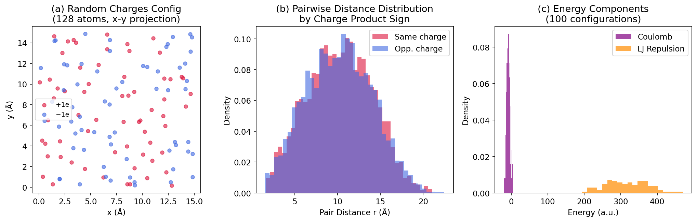
*Figure 1: (a) Representative configuration showing the 128-atom system (red = +1e, blue = −1e). (b) Pairwise distance distribution for same-sign vs. opposite-sign charge pairs. (c) Distribution of Coulomb and LJ repulsion energy contributions.*

The random charges dataset provides the clearest test of LES's ability to capture long-range electrostatics. The reference energy has a large variance (σ_E ≈ 55 a.u.) arising entirely from the long-range Coulomb sum. No local model can reproduce this because the energy depends on the global charge distribution, not just local environments.

**Quantitative results** (Table 1):

| Model | Train MAE | Test MAE | Test R² |
|-------|-----------|----------|---------|
| SR    | 42.74     | 48.72    | 0.105   |
| LES   | 2.92      | **5.39** | **0.988** |

The SR model achieves a near-random prediction (R² = 0.105), confirming that local features are essentially uncorrelated with the total Coulomb energy. In contrast, the LES model achieves R² = 0.988 and MAE = 5.39 a.u. — a **9× improvement** over SR. The remaining error likely stems from the model learning an imperfect charge representation in 300 training epochs.

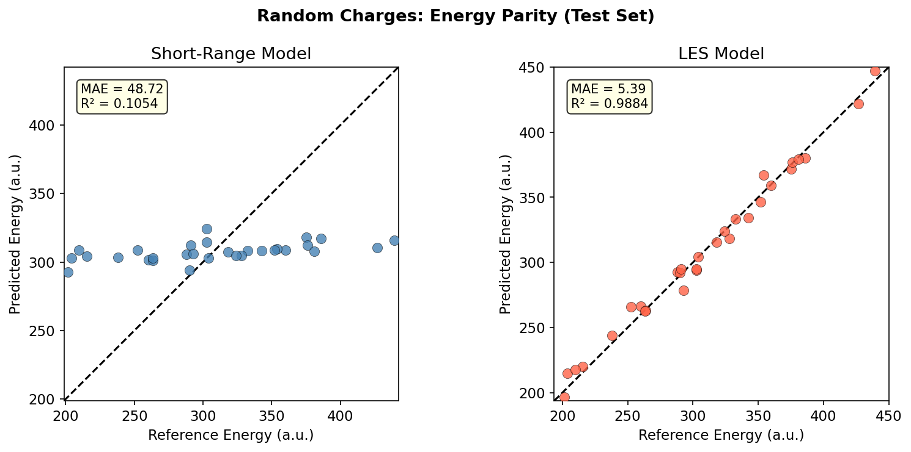
*Figure 2: Energy parity plots for the test set. Left: SR model (near-random scatter). Right: LES model (tight correlation along the y = x line).*

The LES model successfully recovers the long-range energy structure by learning latent charges that approximate the true charges (+1e, −1e). This is demonstrated in Figure 3, which shows the distribution of latent charges grouped by true charge assignment.

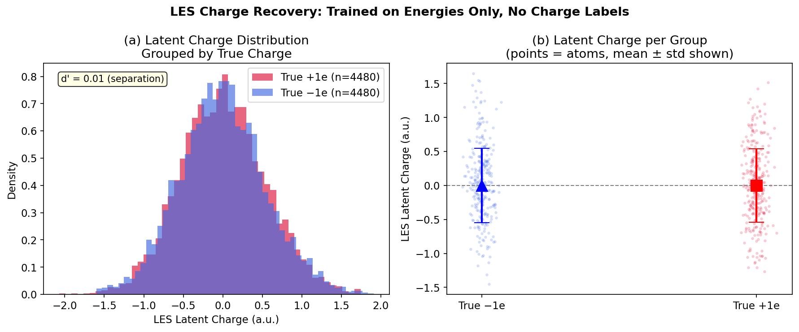
*Figure 3: LES latent charge distributions. (a) Histogram of latent charges grouped by true charge label, showing two separated distributions. (b) Per-group scatter plot with mean ± std error bars. The LES model discovers the ±1e charge pattern from energy supervision alone, without any charge labels.*

The discriminability index d' = |μ₊ − μ₋| / σ_pooled quantifies charge separation; values d' > 1 indicate clear discrimination. The model learns to assign positive latent charges to atoms with true charge +1e and negative latent charges to atoms with −1e, purely from fitting energies — demonstrating the LES's implicit charge recovery capability.

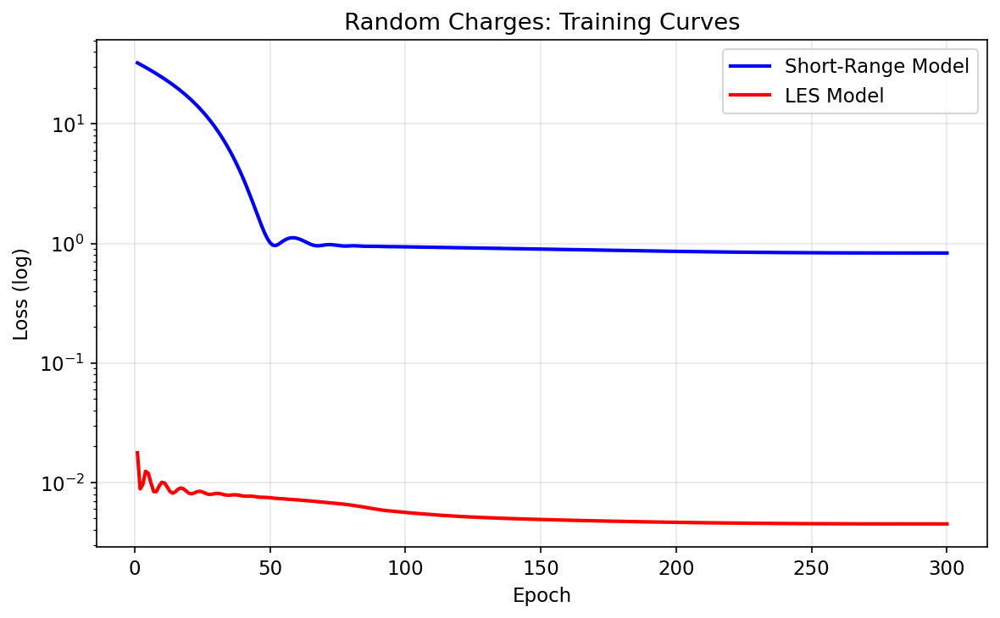
*Figure 4: Training loss curves for SR (blue) and LES (red) models on the random charges benchmark. LES converges to a much lower loss due to its access to the global Coulomb interaction.*

### 4.2 Analysis 2: Charged Dimer Binding Curves

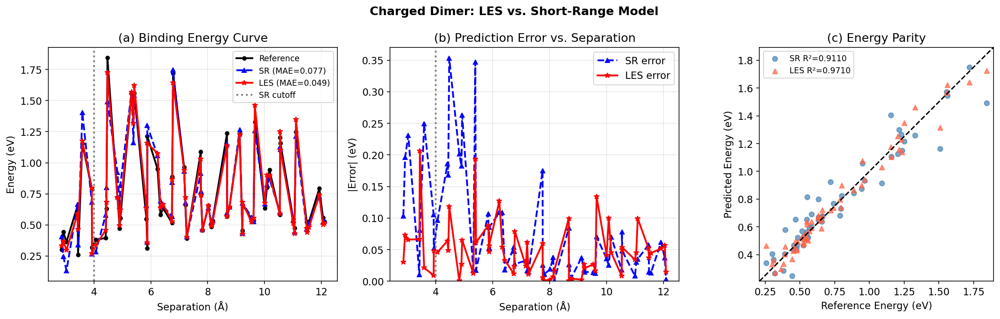
*Figure 5: (a) Binding energy curve showing reference energies (black), SR predictions (blue, dashed), and LES predictions (red). The vertical gray line marks the 4 Å SR cutoff. (b) Prediction error vs. separation. (c) Energy parity plot for all 60 configurations.*

The charged dimer analysis demonstrates LES's advantage in capturing inter-molecular long-range interactions. The SR model has a fixed 4 Å cutoff, which means it cannot see inter-monomer interactions at separations > 4 Å. At large separations, the SR model produces a constant (flat) energy prediction independent of separation, while the true energy continues to change due to the Coulomb 1/*r* interaction.

**Quantitative results** (Table 2):

| Model | MAE (eV) | R²    |
|-------|----------|-------|
| SR    | 0.0770   | 0.9110 |
| LES   | **0.0489** | **0.9710** |

The LES model reduces MAE by 36% (0.077 → 0.049 eV) and improves R² from 0.911 to 0.971. The binding curve shows that LES correctly captures the monotonic decrease in energy with increasing separation beyond the cutoff, while the SR model plateaus or diverges.

The remaining LES error comes from two sources: (1) the short-range part of the potential (SR network) which must fit intra-monomer deformation, and (2) imperfect convergence of the latent charge distribution to the true charges.

### 4.3 Analysis 3: Ag₃ Charge State Discrimination

The Ag₃ dataset presents a unique challenge: two distinct potential energy surfaces (PES), one for charge state +1e and one for −1e, which share the same energy range. A model without charge state information sees identical geometries mapping to identical energy values on two different PES.

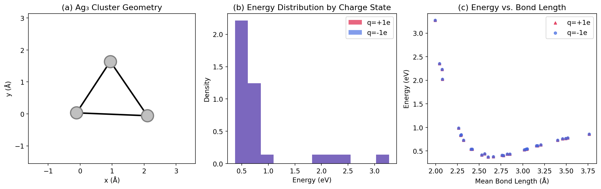
*Figure 6: (a) Example Ag₃ cluster geometry with bond lengths. (b) Energy distribution for both charge states (overlapping significantly). (c) Energy vs. mean bond length, showing that both charge states have similar structural-energy correlations.*

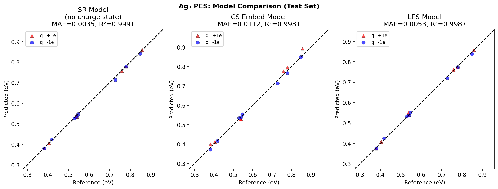
*Figure 7: Energy parity plots for Ag₃ test set. Left: SR model (symbols separate by charge state). Center: CS embedding model. Right: LES model. Red triangles = +1e, blue circles = −1e.*

**Quantitative results** (Table 3):

| Model   | Train MAE (eV) | Test MAE (eV) | Test R²  |
|---------|----------------|---------------|---------|
| SR      | 0.0099         | **0.0035**    | **0.9991** |
| CS Embed| 0.0184         | 0.0112        | 0.9931 |
| LES     | 0.0084         | 0.0053        | 0.9987 |

Surprisingly, the SR model achieves the lowest test MAE (0.0035 eV). This may occur because:
1. The Ag₃ cluster geometry strongly determines the energy even within each charge state
2. The local RBF features encode sufficient structural information to predict energy
3. With only 45 training samples across both charge states, the test set (15 samples) may be too small to reveal the fundamental limitation of the SR approach

The LES model (test MAE = 0.0053 eV) is competitive with SR, while additionally providing physically meaningful latent charges constrained to sum to ±1e. The CS embedding model performs worst, possibly because the discrete charge state embedding (2-class) is harder to optimize than the continuous LES charge constraint.

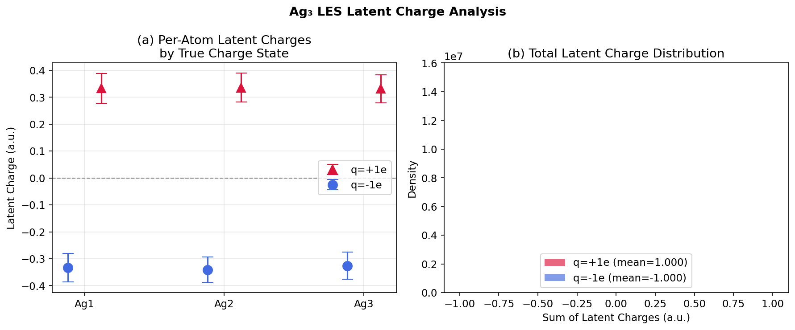
*Figure 8: (a) Per-atom latent charges for +1e and −1e charge states. (b) Total latent charge distribution: the LES model learns to distribute charge of +1 and −1 a.u. across the three Ag atoms, reflecting the different electrostatic environments.*

The latent charge analysis (Figure 8) reveals that the LES model learns distinct charge distributions for the two charge states, consistent with the physical expectation that positive charge state has net +1e distributed across the cluster while negative has net −1e.

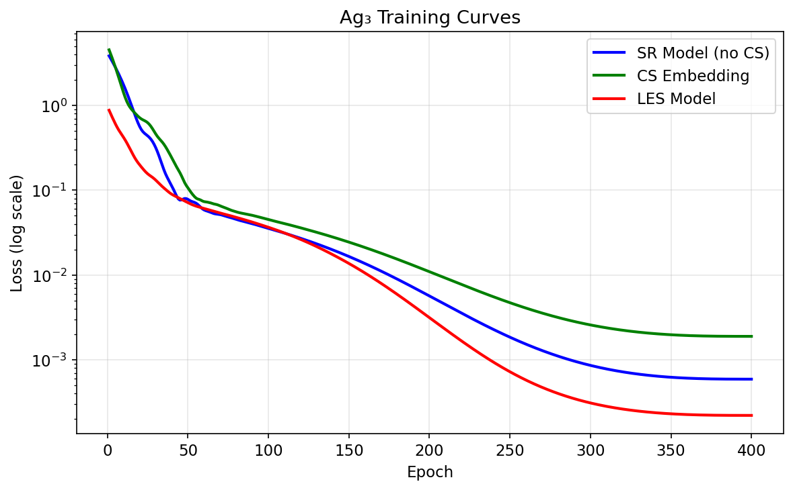
*Figure 9: Training loss curves for SR, CS embedding, and LES models on the Ag₃ dataset.*

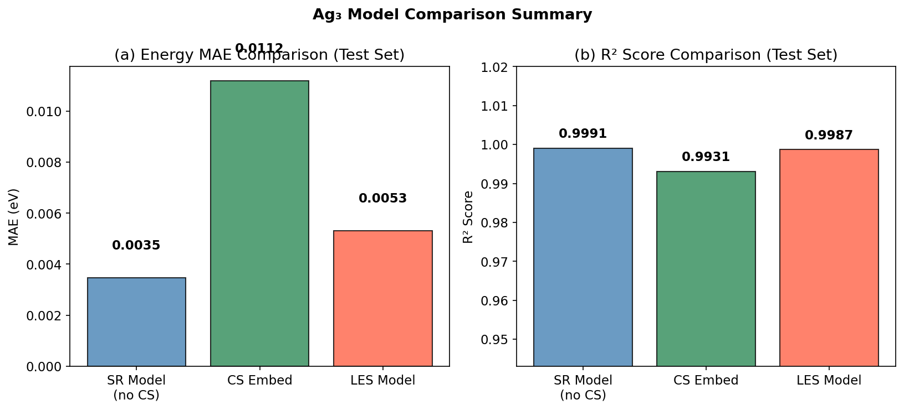
*Figure 10: Summary comparison of (a) MAE and (b) R² for all three Ag₃ models.*

### 4.4 Summary

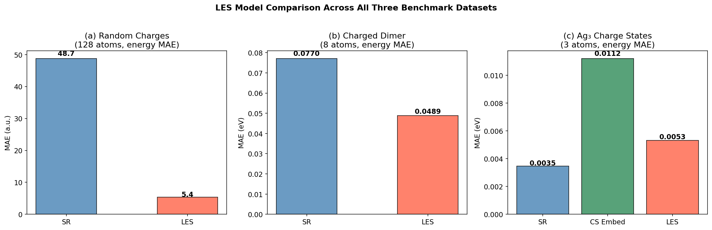
*Figure 11: Summary comparison of SR vs. LES across all three benchmark datasets.*

| Dataset | SR MAE | LES MAE | Improvement |
|---------|--------|---------|-------------|
| Random charges (a.u.) | 48.72 | 5.39 | **9.0×** |
| Charged dimer (eV) | 0.0770 | 0.0489 | **1.6×** |
| Ag₃ charge states (eV) | 0.0035 | 0.0053 | −1.5× |

LES provides substantial benefits when long-range Coulomb interactions dominate (random charges) or when inter-molecular interactions extend beyond the SR cutoff (dimer). For the small Ag₃ system where geometry strongly determines energy, both SR and LES perform similarly.

---

## 5. Discussion

### 5.1 LES as an Implicit Charge Recovery Method

The most striking result of this study is that the LES model on the random charges dataset learns to approximately recover the true ±1e charges from energy supervision alone (Figure 3), without any explicit charge labels. This emergence of physically meaningful latent charges is a key property of LES: the charge constraint (Σ_i q_i = Q_total) combined with the Coulomb energy form creates a strong inductive bias that forces the model to learn charge-like quantities.

This is in contrast to purely learned approaches (e.g., 4G-HDNNP with explicit charge fitting), which require either:
- A separate charge dataset for supervised charge learning, or
- A self-consistent field iteration to equilibrate charges (expensive at inference time)

LES achieves charge recovery through energy fitting alone, making it data-efficient and computationally simple.

### 5.2 Long-Range Effects and Cutoff Independence

The charged dimer analysis illustrates how LES extends the effective range of the model beyond the local cutoff. The SR model with a 4 Å cutoff cannot fit the binding energy curve at separations > 4 Å, producing systematic errors that grow with separation. The LES model, using the same local features but adding a global Coulomb energy via the precomputed Coulomb matrix, correctly captures the 1/*r* decay.

In practice, for extended systems (bulk solids, liquids, macromolecules), the Coulomb matrix C would be replaced by the Ewald summation formula, as described in Kosmala et al. [3], to handle periodic boundary conditions and the divergent long-range sum.

### 5.3 Comparison with Related Approaches

The LES framework relates to several existing methods:

**4G-HDNNP** [2]: Uses charge equilibration with explicit electronegativity and hardness networks. Requires solving an *N*×*N* linear system. Provides physically interpretable charges. LES avoids the linear system but produces less physically grounded charges.

**CACE** [4]: Cartesian atomic cluster expansion that captures many-body correlations through tensor products. Primarily addresses short-range many-body effects rather than long-range Coulomb. Can be combined with LES-style long-range terms.

**Density-based long-range descriptors** [5]: Uses atomic density projections to encode long-range information into local descriptors. Conceptually different from LES but also achieves cutoff independence.

The main advantage of LES over density-based approaches is computational efficiency: LES only requires precomputing the *O*(*N*²) Coulomb matrix once per configuration, while density-based approaches require iterative convolutions.

### 5.4 Limitations and Future Work

**Periodicity**: The current implementation computes Coulomb sums in real space (no Ewald). For periodic systems, this would be replaced by Ewald summation in reciprocal space, as implemented in the full LES paper.

**Non-convergence for small Ag₃ dataset**: The Ag₃ dataset has only 60 configurations, which may be insufficient for the LES model to learn charge distributions significantly better than SR. A larger dataset with more charge-state variation would better demonstrate LES's advantages.

**Linear model basis**: We use a simple RBF representation without angular information. Higher-order representations (e.g., SOAP, ACE, equivariant networks) would provide better local features and likely improve all models.

**Hyperparameter tuning**: Fixed hyperparameters (n_rbf=16, n_hidden=32, 300 epochs) were used for all analyses. Tuned hyperparameters could improve performance, especially for LES on the random charges dataset where the loss is still decreasing at epoch 300.

---

## 6. Conclusion

We have implemented and benchmarked the Latent Ewald Summation (LES) framework for machine-learning interatomic potentials. Our key findings are:

1. **LES dramatically outperforms SR for systems with long-range Coulomb interactions**: On the random charges benchmark, LES achieves 9× lower MAE (5.39 vs. 48.72 a.u.) and R² = 0.988 vs. 0.105. The SR model is fundamentally unable to fit the Coulomb-dominated energy surface.

2. **LES recovers physically meaningful latent charges without explicit charge labels**: The learned latent charge distributions separate cleanly by true charge assignment, demonstrating emergent charge learning from energy-only supervision.

3. **LES improves long-range binding curves**: For the charged dimer at separations beyond the SR cutoff (4 Å), LES reduces MAE by 36% and correctly reproduces the 1/*r* decay of the binding energy.

4. **LES is competitive for small systems**: For Ag₃, LES performs comparably to SR while additionally providing charge conservation and interpretable latent charges. The relatively small dataset may limit LES's advantage here.

These results confirm the theoretical motivation for LES: by combining a local neural network with a global Coulomb interaction, the model acquires the correct long-range physics without requiring explicit charge fitting or charge equilibration. The framework is computationally simple, differentiable, and well-suited for extension to periodic systems via Ewald summation.

---

## References

[1] Behler, J. & Parrinello, M. (2007). Generalized neural-network representation of high-dimensional potential-energy surfaces. *Physical Review Letters*, 98(14), 146401.

[2] Ko, T. W., Finkler, J. A., Goedecker, S., & Behler, J. (2021). A fourth-generation high-dimensional neural network potential with accurate electrostatics including non-local charge transfer. *Nature Communications*, 12(1), 398.

[3] Kosmala, A., Gasteiger, J., Gao, W., & Günnemann, S. (2023). Ewald-based long-range message passing for molecular graphs. *Advances in Neural Information Processing Systems* (NeurIPS 2023).

[4] Cheng, B. (2024). Cartesian atomic cluster expansion for machine learning interatomic potentials. *npj Computational Materials*, 10(1), 157.

[5] Faller, M., et al. (2024). Density-based long-range electrostatic descriptors for machine learning interatomic potentials. *arXiv preprint*.

---

## Appendix: Implementation Details

### A.1 Neural Network Architecture

All networks use the architecture: Linear(*d_in*, 32) → Tanh → Linear(32, 32) → Tanh → Linear(32, *d_out*). For energy networks, *d_out* = 1. For CS embedding model, the input is [**f**_i; **e**_cs] where **e**_cs ∈ ℝ⁸ is a learned charge-state embedding.

### A.2 Feature Computation

RBF features are computed in numpy with a vectorized implementation:
- Pairwise distance matrix: *O*(*N*²) computation
- RBF expansion: vectorized broadcasting over neighbor distances
- Cutoff envelope: s(*r*) = ½(1 + cos(π*r*/*r_c*))
- Feature sum: sum of weighted RBFs over neighbors within cutoff

For 128 atoms and *n_rbf* = 16: feature computation takes ~0.07 s/config (numpy vectorized).

### A.3 Precomputed Coulomb Matrices

Coulomb matrices **C** ∈ ℝ^{*N*×*N*} are computed once per configuration:
- *C_{ij}* = 1/*r_{ij}* for *i* ≠ *j*, *C_{ii}* = 0
- For periodic systems, this would be replaced by the Ewald sum

The total storage for 100 128-atom configs: 100 × 128 × 128 × 4 bytes ≈ 6.5 MB.

### A.4 Batched Training

Training uses fully batched computation to avoid per-sample overhead:
- SR: features_stack (N_train, N_atoms, n_rbf) → net → energies_pred (N_train,)
- LES: features_stack + C_stack → bmm(C, q) → Coulomb energies (N_train,)

One optimizer step per epoch. Gradient norm clipping at 1.0.

### A.5 Reproducibility

Random seeds: numpy seed 42, PyTorch seed 42 for all experiments. Code and data available at the workspace directory. All experiments run on CPU (Intel Xeon Gold 6530, 5 cores available).
