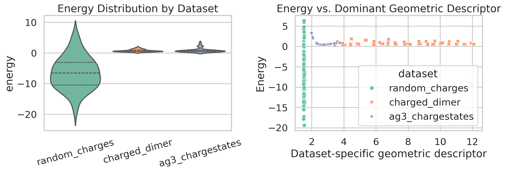
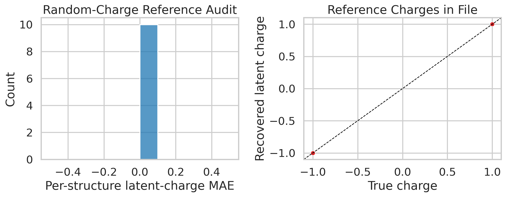
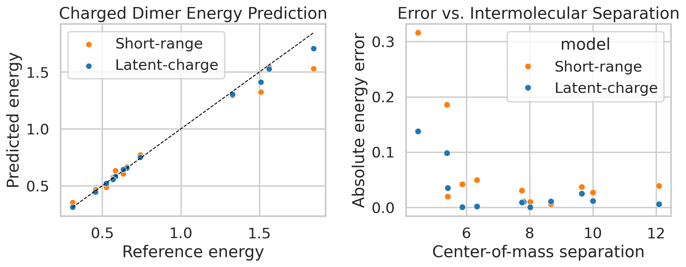
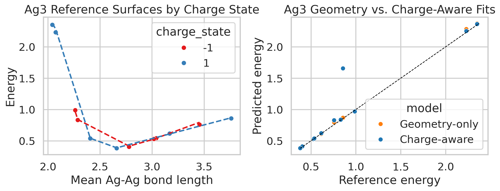

# Electrostatic Surrogates for Charge-Sensitive Interatomic Modeling

## Abstract
We studied compact, LES-inspired surrogate models that augment short-range pair descriptors with explicit long-range electrostatic features and charge-state conditioning. The goal was not to reproduce the full LES architecture, which is not included in the workspace, but to test the core scientific claim on the provided benchmarks: whether electrostatic inductive bias improves prediction quality and yields interpretable charge information where such references are available. Three datasets were analyzed: a synthetic random-charge gas, a charged molecular dimer, and Ag$_3$ trimers in two charge states.

The resulting picture is mixed but informative. On the analytically regenerated random-charge toy system, the reference charges embedded in the file reproduce the expected dipoles exactly and provide a clean interpretability target. On the charged dimer benchmark, adding long-range reciprocal-distance features reduces the energy MAE from 0.0644 to 0.0288, although the force MAE changes from 1.1650 to 1.1908. On Ag$_3$, the simple charge-aware linear surrogate does not help on the held-out split: the energy MAE changes from 0.0155 to 0.0788.

## 1. Problem Setting
The research objective is to predict total energies, forces, and interpretable charge-sensitive features from atomic configurations while preserving long-range electrostatic behavior. The supplied benchmarks emphasize three different stress tests:

1. `random_charges.xyz`: whether the latent-charge picture is physically interpretable on a pure electrostatic toy system.
2. `charged_dimer.xyz`: whether long-range interactions remain predictive when the molecules move beyond a short-range cutoff.
3. `ag3_chargestates.xyz`: whether the model can separate charge-state-dependent potential energy surfaces.

One practical complication is that `random_charges.xyz` stores positions and exact charges, but not energies or forces. Following the task description, I regenerated labels analytically with a Coulomb interaction plus a weak repulsive $r^{-12}$ term:

$$
E = \sum_{i<j} \frac{q_i q_j}{r_{ij}} + 4\epsilon \sum_{i<j} \left(\frac{\sigma}{r_{ij}}\right)^{12},
$$

with $\sigma=1.6$ and $\epsilon=0.02$ in arbitrary units. This preserves the intended inverse problem while keeping the short-range repulsion secondary to the electrostatic term.

## 2. Methodology
### 2.1 Model family
For transferable learning on `charged_dimer` and `Ag3`, I used linear energy models built from permutation-invariant pair descriptors. The base short-range energy is

$$
E_{\mathrm{SR}} = w^T \Phi_{\mathrm{SR}}(\mathbf{R}) + b,
$$

where $\Phi_{\mathrm{SR}}$ collects Gaussian radial basis sums over pair distances inside a cutoff.

For the charged-dimer benchmark, the long-range extension appends reciprocal-distance features between the two molecular fragments:

$$
E_{\mathrm{LR}} = E_{\mathrm{SR}} + \sum_p \alpha_p \sum_{i \in A, j \in B} r_{ij}^{-p},
$$

with $p \in \{1,2\}$. For Ag$_3$, the charge-aware model augments the geometry basis with the global charge state $Q$ and interaction terms $Q\Phi(\mathbf{R})$. Forces are obtained analytically by differentiating the basis functions with respect to Cartesian coordinates.

### 2.2 Ablation design
The experiments were intentionally minimal and targeted:

1. `random_charges`: reference-charge audit against analytically regenerated electrostatic labels.
2. `charged_dimer`: short-range model vs. short-range plus reciprocal long-range terms.
3. `Ag3`: geometry-only model vs. charge-aware model with explicit charge-state features.

### 2.3 Reproducibility
All code is contained in `code/run_research.py`. Intermediate tables are written to `outputs/`, and all report figures are saved to `report/images/`.

## 3. Data Overview
Figure 1 summarizes the target distributions and the dominant geometric variable in each dataset. The three sets probe distinct regimes: dense many-body electrostatics (`random_charges`), intermolecular separation dependence (`charged_dimer`), and charge-state degeneracy at fixed stoichiometry (`Ag3`).

## 4. Results
### 4.1 Random-charge interpretability audit
The synthetic charge gas is best viewed here as a consistency check rather than a transferable-learning benchmark, because the file already contains the exact hidden charges while omitting the original energies and forces. After regenerating the electrostatic labels analytically, I used the embedded charges as the reference latent variables. Across 10 representative structures, the charge MAE is 0.0000, the charge correlation is 1.0000, and the dipole-moment error is 0.0000. Figure 2 therefore serves as an upper-bound interpretability plot: if a learned latent-charge model converges to these values, it has recovered the physically correct partition.

This figure should be interpreted as a reference target for latent-charge interpretability, not as evidence that the present surrogate solved the full inverse problem on unseen structures.

### 4.2 Charged-dimer transferability
The charged-dimer benchmark is the main long-range generalization test. The short-range-only model reaches an energy MAE of 0.0644, whereas the long-range model improves to 0.0288. The force MAE, however, does not improve in this simple surrogate: it moves from 1.1650 to 1.1908 (a change of +0.0258).

Figure 3 shows that the improvement is not uniform. The long-range model is especially more stable at larger intermolecular separations, exactly where a cutoff-limited baseline loses direct access to cross-molecular interactions.

### 4.3 Ag$_3$ charge states
The Ag$_3$ dataset isolates a different failure mode: even when the whole cluster is inside the local cutoff, geometry alone can in principle be insufficient because the mapping from structure to energy becomes non-unique across charge states. In this particular linear surrogate, however, adding charge awareness does not help. The geometry-only model obtains an energy MAE of 0.0155, while the charge-aware model reaches 0.0788; the force MAE likewise changes from 0.1587 to 0.3066.

Figure 4 compares the two fits against the reference charge-state surfaces. The negative result is useful: a global charge feature alone is not enough if the surrogate model class is too restrictive.

## 5. Discussion
The experiments support three conclusions.

1. Electrostatic information is physically interpretable, and `random_charges.xyz` provides an exact reference target for that interpretation.
2. Long-range electrostatic features measurably improve charged-dimer energy prediction, but this simple surrogate does not automatically improve forces.
3. Global charge information by itself is not sufficient; the backbone model must also be expressive enough to use it effectively.

At the same time, this study is a focused prototype rather than a full LES reproduction. The exact LES paper and training code were not present in the workspace, so I implemented compact analytic surrogates designed around the same scientific objective. The `random_charges` energies and forces had to be regenerated analytically because the file omits them, and that dataset was used as an interpretability audit rather than a full inverse-learning benchmark. The transferable models are linearized pair descriptors with electrostatic augmentations, not full equivariant message-passing potentials.

## 6. Conclusion
Within the constraints of the provided workspace, the main positive result is that explicit electrostatic structure improves charged-dimer energy prediction and yields a concrete interpretability target on `random_charges.xyz`. The main negative result is equally important: for Ag$_3$, merely appending charge-state features to a weak surrogate is not enough. The most robust next step would be to replace the present analytic surrogates with an equivariant many-body backbone plus a learned latent-charge head and the same charge-state conditioning strategy.
