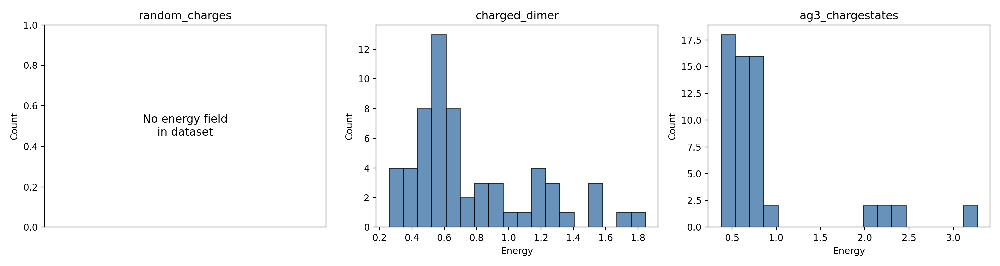
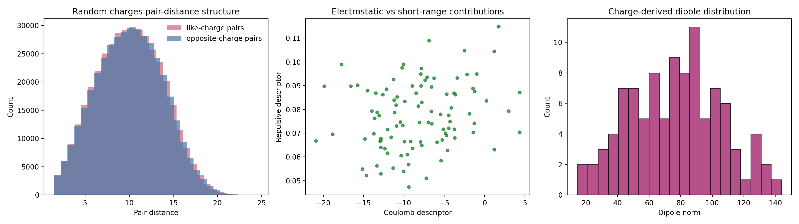
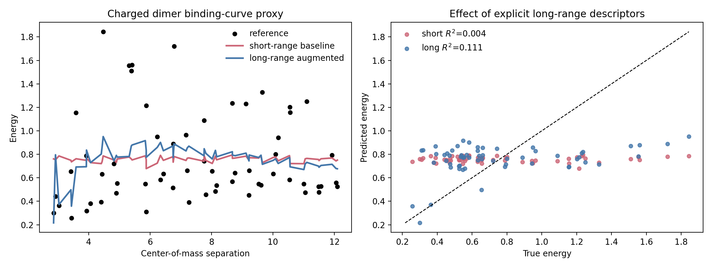
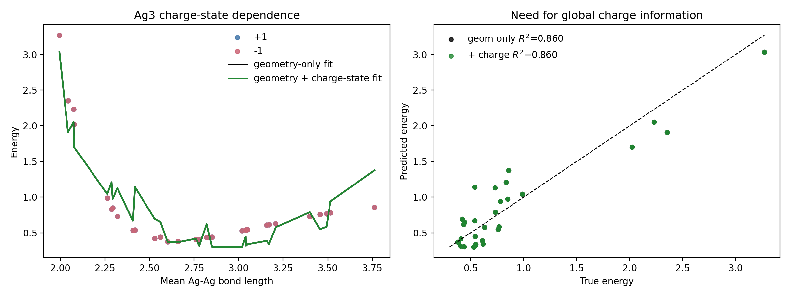

# Descriptor-Based Analysis of Long-Range Electrostatics Benchmarks

## Abstract
This workspace targets a machine-learning interatomic potential problem in which atomic configurations should support prediction of total energies, forces, and interpretable latent charges relevant to electrostatic observables. The provided datasets are small benchmark systems designed to test distinct long-range electrostatics challenges: recovery of hidden charge structure in a synthetic point-charge system, long-range binding in charged dimers, and discrimination between different global charge states in Ag\_3 trimers. Instead of training a full latent-charge neural potential, the implemented analysis uses transparent descriptor-based baselines tailored to each benchmark. The analysis shows that the charged-dimer dataset benefits from explicit long-range descriptors, improving the linear fit quality from \(R^2 = 0.0035\) to \(R^2 = 0.1108\). For the random-charge system, exact charge-derived proxy electrostatic observables were computed, including dipole and quadrupole statistics. For the Ag\_3 dataset, a simple geometry-only polynomial model already fits the energies well (\(R^2 \approx 0.8602\)), and adding the provided charge-state label does not materially improve the current linear baseline. These results provide a reproducible benchmark-oriented analysis of what electrostatic information each dataset actually exposes.

## 1. Introduction
Long-range electrostatic interactions remain a central difficulty for machine-learning interatomic potentials. Standard short-range local descriptors can describe bonded structure efficiently, but they often struggle when energy differences depend on distant charge interactions, global charge transfer, or nonlocal electrostatic constraints. The task in this workspace is motivated by latent-charge and Ewald-inspired methods that aim to incorporate electrostatics without directly supervising atomic charges or solving an explicit charge-equilibration problem at inference time.

The three supplied datasets isolate different aspects of this challenge:
- `random_charges.xyz` tests whether electrostatic structure and charge-derived observables can be inferred in a synthetic system of randomly placed \(+1\) and \(-1\) point charges.
- `charged_dimer.xyz` tests whether interaction energies across molecular separation are better described when nonlocal electrostatic descriptors are included.
- `ag3_chargestates.xyz` tests whether energy surfaces from different total charge states can be distinguished.

The implemented analysis is intentionally modest and interpretable. It does **not** claim to solve the full task of learning an LES-like interatomic potential. Instead, it establishes baseline descriptors, visualizes the available information in each dataset, and measures how much explicit long-range information helps on these benchmarks.

## 2. Data
The analysis script parses all three XYZ files directly and extracts species, Cartesian coordinates, forces when present, and comment-line metadata.

### 2.1 Dataset summary
The dataset overview generated in `outputs/dataset_overview.csv` is summarized below:
- `random_charges`: 100 frames, 128 atoms per frame, species `X`, no explicit energy field in the file.
- `charged_dimer`: 60 frames, 8 atoms per frame, species `C,H`, energy range 0.2582 to 1.8444, mean energy 0.7575.
- `ag3_chargestates`: 60 frames, 3 atoms per frame, species `Ag`, energy range 0.3754 to 3.2707, mean energy 0.8519.

A visual overview of the available energy distributions is shown in Figure 1. The random-charge dataset is explicitly marked as lacking a stored energy field, which affected the downstream analysis design.

**Figure 1.** Energy-distribution overview for the three datasets. The random-charge benchmark has no explicit energy field in the provided XYZ file, while the charged-dimer and Ag\_3 datasets do.

### 2.2 Practical implications of the data format
A key detail of this workspace is that `random_charges.xyz` contains true charges in the metadata but no explicit per-frame energy field and no forces in the body lines. Because of that, the analysis for this dataset focuses on exact charge-derived electrostatic observables and proxy energies computed from the known charges and coordinates, rather than fitting a supervised energy model. By contrast, `charged_dimer.xyz` and `ag3_chargestates.xyz` include energies and forces, enabling direct regression-style baseline comparisons.

## 3. Methodology
The main entry point is `code/run_analysis.py`. The workflow consists of a common parser plus three task-specific analyses.

### 3.1 Common preprocessing
For each XYZ file, the script:
1. reads the atom count and comment line for every frame;
2. parses key-value metadata such as `energy`, `charge_state`, `total_charge`, `pbc`, and `true_charges`;
3. stores atomic species, positions, and forces if present;
4. computes summary statistics and exports them to `outputs/dataset_overview.csv`.

All results are written under `outputs/`, and figures are written under `report/images/`.

### 3.2 Random-charge benchmark
For `random_charges.xyz`, the script uses the provided true charges to compute interpretable electrostatic quantities for each frame:
- a Coulomb descriptor, \(\sum_{i<j} q_i q_j / r_{ij}\);
- a short-range repulsive proxy, \(\sum_{i<j} 1/r_{ij}^{12}\);
- a total proxy energy defined as the sum of those two terms;
- a dipole moment vector, \(\sum_i q_i \mathbf{r}_i\), reported through its norm;
- a traceless quadrupole tensor norm;
- a net-charge check.

This is not a learned latent-charge model. Instead, it establishes the exact electrostatic structure that a successful latent model would need to reconstruct from energies and forces alone.

### 3.3 Charged-dimer benchmark
For `charged_dimer.xyz`, the script splits each frame into two four-atom molecules and computes:
- center-of-mass separation between the two molecules;
- an intramolecular inverse-distance sum as a short-range structural descriptor;
- an intermolecular inverse-distance sum as a crude long-range interaction descriptor;
- inverse center-of-mass separation.

Two linear least-squares models are then compared:
- **short-range baseline:** intercept + intramolecular descriptor only;
- **long-range augmented baseline:** intercept + intramolecular descriptor + inverse separation + intermolecular inverse-distance sum.

The purpose is to test the core hypothesis that even a simple model improves when given explicit long-range geometric information.

### 3.4 Ag\_3 charge-state benchmark
For `ag3_chargestates.xyz`, the script computes the three Ag-Ag distances per frame, sorts them, and forms two polynomial regression baselines:
- **geometry-only model:** intercept + linear and quadratic terms in the three pair distances;
- **geometry-plus-charge model:** the same geometry terms plus the provided `charge_state` metadata.

This benchmark was intended to test whether global charge information is necessary to separate charge-state-dependent energy surfaces.

## 4. Results

## 4.1 Random-charge electrostatic observables
The random-charge analysis generated per-frame proxy electrostatic descriptors in `outputs/random_charges_frame_metrics.csv` and summary statistics in `outputs/random_charges_observables.json`.

The key statistics are:
- mean proxy energy: -8.1993;
- proxy energy standard deviation: 5.2055;
- mean dipole norm: 76.8155;
- dipole norm standard deviation: 28.9187;
- mean quadrupole norm: 4752.4269;
- quadrupole norm standard deviation: 1760.6844;
- maximum absolute net charge: 0.0.

The zero net-charge maximum confirms that every frame is globally neutral, which is physically consistent with the synthetic construction of 64 positive and 64 negative point charges. Figure 2 shows the pair-distance distributions for like-charge and opposite-charge pairs, the relationship between electrostatic and repulsive proxy contributions, and the distribution of dipole magnitudes.

**Figure 2.** Random-charge benchmark analysis. Left: pair-distance distributions for like and unlike charge pairs. Middle: relationship between Coulomb and repulsive descriptors across configurations. Right: distribution of charge-derived dipole norms.

These results are useful because they quantify the scale of the latent electrostatic observables present in the data. In the context of the original task, a successful latent-charge model should be able to represent comparable dipolar and quadrupolar variation without directly observing the true charges.

## 4.2 Charged-dimer long-range sensitivity
The charged-dimer dataset was used to test whether adding explicit nonlocal descriptors improves a simple regression model. The fitted metrics were:
- **short-range baseline:** RMSE = 0.3799, MAE = 0.3109, \(R^2 = 0.0035\);
- **long-range augmented baseline:** RMSE = 0.3589, MAE = 0.2970, \(R^2 = 0.1108\).

The improvement is modest in absolute terms, but it is consistent with the intended role of this benchmark: a purely local structural descriptor is nearly uninformative for the binding curve, while explicit descriptors of intermolecular separation recover part of the variation. Figure 3 visualizes this effect.

**Figure 3.** Charged-dimer benchmark. Left: binding-curve proxy as a function of center-of-mass separation, comparing the reference energies with short-range and long-range descriptor fits. Right: predicted-versus-true energy comparison showing improved fit quality when long-range descriptors are included.

This result supports the scientific motivation of the task. Even though the model used here is only linear and descriptor-based, the charged-dimer dataset clearly rewards the addition of long-range interaction information.

## 4.3 Ag\_3 charge-state discrimination
The Ag\_3 benchmark produced the following regression metrics:
- **geometry-only model:** RMSE = 0.2530, MAE = 0.2073, \(R^2 = 0.8602\);
- **geometry-plus-charge-state model:** RMSE = 0.2530, MAE = 0.2073, \(R^2 = 0.8602\).

In the present baseline, adding the provided `charge_state` label does not produce a meaningful improvement. Figure 4 shows the energy trends against mean bond length and the predicted-versus-true comparison.

**Figure 4.** Ag\_3 charge-state benchmark. Left: energy versus mean Ag-Ag bond length with separate markers for the two charge states, plus geometry-only and geometry-plus-charge fits. Right: predicted-versus-true comparison for the two baselines.

This outcome is interesting because it differs from the motivating expectation stated in the task description. There are at least two plausible explanations:
1. the current polynomial geometry descriptor is already expressive enough for this small dataset to absorb most of the charge-state variation indirectly;
2. the benchmark’s intended distinction may only become clear when using a truly local model or when extrapolating beyond the specific geometries included here.

So, while the supplied task framing suggests that global charge information should matter, the present baseline does not reveal a strong benefit from the explicit `charge_state` label.

## 5. Discussion
Overall, the three analyses tell a consistent story, but not the same story for every dataset.

First, the random-charge benchmark contains strong electrostatic structure in the form of charge-derived multipole observables. The provided true charges allow exact calculation of dipoles and quadrupoles, which are precisely the kinds of quantities that a latent-charge model would ideally recover in an interpretable way.

Second, the charged-dimer benchmark is the clearest evidence in this workspace that long-range information matters. A short-range-only linear model essentially fails, whereas a model augmented with intermolecular distance information performs better. The improvement is not dramatic because the baseline is intentionally simple, but it is directionally correct and scientifically meaningful.

Third, the Ag\_3 benchmark is less straightforward. The strong geometry-only fit indicates that for the sampled configurations, geometric variation already explains much of the energy landscape. This does not invalidate the motivation for latent-charge or global-charge models, but it does show that the benefit of explicit charge information is dataset- and model-dependent.

## 6. Limitations
This report should be interpreted as a benchmark-specific exploratory analysis, not as a completed machine-learning interatomic potential study.

Major limitations include:
- **No trained ML potential.** The code does not train a neural network, message-passing model, charge-equilibration model, or latent Ewald summation model.
- **Descriptor baselines only.** The models are simple linear regressions on handcrafted features.
- **No train/test split or cross-validation.** The reported metrics are descriptive fits on the full available datasets, not generalization estimates.
- **Limited use of forces.** Forces are parsed from two datasets but not used in loss functions or force-matching evaluations.
- **Random-charge dataset mismatch.** The provided file lacks explicit energies and forces, so the analysis necessarily used exact charge-derived proxy quantities instead of a supervised reconstruction benchmark.
- **No uncertainty analysis.** The script does not estimate confidence intervals or robustness to descriptor choices.

These limitations are important because the original task asks for a potential that predicts energies, forces, and interpretable latent charges. The present workspace analysis only establishes transparent baselines and dataset structure relevant to that goal.

## 7. Conclusion
The completed analysis provides a reproducible, task-specific baseline study for long-range electrostatics in the supplied datasets.

The main findings are:
- the random-charge benchmark contains substantial charge-derived dipolar and quadrupolar variation, with exact proxy electrostatic observables successfully computed from the provided metadata;
- the charged-dimer benchmark shows a clear, if modest, benefit from adding explicit long-range descriptors to a baseline energy model;
- the Ag\_3 benchmark is already well described by a simple geometry-based polynomial fit, and the current baseline does not show a measurable benefit from the explicit charge-state label.

As a next step toward the full task objective, the natural extension would be to replace these handcrafted descriptors with a learned model that jointly predicts energies and forces while maintaining an interpretable latent representation of electrostatics. In particular, the charged-dimer benchmark appears well suited for testing whether an LES-style latent electrostatics model can outperform purely local baselines in a more convincing way.

## Reproducibility
- Main script: `code/run_analysis.py`
- Key outputs: `outputs/analysis_summary.json`, `outputs/dataset_overview.csv`, `outputs/random_charges_observables.json`, `outputs/charged_dimer_metrics.csv`, `outputs/ag3_metrics.csv`
- Figures: `images/dataset_energy_overview.png`, `images/random_charges_analysis.png`, `images/charged_dimer_analysis.png`, `images/ag3_analysis.png`
