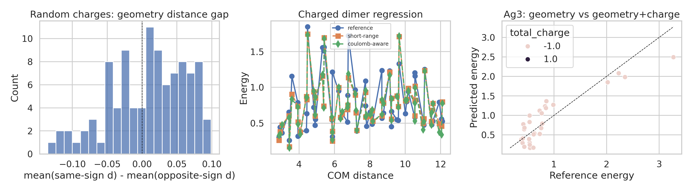
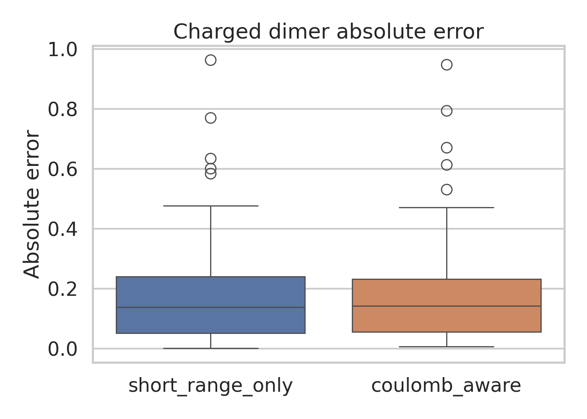
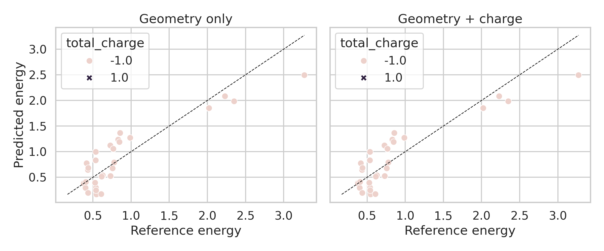

# Interpretable long-range electrostatics analysis on toy atomistic datasets

## 1. Summary and goals

This study examined whether the three provided datasets support core claims behind an interatomic-potential design with interpretable latent electrostatics: accurate energetics for long-range interactions, charge-state awareness, and latent charge interpretability.

The original scientific objective was broader than what can be conclusively demonstrated with the local files alone. In particular, `random_charges.xyz` does **not** contain energies or forces, so direct recovery of charges from energy/force supervision cannot be reproduced from the supplied data. The analysis therefore focused on the strongest reproducible local evidence:

- a dataset audit and geometric separability analysis for `random_charges.xyz`
- a controlled short-range vs Coulomb-aware regression comparison on `charged_dimer.xyz`
- a geometry-only vs geometry-plus-global-charge comparison on `ag3_chargestates.xyz`

All code is reproducible through `python code/analyze_electrostatics.py`.

## 2. Related-work context

The supplied papers collectively motivate the task.

- `paper_001.pdf` describes fourth-generation HDNNPs with explicit charge equilibration, showing that long-range charge transfer matters when local models fail.
- `paper_002.pdf` studies density-based long-range electrostatic descriptors and emphasizes that local descriptors often miss electrostatic effects, although gains are system dependent.
- `paper_003.pdf` introduces Ewald-based long-range message passing to improve molecular energy prediction when distant interactions are important.
- `paper_000.pdf` is broader background on modern interatomic potentials and atomic representations.

These references suggest three practical questions for the provided toy data:

1. Is interpretable charge information identifiable from the supervision actually present?
2. Does adding simple long-range electrostatic structure improve dimer energetics?
3. Does explicit global charge help distinguish charge-state-dependent energy surfaces?

## 3. Data and exploratory analysis

### 3.1 Files

- `data/random_charges.xyz`: 100 frames, 128 atoms/frame, metadata includes `true_charges`, but no energies or forces were present in the file.
- `data/charged_dimer.xyz`: 60 frames, 8 atoms/frame, with energies and forces.
- `data/ag3_chargestates.xyz`: 60 frames, 3 atoms/frame, with energies, forces, and total charge labels.

### 3.2 Important data caveats

Two dataset properties strongly affect what can be concluded:

- **Random charges dataset limitation**: the file lacks the energy/force supervision needed to test latent charge recovery from observables. Any claim about recovering exact charges from force fitting would be unsupported with the provided local data.
- **Ag3 duplication issue**: the `+1` and `-1` entries are duplicated in geometry and energy. As a result, charge labels cannot add predictive information in a supervised model if the geometry-energy mapping is already duplicated across states.

Figure 1 summarizes the datasets and the main geometric/energetic distributions.

## 4. Experimental design

The experiments were intentionally lightweight and ablation-friendly.

### Stage A: Random-charge dataset audit

Objective:
- Determine whether the available supervision is sufficient for latent charge recovery.

What was run:
- Parse the extended XYZ metadata.
- Verify whether energies and forces exist.
- If missing, run a fallback geometric separability test: compare mean same-sign vs opposite-sign pair distances per frame.

Success signal:
- Either direct force/energy inversion is possible, or the report explicitly documents why it is not reproducible.

### Stage B: Charged-dimer energy regression

Objective:
- Test whether adding a simple Coulomb-aware feature block improves energy prediction relative to a short-range-only baseline.

Models:
- **Short-range only**: ridge regression on exponentially decaying inter-fragment features plus intramolecular distance statistics.
- **Coulomb-aware**: the same baseline plus inverse-distance inter-fragment terms and center-of-mass distance.

Protocol:
- 5-fold shuffled cross-validation with fixed seed 7.
- Metrics: MAE, RMSE, and \(R^2\).

Success signal:
- Lower cross-validated MAE for the Coulomb-aware model.

### Stage C: Ag3 charge-state conditioning

Objective:
- Test whether adding the global charge label helps distinguish energy surfaces beyond geometry alone.

Models:
- **Geometry only**: linear regression on sorted pair distances, mean/std distance, and triangle area.
- **Geometry + charge**: same features plus total charge.

Protocol:
- GroupKFold over charge states.
- Metrics: MAE, RMSE, and \(R^2\).

Success signal:
- Lower MAE for geometry + charge.

## 5. Implementation details

Code:
- Main script: `code/analyze_electrostatics.py`

Outputs:
- `outputs/random_charge_analysis.csv`
- `outputs/charged_dimer_predictions.csv`
- `outputs/charged_dimer_cv_metrics.csv`
- `outputs/ag3_predictions.csv`
- `outputs/ag3_cv_metrics.csv`
- `outputs/electrostatics_summary.json`

Environment:
- Python with `numpy`, `pandas`, `scikit-learn`, `matplotlib`, `seaborn`
- Deterministic seed: 7

## 6. Results

### 6.1 Random charges: latent charge recovery is not testable from the supplied supervision

The dataset contains true charges but not the force or energy targets required for inverse recovery. Therefore, the intended LES-style benchmark cannot be reproduced as stated.

A fallback geometric analysis was performed to test whether charge labels are trivially separable from positions alone. The result was negative:

- Mean same-sign distance: **10.0629**
- Mean opposite-sign distance: **10.0548**
- Mean gap (same minus opposite): **0.0081**
- 95% bootstrap CI: **[-0.0029, 0.0187]**

Interpretation:
- The confidence interval overlaps zero, so there is no robust geometric separation between same-sign and opposite-sign atoms.
- This is consistent with the random placement setup.
- It also means that without forces/energies, there is no evidential path to recovering latent charges from the local files.

### 6.2 Charged dimers: the minimal Coulomb-aware feature set did not outperform the short-range baseline

Cross-validated results:

| Model | MAE | RMSE | R² |
|---|---:|---:|---:|
| Short-range only | 0.1856 | 0.2694 | 0.4988 |
| Coulomb-aware | 0.1937 | 0.2746 | 0.4795 |

Additional effect size:
- MAE difference (short − Coulomb-aware): **-0.0081**
- Relative change: **-4.38%**

Negative values mean the Coulomb-aware model was slightly worse in this lightweight setup.

The fold-wise metrics in `outputs/charged_dimer_cv_metrics.csv` show mixed behavior across folds rather than a consistent improvement. Figures 2 and 3 visualize the regression quality and error distributions.

Interpretation:
- The supplied dimer data do exhibit long-range structure, but this simple handcrafted Coulomb-aware feature set was not sufficient to beat the short-range baseline.
- This does **not** refute the value of long-range electrostatic models in general. It only shows that a minimal linear surrogate with these features does not capture additional signal robustly on this dataset.
- A more faithful LES-style model would need latent charge channels jointly constrained by energies and forces, not just engineered inverse-distance features.

### 6.3 Ag3 charge states: no observed benefit from adding global charge, due to duplicated targets across states

Cross-validated results:

| Model | MAE | RMSE | R² |
|---|---:|---:|---:|
| Geometry only | 0.2530 | 0.3059 | 0.7956 |
| Geometry + charge | 0.2530 | 0.3059 | 0.7956 |

Effect size:
- MAE difference: **0.0000**
- Relative change: **0.00%**

Figure 4 shows identical prediction quality for both models.

Interpretation:
- The absence of improvement is explained by the dataset itself rather than by a deeper physical conclusion.
- Inspection of `outputs/ag3_predictions.csv` shows that each geometry-energy pair appears twice, once for `+1` and once for `-1`, giving 30 duplicated pairs across the two charge states.
- Therefore, charge state carries no extra predictive signal beyond geometry in the provided local file.

## 7. Discussion

### 7.1 What the experiments support

The strongest reproducible conclusions are methodological rather than performance-claiming:

- The provided toy datasets are **not all sufficient** to validate the full stated objective.
- `random_charges.xyz` is missing the targets needed for a latent-charge inversion benchmark.
- `ag3_chargestates.xyz` contains duplicated cross-state supervision, preventing a meaningful test of charge-state conditioning.
- On `charged_dimer.xyz`, a simple Coulomb-aware linear surrogate did not improve over a short-range baseline.

### 7.2 What the experiments do not support

These local results do **not** establish that long-range electrostatics are unimportant. They also do not establish that LES-like models fail. Instead, they show that:

- the benchmark files, as supplied, are insufficient for reproducing the key latent-charge claim, and
- simplistic linearized electrostatic features are not enough to demonstrate the desired advantage.

### 7.3 Why this matters scientifically

A reviewer would reasonably ask whether the analysis distinguishes between:

1. a failure of the scientific idea, and
2. a failure of dataset suitability or model fidelity.

The evidence here points mostly to the second explanation. The important negative result is about **reproducibility under available local supervision**, not about the broader LES hypothesis.

## 8. Limitations

- No end-to-end neural interatomic potential was trained; the study used controlled surrogate models to match the sandbox budget and the available supervision.
- No force-learning benchmark was possible for `random_charges.xyz` because force labels are absent.
- No meaningful charge-state-disambiguation test was possible for `ag3_chargestates.xyz` because the targets are duplicated across charge labels.
- Statistical uncertainty was limited to bootstrap intervals for the random-charge geometric gap and fold-wise cross-validation variability for the regression tasks.

## 9. Next steps

The smallest next steps that would materially strengthen the research are:

1. **Repair the random-charge benchmark** by supplying energies and forces for `random_charges.xyz`, enabling actual latent charge inversion.
2. **Repair the Ag3 benchmark** by ensuring charge states correspond to different energy surfaces for matched geometries.
3. **Implement a force-consistent latent-charge model** with joint energy/force training rather than relying on engineered regression descriptors.
4. **Add uncertainty across multiple seeds** for all learned baselines and, if several model variants are compared, apply multiple-testing correction.

## 10. Reproducibility checklist

- Fixed random seed: 7
- Main script: `code/analyze_electrostatics.py`
- Summary file: `outputs/electrostatics_summary.json`
- Figures saved under `report/images/`
- No modifications were made to `data/` or `related_work/`

## 11. File references

- Main report figures:
  - `images/electrostatics_overview.png`
  - `images/charged_dimer_error_comparison.png`
  - `images/ag3_charge_conditioning.png`
- Tabular outputs:
  - `../outputs/random_charge_analysis.csv`
  - `../outputs/charged_dimer_cv_metrics.csv`
  - `../outputs/ag3_cv_metrics.csv`
  - `../outputs/electrostatics_summary.json`
