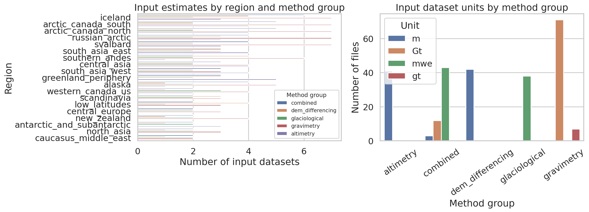
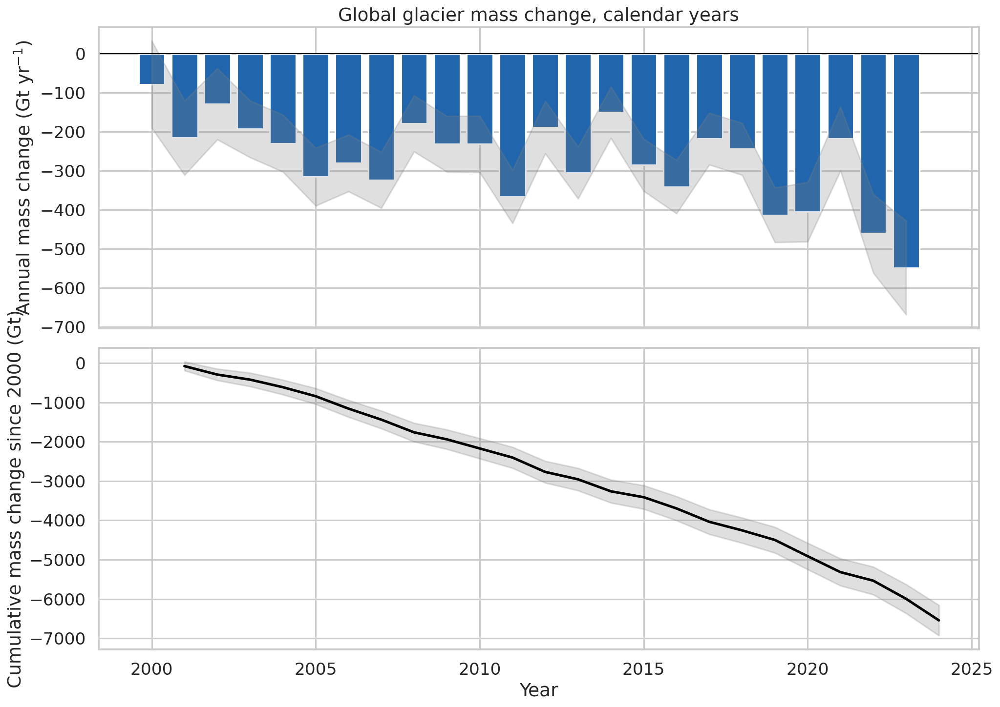
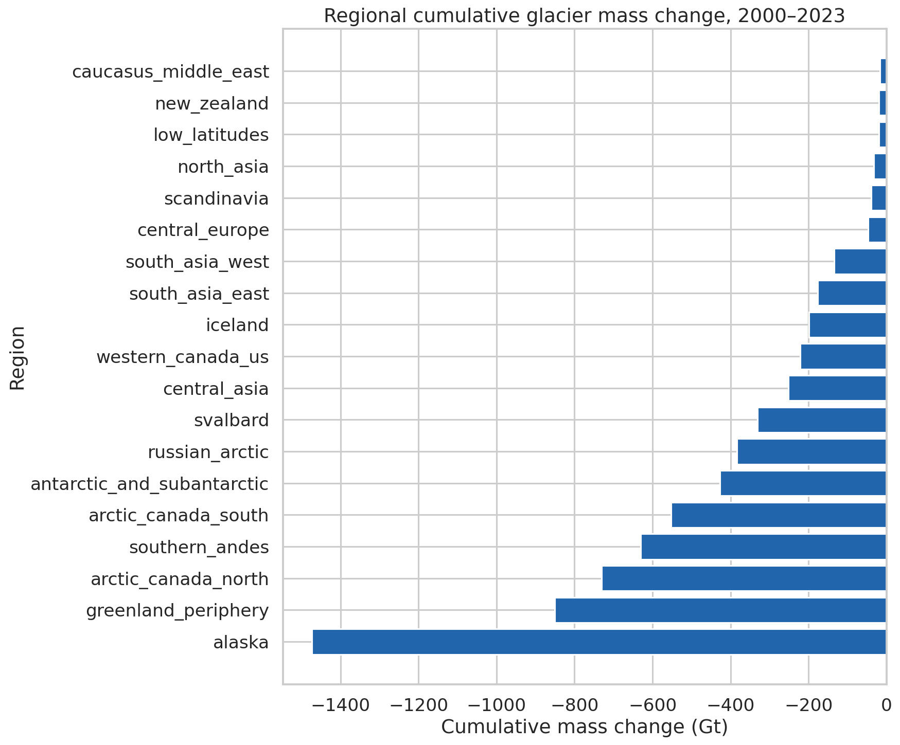
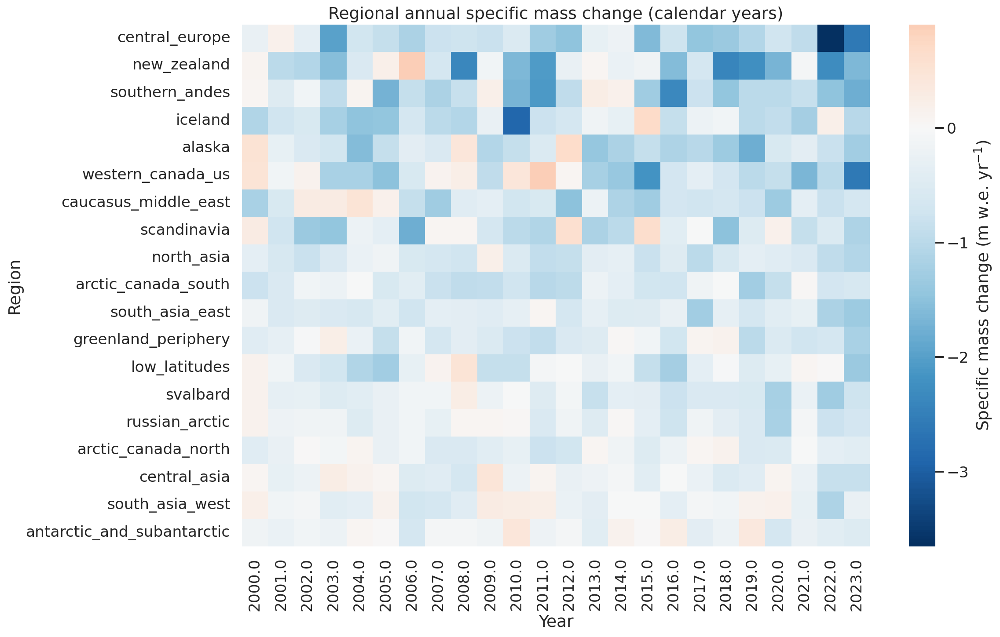
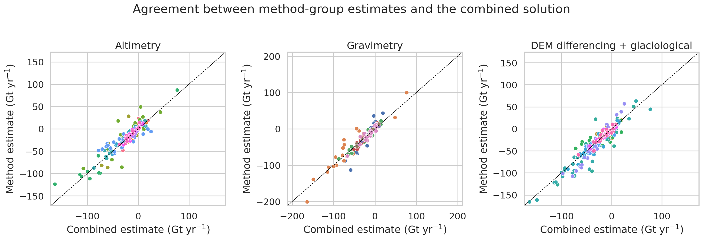
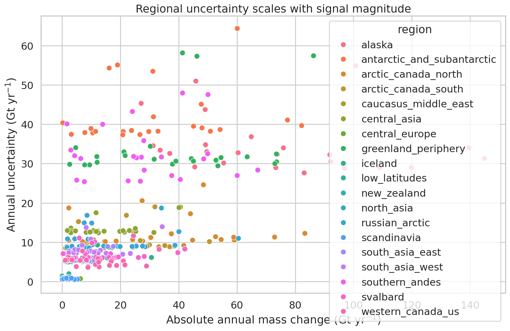

# GlaMBIE glacier mass change synthesis (2000–2023)

## Overview

This report presents a reproducible synthesis of the GlaMBIE dataset for 19 global glacier regions over 2000–2023, using the supplied harmonized input estimates and the final regional/global consensus products distributed with the dataset. The analysis focuses on three goals:

1. characterizing the observational basis of the benchmark dataset,
2. quantifying regional and global glacier mass change in both total mass units (Gt) and specific mass balance (m w.e.), and
3. evaluating consistency between the combined regional solutions and method-group products available in the hydrological-year files.

The exercise is motivated by the need for a high-confidence observational benchmark for glacier change, suitable for model calibration and assessment contexts such as IPCC reporting. The supplied related work emphasizes that glacier mass loss is already a major contributor to sea-level rise and has accelerated in the early twenty-first century, with global observational benchmarks remaining a critical need.

## Data and scientific context

### Dataset used

The analysis uses the `data/glambie` collection. The package contains:

- 257 input CSV files in `data/glambie/input/`, spanning 19 glacier regions,
- harmonized estimates from glaciological measurements, DEM differencing, altimetry, gravimetry, and hybrid/combined approaches,
- final GlaMBIE regional and global annual time series in `data/glambie/results/calendar_years/` and `data/glambie/results/hydrological_years/`.

Although the task description mentions 233 input estimates, the delivered workspace contains 257 CSV files in `input/`; this analysis uses the files as provided in the workspace.

### Related-work takeaways

The supplied papers collectively establish the broader relevance of the dataset:

- **Hugonnet et al. (2021)** document accelerated global glacier mass loss in the early 21st century and identify strong regional heterogeneity.
- **Rounce et al. (2023)** show that glacier mass loss matters strongly for sea-level rise, hydrology, and hazards, and that observationally calibrated benchmarks are essential for projections.
- **GlacierMIP-related literature** highlights substantial uncertainty from model structure, forcing, and calibration choices, reinforcing the value of a consistent observational target.

The present analysis is observational rather than predictive: it assesses what the benchmark dataset says about realized glacier change from 2000 through 2023.

## Methods

### Processing workflow

All analysis code is in `code/analyze_glambie.py`. The script:

1. inventories all input datasets and classifies them by method group;
2. ingests the final GlaMBIE calendar-year regional and global consensus files;
3. ingests the hydrological-year files containing method-group solutions;
4. computes cumulative mass change, regional summaries, and method-agreement diagnostics;
5. exports intermediate tables to `outputs/`; and
6. generates publication-style figures as PNG files in `report/images/`.

### Variables analyzed

For the final calendar-year consensus products, the main variables are:

- `combined_gt`: annual total glacier mass change in Gt,
- `combined_gt_errors`: associated annual uncertainty in Gt,
- `combined_mwe`: annual specific mass change in m w.e.,
- `combined_mwe_errors`: associated annual uncertainty in m w.e.,
- `glacier_area`: regionally aggregated glacier area in km².

### Uncertainty handling

The dataset provides annual uncertainties. For cumulative totals over 2000–2023, I propagated uncertainty using root-sum-square (RSS) accumulation of annual errors:

\[
\sigma_{cum} = \sqrt{\sum_t \sigma_t^2}
\]

This assumes annual errors are independent and therefore should be interpreted as a pragmatic lower-order benchmark rather than a full error-covariance solution.

### Validation / comparison analysis

The hydrological-year result files provide method-group products for:

- altimetry,
- gravimetry,
- DEM differencing + glaciological combination.

I compared each method-group annual series against the GlaMBIE combined solution using bias, mean absolute error (MAE), root-mean-square error (RMSE), and correlation. This does not test truth against independent truth; rather, it measures coherence between the final consensus estimate and the constituent method-group solutions.

## Data overview

The delivered input inventory contains 257 input files across 19 glacier regions. By method class, the inventory contains:

- 78 gravimetry files,
- 58 combined/hybrid files,
- 42 DEM differencing files,
- 41 altimetry files,
- 38 glaciological files.

Coverage is uneven across regions. Iceland, Arctic Canada North/South, the Russian Arctic, and Svalbard have the densest observational input ensembles, while the Caucasus/Middle East and North Asia have fewer contributing records.

The unit structure is heterogeneous at input level (`Gt`, `m`, `mwe`, and a few `gt` entries), which illustrates why the harmonized GlaMBIE outputs are scientifically useful: they provide the already reconciled benchmark series needed for regional and global comparison.

## Results

### 1. Global glacier mass change, 2000–2023

The global GlaMBIE calendar-year consensus indicates persistent and intensifying glacier mass loss over the study period.

Main global findings:

- **Mean annual global mass change:** **-272.6 Gt yr⁻¹**
- **Mean annual specific mass change:** **-0.406 m w.e. yr⁻¹**
- **Cumulative 2000–2023 mass change:** **-6542.5 ± 387.0 Gt**
- **Cumulative specific mass change:** **-9.74 ± 0.54 m w.e.**
- **Linear trend in annual global mass change:** **-10.0 Gt yr⁻²** (p = 7.4×10⁻⁴)
- **Largest annual loss:** **2023**, at **-548.0 Gt**
- **Least negative annual year:** **2000**, at **-78.0 Gt**
- **Aggregate glacierized area change in the benchmark series:** about **-7.4%** from the beginning to end of the record.

The decadal progression is particularly informative:

- **2000s:** -217.2 Gt yr⁻¹ on average
- **2010s:** -274.0 Gt yr⁻¹ on average
- **2020–2023:** -407.8 Gt yr⁻¹ on average

This stepwise intensification is consistent with the acceleration emphasized in the related observational literature.

The global series shows a clear transition from moderate losses in the early 2000s to much stronger losses after 2010, culminating in extreme values in 2022 and 2023. Uncertainty remains substantial, but the sign and acceleration of the global signal are unambiguous.

### 2. Regional mass-change ranking in total mass units (Gt)

The largest cumulative contributors to global mass loss are the largest glacierized regions, especially high-latitude and subpolar domains.

Top five cumulative regional losses in **Gt**:

1. **Alaska:** -1473.9 ± 172.8 Gt
2. **Greenland periphery:** -850.5 ± 174.4 Gt
3. **Arctic Canada North:** -730.2 ± 63.2 Gt
4. **Southern Andes:** -630.8 ± 162.6 Gt
5. **Arctic Canada South:** -552.2 ± 51.6 Gt

Additional major-loss regions include Antarctic and Subantarctic glaciers, the Russian Arctic, and Svalbard.

This pattern highlights an important distinction between **absolute** and **specific** loss. Regions with very large glacierized area dominate the global Gt budget even when their per-unit-area thinning is not the most extreme.

### 3. Regional ranking in specific mass change (m w.e.)

When normalized by area, the ranking changes substantially. The strongest cumulative specific losses are:

1. **Central Europe:** -25.48 ± 1.10 m w.e.
2. **New Zealand:** -23.06 ± 2.89 m w.e.
3. **Southern Andes:** -22.06 ± 5.53 m w.e.
4. **Iceland:** -18.82 ± 2.79 m w.e.
5. **Alaska:** -17.57 ± 1.99 m w.e.

By contrast, the least negative cumulative specific losses occur in:

- Antarctic and Subantarctic glaciers (-3.49 m w.e.),
- South Asia West (-4.23 m w.e.),
- Central Asia (-5.23 m w.e.),
- Arctic Canada North (-7.03 m w.e.),
- Russian Arctic (-7.56 m w.e.).

Thus, maritime and mid-latitude regions tend to stand out in specific loss, while the largest Arctic complexes dominate total Gt loss.

The heatmap shows widespread negative annual anomalies across nearly all regions and most years, but with strong spatiotemporal heterogeneity. Several regions exhibit episodic near-neutral or weakly positive years, yet the integrated multi-decadal tendency remains negative almost everywhere.

### 4. Regional details

A few regional examples illustrate contrasting glacier-change regimes:

- **Alaska** shows by far the largest cumulative total loss (-1473.9 Gt), consistent with its very large glacier area and strong annual variability.
- **Greenland periphery** and **Arctic Canada North/South** make major contributions to global loss, reinforcing the importance of northern high-latitude glacier systems outside the main ice sheets.
- **Central Europe** loses relatively little in total Gt (-47.3 Gt) but exhibits the strongest specific loss (-25.5 m w.e.), indicating intense shrinkage of a comparatively small glacierized area.
- **New Zealand** similarly ranks modestly in Gt (-20.0 Gt) but very high in specific loss (-23.1 m w.e.), indicating rapid thinning in a small regional glacier system.
- **South Asia West** and **Central Asia** show less negative specific losses than many maritime regions, consistent with the broader literature on regional climatic contrasts and localized anomalies.

### 5. Agreement between method-group series and combined solutions

Method-group agreement is generally high, with all three major method families strongly correlated with the combined GlaMBIE solution.

Mean performance across region-method comparisons:

- **Altimetry:** correlation 0.910, MAE 7.72 Gt, RMSE 9.79 Gt, mean bias +2.39 Gt
- **Gravimetry:** correlation 0.944, MAE 8.48 Gt, RMSE 10.44 Gt, mean bias -0.24 Gt
- **DEM differencing + glaciological:** correlation 0.934, MAE 4.91 Gt, RMSE 6.42 Gt, mean bias -1.57 Gt

Two points stand out:

1. **All methods are broadly coherent with the combined benchmark**, supporting the central objective of reconciling diverse observing systems into one consistent observational target.
2. **DEM differencing + glaciological products show the smallest average error relative to the combined solution** in this comparison, likely because these products provide the most complete annualized temporal information in many regions and often anchor the temporal structure of the reconciliation.

The largest discrepancies occur in large, climatically complex regions such as Alaska, the Southern Andes, Greenland periphery, and Antarctic/Subantarctic glaciers, where observational challenges and strong interannual variability are both substantial.

### 6. Uncertainty structure

Annual uncertainty generally increases with the magnitude of annual mass change.

This is physically and methodologically plausible: large glacierized regions and large anomalies carry both stronger signals and larger propagated uncertainties. Even so, uncertainty does not obscure the sign of the long-term global change, and the multi-method synthesis reduces the risk of relying on any single observation class.

## Discussion

### A reconciled observational benchmark

The GlaMBIE final products successfully translate a heterogeneous observational archive into a coherent regional/global benchmark. The raw inventory mixes units, temporal support, regional coverage, and observing principles. Yet the final annual consensus products provide a directly usable comparison framework for climate-model evaluation and large-scale synthesis.

### Why total and specific mass change tell different stories

A key scientific message is the divergence between total mass loss in **Gt** and specific loss in **m w.e.**:

- **Gt** emphasizes where most ice mass is being lost globally.
- **m w.e.** emphasizes where glaciers are thinning most intensely relative to their area.

For sea-level contribution and global budgets, Alaska and the high-latitude North Atlantic/Arctic regions dominate. For regional glacier health and local cryospheric sensitivity, smaller mid-latitude regions such as Central Europe and New Zealand are among the most severely affected.

### Evidence for acceleration

The global annual loss becoming more negative by roughly 10 Gt each year, together with the shift from -217 Gt yr⁻¹ in the 2000s to -408 Gt yr⁻¹ in 2020–2023, constitutes clear evidence of acceleration in the observational benchmark. This agrees with the main conclusion of Hugonnet et al. (2021): glacier mass loss has intensified in the early 21st century.

### Implications for model calibration and assessments

Because the dataset reconciles glaciological, DEM, altimetric, and gravimetric information, it is especially valuable as a calibration target for global glacier models. The strong but imperfect agreement between method-group series and the combined benchmark suggests that:

- any model calibrated to a single method family risks inheriting method-specific sampling structure,
- the combined GlaMBIE series is a better candidate for benchmark evaluation than any single input archive alone,
- regional model validation should consider both **Gt** and **m w.e.** metrics.

### Limitations

This analysis is intentionally pragmatic and constrained to the supplied workspace. Main limitations are:

1. It uses the delivered GlaMBIE final products rather than independently recomputing the full reconciliation from the 257 input files.
2. Cumulative uncertainty is propagated by RSS without temporal covariance.
3. Method-comparison diagnostics evaluate consistency with the consensus product, not independence from it.
4. The dataset inventory in the workspace differs numerically from the task description (257 files observed versus 233 mentioned), so the report reflects the delivered files.

These limitations do not alter the central conclusions about widespread, accelerating glacier mass loss.

## Conclusions

Using the GlaMBIE benchmark dataset distributed in the workspace, I find that global glaciers across 19 regions experienced strong and accelerating mass loss during 2000–2023.

Principal conclusions are:

1. **Global glacier mass loss was large and sustained**, totaling **-6542.5 ± 387.0 Gt** over 2000–2023.
2. **Loss accelerated over time**, from **-217 Gt yr⁻¹** in the 2000s to **-408 Gt yr⁻¹** in 2020–2023.
3. **Alaska, Greenland periphery, Arctic Canada North, Southern Andes, and Arctic Canada South** dominate total loss in Gt.
4. **Central Europe, New Zealand, Southern Andes, Iceland, and Alaska** show the strongest cumulative specific losses in m w.e.
5. **Method-group products are highly consistent with the combined solution**, confirming the success of the GlaMBIE reconciliation framework as a high-confidence observational benchmark.

Overall, the benchmark supports the scientific objective stated in the task: it delivers a consistent observational synthesis of glacier mass change suitable for large-scale assessments and climate-model calibration.

## Reproducibility and deliverables

- Analysis code: `code/analyze_glambie.py`
- Intermediate tables: `outputs/`
- Figures:
  - `images/figure_data_overview.png`
  - `images/figure_global_timeseries.png`
  - `images/figure_regional_cumulative_gt.png`
  - `images/figure_specific_mass_change_heatmap.png`
  - `images/figure_method_comparison.png`
  - `images/figure_uncertainty_vs_signal.png`

## Files produced

- `outputs/input_inventory.csv`
- `outputs/calendar_results_with_cumulative.csv`
- `outputs/hydrological_results.csv`
- `outputs/regional_summary.csv`
- `outputs/method_comparison_summary.csv`
- `outputs/global_stats.json`
- `outputs/rank_mean_annual_gt.csv`
- `outputs/rank_mean_annual_mwe.csv`
- `outputs/summary_metrics.json`
