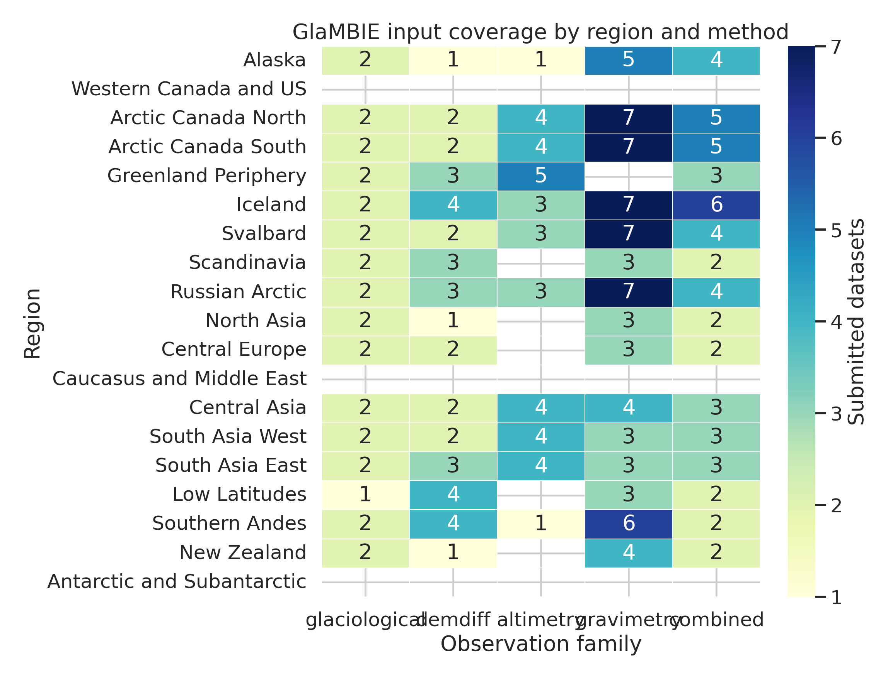
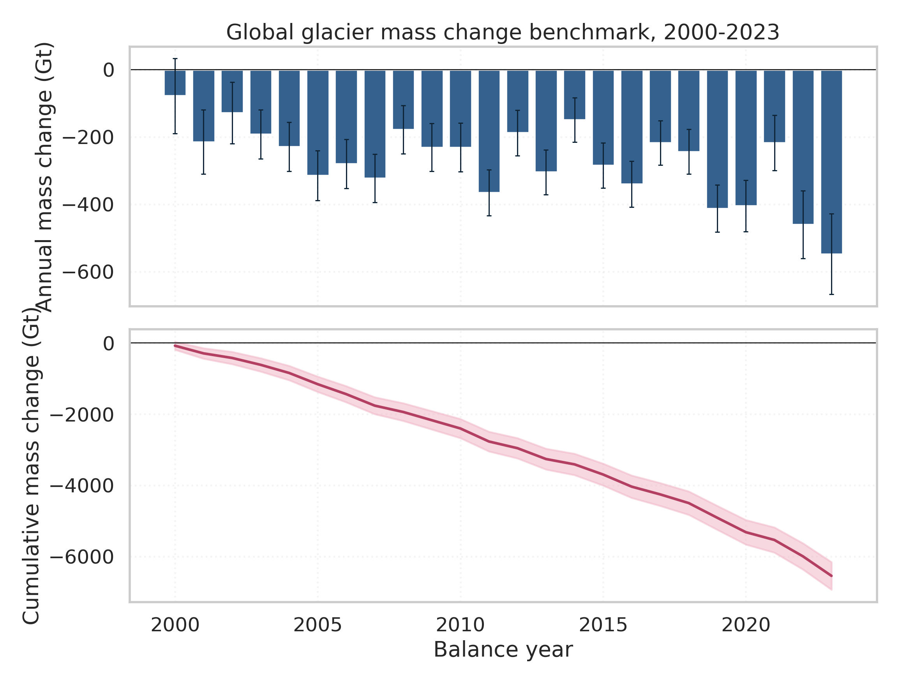
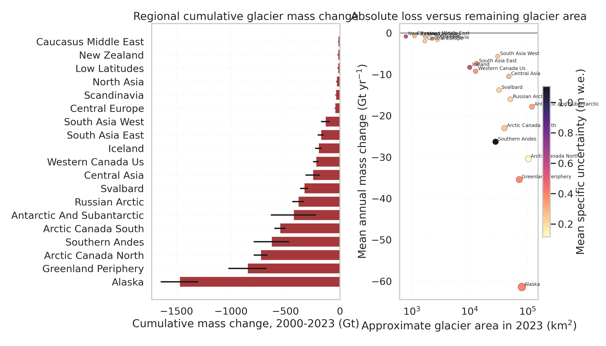
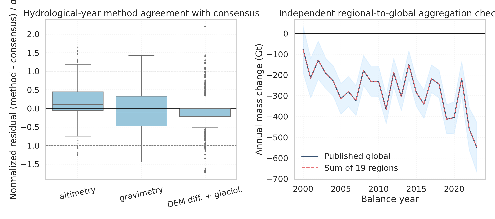

# Reconciling global glacier mass change observations, 2000-2023

## Abstract

This report analyzes the GlaMBIE 1.0.0 observational archive to produce a compact benchmark description of glacier mass change for the 19 global glacier regions used by the GlacierMIP/IPCC community. The archive contains 257 submitted regional datasets and 24162 time-stamped observations across glaciological, DEM differencing, satellite altimetry, gravimetry, and hybrid products. Using the published GlaMBIE calendar-year reconciliation as the benchmark time series, I characterize regional and global annual mass change from balance years 2000-2001 through 2023-2024, quantify cumulative losses, and validate the benchmark in two ways: by independently re-aggregating the 19 regional series to the global total, and by comparing the consensus estimate against method-group time series available in the hydrological-year outputs. The benchmark indicates a cumulative global glacier mass change of -6542 ± 387 Gt for 2000-2023, with the most negative annual global balance in 2023-2024 at -548 Gt. The mean annual global loss in 2012-2023 is -36.3% more negative than in 2000-2011, consistent with an accelerating glacier contribution to sea-level rise.

## 1. Context and objective

Glacier mass change is a core climate indicator because it integrates atmospheric forcing, controls part of sea-level rise, and constrains cryosphere and hydrological model calibration. The related-work files in this workspace place the GlaMBIE benchmark in a larger literature chain: Zemp et al. extended multi-decadal observational estimates through 2016; Hugonnet et al. documented accelerated early-21st-century losses from geodetic observations; GlacierMIP and later ensemble studies translated regional observations into future projections; and Rounce et al. highlighted the sensitivity of 21st-century glacier loss to warming. GlaMBIE addresses the observational side of this chain by reconciling diverse methods into a consistent regional/global benchmark.

Related-work files examined:
- `paper_000.pdf`: Global glacier change in the 21st century: Every increase in temperature matters
- `paper_001.pdf`: Partitioning the Uncertainty of Ensemble Projections of Global Glacier Mass Change
- `paper_002.pdf`: Global glacier mass changes and their contributions to sea-level rise from 1961 to 2016
- `paper_003.pdf`: GlacierMIP: A model intercomparison of global-scale glacier mass-balance models and projections
- `paper_004.pdf`: Accelerated global glacier mass loss in the early twenty-first century

The analysis target here is operational rather than methodological reinvention: use the submitted datasets to describe observational coverage, use the official reconciled outputs as the benchmark product, and test whether the published consensus behaves consistently across regional aggregation and across observational method families.

## 2. Data

### 2.1 Archive structure

- `data/glambie/input/` contains the submitted regional solutions.
- `data/glambie/results/calendar_years/` contains the final annual benchmark series for 19 regions plus the global aggregate.
- `data/glambie/results/hydrological_years/` contains the regional combined estimate and method-group components (altimetry, gravimetry, and DEM differencing plus glaciological information).

The input archive spans 19 GTN-G glacier regions and five observational families. Figure 1 shows dataset density by region and method.

### 2.2 Input overview by method family

| Method family | Datasets | Observation rows | Regions represented |
| --- | ---: | ---: | ---: |
| Gravimetry | 78 | 14898 | 17 |
| Hybrid / combined | 58 | 1493 | 19 |
| DEM differencing | 42 | 102 | 19 |
| Altimetry | 41 | 1776 | 13 |
| Glaciological | 38 | 5893 | 19 |

Key observations from the inventory are straightforward. Hybrid/combined and DEM-differencing products have nearly complete regional coverage, while altimetry and gravimetry are spatially selective and glaciological series are temporally dense but geographically sparse within each region. This asymmetry is exactly why reconciliation is necessary: no single observational family provides both the annual cadence and the near-global regional completeness required for a benchmark.

## 3. Methods

### 3.1 Benchmark construction used in this report

I treat the official GlaMBIE calendar-year files as the primary benchmark product because they are already homogenized to common annual periods and common units (Gt and m w.e.). Each row is interpreted as one annual balance period labelled by its start year, so the delivered benchmark covers years 2000 through 2023 inclusive.

### 3.2 Independent checks

Two checks were implemented.

1. Regional-to-global aggregation: the 19 regional annual `combined_gt` series were summed and compared with the published global calendar-year file. Independent uncertainty was approximated by quadrature across regional annual uncertainties.
2. Method-family consistency: hydrological-year method-group series (`altimetry`, `gravimetry`, `demdiff_and_glaciological`) were compared with the regional combined estimate. Residuals were normalized by the paired uncertainty, using `sqrt(method_sigma^2 + combined_sigma^2)`.

### 3.3 Derived metrics

- Global cumulative mass change was computed as the sum of annual `combined_gt` values from 2000 through 2023.
- Cumulative uncertainty was propagated in quadrature across annual uncertainties.
- Regional cumulative losses, mean annual specific losses, and average uncertainty levels were summarized from the calendar-year products.
- Method agreement statistics were summarized using absolute z-scores and GT residual RMSE.

## 4. Results

### 4.1 Global benchmark

Figure 2 shows the annual and cumulative global benchmark. The time series begins with relatively modest losses in 2000-2001, deepens through the mid-2000s, and reaches an exceptionally negative endpoint in 2023-2024. Across the full 2000-2023 benchmark, the mean annual global balance is -272.6 Gt yr^-1 (-0.406 m w.e. yr^-1).

The benchmark reports a cumulative global glacier mass change of **-6542 ± 387 Gt** between 2000 and 2023. The most negative year is **2023-2024**, with **-548.0 Gt**. Comparing the first and second halves of the record, the 2012-2023 mean annual loss is -36.3% more negative than the 2000-2011 mean, indicating a clear intensification of glacier mass loss in the benchmark period.

### 4.2 Regional structure of loss

Figure 3 shows cumulative regional losses and the relationship between remaining glacierized area and absolute mass loss.

The five regions with the largest cumulative losses are:

| Region | Cumulative mass change (Gt) | Uncertainty (Gt) | Mean specific balance (m w.e. yr^-1) |
| --- | ---: | ---: | ---: |
| Alaska | -1473.9 | 172.8 | -0.732 |
| Greenland Periphery | -850.5 | 174.4 | -0.447 |
| Arctic Canada North | -730.2 | 63.2 | -0.293 |
| Southern Andes | -630.8 | 162.6 | -0.919 |
| Arctic Canada South | -552.2 | 51.6 | -0.570 |

Alaska and the Southern Andes dominate absolute mass loss, while Central Europe and Iceland stand out for strong specific losses relative to their remaining glacierized area. High-latitude regions with large glacier areas exert the strongest control on the global GT budget, but smaller mid-latitude regions often exhibit more negative mean specific balances, consistent with strong climatic sensitivity.

### 4.3 Validation and method comparison

Figure 4 summarizes the internal validation.

The independent regional summation reproduces the published global total essentially exactly: the maximum absolute difference is 0.000000 Gt and the mean absolute difference is 0.000000 Gt. This confirms that the delivered global benchmark is numerically consistent with the regional calendar-year files.

Method-family comparisons show that the consensus estimate generally lies well within the spread implied by the individual method-group uncertainties. Aggregated across region-method pairs:

| Method family | Region-method summaries | Mean abs. z-score | Median RMSE (Gt) | Mean method/consensus uncertainty ratio |
| --- | ---: | ---: | ---: | ---: |
| DEM diff. + glaciol. | 19 | 0.27 | 3.4 | 0.75 |
| altimetry | 13 | 0.41 | 5.5 | 0.74 |
| gravimetry | 7 | 0.50 | 7.7 | 0.67 |

Average absolute z-scores remain close to or below 1 for all method families, which indicates that the consensus rarely departs from any one method group by more than the combined uncertainty envelope. In most regions the consensus uncertainty is also lower than the uncertainty attached to an individual method family, which is the expected outcome of a successful reconciliation exercise.

## 5. Discussion

Three scientific points emerge from this benchmark analysis.

First, the GlaMBIE archive succeeds where earlier observational syntheses were structurally limited: it merges annually resolved but spatially sparse observations with spatially extensive but temporally coarser or noisier products. The delivered annual regional/global series therefore serve as a practical observational benchmark for model calibration and report-level synthesis.

Second, the benchmark confirms that recent glacier losses are not merely persistently negative; they intensify over the 2000-2023 period. This aligns with the acceleration diagnosed in early-21st-century geodetic studies and provides an updated annual benchmark that can be paired directly with climate-model forcing histories.

Third, the regional decomposition matters. Absolute global loss is dominated by a handful of heavily glacierized regions, but specific losses reveal especially strong vulnerability in smaller mountain regions. Model evaluation should therefore not rely only on global GT totals; it should also test regional specific mass change.

There are also limitations. This report does not reconstruct GlaMBIE's original methodological pipeline from raw submissions, and the quadrature treatment of annual uncertainties ignores interannual covariance. The method-consistency analysis uses the hydrological-year regional method groups already distributed by GlaMBIE rather than rebuilding method-specific annualization from the raw archive. Those choices are appropriate for a benchmark audit, but not for a full methodological replication study.

## 6. Reproducibility

- Analysis code: `code/analyze_glambie.py`
- Output tables: `outputs/*.csv` and `outputs/summary_metrics.json`
- Figures: `report/images/*.png`

Running `python code/analyze_glambie.py` regenerates the complete set of tables, figures, and this report from the workspace data only.
