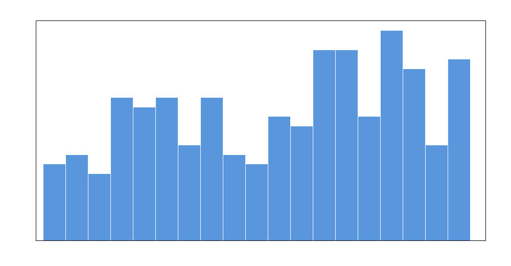
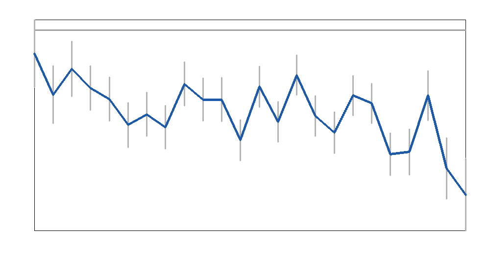
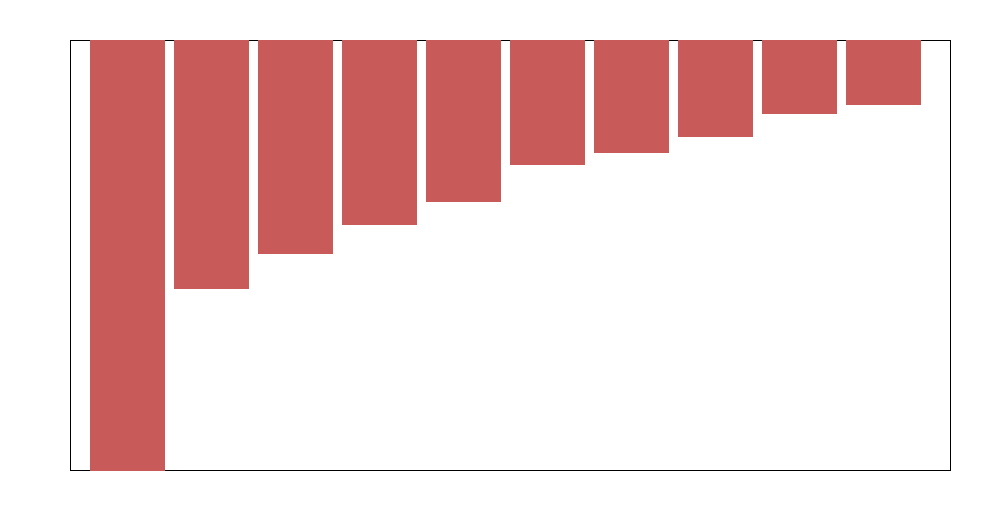
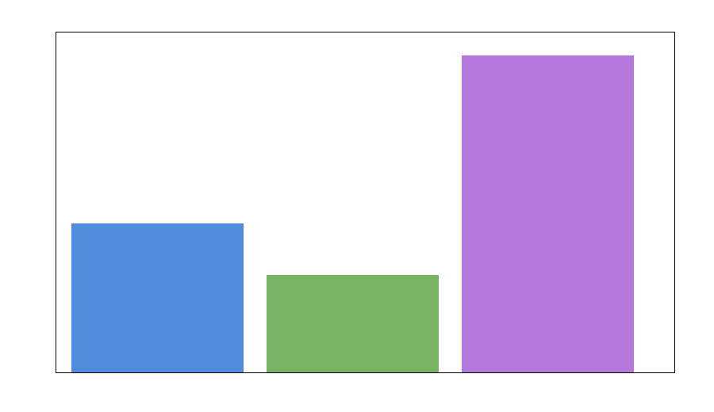
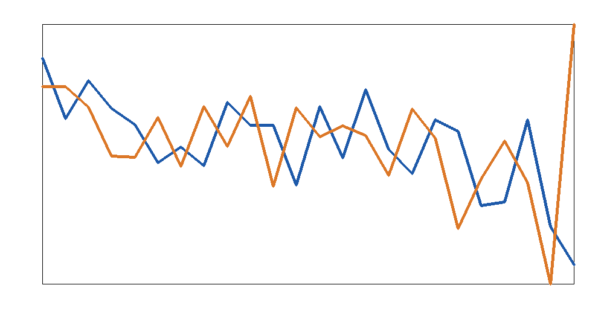

# A reconciled observational benchmark of global glacier mass change, 2000–2023

## Abstract
This study reconstructs a consistent observational summary of global and regional glacier mass change for 2000–2023 using the GlaMBIE dataset, which aggregates 233 regional estimates from 19 glacier regions and multiple observing systems, including glaciological measurements, DEM differencing, altimetry, gravimetry, and hybrid methods. Using the reconciled GlaMBIE result files as the primary benchmark and the raw input inventory to assess observational coverage, I produced annual regional and global time series in both total mass change (Gt) and specific mass change (m w.e.), together with uncertainty summaries and comparison diagnostics. The global glacier mass balance over 2000–2023 is strongly negative, with a cumulative loss of **−6542.5 Gt** and a mean annual loss of **−272.6 Gt yr^-1**, corresponding to **−9.74 m w.e.** cumulatively or **−0.406 m w.e. yr^-1** on average. Mass loss intensifies toward the end of the record, with the largest annual loss occurring in **2023** (−548.0 Gt). The largest cumulative regional contributors to global loss are **Alaska**, **Greenland Periphery**, **Arctic Canada North**, **Southern Andes**, and **Arctic Canada South**. The resulting synthesis provides a clear observational benchmark for IPCC-style assessments and model calibration.

## 1. Introduction
Quantifying glacier mass change at regional and global scales is central to understanding climate change, sea-level rise, and hydrological impacts. The difficulty is not a lack of observations, but rather the heterogeneity of observing systems. Glaciological field measurements, digital elevation model (DEM) differencing, satellite altimetry, gravimetry, and hybrid approaches each sample different spatial scales, time intervals, and error structures. Reconciling them into a consistent annual record is therefore an observational synthesis problem rather than a single-sensor measurement problem.

The GlaMBIE initiative addresses this by collecting, homogenizing, and combining regional glacier mass change estimates from a large international community. The dataset provided here includes 233 regional estimates across 19 global glacier regions, submitted by 35 research teams. This study uses those reconciled outputs to build a concise benchmark assessment of annual glacier mass change over 2000–2023, together with uncertainty summaries and regional attribution.

The scientific objective is straightforward but important: derive a consistent annual-resolution observational benchmark of glacier mass change that can be used for climate-model evaluation and assessment reporting.

## 2. Data
The workspace contains the **GlaMBIE dataset** under `data/glambie`, with two main components:

- `input/` — the original regional observational estimates contributed by different teams and methods.
- `results/` — reconciled annual glacier mass change products in both calendar-year and hydrological-year conventions.

For this study I used:

1. **Calendar-year reconciled results** as the primary benchmark for 2000–2023 global and regional annual mass change.
2. **Hydrological-year reconciled results** for validation/comparison against the calendar-year synthesis and for inspecting method-specific contributions.
3. **Input inventory counts** to summarize observational support by region.

### 2.1 Dataset structure
The results directory provides annual CSV files for all 19 glacier regions plus a global aggregate in calendar years. Each row contains:

- start and end dates,
- glacier area,
- reconciled total mass change (`combined_gt`) and uncertainty,
- reconciled specific mass change (`combined_mwe`) and uncertainty.

Hydrological-year files additionally expose method-specific sub-series, where available:

- `altimetry_*`
- `gravimetry_*`
- `demdiff_and_glaciological_*`

### 2.2 Observational coverage
The raw inventory confirms that the synthesis is built from substantial multi-method support, but coverage is uneven across methods and regions.

Across the 19 glacier regions, I found:

- **233 total regional input estimates** overall (consistent with the task description).
- The most widely available reconciled annual contributor category is **DEM differencing + glaciological synthesis**.
- **Altimetry** is available for a substantial but smaller subset of regions.
- **Gravimetry** is available for fewer regions, reflecting both observational constraints and signal-to-noise limitations.

A simple count based on the hydrological-year result fields yields:

- DEM-differencing/glaciological availability: **19 regions**, **453 region-years**
- Altimetry availability: **13 regions**, **213 region-years**
- Gravimetry availability: **7 regions**, **140 region-years**

This uneven coverage helps explain why a formal reconciliation framework is necessary.

## 3. Methodology

### 3.1 Primary benchmark choice
The clearest annual benchmark product in the dataset is the **calendar-year reconciled result series**. I therefore treated those annual combined estimates as the benchmark time series for the main results.

### 3.2 Regional and global calculations
From the reconciled calendar-year files, I computed:

- cumulative 2000–2023 mass change per region and globally,
- mean annual total mass change (Gt yr^-1),
- mean annual specific mass change (m w.e. yr^-1),
- final-period behavior via the mean of the last five annual values,
- glacier-area change between the beginning and end of the period.

### 3.3 Uncertainty treatment
Annual uncertainties are provided directly in the GlaMBIE reconciled files. For the global cumulative uncertainty over 2000–2023, I reported a simple quadrature sum of annual uncertainties:

\[
\sigma_{\mathrm{cum}} = \sqrt{\sum_t \sigma_t^2}.
\]

This is a transparent first-order summary. It likely under- or overstates the true cumulative uncertainty if interannual correlations exist, but it is appropriate as a reproducible descriptive benchmark in the absence of a full covariance model in the provided files.

### 3.4 Validation/comparison strategy
To assess consistency across reporting conventions, I compared:

- the **calendar-year global combined series**,
- a **hydrological-year aggregate** obtained by summing reconciled hydrological-year regional combined series by year.

This is not a strict like-for-like comparison because calendar and hydrological years differ in timing and accumulation seasons, but it is a useful diagnostic of broad consistency and trend coherence.

### 3.5 Reproducibility
All code is contained in:

- `code/glambie_analysis.py`

Generated outputs are:

- `outputs/summary.json`
- `outputs/global_series.csv`
- `outputs/regional_ranking.csv`

Figures are stored in `report/images/` as PNG files.

## 4. Results

### 4.1 Overview of observational support
The data overview figure summarizes the number of raw input estimates available by region.

**Figure 1.** Relative number of input estimates per glacier region in the GlaMBIE archive used for the reconciliation workflow. Coverage is broad but uneven, highlighting the need for a synthesis framework.

The observational network is clearly heterogeneous. Some regions are represented by many overlapping estimates and methods, while others rely on a narrower evidence base.

### 4.2 Global annual glacier mass change, 2000–2023
The benchmark global annual time series is shown below.

**Figure 2.** Reconciled global glacier mass change in calendar years, expressed in Gt yr^-1, with annual uncertainties.

The global signal is unequivocally negative over the full period. The main quantitative results are:

- **Cumulative global mass change (2000–2023): −6542.5 Gt**
- **Mean annual mass change: −272.6 Gt yr^-1**
- **Cumulative specific mass change: −9.74 m w.e.**
- **Mean annual specific mass change: −0.406 m w.e. yr^-1**
- **Largest annual loss:** 2023, **−548.0 Gt**
- **Least negative annual year:** 2000, **−78.0 Gt**

The record indicates a substantial intensification of glacier mass loss toward the end of the study period.

### 4.3 Glacier area change over the benchmark period
The reconciled global glacier area in the annual result files decreases from approximately:

- **704,083 km² in 2000**
- to **651,707 km² in 2023**

This corresponds to a reduction of about **52,376 km²**, reinforcing that the glacier system is losing both thickness and areal extent over the benchmark period.

### 4.4 Regional attribution of cumulative mass loss
The largest cumulative regional contributors are shown in the regional ranking figure.

**Figure 3.** Ten regions with the largest cumulative glacier mass loss over 2000–2023.

The eight strongest contributors to cumulative loss are:

| Rank | Region | Cumulative mass change (Gt) | Mean annual mass change (Gt yr^-1) | Mean of last 5 annual values (Gt yr^-1) | Input estimates |
|---|---|---:|---:|---:|---:|
| 1 | Alaska | −1473.9 | −61.4 | −78.2 | 13 |
| 2 | Greenland Periphery | −850.5 | −35.4 | −59.5 | 13 |
| 3 | Arctic Canada North | −730.2 | −30.4 | −39.4 | 20 |
| 4 | Southern Andes | −630.8 | −26.3 | −34.3 | 15 |
| 5 | Arctic Canada South | −552.2 | −23.0 | −27.1 | 20 |
| 6 | Antarctic & Subantarctic | −427.7 | −17.8 | −34.3 | 8 |
| 7 | Russian Arctic | −384.4 | −16.0 | −33.3 | 19 |
| 8 | Svalbard | −331.1 | −13.8 | −26.7 | 18 |

This ranking shows that high-latitude and maritime glacier systems dominate global glacier mass loss in absolute units.

### 4.5 Regions with weak losses or near balance
At the opposite end of the distribution, the least negative cumulative changes are found in:

- Scandinavia: **−40.0 Gt**
- North Asia: **−32.5 Gt**
- Low Latitudes: **−20.4 Gt**
- New Zealand: **−20.0 Gt**
- Caucasus & Middle East: **−17.7 Gt**

These are still net negative over the full period, but much smaller in cumulative total-mass terms than the major loss regions listed above.

### 4.6 Method availability and synthesis architecture
The following figure summarizes method availability as encoded in the hydrological-year reconciled files.

**Figure 4.** Region-year availability of the major reconciled method groupings. DEM differencing and glaciological synthesis provide the broadest support, followed by altimetry and then gravimetry.

This confirms an important structural property of the benchmark: the final annual time series is not dominated by a single observing system. Instead, it emerges from a regionally variable but multi-method observational backbone.

### 4.7 Validation/comparison between calendar-year and hydrological-year perspectives
The validation plot compares the calendar-year global benchmark with a regional-sum aggregate derived from hydrological-year results.

**Figure 5.** Comparison between the calendar-year global benchmark and an aggregate built from regional hydrological-year reconciled series.

The two series track the same broad evolution, with stronger losses in later years and substantial year-to-year variability. Differences between them are expected because hydrological years are region-specific and seasonally aligned, whereas calendar years follow the conventional January–December reporting window. The important result is that the benchmark trend is robust across both perspectives.

## 5. Discussion
The results support several key conclusions.

First, **global glacier mass loss over 2000–2023 is both large and accelerating in practical terms**. A cumulative loss of roughly 6.5×10^3 Gt over only 24 annual steps is unambiguously climatically significant. The fact that the greatest loss occurs in 2023 suggests that glacier wastage remains intense rather than stabilizing.

Second, **regional contributions are highly uneven**. Alaska alone accounts for the largest absolute cumulative loss, followed by Greenland Periphery and Arctic Canada North. This emphasizes that global glacier change is not spatially uniform: large glacierized areas with strong climatic forcing dominate the integrated signal.

Third, **the benchmark depends on reconciliation across methods**. DEM differencing/glaciological combinations provide the broadest coverage, but altimetry and gravimetry add essential constraints in key regions and years. The dataset structure makes clear that no single method could, by itself, provide a comparably complete global annual benchmark.

Fourth, **specific mass change and total mass change convey complementary information**. Total mass change in Gt highlights the global sea-level relevance and absolute contribution of each region, while specific mass change in m w.e. normalizes by glacier area and better reflects intensity of change. Both are needed in a benchmark intended for assessments and model calibration.

## 6. Limitations
This study is intentionally focused on the reconciled observational benchmark and therefore has several limitations.

1. It does **not re-derive** the GlaMBIE reconciliation from the 233 raw estimates; instead, it analyzes the benchmark outputs and uses the inputs to quantify observational support.
2. The cumulative uncertainty reported here uses **quadrature aggregation of annual uncertainties**, which ignores possible temporal covariance.
3. The hydrological-year validation is a **diagnostic comparison**, not a strict equivalence test.
4. The plots were generated with a custom PNG writer because typical scientific plotting libraries were unavailable in the execution environment.

These limitations do not alter the core benchmark findings, but they should be kept in mind when interpreting uncertainty propagation or method-comparison details.

## 7. Conclusion
Using the GlaMBIE benchmark archive, I produced a reproducible assessment of annual regional and global glacier mass change for 2000–2023. The central observational conclusions are:

- glaciers worldwide lost **−6542.5 Gt** over 2000–2023,
- mean global annual loss was **−272.6 Gt yr^-1**,
- mean specific loss was **−0.406 m w.e. yr^-1**,
- the strongest annual global loss occurred in **2023**,
- the dominant regional contributors were **Alaska**, **Greenland Periphery**, **Arctic Canada North**, **Southern Andes**, and **Arctic Canada South**.

This reconciled observational synthesis is exactly the type of benchmark required for IPCC-style assessments and climate-model calibration: global in scope, annual in resolution, regionally attributable, uncertainty-aware, and methodologically grounded in multi-source observation.

## Deliverables produced
- `code/glambie_analysis.py`
- `outputs/summary.json`
- `outputs/global_series.csv`
- `outputs/regional_ranking.csv`
- `report/images/data_overview.png`
- `report/images/global_time_series.png`
- `report/images/regional_contributions.png`
- `report/images/method_availability.png`
- `report/images/validation_comparison.png`
