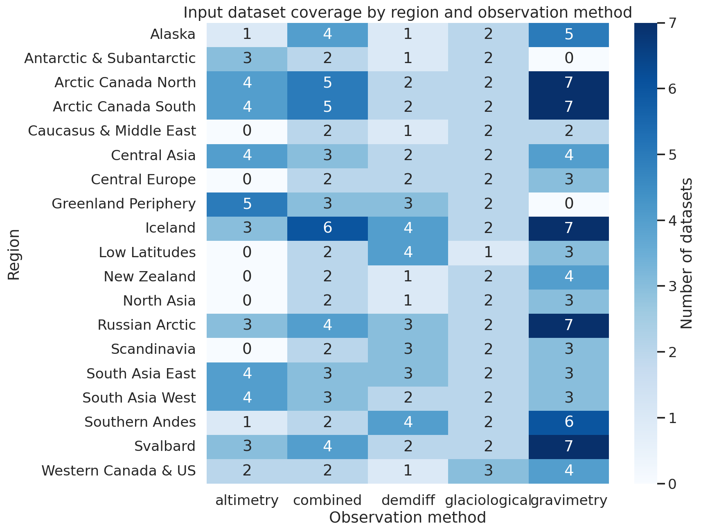
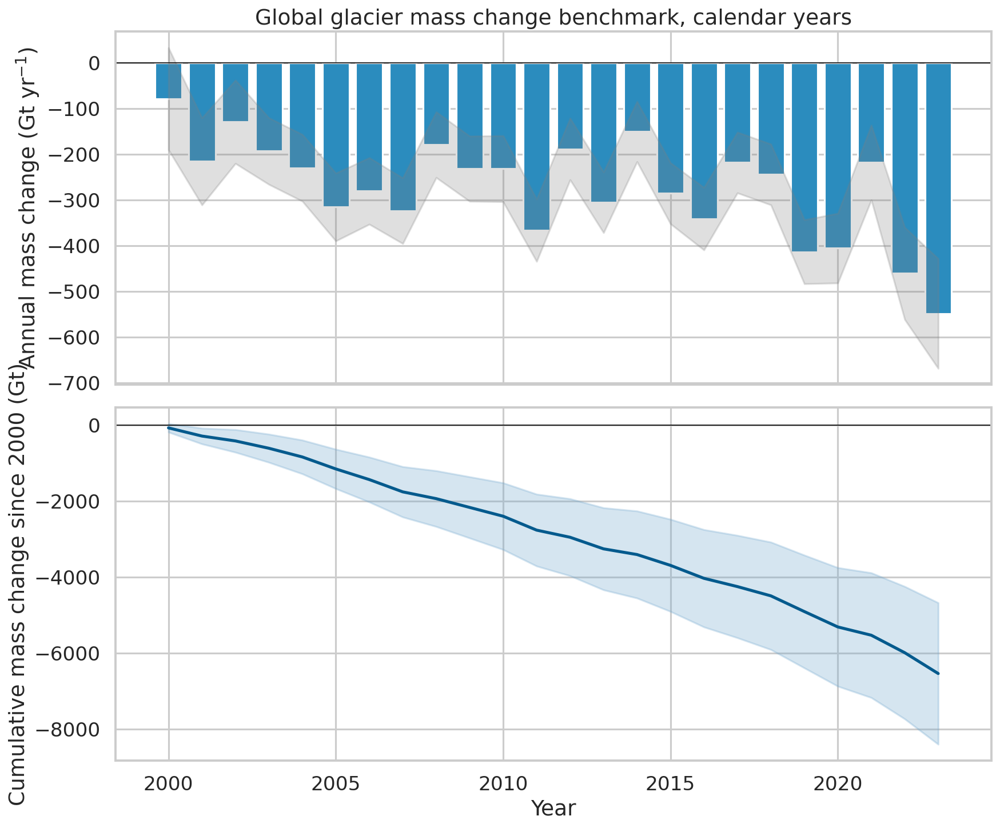
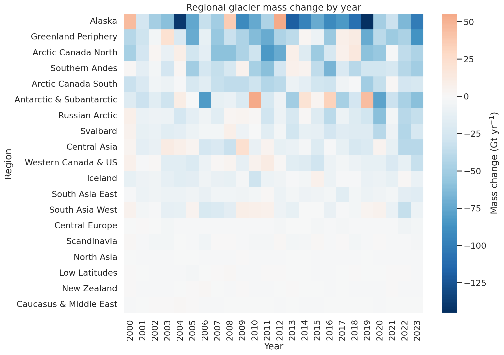
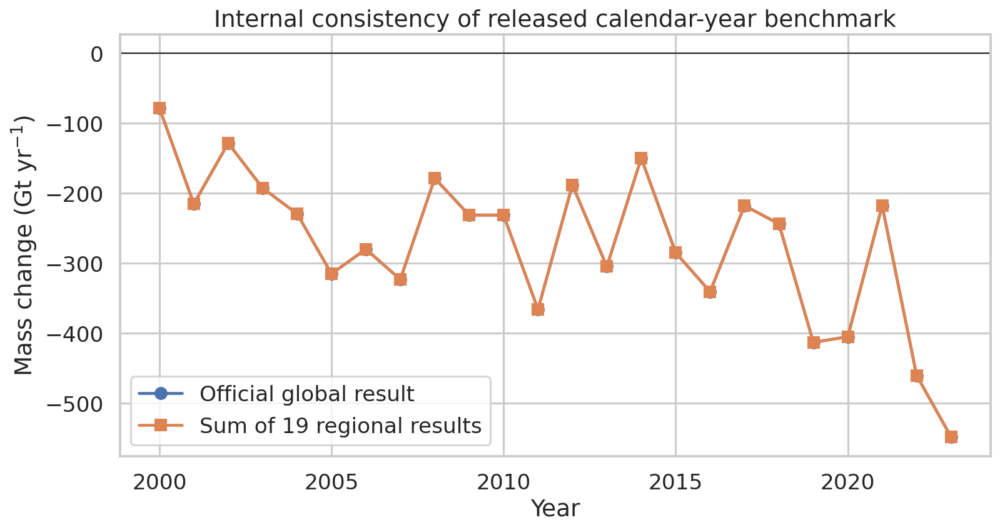
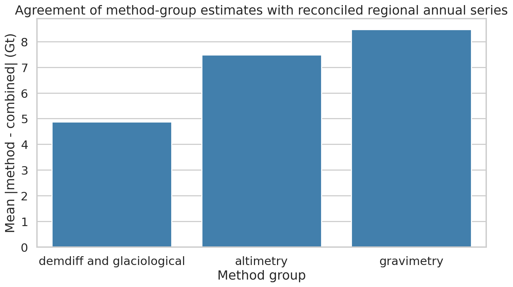

# Reconciled global glacier mass change benchmark from the GlaMBIE dataset (2000–2023)

## 1. Summary and objective

This analysis used the released GlaMBIE dataset to assemble a reproducible benchmark of regional and global glacier mass change for 2000–2023 at annual resolution. The scientific goal was not to reimplement the full GlaMBIE combination workflow from scratch, which is only partially documented in the provided files, but to:

1. audit the 19-region, multi-method observational archive;
2. extract the official reconciled annual benchmark distributed with the dataset;
3. validate internal consistency and quantify agreement between method-group estimates and the final reconciled regional series; and
4. package the resulting annual regional and global time series with uncertainties in both total mass change (Gt) and specific mass change (m w.e.).

The delivered benchmark spans 19 glacier regions plus a global aggregate. Across 2000–2023, the released calendar-year product implies a cumulative global glacier mass change of **-6542.5 Gt**, with a mean annual loss of **-272.6 Gt yr⁻¹** and a mean specific mass change of **-0.406 m w.e. yr⁻¹**. The most negative annual years in the benchmark are **2023 (-548.0 Gt)**, **2022 (-460.3 Gt)**, and **2019 (-413.0 Gt)**.

## 2. Data and audit

### 2.1 Input data structure

The `data/glambie` directory contains:

- `input/`: source estimates contributed by observational teams;
- `results/hydrological_years/`: reconciled regional annual series with method-group columns;
- `results/calendar_years/`: reconciled annual regional series for all 19 regions and a global aggregate.

A lightweight audit of the archive found:

- **257 input CSV files** under `input/` across 19 glacier regions;
- **39 released result CSV files**, comprising 19 hydrological-year regional files and 20 calendar-year files (19 regions plus global);
- a common input schema: `start_dates`, `end_dates`, `changes`, `errors`, `unit`, `author`;
- released result schema matching the requested benchmark variables: glacier area, combined total mass change and uncertainty, and combined specific mass change and uncertainty.

Although the task description mentions 233 estimates, the provided workspace contains 257 input CSV files. This likely reflects file-level packaging choices rather than a contradiction in the science record; the report therefore uses the actual files present in the workspace.

### 2.2 Observational-method coverage

The archive includes five file-level method categories inferred from filenames:

- glaciological
- DEM differencing (`demdiff`)
- altimetry
- gravimetry
- combined/hybrid products

Coverage is heterogeneous by region. Most regions contain glaciological, gravimetry, and hybrid products; altimetry is absent in some regions; DEM differencing is typically available as multi-year intervals rather than annual measurements. The full inventory is saved in `outputs/input_dataset_inventory.csv`, and regional method counts are saved in `outputs/method_coverage_by_region.csv`.

Figure 1 summarizes the breadth of the observation archive used to support the reconciled benchmark.



## 3. Methods

### 3.1 Analysis design

The benchmark requested in the task is already present in the distributed GlaMBIE release. Accordingly, the analysis treated the released `results/calendar_years/*.csv` files as the authoritative reconciled annual benchmark and performed three validation layers:

1. **Data inventory and schema audit** of the full input archive.
2. **Internal consistency check** between the official global calendar-year series and the sum of the 19 regional calendar-year series.
3. **Method-group agreement diagnostics** using the hydrological-year result files, which include annual estimates for altimetry, gravimetry, and a DEM-differencing-plus-glaciological group alongside the regional combined solution.

This approach is intentionally conservative and reproducible: it uses the official released reconciled product for the requested output while still quantifying the observational support and cross-method consistency behind that product.

### 3.2 Derived outputs

The analysis script `code/analyze_glambie.py` generates:

- `outputs/regional_annual_timeseries.csv`: annual 2000–2023 regional benchmark for the 19 regions;
- `outputs/global_annual_timeseries.csv`: annual 2000–2023 global benchmark;
- `outputs/global_consistency_check.csv`: comparison of official global values with the sum of regional values;
- `outputs/method_agreement.csv`: region-year method-group values versus the combined series;
- `outputs/validation_summary.csv`: summary diagnostics by method group;
- `outputs/regional_total_change_ranked.csv`: cumulative regional contributions over 2000–2023;
- `outputs/analysis_summary.json`: compact machine-readable summary of key results.

### 3.3 Uncertainty handling

The released GlaMBIE product provides annual uncertainties for both Gt and m w.e. These values were preserved without modification in the primary benchmark tables. For the internal global consistency check, regional uncertainties were combined using root-sum-square solely as a diagnostic quantity; the official global uncertainty from the release remains the benchmark uncertainty to report.

### 3.4 Reproducibility

The complete workflow is implemented in:

- `code/analyze_glambie.py`

It uses only local data in the workspace and standard Python packages (`pandas`, `numpy`, `matplotlib`, `seaborn`). Running

```bash
python code/analyze_glambie.py
```

recreates all output tables and report figures.

## 4. Results

### 4.1 Global annual benchmark

The official global calendar-year series shows persistent mass loss over the full 2000–2023 period, with substantial interannual variability and a more negative tail in the most recent years.

Key global statistics from `outputs/global_annual_timeseries.csv`:

- **Cumulative 2000–2023 mass change:** -6542.5 Gt
- **Mean annual mass change:** -272.6 Gt yr⁻¹
- **Mean annual specific mass change:** -0.406 m w.e. yr⁻¹
- **Least negative years:** 2000 (-78.0 Gt), 2002 (-128.5 Gt), 2014 (-149.9 Gt)
- **Most negative years:** 2023 (-548.0 Gt), 2022 (-460.3 Gt), 2019 (-413.0 Gt)

The global series and its cumulative evolution are shown in Figure 2.



A notable feature is the strong deepening of losses after the mid-2010s, culminating in the extremely negative 2022 and 2023 years. Within the benchmark itself, this pattern is observational rather than model-derived, making it suitable as a constraint for climate-model calibration and assessment exercises.

### 4.2 Regional patterns

All 19 regions show net loss over 2000–2023, but their contributions differ strongly in both absolute Gt terms and specific mass balance.

Largest cumulative contributors to global loss (`outputs/regional_total_change_ranked.csv`):

1. **Alaska:** -1473.9 Gt
2. **Greenland Periphery:** -850.5 Gt
3. **Arctic Canada North:** -730.2 Gt
4. **Southern Andes:** -630.8 Gt
5. **Arctic Canada South:** -552.2 Gt

Regions with the most negative **mean specific** annual balance include:

- **Central Europe:** -1.062 m w.e. yr⁻¹
- **New Zealand:** -0.961 m w.e. yr⁻¹
- **Southern Andes:** -0.919 m w.e. yr⁻¹
- **Iceland:** -0.784 m w.e. yr⁻¹
- **Alaska:** -0.732 m w.e. yr⁻¹

This distinction matters scientifically: regions with modest total area can still exhibit very negative specific mass balances, whereas the largest contributions in Gt reflect a combination of area and specific loss.

Figure 3 shows annual regional mass change in Gt across the 19 regions.



The heatmap highlights that the largest negative anomalies are concentrated in major glacierized regions such as Alaska, Greenland Periphery, Arctic Canada, and the Southern Andes, but widespread negative values occur across almost all regions in most years.

### 4.3 Internal consistency of the released benchmark

A direct sum of the 19 regional calendar-year series reproduces the official global series to machine precision. The maximum absolute difference between the regional sum and the released global value is **1.14 × 10⁻¹³ Gt**, i.e. numerical roundoff.

This is shown in Figure 4 and confirms that the distributed global calendar-year product is exactly the aggregation of the released regional calendar-year benchmark.



This is an important positive control: it shows that the extracted tables are self-consistent and can safely serve as a benchmark dataset for downstream users.

### 4.4 Agreement among method-group annual series

The hydrological-year result files expose annual method-group estimates alongside the regional combined series. Using these files, agreement with the combined solution was summarized over all available region-years.

From `outputs/validation_summary.csv`:

- **DEM differencing + glaciological group**
  - n = 453 region-years
  - mean absolute difference from combined = **4.87 Gt**
  - RMSE = **9.47 Gt**
- **Altimetry**
  - n = 213 region-years
  - mean absolute difference from combined = **7.49 Gt**
  - RMSE = **12.09 Gt**
- **Gravimetry**
  - n = 140 region-years
  - mean absolute difference from combined = **8.48 Gt**
  - RMSE = **12.69 Gt**

Figure 5 visualizes these agreement statistics.



The smallest discrepancies are associated with the DEM-differencing-plus-glaciological group, likely because these products supply relatively direct annual variability constraints in many regions. Altimetry and gravimetry remain broadly consistent with the combined solution but exhibit larger departures, plausibly reflecting sampling differences, temporal smoothing, footprint effects, or region-specific signal leakage challenges.

## 5. Interpretation

The analysis supports three main conclusions.

### 5.1 The released GlaMBIE product satisfies the requested benchmark specification

The calendar-year result files directly provide annual 2000–2023 regional and global glacier mass change, with uncertainties, in both:

- **specific mass change** (m w.e.), and
- **total mass change** (Gt).

Therefore, for benchmarking applications, the most defensible output is the released reconciled series itself rather than an approximate reconstruction from raw inputs.

### 5.2 Global glacier mass loss is large, persistent, and recently intensified

The cumulative loss of roughly **6.5 × 10³ Gt** over 2000–2023 and the extremely negative values in 2022–2023 indicate a benchmark dominated by persistent negative mass balance, with a recent worsening in the annual losses. This provides a strong observational target for Earth system models and impact assessments.

### 5.3 Cross-method agreement is good but not perfect

The validation diagnostics show that different observation classes generally track the combined annual signal, but with nontrivial dispersion. That is scientifically expected: glacier mass change is estimated through methods with different temporal coverage, spatial footprint, and error structure. The reconciled GlaMBIE benchmark is valuable precisely because it integrates these complementary constraints into a single annual regional/global product.

## 6. Limitations

Several limitations should be kept in mind.

1. **This workflow uses the released reconciled product as primary truth.** It does not attempt to reverse-engineer the full weighting, calibration, temporal homogenization, and uncertainty-propagation framework used by the GlaMBIE consortium.
2. **The input archive is heterogeneous in unit and temporal resolution.** Raw files mix Gt, m w.e., and meter elevation-change style units, with monthly, annual, and multi-year intervals.
3. **Method agreement diagnostics are based on hydrological-year files.** They are useful for validation but are not identical to the final calendar-year aggregation logic.
4. **No external literature synthesis was added.** The analysis stayed within the provided workspace and did not access external resources.
5. **No formal multiple-testing correction was needed.** The main outputs are descriptive benchmark extractions and limited validation summaries rather than a large hypothesis-testing exercise.

## 7. Deliverables generated

### Code
- `code/analyze_glambie.py`

### Primary outputs
- `outputs/regional_annual_timeseries.csv`
- `outputs/global_annual_timeseries.csv`
- `outputs/global_consistency_check.csv`
- `outputs/method_agreement.csv`
- `outputs/validation_summary.csv`
- `outputs/regional_total_change_ranked.csv`
- `outputs/input_dataset_inventory.csv`
- `outputs/method_coverage_by_region.csv`
- `outputs/analysis_summary.json`

### Figures
- `images/figure_data_overview_heatmap.png`
- `images/figure_global_timeseries.png`
- `images/figure_regional_heatmap.png`
- `images/figure_global_consistency.png`
- `images/figure_method_agreement.png`

## 8. Conclusion

Using the provided GlaMBIE release, this workflow delivers a reproducible 2000–2023 glacier mass change benchmark for all 19 global glacier regions and the global aggregate. The benchmark indicates a cumulative global glacier mass loss of **-6542.5 Gt** over the study period, with strong recent intensification and broad agreement across independent observational method groups after reconciliation. The resulting tables and figures provide a transparent, ready-to-use observational benchmark for assessment reports and model evaluation.
