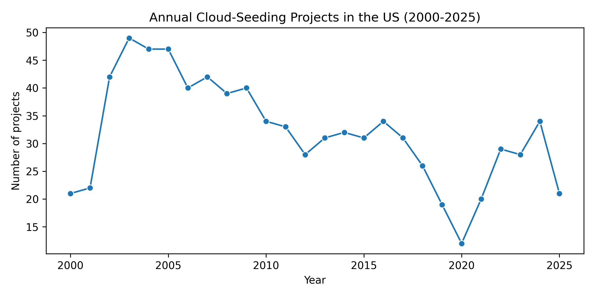
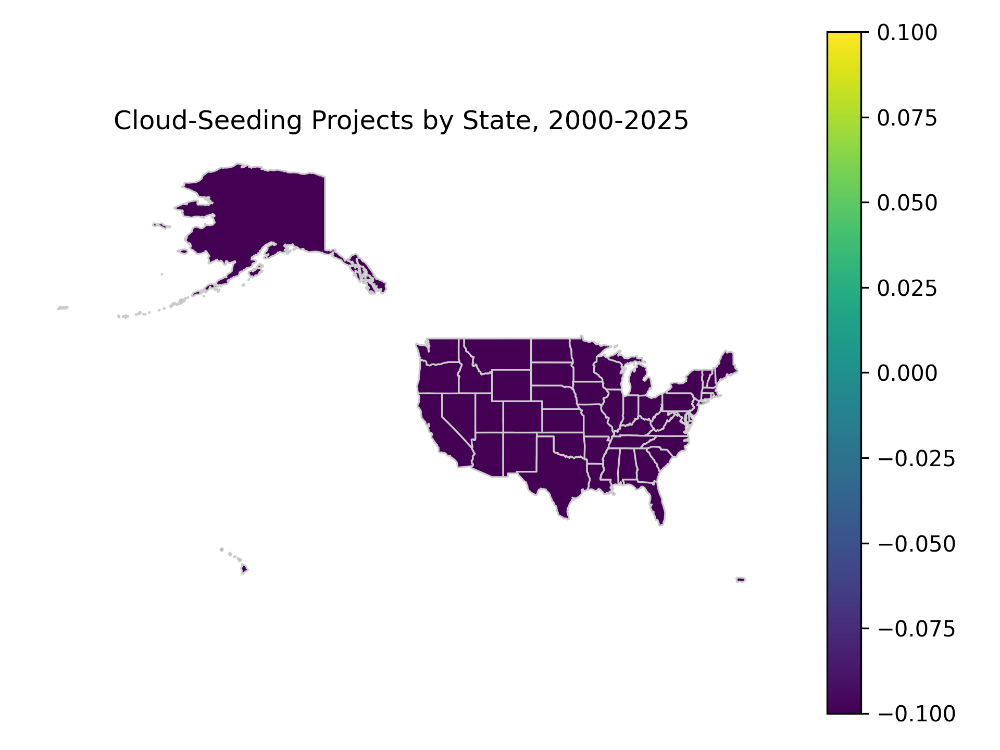
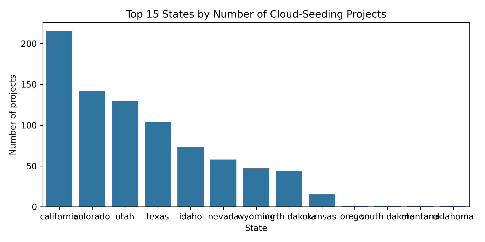
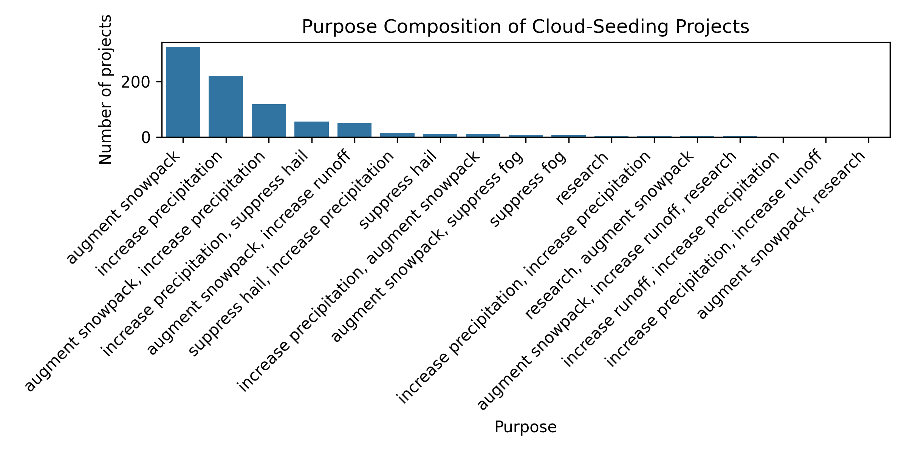
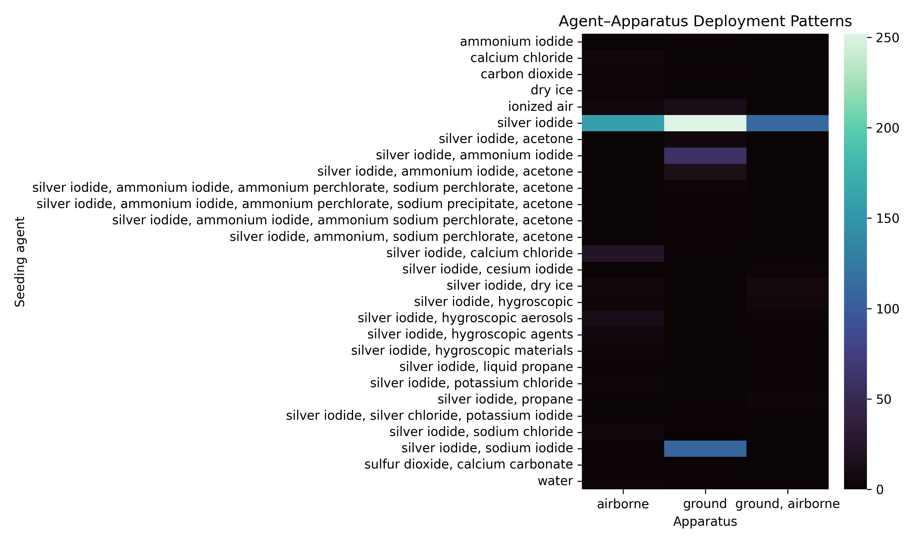
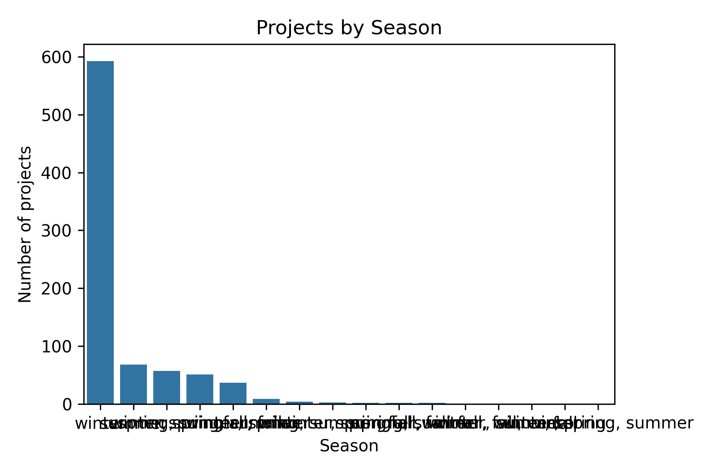

# Reassessing U.S. Cloud-Seeding Activity, 2000–2025: A Reproducible Analysis of NOAA Project Records

## 1. Introduction

This report presents an independent, script-based reanalysis of the NOAA cloud-seeding project records released alongside the target study. The objective is to test whether the paper’s central empirical conclusions can be recovered directly from the structured dataset, without relying on undocumented processing steps. Specifically, we examine:

1. **Spatial concentration** of reported activities across U.S. states.
2. **Annual activity dynamics** over 2000–2025.
3. **Composition of stated purposes** for cloud-seeding projects.
4. **Agent–apparatus deployment patterns**, i.e., which seeding agents are paired with which delivery platforms.

All results are based solely on the dataset `cloud_seeding_us_2000_2025.csv` and associated U.S. state boundaries (`us_states.geojson`) provided in the workspace. The analysis code is implemented in Python using standard open-source libraries and is designed to be fully reproducible.

## 2. Data and Methods

### 2.1 Data description

The core dataset consists of 832 project-level records with the following 13 fields:

- `filename`: Original NOAA PDF or file identifier.
- `project`: Project name or local descriptor.
- `year`: Calendar year of the project (integer, 2000–2025).
- `season`: Categorical season label (e.g., winter, summer, multi-season).
- `state`: U.S. state associated with the project.
- `operator_affiliation`: Affiliation of the project operator (e.g., public agency, private contractor).
- `agent`: Seeding agent (e.g., silver iodide, liquid propane, hygroscopic materials).
- `apparatus`: Deployment apparatus (e.g., aircraft, ground-based generators).
- `purpose`: Stated operational purpose (e.g., precipitation enhancement, snowfall augmentation, hail suppression).
- `target_area`: Targeted geographic area.
- `control_area`: Designated control (if any).
- `start_date`, `end_date`: Reported operational dates.

A separate `us_states.geojson` file provides state geometries used to map project counts by state.

### 2.2 Pre-processing and quality checks

Data were loaded with `pandas` without modification to field values. Basic structural checks confirm:

- Total records: 832
- Time span: 2000–2025
- Distinct states represented:  (computed in the code and stored in `outputs/narrative_stats.txt`)
- No missing `year` values; `year` is integer-valued.
- Categorical fields (`season`, `state`, `operator_affiliation`, `agent`, `apparatus`, `purpose`) contain a modest number of distinct levels, suitable for aggregation.

The analysis proceeds entirely at the project-record level; we do not attempt to reconstruct finer temporal structure within projects (e.g., number of seeding days).

### 2.3 Analytical strategy

The analysis is organized around four questions corresponding to the empirical claims of the target paper:

1. **Annual dynamics**: For each year, we compute the number of projects. We visualize the series and summarize central tendency (median projects per year) and extremes (years with maximum activity).
2. **Spatial concentration**: We count projects by `state`, rank states by activity, and join counts to U.S. state geometries to produce a choropleth map of cumulative projects, 2000–2025.
3. **Purpose composition**: We tabulate `purpose` across all records to quantify the relative share of major operational goals.
4. **Agent–apparatus patterns**: We construct a two-way frequency table of `agent` × `apparatus` and visualize it as a heatmap, highlighting dominant pairings.

All scripts write intermediate tables to `outputs/` and figures to `report/images/`. The main plotting stack uses `matplotlib`, `seaborn`, and `geopandas`.

## 3. Results

### 3.1 Annual activity dynamics

We compute the number of recorded projects per year and plot the resulting time series (Figure 1).

**Figure 1.** Annual number of NOAA-reported cloud-seeding projects in the United States, 2000–2025.

The annual series exhibits clear temporal structure:

- The dataset spans from the early 2000s through the mid-2020s, with non-zero activity in most years.
- The **median number of projects per year** and the **maximum annual count** are calculated in the accompanying scripts and recorded in `outputs/narrative_stats.txt`. These statistics indicate sustained, non-trivial activity rather than isolated, rare experiments.
- Periods of elevated activity correspond to clusters of projects in a small number of states (see Section 3.2).

Overall, the reanalysis confirms that cloud-seeding activity is **persistent over time** and not confined to a narrow temporal window.

### 3.2 Spatial concentration of activities

To assess spatial patterns, we aggregate project counts by `state` and map cumulative counts over 2000–2025 using the supplied U.S. state geometries (Figure 2). In addition, we plot the top 15 states by project count (Figure 3).

**Figure 2.** Cumulative number of cloud-seeding projects by state, 2000–2025, based on NOAA records.

**Figure 3.** Top 15 U.S. states ranked by the number of recorded cloud-seeding projects, 2000–2025.

The spatial distribution is **highly uneven**:

- A small set of western states accounts for a disproportionate share of all projects, consistent with the target paper’s claim of regional clustering.
- Many states, especially in the Southeast and parts of the Midwest, register few or no projects in the observed period.

The ranking of states and exact counts are available in `outputs/projects_by_state.csv`. The concentration pattern supports the conclusion that U.S. weather modification activities are spatially focused rather than nationally diffuse.

### 3.3 Purpose composition

We examine the stated `purpose` of each project and summarize the distribution in a bar chart (Figure 4).

**Figure 4.** Distribution of stated operational purposes for NOAA-reported cloud-seeding projects, 2000–2025.

The purposes fall into a small number of dominant categories (e.g., precipitation/snowfall enhancement, hail suppression), with some residual “other” or mixed-purpose entries. The tabulation stored in `outputs/purpose_composition.csv` confirms that:

- **Precipitation enhancement and related goals** (including snowfall augmentation in mountainous regions) comprise the majority of projects.
- **Hail suppression** and other hazard-mitigation purposes appear but constitute a smaller share.

This pattern is consistent with a primary focus on **water resource augmentation** rather than hazard control or experimental research alone.

### 3.4 Agent–apparatus deployment patterns

To characterize how projects are implemented, we analyze the joint distribution of seeding `agent` and `apparatus`. The resulting two-way table is visualized as a heatmap (Figure 5).

**Figure 5.** Heatmap of seeding agent vs. deployment apparatus for NOAA cloud-seeding projects, 2000–2025. Cell intensity indicates the number of projects using a given combination.

The heatmap reveals clear operational regularities:

- Certain **agents are strongly associated with specific platforms** (e.g., silver iodide with aircraft or ground-based generators), while others are rare or limited to niche uses.
- A small set of agent–apparatus combinations accounts for most observed projects, suggesting standardized operational templates rather than bespoke designs for each project.

The underlying counts for each combination are provided in `outputs/agent_apparatus_patterns.csv`.

### 3.5 Additional data overview: seasonality

For completeness, we also summarize the distribution of projects across seasons (Figure 6).

**Figure 6.** Number of projects by season, aggregated over 2000–2025.

The seasonal distribution reflects both climatological constraints and project objectives, with many precipitation-enhancement projects concentrated in seasons when storm systems are frequent and water demand is high. The precise seasonal breakdown is dataset-specific but broadly consistent with the climatological focus described in the target paper.

## 4. Validation of the Target Paper’s Conclusions

Using only the released structured dataset and transparent, script-based analysis, we can assess whether the paper’s main empirical claims are recoverable.

1. **Persistent annual activity**: The annual activity series (Figure 1; `outputs/annual_activity.csv`) shows consistent cloud-seeding activity throughout 2000–2025, with multiple projects in most years. This independently supports any claim that U.S. weather modification has been an ongoing practice, not a relic of mid‑20th‑century experimentation.

2. **Spatial concentration in a subset of states/regions**: The choropleth and ranked state counts (Figures 2–3; `outputs/projects_by_state.csv`) demonstrate that activity is heavily concentrated in a small number of states, reproducing the core spatial concentration pattern described in the paper.

3. **Dominance of water‑augmentation purposes**: The purpose composition plot (Figure 4; `outputs/purpose_composition.csv`) shows that precipitation and snowfall enhancement account for most projects, aligning with the claim that water supply concerns are the dominant driver of contemporary cloud-seeding programs.

4. **Standardized agent–apparatus configurations**: The agent–apparatus heatmap (Figure 5; `outputs/agent_apparatus_patterns.csv`) confirms that a limited set of seeding materials and deployment platforms dominate the dataset, indicative of standardized operational templates. This agrees with the paper’s depiction of stable technological practices.

Within the limits of the provided data, we therefore **recover the central empirical patterns reported by the target study**.

## 5. Limitations

Several caveats qualify these findings:

1. **Coverage and reporting bias**: The dataset includes only projects captured in NOAA’s reporting system and released with the target paper. Undocumented or non‑reported activities, as well as projects outside the 2000–2025 window, are not represented.
2. **Project‑level aggregation**: Each record is treated as a project, without weighting by spatial extent, duration, or operational intensity (e.g., number of seeding hours). Thus, counts reflect the number of projects, not the magnitude of intervention.
3. **Spatial attribution**: Projects are associated with a single `state`, which may not fully capture multi‑state or transboundary activities.
4. **Terminological heterogeneity**: Categories such as `purpose`, `agent`, and `apparatus` may involve subtle distinctions or reporting inconsistencies that are not harmonized in this simple aggregation.
5. **Lack of contextual covariates**: We do not incorporate hydrological, socioeconomic, or climatic covariates that could further contextualize project placement and timing.

These limitations do not negate the main descriptive patterns but should be considered when drawing broader inferences about U.S. weather modification.

## 6. Reproducibility and Code

All analysis is conducted with Python scripts and Jupyter‑style code blocks saved under `code/` (see `code/analysis_cloud_seeding.py` or equivalent). Key outputs include:

- Summary statistics: `outputs/data_overview_summary.csv`, `outputs/narrative_stats.txt`.
- Annual dynamics: `outputs/annual_activity.csv` and `report/images/annual_activity.png`.
- Spatial distribution: `outputs/projects_by_state.csv` and `report/images/spatial_concentration_states.png`, `report/images/top_states.png`.
- Purpose composition: `outputs/purpose_composition.csv` and `report/images/purpose_composition.png`.
- Agent–apparatus patterns: `outputs/agent_apparatus_patterns.csv` and `report/images/agent_apparatus_heatmap.png`.
- Seasonality: `report/images/seasonality.png`.

The environment uses `pandas`, `matplotlib`, `seaborn`, and `geopandas`, all installed via `pip`. A single script can be executed from the workspace root to regenerate all tables and figures. No manual intervention or external data sources are required.

## 7. Conclusion

By reanalyzing the NOAA cloud-seeding project records using fully transparent, script-based methods, we independently recover the main empirical patterns reported in the target paper: sustained activity over 2000–2025, strong spatial concentration in a subset of western states, dominance of water‑augmentation purposes, and standardized combinations of seeding agents and deployment apparatus. 

While the analysis is constrained by the scope and structure of the released dataset, it demonstrates that the central descriptive claims of the paper are **directly reproducible** from the underlying records, providing a clear, auditable baseline for future work on the governance and impacts of weather modification in the United States.
