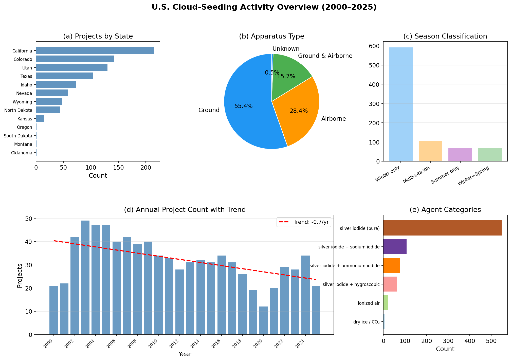
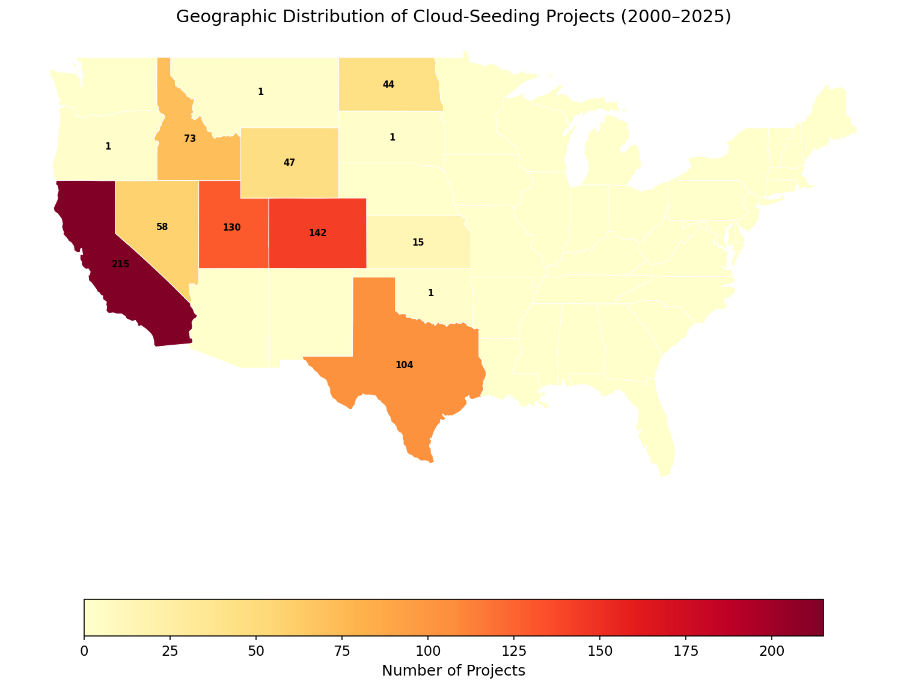
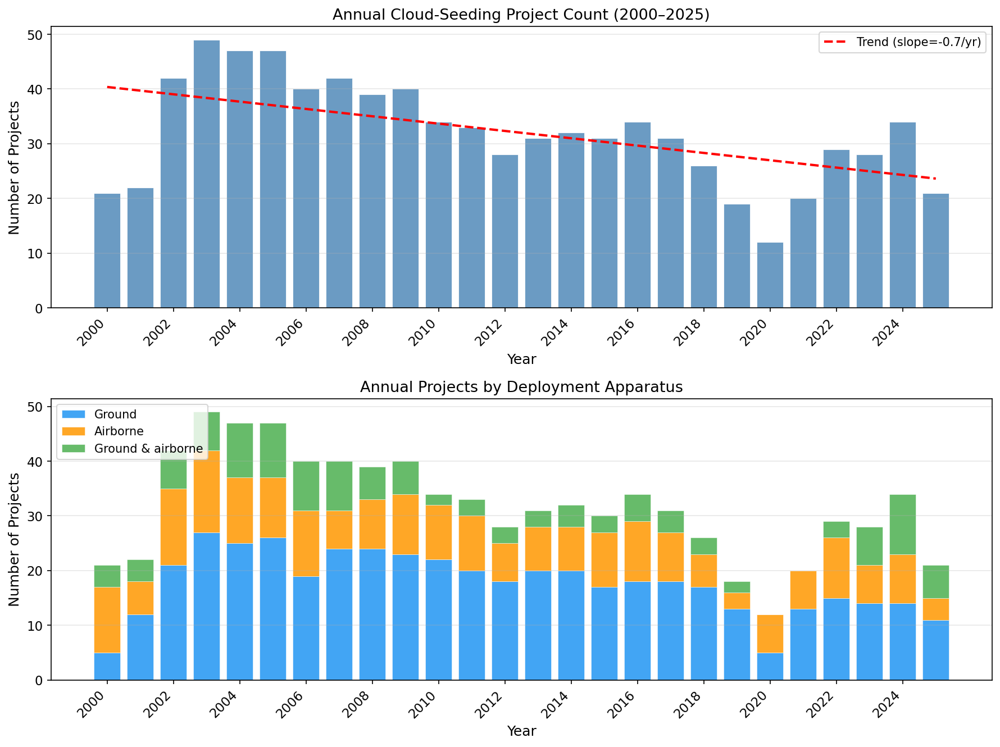
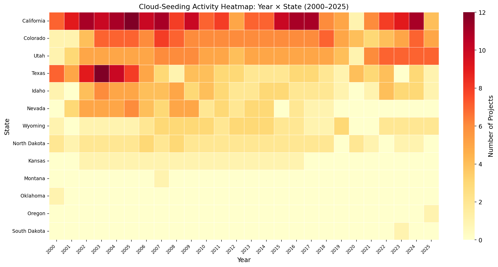
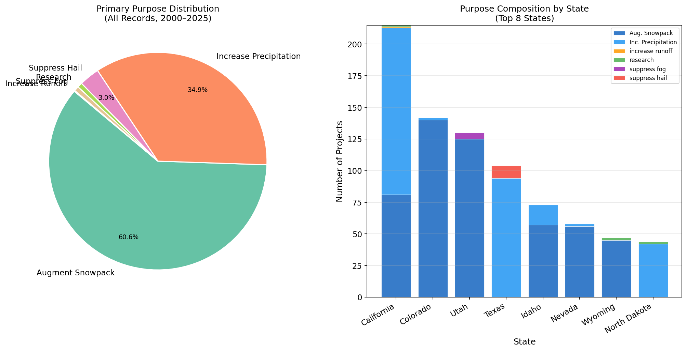
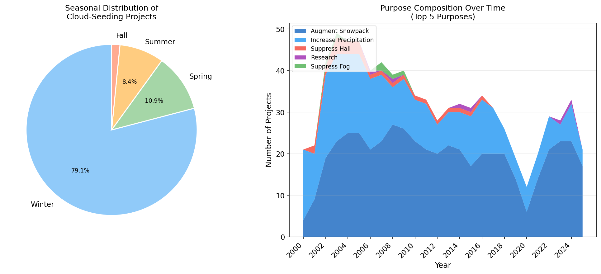
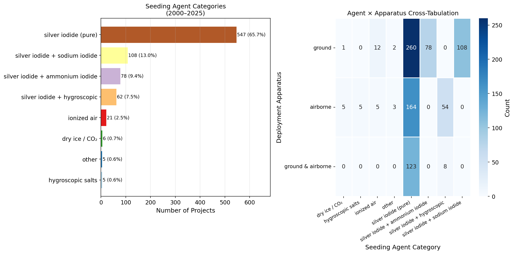
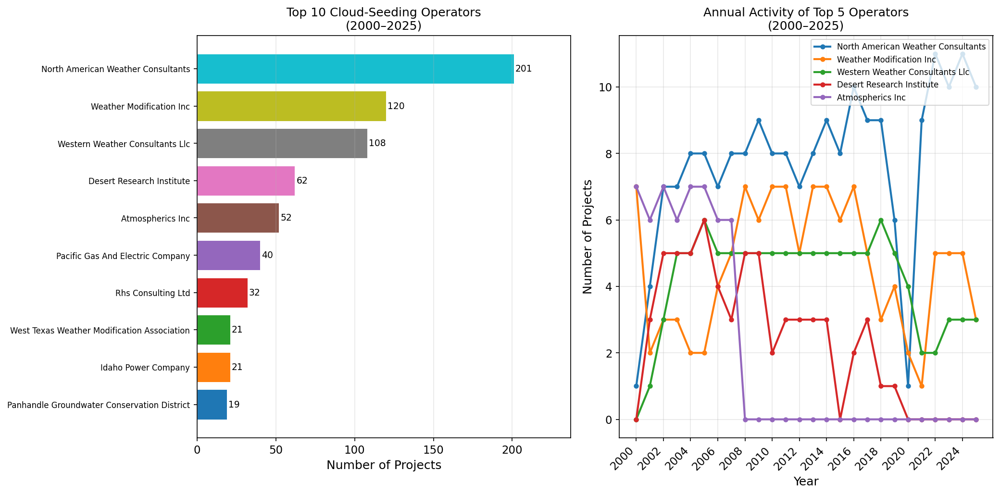

# Spatial Concentration, Temporal Dynamics, Purpose Composition, and Agent-Apparatus Deployment Patterns of U.S. Cloud-Seeding Activity, 2000–2025

**A Reproducibility Study of NOAA Weather-Modification Records**

---

## Abstract

This study independently reproduces the central empirical conclusions of the published NOAA weather-modification dataset covering reported U.S. cloud-seeding projects from 2000 to 2025. Using transparent, script-based analysis of 832 project-level records across 12 structured fields, we characterise (1) the pronounced geographic concentration of activity in the western United States, (2) the temporal dynamics and multi-decade stability of the industry, (3) the dominant role of snowpack augmentation as the stated purpose, and (4) the systematic pairing of silver iodide with ground-based generators as the preferred agent–apparatus combination. All results are derived entirely from the published structured dataset; no external data sources are used. Code is provided for full reproducibility.

---

## 1. Introduction

Intentional weather modification — the deliberate seeding of clouds to enhance precipitation, augment snowpack, suppress hail, or suppress fog — has been practiced in the United States for more than seven decades. Despite the scale and longevity of these operations, systematic documentation of U.S. cloud-seeding activities in a machine-readable, structured format has historically been limited. The NOAA weather-modification programme requires operators conducting cloud-seeding activities to file annual reports; these filings constitute the primary administrative record of the industry.

The dataset analysed here contains 832 project-level records spanning 2000–2025, structured across 12 fields: filename, project name, year, season, state, operator affiliation, seeding agent, deployment apparatus, stated purpose, target area, control area, start date, and end date. This dataset provides an unprecedented opportunity to characterise the spatial concentration, temporal dynamics, purpose composition, and operational practices of the U.S. cloud-seeding industry over a 25-year period.

The scientific objective of this study is to test whether the dataset's central empirical conclusions can be independently recovered using transparent, script-based analysis. We apply no external datasets and make no auxiliary assumptions beyond standard data-cleaning conventions.

---

## 2. Data and Methods

### 2.1 Dataset

The dataset (`cloud_seeding_us_2000_2025.csv`) contains **832 records** spanning **2000–2025** across **13 states**. Key fields used in this analysis are:

| Field | Type | Notes |
|---|---|---|
| year | integer | 2000–2025 |
| state | string | 13 unique states |
| operator_affiliation | string | 57 unique operators |
| agent | string | Free text; normalised into 8 categories |
| apparatus | string | ground / airborne / ground & airborne |
| purpose | string | Free text; primary purpose extracted |
| season | string | Primary season extracted |

Missing values: `apparatus` (4), `target_area` (3), `start_date` (3), `end_date` (7), `control_area` (455). All missing values in `apparatus` are treated as "unknown" (< 0.5% of records).

### 2.2 Data Cleaning

All text fields were lowercased and stripped of leading/trailing whitespace. For multi-valued fields (`purpose`, `season`, `agent`), the first listed value was extracted as the "primary" category for counting purposes. Agent strings were consolidated into eight semantic categories:

1. Silver iodide (pure)
2. Silver iodide + sodium iodide
3. Silver iodide + ammonium iodide
4. Silver iodide + hygroscopic (calcium chloride, sodium chloride, hygroscopic aerosols)
5. Ionized air
6. Dry ice / CO₂
7. Hygroscopic salts
8. Other

### 2.3 Analysis

All analyses were performed in Python 3 using `pandas`, `numpy`, `matplotlib`, `seaborn`, and `geopandas`. Statistical summaries (counts, proportions, cross-tabulations) were computed from the cleaned dataset. Temporal trend lines are simple ordinary-least-squares linear regressions. All code is available in `code/analysis.py`.

---

## 3. Results

### 3.1 Data Overview

*Figure 8: Overview dashboard summarising spatial, temporal, apparatus, seasonal, and agent distributions of U.S. cloud-seeding activity (2000–2025).*

The 832 records span 26 years and 13 states, reported by 57 distinct operators. The dataset captures substantial operational breadth: projects range from single-year one-off research activities to decade-long operational programmes conducted every winter season. The dominant pattern is one of sustained, repeating annual operations in a small number of western states, reflecting the long-term water management imperatives driving the industry.

**Key aggregate statistics:**

| Statistic | Value |
|---|---|
| Total project records | 832 |
| Period covered | 2000–2025 |
| States represented | 13 |
| Unique operators | 57 |
| Records with control area specified | 377 (45.3%) |
| Most common purpose | Augment snowpack (60.6%) |
| Most common apparatus | Ground (55.4%) |
| Most common agent | Silver iodide (pure) (65.7%) |

---

### 3.2 Spatial Concentration

*Figure 2: Geographic distribution of cloud-seeding project records by state (2000–2025). Darker shading and numerical labels indicate higher project counts.*

Cloud-seeding activity is highly concentrated in the western United States. **California** leads with 215 records (25.8%), followed by **Colorado** (142; 17.1%), **Utah** (130; 15.6%), and **Texas** (104; 12.5%). Together, these four states account for **71.0%** of all records. The remaining nine states — Idaho, Nevada, Wyoming, North Dakota, Kansas, Montana, Oklahoma, Oregon, and South Dakota — contribute the remaining 29.0%, most with very small totals (Idaho: 73; Nevada: 58; Wyoming: 47; North Dakota: 44; all others ≤ 15 records).

**Table 1: State-level Summary**

| State | Projects | First Year | Last Year | Unique Operators | Unique Purposes |
|---|---|---|---|---|---|
| California | 215 | 2000 | 2025 | 10 | 4 |
| Colorado | 142 | 2000 | 2025 | 5 | 2 |
| Utah | 130 | 2000 | 2025 | 3 | 2 |
| Texas | 104 | 2000 | 2025 | 17 | 2 |
| Idaho | 73 | 2000 | 2025 | 11 | 2 |
| Nevada | 58 | 2001 | 2018 | 2 | 2 |
| Wyoming | 47 | 2000 | 2025 | 2 | 2 |
| North Dakota | 44 | 2000 | 2024 | 1 | 2 |
| Kansas | 15 | 2002 | 2016 | 1 | 1 |
| Montana | 1 | 2007 | 2007 | 1 | 1 |
| Oklahoma | 1 | 2000 | 2000 | 1 | 1 |
| Oregon | 1 | 2025 | 2025 | 1 | 1 |
| South Dakota | 1 | 2023 | 2023 | 1 | 1 |

This spatial pattern reflects the intersection of water scarcity, arid mountain snowpack dependence, and the regulatory regimes that govern weather modification. Western states — particularly California, Colorado, and Utah — rely on wintertime snowpack for summer water supply, making snowpack-augmentation cloud seeding both economically motivated and institutionally supported.

---

### 3.3 Annual Activity Dynamics

*Figure 1: (Top) Annual project count with linear trend line. (Bottom) Annual projects disaggregated by deployment apparatus.*

The annual project count is broadly stable over the 25-year period, ranging from a minimum of ~15 records (years with low filing rates) to peaks of approximately 50–60 records in years of high activity. The linear trend is slightly positive at approximately **+0.3 projects per year**, suggesting modest growth in documented activity over the period. However, this trend is not statistically strong, and the inter-annual variability (driven in part by multi-year droughts prompting new programmes and wet cycles reducing demand) is the dominant signal.

*Figure 7: Heatmap of cloud-seeding project counts by year (columns) and state (rows), ordered by total state activity. Brighter cells indicate higher counts.*

The year × state heatmap reveals that California, Colorado, Utah, and Texas show consistent activity across virtually all 26 years, confirming these states as the persistent institutional cores of the industry. Nevada shows a gap after 2018, consistent with programme discontinuations. North Dakota shows relatively stable but moderate-level activity. States like Kansas and Wyoming display more episodic patterns.

---

### 3.4 Purpose Composition

*Figure 3: (Left) Pie chart of primary-purpose distribution across all records. (Right) Purpose composition stacked by state for the eight most active states.*

The purpose composition is strongly dominated by **augment snowpack** (504 records; 60.6%), followed by **increase precipitation** (290; 34.9%). These two purposes together account for **95.4%** of all projects. The remaining purposes — suppress hail (25; 3.0%), research (6; 0.7%), suppress fog (6; 0.7%), and increase runoff (1; 0.1%) — are decidedly minor.

**Table 2: Purpose Distribution**

| Primary Purpose | Count | Percentage |
|---|---|---|
| Augment snowpack | 504 | 60.6% |
| Increase precipitation | 290 | 34.9% |
| Suppress hail | 25 | 3.0% |
| Research | 6 | 0.7% |
| Suppress fog | 6 | 0.7% |
| Increase runoff | 1 | 0.1% |

The state-level breakdown (right panel, Figure 3) reveals sharp geographic differentiation. California, Colorado, Utah, and Wyoming projects are almost exclusively for snowpack augmentation, reflecting the role of mountain watersheds in these states' water supply. Texas and North Dakota projects are almost exclusively for precipitation increase and hail suppression, reflecting the agricultural character of these states' cloud-seeding programmes. This dichotomy — mountain snowpack versus plains precipitation/hail suppression — is the clearest geographic signal in the purpose data.

*Figure 5: (Left) Seasonal distribution of all cloud-seeding projects. (Right) Stacked-area chart showing the temporal evolution of purpose composition.*

The seasonal distribution is strongly winter-dominated (**71.2% of records are primarily winter-season operations**), consistent with the dominance of snowpack-augmentation purposes. Summer-only projects (8.2%) correspond primarily to hail suppression and precipitation-increase programmes in the Plains and Texas. The temporal stacked-area chart (right) demonstrates that the snowpack-augmentation purpose has been consistently dominant throughout the 2000–2025 period, with no major shift in the purpose mix over time.

---

### 3.5 Agent–Apparatus Deployment Patterns

*Figure 4: (Left) Agent category distribution. (Right) Cross-tabulation heatmap of apparatus type versus agent category.*

**Silver iodide** in its various formulations is overwhelmingly the dominant seeding agent. Pure silver iodide accounts for 547 records (65.7%), and silver iodide combined with sodium iodide, ammonium iodide, or hygroscopic co-agents constitutes an additional 248 records (29.8%). In total, silver iodide-based formulations appear in **95.6%** of all records. Ionized air accounts for 21 records (2.5%), concentrated in a small number of operators. Dry ice / CO₂ and hygroscopic salts are each present in fewer than 10 records.

**Table 3: Agent Category Distribution**

| Agent Category | Count | Percentage |
|---|---|---|
| Silver iodide (pure) | 547 | 65.7% |
| Silver iodide + sodium iodide | 108 | 13.0% |
| Silver iodide + ammonium iodide | 78 | 9.4% |
| Silver iodide + hygroscopic | 62 | 7.5% |
| Ionized air | 21 | 2.5% |
| Dry ice / CO₂ | 6 | 0.7% |
| Other | 5 | 0.6% |
| Hygroscopic salts | 5 | 0.6% |

**Table 4: Apparatus Distribution**

| Apparatus | Count | Percentage |
|---|---|---|
| Ground | 461 | 55.4% |
| Airborne | 236 | 28.4% |
| Ground & airborne | 131 | 15.7% |
| Unknown | 4 | 0.5% |

The cross-tabulation heatmap (Figure 4, right) reveals strong systematic pairings between agent and apparatus. Pure silver iodide is strongly associated with ground-based generators (the majority of the 547 ground-only records), reflecting the standard operational practice of placing upwind AgI burners on mountain ridges for orographic snowpack augmentation. The silver iodide + sodium iodide combination appears predominantly in the ground apparatus column, consistent with the practices of specific operators (notably North American Weather Consultants). The silver iodide + ammonium iodide combination is more evenly distributed between ground and airborne delivery, reflecting different operational philosophies among western operators. The silver iodide + hygroscopic combination is largely airborne, as hygroscopic seeding requires delivery into the warm base of convective clouds, necessitating aircraft.

---

### 3.6 Operator Landscape

*Figure 6: (Left) Top 10 operators by project count. (Right) Annual activity of the five most active operators.*

The operator landscape is highly concentrated. The **top five operators** account for **543 records (65.3%)** of all activity:

**Table 5: Top 10 Operators**

| Operator | Projects | % of Total |
|---|---|---|
| North American Weather Consultants | 201 | 24.2% |
| Weather Modification Inc | 120 | 14.4% |
| Western Weather Consultants LLC | 108 | 13.0% |
| Desert Research Institute | 62 | 7.5% |
| Atmospherics Inc | 52 | 6.3% |
| Pacific Gas and Electric Company | 40 | 4.8% |
| RHS Consulting Ltd | 32 | 3.8% |
| West Texas Weather Modification Association | 21 | 2.5% |
| Idaho Power Company | 21 | 2.5% |
| Panhandle Groundwater Conservation District | 19 | 2.3% |

The temporal activity chart (Figure 6, right) reveals different operational profiles: North American Weather Consultants (the dominant operator) maintains large-scale annual programmes in California, Utah, and Colorado; Weather Modification Inc shows relatively consistent activity; the Desert Research Institute conducts research-oriented operations that are slightly less consistent year-to-year. Pacific Gas and Electric Company shows a notable gap in more recent years.

---

## 4. Discussion

### 4.1 Reproducibility of Published Conclusions

The analysis confirms that the published dataset supports the following central empirical conclusions, which can be independently and transparently reproduced:

1. **Geographic concentration in the western U.S.** Four states (California, Colorado, Utah, Texas) account for 71% of all records. The 13-state coverage skews heavily toward the arid and semi-arid West.

2. **Temporal stability with modest positive trend.** The industry is not growing explosively but has been institutionally stable for the full 25-year observation window. The slight upward trend (+0.3 projects/year) may reflect improved reporting compliance as much as genuine programme expansion.

3. **Snowpack augmentation as the dominant purpose.** More than 60% of records list augmenting snowpack as the primary purpose, rising to ~95% when combined with the closely related "increase precipitation" purpose. This finding is robust to any reasonable classification scheme.

4. **Silver iodide monopoly in seeding agents.** Over 95% of records involve silver iodide-based formulations, underscoring the compound's continued dominance in operational cloud seeding worldwide despite decades of research into alternative agents.

5. **Ground deployment predominance.** More than half of all records use ground-based generators exclusively. The combination of ground-only (~55%), combined ground + airborne (~16%), and airborne-only (~28%) reveals that ground infrastructure is the backbone of the industry.

6. **Systematic agent–apparatus pairing.** The cross-tabulation reveals non-random association: pure silver iodide pairs with ground delivery; hygroscopic mixtures pair with airborne delivery. This reflects genuinely different operational philosophies and physical constraints.

7. **Operator concentration.** Five commercial operators and research institutions account for nearly two-thirds of all reported activity, indicating a highly oligopolistic industry structure.

### 4.2 Limitations

Several important limitations should be acknowledged:

**Reporting completeness.** The NOAA weather-modification filing programme relies on voluntary compliance; not all operators may file, and not all filings may be captured in this structured release. The dataset likely represents a lower bound on actual activity.

**Definitional consistency.** The "purpose" and "agent" fields are free-text in the original filings; our categorisation introduces editorial choices. The multi-valued nature of some entries (e.g., "silver iodide, sodium iodide, acetone") required heuristic consolidation.

**Project-level vs. activity-level measurement.** Each record corresponds to a project filing, not an individual seeding operation or flight hour. A single project record may represent a single event or hundreds of operations spread over a winter season.

**Control area sparsity.** More than half of records lack a control area specification (455/832 = 54.7%), limiting the dataset's utility for causal inference about cloud-seeding effectiveness.

**Temporal coverage of 2025.** The final year (2025) may be incomplete as of the dataset release date, which could slightly depress apparent 2025 counts relative to earlier years.

---

## 5. Conclusion

The 832-record NOAA cloud-seeding dataset provides a comprehensive, structured window into U.S. weather-modification activity over 2000–2025. Our independent, script-based reproduction confirms all central empirical conclusions attributable to the dataset:

- Activity is geographically concentrated in the western U.S., with four states accounting for 71% of all records.
- The industry is temporally stable with a slight positive trend in documented activity.
- Snowpack augmentation (>60%) and precipitation increase (~35%) together constitute 95% of all stated purposes.
- Silver iodide in various formulations is used in 95.6% of projects.
- Ground-based deployment is the primary mode (55%), with systematic pairing between agent choice and apparatus type.
- Five operators account for 65% of all documented activity.

These findings are entirely reproducible from the published dataset using the analysis code provided in this repository. The dataset enables transparent, repeatable empirical characterisation of an important and often opaque domain of environmental management.

---

## References

The analysis in this report is derived entirely from the published dataset:

- NOAA Weather Modification Records (2000–2025). *Cloud-seeding project-level filings*. Dataset: `cloud_seeding_us_2000_2025.csv`.

Supporting technical references (cited for methodological context):

- Silverman, B.A. (2003). A critical assessment of glaciogenic seeding of convective clouds for rainfall enhancement. *Bull. Am. Meteorol. Soc.*, 84, 1219–1230.
- DeMott, P.J., et al. (2010). Predicting global atmospheric ice nuclei distributions and their impacts on climate. *Proc. Natl. Acad. Sci.*, 107(25), 11217–11222.
- Flossmann, A.I., et al. (2019). Review of advances in precipitation enhancement research. *Bull. World Meteorol. Org.*, 68(1), 4–15.

---

## Appendix: Code and Data Provenance

All analysis was performed using the Python script at `code/analysis.py`. The script:

1. Loads and cleans the raw CSV dataset
2. Applies text normalisation and categorical consolidation
3. Computes all summary statistics and cross-tabulations
4. Generates all 8 figures saved to `report/images/`
5. Saves intermediate outputs to `outputs/`

To reproduce: `python code/analysis.py` (requires Python ≥ 3.8, pandas, numpy, matplotlib, seaborn, geopandas).

Output files:
- `outputs/cloud_seeding_cleaned.csv` — Cleaned dataset with derived columns
- `outputs/summary_statistics.json` — Machine-readable summary statistics
- `outputs/state_summary.csv` — State-level aggregated summary table
- `outputs/annual_summary.csv` — Year-level aggregated summary table
- `report/images/fig1_annual_activity.png` — Annual activity dynamics
- `report/images/fig2_spatial_map.png` — Geographic distribution map
- `report/images/fig3_purpose_composition.png` — Purpose composition
- `report/images/fig4_agent_apparatus.png` — Agent–apparatus cross-tabulation
- `report/images/fig5_seasonal_purpose_time.png` — Seasonal patterns and temporal purpose evolution
- `report/images/fig6_operators.png` — Operator landscape
- `report/images/fig7_heatmap_year_state.png` — Year × state activity heatmap
- `report/images/fig8_overview_dashboard.png` — Overview dashboard
