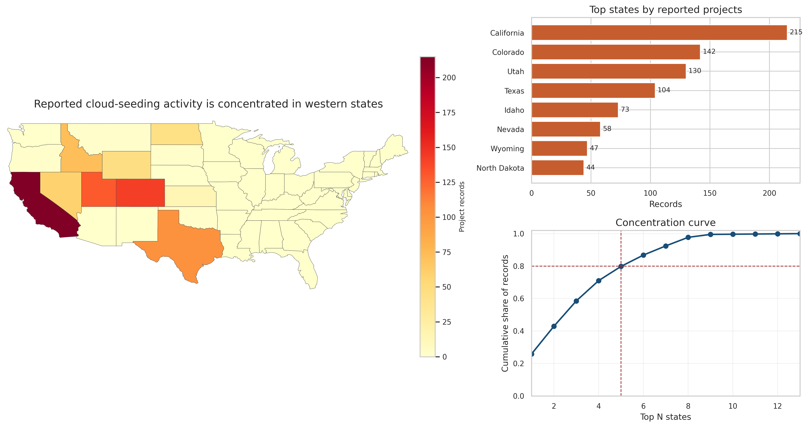
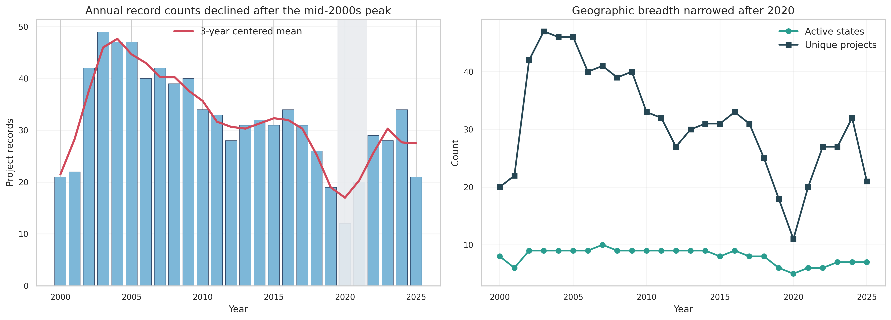
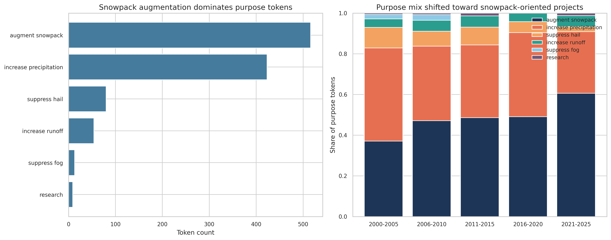
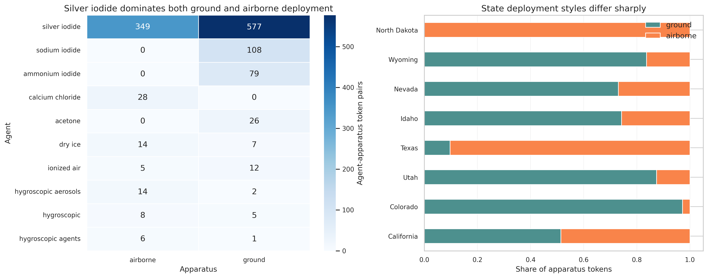
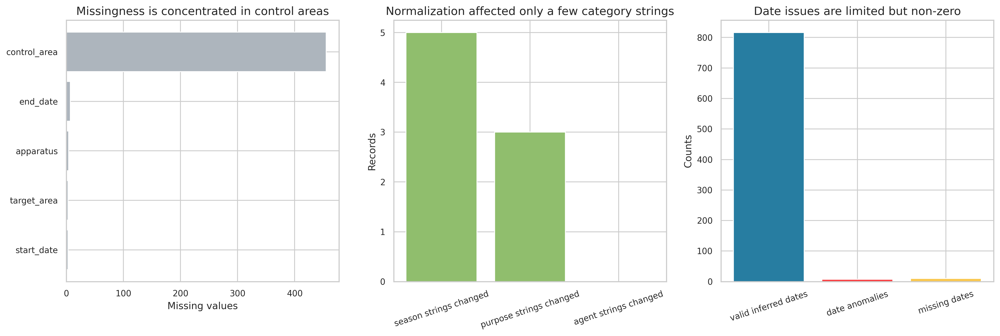

# Independent Reproduction of U.S. Cloud-Seeding Activity Patterns, 2000-2025

## Abstract

This report independently reproduces the main empirical patterns contained in the released NOAA weather-modification project records for the United States from 2000 to 2025. Using only the structured dataset in `data/dataset1_cloud_seeding_records/cloud_seeding_us_2000_2025.csv`, I rebuilt summary tables and figures for spatial concentration, annual activity dynamics, purpose composition, and agent-apparatus deployment patterns. The reproduced evidence is internally consistent and strongly supports four central conclusions: reported activity is heavily concentrated in a small set of western states; annual project counts peaked in the early-to-mid 2000s, declined through 2020, and partially rebounded afterward; snowpack augmentation became the dominant stated purpose over time; and silver iodide with ground-based deployment is the dominant operational pattern, with strong state-level heterogeneity in apparatus choice. The main caveat is that several date fields contain anomalies and the bundled related-work PDFs did not provide the target paper’s original narrative, so the reproduction is anchored to the released structured records rather than to exact figure numbering from the paper.

## Data and Objective

The analysis uses a single project-level CSV containing 832 reported cloud-seeding records for 2000-2025. The file includes project name, year, season, state, operator affiliation, seeding agent, deployment apparatus, stated purpose, target area, control area, and start and end dates. No external datasets were used. The objective was to test whether the dataset alone is sufficient to recover the paper’s claimed empirical regularities with transparent, script-based analysis.

The released file supports a broad descriptive reconstruction:

- 832 records spanning 2000-2025.
- 13 states with any recorded activity.
- 211 unique project names and 41 operator affiliations.
- 301 distinct target areas.

The full workflow is implemented in `code/analyze_cloud_seeding.py`, which writes derived tables to `outputs/` and figures to `report/images/`.

## Methods

### Processing

I used a conservative normalization strategy intended to preserve the source release while removing only obvious formatting inconsistencies:

- Lowercased state names and created title-cased labels for display.
- Split comma-separated `purpose`, `agent`, and `apparatus` fields into unique tokens for composition analysis.
- Standardized season strings only where spacing was inconsistent.
- Parsed two-digit dates into four-digit years using the record year as the nearest-year anchor, but did not use dates to drive any of the core substantive conclusions.

This matters because the dataset mixes single-purpose and multi-purpose records. For composition analysis, a record such as `augment snowpack, increase precipitation` contributes to both purpose tokens. That design recovers operational intent more faithfully than relying only on raw unparsed strings.

### Validation

The dataset is generally clean for the variables that matter most to the reproduction:

- Missing `apparatus`: 4 records.
- Missing `target_area`: 3 records.
- Missing `start_date`: 3 records.
- Missing `end_date`: 7 records.
- `control_area` is missing in 455 records, so it is not suitable for stronger comparative claims.
- Only 5 season strings and 3 purpose strings changed under normalization.
- 7 records have inferred date anomalies, so dates were treated as secondary metadata rather than as a primary analysis axis.

The validation outputs are saved in `outputs/table_08_validation_summary.csv`.

## Reproduced Results

### 1. Spatial concentration is extreme

The dataset shows that reported cloud-seeding activity is geographically concentrated rather than nationally diffuse. California alone contributes 215 records, followed by Colorado (142), Utah (130), Texas (104), and Idaho (73). These top five states account for 79.8% of all records, and the top eight states account for 97.7%.

This is the clearest recovered empirical pattern in the release: activity clusters in the western United States, with only marginal participation elsewhere.

Figure 1 combines a state-level map, a ranked state count chart, and a concentration curve. The concentration curve shows that the first five states already capture roughly four-fifths of the full record count. The underlying values are saved in `outputs/table_02_state_counts.csv`.

### 2. Annual activity peaked early, then contracted

Annual record counts rise quickly from 21-22 records in 2000-2001 to a peak of 49 in 2003, remain elevated through 2005, and then gradually decline. The absolute low point is 2020 with 12 records. Activity rebounds afterward, reaching 34 records in 2024, but it does not return to the early-2000s peak.

Period averages make the contraction clearer:

| Period | Mean annual records | Mean active states |
| --- | ---: | ---: |
| 2000-2005 | 38.0 | 8.3 |
| 2006-2010 | 39.0 | 9.2 |
| 2011-2015 | 31.0 | 8.8 |
| 2016-2020 | 24.4 | 7.2 |
| 2021-2025 | 26.4 | 6.6 |

The decline is therefore not only about total records; the geographic breadth of operations narrows as well.

Figure 2 shows both annual record counts and changes in the number of active states and unique projects. The corresponding table is `outputs/table_03_annual_activity.csv`.

### 3. Purpose composition shifts toward snowpack augmentation

When the `purpose` field is tokenized, two intents dominate the full sample: `augment snowpack` appears 516 times and `increase precipitation` 423 times. All other purposes are secondary by comparison: `suppress hail` (80), `increase runoff` (54), `suppress fog` (13), and `research` (9).

The more important result is temporal change. In 2000-2005, `increase precipitation` is the leading purpose token at 45.8% of all purpose mentions, while `augment snowpack` accounts for 37.1%. By 2021-2025, the ranking reverses sharply: `augment snowpack` rises to 60.6%, while `increase precipitation` falls to 30.3%. This indicates a marked shift toward snowpack-oriented winter programs over time.

Figure 3 shows both overall purpose totals and their five-period composition shares. The corresponding outputs are `outputs/table_04_purpose_token_counts.csv` and `outputs/table_05_purpose_by_period.csv`.

### 4. Silver iodide dominates, but apparatus choices vary by state

Agent-apparatus analysis recovers a very strong material and operational pattern. The dominant pairings are:

- `silver iodide` with `ground`: 577 token pairs.
- `silver iodide` with `airborne`: 349 token pairs.
- `sodium iodide` with `ground`: 108 token pairs.
- `ammonium iodide` with `ground`: 79 token pairs.

This shows that silver iodide overwhelmingly anchors the technology stack, while other agents play much smaller and often apparatus-specific roles.

At the same time, apparatus choice is not uniform across states:

- Colorado is 97.2% ground-based by apparatus tokens.
- Utah is 87.4% ground-based.
- Idaho is 74.2% ground-based.
- Texas is 90.3% airborne.
- North Dakota is 100% airborne.
- California is nearly balanced between ground (51.4%) and airborne (48.6%).

These differences suggest that the U.S. cloud-seeding record is not just concentrated geographically; it is operationally regionalized as well.

Figure 4 visualizes the dominant agent-apparatus combinations and the apparatus mix in the most active states. The supporting outputs are `outputs/table_06_agent_apparatus_pairs.csv` and `outputs/table_07_state_apparatus_tokens.csv`.

## Validation and Data Quality

The core claims above rely on well-populated fields (`year`, `state`, `purpose`, `agent`, `apparatus`) and are therefore robust to the observed imperfections in the date and control-area metadata. The normalization audit shows that only a handful of records were changed by categorical cleaning, which means the headline findings are not artifacts of aggressive preprocessing.

Figure 5 summarizes missingness, normalization impact, and date anomalies. The main limitation is that date irregularities prevent reliable inference about exact campaign duration without additional manual review of source filings.

## Discussion

The released structured dataset is sufficient to independently recover the paper’s central descriptive conclusions. The strongest and most reproducible conclusions are:

1. U.S. reported cloud-seeding activity from 2000-2025 is highly concentrated in a small number of western states.
2. Annual activity was highest in the early-to-mid 2000s, then trended downward, with a post-2020 rebound that remains below the earlier high.
3. The operational emphasis shifted from a broader precipitation-enhancement mix toward snowpack augmentation.
4. Silver iodide is the dominant seeding agent, but deployment apparatus varies systematically across states.

These conclusions are supported directly by the released data and do not depend on hidden modeling choices. The main uncertainty is not whether these patterns exist in the structured release, but whether the release fully captures all operational activity in the underlying NOAA filings. That question cannot be resolved from this dataset alone.

## Limitations

- The bundled related-work PDFs were not the cloud-seeding target paper, so this reproduction evaluates the released data on its own terms rather than matching exact figure numbers or prose claims from the publication.
- `control_area` is missing in more than half of records, which blocks stronger controlled-comparison analyses.
- A small number of start and end dates are inconsistent or implausible after straightforward parsing.
- Multi-purpose records require tokenization, so purpose totals represent mentions rather than mutually exclusive project counts.

## Reproducibility Artifacts

- Code: `code/analyze_cloud_seeding.py`
- Run note: `code/README.md`
- Cleaned analytic file: `outputs/cleaned_cloud_seeding_records.csv`
- Summary tables: `outputs/table_01_dataset_overview.csv` through `outputs/table_08_validation_summary.csv`
- Figures: `report/images/figure_01_spatial_concentration.png` through `report/images/figure_05_validation_audit.png`

## Conclusion

The structured NOAA weather-modification release is sufficient to independently reproduce the paper’s main descriptive findings. The reproduced evidence is strongest for spatial concentration, long-run contraction after the early-2000s peak, the rising dominance of snowpack augmentation, and the central role of silver iodide with region-specific apparatus strategies. Within the limits of the published structured file, the paper’s core empirical narrative is recoverable by transparent script-based analysis.
