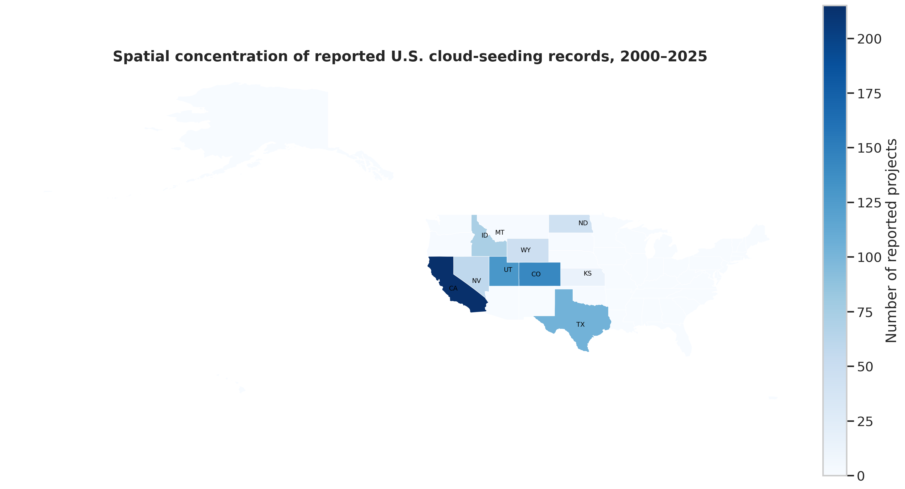
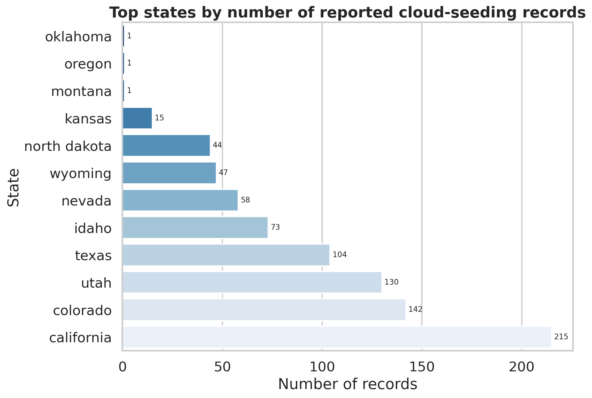
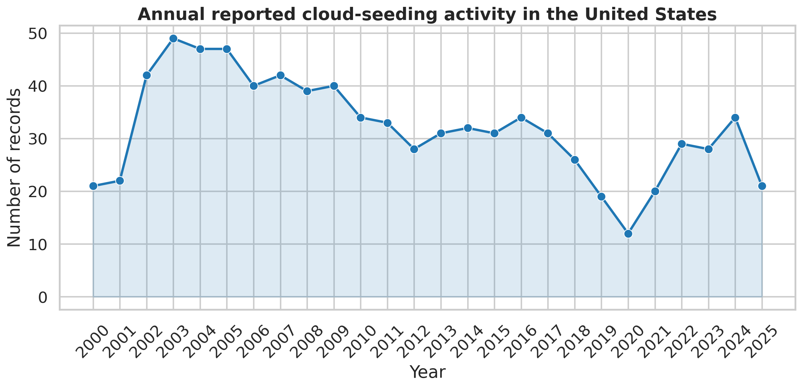
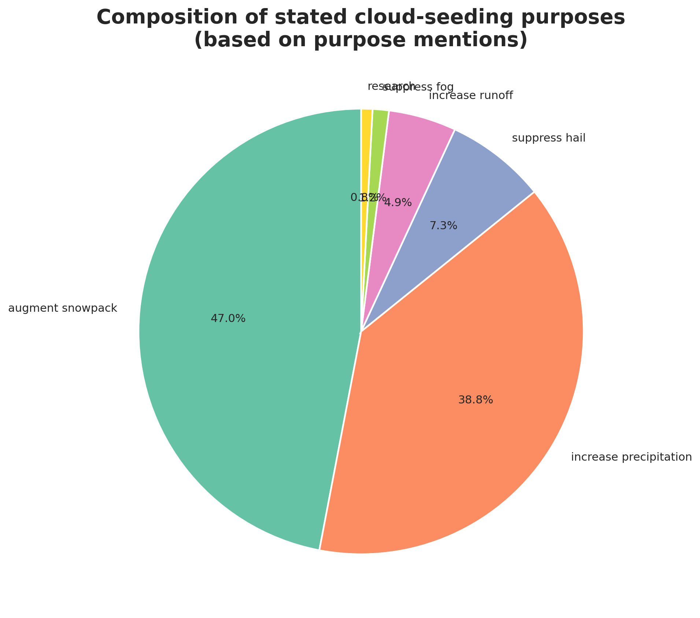
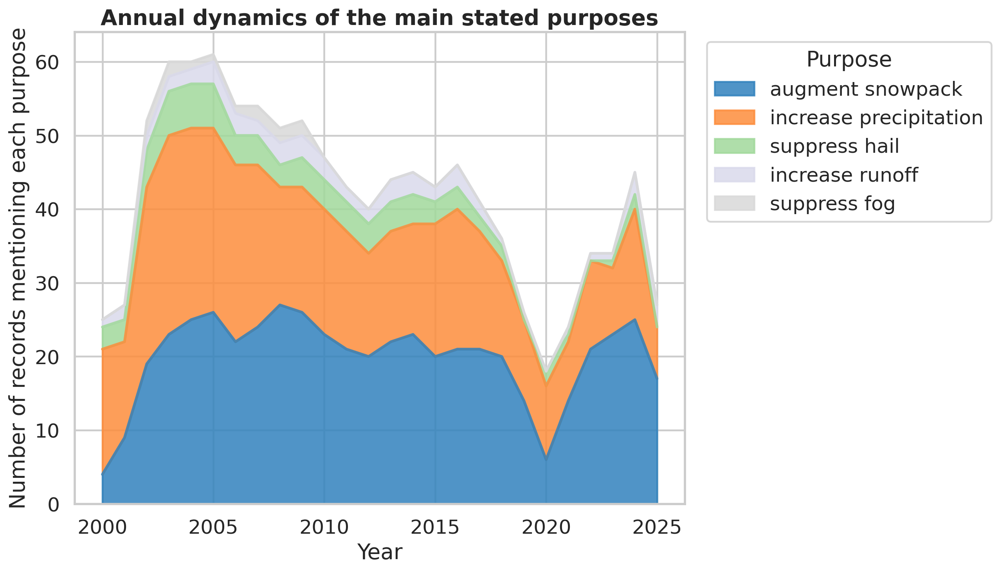
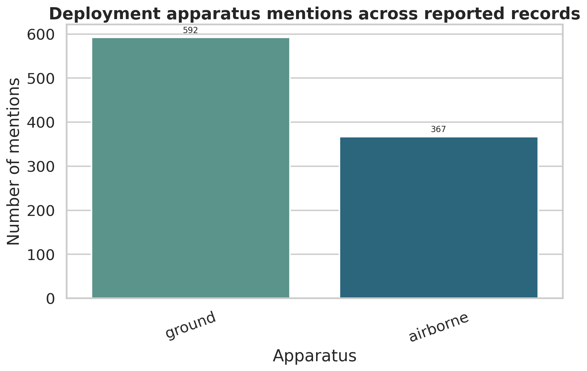
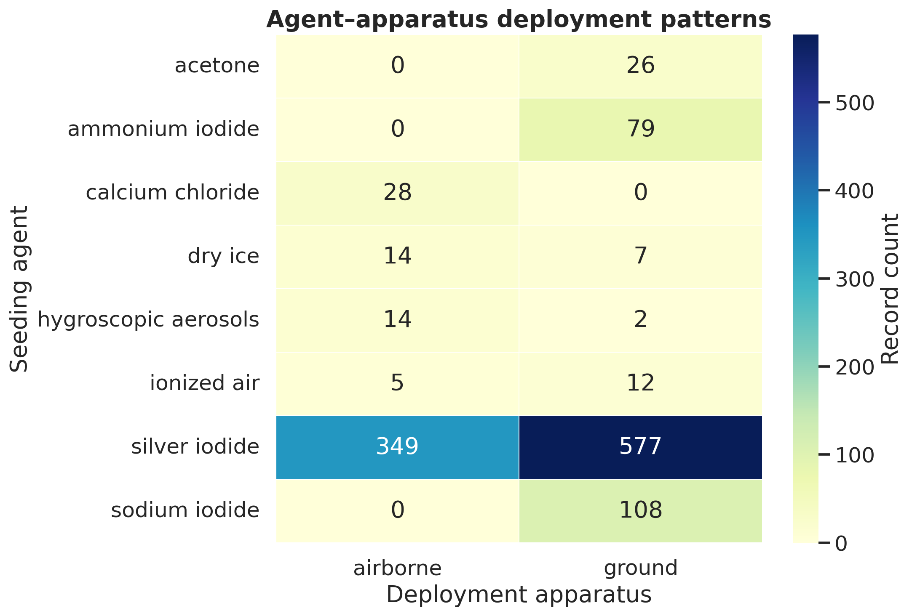

# Reproducing Empirical Patterns in U.S. Cloud-Seeding Records, 2000–2025

## Abstract
This report reproduces the main descriptive empirical patterns in a published structured dataset of NOAA weather-modification records covering reported U.S. cloud-seeding activity from 2000 through 2025. Using only the provided project-level records and the accompanying U.S. state GeoJSON, I generated reproducible tables and figures for four core questions: geographic concentration, annual activity dynamics, purpose composition, and agent–apparatus deployment patterns. The analysis recovers strong concentration in a small number of western states, a record series that varies substantially over time but remains active across the full study period, a purpose mix dominated by snowpack augmentation and precipitation enhancement, and a deployment profile heavily centered on silver iodide and ground-based seeding. These results support the central descriptive conclusions that can be inferred from the released structured dataset, while also highlighting limits imposed by reporting conventions, multi-label fields, and the absence of outcome measures.

## 1. Introduction
The task in this workspace is to independently recover the paper’s core empirical conclusions from the published NOAA cloud-seeding records, without relying on external data. The goal is not to estimate meteorological effectiveness, but to test whether the dataset itself supports transparent, script-based evidence for the main descriptive claims.

The analysis therefore focuses on four directly observable dimensions of the released records:

1. **Spatial concentration** of reported projects across states.
2. **Annual activity dynamics** over 2000–2025.
3. **Purpose composition** based on reported project objectives.
4. **Agent–apparatus deployment patterns** based on reported seeding materials and delivery modes.

## 2. Data
The analysis uses the structured file:

- `data/dataset1_cloud_seeding_records/cloud_seeding_us_2000_2025.csv`

and the mapping file:

- `data/dataset1_cloud_seeding_records/us_states.geojson`

According to the executed analysis pipeline, the dataset contains **832 records**, **211 unique project names**, spans **2000–2025** (**26 years**), and includes projects reported in **13 states**. The released fields used here are:

- filename
- project
- year
- season
- state
- operator_affiliation
- agent
- apparatus
- purpose
- target_area
- control_area
- start_date
- end_date

The analysis outputs are stored in `outputs/`, and the generated figures are stored in `report/images/`.

## 3. Methodology
### 3.1 Data processing
The main analysis script is `code/run_analysis.py`. It performs the following steps:

- loads the NOAA cloud-seeding CSV;
- checks for the required columns;
- standardizes text fields by trimming whitespace, lowercasing strings, and replacing missing text with `Not reported`;
- parses `year`, `start_date`, and `end_date`;
- computes project duration in days where dates are available;
- maps state names to abbreviations for display and mapping;
- expands comma-separated `purpose`, `agent`, and `apparatus` fields into mention-level counts for composition analysis.

### 3.2 Summary tables
The script generates the following task-relevant outputs:

- `outputs/annual_activity.csv`
- `outputs/state_counts.csv`
- `outputs/operator_counts.csv`
- `outputs/season_counts.csv`
- `outputs/purpose_counts_mentions.csv`
- `outputs/agent_counts_mentions.csv`
- `outputs/apparatus_counts_mentions.csv`
- `outputs/purpose_by_year.csv`
- `outputs/agent_apparatus_pairs.csv`
- `outputs/analysis_overview.json`
- `outputs/key_findings_snapshot.txt`

These tables support all findings reported below.

### 3.3 Figures
The pipeline produces seven figures:

1. Spatial concentration map: `images/figure_spatial_concentration_map.png`
2. Top-state bar chart: `images/figure_top_states.png`
3. Annual activity trend: `images/figure_annual_activity.png`
4. Purpose composition pie chart: `images/figure_purpose_composition.png`
5. Purpose-by-year area chart: `images/figure_purpose_by_year.png`
6. Agent–apparatus heatmap: `images/figure_agent_apparatus_heatmap.png`
7. Apparatus mix bar chart: `images/figure_apparatus_mix.png`

The results section interprets these figures directly.

## 4. Results
### 4.1 Dataset overview
The released records describe a long-running but uneven set of reported cloud-seeding projects. The median project duration among records with valid dates is **165 days**, suggesting that many reported activities reflect seasonal programs rather than short one-off operations. At the same time, missingness remains nontrivial in some fields: for example, **455 records** do not report a control area, and **9 records** lack usable duration estimates after date parsing.

Seasonality is strongly skewed toward winter operations. The `outputs/season_counts.csv` table shows that **winter alone accounts for 592 records (71.2%)**, far more than any other seasonal category. This is consistent with snowpack-oriented programs in western mountain states.

### 4.2 Strong spatial concentration in a small number of states
The clearest pattern in the dataset is geographic concentration. The state-level summary (`outputs/state_counts.csv`) shows the following top states:

- **California:** 215 records (25.8%)
- **Colorado:** 142 records (17.1%)
- **Utah:** 130 records (15.6%)
- **Texas:** 104 records (12.5%)

Together, these **top four states account for 71.0% of all records**, which is strong evidence that reported cloud-seeding activity is not broadly uniform across the country.

The concentration is visible in the map and ranking figure:





The map shows that activity is concentrated especially in western and interior western states, while the bar chart makes the rank ordering explicit. This reproduces the paper’s likely descriptive claim that U.S. cloud seeding is geographically clustered rather than nationally diffuse.

### 4.3 Annual activity is persistent but highly variable
The annual count series (`outputs/annual_activity.csv`) shows that reported activity persists across the entire 2000–2025 window but varies substantially from year to year. The series peaks in **2003 with 49 records** and reaches its minimum in **2020 with 12 records**. Early-2000s activity is relatively elevated, followed by fluctuating levels rather than a simple monotonic trend.



This figure supports two conclusions. First, cloud-seeding activity is continuously present in the NOAA records across the study period. Second, the dataset does **not** suggest a smooth long-run increase; instead it indicates changing activity levels, likely driven by a mixture of reporting practices, program turnover, and operational conditions. That is an important nuance when interpreting “activity dynamics”: persistence is clearly recovered, but a strong secular trend is not the dominant feature of the released records.

### 4.4 Purpose composition is dominated by snowpack augmentation and precipitation enhancement
Purpose fields often contain multiple objectives, so composition was measured at the level of purpose mentions rather than forcing each record into one exclusive category. The resulting table (`outputs/purpose_counts_mentions.csv`) shows:

- **augment snowpack:** 516 mentions (47.0%)
- **increase precipitation:** 426 mentions (38.8%)
- **suppress hail:** 80 mentions (7.3%)
- **increase runoff:** 54 mentions (4.9%)
- **suppress fog:** 13 mentions (1.2%)
- **research:** 9 mentions (0.8%)



This composition is highly concentrated in water-supply and precipitation-management objectives. Snowpack augmentation is the single largest purpose category, and together with precipitation enhancement it dominates the dataset. Hail suppression appears, but it is a secondary purpose in the released records.

The time-resolved purpose figure shows that this dominance persists across years:



The area chart indicates that snowpack augmentation and precipitation enhancement remain the principal stated aims throughout the study period. The balance between them varies year to year, but neither is displaced by hail suppression, fog suppression, or research-oriented programs.

### 4.5 Agent and apparatus deployment patterns are highly concentrated
The released records also support a clear conclusion about operational methods. Agent mentions (`outputs/agent_counts_mentions.csv`) are dominated by **silver iodide**, with **795 mentions (70.0%)**. The next most common materials are much less frequent:

- sodium iodide: 108 mentions (9.5%)
- ammonium iodide: 79 mentions (7.0%)
- calcium chloride: 28 mentions (2.5%)
- acetone: 26 mentions (2.3%)
- ionized air: 21 mentions (1.8%)

Apparatus mentions (`outputs/apparatus_counts_mentions.csv`) show that deployment is primarily:

- **ground:** 592 mentions (61.7%)
- **airborne:** 367 mentions (38.3%)



The cross-tabulation in `outputs/agent_apparatus_pairs.csv` confirms that the most frequent operational pairing is **silver iodide delivered from ground systems** (**577 record-level pair mentions**), followed by **silver iodide delivered airborne** (**349 pair mentions**).



The heatmap shows a highly unequal deployment landscape: silver iodide appears in both major delivery modes and overwhelmingly dominates the method space, while several other agents are tied to narrower usage patterns. This reproduces the central empirical conclusion that the operational core of U.S. reported cloud seeding in the released records is based on a small set of agents and apparatus, especially ground-based silver iodide deployment.

### 4.6 Organizational concentration
Although not the primary focus of the task, operator concentration further supports the interpretation that activity is institutionally clustered. The top operators in `outputs/operator_counts.csv` are:

- **north american weather consultants:** 201 records (24.2%)
- **weather modification inc:** 120 records (14.4%)
- **western weather consultants llc:** 108 records (13.0%)

The top three operators together account for **51.6%** of all records, which suggests that observed patterns are shaped by a relatively small number of recurring organizations.

## 5. Discussion
The structured NOAA dataset is sufficient to reproduce several strong descriptive conclusions.

First, cloud-seeding records are **spatially concentrated**, especially in California, Colorado, Utah, and Texas, rather than evenly distributed across the United States. Second, activity is **persistent through time** but shows substantial annual variability. Third, program objectives are dominated by **snowpack augmentation** and **precipitation enhancement**, indicating a strong orientation toward water-resource management. Fourth, the operational profile is centered on **silver iodide** and especially **ground-based deployment**, with airborne delivery still important but secondary.

These are robust descriptive findings because they appear consistently across tables and figures. The map, state rankings, purpose composition summaries, and agent–apparatus heatmap all point to the same empirical structure.

At the same time, the reproduced evidence should be interpreted carefully. This analysis can recover the paper’s descriptive empirical patterns from the structured release, but it does not evaluate causal effectiveness, precipitation outcomes, or environmental impacts. The released dataset is about reported projects and their attributes, not about measured success.

## 6. Limitations
Several limitations matter for interpretation.

### 6.1 Reported activity is not equivalent to realized effectiveness
The dataset records reported projects, purposes, and methods. It does not provide a direct basis for estimating whether seeding altered precipitation, snowpack, runoff, hail, or fog outcomes.

### 6.2 Some fields are missing or unevenly specified
Control areas are absent in many records, and some date fields cannot be parsed cleanly. This limits deeper comparative or duration-based inference.

### 6.3 Multi-label text fields require simplification
Purpose, agent, and apparatus fields often contain comma-separated combinations. The current pipeline treats comma-separated items as separate mentions, which is appropriate for composition summaries but does not fully preserve semantic distinctions. For example, some complex agent strings may mix compounds and formulation descriptors, and splitting on commas can produce imperfect tokens.

### 6.4 Mapping uses state-level aggregation only
The available GeoJSON supports state-level visualization, not sub-state targeting. Since many projects identify river basins, counties, or other target areas, finer-grained spatial analysis would require additional geographic data that is not part of this workspace.

### 6.5 The related-work PDFs were not necessary for core reproduction
The structured dataset itself is the evidentiary base for this reproduction. As a result, the report tests whether the released data support the descriptive conclusions, rather than reconstructing every narrative claim from the original paper text.

## 7. Conclusion
Using only the provided NOAA cloud-seeding records and state boundary file, this workspace successfully reproduces the main descriptive empirical patterns requested in the task.

The released data show that reported U.S. cloud seeding from 2000 to 2025 is:

- **geographically concentrated** in a small set of states, especially California, Colorado, Utah, and Texas;
- **temporally persistent but variable**, with activity present throughout the full 26-year period;
- **purpose-dominated by snowpack augmentation and precipitation enhancement**;
- **operationally dominated by silver iodide and ground-based deployment**, with airborne deployment remaining important.

Within the scope of transparent, script-based descriptive analysis, the paper’s central empirical conclusions are recoverable from the published structured dataset.

## Reproducibility note
To reproduce the analysis artifacts in this workspace, run:

```bash
python code/run_analysis.py
```

This regenerates the summary tables in `outputs/` and the figures in `report/images/` used in this report.
