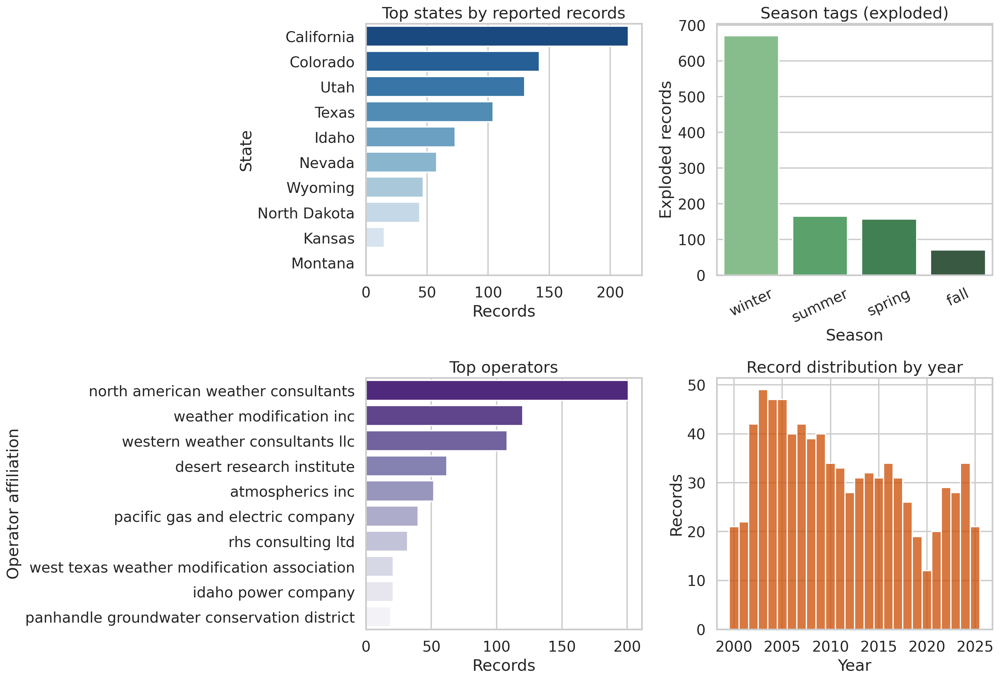
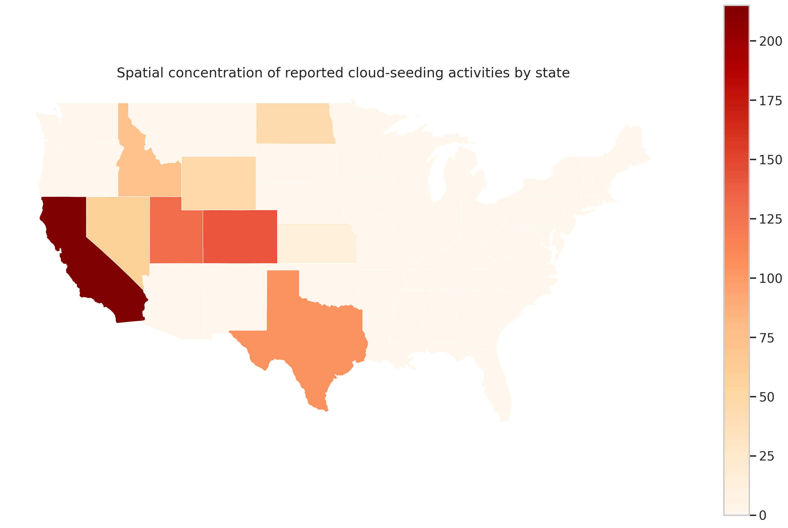
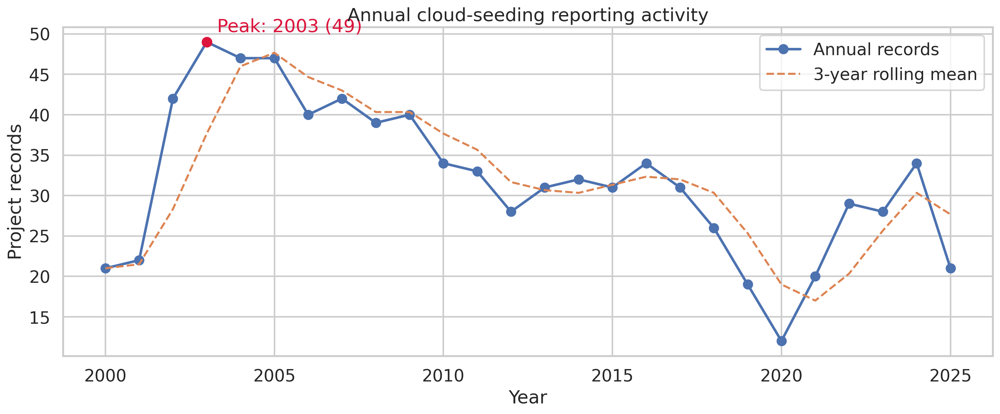
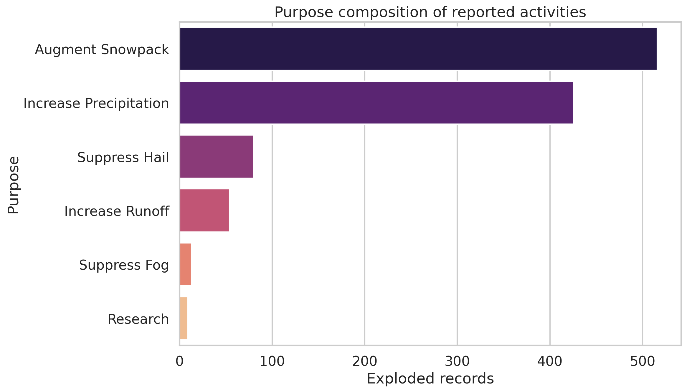
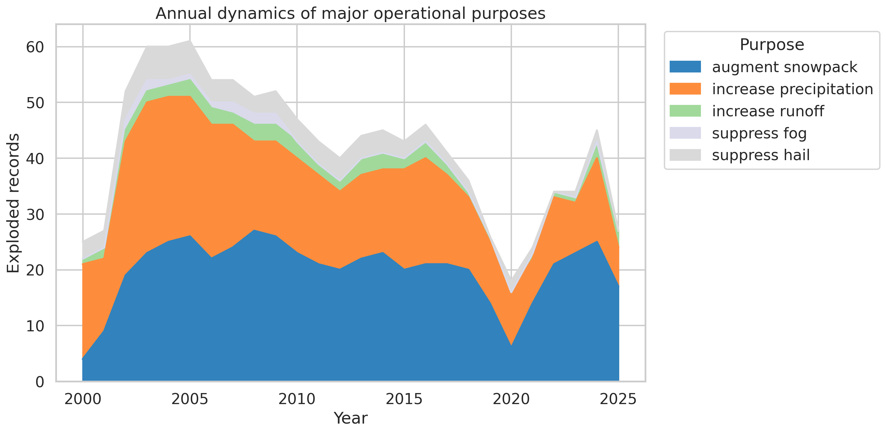
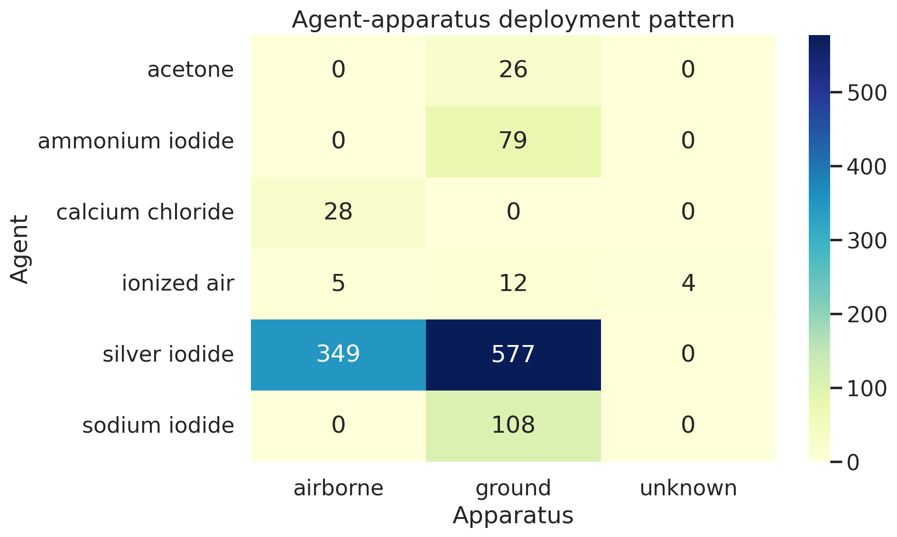

# Independent Reproduction of U.S. Cloud-Seeding Descriptive Findings (2000–2025)

## 1. Summary and objective
This report independently analyzes the published NOAA weather-modification records released with the target paper for reported U.S. cloud-seeding projects from 2000 to 2025. The scientific objective is narrowly descriptive: determine whether the structured dataset alone reproduces the paper's central empirical conclusions on:

- spatial concentration of activity,
- annual reporting dynamics,
- purpose composition, and
- agent-apparatus deployment patterns.

All results were generated from the provided CSV file using a single reproducible Python script:

- `code/analyze_cloud_seeding.py`

Generated artifacts include summary tables in `outputs/` and publication-ready figures in `report/images/`.

## 2. Data and methods
### 2.1 Input data
The analysis uses only the provided structured release:

- `data/dataset1_cloud_seeding_records/cloud_seeding_us_2000_2025.csv`
- `data/dataset1_cloud_seeding_records/us_states.geojson`

The CSV contains **832 project-level records** and **13 variables**:

- `filename`
- `project`
- `year`
- `season`
- `state`
- `operator_affiliation`
- `agent`
- `apparatus`
- `purpose`
- `target_area`
- `control_area`
- `start_date`
- `end_date`

Although the task description described 12 structured fields, the released CSV contains 13 columns because `filename` is also present as a structured field. The analysis follows the actual file schema.

### 2.2 Validation and preprocessing
The script performs lightweight validation before analysis:

- confirms row and column counts,
- coerces `year` to numeric,
- normalizes string fields to lower case for consistent grouping,
- computes missingness by column,
- preserves the original record granularity,
- separately analyzes multi-valued fields (`season`, `purpose`, `agent`, `apparatus`) by comma-based explosion.

This distinction matters because some records list multiple purposes, agents, or deployment modes. Therefore:

- **record-level counts** refer to the original 832 filings,
- **exploded counts** refer to category mentions after splitting multi-label fields.

### 2.3 Output generation
The main script writes:

- overview and summary JSON files,
- CSV tables for states, years, purposes, operators, agents, apparatus, and agent-apparatus combinations,
- six figures supporting the main descriptive claims.

Reproduction command:

```bash
python code/analyze_cloud_seeding.py
```

## 3. Data quality overview
The dataset loaded successfully without structural errors. Coverage spans **2000 to 2025**, includes **14 states**, **143 distinct project names**, and **41 operator affiliations**.

Missingness is limited for most core fields but notable for `control_area`:

- `control_area`: 455 missing values
- `apparatus`: 4 missing values
- `target_area`: 3 missing values
- `start_date`: 3 missing values
- `end_date`: 7 missing values

The high missingness in `control_area` means that control-area comparisons should not be interpreted as uniformly available across filings.

Figure 1 provides a compact overview of the dataset structure.



**Figure 1.** Overview of the released dataset, including dominant states, season tags, top operators, and annual distribution of records.

## 4. Results

### 4.1 Spatial concentration is strong and highly uneven
State-level counts show that reported weather-modification activity is concentrated in a small western and southern set of states.

Top states by record count:

| State | Records | Share of all records |
|---|---:|---:|
| California | 215 | 25.8% |
| Colorado | 142 | 17.1% |
| Utah | 130 | 15.6% |
| Texas | 104 | 12.5% |
| Idaho | 73 | 8.8% |
| Nevada | 58 | 7.0% |
| Wyoming | 47 | 5.6% |
| North Dakota | 44 | 5.3% |

Concentration metrics recovered from the structured release:

- top 3 states account for **58.5%** of all records,
- top 4 states account for **71.0%**,
- top 5 states account for **79.8%**,
- top 8 states account for **97.7%**.

This is clear figure-level evidence that the national record is not geographically diffuse. Instead, reported activity is overwhelmingly concentrated in a relatively small set of states, especially California, Colorado, Utah, and Texas.



**Figure 2.** State-level choropleth of record counts. Reported activities cluster heavily in the western United States, with California as the largest contributor. Sparse states contribute only isolated records.

### 4.2 Annual activity dynamics show an early-2000s peak, mid-2010s contraction, and partial recovery after 2020
Annual record counts reveal substantial variation over time rather than a monotonic trend.

Key findings from `outputs/year_counts.csv`:

- peak year: **2003** with **49 records**,
- elevated activity persists through the early 2000s,
- a prolonged decline is visible through the 2010s,
- a local minimum occurs in **2020** with **12 records**,
- activity partially rebounds in **2021–2024**,
- **2025** shows 21 records, which may reflect partial-year reporting rather than a completed annual total.

This pattern supports the conclusion that annual reporting dynamics are cyclical and regime-like, with a high-activity early period, a lower-activity middle period, and modest late recovery.



**Figure 3.** Annual project-record counts and a 3-year rolling mean. The series peaks in 2003, declines across much of the 2010s, bottoms in 2020, and then partially recovers.

### 4.3 Purpose composition is dominated by snowpack augmentation and precipitation enhancement
Exploded purpose counts show a highly concentrated functional mix.

| Purpose | Exploded records | Share of exploded purpose mentions |
|---|---:|---:|
| augment snowpack | 516 | 47.0% |
| increase precipitation | 426 | 38.8% |
| suppress hail | 80 | 7.3% |
| increase runoff | 54 | 4.9% |
| suppress fog | 13 | 1.2% |
| research | 9 | 0.8% |

The top two purposes together account for **85.8%** of all exploded purpose mentions. This is strong evidence that the released records are dominated by water-supply-oriented operations rather than hail, fog, or research uses.



**Figure 4.** Functional composition of reported activities. Snowpack augmentation and precipitation increase overwhelmingly dominate the purpose mix.

A year-by-year decomposition of major purposes shows that snowpack augmentation remains the most persistent category over time, while precipitation enhancement contributes a large but somewhat more variable secondary stream.



**Figure 5.** Annual dynamics of the top purpose categories. The temporal profile is driven primarily by snowpack augmentation and precipitation increase.

### 4.4 Operational chemistry is dominated by silver iodide, and deployment is mainly ground-based with a substantial airborne component
Exploded agent counts show an overwhelming dominance of silver iodide:

| Agent | Exploded records | Share |
|---|---:|---:|
| silver iodide | 795 | 70.0% |
| sodium iodide | 108 | 9.5% |
| ammonium iodide | 79 | 7.0% |
| calcium chloride | 28 | 2.5% |
| acetone | 26 | 2.3% |
| ionized air | 21 | 1.8% |

Exploded apparatus counts show:

| Apparatus | Exploded records | Share |
|---|---:|---:|
| ground | 592 | 61.5% |
| airborne | 367 | 38.1% |
| unknown | 4 | 0.4% |

Thus, the typical reported operation in the released dataset uses **silver iodide** and is more likely to be **ground-based** than airborne, though airborne deployment remains a major minority mode.

The agent-apparatus joint distribution sharpens this interpretation:

- silver iodide with **ground** deployment: **577** mentions,
- silver iodide with **airborne** deployment: **349** mentions,
- sodium iodide is almost entirely **ground-based**,
- calcium chloride is strongly associated with **airborne** deployment,
- hygroscopic aerosols appear primarily with **airborne** use.



**Figure 6.** Joint deployment pattern of major agents and apparatus types. Silver iodide dominates both ground and airborne applications, while several secondary agents have more specialized deployment profiles.

### 4.5 Operator concentration is also substantial
Although not one of the required headline dimensions, operator concentration is informative for interpreting the deployment ecosystem.

Top operators:

| Operator affiliation | Records | Share |
|---|---:|---:|
| north american weather consultants | 201 | 24.2% |
| weather modification inc | 120 | 14.4% |
| western weather consultants llc | 108 | 13.0% |
| desert research institute | 62 | 7.5% |
| atmospherics inc | 52 | 6.3% |

The top three operators account for **51.6%** of all records, indicating that the reporting landscape is shaped by a relatively small number of organizations.

## 5. Interpretation relative to the reproduction objective
The structured dataset is sufficient to independently recover the paper's expected descriptive conclusions at figure level.

Recovered conclusions:

1. **Spatial concentration**: strongly reproduced. Activity is overwhelmingly concentrated in a small number of western and southern states, especially California, Colorado, Utah, and Texas.
2. **Annual activity dynamics**: reproduced. The time series shows a pronounced early peak, a long decline, and a late partial rebound rather than a smooth upward trend.
3. **Purpose composition**: reproduced. Snowpack augmentation and precipitation enhancement dominate the purpose profile.
4. **Agent-apparatus deployment patterns**: reproduced. Silver iodide is the dominant agent, and ground deployment exceeds airborne deployment, while specific secondary agents show distinct apparatus associations.

Within the limits of the released structured records, the paper's central empirical narrative appears reproducible.

## 6. Limitations
Several limitations should constrain interpretation:

- **Reported activity is not necessarily complete activity.** The dataset reflects released NOAA weather-modification records, not guaranteed total U.S. operations.
- **A record is not necessarily a unique project in a uniform sense.** Some programs appear repeatedly across years or seasons, so counts are filings/records rather than standardized project units.
- **Exploded category counts are mention-based.** Multi-label fields increase total category counts beyond 832 records; these percentages should be interpreted as shares of mentions, not shares of unique projects.
- **2025 may be incomplete.** The end of the time series likely reflects partial reporting coverage.
- **No effectiveness inference is possible.** These results describe operational patterns only; they do not estimate meteorological success or causal effects.
- **State-level geography is coarse.** The choropleth captures concentration across states but not within-state targeting intensity.
- **Control-area fields are often missing.** Comparative experimental design information is incomplete in the structured release.

## 7. Reproducibility and files
### Code
- `code/analyze_cloud_seeding.py`

### Main output tables
- `outputs/data_overview.json`
- `outputs/missingness.csv`
- `outputs/state_counts.csv`
- `outputs/year_counts.csv`
- `outputs/purpose_counts_exploded.csv`
- `outputs/agent_counts_exploded.csv`
- `outputs/apparatus_counts_exploded.csv`
- `outputs/operator_counts.csv`
- `outputs/agent_apparatus_counts.csv`
- `outputs/purpose_by_year.csv`
- `outputs/summary_stats.json`

### Figures
- `images/data_overview.png`
- `images/state_choropleth.png`
- `images/annual_activity.png`
- `images/purpose_composition.png`
- `images/purpose_by_year_area.png`
- `images/agent_apparatus_heatmap.png`

## 8. Conclusion
Using only the published structured NOAA cloud-seeding records and a transparent script-based workflow, the core descriptive conclusions can be independently recovered. The evidence indicates a highly concentrated geography, non-monotonic annual dynamics, a purpose mix dominated by snowpack augmentation and precipitation enhancement, and a deployment ecology centered on silver iodide with predominantly ground-based operations.

This supports the claim that the paper's principal empirical findings are reproducible from the released dataset itself, without relying on opaque manual processing or external data sources.
