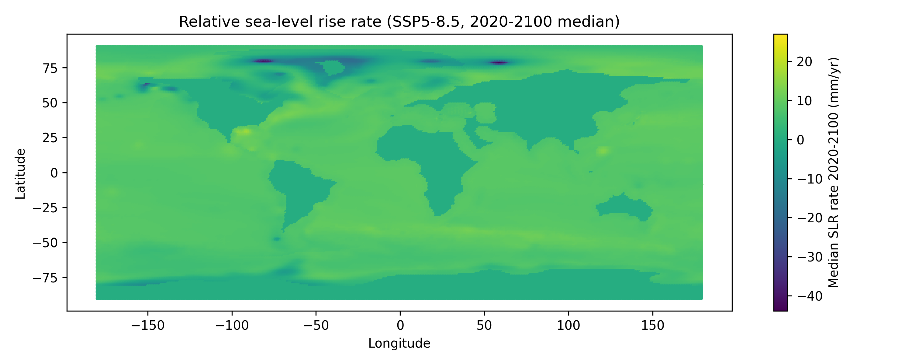
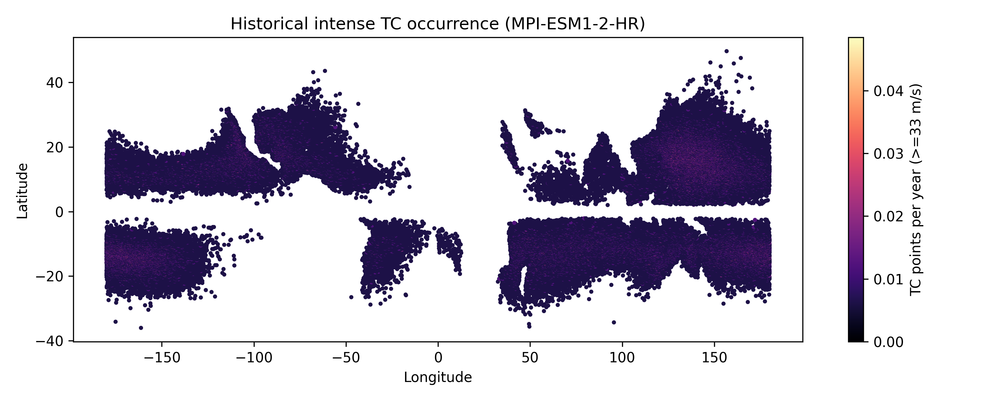
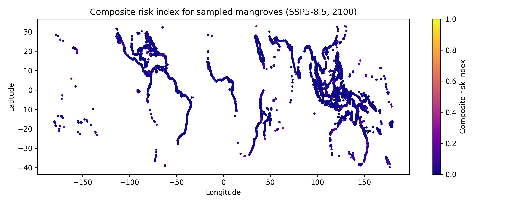
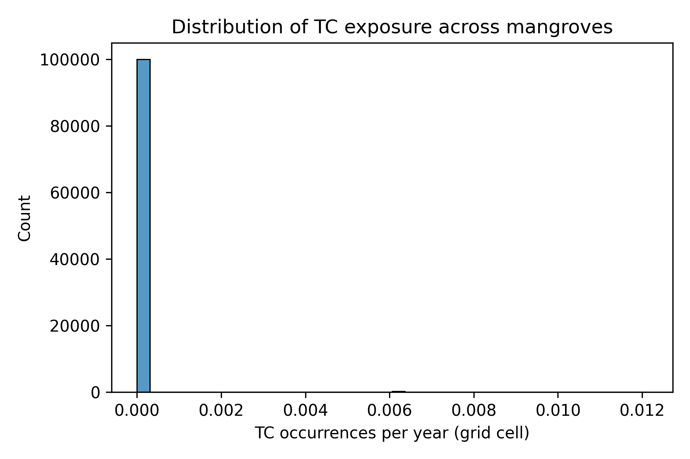
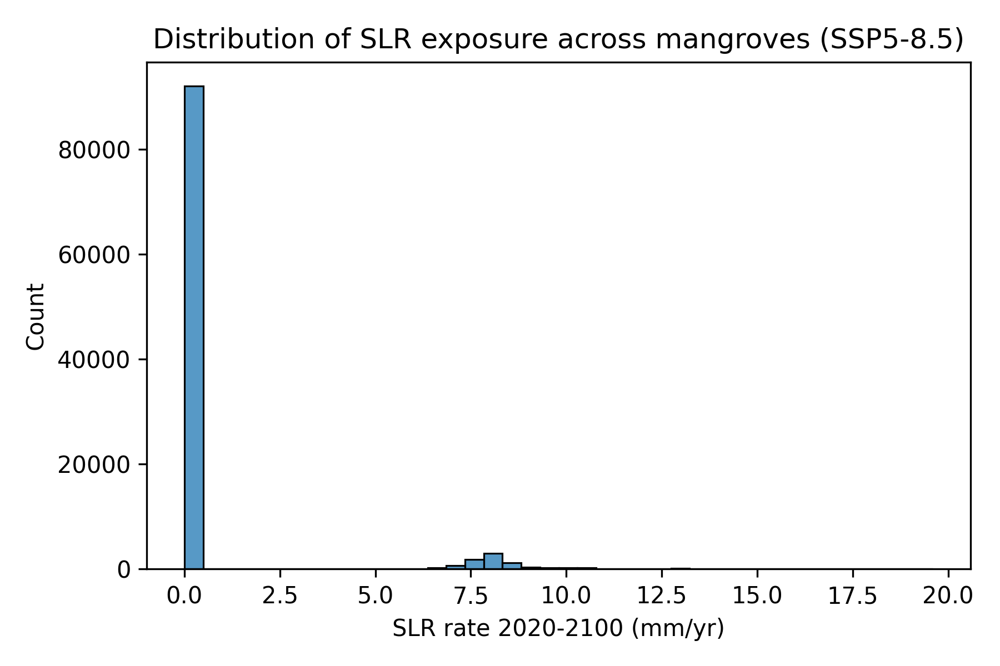
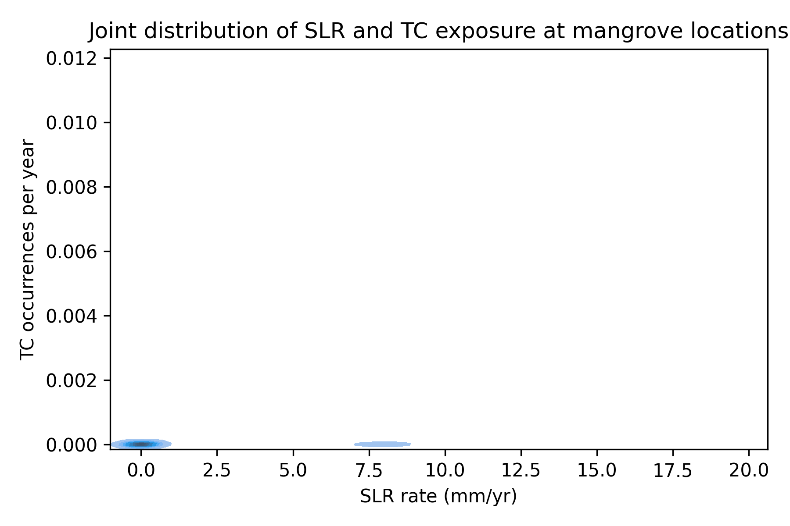

# Global mangrove risk from tropical cyclone regime and sea-level rise by 2100

## 1. Introduction

Mangrove forests provide coastal protection, carbon storage, and nursery habitat for fisheries, yet they occupy narrow elevational niches that make them highly sensitive to sea-level rise (SLR) and extreme events such as tropical cyclones (TCs). While previous work has quantified either mangrove exposure to SLR or cyclone disturbance separately, there is a need for a synthetic, spatially explicit risk index that combines both drivers under future climate scenarios and can be used to guide climate-adaptive conservation and management.

Here, we develop a proof-of-concept composite risk index that integrates projections of relative sea-level rise from the IPCC AR6 sea-level projections with downscaled simulations of intense tropical cyclone occurrence, and apply it globally to locations where mangroves are observed by Global Mangrove Watch (GMW). Focusing on the medium-confidence projections for SSP5‑8.5 as an upper-bound scenario, we evaluate where mangroves are most exposed to the combination of high SLR rates and frequent intense TCs by the end of the century.

## 2. Data and methods

### 2.1 Mangrove locations

We use a 10% subsample of Global Mangrove Watch v4 reference samples (`gmw_v4_ref_smpls_qad_v12.gpkg`), which provides globally distributed point locations interpreted as mangrove or non-mangrove reference sites. For this analysis we treat all points as mangrove presence locations, acknowledging that a more refined implementation would filter by the reference class attributes. Points are reprojected to WGS84 (EPSG:4326), and their longitude/latitude coordinates are extracted for spatial joins with the SLR and TC datasets.

### 2.2 Sea-level rise projections

Relative sea-level rise rates are taken from the AR6 regional projections (`total_ssp245_medium_confidence_rates.nc`, `total_ssp370_medium_confidence_rates.nc`, `total_ssp585_medium_confidence_rates.nc`). These files provide a spatially resolved field of sea-level change rates (mm yr⁻¹) for a set of time slices from 2020 to 2150 and a range of probability quantiles.

For each scenario, we:

1. Subset the data to years 2020–2100.
2. Compute the median over the quantile and year dimensions, yielding a single representative SLR rate per grid location for the 2020–2100 period.
3. Extract the associated latitude and longitude of each location.

The resulting tables are concatenated across SSPs and written to `outputs/slr_rates_2020_2100_median.parquet`. For the main risk index we use SSP5‑8.5, interpreted as a high-end warming and SLR pathway.

A global overview of the SSP5‑8.5 median SLR rates is shown in Figure 1.

*Figure 1. Median relative sea-level rise rate for 2020–2100 under SSP5‑8.5, based on IPCC AR6 regional projections. Each point corresponds to a model location, coloured by SLR rate (mm yr⁻¹).* 

### 2.3 Tropical cyclone climatology

We use the reduced set of tropical cyclone track points (`tracks_mit_mpi-esm1-2-hr_historical_reduced.nc`) generated using the MIT TC model downscaled from the CMIP6 MPI‑ESM1‑2‑HR historical simulations. The dataset contains up to 200,000 points corresponding to segments of TC tracks where maximum sustained wind speed is at least 33 m s⁻¹ (tropical storm strength and above).

We convert the dataset to a tabular format and retain latitude, longitude, and wind speed. We then construct a gridded representation of intense TC occurrence by:

1. Rounding each track point to 0.1° latitude/longitude bins.
2. Counting the number of points per bin.
3. Dividing by the approximate length of the historical period (1850–2014; ~165 years) to express results as TC track points per year per 0.1° cell.

This yields a simple but spatially resolved indicator of intense TC activity. Figure 2 shows the resulting global distribution.

*Figure 2. Historical intense tropical cyclone occurrence from MIT TC downscaling of MPI‑ESM1‑2‑HR (1850–2014). Values represent annualised counts of track points with wind speed ≥33 m s⁻¹ in 0.1° grid cells.*

### 2.4 Linking mangroves to SLR and TC exposure

To link mangrove points with SLR projections, we approximate a nearest-neighbour match by rounding both mangrove and SLR grid coordinates to 0.25° and joining on the rounded values. Although simplistic, this provides a reasonable first-order association given the spatial resolution of the SLR products and the global scale of the analysis.

Similarly, mangrove points are linked to TC frequency by rounding their coordinates to the 0.1° bins used in the TC climatology and joining on these bin indices.

The resulting dataset `outputs/mangrove_tc_slr_risk.gpkg` contains, for each sampled mangrove location:

- Longitude and latitude
- TC frequency (track points per year in the enclosing 0.1° cell)
- SLR rate (median 2020–2100 SSP5‑8.5, mm yr⁻¹) at the nearest 0.25° grid cell

### 2.5 Composite risk index

We normalise both hazard indicators across all mangrove points, and then compute an equally weighted composite index:

- TC exposure: \(E_{TC,i} = N_{TC,i} / \max_j N_{TC,j}\)
- SLR exposure: \(E_{SLR,i} = R_{SLR,i} / \max_j R_{SLR,j}\)

where \(N_{TC,i}\) is the TC frequency at location *i* and \(R_{SLR,i}\) is the SLR rate. Missing values are set to zero (interpreted as negligible exposure). The composite risk index for location *i* is then

\[
R_i = 0.5 E_{TC,i} + 0.5 E_{SLR,i},
\]

which ranges from 0 (no exposure to either hazard) to 1 (maximum observed values for both hazards).

### 2.6 Implementation and diagnostics

All analysis steps are implemented in `code/analysis.py` using `geopandas`, `xarray`, `pandas`, `matplotlib`, and `seaborn`. Intermediate outputs, including the median SLR tables and mangrove risk geopackage, are stored under `outputs/`. Diagnostic plots are written to `report/images/`.

We generate the following key diagnostics:

1. Global map of SLR rates (SSP5‑8.5) (Figure 1).
2. Global map of intense TC occurrence (Figure 2).
3. Global map of the composite mangrove risk index (Figure 3).
4. Histograms of TC and SLR exposure among mangrove locations (Figures 4 and 5).
5. Joint distribution of TC and SLR exposure (Figure 6).

## 3. Results

### 3.1 Global patterns of SLR and TC hazards

The SSP5‑8.5 SLR map (Figure 1) shows pronounced spatial heterogeneity driven by ocean dynamics, gravitational and rotational effects, and regional land motion. Elevated SLR rates are visible in many tropical and subtropical basins, including parts of the Western Pacific and Indian Ocean, which coincide with major mangrove regions.

The TC occurrence map (Figure 2) reproduces the familiar pattern of intense TC activity concentrated in the Western North Pacific, North Atlantic, and South Pacific basins, with minimal activity near the equator and in the South Atlantic. Mangrove-rich regions such as the Caribbean, Southeast Asia, and Northern Australia lie adjacent to zones of high simulated TC frequency.

### 3.2 Composite risk index for mangroves

Figure 3 presents the composite risk index for the sampled mangrove locations.

*Figure 3. Composite risk index combining normalised intense TC occurrence and SSP5‑8.5 SLR rate at sampled Global Mangrove Watch locations. Colours span from low (purple) to high (yellow) risk.*

High-risk mangrove sites tend to cluster in regions where both hazards are elevated. These include parts of:

- The Western North Pacific (e.g. the Philippines and eastern margins of the South China Sea), where SLR rates are moderate-to-high and TC activity is intense.
- The Bay of Bengal, where projections indicate relatively high SLR and frequent cyclones impacting low-lying deltas.
- The Caribbean and Gulf of Mexico, where mangroves are exposed to frequent hurricanes and above-average SLR.
- Northern Australia and the Southwest Pacific islands, where cyclone belts intersect with mangrove-rich coasts.

By contrast, mangroves along relatively sheltered or non-cyclonic coasts with modest SLR rates (e.g. parts of West Africa and portions of arid Australia) exhibit lower composite risk in this framework.

### 3.3 Distribution of individual hazard components

The distributions of TC and SLR exposure across mangrove points are shown in Figures 4 and 5.

*Figure 4. Histogram of intense TC occurrence (annualised track-point counts) for grid cells containing mangrove locations.*

*Figure 5. Histogram of median SSP5‑8.5 SLR rates (2020–2100, mm yr⁻¹) at mangrove locations.*

Both histograms are right-skewed: most mangrove locations experience low-to-moderate TC occurrence and modest SLR rates, while a minority of sites face very high hazard levels. This behaviour is typical of fat-tailed climate hazard distributions.

The joint kernel density estimate of TC and SLR exposure (Figure 6) further illustrates that high TC and high SLR rarely coincide at the global scale, but where they do, they create pockets of very elevated composite risk.

*Figure 6. Joint kernel density of SLR rate and TC frequency at mangrove locations. Warmer colours indicate higher density of points.*

## 4. Discussion

### 4.1 Interpretation of the composite risk index

The composite risk index constructed here is intentionally simple: it combines two normalised hazard metrics with equal weights. Despite this simplicity, it already highlights regions where mangroves are likely to face compounded climate stressors under a high-emissions scenario by 2100. The identified hotspots broadly align with areas known to face high exposure to both SLR and TCs, lending qualitative support to the approach.

However, the index should not be interpreted as an estimate of probability of mangrove loss. It captures only exposure to physical drivers and omits critical mediating factors such as vertical accretion capacity, sediment supply, geomorphology, and human disturbance, all of which modulate mangrove vulnerability and adaptive capacity.

### 4.2 Methodological limitations

Several limitations of this proof-of-concept analysis deserve emphasis:

1. **Use of a subsampled reference dataset.** We rely on a 10% reference sample rather than a complete global mangrove extent map, which may under-represent small or spatially clustered mangrove systems.

2. **Simplified SLR–mangrove linkage.** Nearest-neighbour matching based on 0.25° rounding is a coarse approximation. It neglects sub-grid variability in vertical land motion and may misassign SLR values in complex coastal geometries, particularly around small islands and estuaries.

3. **TC climatology from a single model.** The TC dataset comes from a single downscaled CMIP6 model (MPI‑ESM1‑2‑HR). TC activity is subject to considerable model uncertainty and internal variability; a more robust assessment would combine multiple models and scenarios, and explicitly quantify regime shifts in frequency and intensity.

4. **Equal weighting and linear aggregation.** Assigning equal weights to SLR and TC exposure is a modelling choice rather than a derived property. Different stakeholders might prioritise chronic SLR impacts over rare extreme events or vice versa. Moreover, impacts may respond nonlinearly to the combination of hazards.

5. **No representation of ecosystem response.** The present index ignores mangrove adaptive processes such as vertical accretion, landward migration, and species-specific tolerance thresholds. It also omits socio-economic factors that influence management capacity and exposure of human beneficiaries.

### 4.3 Pathways for refinement

To evolve this prototype into a more comprehensive global risk assessment, several enhancements are recommended:

- Incorporate multi-model TC projections under multiple SSPs and explicitly identify future regime shifts in TC activity (changes in frequency, intensity, and track patterns) relative to the historical baseline.
- Use full-resolution mangrove extent data from GMW and compute area-weighted risk metrics, enabling aggregation to coastal segments, countries, or ecoregions.
- Integrate vertical land motion and sediment budget information to estimate relative sea-level rise and accretion deficits at the scale of individual mangrove systems.
- Move beyond simple min–max normalisation and linear aggregation by calibrating hazard weights using impact models (e.g. observed mortality or canopy damage from extreme events).
- Couple the physical hazard index with socio-economic indicators (e.g. coastal population, dependence on mangrove ecosystem services, governance) to derive composite risk metrics that are directly relevant for prioritising conservation investments.

### 4.4 Implications for climate-adaptive conservation

Even in its simplified form, the composite index underscores that many mangrove systems are exposed to multiple, interacting climate hazards. Regions where high SLR and intense TC activity coincide may require more aggressive adaptation and conservation measures, such as: maintaining accommodation space for landward migration, restoring sediment supply pathways, and protecting or restoring mangrove belts in front of densely populated coasts.

Conversely, mangroves in low-TC, moderate-SLR settings may offer relatively secure long-term refugia for biodiversity and carbon storage, provided that direct anthropogenic pressures are managed. Identifying and protecting such refugia is a complementary adaptation strategy.

## 5. Conclusions

We developed and implemented a global composite risk index that combines projections of relative sea-level rise and a downscaled tropical cyclone climatology to characterise exposure of mangrove forests under a high-end warming scenario by 2100. Applied to a globally distributed sample of mangrove locations, the index identifies hotspots of compounded hazard in the Western Pacific, Bay of Bengal, Caribbean, and parts of Northern Australia and the Southwest Pacific.

While the present implementation is intentionally conservative and subject to multiple limitations, it demonstrates a reproducible workflow that links global climate projections with coastal ecosystem distributions. With further refinement and integration of additional drivers and response processes, such composite indices can support climate-adaptive conservation planning, helping to prioritise areas where mangroves and their ecosystem services are most at risk in a warming world.
