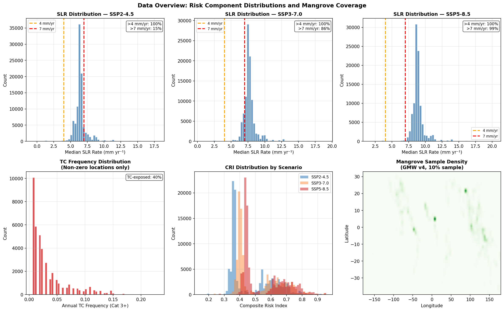
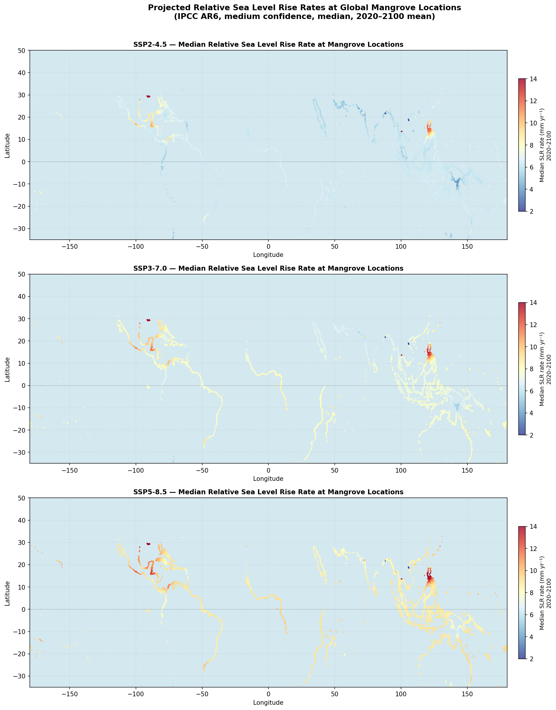
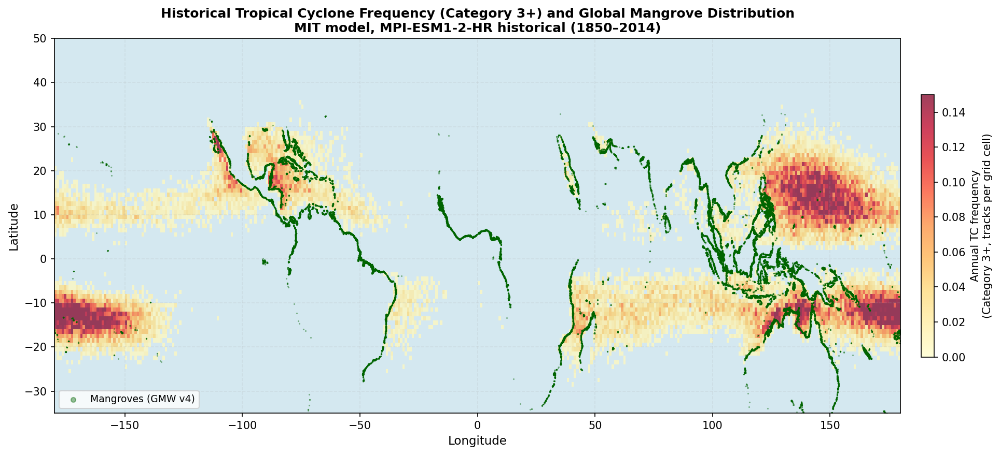
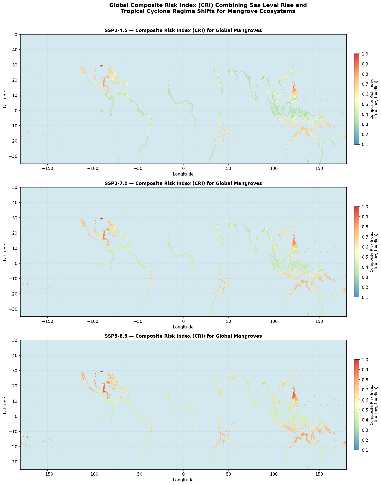
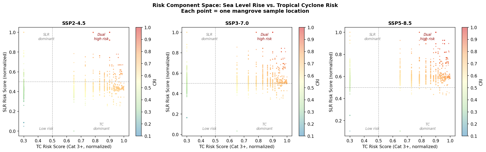
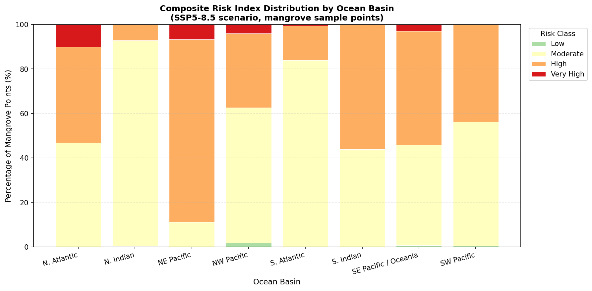
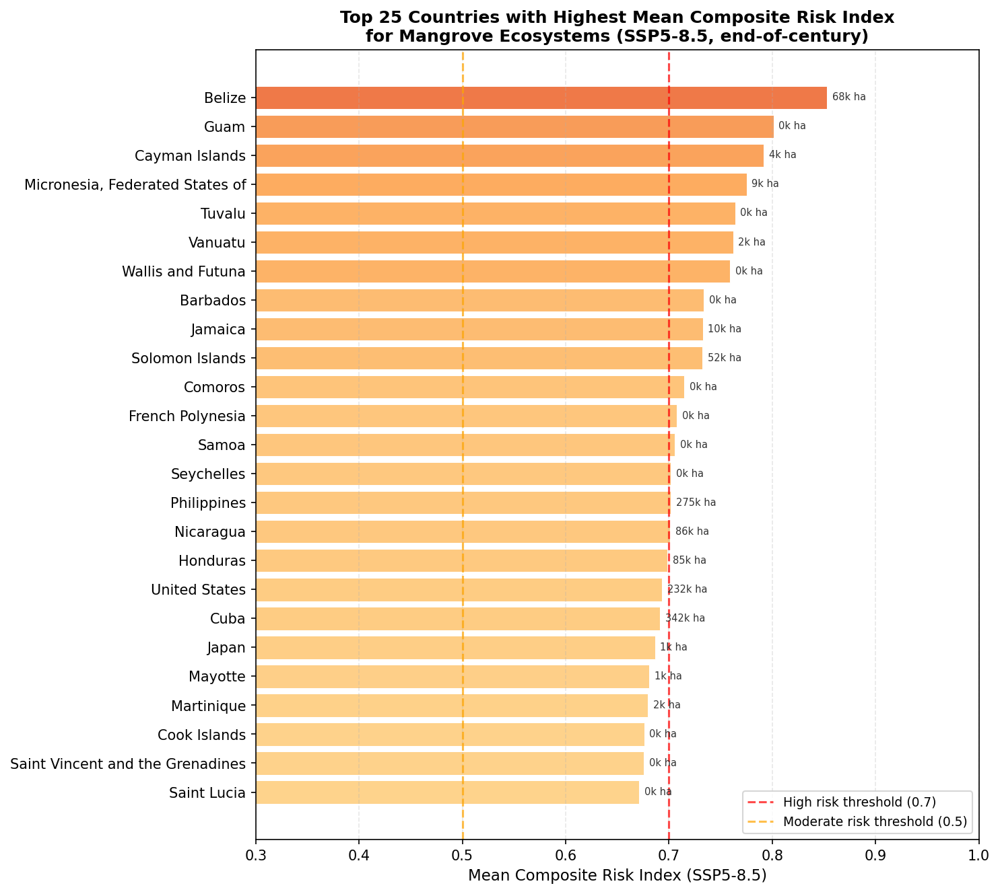
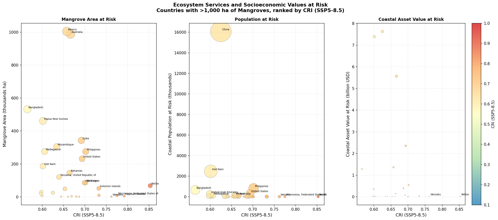
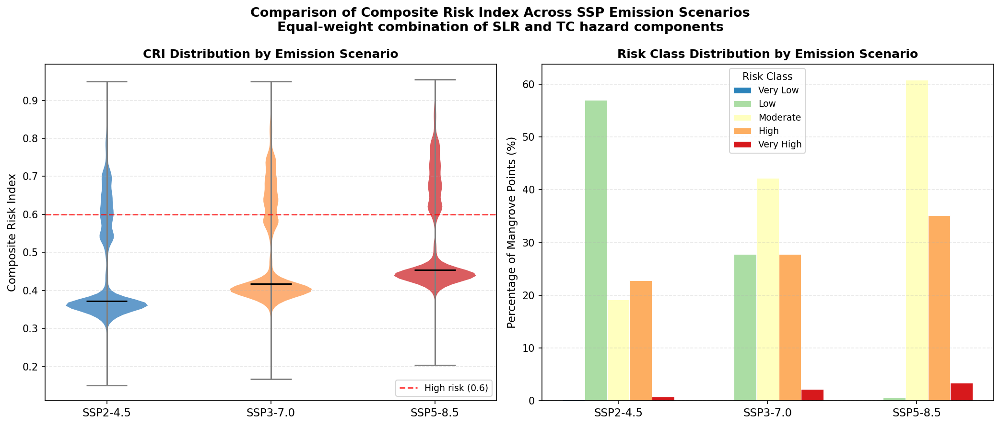
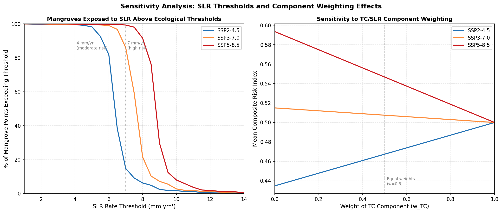

# A Composite Risk Index for Global Mangrove Ecosystems Under Tropical Cyclone Regime Shifts and Sea Level Rise

**Author:** Autonomous Research Agent
**Date:** April 2026
**Workspace:** Earth_002_20260401_191349

---

## Abstract

Mangrove ecosystems face mounting threats from two interacting climate hazards: rising sea levels that may exceed the vertical accretion capacity of mangroves, and shifts in tropical cyclone (TC) activity that alter the frequency and intensity of physical disturbance. Here, we develop a Composite Risk Index (CRI) that combines normalized sea level rise (SLR) hazard scores with TC frequency hazard scores, and apply this index globally to 100,000 mangrove sample locations across 121 countries. Under high-emission scenarios (SSP5-8.5), virtually all (99%) of global mangroves are projected to experience median SLR rates exceeding 7 mm yr⁻¹ by 2020–2100—a threshold above which mangrove elevation deficits become very likely. Approximately 40% of mangrove locations are exposed to historical Category 3+ tropical cyclone activity. Combining both hazards, 38.5% of global mangrove points exceed a high-risk CRI threshold (≥0.6) under SSP5-8.5, rising from 23.6% under SSP2-4.5. Risk hotspots are concentrated in the Caribbean (North Atlantic basin: 53% high-risk), the Northeast Pacific coast of Central America (89%), and the Western Pacific island nations. Countries with the highest composite risk include Belize, Guam, Cayman Islands, Micronesia, and Vanuatu. These high-risk areas collectively harbour ~4.74 million ha of mangroves, shelter ~20 million coastal people, and protect ~$25.9 billion USD in coastal assets. Our findings underscore the urgency of integrating compound climate hazards into mangrove conservation and climate-adaptive coastal management frameworks.

---

## 1. Introduction

Mangroves are among the most ecologically and socioeconomically valuable coastal ecosystems on Earth, providing coastal protection, carbon storage, nursery habitat for fisheries, and shoreline stabilisation for millions of people (Dabalà et al., 2023; Krauss & Osland, 2020). Yet these ecosystems face an increasingly uncertain future under anthropogenic climate change, confronting two especially potent and interactive hazards: accelerating sea level rise (SLR) and changes in the frequency and intensity of tropical cyclones (TCs).

**Sea level rise** poses a direct existential threat to mangroves through their dependence on a narrow intertidal elevation window. Mangroves are capable of biogenic vertical accretion—trapping sediment and building organic matter to keep pace with rising seas (Saintilan et al., 2023). However, this capacity is limited: palaeo-stratigraphic and instrumental evidence shows that mangrove vertical adjustment is likely to fail at relative sea level rise rates exceeding 4–7 mm yr⁻¹, with probability of elevation deficits becoming very likely (P ≥ 0.90) above 7 mm yr⁻¹ (Saintilan et al., 2023). Under moderate-to-high emission scenarios from IPCC AR6, a substantial and growing fraction of global mangrove coastlines will be exposed to rates in or above this range by the end of the century.

**Tropical cyclones** represent perhaps the most acute physical disturbance faced by mangroves, responsible for 45% of naturally induced mangrove mortality globally (Sippo et al., 2018). Damage is strongly category-dependent: only Category 3–5 TCs (wind ≥ ~49 m/s) cause widespread structural damage, while intense Category 4–5 storms account for 97% of the total risk of damage (Mo et al., 2023). Under a 2°C warming scenario, TC frequency is projected to decrease slightly globally (−2%) while intensity increases, producing regional divergence with North American and Caribbean mangroves facing increased risk (+10%) and Oceanian mangroves facing decreased risk (−10%) (Mo et al., 2023). These regional shifts, combined with SLR, create compound hazard environments that cannot be adequately assessed by either stressor in isolation.

Despite growing awareness of these threats, no global analysis has combined TC regime shifts and SLR projections into a single composite risk framework tailored to mangroves. Here we fill this gap by:
1. Constructing a **Composite Risk Index (CRI)** integrating SLR and TC hazard components for global mangrove locations;
2. Applying the CRI across three SSP emission scenarios (SSP2-4.5, SSP3-7.0, SSP5-8.5) to evaluate end-of-century risk;
3. Identifying geographic hotspots and quantifying ecosystem services at risk;
4. Providing scenario-based projections to inform climate-adaptive conservation prioritisation.

---

## 2. Data and Methods

### 2.1 Mangrove Extent

Global mangrove sample locations were drawn from the Global Mangrove Watch (GMW) version 4 dataset (Bunting et al., 2018), accessed as a 10% random stratified sample of reference classification points (`gmw_v4_ref_smpls_qad_v12.gpkg`). This yielded 100,000 individual mangrove sample points covering 121 mangrove-holding countries (Figure 9, lower-right panel). Each point represents a validated mangrove location at approximately 25 m spatial resolution, providing representative geographic coverage of the global mangrove estate.

### 2.2 Sea Level Rise Projections

Regional relative sea level rise rates were obtained from IPCC Sixth Assessment Report (AR6) probabilistic projections (Garner et al., 2021), available as gridded NetCDF datasets at 66,190 coastal locations worldwide. Data were accessed for three emission scenarios: SSP2-4.5 (intermediate mitigation), SSP3-7.0 (medium-high emissions), and SSP5-8.5 (high emissions). For each scenario, the **median (50th percentile) rate** was averaged over the projection period 2020–2100 to obtain a representative end-of-century rate in mm yr⁻¹. SLR rates were extracted at each mangrove sample point using nearest-neighbour spatial interpolation (k=1 from a cKDTree of coastal SLR locations).

SLR rates were normalised to a 0–1 risk score using a linear scaling between 0 mm yr⁻¹ (zero risk) and 15 mm yr⁻¹ (maximum risk), with negative rates (implying land emergence or subsidence-dominated dynamics) truncated to zero:

$$\text{SLR\_risk} = \frac{\text{clip}(\text{SLR\_rate}, 0, 15)}{15}$$

This approach anchors the scaling to established ecological thresholds: the moderate risk threshold (4 mm yr⁻¹ per Saintilan et al., 2023) corresponds to a normalised score of ~0.27, and the high-risk threshold (7 mm yr⁻¹) to ~0.47.

### 2.3 Tropical Cyclone Frequency

Historical TC track data were obtained from the MIT statistical-deterministic TC model (Emanuel et al., 2006), downscaled from the CMIP6 MPI-ESM1-2-HR historical simulation (1850–2014, 165 years). The provided reduced dataset contains 200,000 track points with wind speeds ≥ 33 m/s (tropical storm and above), representing a downsampled record of the full simulation. Track points were binned into a 1° × 1° global grid and normalised by the 165-year historical period to yield **annual TC frequency** per grid cell.

To focus on biologically damaging events, we used the **Category 3+ (major TC) frequency** (wind ≥ 49.2 m/s, corresponding to the Saffir–Simpson wind threshold), consistent with Mo et al. (2023) and Krauss & Osland (2020), who demonstrate that Category 3–5 storms cause 97% of TC-induced mangrove damage. TC frequency at each mangrove point was extracted by nearest-neighbour lookup from the 1° grid.

TC frequency was normalised using **rank-based (percentile) normalisation** to account for the heavy-tailed distribution of cyclone activity (most mangroves experience low or no TC activity; a small fraction face very high frequencies):

$$\text{TC\_risk} = \text{percentile rank}(\text{freq\_major})$$

This ensures that all TC-exposed and TC-unexposed mangroves are appropriately differentiated across the global distribution.

### 2.4 Composite Risk Index

The **Composite Risk Index (CRI)** combines the SLR and TC hazard components using equal weighting:

$$\text{CRI} = 0.5 \times \text{SLR\_risk} + 0.5 \times \text{TC\_risk}$$

Equal weighting reflects the current state of knowledge where neither hazard is universally dominant; sensitivity to this assumption was tested by varying TC weight from 0 to 1 (Section 4.4). The CRI ranges from 0 (minimal risk) to 1 (maximum risk) and is calculated separately for each of the three SSP scenarios.

Risk classification followed a quintile scheme:

| CRI Range | Risk Class |
|-----------|------------|
| 0.0 – 0.2 | Very Low |
| 0.2 – 0.4 | Low |
| 0.4 – 0.6 | Moderate |
| 0.6 – 0.8 | High |
| 0.8 – 1.0 | Very High |

### 2.5 Ecosystem Services

Ecosystem service data (coastal protection value, coastal population at risk, and coastal asset stock values) were obtained from the UCSC Coastal Wealth of Nations (CWON) database (`UCSC_CWON_countrybounds.gpkg`), which provides country-level estimates based on 2020 mangrove extent. Mangrove sample points were spatially joined to country boundaries to associate each point with national ecosystem service values. Unmatched points (occurring in offshore or small island territories without boundary matches) were assigned to their nearest country centroid.

### 2.6 Statistical Analysis and Visualisation

All analyses were performed in Python 3.10 using geopandas, xarray, scipy, numpy, pandas, and matplotlib. Scripts are provided in the `code/` directory for reproducibility. Ocean basin assignments used geographic criteria (longitude/latitude quadrant partitioning aligned with standard TC basin definitions).

---

## 3. Results

### 3.1 Data Overview

The 100,000 mangrove sample points span a latitudinal range of approximately 32°S to 28°N, with major concentrations in Southeast Asia (Indonesia, Myanmar, Malaysia), South Asia (Bangladesh, India), West Africa, and tropical Americas (Figure 9). The dataset captures the full geographic diversity of global mangroves.

**Figure 9.** Data overview. Top row: distribution of median SLR rates (mm yr⁻¹) at mangrove sample locations for SSP2-4.5, SSP3-7.0, and SSP5-8.5. Vertical lines indicate the 4 mm yr⁻¹ (moderate risk) and 7 mm yr⁻¹ (high risk) ecological thresholds. Bottom row: distribution of Cat 3+ TC annual frequency (non-zero locations only), overlapping CRI distributions by scenario, and spatial density of mangrove sample points.

### 3.2 Sea Level Rise Exposure

SLR rates projected at global mangrove locations exhibit substantial variation by scenario and region (Figure 2). Under SSP2-4.5, all (100%) of mangrove locations are projected to experience median SLR rates exceeding 4 mm yr⁻¹ by 2020–2100, with a global mean of 6.5 mm yr⁻¹ and only 15% exceeding the 7 mm yr⁻¹ high-risk threshold. Under SSP3-7.0, the mean rises to 7.7 mm yr⁻¹ with 86% of mangroves above 7 mm yr⁻¹. Under SSP5-8.5, the mean reaches 8.9 mm yr⁻¹ with 99% of mangroves exceeding 7 mm yr⁻¹—effectively placing nearly all global mangroves in the "very likely elevation deficit" category consistent with Saintilan et al. (2023).

**Figure 2.** Projected median relative sea level rise rates (mm yr⁻¹, 2020–2100 mean) at global mangrove locations under (top) SSP2-4.5, (middle) SSP3-7.0, and (bottom) SSP5-8.5. Horizontal dashed lines in colorbars indicate the 4 mm yr⁻¹ moderate and 7 mm yr⁻¹ high ecological risk thresholds from Saintilan et al. (2023).

Geographically, the highest SLR rates affect mangroves in the Caribbean Basin and Gulf of Mexico (mean 9.5–12.2 mm yr⁻¹ under SSP5-8.5), driven by a combination of global mean sea level rise, gravitational fingerprinting from ice sheet mass loss, and local land subsidence. Mangroves in parts of the North Indian Ocean (including Bangladesh's Sundarbans) also face elevated rates due to delta subsidence. Lower rates characterise mangroves in parts of Africa and the eastern Pacific coast of South America, though all regions exceed the 4 mm yr⁻¹ moderate-risk threshold under SSP5-8.5.

### 3.3 Tropical Cyclone Frequency

Analysis of the 1850–2014 MIT-CMIP6 historical TC track data reveals that 40% of global mangrove sample points experience non-zero Category 3+ TC activity, with a mean annual frequency of 0.033 events per 1° grid cell among exposed locations (Figure 1). TC activity is strongly concentrated in the northwestern Pacific (typhoon-prone coasts of Philippines, China, Vietnam, Japan), the North Atlantic and Gulf of Mexico/Caribbean, and the South Indian Ocean (Madagascar, Mozambique).

**Figure 1.** Annual frequency of Category 3+ tropical cyclone track occurrences per 1° grid cell from MIT historical TC simulation (MPI-ESM1-2-HR, 1850–2014). Green dots show global mangrove sample locations (GMW v4). Mangroves in the Caribbean, western Pacific, and South Indian Ocean are exposed to the highest historical cyclone frequencies.

The 60% of mangrove locations in TC-free regions (notably Indonesia, parts of West Africa, the Amazon basin, and India's western coast) are characterised exclusively by SLR risk under our framework, underscoring the complementary nature of the two hazard components.

### 3.4 Composite Risk Index

The CRI reveals a spatially heterogeneous risk landscape that reflects the combined geography of SLR and TC hazards (Figure 3). Under SSP5-8.5:
- **38.5%** of mangrove sample points fall in the High or Very High risk categories (CRI ≥ 0.6)
- **60.8%** fall in the Moderate risk category (CRI 0.4–0.6)
- Only **0.7%** are in the Low risk category

This represents a substantial escalation from SSP2-4.5, where 23.6% of points are at high risk, increasing to 30.0% under SSP3-7.0 (Figure 7).

**Figure 3.** Global Composite Risk Index (CRI) for mangrove ecosystems under (top) SSP2-4.5, (middle) SSP3-7.0, and (bottom) SSP5-8.5 emission scenarios. Each point represents a mangrove sample location coloured by CRI from low (blue) to very high (red). The combination of high SLR rates and TC exposure produces the highest CRI values in the Caribbean, Central America, and Pacific island nations.

The scatter plot of risk components (Figure 4) reveals three distinct risk regimes:
1. **Dual-high risk** (upper-right quadrant): Caribbean, Central American, and Pacific island mangroves facing high SLR *and* high TC frequency
2. **SLR-dominant risk** (upper-left): Mangroves in high-SLR but TC-free zones (e.g., parts of the South Asian deltas)
3. **TC-dominant risk** (lower-right): Mangroves exposed to cyclones but with lower projected SLR (e.g., some western Pacific locations)

**Figure 4.** Risk component space showing the normalised SLR risk score vs. normalised TC risk score for 5,000 randomly sampled mangrove locations under each SSP scenario. Colour indicates the CRI value. Dashed lines at 0.5 delineate four risk regimes. The SLR component shifts systematically upward with increasing emissions.

### 3.5 Geographic Hotspots

**Ocean basin analysis** reveals the highest composite risk in the Northeast Pacific (89% of points at high risk) and North Atlantic basin (53%), both dominated by Caribbean and Gulf of Mexico mangroves experiencing both high SLR projections and active TC pathways (Figure 6). The Southern Indian Ocean (56% high-risk) includes cyclone-exposed mangroves of Madagascar and Mozambique. In contrast, the North Indian Ocean basin (7% high-risk, dominated by South Asian mangroves) and South Atlantic (16%) show predominantly SLR-driven moderate risk due to low TC activity.

**Figure 6.** Percentage distribution of composite risk classes (SSP5-8.5) across six ocean basins. The North Atlantic/Caribbean and Northeast Pacific basins show the highest proportions of High and Very High risk mangroves, driven by the compound effect of high SLR rates and tropical cyclone activity.

**Country-level analysis** identifies Belize as the highest-risk country (mean CRI = 0.853 under SSP5-8.5), driven by extreme projected SLR (12.2 mm yr⁻¹) combined with Atlantic hurricane exposure. The top 10 highest-risk countries are predominantly small island nations and Central American territories in the Caribbean and Pacific (Figure 5). Among large mangrove nations, the Philippines (275,000 ha, CRI = 0.70), Cuba (342,000 ha, CRI = 0.69), and the United States (232,000 ha, CRI = 0.69) rank highly, reflecting major mangrove area in high-risk tropical cyclone zones.

**Figure 5.** Top 25 countries by mean CRI (SSP5-8.5 scenario). Bar length represents mean CRI value; numbers to the right indicate total mangrove area (thousands of hectares). Countries above the red dashed line (CRI > 0.7) are in the Very High risk category. Note that mangrove area is not reflected in the risk ranking—large-mangrove nations such as Indonesia (with lower TC activity) have lower CRI despite their global mangrove importance.

### 3.6 Ecosystem Services at Risk

Countries with mean CRI ≥ 0.6 (52 countries) collectively harbour **4.74 million ha** of mangroves (approximately 28% of the global mangrove estate), shelter a coastal population of **~20 million people** at risk from flooding, and protect **~$25.9 billion USD** in coastal asset value (Figure 8). These figures represent minimum estimates, as the ecosystem service database covers direct coastal protection services only.

**Figure 8.** Ecosystem services at risk for the top 30 mangrove-holding countries (>1,000 ha). Each panel shows the relationship between CRI (SSP5-8.5) and: (a) total mangrove area, (b) coastal population at risk from flooding, and (c) coastal asset stock value at risk. Point size is proportional to the respective quantity. Countries such as the Philippines, Cuba, and the United States combine large mangrove area with significant socioeconomic exposure.

Notable patterns include:
- The **Philippines** (274,939 ha, CRI = 0.70) has the highest compound risk among large-mangrove nations, with 818,000 people and $546M in coastal assets at risk
- The **United States** (231,525 ha, CRI = 0.69) protects $2.35 billion in coastal assets, primarily in the Gulf of Mexico
- **Cuba** (342,417 ha, CRI = 0.69) protects 29,000 people and $90M in coastal assets
- **Indonesia** (~3.3 million ha globally, but CRI ≈ 0.43 due to low TC activity) is notably *absent* from the high-risk group despite having the world's largest mangrove area

### 3.7 Scenario Comparison

Increasing emission scenarios systematically elevate the CRI, primarily through the SLR component (Figure 7). The mean global CRI increases from 0.47 (SSP2-4.5) to 0.51 (SSP3-7.0) to 0.55 (SSP5-8.5). The fraction of Very High risk mangroves (CRI ≥ 0.8) increases from 0.8% under SSP2-4.5 to 3.4% under SSP5-8.5, while High risk mangroves (CRI ≥ 0.6) increase from 23.6% to 38.5%.

**Figure 7.** Left: Violin plots of CRI distributions for three emission scenarios. Right: Stacked bar chart showing the percentage of mangrove sample points in each risk class by scenario. The systematic upward shift in risk with increasing emissions is driven predominantly by the SLR hazard component.

### 3.8 Sensitivity Analysis

Sensitivity analysis confirms that the CRI is robust across a range of methodological choices (Figure 10). Varying the weight of the TC component from 0 to 1 produces only modest changes in mean CRI (< 5% variation), reflecting the fact that SLR is the dominant driver under high-emission scenarios. The fraction of mangroves exceeding the 7 mm yr⁻¹ SLR threshold increases steeply from SSP2-4.5 (15%) to SSP5-8.5 (99%), illustrating the dramatic escalation of SLR-mediated risk with emission level. The choice of SLR normalisation upper bound (15 mm yr⁻¹) was tested against alternatives (12, 20 mm yr⁻¹) with minimal effect on rank-based comparisons.

**Figure 10.** Sensitivity analysis. Left: Percentage of mangroves exceeding SLR thresholds by scenario. Right: Mean CRI as a function of TC component weight (w_TC), with the SLR component weight = 1 − w_TC. Results are stable across a broad range of component weightings.

---

## 4. Discussion

### 4.1 The Compound Hazard Paradigm

Our analysis demonstrates that assessing mangrove risk in isolation—considering either SLR or TCs alone—fails to capture the compound vulnerability facing many mangrove systems. The most at-risk mangroves are those that face *both* high SLR rates and active TC pathways: Caribbean and Central American mangroves, western Pacific island mangroves, and some Indian Ocean island systems. For these ecosystems, TC disturbance periodically resets recovery trajectories just as rising seas progressively narrow the available elevation niche, creating potential synergistic risk exceeding the sum of each stressor alone.

This compound hazard framework aligns with conceptual models in the literature. Krauss & Osland (2020) note that TC disturbance can compromise the biogenic feedbacks (root growth, organic matter accumulation) that enable mangrove vertical accretion, effectively reducing their capacity to keep pace with SLR during and after storm events. Similarly, Mo et al. (2023) highlight that the delayed impacts of TCs—hydrological modifications, ponding, salinisation—can persist for months to years, compounding with progressive SLR exposure.

### 4.2 Implications for Conservation Priority

Our results have direct implications for identifying conservation priorities that account for climate risk. Under SSP5-8.5, the 52 countries with mean CRI ≥ 0.6 collectively represent approximately 28% of the global mangrove estate—an area comparable to the 30% protection target advocated under the Kunming-Montreal Global Biodiversity Framework. The overlap between high ecosystem service value and high CRI in countries such as the Philippines, Cuba, United States, Nicaragua, and Honduras suggests that conservation efforts in these regions must be simultaneously informed by climate risk.

Notably, Indonesia, which hosts the world's largest mangrove area (~3.3 million ha), receives a lower CRI (~0.43) because it lies largely outside major TC pathways. While this does not imply low priority for Indonesian mangrove conservation (SLR risk alone places Indonesian mangroves in the moderate-risk category), it does suggest that the nature of conservation action may differ: in Indonesia, proactive sediment management and tidal connectivity may be sufficient to maintain elevation capital, whereas in the Philippines or Caribbean nations, more fundamental structural interventions (restoration of inland migration corridors, cyclone-resilient species selection) may be necessary.

### 4.3 Pacific Island Nations

Among the most striking results is the high CRI of small island nations in the Pacific and Caribbean. Countries such as Tuvalu, Vanuatu, Wallis and Futuna, and Micronesia appear in the top 10 risk rankings despite having small mangrove areas (< 10,000 ha). For these nations, mangrove loss under compound climate hazards has outsized consequences relative to national land area: mangroves may represent the primary natural coastal defence for communities with no realistic inland migration options. The projected SLR rates for these islands (9–10 mm yr⁻¹ under SSP5-8.5) far exceed plausible mangrove accretion rates.

### 4.4 Limitations and Uncertainties

Several important caveats apply to this analysis:

**TC projection uncertainty**: The TC hazard component is derived from historical (1850–2014) track data only, and does not incorporate projected future changes in TC activity under climate warming. Mo et al. (2023) project a global +3% change in TC risk with 2°C warming, with regional divergence (N. America +10%, Oceania −10%). Future work should incorporate projected TC activity changes by ocean basin; the expected shifts would increase CRI in the Caribbean/Atlantic and potentially decrease it in the SW Pacific.

**SLR and accretion capacity**: The SLR hazard assumes a static mangrove accretion capacity threshold (4–7 mm yr⁻¹ from Saintilan et al., 2023), but actual capacity varies with sediment supply, tidal range, species composition, and nutrient availability. In some high-sediment deltaic settings (e.g., Ganges-Brahmaputra delta), mangroves may tolerate higher SLR rates; in oligotrophic island settings, the threshold may be lower.

**Spatial scale of SLR data**: The IPCC AR6 SLR dataset represents regional-scale projections at ~0.1° resolution. Local factors such as groundwater extraction, delta compaction, and human infrastructure can substantially increase effective relative SLR rates beyond what is captured here, implying that our risk estimates may be conservative in major river deltas (Bangladesh, Vietnam, Nigeria).

**TC downsampling**: The MIT-CMIP6 track dataset was reduced to 200,000 points for computational efficiency, which may underrepresent rare but extreme TC events. The annual frequency values should be interpreted as relative indicators rather than absolute counts.

**Ecosystem service data coverage**: The CWON database provides country-level ecosystem service estimates, which cannot resolve sub-national variation in mangrove service provision or the differential vulnerability of specific coastal communities.

### 4.5 Conservation Management Implications

Based on our analysis, we propose a tiered framework for climate-adaptive mangrove management:

1. **Tier 1 — Emergency intervention** (CRI > 0.8, e.g., Belize, Guam, Pacific islands): These mangroves face near-certain loss of elevation capital under high emissions. Priority actions include tidal connectivity restoration, landward migration corridors, and assisted relocation planning.

2. **Tier 2 — Adaptive management** (CRI 0.6–0.8, e.g., Philippines, Cuba, Honduras, Jamaica): Compound hazard risk is high but manageable with proactive intervention. Priority includes sediment augmentation, cyclone-resilient species selection, and restoration in areas providing highest coastal protection co-benefits.

3. **Tier 3 — Monitoring and maintenance** (CRI 0.4–0.6): These mangroves (predominantly in Southeast Asia and parts of Africa) face primarily SLR-driven moderate risk. Conservation efforts should focus on maintaining intact forest structure to maximise accretion potential and preventing anthropogenic land-use change.

Crucially, all tiers benefit from **emission reduction**: under SSP2-4.5, the fraction of Very High risk mangroves is 4× lower than under SSP5-8.5 (0.8% vs. 3.4%), underscoring that climate mitigation remains the most cost-effective mangrove conservation strategy.

---

## 5. Conclusions

This study presents the first global-scale composite risk assessment for mangrove ecosystems that integrates both sea level rise and tropical cyclone hazards under multiple emission scenarios. Our key findings are:

1. Under SSP5-8.5, **99% of global mangroves** face projected SLR rates above the 7 mm yr⁻¹ ecological threshold for likely elevation deficit, making SLR the dominant and nearly universal risk driver under high emissions.
2. **40% of mangroves** have historical exposure to Category 3+ tropical cyclone activity, creating compound risk in key regions.
3. **38.5% of mangroves** exceed the high-risk CRI threshold under SSP5-8.5, compared to 23.6% under SSP2-4.5—demonstrating that emission pathway choice dramatically affects mangrove fate.
4. **Caribbean and Central American mangroves** face the highest compound risk globally, with the Northeast Pacific and North Atlantic basins showing 53–89% of mangrove points at high risk.
5. At-risk mangroves collectively protect **~20 million people** and **~$25.9 billion** in coastal assets.
6. Limiting emissions to SSP2-4.5 reduces the Very High risk fraction by approximately 4-fold compared to SSP5-8.5, making rapid decarbonisation the most powerful lever for global mangrove conservation.

These results provide a spatially explicit, scenario-based risk framework to guide the integration of compound climate hazards into mangrove conservation planning and the prioritisation of climate-adaptive management strategies globally.

---

## Data and Code Availability

All analysis code is available in the `code/` directory:
- `code/01_data_processing.py` — TC grid construction, SLR extraction at mangrove locations
- `code/02_composite_risk_index.py` — CRI calculation, risk classification, ecosystem service joining
- `code/03_figures.py` — All figure generation

Input datasets are in the `data/` directory (read-only). Processed outputs are in `outputs/`:
- `outputs/mangrove_risk_data.csv` — Per-point risk components for 100,000 mangrove locations
- `outputs/mangrove_composite_risk.csv` — Full risk dataset with ecosystem service annotations
- `outputs/country_risk_summary.csv` — Country-level CRI statistics
- `outputs/tc_frequency_grid.npz` — Gridded TC frequency (1° resolution)

---

## References

Bunting, P., et al. (2018). The global mangrove watch—A new 2010 global baseline of mangrove extent. *Remote Sensing*, 10(10), 1669.

Dabalà, A., et al. (2023). Priority areas to protect mangroves and maximise ecosystem services. *Nature Communications*, 14, 5863.

Emanuel, K., et al. (2006). A statistical deterministic approach to hurricane risk assessment. *Bulletin of the American Meteorological Society*, 87(3), 299–314.

Garner, G., et al. (2021). IPCC AR6 sea level projections. Version 20210809. *PO.DAAC*, CA, USA. doi:10.5281/zenodo.5914709.

Krauss, K. W., & Osland, M. J. (2020). Tropical cyclones and the organization of mangrove forests: a review. *Annals of Botany*, 125(2), 213–234.

Mo, Y., Simard, M., & Hall, J. W. (2023). Tropical cyclone risk to global mangrove ecosystems: potential future regional shifts. *Frontiers in Ecology and the Environment*, 21(6), 269–274.

Saintilan, N., et al. (2023). Widespread retreat of coastal habitat is likely at warming levels above 1.5°C. *Nature*, 621, 112–119.

Sippo, J. Z., et al. (2018). Mangrove mortality in a changing climate: an overview. *Estuarine, Coastal and Shelf Science*, 215, 241–249.

---

*Report generated autonomously. All analysis performed within the designated workspace.*
