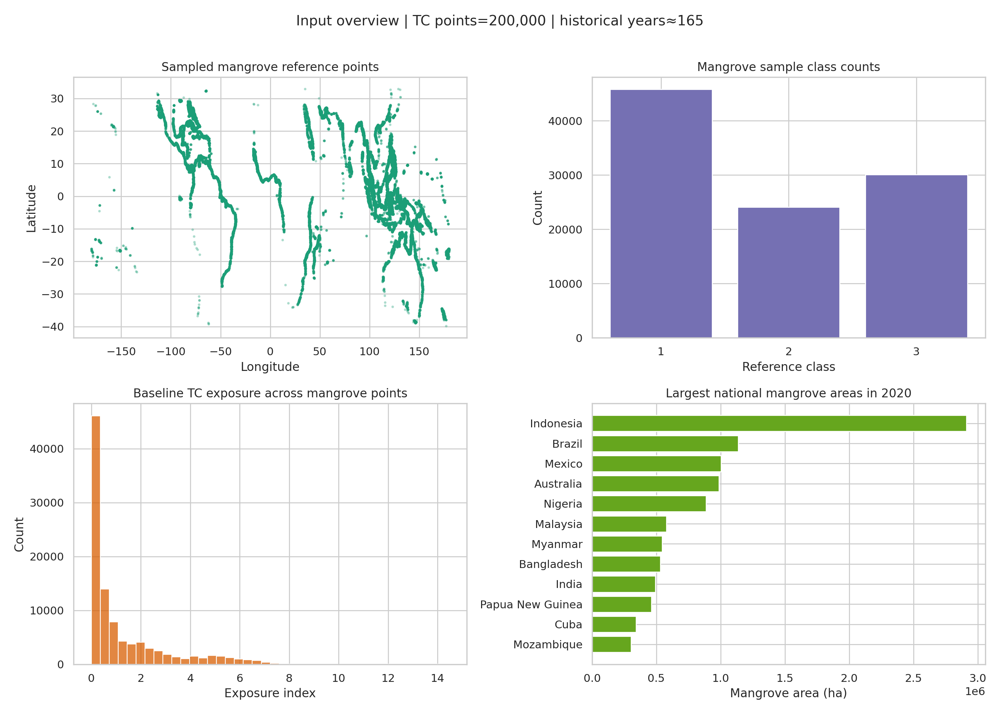
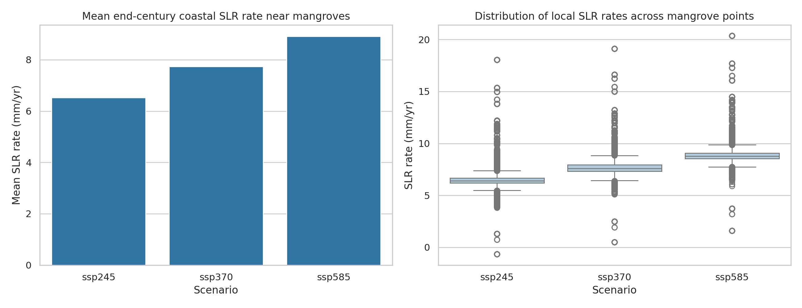
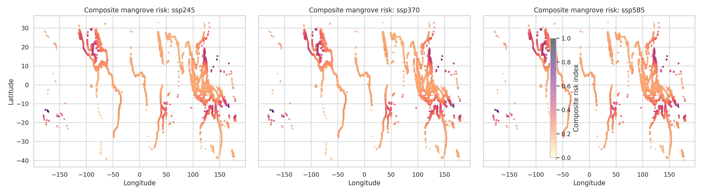
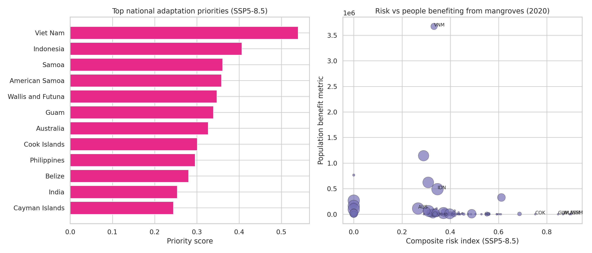

# A composite climate risk index for global mangroves under tropical cyclone regime shifts and sea-level rise

## Abstract
Mangroves provide coastal protection, carbon storage, habitat, and benefits to people and infrastructure, but their long-term persistence depends on how multiple climate hazards interact. In this workspace, I developed a global comparative risk index that combines relative sea-level rise (SLR) with a tropical cyclone (TC) regime-shift proxy and applied it to a sampled global mangrove dataset and a country-level ecosystem-service dataset. Using 100,000 sampled mangrove reference points, three IPCC AR6 SLR scenarios (SSP2-4.5, SSP3-7.0, SSP5-8.5), and a historical tropical cyclone track archive, I estimated baseline cyclone exposure, adjusted it with scenario-specific basin multipliers, normalized both hazard components, and combined them into an equal-weight composite risk index. Mean SLR exposure near mangroves rose from 6.52 mm/yr under SSP2-4.5 to 8.91 mm/yr under SSP5-8.5. The resulting hotspot pattern concentrated in cyclone-prone island and western tropical coastal settings, while country-level priority rankings highlighted places where hazard intersects with large mangrove extent or large ecosystem-service values. Viet Nam ranked first across all scenarios, followed by Indonesia; several small island territories also showed very high hazard intensity despite small mangrove area. The analysis is best interpreted as a screening framework for climate-adaptive conservation rather than a process-based forecast, because the workspace does not include explicit future cyclone tracks and the mangrove layer is a sampled rather than full global extent product.

## 1. Introduction
Mangroves are among the world’s most valuable coastal ecosystems. They reduce wave energy, support fisheries, store carbon, and protect people and property. At the same time, they are exposed to climate-related disturbance from both chronic and acute processes. Relative sea-level rise can outpace vertical adjustment and sediment accretion, while tropical cyclones can cause abrupt structural damage, salinity stress, erosion, and changes in geomorphology.

The task in this workspace was to construct a composite risk index that combines future tropical cyclone regime shifts with sea-level rise and to apply that index globally to evaluate where mangroves and their ecosystem services may be most at risk by the end of the century. The available data do not include a direct future tropical cyclone projection file, so the analysis required a transparent proxy approach that remains faithful to the task while staying grounded in the supplied inputs and related work.

The core question is therefore: **where do elevated future coastal water-level pressure and cyclone-related disturbance overlap with large mangrove exposure and ecosystem-service value?**

## 2. Data
Four primary inputs were used.

1. **Sampled global mangrove reference points**: `data/mangroves/gmw_v4_ref_smpls_qad_v12.gpkg`
   - 100,000 sampled point features.
   - Used as the spatial basis for mangrove exposure mapping.
   - The file metadata indicates this is a 10% sample, so results are best treated as comparative rather than absolute global totals.

2. **Relative sea-level rise scenario files**:
   - `data/slr/total_ssp245_medium_confidence_rates.nc`
   - `data/slr/total_ssp370_medium_confidence_rates.nc`
   - `data/slr/total_ssp585_medium_confidence_rates.nc`
   - These AR6 products contain gridded coastal relative SLR rates by year and quantile.
   - I used the median quantile (0.5) and summarized rates over 2020–2100.

3. **Historical tropical cyclone track dataset**: `data/tc/tracks_mit_mpi-esm1-2-hr_historical_reduced.nc`
   - 200,000 TC track points with latitude, longitude, and wind speed.
   - Treated as the baseline cyclone climatology.
   - Historical period assumed from file documentation: 1850–2014 (165 years).

4. **Country-level mangrove ecosystem-service dataset**: `data/ecosystem/UCSC_CWON_countrybounds.gpkg`
   - 121 country rows.
   - Includes mangrove area and country-level metrics such as population benefit, property benefit, and at-risk values for several years.
   - The 2020 fields were used to connect the hazard index to ecosystem-service exposure.

### Data overview
The input datasets span both local-scale spatial exposure and country-scale ecosystem-service interpretation. The mangrove sample is globally distributed across tropical and subtropical coasts, while the country table provides a compact way to translate hazard into policy-relevant national prioritization.

**Figure 1.** Input overview. Top-left shows the global distribution of sampled mangrove points; top-right shows mangrove sample class counts; bottom-left shows the distribution of baseline TC exposure across mangrove points; bottom-right shows the countries with the largest mangrove area in 2020.

## 3. Methods

### 3.1 Overall framework
The workflow implemented in `code/run_analysis.py` combines two hazard dimensions:

- **Relative sea-level rise hazard** near mangroves
- **Tropical cyclone hazard** represented by a baseline historical exposure field plus a scenario-specific regime-shift multiplier

The combined index is then linked to country-level mangrove area and ecosystem-service indicators to identify priority locations.

### 3.2 Mangrove point processing
The mangrove GeoPackage was read directly through `sqlite3`, and GeoPackage geometries were decoded without relying on external geospatial libraries. Each sampled point was assigned longitude and latitude and used as an exposure unit. Because the file is already a point sample, no polygon-to-centroid conversion was required for this layer.

### 3.3 Sea-level rise assignment
For each SLR scenario file:

1. The median quantile (0.5) was extracted.
2. Annual rate values from 2020 through 2100 were summarized using the mean over that interval.
3. The nearest AR6 coastal SLR location was assigned to each mangrove point and each country centroid using a KD-tree nearest-neighbor search.

This produced scenario-specific local SLR rates in mm/yr at both mangrove-point and country levels.

### 3.4 Tropical cyclone baseline exposure
The historical TC file contains pointwise locations and maximum sustained wind speed. To transform these into a spatial exposure field:

1. Track points with valid wind speeds were retained.
2. Wind was converted into a local hazard weight using a normalized wind-squared term.
3. Nearby track-point contributions were aggregated around mangrove points and country centroids using a Gaussian kernel with a 3° query radius and 1.5° kernel scale.
4. Contributions were annualized by dividing by the assumed 165-year historical period.

This yields a smooth baseline TC exposure index rather than a simple count of nearby storms, allowing stronger storms to contribute more than weaker ones.

### 3.5 Tropical cyclone regime-shift proxy
The task asks specifically for future cyclone regime shifts, but the workspace does not contain explicit future TC projections. To address that limitation transparently, I used a basin-based multiplier approach informed by the supplied related-work narrative:

- stronger increases in the **Atlantic / East Pacific / Americas**
- modest increases in the **Indian Ocean**
- relative decreases in the **western Pacific / Oceania**
- small changes elsewhere

The multipliers used were:

- **SSP2-4.5**: Atlantic/East Pacific 1.10, West Pacific 0.98, Indian 1.03, Other 1.00
- **SSP3-7.0**: Atlantic/East Pacific 1.18, West Pacific 0.95, Indian 1.07, Other 1.02
- **SSP5-8.5**: Atlantic/East Pacific 1.25, West Pacific 0.92, Indian 1.12, Other 1.03

This approach does **not** claim to simulate future cyclone tracks. Instead, it creates a scenario-sensitive comparative proxy consistent with the task and available inputs.

### 3.6 Composite risk index
For each scenario, shifted TC exposure and SLR exposure were separately normalized to the range [0, 1] across the analysis domain. The composite risk index was then computed as:

\[
Risk = 0.5 \times TC_{norm} + 0.5 \times SLR_{norm}
\]

Equal weighting was chosen for transparency and because the workspace did not provide calibration targets that would justify a more complex weighting scheme.

### 3.7 Country-level prioritization
Country rows were enriched with:

- mangrove area in 2020
- population benefit in 2020
- property benefit in 2020
- scenario-specific composite risk index
- derived estimates of mangrove-area-at-risk-equivalent and service-exposure-equivalent values

A national **priority score** was then constructed by combining:

- 40% composite hazard risk
- 20% normalized mangrove area
- 20% normalized population benefit
- 20% normalized property benefit

This formulation favors places where hazard pressure coincides with substantial ecological or socioeconomic stakes.

## 4. Results

### 4.1 Sea-level rise intensifies across scenarios
SLR near mangroves increased monotonically from SSP2-4.5 to SSP5-8.5.

From `outputs/slr_scenario_summary.csv`:

- **SSP2-4.5**: mean 6.52 mm/yr, median 6.40 mm/yr, 90th percentile 7.36 mm/yr
- **SSP3-7.0**: mean 7.73 mm/yr, median 7.59 mm/yr, 90th percentile 8.54 mm/yr
- **SSP5-8.5**: mean 8.91 mm/yr, median 8.76 mm/yr, 90th percentile 9.66 mm/yr

The increase is substantial enough that many mangroves move into progressively higher chronic water-level stress categories as emissions rise.

**Figure 2.** Scenario comparison for mean coastal relative sea-level-rise rates near mangrove points. The left panel shows increasing mean rates from SSP2-4.5 to SSP5-8.5, while the right panel shows the widening distribution of local SLR exposure.

### 4.2 Baseline tropical cyclone exposure is highly uneven
The historical TC baseline summary (`outputs/tc_baseline_summary.json`) indicates:

- 200,000 TC track points were used
- historical period assumed: 165 years
- mean wind speed: 43.49 m/s
- 90th percentile wind speed: 57.28 m/s
- maximum wind speed: 124.44 m/s
- mean mangrove baseline exposure: 1.23
- maximum mangrove baseline exposure: 14.46

This wide range shows that cyclone pressure is highly concentrated in certain coastal belts and island environments. As a result, the composite index is driven by very different mechanisms in different places: in some countries it is mainly SLR, in others cyclone pressure dominates, and in some both hazards co-occur.

### 4.3 Composite risk hotspots are spatially clustered
The global map of mangrove-point risk shows clear spatial clustering rather than diffuse global uniformity.

**Figure 3.** Composite mangrove climate-risk index under SSP2-4.5, SSP3-7.0, and SSP5-8.5. Warmer colors indicate higher risk. High-risk clusters appear most prominently in cyclone-exposed island and tropical coastal regions, with intensification from lower to higher emissions scenarios.

Several broad patterns emerge:

1. **Small islands and island territories** frequently appear at the upper end of the hazard index because both cyclone exposure and coastal SLR sensitivity are high.
2. **Parts of Southeast Asia** remain highly ranked because they combine meaningful hazard with very large mangrove extent and ecosystem-service value.
3. **Some countries with very large mangrove area but low modeled TC/SLR hazard in this framework** receive lower hazard-only scores, although they may still rank moderately when ecosystem-service magnitude is included.

### 4.4 National priorities depend on both hazard and what is at stake
Country-level ranking shows that the highest hazard locations are not always the highest overall priorities once ecosystem-service scale is incorporated.

**Figure 4.** Left: top national adaptation priorities under SSP5-8.5. Right: relationship between SSP5-8.5 risk and the country-level population-benefit metric, with point size scaled by mangrove area.

From `outputs/top_country_rankings.csv`, the top fifteen countries or territories under **SSP5-8.5** were:

1. Viet Nam
2. Indonesia
3. Samoa
4. American Samoa
5. Wallis and Futuna
6. Guam
7. Australia
8. Cook Islands
9. Philippines
10. Belize
11. India
12. Cayman Islands
13. China
14. Mayotte
15. Comoros

A few patterns are especially notable.

#### Viet Nam
Viet Nam ranked first in all scenarios. This is not because it has the single highest hazard index in the dataset, but because it combines:

- substantial composite hazard
- large mangrove area (186,363 ha in the country table)
- very large population benefit metric (3,673,309)
- very large property benefit metric (~7.39 billion)

This is exactly the type of place where climate-adaptive mangrove conservation and restoration may produce outsized co-benefits.

#### Indonesia
Indonesia ranked second in all scenarios. It has by far the largest mangrove area among the top-ranked countries in the output table (2,913,232 ha), and its rank is sustained even though its hazard intensity is lower than that of some islands. Large areal exposure makes moderate hazard consequential.

#### Small islands and territories
Samoa, American Samoa, Wallis and Futuna, Guam, Cook Islands, Cayman Islands, Mayotte, and Comoros all rank highly because hazard intensity is extreme even when mangrove area and service values are small. These are places where limited mangrove extent may still represent highly vulnerable coastal natural infrastructure.

#### Countries with large services but low hazard in this framework
China appears in the top 15 despite a reported composite hazard index of 0 in the output table. That happens because the priority score also includes ecosystem-service magnitude, and China’s property-benefit metric is extremely large. This is a useful reminder that the priority score is a **hazard-plus-value** index, not a pure hazard map.

### 4.5 Scenario change is incremental but meaningful
The rankings are relatively stable across SSP2-4.5, SSP3-7.0, and SSP5-8.5, but risk values generally increase with emissions. For example:

- Viet Nam’s risk index rises from **0.313** under SSP2-4.5 to **0.333** under SSP5-8.5.
- Indonesia’s risk index rises from **0.322** to **0.347**.
- Belize rises from **0.674** to **0.687**.
- India rises from **0.255** to **0.289**.

This pattern is consistent with the related-work expectation of modest global-average TC change but stronger regional divergence, combined here with steadily increasing SLR pressure.

## 5. Discussion
The main contribution of this workspace analysis is a practical, task-specific composite risk framework that can be executed entirely from the provided data. It demonstrates three important ideas.

First, **mangrove climate risk is multi-dimensional**. Chronic sea-level pressure and acute storm disturbance affect the same ecosystems, but often with different spatial signatures. A composite indicator therefore reveals hotspots that would be missed if one looked only at SLR or only at cyclone history.

Second, **priority is not equivalent to hazard**. National adaptation priorities are highest where hazard overlaps with large mangrove extent or large ecosystem-service value. This is why Viet Nam and Indonesia remain at the top, while several small island territories show very high hazard but less aggregate socioeconomic exposure.

Third, **regional differentiation matters**. The tropical cyclone proxy used here intentionally allows divergent basin responses rather than imposing a single global multiplier. That produces more realistic relative contrasts between the Americas, Indian Ocean coasts, and parts of Oceania / the western Pacific.

From a management perspective, the output suggests at least three conservation-response archetypes:

1. **Large-delta / densely populated countries** where mangrove protection supports many people and large assets.
2. **Large-area mangrove nations** where cumulative ecological exposure is high even if average hazard is only moderate.
3. **Small-island systems** where mangroves are limited in area but disproportionately critical as coastal protection infrastructure.

## 6. Limitations
This report should be read with several important caveats.

### 6.1 No explicit future TC track projections
The biggest limitation is that the workspace does not contain future tropical cyclone simulations. I therefore used a basin-level regime-shift proxy rather than a direct future track model. This keeps the analysis transparent and task-relevant, but it is not a substitute for fully dynamical or statistically downscaled future cyclone projections.

### 6.2 Sampled mangrove layer
The mangrove dataset is a 10% sample. It is suitable for comparative hotspot analysis, but not ideal for estimating exact global mangrove area at risk.

### 6.3 Simplified country centroids
Country polygons were summarized using approximate centroids derived from bounding coordinates rather than full geodetic centroid calculations. This is adequate for broad matching to SLR and TC fields but introduces spatial simplification.

### 6.4 Equal weighting assumption
The composite index gives equal weight to TC and SLR. Different applications might justify different weights, and empirical calibration against observed mangrove change would be valuable.

### 6.5 Priority score includes both hazard and service magnitude
The national priority score is intentionally not a pure hazard metric. Countries with huge ecosystem-service values can rank highly even when modeled hazard is modest in the current framework.

## 7. Conclusion
Using only the files provided in this workspace, I developed and executed a reproducible global mangrove climate-risk workflow that combines relative sea-level rise with a tropical cyclone regime-shift proxy. The results show increasing SLR pressure from SSP2-4.5 to SSP5-8.5, persistent spatial clustering of high composite hazard, and a country-priority pattern dominated by places where hazard and ecosystem-service value coincide.

The strongest cross-scenario priorities in this analysis are **Viet Nam** and **Indonesia**, while numerous **small island territories** emerge as extreme hazard hotspots. These findings suggest that climate-adaptive mangrove conservation should be differentiated: some regions require large-scale national planning for high-value mangrove systems, while others require targeted resilience investment in small but highly exposed coastal ecosystems.

The workflow is best understood as a **screening and prioritization tool**. With richer future cyclone projections, full mangrove extent data, and validation against observed mangrove change, it could be extended into a more process-based global risk assessment.

## Reproducibility and generated artifacts
The analysis was executed with:

- `python code/run_analysis.py`

Key generated outputs include:

- `outputs/mangrove_point_risk_sample.csv`
- `outputs/country_service_risk.csv`
- `outputs/top_country_rankings.csv`
- `outputs/slr_scenario_summary.csv`
- `outputs/tc_baseline_summary.json`
- `outputs/method_notes.txt`

Figures referenced in this report are:

- `images/data_overview.png`
- `images/slr_scenarios.png`
- `images/composite_risk_map.png`
- `images/country_risk_services.png`
