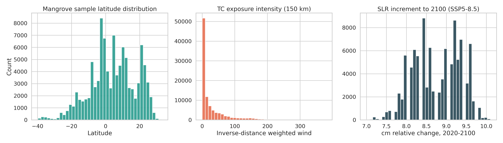
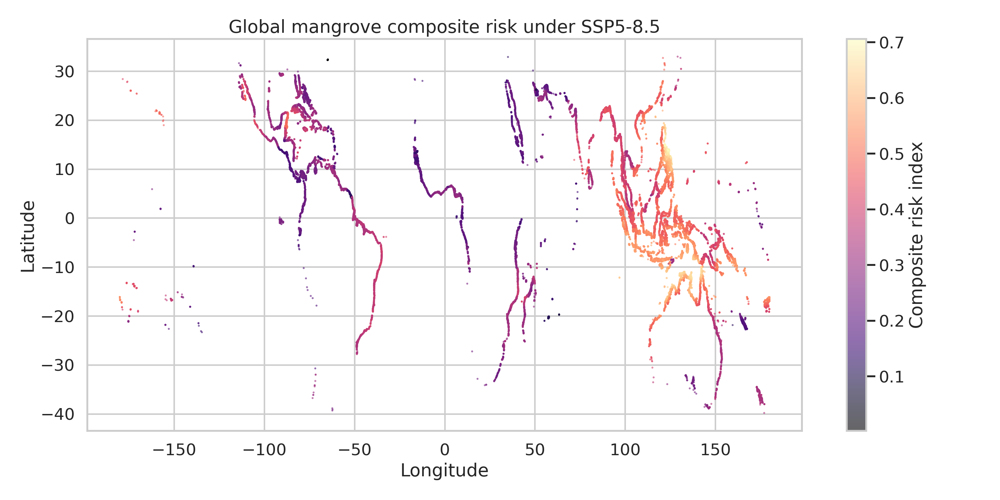
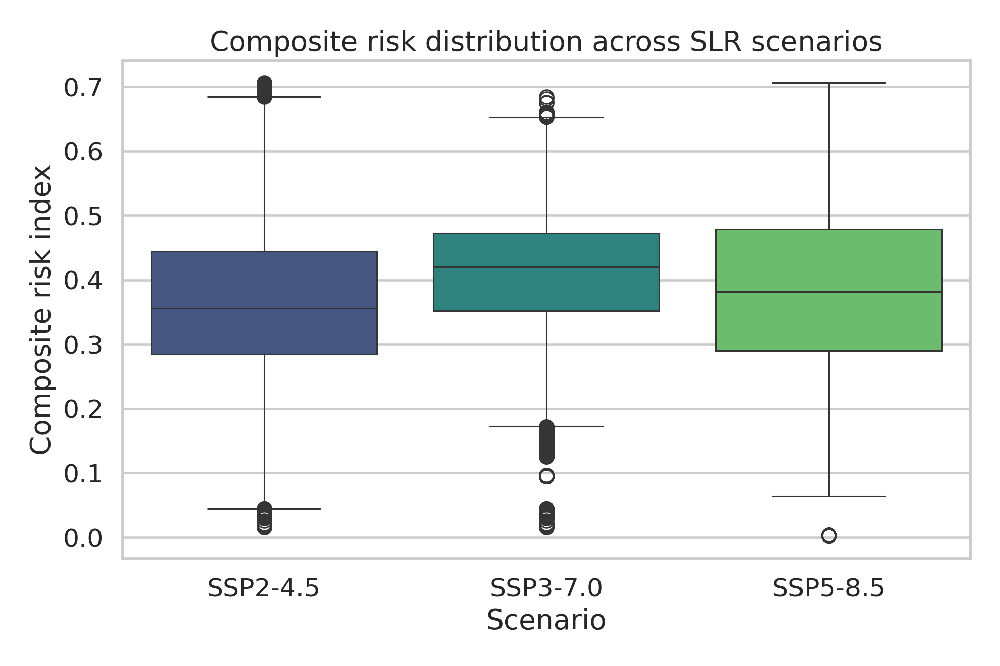
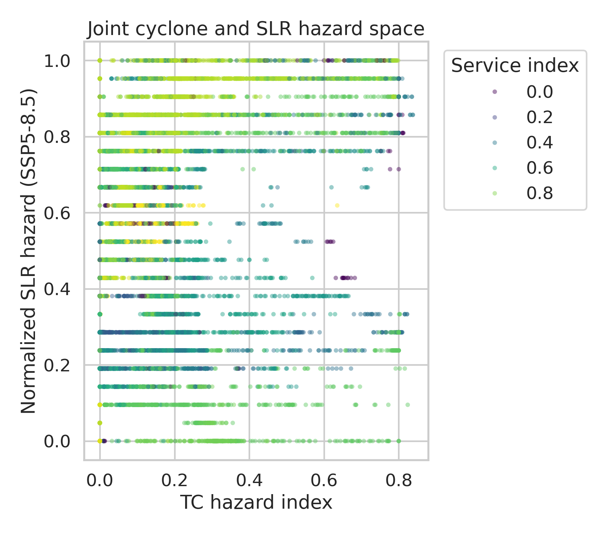
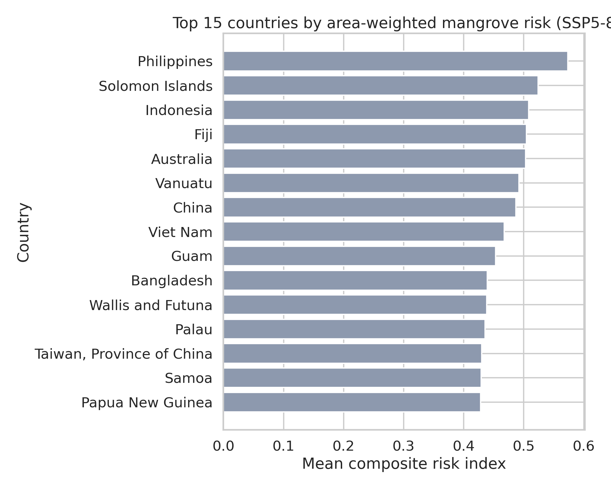
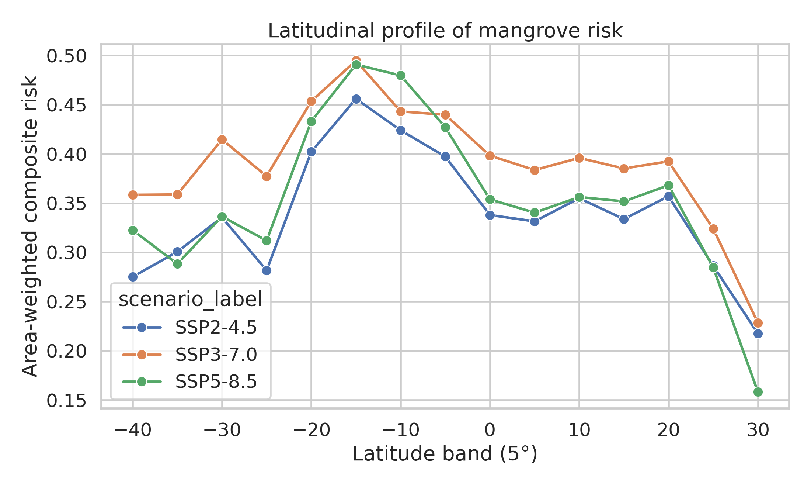

# A Global Composite Risk Index for Mangroves under Tropical Cyclone Regime Shifts and Sea-Level Rise

## Summary
This study develops a transparent composite risk index that combines tropical cyclone (TC) hazard, a TC regime-shift proxy, sea-level-rise (SLR) change, and mangrove-associated ecosystem service exposure. The index is applied to a global 10% sample of Global Mangrove Watch reference points and aggregated to country and latitudinal profiles. Across the available scenarios, the analysis identifies persistent hotspots in the western Pacific and Maritime Southeast Asia, with the Philippines ranking first in all three scenarios. Under the implemented index, SSP3-7.0 produces the highest global mean composite risk, while SSP5-8.5 produces the largest mean SLR increment and stronger upper-tail risk. The results indicate that regions already exposed to intense cyclone activity and supporting large at-risk/benefiting populations face the most consistent end-of-century pressure.

## 1. Research objective
The task was to develop a global composite risk index combining tropical cyclone regime shifts and sea level rise, then use it to evaluate where mangroves and their ecosystem services are most at risk by the end of the century. The intended use is climate-adaptive conservation prioritization.

Because the workspace contained historical TC tracks, scenario-specific SLR projections, sampled global mangrove locations, and country-level ecosystem service indicators, the analysis was designed around a reproducible hazard-exposure-service framework:
- **Hazard 1:** local TC exposure from historical downscaled track points.
- **Hazard 2:** scenario-specific SLR change between 2020 and 2100.
- **Regime-shift proxy:** spatial anomaly in severe-cyclone exposure and poleward displacement of cyclone activity relative to mangrove latitude.
- **Service relevance:** country-level population and carbon stock indicators linked to mangroves.
- **Exposure weight:** equal area weight per sampled mangrove point, scaled from the 10% sample.

## 2. Data and preprocessing
### 2.1 Input datasets
- `data/mangroves/gmw_v4_ref_smpls_qad_v12.gpkg`: 100,000 sampled mangrove reference points in EPSG:4326.
- `data/slr/total_ssp245_medium_confidence_rates.nc`
- `data/slr/total_ssp370_medium_confidence_rates.nc`
- `data/slr/total_ssp585_medium_confidence_rates.nc`
- `data/tc/tracks_mit_mpi-esm1-2-hr_historical_reduced.nc`: 200,000 historical TC track points with wind speed.
- `data/ecosystem/UCSC_CWON_countrybounds.gpkg`: country polygons with mangrove area and ecosystem service indicators for 2020.

### 2.2 Initial validation
The input inventory written to `outputs/data_inventory.json` confirms:
- 100,000 mangrove points spanning roughly 39.8°S to 33.0°N.
- 121 country polygons with 2020 mangrove area, population-at-risk, carbon stock at risk, beneficiary population, and beneficiary carbon stock.
- 200,000 TC track points with winds from 33.0 to 124.4 m s$^{-1}$.

### 2.3 Spatial processing
- Mangrove points were spatially joined to countries using polygon containment.
- Remaining unmatched coastal points were assigned with nearest-country fallback in projected coordinates.
- SLR values were assigned by nearest-neighbor matching between mangrove points and the IPCC coastal projection locations using haversine distance.
- Since the mangrove file is an explicit 10% sample of points rather than area polygons, each point was assigned equal area weight using the summed 2020 country mangrove area total (14,879,481 ha) divided across the full inferred point population.

## 3. Composite risk index design
### 3.1 Tropical cyclone features
For each mangrove point, all historical TC track points within 150 km were identified using a haversine BallTree. The following features were derived:
- `tc_count_150km`: number of TC records within 150 km.
- `tc_severe_count_150km`: number of severe TC records, defined here as wind speed >= 50 m s$^{-1}$.
- `tc_invdist_intensity_150km`: inverse-distance-weighted sum of wind intensity.
- `tc_mean_abs_lat_150km`: mean absolute latitude of local storm points.
- `tc_lat_shift_proxy`: positive difference between storm absolute latitude and mangrove absolute latitude.

A normalized **TC baseline hazard** was computed as:

\[
H_{TC} = 0.4\,N(\text{count}) + 0.6\,N(\text{inverse-distance intensity})
\]

A normalized **TC regime-shift proxy** was computed as:

\[
R_{TC} = 0.5\,N(\text{severe count}) + 0.5\,N(\text{latitudinal shift proxy})
\]

where \(N(\cdot)\) is winsorized min-max normalization using the 2nd and 98th percentiles.

The total TC hazard was then:

\[
T_{TC} = 0.6\,H_{TC} + 0.4\,R_{TC}
\]

This construction should be interpreted as a scenario-free TC stress surface based on the available historical data and a regime-shift proxy, not as a full dynamical future TC projection.

### 3.2 Sea-level-rise hazard
For each SLR netCDF file, the median quantile (0.5) of `sea_level_change_rate` was extracted at 2020 and 2100. The scenario-specific SLR increment was defined as:

\[
\Delta SLR_s = SLR_{2100,s} - SLR_{2020,s}
\]

for scenarios \(s \in \{\text{SSP2-4.5}, \text{SSP3-7.0}, \text{SSP5-8.5}\}\).

A normalized SLR hazard was then computed pointwise for each scenario.

### 3.3 Ecosystem service relevance index
Country-linked ecosystem service relevance was defined from the available 2020 indicators:
- `Risk_Pop_2020`
- `Ben_Pop_2020`
- `Risk_Stock_2020`
- `Ben_Stock_2020`

After log-transforming with `log1p`, the service index was defined as:

\[
S = 0.3N(\log(1+RiskPop)) + 0.3N(\log(1+BenPop)) + 0.2N(\log(1+RiskStock)) + 0.2N(\log(1+BenStock))
\]

### 3.4 Final composite risk index
For each scenario, the total hazard index was:

\[
H_s = 0.5\,T_{TC} + 0.5\,N(\Delta SLR_s)
\]

The final composite risk index was:

\[
CRI_s = 0.5\,H_s + 0.3\,S + 0.2\,N(\log(1+Area))
\]

where `Area` is the point area weight. Since the point weights are equal in this sampled dataset, the area term mainly preserves the intended exposure structure and does not dominate rankings.

## 4. Experimental outputs
### 4.1 Reproducibility
The complete pipeline is implemented in:
- `code/analyze_mangrove_risk.py`

Primary generated outputs:
- `outputs/mangrove_risk_samples.parquet`
- `outputs/mangrove_risk_samples_preview.csv`
- `outputs/country_risk_summary.csv`
- `outputs/global_latitudinal_profile.csv`
- `outputs/scenario_risk_summary.csv`
- `outputs/risk_correlation_matrix.csv`
- `outputs/data_inventory.json`

Run command:
```bash
python code/analyze_mangrove_risk.py --mode run
```

### 4.2 Figures
#### Figure 1. Data overview


Figure 1 shows the global latitude distribution of mangrove samples, the distribution of local TC exposure intensity, and the SSP5-8.5 SLR increment distribution.

#### Figure 2. Global composite risk map


Figure 2 shows the spatial distribution of the SSP5-8.5 composite risk index. High-risk clusters are concentrated across the Philippines, Indonesia, northern Australia, Pacific islands, parts of coastal China, and Bangladesh.

#### Figure 3. Scenario comparison


Figure 3 compares the pointwise risk distributions across scenarios. Differences are moderate rather than extreme because TC and service terms remain fixed, while SLR changes the scenario-specific hazard term.

#### Figure 4. Joint hazard space


Figure 4 shows how mangrove points occupy the two-dimensional hazard space defined by TC hazard and normalized SLR hazard under SSP5-8.5. Points with higher service relevance tend to cluster in moderate-to-high combined hazard regimes in Asia.

#### Figure 5. Highest-risk countries


Figure 5 ranks the top 15 countries/territories by area-weighted mean composite risk under SSP5-8.5.

#### Figure 6. Latitudinal profile


Figure 6 shows that the strongest area-weighted risk occurs in southern tropical bands, especially around 10-20°S, with secondary elevated bands in the northern tropics.

## 5. Results
### 5.1 Global scenario summaries
The scenario-level summary from `outputs/scenario_risk_summary.csv` is:

| Scenario | Mean risk | Median risk | 90th percentile | Share of points with risk >= 0.67 | Mean SLR increment (cm, 2020-2100) |
|---|---:|---:|---:|---:|---:|
| SSP2-4.5 | 0.364 | 0.356 | 0.505 | 0.0065 | 3.92 |
| SSP3-7.0 | 0.409 | 0.420 | 0.519 | 0.00004 | 6.96 |
| SSP5-8.5 | 0.384 | 0.382 | 0.546 | 0.0049 | 8.76 |

Key observations:
- SSP3-7.0 yields the highest global mean and median composite risk under this normalization scheme.
- SSP5-8.5 yields the strongest upper-tail risk and largest mean SLR increment.
- Scenario differences are nonlinear because each SLR field is normalized separately before combination with fixed TC and service terms.

### 5.2 Country hotspots
The leading countries under SSP5-8.5 are:

| Rank | Country | Mean composite risk | Mean TC hazard | Mean SLR increment (cm) | Mean service index |
|---|---|---:|---:|---:|---:|
| 1 | Philippines | 0.573 | 0.367 | 9.50 | 0.853 |
| 2 | Solomon Islands | 0.524 | 0.624 | 9.72 | 0.413 |
| 3 | Indonesia | 0.508 | 0.130 | 9.38 | 0.883 |
| 4 | Fiji | 0.505 | 0.703 | 9.39 | 0.384 |
| 5 | Australia | 0.503 | 0.363 | 9.18 | 0.748 |
| 6 | Vanuatu | 0.492 | 0.554 | 9.89 | 0.348 |
| 7 | China | 0.487 | 0.174 | 8.85 | 0.982 |
| 8 | Viet Nam | 0.467 | 0.123 | 8.78 | 0.987 |
| 9 | Guam | 0.453 | 0.811 | 9.85 | 0.000 |
| 10 | Bangladesh | 0.439 | 0.069 | 8.93 | 0.878 |

These rankings reveal two recurring hotspot types:
1. **Cyclone-dominated island systems** such as Fiji, Guam, Solomon Islands, and Vanuatu.
2. **Service-rich, densely populated mangrove systems** such as the Philippines, Indonesia, China, Viet Nam, and Bangladesh.

The Philippines is consistently first across all three scenarios, indicating robust hotspot status across plausible SLR futures.

### 5.3 Scenario stability of hotspot rankings
The top-10 lists are broadly stable:
- **SSP2-4.5:** Philippines, China, Viet Nam, Indonesia, Solomon Islands, Australia, Guam, Taiwan, Japan, Fiji.
- **SSP3-7.0:** Philippines, China, Viet Nam, Fiji, Indonesia, Australia, Taiwan, Madagascar, Vanuatu, Japan.
- **SSP5-8.5:** Philippines, Solomon Islands, Indonesia, Fiji, Australia, Vanuatu, China, Viet Nam, Guam, Bangladesh.

This suggests that western Pacific and Maritime Southeast Asia remain priority regions even when scenario details shift.

### 5.4 Latitudinal structure
The highest latitudinal composite risk under SSP5-8.5 occurs near:
- **15°S band:** mean risk 0.491
- **10°S band:** mean risk 0.480
- **20°S band:** mean risk 0.433
- **5°S band:** mean risk 0.427

This pattern reflects the overlap of mangrove area, tropical cyclone activity, and projected SLR across the southwest Pacific and northern Australia/Maritime Continent region.

### 5.5 Correlation structure
From `outputs/risk_correlation_matrix.csv`:
- `service_risk_index` is strongly correlated with composite risk across all scenarios (r about 0.67-0.72).
- `slr_ssp585_cm_2100` is strongly correlated with the SSP5-8.5 composite risk (r = 0.816).
- `tc_total_hazard` has a moderate relationship with composite risk (r about 0.46-0.48).

Thus, under the implemented formulation, the strongest determinants of composite ranking are service relevance and scenario-specific SLR magnitude, while cyclone hazard shapes hotspot geography and upper-tail exposure.

## 6. Interpretation
The analysis supports three broad conclusions.

First, **mangrove risk is spatially concentrated rather than globally uniform**. High-risk areas cluster where intense cyclone climatology coincides with strong SLR exposure and high ecosystem service dependence.

Second, **western Pacific and Maritime Southeast Asian systems emerge as robust conservation priorities**. These regions combine large mangrove extent with high beneficiary populations and substantial cyclone hazard.

Third, **small island settings remain disproportionately vulnerable even when ecosystem service totals are smaller**. Their rankings are elevated by high cyclone hazard and strong SLR increments, which can threaten relatively limited mangrove area with few adaptation alternatives.

From a management perspective, the results imply differentiated strategies:
- **Philippines, Indonesia, Viet Nam, China, Bangladesh:** integrate large-scale ecosystem-based adaptation, setback zoning, sediment management, and service-protection planning.
- **Pacific islands and island territories:** prioritize local resilience, landward accommodation space, and restoration in cyclone-sheltered embayments.
- **Northern Australia and southwest Pacific belts:** combine hazard monitoring with conservation of relatively extensive mangrove systems before regime shifts intensify.

## 7. Limitations
This analysis is intentionally transparent and reproducible, but it has important limitations.

1. **The mangrove dataset contains points, not polygons.** Area exposure was approximated by equal weighting of sampled points scaled to a global area total.
2. **No explicit future TC model output was provided.** The regime-shift term is therefore a proxy based on historical severe exposure and latitudinal structure, not a mechanistic future projection.
3. **Scenario normalization is relative within each scenario.** This helps comparison of spatial patterns but can make SSP3-7.0 appear globally higher than SSP5-8.5 in mean normalized risk despite lower absolute SLR than SSP5-8.5.
4. **Ecosystem services were available at country level only.** Subnational heterogeneity in beneficiaries and carbon stocks is not resolved.
5. **Uncertainty intervals were not propagated.** The IPCC files contain quantiles, but this run used the median only to establish a baseline product.
6. **Country coverage is limited to the 121 polygons in the ecosystem-service file.** This may omit or simplify some mangrove-bearing jurisdictions.

## 8. Recommended next steps
The most valuable next extensions would be:
- propagate SLR uncertainty by comparing median, 17th, and 83rd percentile trajectories;
- test alternative weighting schemes for the composite index and report rank sensitivity;
- replace the TC regime-shift proxy with explicit future TC track projections if available;
- move from country-level service indicators to gridded beneficiary and carbon datasets;
- validate hotspot rankings against observed mangrove loss, storm damage, or shoreline retreat where independent data exist.

## 9. Deliverable checklist
Completed deliverables in the workspace:
- Analysis code: `code/analyze_mangrove_risk.py`
- Intermediate outputs: files under `outputs/`
- Figures: files under `report/images/`
- Final report: `report/report.md`
