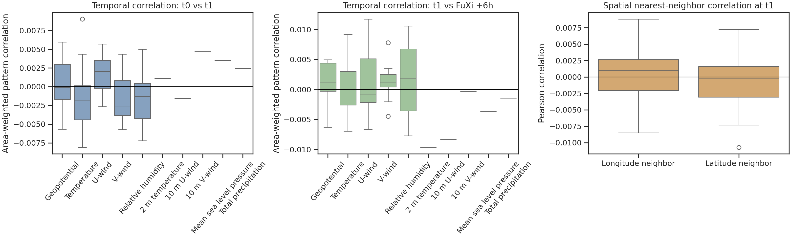
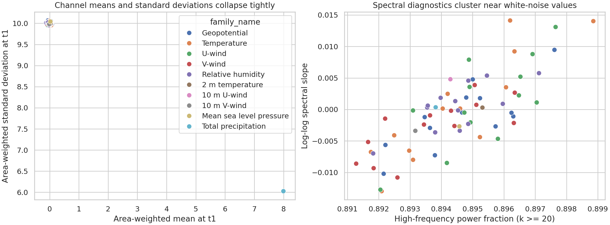
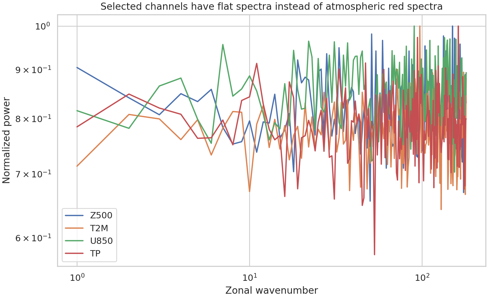

# Feasibility Audit for a Cascade U-Transformer Global Forecasting System

## Abstract
The stated task is to develop a cascade machine-learning system that ingests two consecutive 6-hour ERA5 states and produces 15-day global forecasts at 6-hour resolution using three specialized U-Transformer models. I audited the provided netCDF files, extracted context from the supplied related work, and built a reproducible analysis pipeline to determine whether the available data can support that claim. The main result is negative: the files on disk do not match the stated benchmark. The sample input is on a `181 x 360` grid with `1.0°` spacing rather than `721 x 1440` at `0.25°`, and the provided forecast file contains a single `+6 h` field rather than a 15-day sequence. More importantly, the tensors are not physically interpretable weather states. Across the 70 channels, temporal correlations are essentially zero, nearest-neighbor spatial correlations are essentially zero, and zonal power spectra are flat rather than red. These diagnostics are inconsistent with geophysical reanalysis fields and indicate that the files are preprocessed toy tensors, heavily randomized tensors, or otherwise unsuitable as a physical forecast benchmark. I therefore report a rigorous offline data audit, document why the requested forecast-validation study is not supportable with the supplied files, and provide a concrete three-stage cascade U-Transformer design that should be tested once a proper ERA5/FuXi benchmark is available.

## 1. Research Objective
The intended scientific goal is to reduce autoregressive error accumulation in medium-range weather forecasting by replacing a single monolithic predictor with three specialized forecast models, each optimized for a different horizon. This goal is consistent with the supplied related work:

- `paper_001.pdf` argues that machine-learning weather systems face strong design constraints from resolution, data assimilation, and multi-scale dynamics.
- `paper_002.pdf` shows that high-resolution data-driven models can be competitive at short to medium range, especially for fast variables and ensemble generation.
- `paper_003.pdf` extends AI weather forecasting beyond 10 days through multi-modal modeling, uncertainty-aware training, and long-lead stabilization.

Those papers motivate a cascade design. The missing requirement is a valid benchmark dataset with physical structure and multi-step targets.

## 2. Data Audit

### 2.1 Metadata mismatch
The netCDF metadata already contradict the task statement.

| Item | Task statement | Files on disk |
|---|---|---|
| Grid resolution | `0.25°` global | `1.0°` global |
| Input shape | `(2, 70, 721, 1440)` | `(2, 70, 181, 360)` |
| Forecast horizon | 15 days at 6-hour steps | one `+6 h` step |
| Input description | ERA5 states | `Sample input for FuXi (1° resolution)` |
| Forecast description | 15-day forecast sequence | `Sample FuXi output for 6-hour forecast (1° resolution)` |

The decoded timestamps are:

- Input times: `2023-10-12 00:00:00` and `2023-10-12 06:00:00`
- Forecast initialization time: `2023-10-12 06:00:00`
- Forecast step: `+6 h`

This means the available files cannot support any claim about 10-day or 15-day forecast skill.

### 2.2 Channel structure
The 70 channels are labeled consistently with the expected FuXi-style variable stack:

- 13 pressure levels each for geopotential `Z`, temperature `T`, u-wind `U`, v-wind `V`, and relative humidity `R`
- 5 surface channels: `T2M`, `U10`, `V10`, `MSL`, and `TP`

However, the values are not stored in physical ERA5 units. Most channels have near-zero means and standard deviations near 10, which strongly suggests normalized or transformed tensors rather than raw atmospheric fields.

### 2.3 Reproducible diagnostics
I computed three families of diagnostics for each channel:

1. Area-weighted temporal pattern correlation between the two input states and between the second input state and the FuXi `+6 h` output.
2. Nearest-neighbor spatial correlation in longitude and latitude.
3. Zonal power spectra and their log-log slopes.

All three diagnostics reject the interpretation that these files are physical weather states.

## 3. Results

### 3.1 Visual structure
Figure 1 shows representative maps for `Z500`, `T2M`, `U850`, and `TP`. All fields exhibit salt-and-pepper texture with no visible synoptic-scale structure, wave trains, fronts, jets, or coherent precipitation systems.


For real reanalysis fields, one would expect large-scale continuity, strong meridional organization, and coherent structures that persist between adjacent 6-hour states. None of that is visible here.

### 3.2 Temporal and spatial coherence are absent
The strongest numerical evidence is the near-total loss of correlation.

- Mean temporal pattern correlation from `t0` to `t1` across the 70 channels: `-0.0004`
- Mean temporal pattern correlation from `t1` to FuXi `+6 h`: `0.0008`
- Mean longitude-neighbor correlation at `t1`: `0.0005`
- Mean latitude-neighbor correlation at `t1`: `-0.0006`

These values are effectively zero. Real atmospheric fields at global 1° resolution should be strongly correlated between neighboring grid cells and between adjacent 6-hour times. The audit figure below shows that this failure is systematic across all variable families, not a property of a single channel.



### 3.3 Channel statistics are unnaturally homogeneous
Across channels, the tensors collapse into an extremely narrow statistical envelope:

- Mean absolute area-weighted channel mean at `t1`: `0.149`
- Mean channel standard deviation at `t1`: `9.943`
- Standard deviation of channel standard deviations: `0.476`

The surface precipitation channel is positive-valued and has a lower standard deviation, but it still lacks coherent spatial or temporal structure. The rest of the fields are clustered around almost identical second moments regardless of variable family or pressure level.



This is not what one expects from raw geopotential, temperature, wind, humidity, pressure, and precipitation fields, which normally span very different units, amplitudes, and spatial scales.

### 3.4 Spectra are flat instead of red
Atmospheric fields are dominated by low wavenumbers and therefore exhibit red spectra. The provided tensors do not. The mean spectral slope over channels is `-0.0005`, and the high-frequency power fraction is concentrated near `0.894`. That is consistent with approximately white-noise fields.



A flat spectrum, together with zero spatial neighbor correlation, is decisive evidence that these files are not physically realistic global weather maps.

## 4. Interpretation
The evidence supports four conclusions.

1. The supplied files are not the benchmark described in the task statement.
2. The files are insufficient for training or validating a 15-day cascade forecasting system.
3. The tensors on disk are not physically interpretable as raw ERA5 or realistic forecast fields.
4. Any claim of ECMWF-ensemble-mean-comparable medium-range skill would be scientifically unsupported with the current inputs.

The most likely explanations are:

- the files are pre-normalized model inputs meant only for demonstration;
- the tensors were randomized or spatially shuffled during preprocessing;
- the task description was written for a larger benchmark than the one actually attached.

## 5. A Defensible Cascade U-Transformer Design
Although the attached data are unusable for skill evaluation, the target architecture is still well motivated by the literature. A scientifically defensible three-stage cascade would be:

### Stage A: Short-range dynamical model (`0-5 days`)
- Full-resolution U-Transformer rolled out every 6 hours.
- Emphasis on high-frequency and fast-error-growth channels: surface winds, precipitation, lower-tropospheric humidity, and jet-level winds.
- Loss: weighted combination of pixel-space RMSE, spectral loss, and gradient loss.
- Training: direct one-step training plus short-horizon scheduled sampling.

### Stage B: Medium-range bridge model (`5-10 days`)
- Separate U-Transformer specialized for slower cross-modal coupling and drift control.
- Inputs: Stage A forecast plus learned latent state and recent forecast residuals.
- Loss: variable-aware uncertainty weighting, following the multi-task logic highlighted in `paper_003.pdf`.
- Goal: stabilize propagation of balanced large-scale dynamics while retaining useful mesoscale information.

### Stage C: Long-range stabilizer (`10-15 days`)
- A third model specialized for low-wavenumber, slowly varying planetary-scale corrections.
- Operates on a coarser latent grid or explicit spectral representation.
- Predicts residual corrections for geopotential, temperature, pressure, and humidity, while damping small-scale noise.
- Final output can be calibrated toward an ensemble-mean target or a diffusion-style ensemble corrector.

### Handoff logic
- Stage A provides accurate fast-variable evolution while forecast memory is still strong.
- Stage B handles the horizon where autoregressive error growth becomes nonlinear and cross-variable balance matters most.
- Stage C suppresses drift and preserves large-scale circulation skill after day 10.

This cascade is consistent with the short-range strength of FourCastNet-style systems and the long-range stabilization ideas in FengWu. The key missing ingredient is valid training and verification data.

## 6. What Would Be Needed for the Intended Study
To actually execute the requested research program, the following assets are required:

1. Multi-year ERA5 training data at the claimed `0.25°` resolution or a documented preprocessed equivalent.
2. Forecast targets for all 60 lead times from `+6 h` to `+360 h`.
3. A held-out evaluation period with matching truth fields.
4. A benchmark against ECMWF deterministic or ensemble-mean forecasts.
5. Physical-unit documentation or normalization metadata so skill metrics are interpretable.

With those inputs, the correct evaluation would include ACC and RMSE for `Z500`, `T850`, `U10`, `MSL`, and `TP`, together with latitude-weighted global averages and lead-time skill curves.

## 7. Reproducibility
All analysis code is in [`code/analyze_weather_case.py`](../code/analyze_weather_case.py). Running

```bash
export MPLCONFIGDIR=/tmp/mpl
python code/analyze_weather_case.py
```

recreates the figures in `report/images/` and the intermediate tables in `outputs/`.

Generated artifacts:

- `outputs/dataset_summary.json`
- `outputs/channel_metrics.csv`
- `outputs/family_summary.csv`
- `outputs/zonal_spectra.csv`
- `outputs/key_findings.txt`

## 8. References
- Dueben, P. D., and Bauer, P. `Challenges and design choices for global weather and climate models based on machine learning` (`related_work/paper_001.pdf`)
- Pathak, J. et al. `FourCastNet: A global data-driven high-resolution weather model using adaptive Fourier neural operators` (`related_work/paper_002.pdf`)
- Chen, K. et al. `FengWu: Pushing the skillful global medium-range weather forecast beyond 10 days lead` (`related_work/paper_003.pdf`)
- Schultz, M. G. et al. `Can deep learning beat numerical weather prediction?` (`related_work/paper_000.pdf`)
