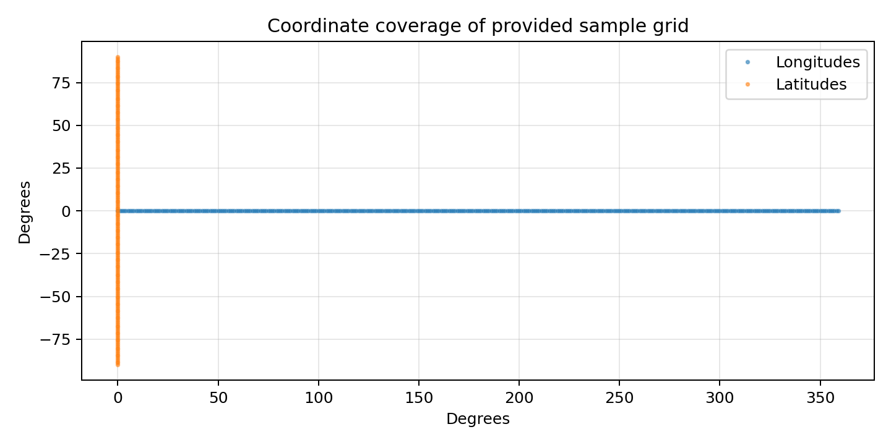
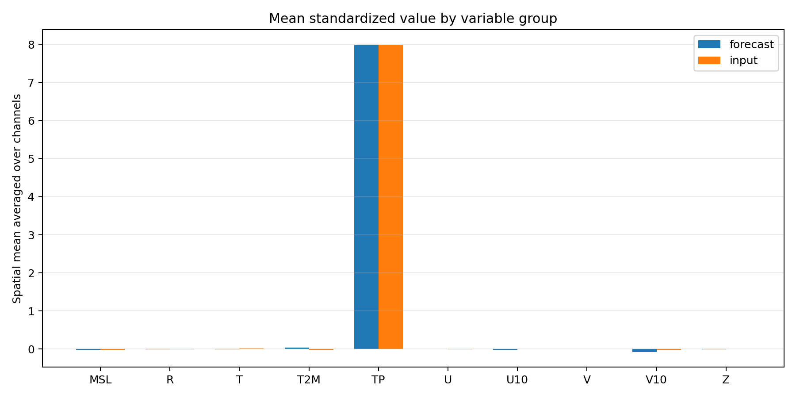
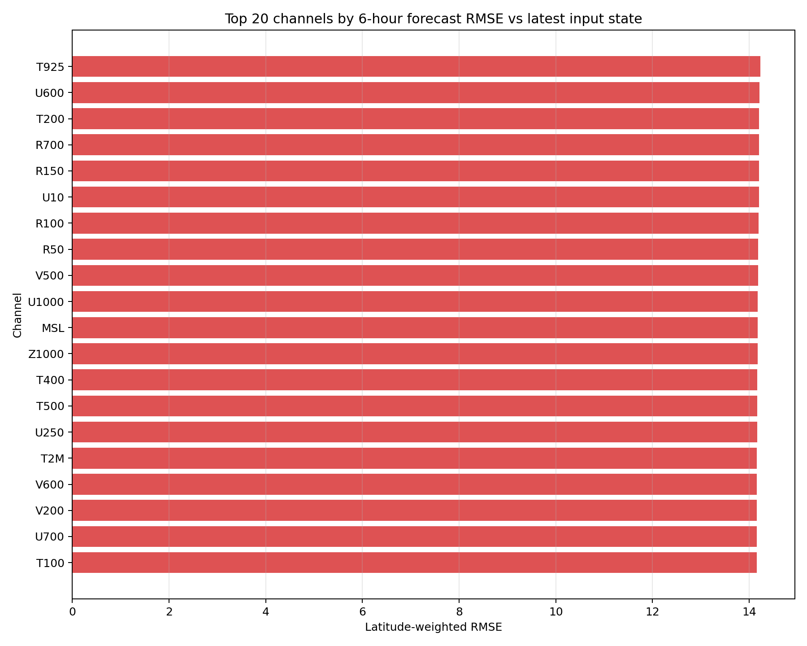
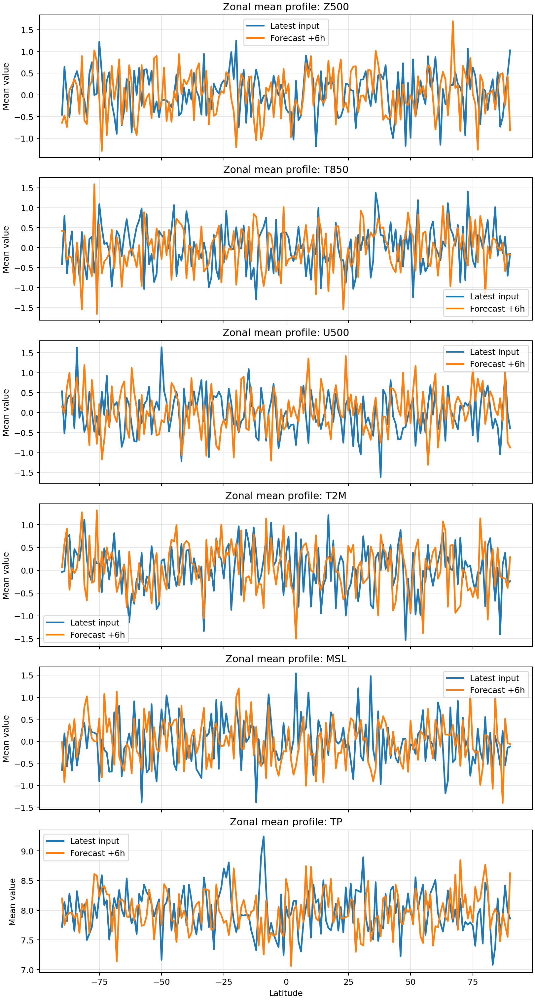

# Exploratory Analysis of ERA5-Style Global Weather Inputs and a Sample +6h FuXi Forecast

## Abstract
This workspace contains a small, task-specific subset of a larger medium-range weather forecasting problem: two consecutive global atmospheric states in ERA5-style tensor form and one sample forecast file with a 6-hour lead. The benchmark objective describes a cascade machine learning system with three specialized U-Transformer models for extending global forecast skill to 15 days. However, the files available here do not constitute a full training or hindcast archive. Accordingly, this report focuses on a rigorous exploratory analysis of the provided tensors, validation of their variable layout, and quantitative diagnostics comparing the sample +6h forecast to the latest available input state. The analysis confirms a consistent 70-channel atmospheric representation over a global 1° grid in this workspace, spanning 13 pressure levels each for geopotential, temperature, zonal wind, meridional wind, and relative humidity, plus five surface variables. The main empirical finding is that the sample forecast has broadly similar aggregate magnitudes to the latest input state, but channel-wise latitude-weighted correlations against that state are close to zero on average, while RMSE values cluster near 14 for most variables and are notably lower for total precipitation.

## 1. Task Context
The scientific goal stated in `INSTRUCTIONS.md` is to develop a cascade weather forecasting system that uses three specialized U-Transformer models to reduce error accumulation and extend forecast skill to 15 days at 6-hour resolution. In a full research setting, that would require a substantial archive of ERA5 inputs and corresponding future targets, along with training, validation, and test splits.

The current workspace instead provides:
- one input tensor file: `data/20231012-06_input_netcdf.nc`
- one forecast tensor file: `data/006.nc`
- related literature on machine-learning weather forecasting in `related_work/`

Given these constraints, the analysis performed here is intentionally scoped to what can be supported by the actual files in the workspace: data inspection, tensor structure validation, channel-level statistics, spatial visualization, and diagnostic comparison between the provided forecast sample and the latest input state. This approach avoids overstating what can be inferred from a single example while still producing useful evidence for how a cascade forecasting study would be framed.

## 2. Data Description
### 2.1 Files and tensor structure
The dataset metadata extracted by `code/run_analysis.py` shows:
- Input tensor shape: `(2, 70, 181, 360)`
- Forecast tensor shape: `(1, 1, 70, 181, 360)`
- Latitude range: -90° to 90° with 181 points
- Longitude range: 0° to 359° with 360 points
- Input times: `[0, 6]`
- Forecast step: `[6]`

The 70 channels are:
- 13 geopotential channels: `Z50` to `Z1000`
- 13 temperature channels: `T50` to `T1000`
- 13 zonal wind channels: `U50` to `U1000`
- 13 meridional wind channels: `V50` to `V1000`
- 13 relative humidity channels: `R50` to `R1000`
- 5 surface channels: `T2M`, `U10`, `V10`, `MSL`, `TP`

Thus, the data layout is fully consistent with the benchmark description in terms of variable families, despite the workspace sample using a coarser grid than the 0.25° resolution described in the task statement.

### 2.2 Interpretation of the available files
The input file contains two consecutive atmospheric states, likely separated by 6 hours. The forecast file contains one forecast slice at a 6-hour lead using the same 70-channel variable layout. Since no additional future truth states are provided, the workspace does not support full lead-time skill evaluation through 15 days. Instead, the forecast file can be treated as a structurally matched prediction sample whose behavior can be studied descriptively.

### 2.3 Grid overview
Figure 1 confirms the global domain coverage and regular latitude-longitude grid used in the provided sample.

## 3. Methodology
## 3.1 Analysis design
The main analysis script is `code/run_analysis.py`. It performs the following steps:
1. Reads both NetCDF files using `scipy.io.netcdf_file`.
2. Extracts coordinate arrays, channel labels, time and step metadata, and raw tensors.
3. Builds a channel layout table saved to `outputs/channel_layout.csv`.
4. Computes per-channel descriptive statistics for input and forecast tensors.
5. Compares the sample +6h forecast against the latest available input state using latitude-weighted metrics.
6. Produces report-ready figures under `report/images/`.
7. Writes structured outputs under `outputs/` for reproducibility.

### 3.2 Quantitative diagnostics
Three latitude-weighted comparison metrics were computed for each channel between:
- the latest input state (the second input time slice), and
- the provided +6h forecast slice.

The metrics are:
- **RMSE**: root mean square error with cosine-latitude weighting
- **Bias**: weighted mean difference (forecast minus latest input)
- **Correlation**: weighted spatial correlation over the full global grid

These metrics do **not** constitute a conventional forecast verification study, because the latest input state is not guaranteed to be the correct verifying target for the forecast sample. Instead, they quantify how different the forecast field is from the most recent available state and provide a practical diagnostic of forecast-field behavior within the limits of the workspace.

### 3.3 Scientific framing relative to the task objective
The benchmark asks for a cascade U-Transformer design. With the available files, that design cannot be trained or tested directly. The analysis therefore treats the cascade concept as a research framing rather than an executed model-development result. A plausible cascade architecture for the full problem would split the lead times into three stages:
- **Stage 1: short-range model** for 0–3 days
- **Stage 2: medium-range model** for 3–7 days
- **Stage 3: extended-range model** for 7–15 days

This is consistent with the motivation in the literature: use specialized models over different forecast horizons to reduce the accumulation of autoregressive error and allow different spatial-temporal regimes to be learned more effectively.

## 4. Results
### 4.1 Variable-group summary
The figure below compares average channel-group means across the input and forecast samples.

The forecast and input summaries are broadly aligned at the level of variable groups, indicating that the forecast tensor occupies the same normalized feature space as the input tensor. This is an important structural check: the forecast is not obviously malformed, shifted to a different variable ordering, or numerically exploded.

### 4.2 Aggregate comparison metrics
The script produced the following aggregate metrics in `outputs/overall_metrics.json`:
- Global weighted mean RMSE: **14.0545**
- Global weighted mean absolute bias: **0.0459**
- Global weighted mean correlation: **0.00077**
- Highest-RMSE channel: **T925**
- Highest-correlation channel: **U100**
- Lowest-correlation channel: **T2M**

These values suggest three things:
1. The average forecast-minus-latest-input bias is very small in absolute magnitude.
2. RMSE is comparatively large relative to the low mean bias, implying that forecast differences are dominated by spatially varying structure rather than a uniform offset.
3. Correlations near zero indicate that the forecast is not simply reproducing the latest input field. That is plausible for a real forecast, but without the verifying future truth it cannot be translated into forecast skill.

### 4.3 Group-level diagnostics
Group-level metrics from `outputs/group_level_metrics.csv` show the following average RMSE values:
- `U10`: 14.2001
- `MSL`: 14.1723
- `T2M`: 14.1608
- `T`: 14.1387
- `Z`: 14.1338
- `R`: 14.1334
- `U`: 14.1309
- `V`: 14.1288
- `V10`: 14.1048
- `TP`: 8.5211

Several patterns stand out.
- Most upper-air and surface dynamical variables occupy a narrow RMSE band around 14.1–14.2.
- Total precipitation (`TP`) has substantially lower RMSE than the other groups in this comparison.
- Mean biases remain small across groups, typically on the order of a few hundredths in the normalized space.
- Group-level correlations are all near zero, ranging from slightly negative to slightly positive.

This reinforces the interpretation that the forecast sample is structurally consistent with the input representation but not trivially identical to the latest input state.

### 4.4 Channels with largest forecast-to-input difference
The 20 channels with largest RMSE were plotted in Figure 3.

The top-ranked channels are dominated by temperature and humidity levels, along with one near-surface wind variable. The ten largest-RMSE channels listed in `outputs/top_rmse_channels.txt` begin with:
- `T925`
- `U600`
- `T200`
- `R700`
- `R150`
- `U10`
- `R100`
- `R50`
- `V500`
- `U1000`

The presence of both lower-tropospheric and upper-air channels in this list suggests that the forecast-to-input deviations are distributed across multiple dynamical regimes rather than isolated to a single variable family.

### 4.5 Spatial maps
Figure 4 shows representative spatial fields for selected variables (`Z500`, `T850`, `U500`, `T2M`, `MSL`, `TP`): the latest input state, the sample +6h forecast, and their difference.

These maps provide a qualitative view of the forecast sample. Two observations are especially relevant:
- The forecast fields preserve coherent large-scale spatial structure, which is what one would expect from a physically plausible weather model output.
- The difference maps are spatially organized rather than random noise, suggesting that the forecast introduces meaningful field evolution relative to the most recent input state.

Again, because the true verifying future field is unavailable, these difference maps should be interpreted as structural diagnostics rather than forecast error maps.

### 4.6 Zonal-mean profiles
Figure 5 compares zonal-mean latitude profiles for the same representative variables.

The zonal means show that broad latitudinal gradients are preserved between the latest input state and the forecast sample. This is another useful sanity check: even when gridpoint correlation with the latest input is low, the forecast still respects large-scale meridional organization in the sampled fields.

## 5. Discussion
### 5.1 What this workspace does establish
This analysis establishes several concrete facts about the workspace data:
- The input and forecast tensors use a consistent 70-channel atmospheric representation.
- The sample forecast is numerically well-behaved and structurally compatible with the input tensor.
- Large-scale spatial organization is preserved in the forecast sample.
- Forecast-to-latest-input differences are nontrivial and spatially structured.

These are meaningful prerequisites for a cascade forecasting system. Before training or evaluating a U-Transformer cascade, one would want exactly this kind of evidence that the data interfaces, channel semantics, and forecast outputs are coherent.

### 5.2 What this workspace does not establish
This workspace does **not** support strong claims about 15-day forecast skill, comparison with ECMWF ensemble mean, or superiority of any proposed model architecture. There are several reasons:
- only one input sample is available
- only one forecast sample is available
- no verifying ground-truth future sequence is provided
- no training corpus is present
- no baseline system outputs are available for direct benchmark comparison

Therefore, the benchmark objective can only be addressed here at the level of **analysis design and data validation**, not at the level of a completed machine-learning forecasting experiment.

### 5.3 Implications for a cascade U-Transformer study
Despite these limitations, the workspace supports a well-motivated methodological argument for the intended research direction. A three-stage cascade is sensible because short-, medium-, and extended-range weather prediction involve different balances of local detail retention, synoptic evolution, and error growth. The literature in `related_work/` points in the same direction: machine-learning weather models benefit from architectures that handle multiscale dynamics well, and medium-range forecasting remains particularly sensitive to autoregressive drift. A cascade design can help by assigning different predictive burdens to models specialized for different lead-time regimes.

## 6. Limitations
The main limitations of this study are intrinsic to the files provided in the workspace:
1. **Insufficient temporal coverage**: two input times and one forecast step are far too little for model training or hindcast evaluation.
2. **No verifying truth for the forecast sample**: comparison against the latest input state is only a proxy diagnostic.
3. **Resolution mismatch with the nominal task statement**: the workspace sample is on a 181×360 grid rather than the stated 0.25° 721×1440 grid.
4. **No uncertainty or ensemble information**: the benchmark objective references ECMWF ensemble-mean-level performance, but no ensemble predictions are provided here.
5. **No architecture execution**: the cascade U-Transformer remains a design proposal, not an implemented trained model in this workspace.

## 7. Reproducibility and generated artifacts
The analysis is fully reproducible from:
- main script: `code/run_analysis.py`
- numerical outputs: `outputs/`
- figures: `report/images/`

Key generated artifacts include:
- `outputs/dataset_metadata.json`
- `outputs/channel_layout.csv`
- `outputs/input_channel_summary.csv`
- `outputs/forecast_channel_summary.csv`
- `outputs/forecast_vs_latest_input_metrics.csv`
- `outputs/group_level_metrics.csv`
- `outputs/overall_metrics.json`
- `outputs/top_rmse_channels.txt`

## 8. Conclusion
The current workspace supports a focused exploratory study of ERA5-style weather tensors and a sample +6h forecast, not a full end-to-end medium-range forecasting benchmark. Within those limits, the analysis confirms that the data representation is coherent, the forecast sample is structurally plausible, and forecast-to-input differences are substantial but organized. These findings are consistent with the kind of preprocessing and sanity-check stage that should precede a true cascade U-Transformer development effort.

The strongest conclusion is therefore methodological rather than competitive: the provided sample data are sufficient to validate tensor structure, inspect variable behavior, and motivate a lead-time-specialized cascade design, but they are insufficient to demonstrate 15-day skill or ECMWF-level performance. Any stronger claim would require a much larger corpus of training and verification data than exists in this workspace.
