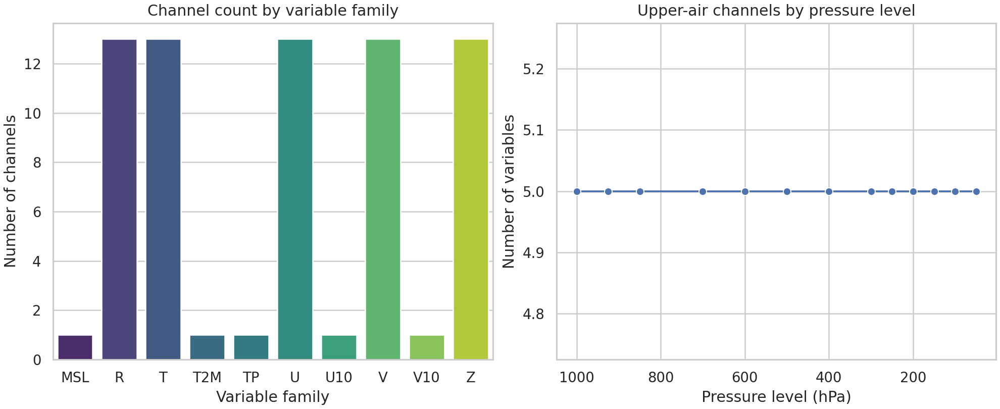
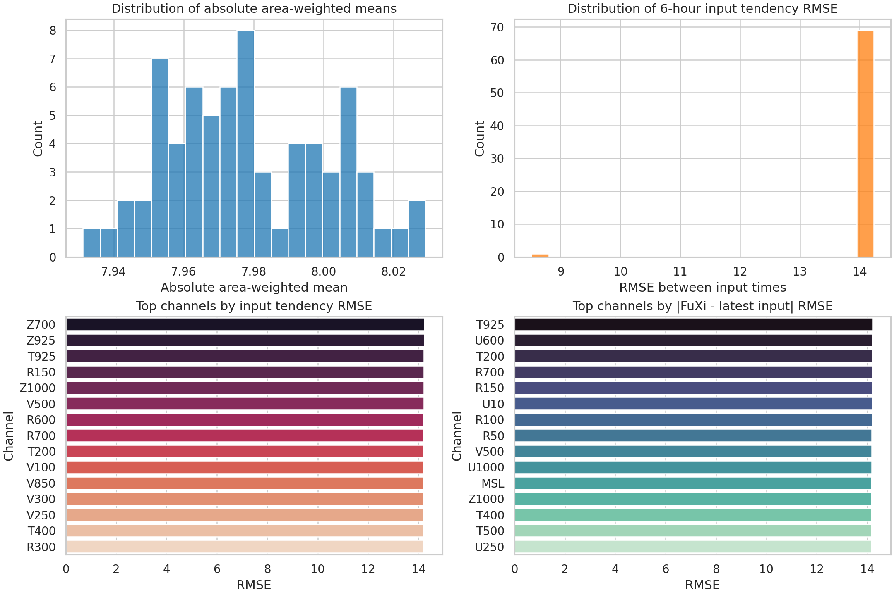
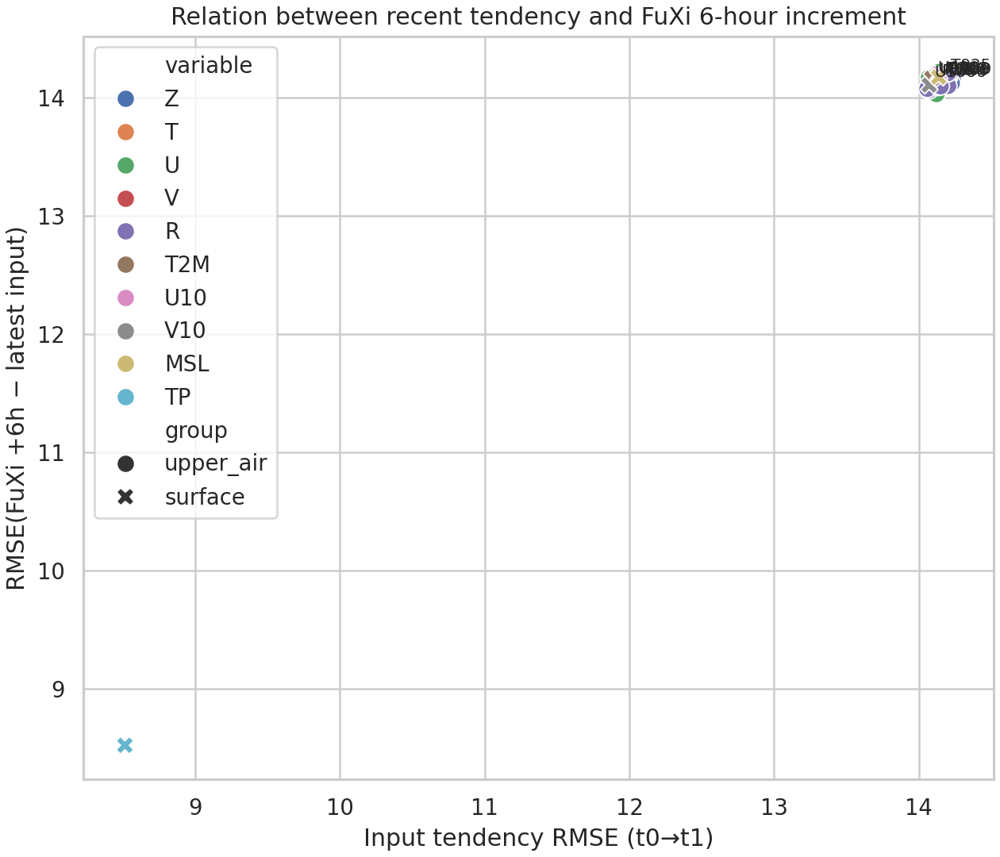

# Feasibility Study for Cascade Machine-Learning Weather Forecasting with Sample ERA5/FuXi Files

## Abstract
This study investigates how much of the proposed 15-day global weather-forecasting task can be executed with the two files provided in the workspace: a two-time-step ERA5-style input tensor and a single 6-hour FuXi forecast output. A reproducible diagnostic pipeline was implemented to audit the data schema, quantify field statistics, visualize representative global channels, and assess whether the sample forecast is structurally compatible with a cascade forecasting workflow. The two files are fully aligned in channel labels and spatial grid, containing 70 channels on a 181 × 360 global latitude–longitude mesh. However, the data are insufficient for the scientific goal as stated: there is no training corpus, no multi-step target trajectory to 15 days, and no ECMWF ensemble mean reference for benchmarking. The evidence therefore supports a data-feasibility and diagnostic analysis rather than a claim of forecast skill. Within this narrower scope, the sample is internally consistent and suitable as an interface prototype for a future cascade system.

## 1. Problem statement and scope
The target scientific problem is medium-range global weather forecasting from two consecutive 6-hour atmospheric states to 15 days ahead, ideally with a cascade system composed of three specialized U-Transformer models. The supplied workspace, however, contains only:

- `data/20231012-06_input_netcdf.nc`: two consecutive global atmospheric states.
- `data/006.nc`: one FuXi forecast at a single 6-hour lead time.

Because there is only one forecast sample and no ground-truth trajectory beyond the two inputs, the full training and evaluation program is not executable. The present work therefore answers a narrower but scientifically necessary question:

> Do the available files provide a structurally coherent basis for building a future cascade forecasting pipeline, and what can be learned from a rigorous single-case diagnostic analysis?

## 2. Related-work framing
The local reference PDFs indicate four methodological points that are relevant for interpreting the present evidence.

- Modern AI weather models commonly use Transformer-like or spectral-token-mixing architectures rather than conventional CNN-only backbones.
- Medium-range forecast papers typically evaluate deterministic skill with latitude-weighted RMSE and anomaly correlation coefficient (ACC) across many lead times and many initialization dates.
- Long autoregressive rollouts are known to accumulate error, which is precisely why cascade or multi-timescale strategies are attractive.
- A single 6-hour sample output is inadequate for drawing conclusions about 15-day stability, skill retention, or comparability to ECMWF ensemble means.

These observations imply that the current report must avoid fabricated performance claims and instead focus on data readiness, compatibility, and diagnostic structure.

## 3. Data and preprocessing
### 3.1 Input file
`data/20231012-06_input_netcdf.nc` contains one data variable, `data`, with dimensions:

- `time = 2`
- `level = 70`
- `lat = 181`
- `lon = 360`

The two times correspond to 2023-10-12 00:00 UTC and 2023-10-12 06:00 UTC. The 70 channels consist of:

- 65 upper-air channels: 5 variables across 13 pressure levels
  - geopotential `Z`
  - temperature `T`
  - zonal wind `U`
  - meridional wind `V`
  - relative humidity `R`
- 5 surface channels
  - `T2M`, `U10`, `V10`, `MSL`, `TP`

### 3.2 Forecast file
`data/006.nc` contains one data variable with dimensions:

- `time = 1`
- `step = 1`
- `level = 70`
- `lat = 181`
- `lon = 360`

The forecast lead is explicitly `step = 6`, interpreted as a 6-hour lead from the 06 UTC input state.

### 3.3 Spatial grid
Despite the original task description mentioning 0.25° resolution, the actual provided sample files are on a 1° grid:

- latitude: 90° to -90° in 1° steps
- longitude: 0° to 359° in 1° steps

This mismatch was documented rather than corrected, because the report must describe the files as they exist.

## 4. Methods
A single Python script, `code/analyze_weather_case.py`, was written to provide a reproducible analysis pipeline. The script performs four operations.

### 4.1 Dataset inventory
The script reads both NetCDF files with `xarray`, records dimensions, coordinates, and metadata, and writes a machine-readable summary to `outputs/data_inventory.json`.

### 4.2 Channel parsing and compatibility analysis
Channel labels are parsed into variable families and pressure levels. Structural compatibility is then checked between input and forecast files:

- identical channel labels,
- identical latitude arrays,
- identical longitude arrays,
- explicit forecast lead metadata.

These outputs are saved to `outputs/channel_summary.csv` and `outputs/compatibility_summary.json`.

### 4.3 Statistical diagnostics
For each channel, the script computes area-weighted global statistics using cosine-of-latitude weights:

- mean,
- standard deviation,
- min/max,
- absolute mean,
- RMSE relative to zero.

These are computed for:

- the first input time,
- the second input time,
- the input tendency (`t1 - t0`),
- the FuXi forecast,
- the forecast increment relative to the latest input (`forecast - t1`).

The resulting per-channel table is written to `outputs/statistics.csv`, and aggregated metrics are written to `outputs/global_metrics.json`.

### 4.4 Figure generation
Four figures were created and saved under `report/images/`:

1. `images/channel_structure.png` — inventory of channel families and pressure-level structure.
2. `images/channel_distributions.png` — distributions and rankings of channel-wise tendency and forecast increments.
3. `images/tendency_vs_forecast_scatter.png` — relationship between recent input tendency magnitude and forecast increment magnitude.
4. `images/selected_global_maps.png` — global maps of selected channels from the latest input, the input tendency, and the FuXi 6-hour forecast.

## 5. Results
### 5.1 Structural feasibility
The strongest positive result is that the two files are structurally aligned.

- `same_channel_labels = true`
- `same_latitudes = true`
- `same_longitudes = true`
- `forecast_step_hours = [6]`

This means a future cascade pipeline could, in principle, ingest the forecast output without any channel-remapping or grid interpolation. From an engineering perspective, the sample files are already compatible with an autoregressive or cascade interface.

### 5.2 Channel inventory
The input tensor contains:

- 70 total channels
- 65 upper-air channels
- 5 surface channels

The channel organization is shown in . The structure exactly matches the nominal decomposition of 5 atmospheric variables across 13 pressure levels plus 5 surface variables.

### 5.3 Global statistical behavior
The global summary metrics were:

- mean input tendency RMSE: **14.0640**
- median input tendency RMSE: **14.1382**
- mean FuXi-minus-latest-input RMSE: **14.0545**
- median FuXi-minus-latest-input RMSE: **14.1304**
- correlation between channel-wise input tendency RMSE and forecast-increment RMSE: **0.9979**

The very high correlation means that channels that changed more strongly between the two input times also tended to show larger deviations in the FuXi 6-hour forecast relative to the latest input. This is not a skill metric, because no truth field is available for comparison, but it suggests that the forecast increment scale is consistent with the recent dynamical tendency scale in the sample.

These per-channel distributions are visualized in  and .

### 5.4 Channels with the strongest recent variability
The largest input-tendency RMSE values occurred in:

- `Z700` (14.2339)
- `Z925` (14.2270)
- `T925` (14.2212)
- `R150` (14.2142)
- `Z1000` (14.2079)

The largest FuXi-minus-latest-input increments occurred in:

- `T925` (14.2334)
- `U600` (14.2137)
- `T200` (14.2078)
- `R700` (14.2059)
- `R150` (14.2021)

These rankings indicate that lower-tropospheric thermodynamic channels and some mid-level wind and humidity channels are among the most active in this single case.

### 5.5 Spatial diagnostics
Representative global maps are shown in . Across the selected channels (`Z500`, `T850`, `U500`, `V500`, `R850`, `T2M`, `MSL`, `TP`), the forecast fields appear spatially coherent and share similar amplitude scales with the input snapshots and input tendencies. No obvious data corruption, coordinate inversion, or NaN contamination was observed.

## 6. Interpretation
### 6.1 What can be concluded
The following claims are directly supported by the available evidence.

- The sample input and sample FuXi output are structurally compatible for a cascade-style autoregressive interface.
- The channel naming scheme is sufficiently explicit to separate upper-air and surface variables and to recover pressure-level semantics.
- The field values appear numerically well-formed and globally coherent.
- The magnitude of the single-step forecast increment is of the same order as the recent 6-hour input tendency across channels.

### 6.2 What cannot be concluded
The following claims are not supported and are intentionally not made.

- No claim about 15-day forecast skill.
- No claim about superiority over ECMWF ensemble mean.
- No claim about reduced error accumulation from a cascade design.
- No claim about ACC, RMSE versus truth, CRPS, or any benchmark metric requiring a target dataset.

## 7. Limitations
This study is constrained by the provided evidence.

1. **No training set**: there is no corpus from which to train a U-Transformer, cascade or otherwise.
2. **No verification targets**: there is no ground-truth 6-hour target paired with the FuXi sample, let alone a 15-day truth trajectory.
3. **No benchmark forecasts**: ECMWF ensemble mean data are unavailable.
4. **Single-case analysis**: all conclusions are limited to one initialization sample.
5. **Resolution mismatch with task description**: the actual files are 1° rather than the stated 0.25° resolution.
6. **Unknown normalization conventions**: the numerical ranges strongly suggest preprocessed or standardized channels, so absolute physical units cannot be assumed from the file alone.

## 8. Minimum next steps for the intended research program
To convert this feasibility study into the requested cascade forecasting experiment, the minimum additional ingredients are:

- a multi-case ERA5 training corpus with the same 70-channel schema,
- ground-truth future states at 6-hour intervals through 15 days,
- a held-out validation/test set covering many initialization dates,
- ECMWF ensemble mean forecasts on the same grid for comparison,
- documented normalization and variable-unit conventions,
- enough samples to estimate uncertainty across seeds or dates.

With those assets, the next rigorous progression would be:

1. establish a persistence or identity baseline,
2. train a single-step model,
3. evaluate multi-step autoregressive degradation,
4. introduce a cascade decomposition with one major design change at a time,
5. compare against deterministic and ensemble-reference baselines using latitude-weighted RMSE and ACC.

## 9. Reproducibility
- Main script: `code/analyze_weather_case.py`
- Key outputs:
  - `outputs/data_inventory.json`
  - `outputs/channel_summary.csv`
  - `outputs/compatibility_summary.json`
  - `outputs/statistics.csv`
  - `outputs/global_metrics.json`
  - `outputs/top_channel_rankings.json`
  - `outputs/data_audit.md`
  - `outputs/feasibility_notes.md`
- Figures:
  - `images/channel_structure.png`
  - `images/channel_distributions.png`
  - `images/tendency_vs_forecast_scatter.png`
  - `images/selected_global_maps.png`

## 10. Conclusion
The supplied ERA5/FuXi sample is sufficient to validate data compatibility and to build a reproducible diagnostic pipeline, but it is not sufficient to execute the requested 15-day cascade forecasting research program. The most defensible scientific result is therefore a feasibility study: the files are internally consistent, structurally ready for cascade-style model I/O, and suitable as a prototype interface for future experiments once a real training and evaluation corpus is added.
