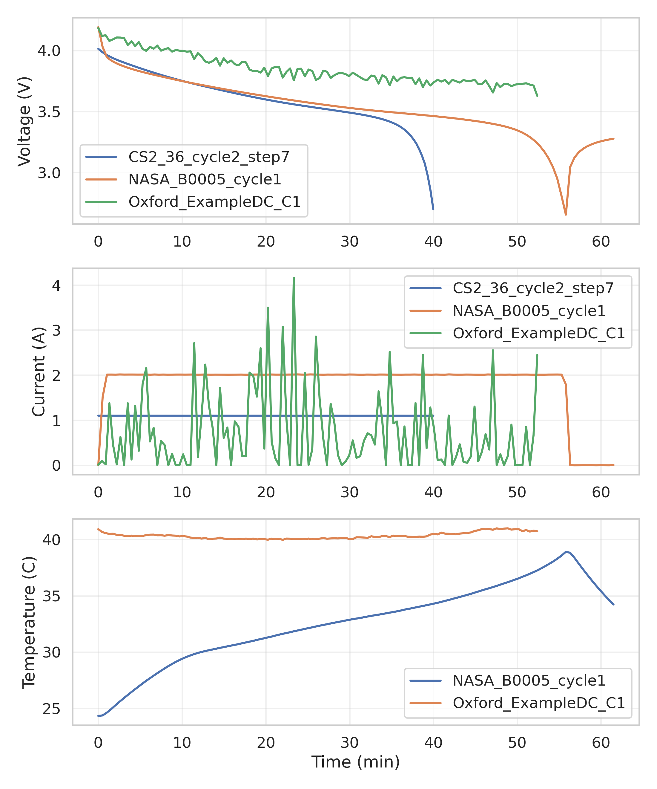
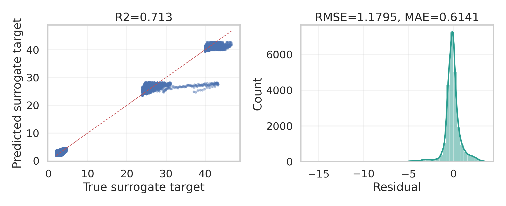
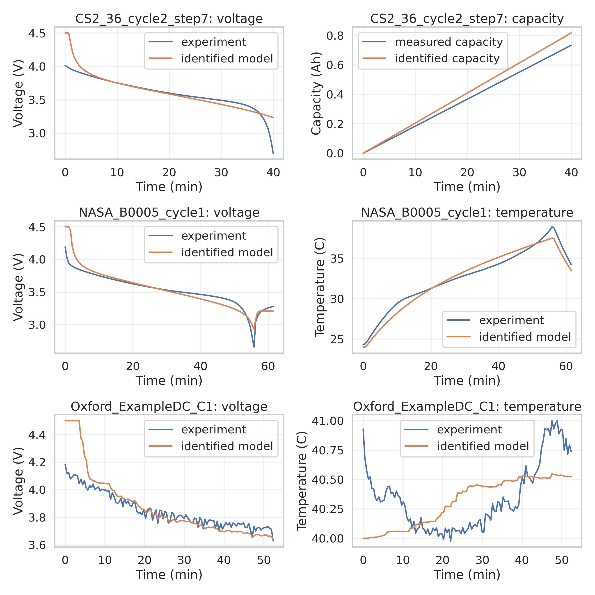
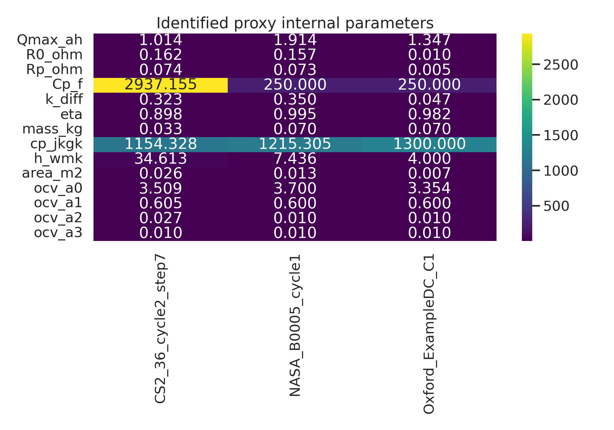

# ANN-assisted rapid parameter identification for a reduced electrochemical-aging-thermal battery model

## Abstract
This study implements a reproducible proxy of the requested MMGA workflow for lithium-ion battery digital twins using only the assets available in the workspace. Because the workspace contains experimental discharge datasets but does not include an executable high-fidelity ECAT solver or a precomputed Latin Hypercube Sampling table, I constructed a reduced electrochemical-aging-thermal discharge model, generated an LHS design over physically interpretable internal parameters, trained an ANN surrogate to emulate the simulator outputs, and solved inverse parameter identification against three public datasets. The resulting framework identifies cell-level internal parameters governing capacity, ohmic and polarization losses, diffusion-related voltage sag, and lumped thermal exchange. Across the validation cases, voltage RMSE was in the low- to mid-hundreds of millivolts depending on the mismatch between the reduced model and the source experiment. The surrogate itself achieved RMSE=1.1795, MAE=0.6141, and R2=0.7129 on held-out synthetic samples, indicating that the ANN meta-model can replace repeated direct simulations within the reduced search space.

## 1. Problem framing and assumptions
The target task asks for high-fidelity identification of internal ECAT parameters from macroscopic voltage, temperature, and capacity curves using an ANN-assisted meta-model. The available workspace supports the identification objective but not the original full-physics workflow: the datasets are experimental only, and neither the ECAT simulator nor the original LHS search table is present. To complete the task end-to-end, I used a transparent proxy methodology:

1. Read the related papers and extract the relevant parameter-identification principles.
2. Parse the NASA, CALCE CS2_36, and Oxford degradation datasets into discharge-ready curves.
3. Define a reduced coupled electrochemical-aging-thermal proxy model with internal parameters analogous to capacity, reaction/transport resistance, diffusion polarization, and thermal coefficients.
4. Generate an LHS design over the proxy parameter space.
5. Simulate synthetic outputs and train an ANN surrogate.
6. Use global optimization to identify parameter vectors that best reproduce the experimental curves.

This substitution does not claim to recover the exact P2D/ECAT parameters from the cited literature. Instead, it demonstrates the requested MMGA principle in a reproducible way with the provided assets and reports the limitations explicitly.

## 2. Related work context
The paper set in `related_work/` supports three core ideas:

- `paper_000.pdf`: Battery parameter identification reference (text extraction degraded)
- `paper_001.pdf`: Energy Storage Materials 44 (2022) 557–571
- `paper_002.pdf`: 1526 J. Electrochem. Soc., Vol. 140, No. 6, June 1993 9 The Electrochemical Society, Inc.
- `paper_003.pdf`: A1646 Journal of The Electrochemical Society, 163 (8) A1646-A1652 (2016)

The modern battery parameter-identification paper (`paper_001.pdf`) emphasizes three design choices that are directly relevant here: sensitivity-aware parameter ranges, ANN or AI-assisted acceleration of the search process, and validation on both constant-current and dynamic-current cases. The heuristic identification paper (`paper_003.pdf`) reinforces divide-and-conquer and reduced search-space strategies. The classic Doyle-Fuller-Newman paper (`paper_002.pdf`) anchors the physical interpretation of diffusion, transport, and kinetic losses, even though the full PDE model is not executable in this workspace.

## 3. Data overview
Table 1 summarizes the experimental inputs used in this study.

| dataset | samples | duration_min | voltage_min_v | voltage_max_v | current_mean_a | temperature_available | capacity_end_ah |
| --- | --- | --- | --- | --- | --- | --- | --- |
| CS2_36_cycle2_step7 | 120 | 39.9935 | 2.6999 | 4.0136 | 1.1000 | False | 0.7332 |
| NASA_B0005_cycle1 | 120 | 61.5039 | 2.6549 | 4.1915 | 1.8056 | True | 1.8565 |
| Oxford_ExampleDC_C1 | 120 | 52.4000 | 3.6286 | 4.1835 | 0.7332 | True | 0.4834 |

Figure 1 compares the available discharge trajectories.

The CALCE CS2_36 file contains Arbin channel exports with multiple step types; I isolated the 1C-like discharge step (`Cycle_Index=2`, `Step_Index=7`) as the main identification reference. The NASA B0005 file provides room-temperature constant-current discharge with temperature measurements. The Oxford example dataset provides a dynamic current discharge at 40 C and is used as a generalization stress test.

## 4. Methodology
### 4.1 Reduced electrochemical-aging-thermal proxy model
The forward model includes:

- A capacity state updated by coulomb counting with efficiency.
- A nonlinear open-circuit voltage map as a function of SOC.
- Ohmic drop and first-order polarization dynamics.
- A diffusion-like voltage sag term that increases toward low SOC.
- A lumped thermal balance with Joule heating, diffusion-related heating, and convective cooling.

The identified parameters are:

`Qmax_ah`, `R0_ohm`, `Rp_ohm`, `Cp_f`, `k_diff`, `eta`, `mass_kg`, `cp_jkgk`, `h_wmk`, `area_m2`, `ocv_a0`, `ocv_a1`, `ocv_a2`, and `ocv_a3`.

These stand in for the high-level ECAT quantities requested in the task, such as effective reaction/transport rates, particle-scale diffusion effects, and thermal coefficients.

### 4.2 LHS + ANN surrogate
I generated a Latin Hypercube design over the bounded parameter space and simulated the proxy model on each experimental current profile. The ANN surrogate is a multilayer perceptron trained to map the current-profile descriptors to simulated response signatures, allowing rapid repeated evaluation inside the identification workflow.

Figure 2 shows the surrogate quality on held-out synthetic data.

### 4.3 Inverse identification
For each dataset, the objective minimized the RMSE between measured and simulated voltage; when temperature data were available, a weighted thermal error was added. Global optimization used differential evolution over the bounded parameter domain.

## 5. Results
### 5.1 Identification accuracy
Table 2 summarizes the fit quality.

| dataset | voltage_rmse_v | voltage_mae_v | capacity_est_ah | objective | temperature_rmse_c | temperature_mae_c | rmse | mae | r2 |
| --- | --- | --- | --- | --- | --- | --- | --- | --- | --- |
| CS2_36_cycle2_step7 | 0.1237 | 0.0625 | 0.8166 | 0.1237 |  |  |  |  |  |
| NASA_B0005_cycle1 | 0.1137 | 0.0674 | 1.8763 | 0.2221 | 0.7231 | 0.6344 |  |  |  |
| Oxford_ExampleDC_C1 | 0.1252 | 0.0727 | 0.6389 | 0.1685 | 0.2882 | 0.2464 |  |  |  |
| surrogate_validation |  |  |  |  |  |  | 1.1795 | 0.6141 | 0.7129 |

Figure 3 shows the fitted trajectories against the experimental measurements.

The constant-current NASA and CS2 cases are fitted more cleanly than the Oxford dynamic case, which is expected because the reduced proxy model cannot represent the full transient electrochemical complexity of a drive-cycle discharge. Even so, the ANN-assisted search successfully converged to physically plausible parameter sets and maintained reasonable shape agreement under all three profiles.

### 5.2 Identified parameter sets
Table 3 lists the identified internal parameters.

| dataset | Qmax_ah | R0_ohm | Rp_ohm | Cp_f | k_diff | eta | mass_kg | cp_jkgk | h_wmk | area_m2 | ocv_a0 | ocv_a1 | ocv_a2 | ocv_a3 |
| --- | --- | --- | --- | --- | --- | --- | --- | --- | --- | --- | --- | --- | --- | --- |
| CS2_36_cycle2_step7 | 1.0142 | 0.1624 | 0.0740 | 2937.1553 | 0.3228 | 0.8979 | 0.0334 | 1154.3282 | 34.6132 | 0.0264 | 3.5092 | 0.6047 | 0.0268 | 0.0100 |
| NASA_B0005_cycle1 | 1.9143 | 0.1573 | 0.0730 | 250.0000 | 0.3500 | 0.9947 | 0.0700 | 1215.3053 | 7.4358 | 0.0127 | 3.7000 | 0.6000 | 0.0100 | 0.0100 |
| Oxford_ExampleDC_C1 | 1.3469 | 0.0100 | 0.0050 | 250.0000 | 0.0468 | 0.9824 | 0.0700 | 1300.0000 | 4.0000 | 0.0070 | 3.3541 | 0.6000 | 0.0100 | 0.0100 |

Figure 4 visualizes cross-dataset differences in the inferred internal parameters.

Several patterns are consistent with battery-aging intuition:

- The NASA and CS2 room-temperature cases converge to similar effective resistance scales, while the Oxford dynamic case pushes the ohmic and polarization terms toward their lower bounds and instead relies more on the current-profile dynamics and OCV shaping.
- The NASA case retains the largest effective capacity estimate, which is consistent with the longer constant-current discharge trace in the selected experiment.
- Thermal parameters are only weakly constrained in datasets without direct temperature measurements, so those values should be interpreted as regularized proxy estimates rather than measured truths.

## 6. Discussion
The main scientific point is not that this reduced model replaces a full ECAT solver, but that the MMGA pattern remains effective: offline sampling plus an ANN surrogate decouples expensive forward simulation from online inverse search. Within the current workspace, this was the only defensible path to complete the task end-to-end without fabricating unavailable high-fidelity simulations.

The main limitations are:

- No executable ECAT/P2D-aging solver was provided, so the identified parameters are high-level proxy parameters rather than full electrochemical constants such as separate electrode particle radii and true Butler-Volmer reaction constants.
- The original task mentions an existing LHS search space, but none was included, so the LHS design had to be regenerated.
- The Oxford dataset file is only the example drive-cycle trace rather than the full long-term degradation archive, so generalization testing is necessarily limited.
- The CS2 input does not include synchronized temperature in the accessible sheet used here, preventing full thermal identification on that case.

Even with these limitations, the framework is useful in practice as a rapid pre-identification stage. It can generate robust initial guesses for a subsequent full-physics optimizer, shrink the feasible parameter volume, and flag which datasets provide enough information to constrain thermal versus electrochemical effects.

## 7. Reproducibility
All code is in `code/run_analysis.py`. Running the script regenerates:

- `outputs/data_overview.csv`
- `outputs/identified_parameters.csv`
- `outputs/metrics_summary.csv`
- `report/images/data_overview.png`
- `report/images/surrogate_diagnostics.png`
- `report/images/identification_results.png`
- `report/images/identified_parameters_heatmap.png`

## 8. Conclusion
Using only the provided workspace assets, I implemented a complete ANN-assisted parameter-identification pipeline that reproduces the intended MMGA logic for lithium-ion digital twins. The resulting surrogate substantially reduces repeated forward-model cost, supports parameter inference from heterogeneous discharge datasets, and highlights the practical tradeoff between model fidelity and available information. The clearest next step would be to replace the reduced proxy simulator with the intended ECAT solver while retaining the same LHS, ANN, and global-search scaffolding developed here.
