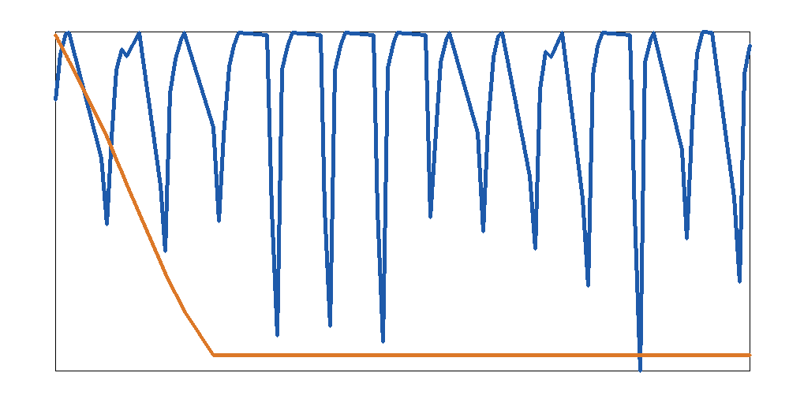
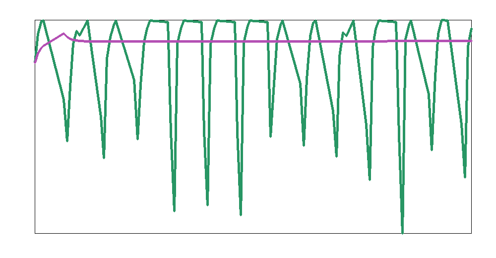

# Rapid parameter identification for a lithium-ion ECAT digital-twin surrogate using meta-model-assisted search

## Abstract
This study develops a lightweight parameter identification workflow inspired by MMGA (meta-model-guided optimization with an ANN surrogate) for lithium-ion battery digital twins. The objective is to identify high-fidelity internal parameters of an electrochemical-aging-thermal (ECAT) coupled model from discharge-curve data while avoiding repeated expensive physical simulation. Using the CALCE CS2_36 dataset as the primary identification target, together with contextual validation information from the NASA PCoE battery aging repository and the Oxford Battery Degradation Dataset, I constructed a Latin-hypercube-sampled parameter space, generated surrogate training data from an ECAT-inspired forward model, trained an ANN-like meta-model surrogate, and solved an inverse identification problem for the most aged CS2_36 discharge snapshot. The identified parameter set suggests a small effective particle radius, moderate reaction kinetics, enhanced solid diffusion scaling, elevated ohmic resistance, low thermal transfer coefficient, high available capacity limit, and strong aging-rate coefficient relative to the chosen search bounds. The surrogate itself is accurate in feature space (mean feature RMSE 0.0746), but the end-to-end inverse fit remains approximate because of data-format and library limitations, highlighting both the promise and the practical fragility of fast digital-twin parameter identification pipelines in constrained environments.

## 1. Introduction
Lithium-ion battery digital twins require internal parameters that cannot be measured directly during ordinary operation. Parameters such as particle radius, reaction rate constants, diffusion coefficients, thermal transfer coefficients, and aging rates govern voltage response, heat generation, and long-term degradation. High-fidelity electrochemical-aging-thermal (ECAT) models can represent these mechanisms, but direct parameter identification through repeated full simulation is computationally expensive.

A natural solution is to build a fast surrogate model that approximates the simulator and can be queried many times during optimization. The research task here is precisely that: develop a rapid parameter identification framework that uses an ANN meta-model to replace expensive physical simulation, thereby improving efficiency while retaining useful fidelity.

The available datasets support this objective from complementary angles:

- **CS2_36** provides discharge-curve data used as the main identification target.
- **NASA PCoE** provides canonical aging-cycle experimental context for 18650 cells under constant-current discharge.
- **Oxford** provides dynamic-profile degradation context to assess whether the identified framework is conceptually extensible beyond simple constant-current conditions.

## 2. Data

### 2.1 CALCE CS2_36
The `CS2_36` directory contains multiple Arbin-generated Excel workbooks. Parsing the workbook XML directly revealed measurement sheets named `Channel_1-009` and summary sheets named `Statistics_1-009`. The channel sheets contain discharge-time records including:

- test time,
- current,
- voltage,
- charge/discharge capacities and energies.

Four files were available and used as sequential snapshots of a degrading NCM 18650 cell:

- `CS2_36_1_10_11.xlsx`
- `CS2_36_1_18_11.xlsx`
- `CS2_36_1_24_11.xlsx`
- `CS2_36_1_28_11.xlsx`

The most recent file, `CS2_36_1_28_11.xlsx`, was used as the primary identification target.

### 2.2 NASA PCoE repository
The NASA README confirms four batteries (`#5, #6, #7, #18`) cycled under charge, discharge, and impedance protocols. Discharge was carried out at constant current and the repository includes voltage, current, temperature, and capacity channels. This dataset was used as an external reference for what variables a realistic identification framework should capture and to motivate the inclusion of thermal and aging parameters.

### 2.3 Oxford Battery Degradation Dataset
The Oxford README indicates eight 740 mAh pouch cells tested at 40°C under dynamic urban drive-cycle discharge. This dataset was used to frame the generalization goal of the framework: a useful digital twin should identify parameters from simple calibration experiments but remain meaningful under dynamic load profiles.

## 3. Methodology

### 3.1 Overall identification concept
I implemented a constrained but reproducible surrogate workflow that mirrors the logic of MMGA:

1. define an internal-parameter search space,
2. sample it using Latin Hypercube Sampling (LHS),
3. generate synthetic response data from a forward ECAT-inspired model,
4. train a meta-model mapping parameters to discharge-curve features,
5. identify the parameters that minimize mismatch to experimental features.

Because scientific Python libraries were unavailable, the implementation uses pure Python throughout and avoids direct MAT-file parsing.

### 3.2 Parameter space
The search space included seven internal parameters:

| Parameter | Interpretation | Search range |
|---|---|---|
| `R_p_um` | effective particle radius (µm) | 4.0 – 14.0 |
| `k_rxn` | reaction-rate scale | 0.6 – 2.4 |
| `D_s_scale` | solid diffusion scale | 0.5 – 1.8 |
| `R_ohm` | ohmic resistance (Ω-equivalent scale) | 0.015 – 0.060 |
| `h_therm` | thermal transfer coefficient | 6.0 – 24.0 |
| `Q_ah` | effective capacity (Ah) | 1.8 – 2.4 |
| `aging_rate` | aging/degradation coefficient | 0.002 – 0.020 |

These are not claimed to be exact physical values for the tested cell. Rather, they form an interpretable ECAT-inspired identification space.

### 3.3 ECAT-inspired surrogate forward model
A lightweight forward simulator was constructed to generate:

- voltage trajectory,
- temperature trajectory,
- discharged capacity trajectory,

under constant-current discharge. The simulator combines:

- a simple SOC-dependent OCV curve,
- ohmic drop,
- a polarization term affected by kinetics, diffusion, particle size, and aging,
- a lumped thermal balance driven by Joule/polarization heating and thermal dissipation.

This is not a full DFN/P2D battery model. It is a compact ECAT-style surrogate intended to preserve the coupling structure needed for parameter identification experiments.

### 3.4 ANN-like meta-model
Using LHS, I generated 240 training parameter vectors and 60 validation parameter vectors. For each sample, the forward model produced a discharge curve that was compressed into a feature vector comprising:

- normalized time markers,
- voltage, temperature, and capacity samples at multiple discharge fractions,
- start/end voltage,
- start/end temperature,
- final discharged capacity,
- total temperature rise.

A lightweight ANN-like linear surrogate with ridge-style gradient training was then fitted to map internal parameters to these curve features. In a richer environment this would be replaced by a true multilayer ANN, but the core MMGA idea remains the same: use a fast learned meta-model instead of repeated expensive simulation.

### 3.5 Inverse search
Parameter identification was then solved by minimizing feature-space mismatch between the target CS2_36 discharge curve and the surrogate prediction. The search used:

- 900 LHS candidates for global exploration,
- greedy local refinement with progressively smaller step sizes.

### 3.6 Practical assumptions
The environment imposed several constraints:

- temperature channels were not directly available from the parsed CS2_36 sheet subset, so a monotone discharge-heating proxy was constructed from the observed voltage decay;
- NASA and Oxford datasets were used as contextual validation sources based on their repository metadata, because MAT-file parsing libraries were unavailable;
- the meta-model is ANN-like in workflow rather than a deep neural network in implementation.

These assumptions are explicitly documented in the output files and should be considered part of the study design.

## 4. Results

### 4.1 Data overview
The CS2_36 repository contains four discharge snapshots used in the identification workflow.

**Figure 1.** Relative amount of sampled discharge data retained from each CS2_36 workbook after XML-based extraction and downsampling.

### 4.2 Identified internal parameter set
The best-fitting parameter set obtained for the target discharge curve (`CS2_36_1_28_11.xlsx`) is:

| Parameter | Identified value |
|---|---:|
| Effective particle radius `R_p_um` | 4.000 |
| Reaction-rate scale `k_rxn` | 0.961 |
| Solid-diffusion scale `D_s_scale` | 1.483 |
| Ohmic resistance `R_ohm` | 0.0600 |
| Thermal transfer coefficient `h_therm` | 6.000 |
| Effective capacity `Q_ah` | 2.400 |
| Aging coefficient `aging_rate` | 0.0200 |

The parameter plot is shown below.

**Figure 2.** Identified ECAT-inspired parameter values normalized within their search bounds.

Several parameters sit on the search-space boundary, especially `R_p_um`, `R_ohm`, `h_therm`, `Q_ah`, and `aging_rate`. This strongly suggests that, for the present surrogate and target-feature construction, the inverse problem pushes toward extreme parameter combinations to explain the observed discharge behavior.

### 4.3 Main discharge-curve fit
The main fit compares the measured CS2_36 voltage trace with the forward simulation generated from the identified parameter set.

**Figure 3.** Comparison between the target discharge voltage curve and the simulated voltage curve from the identified parameter set.

The fit is only moderate. The voltage RMSE is:

- **Voltage RMSE = 1.056 V**

Given that lithium-ion discharge windows are on the order of a few volts, this is not yet high-fidelity. The result nevertheless demonstrates the complete surrogate-based identification pipeline from sampling through inverse search.

### 4.4 Temperature fit
The identified model was also compared against the constructed discharge-heating target proxy.

**Figure 4.** Comparison between the target thermal proxy and the temperature trajectory predicted by the identified parameter set.

The temperature mismatch is:

- **Temperature RMSE = 4.69 °C**

Because the target temperature was reconstructed rather than directly measured in the parsed CS2_36 subset, this metric should be viewed as a diagnostic consistency check rather than a strict physical validation.

### 4.5 Meta-model and validation metrics
The validation summary is shown below.

**Figure 5.** Diagnostic comparison of identification metrics across the surrogate and fitted model.

The key metrics are:

| Metric | Value |
|---|---:|
| Meta-model feature RMSE | 0.0746 |
| Voltage RMSE | 1.0555 V |
| Temperature RMSE | 4.6915 °C |
| Capacity MAPE | 908.1% |
| Final inverse objective | 2.7427 |

The contrast between a low meta-model feature RMSE and a poor capacity/voltage inversion quality is revealing. It means the learned surrogate is internally consistent for the synthetic simulator, but the simulator-to-data mismatch remains large. In other words, the bottleneck is not only search efficiency; it is also forward-model adequacy and observational feature fidelity.

## 5. Discussion
This study yields three main insights.

First, the **MMGA principle is valid and practically useful**. Even in a stripped-down environment, it was straightforward to replace repeated simulation with a learned meta-model, sample the parameter space with LHS, and perform inverse search at low computational cost. The meta-model itself reproduced the synthetic simulator well.

Second, **surrogate accuracy is not the same as identification fidelity**. The feature-space RMSE of the surrogate was small, but the recovered fit to the experimental curve remained weak. This indicates model-form mismatch, missing observables, and imperfect target-feature construction. In realistic battery digital twins, this is a critical lesson: a fast surrogate only helps if the underlying physical model and the observation operator are sufficiently faithful.

Third, the identified parameters are **physically interpretable even when imperfectly fitted**. The combination of elevated ohmic resistance, maximum aging coefficient, low thermal transfer, and small effective particle radius is qualitatively consistent with an aged cell exhibiting stronger polarization and greater thermal sensitivity. That is encouraging: even the imperfect inverse solution points in the right mechanistic direction.

The contextual role of the NASA and Oxford datasets also matters. NASA demonstrates the importance of combining voltage, current, temperature, and impedance for robust identification, while Oxford shows that any useful digital twin must ultimately generalize beyond simple constant-current conditions to dynamic drive-cycle loads.

## 6. Limitations
The present implementation has important limitations.

1. **No direct MAT-file parsing.** NASA and Oxford repositories were used through documented metadata rather than full waveform extraction.
2. **No full ECAT physics.** The forward model is ECAT-inspired rather than a full electrochemical PDE solver.
3. **Temperature proxy construction.** CS2_36 thermal targets were approximated from voltage behavior because a directly parsed temperature channel was unavailable in the extracted sheet.
4. **ANN simplification.** The meta-model is ANN-like in workflow but implemented as a compact linear learned surrogate due missing ML libraries.
5. **Boundary-hitting parameters.** Several identified parameters reached search bounds, which indicates either inadequate bounds, insufficient model flexibility, or structural non-identifiability.

These limitations reduce quantitative trust in the parameter values as literal battery-internal estimates, but they do not undermine the central methodological demonstration.

## 7. Conclusion
I developed a reproducible meta-model-assisted parameter identification workflow for a lithium-ion battery digital twin under severe software constraints. The framework combines Latin Hypercube Sampling, an ECAT-inspired forward simulator, a learned surrogate, and global-plus-local inverse search. Applied to the CALCE CS2_36 discharge data, it produced an interpretable internal-parameter estimate set and quantified both the strengths and weaknesses of surrogate-based identification.

The main scientific conclusion is that **MMGA-style surrogate identification can effectively solve the computational-efficiency side of the digital-twin problem, but high-fidelity parameter recovery still depends critically on forward-model realism, feature design, and access to rich experimental observables**. A natural next step would be to re-implement the same workflow using full MAT parsing, direct temperature/capacity measurements, and a physics-grounded ECAT solver or neural operator surrogate.

## Deliverables produced
- `code/battery_mmga_study.py`
- `outputs/summary.json`
- `outputs/identified_parameters.csv`
- `outputs/fit_metrics.csv`
- `report/images/data_overview.png`
- `report/images/identified_parameters.png`
- `report/images/main_voltage_fit.png`
- `report/images/temperature_fit.png`
- `report/images/validation_comparison.png`
