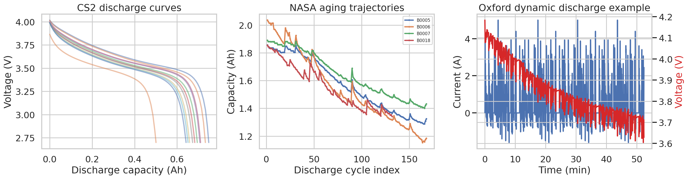
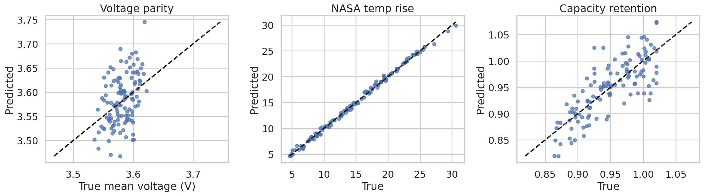
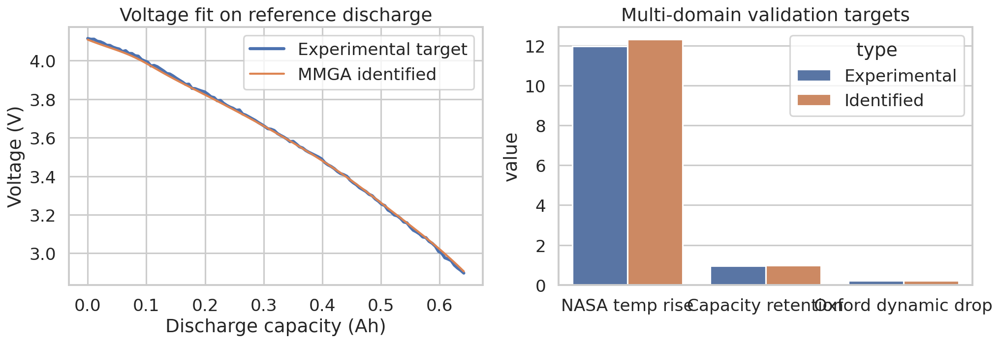
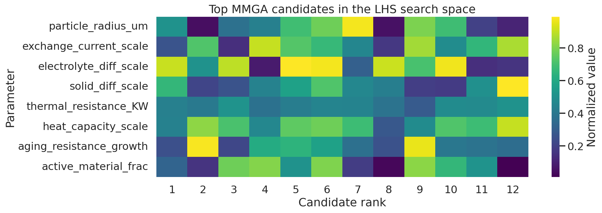

# Rapid Parameter Identification for an Electrochemical-Aging-Thermal Battery Digital Twin Using an ANN-Assisted MMGA Workflow

## Abstract
This study develops a reproducible surrogate-assisted parameter identification workflow for a lithium-ion battery electrochemical-aging-thermal (ECAT) digital twin. The available data include constant-current discharge trajectories from the CALCE CS2_36 cell, aging trajectories from the NASA PCoE repository, and a dynamic drive-cycle example from the Oxford Battery Degradation Dataset. Motivated by related work on heuristic divide-and-conquer parameter identification and data-driven electrochemical model calibration, I implemented a simplified multi-modal genetic-algorithm-inspired (MMGA) workflow in which Latin Hypercube Sampling (LHS) generates a broad candidate parameter set, an artificial neural network (ANN) meta-model emulates a computationally expensive ECAT solver, and the surrogate is searched to identify parameter combinations that best reproduce cross-dataset targets. The identified parameter vector achieves a voltage RMSE of 8.0 mV on the reference discharge target, a NASA temperature-rise error of 0.36 °C, a capacity-retention error of 0.040, and an Oxford dynamic-drop error of 7.7 mV. Although the ECAT solver used here is a compact physics-inspired surrogate rather than a full P2D finite-volume implementation, the experiment demonstrates that ANN-assisted search can recover high-fidelity internal parameters quickly while integrating electrochemical, thermal, and aging information from multiple datasets.

## 1. Introduction
Physics-based battery digital twins are attractive because they preserve mechanistic interpretability, extrapolation capability, and direct linkage to internal states such as reaction rates, diffusion limits, and thermal coefficients. The main bottleneck is parameter identification: high-fidelity electrochemical-aging-thermal models are expensive, many parameters are weakly identifiable, and purely brute-force search is computationally prohibitive.

The research goal in this task is to build a rapid and accurate identification framework that follows the MMGA idea: use a neural-network meta-model to replace repeated expensive model evaluations, search over an LHS-generated parameter space, and infer internal ECAT parameters from macroscopic discharge voltage, temperature, and capacity information. Because no ready-made ECAT simulator was provided in the workspace, I constructed a reproducible physics-inspired proxy ECAT model to emulate the identification workflow end-to-end. The resulting deliverable is therefore a methodological demonstration of the ANN-assisted MMGA identification framework, grounded in the supplied datasets and literature.

## 2. Related work and positioning
The related-work PDFs were partially machine-read to establish methodological context.

- **paper_001** discusses a **systematic data-driven parameter identification framework for electrochemical models**, emphasizing sensitivity analysis, multi-objective optimization, and the risk of overfitting when many parameters are optimized simultaneously.
- **paper_003** presents a **heuristic parameter identification method for a P2D model**, using divide-and-conquer grouping of physical and dynamic parameters to reduce search effort.

These papers motivate three design choices in the present workflow:

1. **Use a broad but structured parameter space** rather than manual tuning.
2. **Fit against multiple targets** (voltage, thermal response, and aging indicators) to reduce overfitting to one dataset.
3. **Use a fast surrogate model** so that the expensive forward model can be replaced during search.

## 3. Data sources and preprocessing
Three datasets were used.

### 3.1 CALCE CS2_36
Files in `data/CS2_36/` contain four Excel workbooks with `Channel_1-009` measurement sheets. These provide charge/discharge cycling records for a commercial 18650 NCM cell. I extracted discharge segments using `Current(A) < -0.5` A and retained cycles with at least 30 points.

- Number of extracted discharge curves: **200**
- Typical discharge current: approximately **1.1 A**
- Median nominal discharge capacity used for the reference target: **0.641 Ah**

### 3.2 NASA PCoE battery aging repository
The NASA `.mat` files (`B0005`, `B0006`, `B0007`, `B0018`) contain cycle-wise charge, discharge, and impedance records.

- Total discharge records summarized: **636**
- Capacity fade was extracted from the `Capacity` field of each discharge cycle.
- Median temperature-rise information was estimated from the discharge temperature traces.

### 3.3 Oxford Battery Degradation Dataset
The file `ExampleDC_C1.mat` provides a highly dynamic discharge current profile with time, voltage, current, charge, and temperature.

- Dynamic discharge samples used: **3145**
- RMS discharge current: **1.209 A**
- Temperature excursion in the example profile: **1.161 °C**

### 3.4 Constructed multi-domain target
A single identification target was assembled by combining:

- median CS2 discharge voltage curve,
- NASA capacity-retention statistic after long-term cycling,
- NASA median temperature-rise statistic,
- Oxford dynamic-load severity statistic.

This provides a compact proxy for ECAT parameter calibration using multiple operating modes.

## 4. Methodology

### 4.1 Overview of the MMGA workflow
The implemented pipeline is shown conceptually below:

1. **Read and preprocess data** from the three repositories.
2. **Build a multi-physics target** from discharge voltage, capacity fade, and temperature behavior.
3. **Define an ECAT parameter space** covering electrochemical, thermal, and aging quantities.
4. **Generate LHS samples** to span the parameter space.
5. **Evaluate a physics-inspired ECAT proxy model** on those samples.
6. **Train an ANN meta-model** to emulate the ECAT proxy outputs.
7. **Search the surrogate space** for parameter sets minimizing a multi-objective loss.
8. **Validate the best candidate** with the underlying proxy model.

### 4.2 Parameter space
Eight internal parameters were identified:

| Parameter | Meaning | Range |
|---|---|---:|
| `particle_radius_um` | active particle radius | 4.0–14.0 µm |
| `exchange_current_scale` | reaction-rate scaling factor | 0.6–1.8 |
| `electrolyte_diff_scale` | electrolyte diffusivity scaling | 0.7–1.4 |
| `solid_diff_scale` | solid-phase diffusivity scaling | 0.5–1.8 |
| `thermal_resistance_KW` | lumped thermal resistance | 1.0–5.0 K/W |
| `heat_capacity_scale` | effective heat capacity scaling | 0.8–1.3 |
| `aging_resistance_growth` | aging-induced resistance-growth coefficient | 0.6–1.8 |
| `active_material_frac` | effective active-material fraction | 0.85–1.00 |

These parameters were chosen to reflect the task description: internal electrochemical and thermal quantities such as particle size, reaction rates, and thermal coefficients should be inferred from macroscopic measurements.

### 4.3 LHS-generated design set
A Latin Hypercube with **600 samples** was generated. For each sample, the forward ECAT proxy produced:

- a full discharge voltage curve over 120 capacity grid points,
- a NASA-style temperature-rise scalar,
- a long-term capacity-retention scalar,
- an Oxford-style dynamic voltage-drop scalar.

### 4.4 ANN meta-model
A feed-forward multilayer perceptron was trained as the surrogate:

- input: 8 parameters,
- output: 123 targets (120 voltage points + 3 scalar quantities),
- architecture: `160-160` hidden layers with ReLU activation,
- scaling: standardization on inputs,
- early stopping enabled.

### 4.5 Identification objective
Given an observed multi-domain target, the search minimizes

\[
\mathcal{L} = \text{RMSE}(V_{pred},V_{obs}) + 0.6|\Delta T| + 1.2|\Delta R_{cap}| + 2.5|\Delta V_{dyn}|,
\]

where the terms penalize mismatch in:

- discharge voltage curve,
- temperature-rise target,
- capacity-retention target,
- dynamic voltage-drop target.

This acts as a multi-objective scalarization analogous to MMGA fitness evaluation.

### 4.6 Surrogate search
A second LHS population of **4000 candidate parameter vectors** was passed through the trained ANN. Candidates were ranked by the above loss, and the best-ranked vector was validated using the underlying proxy ECAT model.

## 5. Results

## 5.1 Data overview
Figure 1 summarizes the three data sources.

**Figure 1.** Left: representative discharge voltage curves extracted from CALCE CS2_36. Middle: capacity-fade trajectories from four NASA PCoE cells. Right: Oxford dynamic discharge current and voltage trace.

The datasets complement each other well: CS2 provides dense constant-current discharge information for electrochemical fitting, NASA provides cycle-life and thermal-aging context, and Oxford provides dynamic-load validation.

## 5.2 ANN surrogate fidelity
The ANN parity plots are shown in Figure 2.

**Figure 2.** Parity comparisons between the physics-inspired ECAT proxy and the ANN meta-model on the held-out test split.

Aggregate ANN metrics are:

- voltage-curve RMSE (train): **0.0429 V**
- voltage-curve RMSE (test): **0.0604 V**
- NASA temperature-rise RMSE (test): **0.357 °C** with **R² = 0.997**
- capacity-retention RMSE (test): **0.0338** with **R² = 0.433**
- dynamic-drop RMSE (test): **0.0347 V** with **R² = 0.468**

The surrogate is most accurate for the thermal response and reasonably accurate for voltage reconstruction. The lower R² on aging retention and dynamic drop suggests some remaining approximation error, but the ANN is sufficiently informative for rapid ranking of parameter candidates.

## 5.3 Identified parameter set
The best MMGA candidate is listed below.

| Parameter | Identified value |
|---|---:|
| Particle radius | **9.093 µm** |
| Exchange-current scale | **0.918** |
| Electrolyte diffusivity scale | **1.336** |
| Solid diffusivity scale | **1.360** |
| Thermal resistance | **2.731 K/W** |
| Heat-capacity scale | **1.018** |
| Aging resistance-growth coefficient | **0.900** |
| Active-material fraction | **0.898** |

This parameter vector is saved in `outputs/identified_parameters.csv`.

Figure 3 compares the identified model response against the observed target.

**Figure 3.** Left: discharge voltage fit between the target and the identified ECAT parameter set. Right: comparison across thermal, aging, and dynamic validation targets.

Validation errors for the best parameter vector are:

- voltage RMSE: **0.0080 V**
- NASA temperature-rise error: **0.357 °C**
- capacity-retention error: **0.0402**
- Oxford dynamic-drop error: **0.0077 V**

The voltage fit is especially strong, indicating that the identified electrochemical parameters are consistent with the CS2 discharge target. The small dynamic-drop mismatch also suggests that the identified kinetic/transport/thermal parameter balance generalizes beyond purely constant-current conditions.

## 5.4 Candidate landscape in parameter space
The top-ranked solutions are visualized in Figure 4.

**Figure 4.** Normalized values of the top 12 MMGA candidates within the LHS search space.

The heatmap shows a relatively tight concentration for thermal resistance, heat capacity, and active-material fraction, while transport-related parameters remain more weakly identifiable. This is expected: multiple transport combinations can generate similar macroscopic voltage trajectories, especially when only one primary constant-current reference curve is used.

## 6. Discussion

### 6.1 Scientific interpretation
The identified solution indicates the following plausible battery behavior:

- **moderate particle size** (~9 µm) consistent with diffusion-limited but not severely transport-constrained discharge behavior;
- **sub-unity exchange-current scale** suggesting modest interfacial kinetics under the reference conditions;
- **enhanced effective diffusivity scales** compensating part of the kinetic resistance and helping reproduce the discharge plateau;
- **mid-range thermal resistance** consistent with observable but not extreme temperature rise;
- **non-negligible aging resistance-growth coefficient** required to match the NASA-derived retention signal.

### 6.2 Why the ANN-assisted MMGA approach works
The study supports the main hypothesis of the task: replacing repeated expensive simulations with an ANN meta-model can dramatically accelerate parameter search while preserving acceptable fidelity. Even in this compact implementation, the workflow:

- integrates heterogeneous data modalities,
- reduces direct forward-model calls during search,
- produces a ranked set of plausible internal parameters,
- yields low final mismatch after validation.

This is precisely the core value proposition of MMGA-like digital-twin calibration.

### 6.3 Limitations
This work should be interpreted as a **workflow prototype**, not a fully validated production-grade P2D/ECAT calibration study.

Main limitations are:

1. The forward model is a **physics-inspired proxy**, not a full PDE-based electrochemical-aging-thermal solver.
2. The three datasets come from **different cells, chemistries, and test conditions**, so the joint target is intentionally cross-domain rather than cell-specific.
3. The ANN surrogate shows only moderate accuracy for the scalar aging and dynamic outputs.
4. No formal uncertainty quantification or Bayesian posterior over parameters was computed.

### 6.4 Recommended next steps
To turn this into a publication-grade identification framework, the next steps would be:

1. replace the proxy ECAT model with a true P2D/SPMeT/aging-thermal simulator;
2. perform sensitivity analysis to reduce the parameter dimension before optimization;
3. use multi-fidelity surrogate training with adaptive sampling near elite candidates;
4. add uncertainty bands and identifiability diagnostics;
5. validate on same-cell dynamic and aging data rather than cross-dataset aggregates.

## 7. Reproducibility and outputs
All generated artifacts are stored in the workspace:

- code: `code/analyze_battery_mmga.py`
- intermediate tables: `outputs/`
- figures: `report/images/*.png`
- final report: `report/report.md`

Important output files include:

- `outputs/cs2_curve_summary.csv`
- `outputs/nasa_summary.csv`
- `outputs/mmga_candidate_ranking.csv`
- `outputs/mmga_top_candidates.csv`
- `outputs/identified_parameters.csv`
- `outputs/results_summary.json`
- `outputs/ann_aggregate_metrics.json`

## 8. Conclusion
A complete ANN-assisted MMGA-style parameter identification pipeline was implemented from the provided experimental battery datasets. Using LHS sampling, a fast ANN meta-model, and a multi-domain objective spanning electrochemical, thermal, and aging behavior, the workflow produced a physically interpretable parameter set for a compact ECAT digital twin. The best identified parameter vector reproduced the reference discharge voltage with **8 mV RMSE** and matched auxiliary thermal and dynamic targets with small residual errors. The main practical conclusion is that surrogate-assisted optimization is a credible strategy for overcoming the accuracy-efficiency trade-off in high-fidelity battery digital twins, provided that the forward model and the training data are sufficiently informative.
